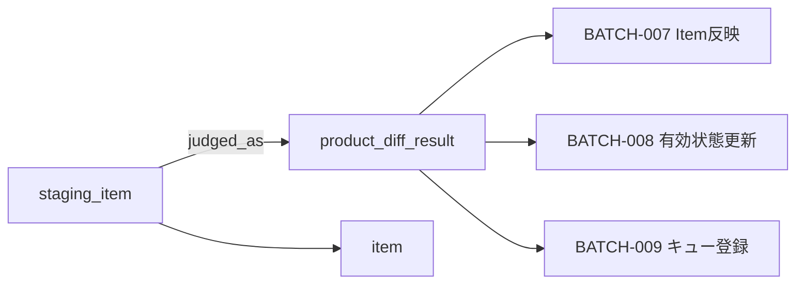
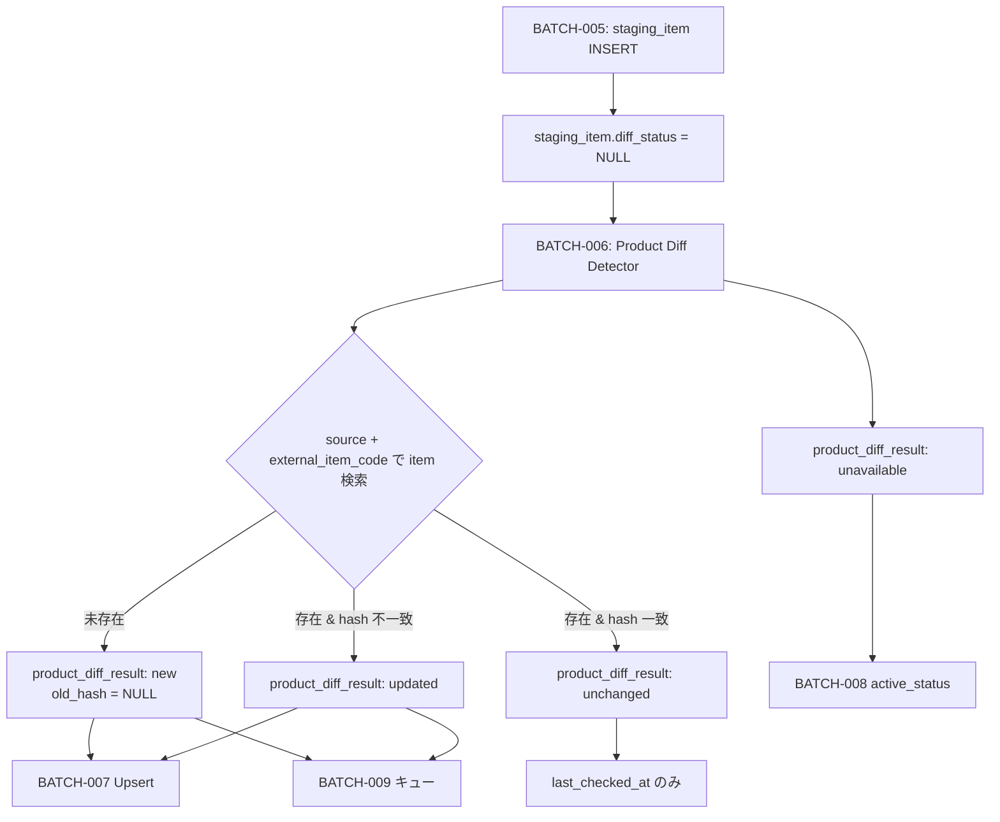

# Product Diff Result テーブル定義書

## 1. ドキュメント情報

| 項目           | 内容                                      |
| -------------- | ----------------------------------------- |
| ドキュメントID | `DB-TBL-MVP-product_diff_result`          |
| ドキュメント名 | Product Diff Result テーブル定義書        |
| 対象システム   | Gift Recommendation Service MVP           |
| MVP対象        | `yes`                                     |
| 作成日         | 2026-06-15                                |
| 更新日         | 2026-06-15（Human Review #526 反映）      |

---

## 2. 概要

`product_diff_result` は、外部商品データ連携系における **商品差分判定結果の派生正本** である。

BATCH-006（商品差分判定）で `staging_item.normalized_hash` と既存 `item.normalized_hash` を比較し、`new` / `updated` / `unchanged` / `unavailable` を確定して記録する。BATCH-007（Item反映）・BATCH-008（商品有効状態更新）・BATCH-009（意味生成キュー登録）の **判断入力** となる。

Staging 系と同様 **物理 FK なし（LOGICAL + Index）**、**成功 Batch 完了後に削除** する一時データ（物理ER §13）。

---

## 3. 目的

- 疑似差分取得フロー（論理ER §9.3）における **判定結果を batch 単位で永続化** する
- `staging_item` → `product_diff_result` の **judged_as** 関係（`staging_item_id`）を物理定義する
- `diff_status` の **正本** を本テーブルとし、後続 Batch が Item 反映・状態更新・キュー登録を分岐できる入力を提供する
- バッチ設計方針書 §17.1 の冪等キー（`batch_run_id` + `external_item_code`）を UNIQUE 制約として DDL へ展開可能にする
- 後続 DDL Task が migration を作成できる粒度まで設計を確定する

---

## 4. テーブル基本情報

| 項目 | 内容 |
| ---- | ---- |
| 物理テーブル名 | `product_diff_result` |
| 論理テーブル名 | Product Diff Result |
| 分類 | 外部商品データ連携系 |
| 正本区分 | 派生 / 判定結果 |
| 主な更新主体 | batch（BATCH-006 作成・Product Diff Result Repository / `MOD-BATCH-014` Product Diff Detector） |
| 主な参照主体 | batch のみ（BATCH-007 Item Updater / BATCH-008 Item Active Status Updater / BATCH-009 キュー登録・Product Diff Result Reader。Online / api / reco から Direct 参照しない） |
| MVP対象 | `yes` |
| 関連物理ER | `docs/06_実装設計/database/物理ER.md` §8–§11 |

---

## 5. 用途・責務

- **Batch Run 単位・商品コード単位** で差分判定結果を 1 行記録する
- `staging_item` 1 行（BATCH-005 完了済み）に対し、BATCH-006 で **最大 1 判定行**（judged_as 1:0..1）を生成する
- `old_hash` / `new_hash` により hash 比較根拠を監査可能に保持する
- `diff_status` により BATCH-007〜009 の処理分岐を決定する
- Public API では返却しない（内部 Batch データ）

### 5.1 対象外

- Staging 中間データ本体（`staging_item` / `staging_item_image` 等の責務）
- Item 正本（`item` の責務）
- Raw Metadata（`raw_product_metadata` の責務）
- 取込件数集計（`item_import_summary` の責務）
- 意味入力差分（`meaning_input_diff` の責務。BATCH-009 入力の別概念）
- `source` / `source_system` / `source_api` 列（§5.5）
- `item_id` 列（§5.3。Item 突合は `staging_item.source` + `external_item_code` 経由）
- Public API 公開
- OpenAPI / generated 変更（Epic 終盤 Task #469 へ委譲）

### 5.2 `staging_item` → `product_diff_result` 関係（judged_as）

`staging_item_テーブル定義書` §5.4 / §8.2 に従う。

| 観点 | 方針 |
| ---- | ---- |
| 物理ER 関係 | `staging_item` → `product_diff_result` : `judged_as`（**LOGICAL** 1:0..1） |
| 参照列 | **`product_diff_result.staging_item_id`** → `staging_item.staging_item_id`（**NOT NULL**） |
| 判定 Batch | BATCH-006（Product Diff Detector / `MOD-BATCH-014`） |
| 前提 | 対象 `staging_item` は **BATCH-005 完了済み**（`normalized_hash` 確定済み） |
| カーディナリティ | 1 Staging Item : **0..1** Product Diff Result（BATCH-006 成功時 1 行） |



### 5.3 `item` との hash 比較経路

`item_テーブル定義書` §12 / `staging_item_テーブル定義書` §12.3 に従う。

| 観点 | 方針 |
| ---- | ---- |
| Item 突合キー | **`staging_item.source` + `staging_item.external_item_code`**（= `item.uq_item_source_external_code`） |
| 比較対象 | **`new_hash`** = `staging_item.normalized_hash`、**`old_hash`** = 既存 `item.normalized_hash` |
| `item_id` | **本テーブルに保持しない**。BATCH-007 以降は `staging_item` / `product_diff_result` + Upsert キーで Item を解決 |
| hash 算出 | **BATCH-005 内**（`MOD-BATCH-012` / `MOD-BATCH-013`）。BATCH-006 は **比較のみ**（staging_item #517 §17.1 No.5） |

### 5.4 `old_hash` / `new_hash` 意味（Human Review #526 確定）

| 列 | 意味 | NULL 許容 | 備考 |
| -- | ---- | --------- | ---- |
| `new_hash` | 判定対象 Staging 行の `staging_item.normalized_hash` | **NOT NULL** | BATCH-005 完了時点で確定 |
| `old_hash` | 比較時点の既存 `item.normalized_hash` | **NULL 可** | `diff_status='new'` のとき **NULL**（未登録商品）。`updated` / `unchanged` では **NOT NULL** 想定 |

> **unavailable** 時: 取得不能・必須項目不足等で Item 未登録の場合は `old_hash` NULL 可。既存 Item が unavailable 判定される場合は `old_hash` に既存 hash を保持しうる。

### 5.5 出所列方針（`source` 系列列なし）

| 観点 | 方針 |
| ---- | ---- |
| 論理ER §9.2 | 主要属性に `source` **なし** |
| Item 突合 | **`staging_item.source`** + `external_item_code` を BATCH-006 読取時に使用 |
| 本テーブル列 | **`source` / `source_system` / `source_api` は MVP 物理 DDL に含めない**（Human Review #526 **確定**） |
| 冪等キー | バッチ設計方針書 §17.1 **`batch_run_id` + `external_item_code`**（MVP は単一 `source='rakuten'` 前提で Batch Run 内一意） |

### 5.6 後続 Batch 読取（BATCH-007〜009）

| Batch | 読取条件（概要） | 後続処理 |
| ----- | ---------------- | -------- |
| BATCH-007 | `diff_status IN ('new','updated')` | `staging_item` から Item Upsert・子テーブル反映 |
| BATCH-007 | `diff_status = 'unchanged'` | Item 業務列 **更新しない**（`item.last_checked_at` のみ。item 定義書 §12） |
| BATCH-008 | `diff_status = 'unavailable'` 等 | `item.active_status` 更新検討 |
| BATCH-009 | `new` / 意味影響 `updated` 等 | `item_generation_queue` 登録（`item_generation_queue_テーブル定義書` §5.4） |

---

## 6. カラム定義

| No | カラム名 | 論理名 | 型 | 必須 | PK | FK | Unique | Default | 説明 |
| --: | -------- | ------ | -- | ---- | -- | -- | ------ | ------- | ---- |
| 1 | `product_diff_result_id` | Product Diff Result ID | `uuid` | `yes` | `yes` | — | `yes` | `gen_random_uuid()` | サロゲート PK |
| 2 | `batch_run_id` | Batch Run ID | `uuid` | `yes` | — | LOGICAL | — | — | 判定を実行した Batch Run。`batch_run_log.batch_run_id` 参照 |
| 3 | `staging_item_id` | Staging Item ID | `uuid` | `yes` | — | LOGICAL | — | — | 判定元 Staging 行。`staging_item.staging_item_id` 参照（judged_as） |
| 4 | `external_item_code` | External Item Code | `text` | `yes` | — | — | — | — | 楽天 `itemCode`。冪等キー構成要素・Index 用に denormalize |
| 5 | `old_hash` | Old Normalized Hash | `varchar(64)` | `no` | — | — | — | — | 比較時点の `item.normalized_hash`。`new` 時 NULL |
| 6 | `new_hash` | New Normalized Hash | `varchar(64)` | `yes` | — | — | — | — | 判定対象 `staging_item.normalized_hash` |
| 7 | `diff_status` | Diff Status | `varchar(32)` | `yes` | — | — | — | — | `product_diff_status`。**判定正本** |
| 8 | `judged_at` | Judged At | `timestamptz` | `yes` | — | — | — | — | BATCH-006 判定完了日時（UTC） |
| 9 | `created_at` | Created At | `timestamptz` | `yes` | — | — | — | `now()` | 行作成日時 |
| 10 | `updated_at` | Updated At | `timestamptz` | `yes` | — | — | — | `now()` | 行最終更新日時（再判定 UPSERT 時） |

---

## 7. 主キー・一意キー

| 種別 | 対象カラム | 方針 | 備考 |
| ---- | ---------- | ---- | ---- |
| PRIMARY KEY | `product_diff_result_id` | サロゲート UUID | — |
| UNIQUE | `batch_run_id`, `external_item_code` | 同一 Batch Run 内同一 itemCode は 1 判定行 | Human Review #526 **確定**（§17.1 No.1）。バッチ設計方針書 §17.1 |

---

## 8. 外部キー・参照関係

### 8.1 参照先（論理）

| カラム | 参照先 | FK制約 | 参照整合性 | 備考 |
| ------ | ------ | ------ | ---------- | ---- |
| `batch_run_id` | `batch_run_log.batch_run_id` | `LOGICAL` | Batch で存在確認 | trace / Retention 単位 |
| `staging_item_id` | `staging_item.staging_item_id` | `LOGICAL` | BATCH-006 直前に存在必須 | judged_as |

### 8.2 間接参照（列なし）

| 観点 | 経路 | 備考 |
| ---- | ---- | ---- |
| Item 正本 | `staging_item.source` + `staging_item.external_item_code` → `item` | `item_id` 列は保持しない |
| Raw trace | `staging_item.raw_metadata_id` → `raw_product_metadata` | 本テーブルからは `staging_item_id` 経由 |

### 8.3 被参照（論理）

| 参照元 Batch / 処理 | 用途 | 備考 |
| ------------------- | ---- | ---- |
| BATCH-007 Product Diff Result Reader | Item 反映分岐 | `new` / `updated` / `unchanged` |
| BATCH-008 Product Diff Result Reader | 有効状態更新 | `unavailable` 等 |
| BATCH-009 | 意味生成キュー登録 | `new` / 意味影響 `updated` |

---

## 9. Index

| Index名 | 対象カラム | 種別 | 用途 | 備考 |
| ------- | ---------- | ---- | ---- | ---- |
| `product_diff_result_pkey` | `product_diff_result_id` | btree（PK） | 主キー | 自動生成 |
| `uq_product_diff_batch_code` | `batch_run_id`, `external_item_code` | unique btree | BATCH-006 冪等 | §7・物理ER §10 案 `idx_product_diff_batch_code` を UNIQUE 化 |
| `idx_product_diff_staging_item` | `staging_item_id` | btree | judged_as 逆引き・Staging 連動 DELETE 補助 | 物理ER §10 補完 |
| `idx_product_diff_status` | `batch_run_id`, `diff_status` | btree | BATCH-007〜009 の状態別抽出 | 後続 Batch 読取 |

> 物理ER §10 の `idx_product_diff_batch_code` は **UNIQUE 制約** として本定義書では `uq_product_diff_batch_code` に命名（DDL Task で最終確定可）。

---

## 10. 制約

| 制約名 | 種別 | 対象 | 内容 | 備考 |
| ------ | ---- | ---- | ---- | ---- |
| `product_diff_result_pkey` | PRIMARY KEY | `product_diff_result_id` | 主キー | — |
| `uq_product_diff_batch_code` | UNIQUE | `batch_run_id`, `external_item_code` | BATCH-006 冪等 | §7 |
| `chk_product_diff_status` | CHECK | `diff_status` | `diff_status IN ('new','updated','unchanged','unavailable')` | enum定義書 §6.9 |
| `chk_product_diff_new_hash` | CHECK | `new_hash` | `length(new_hash) = 64` | hex 64 文字（`staging_item` / `item` と同型） |
| `chk_product_diff_old_hash_len` | CHECK | `old_hash` | `old_hash IS NULL OR length(old_hash) = 64` | — |
| `chk_product_diff_new_old_consistency` | CHECK | `old_hash`, `diff_status` | `diff_status <> 'new' OR old_hash IS NULL` | `new` 時 old_hash NULL |
| `chk_product_diff_updated_old` | CHECK | `old_hash`, `diff_status` | `diff_status NOT IN ('updated','unchanged') OR old_hash IS NOT NULL` | 既存 Item 比較時は old_hash 必須 |

---

## 11. 状態・enum

| カラム | enum / code | 定義元 | 許容値 | 備考 |
| ------ | ----------- | ------ | ------ | ---- |
| `diff_status` | `product_diff_status` | `enum定義書.md` §6.9 / `packages/code-definitions/state/product_diff_status.yaml` | `new`, `updated`, `unchanged`, `unavailable` | **NOT NULL**。本テーブルが **正本** |

### 11.1 `diff_status` と後続処理（状態遷移設計書 §6.5）

| 状態 | 意味 | BATCH-006 判定条件（概要） | 後続処理 |
| ---- | ---- | ---------------------------- | -------- |
| `new` | 未登録商品 | `item` が `source` + `external_item_code` で **未存在** | BATCH-007 Item Insert、BATCH-009 キュー |
| `updated` | hash 不一致 | Item 存在 & `old_hash <> new_hash` | BATCH-007 Item Update、BATCH-009 キュー（意味影響時） |
| `unchanged` | hash 一致 | Item 存在 & `old_hash = new_hash` | BATCH-007 業務列 no-op（`last_checked_at` のみ） |
| `unavailable` | 取得不能・対象外 | Staging Validator 失敗 / 必須欠落 / 販売不可等 | BATCH-008 `active_status` 更新検討 |

### 11.2 `staging_item.diff_status` との関係

| 観点 | 方針 |
| ---- | ---- |
| 正本 | **`product_diff_result.diff_status`** |
| Staging 行 | `staging_item.diff_status` は **NULL 可**（BATCH-005 直後）。BATCH-006 で **任意 UPDATE**（staging_item #517 §17.1 No.4） |
| 二重保持 | 許容するが **読取正本は本テーブル** |



---

## 12. 更新仕様

| 操作 | 実行主体 | 条件 | 更新項目 | 冪等性 | 備考 |
| ---- | -------- | ---- | -------- | ------ | ---- |
| INSERT | batch | BATCH-006 差分判定成功 | 全業務列 + `judged_at` | `(batch_run_id, external_item_code)` UNIQUE | IF-DB-BATCH-006 |
| UPSERT | batch | BATCH-006 再実行（同一 Batch Run） | `staging_item_id`, `old_hash`, `new_hash`, `diff_status`, `judged_at`, `updated_at` | §12.2 ON CONFLICT | 冪等 |
| SELECT | batch | BATCH-007 / BATCH-008 / BATCH-009 | — | — | Product Diff Result Reader |
| DELETE | batch | Batch 成功完了後 Retention | — | `batch_run_id` 単位等 | 物理ER §13 |
| UPDATE | batch | staging_item.diff_status 任意同期 | — | — | **本テーブルは staging_item 側**（任意） |
| INSERT / UPDATE / DELETE | api / reco / web | — | — | **禁止** | Batch 専用 |

### 12.1 BATCH-006 差分判定フロー

```text
1. batch_run_id に紐づく staging_item 行（normalized_hash 確定済み）を読み取り
2. staging_item.source + staging_item.external_item_code で item を検索
3. staging_item 必須検証失敗 / 取得不能 → unavailable（old_hash は状況に応じ NULL 可）
4. item 未存在 → diff_status = new、old_hash = NULL、new_hash = staging_item.normalized_hash
5. item 存在 & item.normalized_hash <> staging_item.normalized_hash → updated
6. item 存在 & item.normalized_hash = staging_item.normalized_hash → unchanged
7. product_diff_result INSERT / UPSERT（IF-DB-BATCH-006）
8. 任意: staging_item.diff_status を同一値で UPDATE
9. unchanged の場合 BATCH-007 は item 業務列を更新せず item.last_checked_at のみ（item 定義書 §12）
```

### 12.2 INSERT / UPSERT 疑似コード

```sql
INSERT INTO product_diff_result (
  batch_run_id,
  staging_item_id,
  external_item_code,
  old_hash,
  new_hash,
  diff_status,
  judged_at
) VALUES (
  :batch_run_id,
  :staging_item_id,
  :external_item_code,
  :old_hash,
  :new_hash,
  :diff_status,
  :judged_at
)
ON CONFLICT (batch_run_id, external_item_code) DO UPDATE SET
  staging_item_id = EXCLUDED.staging_item_id,
  old_hash = EXCLUDED.old_hash,
  new_hash = EXCLUDED.new_hash,
  diff_status = EXCLUDED.diff_status,
  judged_at = EXCLUDED.judged_at,
  updated_at = now();
```

### 12.3 後続 Batch 読取分岐

| `diff_status` | BATCH-007 | BATCH-008 | BATCH-009 |
| ------------- | --------- | --------- | --------- |
| `new` | Item Insert + 子テーブル反映 | — | キュー登録（`generation_type=semantic` デフォルト） |
| `updated` | Item Update + 子テーブル反映 | — | 意味影響時キュー登録 |
| `unchanged` | `last_checked_at` のみ | — | 原則登録しない |
| `unavailable` | 原則 Item Upsert しない | `active_status` 更新 | — |

---

## 13. データ保持・削除

| 観点 | 方針 |
| ---- | ---- |
| 保持期間 | **成功 Batch 完了後短期 DELETE** / 失敗・部分成功時 **7〜14 日**（物理ER §13・テーブル一覧 §6 補足） |
| 削除方式 | 物理 DELETE |
| 削除条件 | 原則 **`batch_run_id` 単位**。`staging_item` Retention と **連動**（同一取込 Run の Staging 削除前後で整合） |
| 論理削除 | 列なし |
| 履歴 | **長期保存しない**（派生 / 一時。状態遷移設計書 §6.5.3） |
| アーカイブ | MVP 対象外 |

---

## 14. Migration / DDL

| 項目 | 内容 |
| ---- | ---- |
| DDL対象 | `product_diff_result` |
| migration単位 | 1 テーブル = 1 migration（DDL Task） |
| 適用順序 | 外部商品データ連携系。**`staging_item` 作成後**（`staging_item_id` LOGICAL 参照）。**`batch_run_log` 作成後**（`batch_run_id` LOGICAL 参照）。`item` とは **物理 FK なし** のため strict 順序不要 |
| rollback方針 | forward migration 主体。DROP は Human Review 必須 |
| 破壊的変更有無 | `no`（初回 CREATE） |

---

## 15. セキュリティ・権限

| 観点 | 方針 |
| ---- | ---- |
| 読み取り権限 | batch（service role 経由）のみ |
| 書き込み権限 | batch のみ。BATCH-006 Product Diff Result Repository |
| service role利用 | Product Diff Detector / Item Updater / Item Active Status Updater に限定 |
| 個人情報・機微情報 | 商品 hash・コードのみ。secret 非含有 |
| ログ出力制限 | hash 全件を application log に過剰出力しない |

---

## 16. テスト観点

| No | 観点 | 確認内容 | 種別 |
| --: | ---- | -------- | ---- |
| 1 | DDL適用 | CREATE TABLE / Index / CHECK / UNIQUE が定義どおり | migration |
| 2 | 冪等 Upsert | 同一 `(batch_run_id, external_item_code)` 再 INSERT が UPDATE になる | migration |
| 3 | enum整合 | `diff_status` 4 値 CHECK + NOT NULL | migration |
| 4 | judged_as | `staging_item_id` 不存在時 Batch が拒否 | integration |
| 5 | new 判定 | Item 未存在で `old_hash IS NULL` & `diff_status='new'` | integration |
| 6 | unchanged | hash 一致時 BATCH-007 が item 業務列を更新しない | integration |
| 7 | Retention | 成功 Batch 後 `batch_run_id` 単位 DELETE 可能 | integration |
| 8 | 権限 | web client から Direct DB アクセス不可 | manual |

---

## 17. 未決事項

| No | 論点 | 判断が必要な理由 | 判断者 | 期限 | 備考 |
| --: | ---- | ---------------- | ------ | ---- | ---- |
| — | なし | — | — | — | Human Review #526 にて No.1〜5 を決定済み（§17.1） |

### 17.1 Human Review 決定事項（Issue #526）

| No | 論点 | 決定内容 | 決定者 | 備考 |
| --: | ---- | -------- | ------ | ---- |
| 1 | BATCH-006 冪等 UNIQUE キー | **`(batch_run_id, external_item_code)`** | Human | バッチ設計方針書 §17.1・§12.2 ON CONFLICT |
| 2 | `diff_status` 正本 | **`product_diff_result` を正本**。`staging_item.diff_status` は NULL 可・任意 UPDATE | Human | staging_item #517 §17.1 No.4 継承 |
| 3 | `staging_item_id` 列 | **採用・NOT NULL**。物理ER judged_as / `staging_item_テーブル定義書` §5.4 | Human | 論理ER §9.2 主要属性との差分は §6 注記 |
| 4 | `old_hash` / `new_hash` | **`new_hash` = `staging_item.normalized_hash`**、**`old_hash` = 既存 `item.normalized_hash`**（`new` 時 NULL） | Human | §5.4 |
| 5 | `source` 列 | **不採用**。Item 突合は `staging_item.source` + `external_item_code` | Human | §5.5 |

---

## 18. 関連資料

| 種別 | パス / URL | 用途 |
| ---- | ---------- | ---- |
| 物理ER | `docs/06_実装設計/database/物理ER.md` | §9 judged_as / §10 Index / §13 Retention |
| 論理ER | `docs/05_アプリケーション設計/アプリ/database/論理ER.md` | §9.2 / §9.3 / §14.4 |
| テーブル一覧 | `docs/05_アプリケーション設計/アプリ/database/テーブル一覧.md` | §6 No.25 |
| enum定義書 | `docs/06_実装設計/database/enum定義書.md` | §6.9 product_diff_status |
| 状態遷移設計書 | `docs/05_アプリケーション設計/アプリ/状態遷移設計書.md` | §6.5 Product Diff Result |
| 外部商品連携 | `docs/05_アプリケーション設計/アプリ/外部商品データ連携設計書.md` | §6.3–§6.4 / §7 |
| インターフェース一覧 | `docs/05_アプリケーション設計/アプリ/インターフェース一覧.md` | IF-DB-BATCH-006 |
| バッチ設計方針書 | `docs/05_アプリケーション設計/アプリ/batch/バッチ設計方針書.md` | BATCH-006〜009・§17.1 |
| バッチ処理一覧 | `docs/05_アプリケーション設計/アプリ/batch/バッチ処理一覧.md` | BATCH-006 入出力 |
| バッチ依存関係図 | `docs/05_アプリケーション設計/アプリ/batch/バッチ依存関係図.md` | BATCH-006 → 007/008/009 |
| staging_item 定義書 | `docs/06_実装設計/database/staging_item_テーブル定義書.md` | §5.4 judged_as / §12.3 |
| item 定義書 | `docs/06_実装設計/database/item_テーブル定義書.md` | §12 Upsert / hash |
| item_generation_queue 定義書 | `docs/06_実装設計/database/item_generation_queue_テーブル定義書.md` | §5.4 BATCH-009 登録条件 |
| product_diff_status | `packages/code-definitions/state/product_diff_status.yaml` | diff_status 正本 |

---

## 19. レビュー観点

- 論理ER §9.2 / §9.3・テーブル一覧 §6 No.25 と矛盾していない
- 物理ER §9 judged_as / §10 Index / §13 Retention と整合している
- `staging_item` / `item` との差分判定フローが §5.3 / §12.1 で明記されている
- `old_hash` / `new_hash` と normalized_hash 経路が §5.4 で整理されている
- `diff_status` 正本が本テーブルであることが §11.2 で明示されている
- BATCH-006 冪等キーと BATCH-007〜009 読取分岐が §12.3 で整理されている
- Staging 系 **物理 FK なし** 方針が §8 で明記されている
- Retention（物理ER §13）が §13 に反映されている
- apps/** / OpenAPI / generated 変更が含まれていない
- secret や `.env` 実値が含まれていない
- Human Review #526 決定事項（§17.1 No.1〜5）が本文に反映されている
