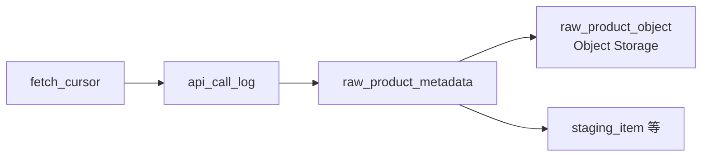
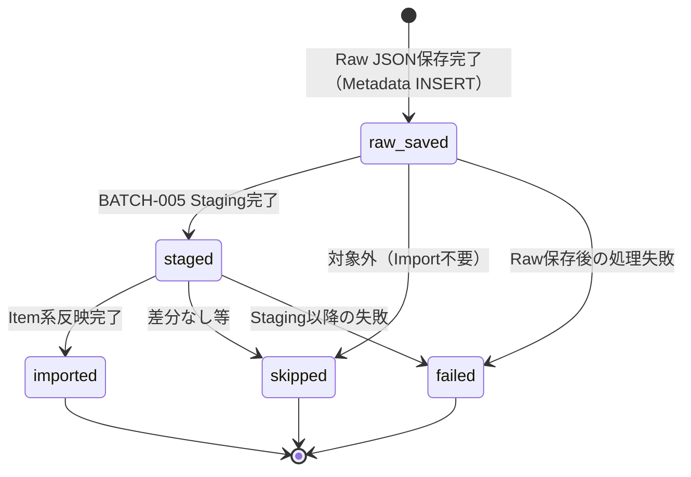

# Raw Product Metadata テーブル定義書

## 1. ドキュメント情報

| 項目           | 内容                               |
| -------------- | ---------------------------------- |
| ドキュメントID | `DB-TBL-MVP-raw_product_metadata`  |
| ドキュメント名 | Raw Product Metadata テーブル定義書 |
| 対象システム   | Gift Recommendation Service MVP    |
| MVP対象        | `yes`                              |
| 作成日         | 2026-06-12                         |
| 更新日         | 2026-06-12                         |

---

## 2. 概要

`raw_product_metadata` は、Object Storage 上に保存した **Raw JSON 本体**（`raw_product_object`）への DB 側参照情報を batch が管理する外部商品データ連携系テーブルである。

Raw レスポンス単位で `object_key` / `content_hash` / 取得元（`source` / `source_api`）および **取込状態（`import_status`）** を保持し、BATCH-005 以降の Staging 変換・Item 反映の起点となる。

Raw JSON 本体は DB 非管理（Object Storage 正本）。Public API では返却しない（内部 Batch / 監査データ）。

---

## 3. 目的

- Object Storage 上 Raw JSON への参照（`object_key`）と整合性確認用 `content_hash` を DB 上で管理する
- `import_status` により Raw 保存・Staging 変換・Item 反映の進行状態を Raw レスポンス単位で追跡する（状態遷移設計書 §6.3）
- `api_call_log` との produces 関係（LOGICAL FK）を整理し、外部 API 呼び出しから Raw 取込まで trace 可能にする
- `staging_item` / `staging_item_image` / `staging_ranking_signal` / `staging_genre` への transforms_to 関係の参照元として後続 Task が利用できる粒度を定義する
- 後続 DDL Task が migration を作成できる粒度まで設計を確定する

---

## 4. テーブル基本情報

| 項目 | 内容 |
| ---- | ---- |
| 物理テーブル名 | `raw_product_metadata` |
| 論理テーブル名 | Raw Product Metadata |
| 分類 | 外部商品データ連携系 |
| 正本区分 | Raw Metadata / Log |
| 主な更新主体 | batch（BATCH-001〜005・`MOD-BATCH-018` Raw Product Metadata Writer） |
| 主な参照主体 | batch（BATCH-005 Staging Transformer / Raw Product Reader） |
| MVP対象 | `yes` |
| 関連物理ER | `docs/06_実装設計/database/物理ER.md` §8–§11 |

---

## 5. 用途・責務

- **Raw レスポンス単位** で Metadata 行を 1 件作成し、取込ライフサイクルを `import_status` で管理する（状態遷移設計書 §6.3.3）
- Object Storage へ Raw JSON を保存した場合、`object_key` と `content_hash` を保持し **1 対 1** で `raw_product_object` を指す
- 外部商品データ連携設計書 §8.2 に従い、**変更なし商品のみのレスポンスは原則 Raw 保存しない** ため、当該ケースでは Metadata 行自体を作成しない（Batch アプリ責務）
- BATCH-005 が `import_status = raw_saved` の行を読み取り Staging 変換後 `staged`、Item 系反映完了後 `imported` / `skipped` / `failed` へ更新する
- **履歴管理は行わない**。同一 Raw Object の再保存は `object_key` 一意制約と Upsert 方針で最新 Metadata に集約する（§7）

### 5.1 対象外

- Raw JSON 本体（Object Storage 上の `raw_product_object`。DB テーブル化しない）
- 外部 API 呼び出しログ本体（`api_call_log` の責務。本テーブルでは produces 関係のみ整理）
- Fetch Cursor 走査状態（`fetch_cursor` の責務）
- Staging 中間データ・差分判定（`staging_*` / `product_diff_result` の責務）
- Item 正本（`item` の責務）
- Public API 公開

### 5.2 `api_call_log` → `raw_product_metadata` 関係

論理ER §9.3・物理ER §9・`fetch_cursor_テーブル定義書` §5.2 に従う。

| 観点 | 方針 |
| ---- | ---- |
| データフロー | `fetch_cursor`（任意）→ `api_call_log`（1 外部 API 呼び出し）→ **`raw_product_metadata`（1 Raw レスポンス）** → `staging_*` |
| 物理ER 関係 | `api_call_log` → `raw_product_metadata` : `produces`（**LOGICAL** FK。Batch / Log 系は物理 FK なし） |
| カーディナリティ | 1 API 呼び出し : N Raw Metadata（1 レスポンス内に複数 Raw 分割保存は MVP では **想定しない**。通常 1:1） |
| `api_call_log_id` | API 経由で Raw 保存した行では **設定必須**。手動再処理・監査モード等で API Log 非経由の場合は `NULL` 可（§17 No.2） |
| trace | インターフェース一覧: `batch_run_id` / `api_call_log_id` / `raw_metadata_id` で追跡 |
| `batch_run_id` | **本テーブル列には持たない**。`api_call_log.batch_run_id` 経由で間接参照（§5.4） |



### 5.3 `raw_product_object`（Object Storage）との 1 対 1 参照

論理ER §9.2・テーブル一覧 §6 補足に従う。

| 観点 | 方針 |
| ---- | ---- |
| 正本 | Raw JSON 本体は **Object Storage**（`raw_product_object` 論理エンティティ）。DB 非管理 |
| 参照キー | `object_key` が Storage 上のパス正本（外部商品データ連携設計書 §8.3） |
| 関係 | `raw_product_metadata` 1 行 : Raw Object 1 件（**1 対 1**） |
| 整合性 | `content_hash` で Raw 本体の改ざん・再取得差分を検知。Staging 前の再読込検証に利用 |
| `object_key` 未設定 | Raw 保存省略時は Metadata 行を **作成しない**（§5 冒頭）。行が存在する場合 `object_key` は NOT NULL（§10 CHECK） |

**Object Storage Key 形式（正本）**:

```text
raw/rakuten/{api_name}/dt={yyyy-mm-dd}/batch_run_id={batch_run_id}/{request_hash}.json
```

例:

```text
raw/rakuten/item_search/dt=2026-05-10/batch_run_id=br_20260510_001/9f2a3c.json
```

### 5.4 外部商品データ連携設計書 §8.4 との差分整理

| 外部商品データ連携設計書 §8.4 | 本テーブル（MVP 物理 DDL） | 扱い |
| ----------------------------- | -------------------------- | ---- |
| `raw_product_metadata_id` | `raw_metadata_id` | 論理ER §9.2・ログ・Observability 設計書 §15.2 に合わせ **`raw_metadata_id`** を PK 列名とする |
| `batch_run_id` | （列なし） | `api_call_log.batch_run_id` 経由。重複保持しない |
| `source_system` | `source` | 論理ER / `item.source` と同一コード体系の **`source`** を採用 |
| `request_params` / `request_params_hash` | （列なし） | **`api_call_log`** の責務 |
| `api_version` / `http_status` | （列なし） | **`api_call_log`** の責務 |
| `response_content_hash` | `content_hash` | 論理ER §9.2 の **`content_hash`** に統一 |
| `raw_body_saved` | （列なし） | `object_key IS NOT NULL` で代替 |
| `new_item_count` 等 | （列なし） | MVP では **`item_count`** のみ。内訳は `item_import_summary` / Staging 側 |
| `error_code` | `error_code` | ログ・Observability 設計書 §15.2 に合わせ **採用**（論理ER §9.2 表には未列挙） |

### 5.5 `staging_*` への transforms_to 関係

| 参照元（本テーブル） | 参照先 | 関係 | FK制約 | 備考 |
| -------------------- | ------ | ---- | ------ | ---- |
| `raw_metadata_id` | `staging_item.raw_metadata_id` | transforms_to | `LOGICAL` | BATCH-005 商品 Staging |
| `raw_metadata_id` | `staging_item_image.raw_metadata_id` | transforms_to | `LOGICAL` | 画像 Staging |
| `raw_metadata_id` | `staging_ranking_signal.raw_metadata_id` | transforms_to | `LOGICAL` | ランキング Staging |
| `raw_metadata_id` | `staging_genre.raw_metadata_id` | transforms_to | `LOGICAL` | ジャンル Staging |

> Staging 系テーブル定義書は Batch R03/R04 別 Task。本定義書では **`raw_metadata_id` 被参照** のみ確定する。

### 5.6 Raw 保存対象方針（Batch 前提）

外部商品データ連携設計書 §8.2 を Batch アプリ（Raw Product Object Writer）の判定正本とする。

| ケース | Raw JSON 保存 | Metadata 行 |
| ------ | ------------- | ----------- |
| 新規・更新商品を含むレスポンス | ○ | 作成（`import_status = raw_saved`） |
| 変更なしのみ | ×（原則） | **作成しない** |
| エラー（調査用保存） | 必要に応じて ○ | 作成可（`failed` 等） |
| Genre / Ranking / Attribute 定義 | ○ | 作成 |
| 手動検証・監査 | ○ | 作成（`api_call_log_id` NULL 可） |

---

## 6. カラム定義

| No | カラム名 | 論理名 | 型 | 必須 | PK | FK | Unique | Default | 説明 |
| --: | -------- | ------ | -- | ---- | -- | -- | ------ | ------- | ---- |
| 1 | `raw_metadata_id` | Raw Metadata ID | `uuid` | `yes` | `yes` | — | `yes` | `gen_random_uuid()` | サロゲート PK。trace キー（ログ・Observability §15.2） |
| 2 | `api_call_log_id` | API Call Log ID | `uuid` | `no` | — | LOGICAL | — | `NULL` | 生成元 API 呼び出し。`api_call_log.api_call_log_id` 参照 |
| 3 | `object_key` | Object Key | `text` | `yes` | — | — | `yes` | — | Object Storage 上 Raw JSON パス（§5.3） |
| 4 | `source` | Data Source | `text` | `yes` | — | — | — | `'rakuten'` | 外部商品データ元。`item.source` と同一体系 |
| 5 | `source_api` | Source API | `varchar(32)` | `yes` | — | — | — | — | 取得 API 識別子（§11） |
| 6 | `content_hash` | Content Hash | `text` | `yes` | — | — | — | — | Raw JSON 本体の hash（SHA-256 等。算出方式は Batch 実装） |
| 7 | `item_count` | Item Count | `integer` | `yes` | — | — | — | `0` | Raw レスポンス内の商品件数（該当 API に商品列がない場合は 0） |
| 8 | `import_status` | Import Status | `varchar(32)` | `yes` | — | — | — | `'raw_saved'` | 取込状態。`raw_import_status` enum 準拠 |
| 9 | `fetched_at` | Fetched At | `timestamptz` | `yes` | — | — | — | — | 外部 API 取得完了日時（UTC） |
| 10 | `staged_at` | Staged At | `timestamptz` | `no` | — | — | — | `NULL` | Staging 変換完了日時 |
| 11 | `imported_at` | Imported At | `timestamptz` | `no` | — | — | — | `NULL` | Item 系反映完了日時（`imported` / 終端 `skipped` 時） |
| 12 | `error_code` | Error Code | `varchar(64)` | `no` | — | — | — | `NULL` | 失敗時のエラーコード（例: `GRS-BAT-004`） |
| 13 | `error_message` | Error Message | `text` | `no` | — | — | — | `NULL` | 失敗概要（secret を含めない） |
| 14 | `created_at` | Created At | `timestamptz` | `yes` | — | — | — | `now()` | 行作成日時 |
| 15 | `updated_at` | Updated At | `timestamptz` | `yes` | — | — | — | `now()` | 行最終更新日時 |

> **命名**: インターフェース一覧の `raw_product_metadata_id` は **概念 trace 名**。物理列名は論理ER §9.2 に合わせ **`raw_metadata_id`** とする（§5.4）。

---

## 7. 主キー・一意キー

| 種別 | 対象カラム | 方針 | 備考 |
| ---- | ---------- | ---- | ---- |
| PRIMARY KEY | `raw_metadata_id` | サロゲート UUID | `staging_*` / error_log owner 参照 |
| UNIQUE | `object_key` | Raw Object 1 件 = Metadata 1 行 | §5.3 1 対 1 参照 |

---

## 8. 外部キー・参照関係

### 8.1 参照先（論理）

| カラム | 参照先 | FK制約 | 参照整合性 | 備考 |
| ------ | ------ | ------ | ---------- | ---- |
| `api_call_log_id` | `api_call_log.api_call_log_id` | `LOGICAL` | Batch で存在確認 | `api_call_log` 定義書は別 Task |

### 8.2 被参照（論理）

| 参照元 | 参照列 | 関係 | FK制約 | 備考 |
| ------ | ------ | ---- | ------ | ---- |
| `staging_item` | `raw_metadata_id` | transforms_to | `LOGICAL` | Staging 定義 Task |
| `staging_item_image` | `raw_metadata_id` | transforms_to | `LOGICAL` | 同上 |
| `staging_ranking_signal` | `raw_metadata_id` | transforms_to | `LOGICAL` | 同上 |
| `staging_genre` | `raw_metadata_id` | transforms_to | `LOGICAL` | 同上 |
| `error_log` | `owner_id`（`owner_type = raw_product_metadata`） | may_have | `LOGICAL` | enum定義書 §6.15 |

### 8.3 Object Storage 参照（DB FK なし）

| カラム | 参照先 | 備考 |
| ------ | ------ | ---- |
| `object_key` | `raw_product_object`（Object Storage） | 1 対 1。Storage lifecycle と連動（§13） |

---

## 9. Index

| Index名 | 対象カラム | 種別 | 用途 | 備考 |
| ------- | ---------- | ---- | ---- | ---- |
| `raw_product_metadata_pkey` | `raw_metadata_id` | btree（PK） | 主キー | 自動生成 |
| `uq_raw_product_metadata_object_key` | `object_key` | unique btree | Raw Object 1 対 1 | §7 |
| `idx_raw_metadata_status` | `import_status`, `fetched_at` | btree | 取込監視・BATCH-005 対象抽出 | 物理ER §10 |
| `idx_raw_metadata_api_call_log` | `api_call_log_id` | btree | API 呼び出し単位 trace | nullable |
| `idx_raw_metadata_source_api` | `source`, `source_api`, `fetched_at` DESC | btree | API 種別ごとの最新 Raw 一覧 | 監査・再処理 |

---

## 10. 制約

| 制約名 | 種別 | 対象 | 内容 | 備考 |
| ------ | ---- | ---- | ---- | ---- |
| `raw_product_metadata_pkey` | PRIMARY KEY | `raw_metadata_id` | 主キー | — |
| `uq_raw_product_metadata_object_key` | UNIQUE | `object_key` | Raw Object 一意 | §7 |
| `chk_raw_metadata_source_mvp` | CHECK | `source` | `source = 'rakuten'` | MVP 固定 |
| `chk_raw_metadata_source_api` | CHECK | `source_api` | §11 許容値 | enum YAML 化は後続 |
| `chk_raw_metadata_import_status` | CHECK | `import_status` | `raw_import_status` 許容値 | enum定義書 §6.7 |
| `chk_raw_metadata_item_count` | CHECK | `item_count` | `item_count >= 0` | — |
| `chk_raw_metadata_staged_at` | CHECK | `staged_at` | `import_status NOT IN ('staged','imported') OR staged_at IS NOT NULL` | 状態と時刻の整合 |
| `chk_raw_metadata_imported_at` | CHECK | `imported_at` | `import_status NOT IN ('imported','skipped') OR imported_at IS NOT NULL` | 終端遷移時は設定 |
| `chk_raw_metadata_failed_error` | CHECK | `error_message` | `import_status <> 'failed' OR error_message IS NOT NULL` | 失敗時は概要必須 |

---

## 11. 状態・enum

| カラム | enum / code | 定義元 | 許容値 | 備考 |
| ------ | ----------- | ------ | ------ | ---- |
| `import_status` | `raw_import_status` | `enum定義書.md` §6.7 / `packages/code-definitions/state/raw_import_status.yaml` | `raw_saved`, `staged`, `imported`, `skipped`, `failed` | NOT NULL |
| `source` | （code 未定義） | `item.source` 慣行 | MVP: `rakuten` | CHECK |
| `source_api` | （code 未定義） | 外部商品データ連携設計書 §8.4 | `item_search`, `item_ranking`, `genre_search`, `attribute_search` | BATCH 別に利用 |

### 11.1 `import_status` 状態遷移

状態遷移設計書 §6.3 を正とする。

| 状態 | 意味 | 終端 |
| ---- | ---- | ---- |
| `raw_saved` | Raw JSON を Object Storage へ保存済み | × |
| `staged` | Raw から Staging 変換完了 | × |
| `imported` | Staging から Item 系へ反映完了 | ○ |
| `skipped` | 差分なし・対象外等で Import 不要 | ○ |
| `failed` | Raw 保存後の処理失敗 | ○ |



> Raw JSON 本体（Object Storage）は状態を持たない。状態は **本テーブルのみ** で管理する（状態遷移設計書 §6.3.3）。

---

## 12. 更新仕様

| 操作 | 実行主体 | 条件 | 更新項目 | 冪等性 | 備考 |
| ---- | -------- | ---- | -------- | ------ | ---- |
| INSERT | batch | Raw JSON 保存完了 | 全列（`import_status=raw_saved`） | `object_key` UNIQUE で重複防止 | IF-DB-BATCH-004 |
| SELECT | batch | `import_status = raw_saved` 等 | — | — | BATCH-005 対象一覧 |
| UPDATE | batch | Staging 完了 | `import_status=staged`, `staged_at`, `updated_at` | `raw_metadata_id` 指定 | BATCH-005 |
| UPDATE | batch | Item 反映完了 | `import_status=imported`, `imported_at`, `updated_at` | 同上 | BATCH-005 / 007 等 |
| UPDATE | batch | Import 不要 | `import_status=skipped`, `imported_at`, `updated_at` | 同上 | 差分なし |
| UPDATE | batch | 処理失敗 | `import_status=failed`, `error_code`, `error_message`, `updated_at` | 同上 | error_log 連携 |
| UPDATE | batch | Raw 再処理成功 | 終端状態から `raw_saved` へ **原則戻さない** | — | 再処理は新規 Metadata 行または Human 判断（§17 No.3） |
| DELETE | — | MVP 原則禁止 | — | — | Retention Task で方針確定 |
| INSERT / UPDATE / DELETE | api / reco / web | — | — | **禁止** | batch のみ |

### 12.1 Raw Metadata 作成フロー

```text
1. 外部 API 呼び出し成功（api_call_log INSERT 済み）
2. Raw Product Object Writer が保存要否を判定（§5.6）
3. 保存する場合、Object Storage PUT → object_key / content_hash 確定
4. raw_product_metadata INSERT（api_call_log_id, import_status=raw_saved）
5. BATCH-005 が raw_saved 行を読み Staging → import_status 更新
```

### 12.2 INSERT 疑似コード

```sql
INSERT INTO raw_product_metadata (
  api_call_log_id,
  object_key,
  source,
  source_api,
  content_hash,
  item_count,
  import_status,
  fetched_at
) VALUES (
  :api_call_log_id,
  :object_key,
  'rakuten',
  :source_api,
  :content_hash,
  :item_count,
  'raw_saved',
  :fetched_at
);
```

### 12.3 失敗時の再実行

状態遷移設計書 §11.3: Raw Product Metadata `failed` 時、**Object Storage 上 Raw JSON が存在すれば** Staging 以降を再実行可能。Batch は同一 `object_key` の Metadata を読み直すか、運用判断で新規行を作成する（§17 No.3）。

---

## 13. データ保持・削除

| 観点 | 方針 |
| ---- | ---- |
| 保持期間 | **180 日〜365 日**（ログ・Observability 設計書 §15）。Raw 再処理要件で確定 |
| 削除方式 | DB 行 DELETE + Object Storage lifecycle の **連動**（物理ER §13 Raw Metadata） |
| 削除条件 | 保持期間経過かつ `import_status` 終端（`imported` / `skipped` / `failed`） |
| 論理削除 | 列なし。`import_status` で状態表現 |
| Staging 連動 | Staging 系は Batch 完了後短期 DELETE（物理ER §13）。Metadata は Staging より長期保持 |
| アーカイブ | MVP 対象外 |

---

## 14. Migration / DDL

| 項目 | 内容 |
| ---- | ---- |
| DDL対象 | `raw_product_metadata` |
| migration単位 | 1 テーブル = 1 migration（DDL Task） |
| 適用順序 | 外部商品データ連携系。`api_call_log` と **並行または後**（LOGICAL FK のため strict 順序不要）。`staging_*` より **前** |
| rollback方針 | forward migration 主体。DROP は Human Review 必須 |
| 破壊的変更有無 | `no`（初回 CREATE） |

---

## 15. セキュリティ・権限

| 観点 | 方針 |
| ---- | ---- |
| 読み取り権限 | batch（service role 経由）のみ |
| 書き込み権限 | batch のみ。Online / reco / web からの DML 禁止（認証・認可方針書） |
| service role利用 | Raw Product Metadata Writer / Staging Batch に限定 |
| 個人情報・機微情報 | Raw JSON に個人情報が含まれ得るが **本体は Object Storage**。`error_message` に secret・Authorization を含めない |
| ログ出力制限 | `object_key` / `content_hash` のみ trace。Raw 本文を application log に出力しない |

---

## 16. テスト観点

| No | 観点 | 確認内容 | 種別 |
| --: | ---- | -------- | ---- |
| 1 | DDL適用 | CREATE TABLE / Index / CHECK が定義どおり | migration |
| 2 | enum整合 | `import_status` が `raw_import_status` 5 値のみ | migration |
| 3 | object_key UNIQUE | 同一 `object_key` の二重 INSERT が拒否される | migration |
| 4 | 状態遷移 | `raw_saved`→`staged`→`imported` が Batch で再現可能 | integration |
| 5 | api_call_log 連携 | `api_call_log_id` 設定で trace 可能 | integration |
| 6 | CHECK 整合 | `failed` 時 `error_message` NULL が拒否される | migration |
| 7 | 権限 | web client から Direct DB アクセス不可 | manual |

---

## 17. 未決事項

| No | 論点 | 判断が必要な理由 | 判断者 | 期限 | 備考 |
| --: | ---- | ---------------- | ------ | ---- | ---- |
| 1 | `object_key` UNIQUE の MVP 必須性 | 同一 hash 再保存・上書き Upsert vs 新規行 | Human | DDL Task 前 | §7 |
| 2 | `api_call_log_id` NULL 許容範囲 | 手動再処理・監査モードの運用頻度 | Human | BATCH 実装前 | §5.2 |
| 3 | `failed` からの再実行 | 同一行 `import_status` リセット vs 新規 Metadata 行 | Human | BATCH-005 実装前 | §12.3 |
| 4 | `source_api` の enum YAML 化 | `item_ranking` vs `ranking` 表記揺れ（Observability §15.2） | Human | enum 拡張 Task | §11 |
| 5 | `content_hash` 算出対象 | レスポンス全体 vs 正規化 JSON | Human | Batch 実装前 | §5.4 |

---

## 18. 関連資料

| 種別 | パス / URL | 用途 |
| ---- | ---------- | ---- |
| 物理ER | `docs/06_実装設計/database/物理ER.md` | §9 produces / §10 Index |
| 論理ER | `docs/05_アプリケーション設計/アプリ/database/論理ER.md` | §9.2 / §9.3 |
| テーブル一覧 | `docs/05_アプリケーション設計/アプリ/database/テーブル一覧.md` | §6 No.19 |
| enum定義書 | `docs/06_実装設計/database/enum定義書.md` | §6.7 raw_import_status |
| 状態遷移設計書 | `docs/05_アプリケーション設計/アプリ/状態遷移設計書.md` | §6.3 |
| 外部商品連携 | `docs/05_アプリケーション設計/アプリ/外部商品データ連携設計書.md` | §8.2–§8.4 |
| インターフェース一覧 | `docs/05_アプリケーション設計/アプリ/インターフェース一覧.md` | IF-DB-BATCH-004 |
| バッチ設計方針書 | `docs/05_アプリケーション設計/アプリ/batch/バッチ設計方針書.md` | Raw 保存フロー |
| ログ・Observability | `docs/05_アプリケーション設計/アプリ/ログ・Observability設計書.md` | §15 Raw / Storage |
| システム論理構成図 | `docs/05_アプリケーション設計/基盤/システム論理構成図.md` | Object Storage 分離 |
| item 定義書 | `docs/06_実装設計/database/item_テーブル定義書.md` | Staging→Item 経路参考 |
| external_genre 定義書 | `docs/06_実装設計/database/external_genre_テーブル定義書.md` | staging_genre フロー参考 |

---

## 19. レビュー観点

- 論理ER §9.2・テーブル一覧 §6 No.19 と矛盾していない
- 物理ER §9 produces（api_call_log → raw_product_metadata）・§10 `idx_raw_metadata_status` と整合している
- Object Storage 参照（`object_key` / `content_hash`）と `raw_product_object` 1 対 1 方針が §5.3 で明示されている
- `import_status` 状態遷移が状態遷移設計書 §6.3・enum定義書 §6.7 と一致している
- 外部商品データ連携設計書 §8.4 との差分が §5.4 で整理されている
- `api_call_log` / `staging_*` 本体定義が out_of_scope であることが §5.1 / §8 で明示されている
- `batch_run_id` 等 api_call_log 側項目を本テーブルに重複保持していない
- apps/** / OpenAPI / generated 変更が含まれていない
- secret や `.env` 実値が含まれていない
