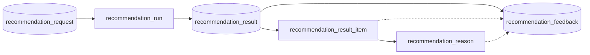
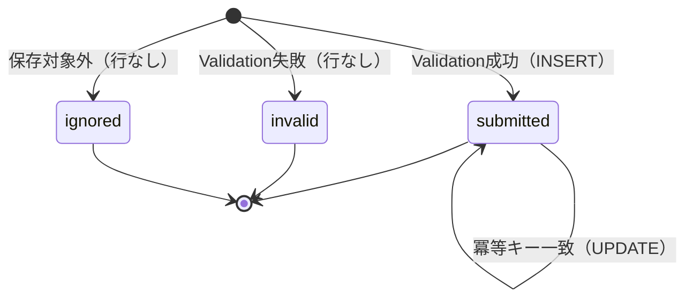

# Recommendation Feedback テーブル定義書

## 1. ドキュメント情報

| 項目           | 内容                            |
| -------------- | ------------------------------- |
| ドキュメントID | `DB-TBL-MVP-recommendation_feedback` |
| ドキュメント名 | Recommendation Feedback テーブル定義書 |
| 対象システム   | Gift Recommendation Service MVP |
| MVP対象        | `yes`                           |
| 作成日         | 2026-06-15                      |
| 更新日         | 2026-06-15（#544 recommendation_result マージ反映） |

---

## 2. 概要

`recommendation_feedback` は、ユーザーが推薦結果（Recommendation Result / Result Item / Reason）に対して入力した **Feedback 正本** を保持する Online推薦系テーブルである。

web から api 経由で API-PUB-004（Feedback送信）を受け付け、Validation 成功後に api が INSERT（または冪等キー一致時は UPDATE）する。IF-DB-API-002（Feedback 保存）の DB 正本。

Online推薦フローの終端データとして、品質改善・評価・分析の入力となる。即時 Ranking 反映は行わない（Recommendation Feedback定義書 §10.3）。

---

## 3. 目的

- Online推薦フロー **Request → Run → Result → Feedback** の **Feedback 正本** として、ユーザー反応を構造化保存する
- `recommendation_result` との **物理 FK（ON）**、Result Item / Reason との **LOGICAL FK** で receives 関係を確定する（物理ER §9・§17 No.3）
- `recommendation_run` / `recommendation_request` への **trace 用 denormalized 列** を保持し、Observability・分析 JOIN を簡素化する
- API-PUB-004 Request Body → DB 列マッピングと **冪等更新キー**（`session_id` + 同一対象 + 同一 `feedback_type`）を DDL へ展開できる粒度まで確定する
- 後続 DDL Task が migration を作成できる粒度まで設計を確定する

---

## 4. テーブル基本情報

| 項目 | 内容 |
| ---- | ---- |
| 物理テーブル名 | `recommendation_feedback` |
| 論理テーブル名 | Recommendation Feedback |
| 分類 | Online推薦系 |
| 正本区分 | 内部正本 |
| 主な更新主体 | api（保存・冪等更新） |
| 主な参照主体 | batch（Feedback 分析・将来）、Observability / Evaluation 将来参照 |
| MVP対象 | `yes` |
| 関連物理ER | `docs/06_実装設計/database/物理ER.md` §8–§11・§17 |

---

## 5. 用途・責務

- ユーザーが画面（SCR-007 等）から送信した Feedback を **api が Validation 後に保存**する（処理構成定義書・IF-DB-API-002）
- `recommendation_result` を **必須親** とし、Path `resultId`（API-PUB-004）と整合する
- `feedback_target_type` に応じ、Result 全体 / Result Item / Reason への Feedback を区別する
- **冪等更新**: `session_id` + 同一対象 + 同一 `feedback_type` の再送は **UPDATE**（API-PUB-004 §14 #406）。新規は INSERT（201）
- Feedback 分析結果は **本テーブルを更新せず** 将来の派生テーブル / Batch 集計へ出力する（状態遷移設計書 §5.3.3）

### 5.1 対象外

- Feedback 集計サマリ（`recommendation_feedback_summary`。RecommendationFeedback定義書 §12.2。MVP 非必須）
- Feedback 分析結果（`feedback_analysis_result` 等。物理ER §2 No.7）
- 推薦結果・理由の生成（`recommendation_result` / `recommendation_result_item` / `recommendation_reason` の責務）
- Ranking 即時反映・ルール自動更新（Batch / Operation 将来責務）
- 認証済み `user_id` による長期パーソナライズ（認証 Epic まで対象外）

### 5.2 Online推薦フロー上の位置づけ（Request → Run → Result → Feedback）

論理ER §14.1・処理フロー概要図・recommendation_result 定義書 §5.2 を正とする。



| 観点 | 方針 |
| ---- | ---- |
| 親 Result | `recommendation_result_id` → **物理 FK ON**（NOT NULL）。1:N receives |
| 親 Run（trace） | `recommendation_run_id` → **LOGICAL FK**（denormalized）。Result / Run から INSERT 時にコピー |
| 親 Request（trace） | `recommendation_request_id` → **LOGICAL FK**（denormalized）。同上 |
| 子 Item（対象） | `recommendation_result_item_id` → **LOGICAL FK**（nullable）。`feedback_target_type=item` 時必須 |
| 子 Reason（対象） | `recommendation_reason_id` → **LOGICAL FK**（nullable）。`feedback_target_type=reason` 時必須 |

> **並行 Task**: `recommendation_result_item`（#545）/ `recommendation_reason`（#546）テーブル定義書は Epic 未 merge の場合がある。本 Task では **物理ER §9・論理ER §7.2・recommendation_result 定義書 §8.2** を正本として receives 関係を確定する。

### 5.3 親テーブルとの関係整理

| 参照元列 | 参照先 | 関係 | FK制約 | 備考 |
| -------- | ------ | ---- | ------ | ---- |
| `recommendation_result_id` | `recommendation_result.recommendation_result_id` | receives | `ON` | Path `resultId` 正本。recommendation_result 定義書 §8.2 |
| `recommendation_run_id` | `recommendation_run.recommendation_run_id` | traces | `LOGICAL` | Result 経由で解決した Run ID を denormalize |
| `recommendation_request_id` | `recommendation_request.recommendation_request_id` | traces | `LOGICAL` | Result 経由で解決した Request ID を denormalize |
| `recommendation_result_item_id` | `recommendation_result_item.recommendation_result_item_id` | receives | `LOGICAL` | nullable。Item 対象 Feedback |
| `recommendation_reason_id` | `recommendation_reason.recommendation_reason_id` | receives | `LOGICAL` | nullable。Reason 対象 Feedback |
| `item_id` | `item.item_id` | references | `LOGICAL` | 分析用。Item マスタ参照（物理 FK なし） |

### 5.4 論理ER / ドメイン定義 / API 契約との差分整理

| 出典 | 列・概念 | 本テーブル（MVP 物理 DDL） | 扱い |
| ---- | -------- | -------------------------- | ---- |
| 論理ER §7.2 | `feedback_rating`, `feedback_comment`, `submitted_at` | **`feedback_rating`**, **`feedback_text`**, **`submitted_at`** | `feedback_comment` → 物理名 **`feedback_text`**（§17.1 No.9） |
| RecommendationFeedback §7.1 | `created_at` | **`submitted_at`** | 同一意味（§17.1 No.3） |
| RecommendationFeedback §6.3 | Rating 任意論 | **`feedback_rating` NOT NULL（1〜5）** | API-PUB-004 §14 #406 で MVP 必須に確定。ドメイン §6.3 は API 契約優先で差分注記 |
| RecommendationFeedback §12.1 | 多数の分析用列 | **採用 + 一部省略** | `is_positive` / `is_negative` は nullable 派生補助。`user_agent` は nullable・長さ制限 |
| 認証・認可方針書 §19.2 | `user_id` | **MVP 物理列なし** | session_id 匿名 Feedback |
| 状態遷移設計書 §5.3.3 | 保存後原則 UPDATE しない | **冪等 UPDATE のみ許容** | 分析結果は別テーブル。§12・§17.1 No.4 |
| API-PUB-004 §14 | 重複は 200 更新 | **`updated_at` 列 + 部分 UNIQUE** | §5.6・§9 |

### 5.5 API-PUB-004 Request Body → DB 列マッピング

Path: `POST /api/v1/recommendation-results/{resultId}/feedback` → `recommendation_result_id` = Path `resultId`。

| API（Request Body） | DB 列 | 備考 |
| ------------------- | ----- | ---- |
| （Path）`resultId` | `recommendation_result_id` | 必須親。存在・整合 Validation |
| `feedbackTargetType` | `feedback_target_type` | enum `feedback_target_type` |
| `resultItemId` | `recommendation_result_item_id` | `item` 時必須 |
| `reasonId` | `recommendation_reason_id` | `reason` 時必須 |
| `feedbackType` | `feedback_type` | MVP CHECK 許容値 §10 |
| `feedbackValueType` | `feedback_value_type` | 未指定時は api が `feedback_type` から推定 |
| `feedbackValue` | `feedback_value` | `jsonb` に型を保持して保存 |
| `feedbackChoiceCode` | `feedback_choice_code` | choice 系 |
| `feedbackReasonCategory` | `feedback_reason_category` | 定義書 §7.2 category |
| `rating` | `feedback_rating` | **1〜5 整数・NOT NULL** |
| `comment` | `feedback_text` | 最大 500 文字 |
| `sourcePage` | `source_page` | 画面 ID（SCR-007 等） |
| `sessionId` | `session_id` | 冪等キー要素。個人情報を含めない |
| （api 解決） | `recommendation_run_id` | Result JOIN でコピー |
| （api 解決） | `recommendation_request_id` | Result JOIN でコピー |
| （api 解決） | `item_id` | Result Item からコピー（item / reason 時） |
| （api 解決） | `rank_at_feedback` | Result Item `rank` からコピー（item 時） |
| （Response）`recommendationFeedbackId` | `recommendation_feedback_id` | 新規 201 / 更新 200 |
| （Response）`meta.acceptedAt` | `submitted_at`（新規）/ `updated_at`（更新） | 更新時は `updated_at` を設定 |

### 5.6 冪等更新キーと UNIQUE 方針

API-PUB-004 §14 #406・Recommendation Feedback定義書 §13.2 を正とする。

| 観点 | 方針 |
| ---- | ---- |
| 冪等キー | `session_id` + **同一対象** + 同一 `feedback_type` |
| 同一対象（result） | 同一 `recommendation_result_id`（Path 固定）かつ `feedback_target_type = result` |
| 同一対象（item） | 同一 `recommendation_result_item_id` |
| 同一対象（reason） | 同一 `recommendation_reason_id` |
| `session_id` NULL | 冪等 UNIQUE 対象外。重複 INSERT を許容（匿名・体験優先。分析側で重複排除） |
| 一致時の操作 | 既存行を **UPDATE**（`feedback_value` / `feedback_text` / `feedback_rating` 等）。HTTP **200** |
| 不一致時 | 新規 **INSERT**。HTTP **201** |

**部分 UNIQUE Index（DDL Task で確定）**

| Index名 | 対象カラム | 条件 |
| ------- | ---------- | ---- |
| `uq_feedback_session_result_type` | `session_id`, `recommendation_result_id`, `feedback_type` | `feedback_target_type = 'result' AND session_id IS NOT NULL` |
| `uq_feedback_session_item_type` | `session_id`, `recommendation_result_item_id`, `feedback_type` | `feedback_target_type = 'item' AND session_id IS NOT NULL` |
| `uq_feedback_session_reason_type` | `session_id`, `recommendation_reason_id`, `feedback_type` | `feedback_target_type = 'reason' AND session_id IS NOT NULL` |

### 5.7 `feedback_status` と保存方針

| 値 | 意味 | DB 行 |
| -- | ---- | ----- |
| `submitted` | Validation 成功・保存済 | **INSERT / UPDATE 後の通常行** |
| `invalid` | Validation 失敗 | **原則 INSERT しない**（error_log 等へ。エラーコード定義書） |
| `ignored` | 重複・対象不整合で保存対象外 | MVP では **行を作らない** か、運用判断で将来拡張 |

MVP の物理テーブルには **`submitted` のみ** を基本とする。`feedback_status` 列は enum 整合・将来拡張のため保持する。

### 5.8 保存禁止・マスキング方針

- `feedback_text` に個人情報・secret を含めないよう api で Validation（Recommendation Feedback定義書 §14）
- `session_id` / `anonymous_user_id` に実ユーザー識別子・token を含めない（認証・認可方針書）
- `user_agent` は必要最小限。原文過剰保持を避け、長さ上限を設ける（§10）
- secret・Authorization・`.env` 実値を DB / ログに保存しない

---

## 6. カラム定義

| No | カラム名 | 論理名 | 型 | 必須 | PK | FK | Unique | Default | 説明 |
| --: | -------- | ------ | -- | ---- | -- | -- | ------ | ------- | ---- |
| 1 | `recommendation_feedback_id` | Recommendation Feedback ID | `uuid` | `yes` | `yes` | — | `yes` | `gen_random_uuid()` | サロゲート PK。API `recommendationFeedbackId` |
| 2 | `recommendation_result_id` | Recommendation Result ID | `uuid` | `yes` | — | `yes` | — | — | 親 Result。物理 FK ON。Path `resultId` |
| 3 | `recommendation_result_item_id` | Recommendation Result Item ID | `uuid` | `no` | — | LOGICAL | — | `NULL` | Item 対象時必須。LOGICAL FK |
| 4 | `recommendation_reason_id` | Recommendation Reason ID | `uuid` | `no` | — | LOGICAL | — | `NULL` | Reason 対象時必須。LOGICAL FK |
| 5 | `recommendation_request_id` | Recommendation Request ID | `uuid` | `no` | — | LOGICAL | — | `NULL` | trace 用 denormalize |
| 6 | `recommendation_run_id` | Recommendation Run ID | `uuid` | `no` | — | LOGICAL | — | `NULL` | trace 用 denormalize |
| 7 | `feedback_target_type` | Feedback Target Type | `varchar(32)` | `yes` | — | — | — | — | `result` / `item` / `reason` |
| 8 | `feedback_type` | Feedback Type | `varchar(64)` | `yes` | — | — | — | — | MVP 許容値 §10 |
| 9 | `feedback_value_type` | Feedback Value Type | `varchar(32)` | `yes` | — | — | — | — | boolean / rating / choice / text / event |
| 10 | `feedback_value` | Feedback Value | `jsonb` | `no` | — | — | — | `NULL` | 型付き値（API `feedbackValue`） |
| 11 | `feedback_choice_code` | Feedback Choice Code | `varchar(64)` | `no` | — | — | — | `NULL` | 選択式コード（例: `too_casual`） |
| 12 | `feedback_text` | Feedback Text | `text` | `no` | — | — | — | `NULL` | 自由コメント。API `comment`。最大 500 文字 |
| 13 | `feedback_reason_category` | Feedback Reason Category | `varchar(64)` | `no` | — | — | — | `NULL` | 不満分類（定義書 §7.2） |
| 14 | `feedback_rating` | Feedback Rating | `integer` | `yes` | — | — | — | — | 1〜5 評価。API `rating` 必須 |
| 15 | `is_positive` | Is Positive | `boolean` | `no` | — | — | — | `NULL` | 正の Feedback 補助フラグ（派生可） |
| 16 | `is_negative` | Is Negative | `boolean` | `no` | — | — | — | `NULL` | 負の Feedback 補助フラグ（派生可） |
| 17 | `rank_at_feedback` | Rank At Feedback | `integer` | `no` | — | — | — | `NULL` | Feedback 時点の表示順位 |
| 18 | `item_id` | Item ID | `uuid` | `no` | — | LOGICAL | — | `NULL` | 対象商品 ID（分析用） |
| 19 | `session_id` | Session ID | `text` | `no` | — | — | — | `NULL` | 匿名セッション。冪等キー要素 |
| 20 | `anonymous_user_id` | Anonymous User ID | `text` | `no` | — | — | — | `NULL` | MVP 任意。将来識別用 |
| 21 | `source_page` | Source Page | `varchar(64)` | `no` | — | — | — | `NULL` | 入力元画面 ID |
| 22 | `user_agent` | User Agent | `text` | `no` | — | — | — | `NULL` | ブラウザ情報（必要時のみ・長さ制限） |
| 23 | `feedback_status` | Feedback Status | `varchar(32)` | `yes` | — | — | — | `'submitted'` | `recommendation_feedback_status` |
| 24 | `submitted_at` | Submitted At | `timestamptz` | `yes` | — | — | — | `now()` | 初回送信日時（論理ER `submitted_at`） |
| 25 | `updated_at` | Updated At | `timestamptz` | `no` | — | — | — | `NULL` | 冪等 UPDATE 時のみ設定 |

> **MVP で採用しない列**: `user_id`（認証 Epic まで追加しない）。

---

## 7. 主キー・一意キー

| 種別 | 対象カラム | 方針 | 備考 |
| ---- | ---------- | ---- | ---- |
| PRIMARY KEY | `recommendation_feedback_id` | サロゲート UUID | API レスポンス ID |
| UNIQUE（部分） | `session_id`, `recommendation_result_id`, `feedback_type` | 冪等（result 対象） | `feedback_target_type = 'result'` かつ `session_id IS NOT NULL` |
| UNIQUE（部分） | `session_id`, `recommendation_result_item_id`, `feedback_type` | 冪等（item 対象） | `feedback_target_type = 'item'` かつ `session_id IS NOT NULL` |
| UNIQUE（部分） | `session_id`, `recommendation_reason_id`, `feedback_type` | 冪等（reason 対象） | `feedback_target_type = 'reason'` かつ `session_id IS NOT NULL` |

---

## 8. 外部キー・参照関係

### 8.1 参照先（親・関連）

| カラム | 参照先 | FK制約 | 参照整合性 | 備考 |
| ------ | ------ | ------ | ---------- | ---- |
| `recommendation_result_id` | `recommendation_result.recommendation_result_id` | `ON` | 物理 FK | 1:N receives。NOT NULL |
| `recommendation_run_id` | `recommendation_run.recommendation_run_id` | `LOGICAL` | api が Result から解決 | trace |
| `recommendation_request_id` | `recommendation_request.recommendation_request_id` | `LOGICAL` | 同上 | trace |
| `recommendation_result_item_id` | `recommendation_result_item.recommendation_result_item_id` | `LOGICAL` | api Validation | item 対象時必須 |
| `recommendation_reason_id` | `recommendation_reason.recommendation_reason_id` | `LOGICAL` | api Validation | reason 対象時必須 |
| `item_id` | `item.item_id` | `LOGICAL` | Item マスタ | 分析用 |

### 8.2 被参照（子テーブル）

| 参照元 | 参照列 | 関係 | FK制約 | 備考 |
| ------ | ------ | ---- | ------ | ---- |
| `error_log` | `owner_id`（`owner_type=recommendation_feedback`） | may_have | `LOGICAL` | enum §6.15。障害時 |
| `feedback_analysis_result`（将来） | `recommendation_feedback_id` | analyzes | `LOGICAL` | Evaluation 系（物理ER §2 No.7） |

---

## 9. Index

| Index名 | 対象カラム | 種別 | 用途 | 備考 |
| ------- | ---------- | ---- | ---- | ---- |
| `recommendation_feedback_pkey` | `recommendation_feedback_id` | btree（PK） | 主キー | 自動生成 |
| `uq_feedback_session_result_type` | `session_id`, `recommendation_result_id`, `feedback_type` | btree（UNIQUE partial） | 冪等（result） | §5.6 |
| `uq_feedback_session_item_type` | `session_id`, `recommendation_result_item_id`, `feedback_type` | btree（UNIQUE partial） | 冪等（item） | §5.6 |
| `uq_feedback_session_reason_type` | `session_id`, `recommendation_reason_id`, `feedback_type` | btree（UNIQUE partial） | 冪等（reason） | §5.6 |
| `idx_recommendation_feedback_result_id` | `recommendation_result_id` | btree | Result 別 Feedback 一覧 | FK 検索 |
| `idx_recommendation_feedback_result_item_id` | `recommendation_result_item_id` | btree | Item 別 Feedback | nullable |
| `idx_recommendation_feedback_reason_id` | `recommendation_reason_id` | btree | Reason 別 Feedback | nullable |
| `idx_recommendation_feedback_run_id` | `recommendation_run_id` | btree | Run trace 分析 | nullable |
| `idx_recommendation_feedback_request_id` | `recommendation_request_id` | btree | Request trace 分析 | nullable |
| `idx_recommendation_feedback_submitted` | `submitted_at` DESC | btree | 時系列・Retention 候補 | Observability |
| `idx_recommendation_feedback_type_submitted` | `feedback_type`, `submitted_at` DESC | btree | 種別別集計 | 品質改善 |
| `idx_recommendation_feedback_target_submitted` | `feedback_target_type`, `submitted_at` DESC | btree | 対象粒度別集計 | — |
| `idx_recommendation_feedback_item_id` | `item_id` | btree | 商品別 Feedback 分析 | nullable |

---

## 10. 制約

| 制約名 | 種別 | 対象 | 内容 | 備考 |
| ------ | ---- | ---- | ---- | ---- |
| `recommendation_feedback_pkey` | PRIMARY KEY | `recommendation_feedback_id` | 主キー | — |
| `fk_feedback_result` | FOREIGN KEY | `recommendation_result_id` | `recommendation_result` 参照 ON DELETE RESTRICT | DDL Task で確定 |
| `chk_feedback_status` | CHECK | `feedback_status` | `IN ('submitted','invalid','ignored')` | packages 正本と一致 |
| `chk_feedback_target_type` | CHECK | `feedback_target_type` | `IN ('result','item','reason')` | packages 正本 |
| `chk_feedback_value_type` | CHECK | `feedback_value_type` | `IN ('boolean','rating','choice','text','event')` | 定義書 §6.2 |
| `chk_feedback_type_mvp` | CHECK | `feedback_type` | MVP 10 値（§10.1） | packages 未整備。DDL CHECK |
| `chk_feedback_rating_range` | CHECK | `feedback_rating` | `feedback_rating BETWEEN 1 AND 5` | API-PUB-004 §14 |
| `chk_feedback_text_length` | CHECK | `feedback_text` | `feedback_text IS NULL OR char_length(feedback_text) <= 500` | API-PUB-004 §14 |
| `chk_feedback_user_agent_length` | CHECK | `user_agent` | `user_agent IS NULL OR char_length(user_agent) <= 500` | 過剰保持防止 |
| `chk_feedback_target_result` | CHECK | 複合 | `feedback_target_type <> 'result' OR (recommendation_result_item_id IS NULL AND recommendation_reason_id IS NULL)` | target 整合 |
| `chk_feedback_target_item` | CHECK | 複合 | `feedback_target_type <> 'item' OR recommendation_result_item_id IS NOT NULL` | item 時必須 |
| `chk_feedback_target_reason` | CHECK | 複合 | `feedback_target_type <> 'reason' OR recommendation_reason_id IS NOT NULL` | reason 時必須 |
| `chk_feedback_type_target_item` | CHECK | 複合 | `feedback_type` と `feedback_target_type` の MVP 整合 | API-PUB-004 §6.4.2 相当 |

### 10.1 MVP `feedback_type` 許容値（`chk_feedback_type_mvp`）

Recommendation Feedback定義書 §5.2・API-PUB-004 §6.4.1 に準拠。

| feedback_type | 必須 `feedback_target_type` |
| ------------- | --------------------------- |
| `item_good` | `item` |
| `item_bad` | `item` |
| `item_not_match` | `item` |
| `item_ng_violation` | `item` |
| `item_avoid_match` | `item` |
| `reason_good` | `reason` |
| `reason_bad` | `reason` |
| `result_good` | `result` |
| `result_bad` | `result` |
| `comment` | `result` / `item` / `reason` |

---

## 11. 状態・enum

| カラム | enum / code | 定義元 | 許容値 | 備考 |
| ------ | ----------- | ------ | ------ | ---- |
| `feedback_status` | `recommendation_feedback_status` | `enum定義書` §6.3 / `packages/code-definitions/state/recommendation_feedback_status.yaml` | `submitted`, `invalid`, `ignored` | MVP 保存行は基本 `submitted` |
| `feedback_target_type` | `feedback_target_type` | `enum定義書` §6.14 / `packages/code-definitions/application/feedback_target_type.yaml` | `result`, `item`, `reason` | API `feedbackTargetType` |
| `feedback_type` | （MVP CHECK） | Recommendation Feedback定義書 §5.2 | §10.1 参照 | packages 正本は後続 Task 化候補 |
| — | `owner_type`（子 Log 参照用） | `enum定義書` §6.15 | `recommendation_feedback` | error_log から被参照 |

### 11.1 `feedback_status` 状態遷移（参照）

状態遷移設計書 §5.3 を正とする。**冪等 UPDATE** は同一行の内容更新であり、状態遷移ではない（`feedback_status` は `submitted` のまま）。



---

## 12. 更新仕様

| 操作 | 実行主体 | 条件 | 更新項目 | 冪等性 | 備考 |
| ---- | -------- | ---- | -------- | ------ | ---- |
| INSERT | api | API-PUB-004 Validation 成功・冪等キー不一致 | 全列（初回） | `session_id` あり時は部分 UNIQUE | IF-DB-API-002 |
| UPDATE | api | `session_id` + 同一対象 + 同一 `feedback_type` 一致 | `feedback_value`, `feedback_text`, `feedback_rating`, `feedback_choice_code`, `feedback_reason_category`, `is_positive`, `is_negative`, `updated_at` 等 | 冪等（200） | §5.6 |
| SELECT | api / batch | 分析・検証 | — | — | — |
| DELETE | — | **MVP では行わない** | — | — | §13 Retention |

**INSERT 手順（api）**

1. Path `resultId` で `recommendation_result` 存在確認
2. Request Body Validation（target 整合・rating・文字数・`feedback_type`）
3. Result から `recommendation_run_id` / `recommendation_request_id` を解決
4. Item / Reason 対象時は ID 存在・Result 所属を確認
5. 冪等キー検索 → 一致なら UPDATE、なければ INSERT（`feedback_status = submitted`）
6. レスポンス `recommendationFeedbackId` 返却（201 / 200）

---

## 13. データ保持・削除

| 観点 | 方針 |
| ---- | ---- |
| 保持期間 | **長期保持候補**（ログ・Observability設計書 §20.2 参考。Result と同枠で 180〜365 日候補）。具体日数は **Phase2 ⑥ データ保持方針 Task** で Online コア全体と一括確定 |
| 削除方式 | MVP では **DELETE なし** |
| 削除条件 | — |
| 論理削除 | MVP 対象外 |
| アーカイブ | Phase2 ⑥ で Request / Run / Result / Feedback と一括確定 |

品質改善の重要データとして長期保持する方針（ログ・Observability設計書）。Batch Log 系（90 日）とは別枠。

---

## 14. Migration / DDL

| 項目 | 内容 |
| ---- | ---- |
| DDL対象 | `recommendation_feedback` |
| migration単位 | 1 テーブル = 1 migration（DDL Task） |
| 適用順序 | 物理ER §15: **`recommendation_result` の後**（`recommendation_result_item` / `recommendation_reason` と前後は DDL Task で調整。親 Result FK が必須） |
| rollback方針 | forward migration 主体。DROP は Human Review 必須 |
| 破壊的変更有無 | `no`（初回 CREATE） |

**DDL 概要（参考・DDL Task で確定）**

```sql
-- 参考。制約名・部分 UNIQUE は DDL Task で最終確定。
CREATE TABLE recommendation_feedback (
  recommendation_feedback_id uuid PRIMARY KEY DEFAULT gen_random_uuid(),
  recommendation_result_id uuid NOT NULL REFERENCES recommendation_result(recommendation_result_id),
  recommendation_result_item_id uuid,
  recommendation_reason_id uuid,
  recommendation_request_id uuid,
  recommendation_run_id uuid,
  feedback_target_type varchar(32) NOT NULL,
  feedback_type varchar(64) NOT NULL,
  feedback_value_type varchar(32) NOT NULL,
  feedback_value jsonb,
  feedback_choice_code varchar(64),
  feedback_text text,
  feedback_reason_category varchar(64),
  feedback_rating integer NOT NULL,
  is_positive boolean,
  is_negative boolean,
  rank_at_feedback integer,
  item_id uuid,
  session_id text,
  anonymous_user_id text,
  source_page varchar(64),
  user_agent text,
  feedback_status varchar(32) NOT NULL DEFAULT 'submitted',
  submitted_at timestamptz NOT NULL DEFAULT now(),
  updated_at timestamptz
);
```

---

## 15. セキュリティ・権限

| 観点 | 方針 |
| ---- | ---- |
| 読み取り権限 | api / batch（service role 経由） |
| 書き込み権限 | **api のみ**（INSERT / 冪等 UPDATE）。web / reco / batch から Direct DB 書き込み禁止 |
| service role利用 | Supabase service role は api / batch のみ |
| 個人情報・機微情報 | MVP は `user_id` なし。`feedback_text` は自由記述のため表示時エスケープ。個人情報混入に注意 |
| ログ出力制限 | `session_id` / `feedback_text` 原文の過剰ログ出力を避ける（ログ・Observability設計書 §14.3 相当） |

---

## 16. テスト観点

| No | 観点 | 確認内容 | 種別 |
| --: | ---- | -------- | ---- |
| 1 | DDL適用 | `recommendation_result` 作成後に FK 付きで CREATE できる | migration |
| 2 | 物理 FK | `recommendation_result_id` 不存在時 INSERT が失敗する | integration |
| 3 | target 整合 CHECK | `item` 時に `result_item_id` NULL で失敗する | unit |
| 4 | 冪等 UNIQUE | 同一 `session_id` + 対象 + `feedback_type` で 2 回目が UPDATE になる | integration |
| 5 | rating 制約 | `feedback_rating` 0 / 6 が拒否される | unit |
| 6 | text 長さ | `feedback_text` 501 文字が拒否される | unit |
| 7 | enum 整合 | `feedback_status` / `feedback_target_type` が packages 正本と一致 | manual |
| 8 | API マッピング | API-PUB-004 代表 Body が期待列へ射影される | contract / integration |

---

## 17. 未決事項

| No | 論点 | 判断が必要な理由 | 判断者 | 期限 | 備考 |
| --: | ---- | ---------------- | ------ | ---- | ---- |
| 1 | `feedback_type` packages 正本化 | enum定義書 §7 に未登録。CHECK のみで先行 | Human Review | DDL Task 前 | 別 Task 化候補 |
| 2 | Online コア Retention 日数 | Observability は候補値のみ | Human Review | Phase2 ⑥ | §13 |
| 3 | `anonymous_user_id` MVP 採用可否 | ドメインは任意。運用で未使用可 | Human Review | 実装 Task 前 | 列は nullable で確保 |
| 4 | #545 / #546 merge 後の双方向整合 | 子テーブル定義書未 merge 時 | Worker AI / Human Review | PR Review | 物理ER を正本として先行 |

---

## 18. 関連資料

| 種別 | パス / URL | 用途 |
| ---- | ---------- | ---- |
| 物理ER | `docs/06_実装設計/database/物理ER.md` | receives・Online推薦系分類 |
| 論理ER | `docs/05_アプリケーション設計/アプリ/database/論理ER.md` | §7.2 属性 |
| テーブル一覧 | `docs/05_アプリケーション設計/アプリ/database/テーブル一覧.md` | §3 No.6 |
| ドメイン定義 | `docs/04_ドメインモデル設計/RecommendationFeedback定義書.md` | Feedback 項目・種別 |
| enum定義書 | `docs/06_実装設計/database/enum定義書.md` | §6.3 / §6.14 / §7 |
| API契約 | `docs/06_実装設計/api/API-PUB-004_Feedback送信API契約仕様書.md` | Request / 冪等 |
| 親 Result | `docs/06_実装設計/database/recommendation_result_テーブル定義書.md` | receives 双方向 |
| 親 Run | `docs/06_実装設計/database/recommendation_run_テーブル定義書.md` | trace |
| 親 Request | `docs/06_実装設計/database/recommendation_request_テーブル定義書.md` | trace |
| 状態遷移 | `docs/05_アプリケーション設計/アプリ/状態遷移設計書.md` | §5.3 |
| 認証方針 | `docs/05_アプリケーション設計/基盤/認証・認可方針書.md` | 匿名 Feedback |
| I/F | `docs/05_アプリケーション設計/アプリ/インターフェース一覧.md` | IF-DB-API-002 |
| packages | `packages/code-definitions/state/recommendation_feedback_status.yaml` | feedback_status 正本 |
| packages | `packages/code-definitions/application/feedback_target_type.yaml` | feedback_target_type 正本 |
| Task Definition | `prompts/definitions/tasks/db-physical-design/table-spec-recommendation-feedback.yaml` | #547 scope |

---

## 19. レビュー観点

- テーブル一覧 §3 No.6・論理ER §7.2・物理ER §9 receives と矛盾していないか
- `recommendation_result` / `recommendation_run` 定義書と receives / trace 関係が双方向整合しているか
- API-PUB-004 §14（rating 必須・comment 500 文字・冪等 UPDATE）が反映されているか
- `feedback_status` / `feedback_target_type` が enum定義書・packages 正本と一致しているか
- 冪等部分 UNIQUE が `feedback_target_type` 別に整理されているか
- 状態遷移設計書 §5.3.3 と冪等 UPDATE の差分が §11.1 / §12 で明示されているか
- DDL・migration・apps 実装が混在していないか
- secretや`.env`実値が含まれていないか

### 19.1 Human Review 確定事項（Task #547）

| No | 論点 | 確定内容 |
| --: | ---- | -------- |
| 1 | `feedback_status` 物理列 | MVP 物理列あり。保存行は基本 `submitted` |
| 2 | `user_id` | MVP 物理列なし |
| 3 | `submitted_at` | 論理ER `submitted_at` と同一意味 |
| 4 | 冪等更新 | `session_id` + 同一対象 + 同一 `feedback_type` で UPDATE 許容 |
| 5 | `recommendation_result_id` | 物理 FK ON・NOT NULL |
| 6 | Item / Reason ID | nullable・条件付き必須。物理 FK は LOGICAL |
| 7 | Run / Request trace 列 | denormalized LOGICAL FK として保持可 |
| 8 | `feedback_rating` | NOT NULL（1〜5） |
| 9 | `feedback_text` | 最大 500 文字。物理名 `feedback_text` |
| 10 | Retention | MVP DELETE なし。長期保持候補を注記 |
