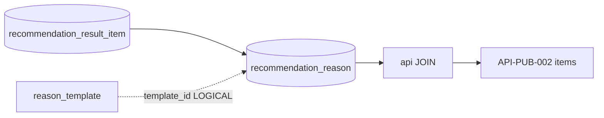

# Recommendation Reason テーブル定義書

## 1. ドキュメント情報

| 項目           | 内容                                  |
| -------------- | ------------------------------------- |
| ドキュメントID | `DB-TBL-MVP-recommendation_reason`    |
| ドキュメント名 | Recommendation Reason テーブル定義書  |
| 対象システム   | Gift Recommendation Service MVP       |
| MVP対象        | `yes`                                 |
| 作成日         | 2026-06-15                            |
| 更新日         | 2026-07-16（#1398 Public 任意返却に reason_detail / reason_points_json を追加） |

---

## 2. 概要

`recommendation_reason` は、Online 推薦結果の商品明細（`recommendation_result_item`）ごとに生成される **推薦理由文・バッジ・根拠** を保持する派生 Snapshot テーブルである。

reco の Reason Generator（MOD-RECO-023）が Ranking / Result Item 保存後に生成し、IF-DB-RECO-008（Reason 保存）の DB 正本とする。Public API（API-PUB-002）では api が本テーブルを **JOIN** して `reasonSummary` / `reasonPoints` / `reasonDetail` / `reasonBadges` / `cautionNote` を組み立てる（`recommendation_result_item` 定義書 §5.5。`reasonPoints` / `reasonDetail` は任意、#1398）。

使用した `reason_template` は `template_id` 列および `reason_basis_json` に記録する（reason_template 定義書 §5.3・§6.2）。

---

## 3. 目的

- `recommendation_result_item` に対する **has** 関係で、商品単位の推薦理由を派生 Snapshot として保存する
- Reason生成定義書 §14.2 の **`reason_basis`** を `reason_basis_json` として保持し、説明可能性・評価・PDCA に利用する
- `reason_template` 解決結果を `template_id`（uuid）と `reason_basis_json`（`template_name` / `template_version`）で記録する
- API-PUB-002 / API-INT-002 の Reason 表示項目と DB 物理列の対応を明確化する
- 後続 DDL Task が migration を作成できる粒度まで設計を確定する

---

## 4. テーブル基本情報

| 項目 | 内容 |
| ---- | ---- |
| 物理テーブル名 | `recommendation_reason` |
| 論理テーブル名 | Recommendation Reason |
| 分類 | Online推薦系 |
| 正本区分 | 派生 / Snapshot |
| 主な更新主体 | reco |
| 主な参照主体 | api（読取・Public 応答組立）、reco、Observability / Evaluation |
| MVP対象 | `yes` |
| 関連物理ER | `docs/06_実装設計/database/物理ER.md` §8–§11 |

---

## 5. 用途・責務

- Result Item INSERT 完了後、reco が **商品明細ごとに 0 または 1 行 INSERT** する（処理構成定義書・result_item 定義書 §12 手順 5）
- `reason_template` を解決し、テンプレート生成（必要に応じ LLM 整形）で `reason_summary` 等を生成する（Reason生成定義書 §15.3）
- **`reason_basis_json`** に根拠（使用 Feature・スコア・テンプレート版）を保持する（§6.2）
- INSERT 後は **原則 UPDATE しない**（派生 Snapshot。状態遷移設計書：Reason Badge / Summary は個別状態不要）
- Reason 生成 **のみ** 失敗した Item についても、**§17.2 汎用 Reason 注入時は行を INSERT** する。`reason_basis_json.generation_method` に `orchestrator_generic_fallback` または `reason_module_internal_fallback` を記録し、`reason_summary` に汎用文を保存する（MOD-RECO-001 §10.3、API-INT-002 §7.3.2.1）
- `021`/`022` 以前の致命失敗で Item 自体が存在しない場合は INSERT しない
- `recommendation_feedback` の **Reason 単位評価** の参照先となり得る（認証・認可方針書・RecommendationFeedback定義書）

### 5.1 対象外

- 推薦結果明細本体（`recommendation_result_item` の責務。`recommendation_result_item_テーブル定義書.md`）
- Reason テンプレート正本（`reason_template` の責務。`reason_template_テーブル定義書.md`）
- Run / Result ヘッダ（`recommendation_run` / `recommendation_result` の責務）
- Public API 上の `reasonStatus` 物理列（**本テーブルでは保持しない**。行の有無で導出。result_item 定義書 §5.4）
- LLM prompt 全文の永続化（`llm_prompt_version` のみ `reason_basis_json` に保持。phase_log 定義書 §5.3）

### 5.2 Online推薦フロー上の位置づけ



| 観点 | 方針 |
| ---- | ---- |
| 親 Result Item | `recommendation_result_item_id` で **物理 FK ON**（has）。result_item 定義書 §8.2 と双方向整合 |
| テンプレート | `template_id` に `reason_template.reason_template_id`（uuid）を **論理参照**（reason_template 定義書 §8.1） |
| 生成タイミング | Result Item INSERT の **直後・同一トランザクション推奨**（result_item 定義書 §12） |
| 0 件 Result | Result Item 行が 0 件のとき **本テーブル行も 0 件** |
| Run / Item 追跡 | `recommendation_run_id` / `item_id` は **本テーブルに保持しない**。Result Item 経由で辿る（§17.1 No.1 **決定済み**） |

> **親 Result Item 定義書（#545 / PR #550 merge 済み）** と双方向整合する。has 側は本定義書 §8.1、被参照側は `recommendation_result_item_テーブル定義書.md` §8.2。

### 5.3 論理ER / Reason生成定義書 / API 契約との差分整理

| 出典 | 列・概念 | 本テーブル（MVP 物理 DDL） | 扱い |
| ---- | -------- | -------------------------- | ---- |
| 論理ER §7.2 | `recommendation_reason_id`, `recommendation_result_item_id`, 理由文 JSON 列群 | **採用** | 正本 |
| 論理ER §7.2 | `reason_badges_json`, `reason_points_json`, `reason_basis_json` | **採用**（JSONB） | 論理名どおり |
| Reason生成 §15.1 | `reason_summary`, `reason_detail`, `caution_note`, `template_id` | **採用** | 一致 |
| Reason生成 §15.1 | `reason_basis` | **`reason_basis_json`（JSONB）** | 物理名は `_json` サフィックス |
| Reason生成 §15.1 | `recommendation_run_id` | **MVP 物理列なし** | Result Item → Result → Run で追跡（§17.1 No.1 **決定済み**） |
| Reason生成 §15.1 | `item_id` | **MVP 物理列なし** | `recommendation_result_item.item_id` で追跡（§17.1 No.1 **決定済み**） |
| Reason生成 §15.1 | `generation_method` | **MVP 物理列なし** | `reason_basis_json.generation_method` に記録（§17.1 No.2 **決定済み**） |
| Reason生成 §15.1 | `model_version_id` | **MVP 物理列なし** | `recommendation_run.model_version_id` で再現性確保（§17.1 No.3 **決定済み**） |
| Reason生成 §15.1 | `generated_at` | **`created_at`** | 物理名 `created_at`。論理 `generated_at` と同一意味 |
| result_item §5.4 | `recommendation_reason_id` / `reason_status` on Item | **Item 側は保持しない** | 本テーブル側の責務（#545 決定済み） |
| API-INT-002 | `reasonStatus` | **DB 列なし** | 行あり = `completed`（fallback 含む）。Item 不在時のみ行なし |
| API-INT-002 | `recommendationReasonId` | `recommendation_reason_id` | Internal 返却時は推奨 |

### 5.4 `reason_basis_json` 必須項目（MVP）

Reason生成定義書 §14.2 / §14.3・reason_template 定義書 §6.2 を正とする。

| JSON key | 必須 | 内容 |
| -------- | ---- | ---- |
| `template_name` | `yes` | 使用 `reason_template.template_name` |
| `template_version` | `yes` | 使用 `reason_template.template_version`（integer） |
| `used_features` | `yes` | 使用 Feature 配列（§14.2 構造） |
| `used_scores` | `yes` | 使用スコア（`context_score` 等） |
| `used_semantic_evidence` | 推奨 | 意味根拠配列 |
| `template_type` | 推奨 | `summary` / `detail` / `point` / `caution` |
| `generation_method` | `yes` | `template` / `llm_refined` / `hybrid`（物理列なし。§17.1 No.2 **決定済み**） |
| `llm_prompt_version` | LLM 利用時必須 | 版識別子（prompt 全文は保持しない） |
| `generated_text` | 推奨 | 生成文面の記録（評価用。`reason_summary` と重複し得る） |

> 版サフィックス付き文字列 ID（例: `social_reason_boss_thanks_v1`）は **使用しない**（reason_template 定義書 §5.3）。

### 5.5 API 応答 ↔ DB 列マッピング

#### Public（API-PUB-002 `data.items[]`）

api は `recommendation_result_item` と **LEFT JOIN** し、Reason 行が存在する Item のみ Reason 項目を付与する。

| API 項目 | DB 列 / 導出 | 備考 |
| -------- | ------------ | ---- |
| `reasonSummary` | `reason_summary` | `includeReason=true` かつ行存在時は原則返却（契約上任意） |
| `reasonPoints` | `reason_points_json` | **任意**。string 配列としてシリアライズ（#1398） |
| `reasonDetail` | `reason_detail` | **任意**（#1398） |
| `reasonBadges` | `reason_badges_json` | string 配列としてシリアライズ |
| `cautionNote` | `caution_note` | nullable |

**Public で返さない DB 列**: `reason_basis_json`, `template_id`（API設計方針書 §18.4 / §21.3。`reasonBasis` は引き続き非公開）

#### Internal（API-INT-002 `data.resultItems[]`）

| API 項目 | DB 列 / 導出 | 備考 |
| -------- | ------------ | ---- |
| 上記 Public 相当 | 同上 | `reasonPoints` / `reasonDetail` は Internal `resultItems[]` にも任意で載せ、api が Public へ透過（#1398） |
| `recommendationReasonId` | `recommendation_reason_id` | `reasonStatus=completed` 時推奨 |
| `reasonStatus` | 行の有無 | 行あり = `completed`（fallback 含む）。Item 存続時は fallback でも行あり |
| `reasonBasis` | `reason_basis_json` | debug / evaluation 時推奨。**Public 非返却** |

Run レベル `reasonData`（API-INT-002 §7.3.9）は **本テーブル行の集合ビュー** として api / reco が組立。物理列は Item 単位の本テーブルを正本とする。

OpenAPI / generated 変更は Task #469 へ委譲。

---

## 6. カラム定義

| No | カラム名 | 論理名 | 型 | 必須 | PK | FK | Unique | Default | 説明 |
| --: | -------- | ------ | -- | ---- | -- | -- | ------ | ------- | ---- |
| 1 | `recommendation_reason_id` | Recommendation Reason ID | `uuid` | `yes` | `yes` | — | `yes` | `gen_random_uuid()` | サロゲート PK。API `recommendationReasonId`・Feedback 参照 |
| 2 | `recommendation_result_item_id` | Recommendation Result Item ID | `uuid` | `yes` | — | `ON` | `yes` | — | 親 Result Item。物理 FK ON。**1 Item 1 Reason**（§7・§17.1 No.4 **決定済み**） |
| 3 | `template_id` | Template ID | `uuid` | `yes` | — | `LOGICAL` | — | — | 使用 `reason_template.reason_template_id`。MVP は物理 FK なし |
| 4 | `reason_summary` | Reason Summary | `text` | `yes` | — | — | — | — | 短い推薦理由。API `reasonSummary`。空文字不可（CHECK） |
| 5 | `reason_detail` | Reason Detail | `text` | `no` | — | — | — | `NULL` | 詳細推薦理由。Internal / 将来画面用 |
| 6 | `reason_points_json` | Reason Points | `jsonb` | `no` | — | — | — | `NULL` | 箇条書き理由（string 配列）。API `reasonPoints` |
| 7 | `reason_badges_json` | Reason Badges | `jsonb` | `no` | — | — | — | `NULL` | 表示ラベル（string 配列）。API `reasonBadges` |
| 8 | `caution_note` | Caution Note | `text` | `no` | — | — | — | `NULL` | 補足・注意文。API `cautionNote` |
| 9 | `reason_basis_json` | Reason Basis | `jsonb` | `yes` | — | — | — | — | 根拠 JSON（§5.4 必須項目） |
| 10 | `created_at` | Created At | `timestamptz` | `yes` | — | — | — | `now()` | Reason 生成日時。論理ER `generated_at` と同一意味 |

> **MVP で採用しない列**: `recommendation_run_id`, `item_id`, `generation_method`, `model_version_id`, `reason_status`, `updated_at`（§5.3・§17.1 **決定済み**）。

### 6.1 JSON 列参照構造（MVP）

物理 DDL では JSON Schema CHECK は設けず、reco 側で整合を担保する。

**`reason_badges_json` 例:**

```json
["きちんと感", "外しにくい", "上品"]
```

**`reason_points_json` 例:**

```json
[
  "フォーマルな場面に適した商品構成です",
  "レビュー評価が安定しており安心感があります"
]
```

---

## 7. 主キー・一意キー

| 種別 | 対象カラム | 方針 | 備考 |
| ---- | ---------- | ---- | ---- |
| PRIMARY KEY | `recommendation_reason_id` | サロゲート UUID | Feedback・Internal API の参照先 |
| UNIQUE | `recommendation_result_item_id` | **1 Item 1 Reason** | 物理ER §9 は 1:N だが、MVP DDL は UNIQUE で実質 1:1（§17.1 No.4 **決定済み**） |

---

## 8. 外部キー・参照関係

### 8.1 参照先

| カラム | 参照先 | FK制約 | ON DELETE | 備考 |
| ------ | ------ | ------ | --------- | ---- |
| `recommendation_result_item_id` | `recommendation_result_item.recommendation_result_item_id` | `ON` | `RESTRICT` | has。`recommendation_result_item_テーブル定義書.md` §8.2 と双方向整合 |
| `template_id` | `reason_template.reason_template_id` | なし | — | **LOGICAL**。reason_template 定義書 §8.1。MVP は物理 FK なし |

### 8.2 被参照（子テーブル）

| 参照元 | 参照列 | 関係 | FK制約 | 備考 |
| ------ | ------ | ---- | ------ | ---- |
| `recommendation_feedback` | `recommendation_reason_id` | receives | `LOGICAL` | nullable。`feedback_target_type=reason` 時必須。`recommendation_feedback_テーブル定義書.md` §8.2 と双方向整合 |

> **物理ER §9 との差分**: 現行物理ER §9 には `reason_template` → `recommendation_reason.template_id` の関係行が未記載。物理ER 更新は本 Task scope 外（reason_template 定義書 follow-up と同方針）。本定義書 §8.1 で LOGICAL 参照を明記する。

---

## 9. Index

| Index名 | 対象カラム | 種別 | 用途 | 備考 |
| ------- | ---------- | ---- | ---- | ---- |
| `recommendation_reason_pkey` | `recommendation_reason_id` | btree（PK） | 主キー | 自動生成 |
| `uq_recommendation_reason_result_item` | `recommendation_result_item_id` | unique btree | 親 Item からの JOIN・1:1 担保 | §17.1 No.4 **決定済み** |
| `idx_recommendation_reason_template_id` | `template_id` | btree | テンプレート別分析・PDCA | 任意（DDL Task で確定） |

---

## 10. 制約

| 制約名 | 種別 | 対象 | 内容 | 備考 |
| ------ | ---- | ---- | ---- | ---- |
| `fk_recommendation_reason_result_item` | FOREIGN KEY | `recommendation_result_item_id` | `recommendation_result_item` 参照 | ON DELETE RESTRICT |
| `uq_recommendation_reason_result_item` | UNIQUE | `recommendation_result_item_id` | 1 Item 1 Reason | §17.1 No.4 **決定済み** |
| `chk_reason_summary_not_empty` | CHECK | `reason_summary` | `length(trim(reason_summary)) > 0` | 空理由の INSERT 禁止 |
| `chk_reason_basis_json_object` | CHECK | `reason_basis_json` | `jsonb_typeof(reason_basis_json) = 'object'` | オブジェクト型のみ |

> `reason_basis_json` 内必須キーの CHECK は MVP では設けず、reco INSERT 前検証とする。

---

## 11. 状態・enum

本テーブルに **状態カラムは持たない**（論理ER §7.2・状態遷移設計書）。

| 概念 | MVP 表現 | 備考 |
| ---- | -------- | ---- |
| Reason 生成成功（通常） | **行が存在** | API `reasonStatus = completed`、`isFallback: false` |
| Reason 汎用文 fallback | **行が存在** | `reason_summary` に §17.2 汎用文。`reason_basis_json.generation_method` で fallback 由来を識別。API `isFallback: true` |
| Reason 致命失敗（Item 不在） | **行が存在しない** | `021`/`022` 以前の失敗で Item 自体が生成されない場合 |
| `generation_method` | `reason_basis_json` 内 | 物理 enum 列なし（§17.1 No.2 **決定済み**） |

---

## 12. 更新仕様

| 操作 | 実行主体 | 条件 | 更新項目 | 冪等性 | 備考 |
| ---- | -------- | ---- | -------- | ------ | ---- |
| INSERT | reco | Result Item 保存後・Reason 生成成功または fallback 注入時 | 全列（初回） | `recommendation_result_item_id` UNIQUE で重複拒否 | IF-DB-RECO-008 |
| SELECT | api / reco | 結果表示・Feedback 検証 | — | — | api は JOIN で Public 応答組立 |
| UPDATE | — | **MVP では行わない** | — | — | 派生 Snapshot 不変 |
| DELETE | — | **MVP では行わない** | — | — | §13 Retention |

**INSERT 手順（reco / MOD-RECO-023）**

1. `recommendation_result_item` 行が存在することを確認
2. `reason_template` を解決（reason_template 定義書 §7.1）
3. Feature / Score / Semantic evidence から Reason 文面・バッジを生成
4. `reason_basis_json` を組立（§5.4 必須項目。fallback 時は `generation_method` に由来を記録）
5. 成功または fallback 注入時に本テーブルへ INSERT（Item は保持。fallback も非空 `reason_summary` 必須）
6. api が Result 応答時に LEFT JOIN

---

## 13. データ保持・削除

| 観点 | 方針 |
| ---- | ---- |
| 保持期間 | **180 日〜365 日**（ログ・Observability設計書 §20.2 参考。Online コアと同値）。具体日数は **Phase2 ⑥ データ保持・削除方針 Task** で一括確定 |
| 削除方式 | MVP では **DELETE なし** |
| Snapshot | INSERT 後 **上書きしない** |
| アーカイブ | Request / Run / Result / Result Item / Reason / Feedback を一括確定（result_item 定義書 §13） |

---

## 14. Migration / DDL

| 項目 | 内容 |
| ---- | ---- |
| DDL対象 | `recommendation_reason` |
| migration単位 | 1 テーブル = 1 migration（DDL Task） |
| 適用順序 | 物理ER §15: **`recommendation_result_item` 作成後**、`recommendation_feedback` より前 |
| rollback方針 | forward migration 主体。DROP は Human Review 必須 |
| 破壊的変更有無 | `no`（初回 CREATE） |

**DDL 概要（参考・DDL Task で確定）**

```sql
-- 参考。制約名・Index は DDL Task で最終確定。
CREATE TABLE recommendation_reason (
  recommendation_reason_id uuid PRIMARY KEY DEFAULT gen_random_uuid(),
  recommendation_result_item_id uuid NOT NULL,
  template_id uuid NOT NULL,
  reason_summary text NOT NULL,
  reason_detail text,
  reason_points_json jsonb,
  reason_badges_json jsonb,
  caution_note text,
  reason_basis_json jsonb NOT NULL,
  created_at timestamptz NOT NULL DEFAULT now(),
  CONSTRAINT fk_recommendation_reason_result_item
    FOREIGN KEY (recommendation_result_item_id)
    REFERENCES recommendation_result_item (recommendation_result_item_id)
    ON DELETE RESTRICT,
  CONSTRAINT uq_recommendation_reason_result_item
    UNIQUE (recommendation_result_item_id),
  CONSTRAINT chk_reason_summary_not_empty
    CHECK (length(trim(reason_summary)) > 0),
  CONSTRAINT chk_reason_basis_json_object
    CHECK (jsonb_typeof(reason_basis_json) = 'object')
);
```

---

## 15. セキュリティ・権限

| 観点 | 方針 |
| ---- | ---- |
| 読み取り権限 | api / reco（service role 経由） |
| 書き込み権限 | **reco のみ**（INSERT）。web / batch から Direct DB 書き込み禁止 |
| service role利用 | reco の Reason 保存に限定 |
| 個人情報・機微情報 | `reason_basis_json` に LLM prompt 全文・ユーザー自由記述を含めない。`reason_detail` も商品・贈答文脈に限定 |
| ログ出力制限 | `reason_basis_json` 全文を error ログに出力しない |

---

## 16. テスト観点

| No | 観点 | 確認内容 | 種別 |
| --: | ---- | -------- | ---- |
| 1 | DDL適用 | CREATE TABLE / Index / FK / CHECK / UNIQUE が定義どおり | migration |
| 2 | FK 整合 | 存在しない `recommendation_result_item_id` への INSERT が拒否される | migration |
| 3 | UNIQUE | 同一 Result Item への 2 回目 INSERT が拒否される（MVP 1:1 時） | migration |
| 4 | CHECK | 空 `reason_summary`・非 object `reason_basis_json` が拒否される | migration |
| 5 | 不変性 | INSERT 後の Reason 文面 UPDATE がアプリ方針で行われない | manual |
| 6 | API マッピング | API-PUB-002 / API-INT-002 の Reason 項目が DB 列と整合 | contract |
| 7 | fallback INSERT | Reason 失敗 Item にも汎用 Reason 行が INSERT され Result Item が存続すること | integration |
| 8 | template 記録 | `template_id` と `reason_basis_json` の `template_name` / `template_version` が一致 | integration |
| 9 | 親 Item 整合 | result_item 定義書 §8.2 has 関係・§5.5 JOIN 方針と一致 | manual |

---

## 17. 決定事項

| No | 論点 | 判断が必要な理由 | 判断者 | 期限 | 備考 |
| --: | ---- | ---------------- | ------ | ---- | ---- |
| — | — | — | — | — | Human Review（Issue #546）にて §17.1 No.1〜4 を決定済み |

### 17.1 Human Review 決定事項（Issue #546）

| No | 論点 | 決定内容 | 決定者 | 備考 |
| --: | ---- | -------- | ------ | ---- |
| 1 | `recommendation_run_id` / `item_id` 冗長列 | **MVP 物理列なし**。Result Item / Result / Run 経由で追跡 | Human | Reason生成定義書 §15.1 との差分は §5.3 に明示 |
| 2 | `generation_method` 物理列 | **`reason_basis_json` のみ**（`generation_method` キー必須） | Human | 物理 enum 列は採用しない |
| 3 | `model_version_id` 保持 | **MVP 物理列なし** | Human | `recommendation_run.model_version_id` を正本 |
| 4 | 1 Item : N Reason | **`UNIQUE(recommendation_result_item_id)`** で実質 1:1 | Human | 物理ER §9 は 1:N。将来 multi-reason は UNIQUE 解除 |

### 17.2 先行 Task からの確定事項（引用）

| No | 論点 | 決定内容 | 出典 |
| --: | ---- | -------- | ---- |
| 1 | Reason 項目の保持先（Item 側） | Item に `recommendation_reason_id` / `reason_status` / reasonSummary を **保持しない** | result_item 定義書 §5.4・§17.1 |
| 2 | has 関係 | 物理ER §9 は **1:N**。FK ON。MVP DDL は §17.1 No.4 により **実質 1:1** | result_item §8.2・本定義書 §8.1 |
| 3 | Public API Reason 返却 | api が **JOIN** して `reasonSummary` 等を組立 | result_item §5.5 |
| 4 | `template_id` LOGICAL 参照 | `reason_template_id`（uuid）格納 + `reason_basis_json` 併記 | reason_template §8.1・§6.2 |

---

## 18. 関連資料

| 種別 | パス / URL | 用途 |
| ---- | ---------- | ---- |
| 物理ER | `docs/06_実装設計/database/物理ER.md` | §9 FK・派生Snapshot 分類 |
| 論理ER | `docs/05_アプリケーション設計/アプリ/database/論理ER.md` | §7.2 / §14 |
| テーブル一覧 | `docs/05_アプリケーション設計/アプリ/database/テーブル一覧.md` | §3 No.5 |
| Reason生成 | `docs/04_ドメインモデル設計/Reason生成定義書.md` | §14 / §15.1 |
| RecommendationResult | `docs/04_ドメインモデル設計/RecommendationResult定義書.md` | §11 Reason / Feedback |
| 正本定義表 | `docs/05_アプリケーション設計/アプリ/database/正本定義表.md` | 派生 / Snapshot 区分 |
| I/F | `docs/05_アプリケーション設計/アプリ/インターフェース一覧.md` | IF-DB-RECO-008 |
| 機能×モジュール | `docs/05_アプリケーション設計/アプリ/機能×モジュール対応表.md` | MOD-RECO-023 |
| API 契約 | `docs/06_実装設計/api/API-PUB-002_レコメンド実行API契約仕様書.md` | Public Reason マッピング |
| API 契約 | `docs/06_実装設計/api/API-INT-002_Reco推薦実行API契約仕様書.md` | Internal Reason マッピング |
| reason_template | `docs/06_実装設計/database/reason_template_テーブル定義書.md` | template_id / reason_basis_json |
| 親 Result Item | `docs/06_実装設計/database/recommendation_result_item_テーブル定義書.md` | has §8.2 / API §5.5 |
| 親 Run | `docs/06_実装設計/database/recommendation_run_テーブル定義書.md` | model_version 再現性文脈 |
| phase_log | `docs/06_実装設計/database/phase_log_テーブル定義書.md` | llm_prompt_version 参照 |
| Observability | `docs/05_アプリケーション設計/アプリ/ログ・Observability設計書.md` | Reason 生成タイミング |

---

## 19. レビュー観点

- テーブル一覧 §3 No.5・論理ER §7.2・物理ER §9 と矛盾していない
- `recommendation_result_item` との has 関係（FK ON）が §8.1 に明記されている
- `recommendation_result_item_テーブル定義書.md` §8.2 / §5.5 と双方向整合している
- `reason_template` との `template_id` LOGICAL 参照・`reason_basis_json` 必須項目が reason_template §6.2 と一致している
- Reason生成定義書 §14.2 / §15.1 との差分が §5.3 に明示されている
- API-PUB-002 / API-INT-002 の Reason マッピングが §5.5 に整理されている
- INSERT 後 UPDATE 禁止・Reason fallback 時も INSERT する方針が §12 に明記されている
- Human Review #546 決定事項（§17.1 No.1〜4）が本文に反映されている
- apps/** 変更がない
