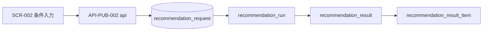

# Recommendation Request テーブル定義書

## 1. ドキュメント情報

| 項目           | 内容                            |
| -------------- | ------------------------------- |
| ドキュメントID | `DB-TBL-MVP-recommendation_request` |
| ドキュメント名 | Recommendation Request テーブル定義書 |
| 対象システム   | Gift Recommendation Service MVP |
| MVP対象        | `yes`                           |
| 作成日         | 2026-06-15                      |
| 更新日         | 2026-06-15                      |

---

## 2. 概要

`recommendation_request` は、ユーザーがギフト推薦を依頼する際の **入力条件正本** を保持する Online推薦系テーブルである。

Web UI（SCR-002）から API-PUB-002 経由で受け取った贈答条件を api が検証・保存し、reco への推薦実行（`recommendation_run`）の起点となる。IF-DB-API-001（Recommendation Request 保存）の DB 正本。

Public API レスポンスでは Request 全体を返さないが、`recommendation_request_id` を trace キーとして返却する（RecommendationRequest定義書 §12.2）。

---

## 3. 目的

- Online推薦フロー **Request → Run → Result** の起点として、ユーザー入力条件を不変の正本として保存する
- 主要検索・参照項目を **個別カラム**、完全再現用に **`request_payload` / `validated_payload`（JSONB）** を併用する（物理ER §17 No.2・RecommendationRequest定義書 §11.2）
- `relationship_master` / `occasion_master` を **LOGICAL 参照**し、Master コード整合を api validation で担保する
- `pair_id` は保持せず、実行時解決結果は **`recommendation_run`** 側で保持する（物理ER §17 No.1）
- 後続 DDL Task が migration を作成できる粒度まで設計を確定する

---

## 4. テーブル基本情報

| 項目 | 内容 |
| ---- | ---- |
| 物理テーブル名 | `recommendation_request` |
| 論理テーブル名 | Recommendation Request |
| 分類 | Online推薦系 |
| 正本区分 | 内部正本 |
| 主な更新主体 | api（保存）、reco（参照のみ） |
| 主な参照主体 | api、reco、Observability / Admin 将来参照 |
| MVP対象 | `yes` |
| 関連物理ER | `docs/06_実装設計/database/物理ER.md` §8–§11・§17 |

---

## 5. 用途・責務

- API-PUB-002 Request Body を **バリデーション後** INSERT する（処理構成定義書：api 検証後・reco 呼び出し前）
- バリデーション失敗時は **行を INSERT しない**（状態遷移設計書 §11.1・RecommendationRequest定義書 §8）
- 保存後は **入力条件の改変を行わない**（MVP は immutable。再実行は同一 Request に対する新規 Run）
- `recommendation_run` / `recommendation_result` の **親 Request** として 1:N で参照される
- Semantic / Feature 生成・Matching / Ranking の **入力コンテキスト正本** として reco が `validated_payload` または個別カラムを参照する

### 5.1 対象外

- 推薦実行状態（`run_status` は `recommendation_run` の責務）
- 推薦結果・理由・Feedback（各 Online推薦系子テーブルの責務）
- User 派生データ（`user_semantic` / `user_feature` / `user_meaning` の責務）
- Pair 解決結果の保持（`pair_id` は `recommendation_run` の責務）
- 独立 `recommendation_request_condition` テーブル（MVP 非採用。テーブル一覧 §3 補足）

### 5.2 Online推薦フロー上の位置づけ（Request → Run → Result）

論理ER §14.1・処理フロー概要図を正とする。**本テーブルはフロー起点**。



| 観点 | 方針 |
| ---- | ---- |
| 起点 | **`recommendation_request`** が Online推薦の入力正本 |
| 1:N executes | 同一 Request の **再実行** により複数 `recommendation_run` が生成され得る（物理ER §9） |
| 1:N has | 再実行により複数 `recommendation_result` が生成され得る |
| Run との FK | `recommendation_run.recommendation_request_id` → 本テーブル（**物理 FK ON**。DDL Task で確定） |
| Result との FK | `recommendation_result.recommendation_request_id` → 本テーブル（**物理 FK ON**） |

> **後続 Task**: `recommendation_run` / `recommendation_result` テーブル定義書（Batch R06 以降）で被参照 FK・Index を詳細化する。本 Task では **Request 側の列定義と子関係の方針** を確定する。

### 5.3 Master との参照関係

| 参照列 | 参照先 | 関係 | FK制約 | 備考 |
| ------ | ------ | ---- | ------ | ---- |
| `relationship_code` | `relationship_master.relationship_code` | selected_by | `LOGICAL` | relationship_master 定義書 §8.1・§17.1 No.2 |
| `occasion_code` | `occasion_master.occasion_code` | selected_by | `LOGICAL` | occasion_master 定義書 §8.1・§17.1 No.2 |
| — | `pair_master.pair_id` | — | **保持しない** | 物理ER §17 No.1。`recommendation_run.pair_id` で Run 単位再現 |

Pair 解決は api / reco が `relationship_code` + `occasion_code` から `pair_master` を参照して Run 作成時に行う（pair_master 定義書 §17）。

### 5.4 論理ER / ドメイン定義 / API 契約との差分整理

| 出典 | 列・概念 | 本テーブル（MVP 物理 DDL） | 扱い |
| ---- | -------- | -------------------------- | ---- |
| 論理ER §3 | `request_mode`, `relationship_code`, `occasion_code`, `budget_min/max`, `preferred_text`, `non_preferred_text`, `ng_text`, `requested_at` | **採用**（`requested_at` → **`created_at`** に物理名統一。§5.4 注記） | 論理ER 差分は §17 で Human Review |
| 論理ER §3 | 状態カラム | **MVP では物理列なし** | Validation 失敗は INSERT しない。成功行は暗黙 `accepted`（RecommendationRequest §10.3） |
| RecommendationRequest §11 | `mode` | **`request_mode`** | enum定義書 §6.13・API `execution.mode` |
| RecommendationRequest §11 | `status` | **MVP 物理列なし** | §10.3 簡略化 |
| RecommendationRequest §11 | `created_at`, `validated_at` | **`created_at`**, **`validated_at`** | INSERT 時に両方設定（即時実行） |
| RecommendationRequest §11 | `semantic_config_version_id`, `model_version_id` | **nullable UUID 列** | evaluation / batch mode 用。ui mode は `NULL` |
| RecommendationRequest §11 | `top_k`, `candidate_limit`, `include_reason`, `include_debug_info` | **個別列** | API-PUB-002 `execution.*` と 1:1 |
| RecommendationRequest §11 | `currency`, `free_text` | **採用** | `tax_included` も API budget から採用 |
| API-PUB-002 | camelCase Body | **`request_payload` に API 形式 JSON を保持** | 個別列は snake_case 物理名 |
| 認証・認可方針書 §19.2 | `user_id` | **MVP 物理列なし** | 将来 nullable 追加を §17 で検討 |
| 物理ER §17 No.1 | `pair_id` | **保持しない** | Run 側 |
| 物理ER §17 No.2 | payload 併用 | **`request_payload` + `validated_payload` + 個別列** | 必須 |

> **`requested_at` と `created_at`**: 論理ERは `requested_at`、ドメイン定義書は `created_at` を使用。MVP 物理 DDL では **`created_at` を Request 受付時刻** とし、論理ER `requested_at` と **同一意味** とする（§17 Human Review 論点）。

### 5.5 API-PUB-002 → DB 列マッピング（Public MVP / `request_mode = ui`）

| API-PUB-002（Request Body） | DB 列 | 備考 |
| --------------------------- | ----- | ---- |
| `relationship.relationshipCode` | `relationship_code` | 必須 |
| `occasion.occasionCode` | `occasion_code` | 必須 |
| `budget.budgetMin` | `budget_min` | 任意 |
| `budget.budgetMax` | `budget_max` | 任意 |
| `budget.currency` | `currency` | 未指定時 default `JPY` |
| `budget.taxIncluded` | `tax_included` | 任意 |
| `preferredCondition.preferredText` | `preferred_text` | 最大 500 文字 |
| `nonPreferredCondition.nonPreferredText` | `non_preferred_text` | 最大 500 文字 |
| `ngCondition.ngText` | `ng_text` | 最大 300 文字 |
| `freeText` | `free_text` | 最大 800 文字 |
| `execution.mode` | `request_mode` | Public MVP は `ui` |
| `execution.topK` | `top_k` | default 10 |
| `execution.candidateLimit` | `candidate_limit` | default 50（ui） |
| `execution.includeReason` | `include_reason` | default true（ui） |
| `execution.includeDebugInfo` | `include_debug_info` | Public MVP は false 固定想定 |
| （Body 全体） | `request_payload` | 受信 JSON をそのまま保持 |
| （検証後正規化 JSON） | `validated_payload` | api が生成した確定入力 |
| `X-Trace-Id` Header | `trace_id` | 未指定時 api 生成値を保存 |

`relationshipLabel` / `occasionLabel` は **マスタ正本** のため個別列には保持しない（`request_payload` にのみ残る場合あり）。

### 5.6 保存禁止情報（payload 方針）

ログ・Observability設計書 §14.3 相当。`request_payload` / `validated_payload` / テキスト列に以下を **含めない**（api validation / マスキングで除去）。

- API キー / Secret / Authorization Header
- `.env` 実値
- 不要な個人識別情報（MVP 匿名利用前提）

---

## 6. カラム定義

| No | カラム名 | 論理名 | 型 | 必須 | PK | FK | Unique | Default | 説明 |
| --: | -------- | ------ | -- | ---- | -- | -- | ------ | ------- | ---- |
| 1 | `recommendation_request_id` | Recommendation Request ID | `uuid` | `yes` | `yes` | — | `yes` | `gen_random_uuid()` | サロゲート PK。API レスポンス trace・Observability キー |
| 2 | `request_mode` | Request Mode | `varchar(32)` | `yes` | — | — | — | — | `request_mode` enum。API `execution.mode` |
| 3 | `relationship_code` | Relationship Code | `text` | `yes` | — | — | — | — | `relationship_master` LOGICAL 参照 |
| 4 | `occasion_code` | Occasion Code | `text` | `yes` | — | — | — | — | `occasion_master` LOGICAL 参照 |
| 5 | `budget_min` | Budget Min | `integer` | `no` | — | — | — | `NULL` | 予算下限（JPY）。0 以上 |
| 6 | `budget_max` | Budget Max | `integer` | `no` | — | — | — | `NULL` | 予算上限（JPY）。0 以上 |
| 7 | `currency` | Currency | `varchar(3)` | `yes` | — | — | — | `'JPY'` | 通貨コード。MVP は JPY 固定想定 |
| 8 | `tax_included` | Tax Included | `boolean` | `no` | — | — | — | `NULL` | 税込みフラグ |
| 9 | `preferred_text` | Preferred Text | `text` | `no` | — | — | — | `NULL` | 好み条件テキスト |
| 10 | `non_preferred_text` | Non Preferred Text | `text` | `no` | — | — | — | `NULL` | 避けたい条件テキスト |
| 11 | `ng_text` | NG Text | `text` | `no` | — | — | — | `NULL` | 絶対 NG 条件テキスト |
| 12 | `free_text` | Free Text | `text` | `no` | — | — | — | `NULL` | 自由記述 |
| 13 | `top_k` | Top K | `integer` | `no` | — | — | — | `NULL` | 画面返却件数。未指定時 api が default 10 を payload / 列へ反映 |
| 14 | `candidate_limit` | Candidate Limit | `integer` | `no` | — | — | — | `NULL` | 内部候補上限。未指定時 ui default 50 |
| 15 | `include_reason` | Include Reason | `boolean` | `no` | — | — | — | `NULL` | Reason 生成有無 |
| 16 | `include_debug_info` | Include Debug Info | `boolean` | `no` | — | — | — | `NULL` | デバッグ情報出力有無 |
| 17 | `semantic_config_version_id` | Semantic Config Version ID | `uuid` | `no` | — | — | — | `NULL` | evaluation / batch mode 用。ui mode は NULL |
| 18 | `model_version_id` | Model Version ID | `uuid` | `no` | — | — | — | `NULL` | evaluation / batch mode 用。ui mode は NULL |
| 19 | `request_payload` | Request Payload | `jsonb` | `yes` | — | — | — | — | 受信 Request Body 正本（API camelCase） |
| 20 | `validated_payload` | Validated Payload | `jsonb` | `yes` | — | — | — | — | バリデーション・default 適用後の確定 JSON |
| 21 | `trace_id` | Trace ID | `text` | `no` | — | — | — | `NULL` | `X-Trace-Id` / api 生成 trace |
| 22 | `created_at` | Created At | `timestamptz` | `yes` | — | — | — | `now()` | Request 受付・保存日時（論理ER `requested_at` 相当） |
| 23 | `validated_at` | Validated At | `timestamptz` | `yes` | — | — | — | — | バリデーション完了日時。MVP 即時実行では `created_at` と同一タイミング |

> **MVP で採用しない列**: `user_id`, `pair_id`, `request_status`（§5.4）。`updated_at` は immutable 方針のため MVP では省略（将来 UPDATE 導入時に追加検討）。

---

## 7. 主キー・一意キー

| 種別 | 対象カラム | 方針 | 備考 |
| ---- | ---------- | ---- | ---- |
| PRIMARY KEY | `recommendation_request_id` | サロゲート UUID | API レスポンス・Run FK の参照先 |

> MVP では **自然キー UNIQUE は設けない**。同一条件の再実行は **新規 Request 行** として INSERT する（API-PUB-002 非冪等）。

---

## 8. 外部キー・参照関係

### 8.1 参照先（論理）

| カラム | 参照先 | FK制約 | 参照整合性 | 備考 |
| ------ | ------ | ------ | ---------- | ---- |
| `relationship_code` | `relationship_master.relationship_code` | `LOGICAL` | api validation + seed 正本 | 物理 FK なし（Master 定義書 §17.1 No.2） |
| `occasion_code` | `occasion_master.occasion_code` | `LOGICAL` | 同上 | 物理 FK なし |
| `semantic_config_version_id` | `semantic_config_version.semantic_config_version_id` | `LOGICAL` | nullable。evaluation 時のみ | DDL Task で ON FK 要否を再評価 |
| `model_version_id` | `model_version.model_version_id` | `LOGICAL` | nullable。evaluation 時のみ | 同上 |

### 8.2 被参照（子テーブル）

| 参照元 | 参照列 | 関係 | FK制約 | 備考 |
| ------ | ------ | ---- | ------ | ---- |
| `recommendation_run` | `recommendation_request_id` | executes | `ON`（DDL Task） | 1:N。再実行で複数 Run |
| `recommendation_result` | `recommendation_request_id` | has | `ON`（DDL Task） | 1:N |
| `phase_log` | `owner_id`（`owner_type=recommendation_request`） | records | `LOGICAL` | enum §6.15 |
| `error_log` | `owner_id`（`owner_type=recommendation_request`） | may_have | `LOGICAL` | 障害時 |

---

## 9. Index

| Index名 | 対象カラム | 種別 | 用途 | 備考 |
| ------- | ---------- | ---- | ---- | ---- |
| `recommendation_request_pkey` | `recommendation_request_id` | btree（PK） | 主キー | 自動生成 |
| `idx_recommendation_request_created` | `created_at` DESC | btree | 時系列一覧・運用分析 | 物理ER §13 長期保持 |
| `idx_recommendation_request_mode_created` | `request_mode`, `created_at` DESC | btree | mode 別分析 | evaluation / batch 将来 |
| `idx_recommendation_request_relationship` | `relationship_code`, `created_at` DESC | btree | 関係性別集計 | LOGICAL Master 参照 |
| `idx_recommendation_request_occasion` | `occasion_code`, `created_at` DESC | btree | 用途別集計 | LOGICAL Master 参照 |
| `idx_recommendation_request_trace` | `trace_id` | btree | 横断 trace 検索 | nullable |

> `recommendation_run.recommendation_request_id` 側 Index は **`recommendation_run` テーブル定義書 Task** で `idx_recommendation_run_request_id` として定義（物理ER §10）。

---

## 10. 制約

| 制約名 | 種別 | 対象 | 内容 | 備考 |
| ------ | ---- | ---- | ---- | ---- |
| `recommendation_request_pkey` | PRIMARY KEY | `recommendation_request_id` | 主キー | — |
| `chk_request_mode` | CHECK | `request_mode` | `request_mode IN ('ui','evaluation','batch')` | packages 正本と一致 |
| `chk_budget_min_non_negative` | CHECK | `budget_min` | `budget_min IS NULL OR budget_min >= 0` | API-PUB-002 |
| `chk_budget_max_non_negative` | CHECK | `budget_max` | `budget_max IS NULL OR budget_max >= 0` | API-PUB-002 |
| `chk_budget_range` | CHECK | `budget_min`, `budget_max` | 両方 NOT NULL のとき `budget_min <= budget_max` | API-PUB-002 |
| `chk_top_k_range` | CHECK | `top_k` | `top_k IS NULL OR (top_k >= 1 AND top_k <= 50)` | API-PUB-002 |
| `chk_candidate_limit_range` | CHECK | `candidate_limit` | `candidate_limit IS NULL OR candidate_limit >= 1` | — |
| `chk_candidate_limit_gte_top_k` | CHECK | `top_k`, `candidate_limit` | 両方 NOT NULL のとき `candidate_limit >= top_k` | API-PUB-002 |
| `chk_preferred_text_length` | CHECK | `preferred_text` | `preferred_text IS NULL OR char_length(preferred_text) <= 500` | — |
| `chk_non_preferred_text_length` | CHECK | `non_preferred_text` | `non_preferred_text IS NULL OR char_length(non_preferred_text) <= 500` | — |
| `chk_ng_text_length` | CHECK | `ng_text` | `ng_text IS NULL OR char_length(ng_text) <= 300` | — |
| `chk_free_text_length` | CHECK | `free_text` | `free_text IS NULL OR char_length(free_text) <= 800` | — |
| `chk_currency_mvp` | CHECK | `currency` | `currency = 'JPY'` | MVP JPY 固定 |

---

## 11. 状態・enum

| カラム | enum / code | 定義元 | 許容値 | 備考 |
| ------ | ----------- | ------ | ------ | ---- |
| `request_mode` | `request_mode` | `enum定義書` §6.13 / `packages/code-definitions/application/request_mode.yaml` | `ui`, `evaluation`, `batch` | API 上は `mode` |
| — | `owner_type`（子 Log 参照用） | `enum定義書` §6.15 | `recommendation_request` | 本テーブルは owner として被参照 |

---

## 12. 更新仕様

| 操作 | 実行主体 | 条件 | 更新項目 | 冪等性 | 備考 |
| ---- | -------- | ---- | -------- | ------ | ---- |
| INSERT | api | API-PUB-002 バリデーション成功 | 全列（初回） | 非冪等（新規 UUID） | IF-DB-API-001 |
| SELECT | api / reco | Run 実行・trace 参照 | — | — | reco は `validated_payload` または個別列を入力に使用 |
| UPDATE | — | **MVP では行わない** | — | — | Request 正本は immutable |
| DELETE | — | **MVP では行わない** | — | — | §13 Retention |

**INSERT 手順（api）**

1. API-PUB-002 Body 受信 → `request_payload` に格納
2. バリデーション（Master コード・budget・文字数等）
3. default 適用（`top_k` / `candidate_limit` 等）→ `validated_payload` 生成
4. 個別カラムへ射影 → INSERT
5. `recommendation_request_id` を reco 呼び出し（API-INT-002）に渡す

---

## 13. データ保持・削除

| 観点 | 方針 |
| ---- | ---- |
| 保持期間 | **長期（未定）**。Online推薦コアは原則削除しない（物理ER §13） |
| 削除方式 | MVP では **DELETE なし** |
| 削除条件 | — |
| 論理削除 | MVP 対象外 |
| アーカイブ | データ保持・削除方針 Task（Phase2 ⑥）で確定 |

Snapshot 再現性（Result Item）のため、Request 行は Run / Result と独立に長期保持する。

---

## 14. Migration / DDL

| 項目 | 内容 |
| ---- | ---- |
| DDL対象 | `recommendation_request` |
| migration単位 | 1 テーブル = 1 migration（DDL Task） |
| 適用順序 | 物理ER §15: **Master 群の後**、Online 推薦系の **先頭**（`recommendation_run` より前） |
| rollback方針 | forward migration 主体。DROP は Human Review 必須 |
| 破壊的変更有無 | `no`（初回 CREATE） |

**DDL 概要（参考・DDL Task で確定）**

```sql
-- 参考。制約名・Index は DDL Task で最終確定。
CREATE TABLE recommendation_request (
  recommendation_request_id uuid PRIMARY KEY DEFAULT gen_random_uuid(),
  request_mode varchar(32) NOT NULL,
  relationship_code text NOT NULL,
  occasion_code text NOT NULL,
  budget_min integer,
  budget_max integer,
  currency varchar(3) NOT NULL DEFAULT 'JPY',
  tax_included boolean,
  preferred_text text,
  non_preferred_text text,
  ng_text text,
  free_text text,
  top_k integer,
  candidate_limit integer,
  include_reason boolean,
  include_debug_info boolean,
  semantic_config_version_id uuid,
  model_version_id uuid,
  request_payload jsonb NOT NULL,
  validated_payload jsonb NOT NULL,
  trace_id text,
  created_at timestamptz NOT NULL DEFAULT now(),
  validated_at timestamptz NOT NULL
);
```

---

## 15. セキュリティ・権限

| 観点 | 方針 |
| ---- | ---- |
| 読み取り権限 | api / reco（service role 経由） |
| 書き込み権限 | **api のみ**（INSERT）。web / batch から Direct DB 書き込み禁止 |
| service role利用 | api / reco の server 側のみ |
| 個人情報・機微情報 | MVP 匿名利用。自由記述テキストに PII が含まれ得るためログマスキング（§5.6） |
| ログ出力制限 | payload 全文を error ログに出力しない |

---

## 16. テスト観点

| No | 観点 | 確認内容 | 種別 |
| --: | ---- | -------- | ---- |
| 1 | DDL適用 | CREATE TABLE / Index / CHECK が定義どおり | migration |
| 2 | CHECK | 不正 `request_mode` / budget 範囲 / 文字数超過が拒否される | migration |
| 3 | LOGICAL 参照 | 存在しない `relationship_code` / `occasion_code` は api validation で INSERT 前に拒否 | integration |
| 4 | payload 併用 | 個別列と `validated_payload` の値が一致 | integration |
| 5 | API マッピング | API-PUB-002 ui 例が INSERT 可能 | integration |
| 6 | immutable | MVP で UPDATE が発生しない設計 | manual |
| 7 | trace | `recommendation_request_id` / `trace_id` が Observability 設計と整合 | manual |

---

## 17. 未決事項

| No | 論点 | 判断が必要な理由 | 判断者 | 期限 | 備考 |
| --: | ---- | ---------------- | ------ | ---- | ---- |
| 1 | `request_status` 物理列の採否 | ドメイン §10 は状態あり、論理ERは状態なし。MVP 簡略化で列なしとした | Human | DDL Task 前 | §5.4 |
| 2 | `user_id` nullable 列 | 認証方針書は MVP なし・将来追加。列を先に用意するか | Human | 認証 Epic 前 | §5.4 |
| 3 | `requested_at` vs `created_at` 物理名 | 論理ER / ドメイン定義の列名差分 | Human | DDL Task 前 | §5.4 |
| 4 | `semantic_config_version_id` / `model_version_id` の Run 側移管 | evaluation 入力を Request のみ vs Run のみ | Human | recommendation_run Task 前 | — |
| 5 | Online推薦コア Retention 確定期限 | 物理ER §13「未定」 | Human | データ保持方針 Task | — |
| 6 | `semantic_config_version_id` / `model_version_id` 物理 FK | MVP LOGICAL のまま vs ON FK | Human | DDL Task | §8.1 |

---

## 18. 関連資料

| 種別 | パス / URL | 用途 |
| ---- | ---------- | ---- |
| 物理ER | `docs/06_実装設計/database/物理ER.md` | Online推薦系・§17 決定事項 |
| 論理ER | `docs/05_アプリケーション設計/アプリ/database/論理ER.md` | §3 / §14.1 |
| テーブル一覧 | `docs/05_アプリケーション設計/アプリ/database/テーブル一覧.md` | §3 No.1 |
| ドメイン定義 | `docs/04_ドメインモデル設計/RecommendationRequest定義書.md` | §10–§11 |
| enum | `docs/06_実装設計/database/enum定義書.md` | §6.13 / §6.15 |
| API 契約 | `docs/06_実装設計/api/API-PUB-002_レコメンド実行API契約仕様書.md` | Request Body マッピング |
| I/F | `docs/05_アプリケーション設計/アプリ/インターフェース一覧.md` | IF-DB-API-001 |
| Master | `docs/06_実装設計/database/relationship_master_テーブル定義書.md` | LOGICAL 参照 |
| Master | `docs/06_実装設計/database/occasion_master_テーブル定義書.md` | LOGICAL 参照 |
| Master | `docs/06_実装設計/database/pair_master_テーブル定義書.md` | pair_id Run 側 |
| code | `packages/code-definitions/application/request_mode.yaml` | request_mode 正本 |
| 認証 | `docs/05_アプリケーション設計/基盤/認証・認可方針書.md` | user_id MVP 方針 |
| Observability | `docs/05_アプリケーション設計/アプリ/ログ・Observability設計書.md` | trace キー |

---

## 19. レビュー観点

- テーブル一覧 §3 No.1・論理ER §14.1・物理ER §9 / §17 と矛盾していない
- Online推薦フロー（request → run → result）の **起点** として明記されている
- 個別カラム + JSONB payload 併用（§17 No.2）が DDL 展開可能な粒度である
- `relationship_master` / `occasion_master` LOGICAL 参照と Master 定義書 §8.1 が双方向整合している
- `pair_id` が Request になく Run 側であることが明記されている
- API-PUB-002 `mode` → `request_mode` マッピングが整理されている
- apps/** 変更がない
- secret / `.env` 実値が含まれていない
