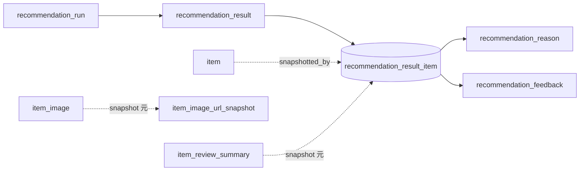

# Recommendation Result Item テーブル定義書

## 1. ドキュメント情報

| 項目           | 内容                                 |
| -------------- | ------------------------------------ |
| ドキュメントID | `DB-TBL-MVP-recommendation_result_item` |
| ドキュメント名 | Recommendation Result Item テーブル定義書 |
| 対象システム   | Gift Recommendation Service MVP      |
| MVP対象        | `yes`                                |
| 作成日         | 2026-06-15                           |
| 更新日         | 2026-06-15（Human Review #545 反映・#544 双方向整合） |

---

## 2. 概要

`recommendation_result_item` は、1 回の推薦実行（`recommendation_result`）に含まれる **商品明細 1 件** を表す Online推薦系テーブルである。

Ranking 完了後、reco が `item` / `item_image` / `item_review_summary` から表示時点の商品情報を **Snapshot としてコピー** し、順位（`rank`）・最終スコア（`final_score`）・スコア内訳（`score_breakdown_json`）とともに INSERT する。IF-DB-RECO-007（Recommendation Result 保存）の明細側 DB 正本。

Public API（API-PUB-002）では内部スコアを返さないが、DB には再現性・Observability・評価のため保持する（API設計方針書 §18.4・ログ・Observability設計書 §14）。

---

## 3. 目的

- `recommendation_result` に対する **1:N contains** 関係で推薦商品明細を保存する
- `item` への参照と **Snapshot 列** を併用し、後続 Batch による商品更新後も **当時の表示内容を固定** する（論理ER §7.3・正本定義表）
- Ranking 結果（`rank` / `final_score` / `context_score` / `score_breakdown_json`）を Result Item 単位で保持し、評価・デバッグの再現性を確保する（Ranking定義書 §14.3・RecommendationResult定義書 §15.1）
- 後続 `recommendation_reason` / `recommendation_feedback` の **親明細** として参照される（§8.2）
- 後続 DDL Task が migration を作成できる粒度まで設計を確定する

---

## 4. テーブル基本情報

| 項目 | 内容 |
| ---- | ---- |
| 物理テーブル名 | `recommendation_result_item` |
| 論理テーブル名 | Recommendation Result Item |
| 分類 | Online推薦系 |
| 正本区分 | 内部正本 / Snapshot |
| 主な更新主体 | reco |
| 主な参照主体 | api（読取・Feedback 紐づけ）、reco、Observability / Evaluation |
| MVP対象 | `yes` |
| 関連物理ER | `docs/06_実装設計/database/物理ER.md` §8–§11 |

---

## 5. 用途・責務

- Ranking / Final Score 計算完了後、**Top-K 商品ごとに 1 行 INSERT** する（処理構成定義書・IF-DB-RECO-007）
- INSERT 時に `item` / `item_image`（`is_primary=true`）/ `item_review_summary` から Snapshot 列へ **値をコピー** する（論理ER §7.3）
- `rank` は 1 始まりの表示順位。同一 `recommendation_result_id` 内で **一意** とする
- Snapshot 列・スコア列は **INSERT 後に UPDATE しない**（物理ER §11・状態遷移設計書・正本定義表）
- `recommendation_reason` の親（1:N has）。Reason 本文は **別テーブル** の責務（#546 後続 Task）
- `recommendation_feedback` の **Item 単位評価対象** として参照される（認証・認可方針書・RecommendationFeedback定義書）

### 5.1 対象外

- 推薦結果ヘッダ（`recommendation_result` の責務。`recommendation_result_テーブル定義書.md`）
- 推薦実行状態（`recommendation_run` の責務。`recommendation_run_テーブル定義書.md`）
- 推薦理由本文（`recommendation_reason` の責務。#546 後続 Task）
- ユーザー Feedback 本体（`recommendation_feedback` の責務。#547 後続 Task）
- 商品正本の更新（`item` 系は Batch 責務。Online 推薦中に Item 系を更新しない）

### 5.2 Online推薦フロー上の位置づけ



| 観点 | 方針 |
| ---- | ---- |
| 親 Result | `recommendation_result_id` で **物理 FK ON**（contains / 1:N） |
| 商品参照 | `item_id` で **物理 FK ON**（snapshotted_by）。Snapshot 列は Item 更新で上書きしない |
| 生成タイミング | Ranking 後・Result ヘッダ INSERT と同一トランザクションまたは直後（処理構成定義書） |
| 0 件 Result | `recommendation_result` のみ生成し、**本テーブル行は 0 件**（`result_status = empty`・`result_item_count = 0`。Result 定義書 §5.2・§10） |
| 件数整合 | 親 `recommendation_result.result_item_count` は **本テーブル行数と一致** する（Result 定義書 §10 `chk_result_item_count_*`） |
| INSERT 順序 | Result ヘッダ INSERT の **直後・同一トランザクション推奨**（Result 定義書 §12 手順 5） |

> **親 Result 定義書（#544 / PR #549 merge 済み）** と双方向整合する。contains 側は本定義書 §8.1、被参照側は `recommendation_result_テーブル定義書.md` §8.2。

### 5.3 Snapshot 元データ参照

| Snapshot 列 | 元リソース | 取得方針 | 備考 |
| ----------- | ---------- | -------- | ---- |
| `item_name_snapshot` | `item.item_name` | INSERT 時コピー | 論理ER §7.3 |
| `item_catchcopy_snapshot` | `item.catchcopy` | INSERT 時コピー | API `itemCatchcopy` |
| `item_price_snapshot` | `item.price` | INSERT 時コピー | JPY 整数 |
| `item_url_snapshot` | `item.item_url` | INSERT 時コピー | 外部 EC URL |
| `item_image_url_snapshot` | `item_image.image_url` | `is_primary=true` の行を参照してコピー | 無い場合は NULL（item_image 定義書 §8.3） |
| `review_average_snapshot` | `item_review_summary.review_average` | LEFT JOIN 後コピー | 行不存在時 NULL |
| `review_count_snapshot` | `item_review_summary.review_count` | LEFT JOIN 後コピー | 行不存在時 NULL |
| `shop_name_snapshot` | reco 解決値 | INSERT 時コピー | `item.shop_code` 等から表示名を解決。`item` 列には保持しない（item 定義書 §6） |

> **`genre_name_snapshot`**: RecommendationResult定義書 §10.2 に論理項目があるが、論理ER §7.3 には含まれない。**MVP 物理列は採用しない**（§17.1 No.2 **決定済み**）。

### 5.4 論理ER / ドメイン定義 / API 契約との差分整理

| 出典 | 列・概念 | 本テーブル（MVP 物理 DDL） | 扱い |
| ---- | -------- | -------------------------- | ---- |
| 論理ER §7.3 | Snapshot 7 項目 + `rank` / `final_score` / `score_breakdown_json` | **採用** | 正本 |
| 論理ER §14 | `recommendation_result_id`, `item_id` | **採用** | FK ON |
| RecommendationResult §6.2.3 | `context_score` 等個別スコア列 | **`final_score` + `context_score` + `score_breakdown_json` 併用** | 個別列は主要 2 軸のみ。内訳は JSONB（§17.1 No.1 **決定済み**） |
| RecommendationResult §10.2 | `is_displayed` | **採用**（default `true`） | INSERT 時に表示対象として `true` |
| RecommendationResult §10.2 | `shop_name_snapshot` | **採用** | API-PUB-002 `shopName` |
| RecommendationResult §10.2 | `genre_name_snapshot` | **MVP 不採用** | §17.1 No.2 **決定済み** |
| RecommendationResult §6.2.5 | `retrieval_candidate_id` 等参照 ID | **MVP 物理列なし** | `score_breakdown_json` または Result `debug_payload` へ（§17.1 No.3 **決定済み**） |
| RecommendationResult §6.2.5 | `reason_status` / `recommendation_reason_id` | **本テーブルでは保持しない** | `recommendation_reason` 側（#546） |
| API-PUB-002 | `reasonSummary` 等 | **本テーブルでは保持しない** | `recommendation_reason` 側。api が JOIN して Public 応答を組立 |
| API-INT-002 | `isFallback` | **採用** `is_fallback` | Fallback 候補フラグ |
| Ranking §14.3 | `recommendation_run_id` | **保持しない** | Run は `recommendation_result` 経由で辿る |

### 5.5 API 応答 ↔ DB 列マッピング

#### Public（API-PUB-002 `data.items[]`）

| API 項目 | DB 列 / 導出 | 備考 |
| -------- | ------------ | ---- |
| `recommendationResultItemId` | `recommendation_result_item_id` | api が UUID 文字列へ変換 |
| `itemId` | `item_id` | — |
| `rank` | `rank` | — |
| `itemName` | `item_name_snapshot` | Snapshot |
| `itemPrice` | `item_price_snapshot` | Snapshot |
| `itemUrl` | `item_url_snapshot` | Snapshot |
| `itemImageUrl` | `item_image_url_snapshot` | nullable |
| `itemCatchcopy` | `item_catchcopy_snapshot` | nullable |
| `shopName` | `shop_name_snapshot` | nullable |
| `reasonSummary` 等 | — | `recommendation_reason` JOIN（本 Task 対象外） |

**Public で返さない DB 列**: `final_score`, `context_score`, `score_breakdown_json`（API設計方針書 §18.4）

#### Internal（API-INT-002 `data.resultItems[]`）

| API 項目 | DB 列 / 導出 | 備考 |
| -------- | ------------ | ---- |
| 上記 Public 相当 | 同上 | — |
| `contextScore` | `context_score` | Internal のみ |
| `finalScore` | `final_score` | Internal のみ |
| `scoreBreakdown` | `score_breakdown_json` | debug 返却条件（§7.3.8）時に api がマッピング |
| `socialMatch` 等 | `score_breakdown_json` 内 | 個別 API 項目は JSON から導出可 |
| `isFallback` | `is_fallback` | — |
| `reasonStatus` / `recommendationReasonId` | — | `recommendation_reason` 側 |

OpenAPI / generated 変更は Task #469 へ委譲。

---

## 6. カラム定義

| No | カラム名 | 論理名 | 型 | 必須 | PK | FK | Unique | Default | 説明 |
| --: | -------- | ------ | -- | ---- | -- | -- | ------ | ------- | ---- |
| 1 | `recommendation_result_item_id` | Recommendation Result Item ID | `uuid` | `yes` | `yes` | — | `yes` | `gen_random_uuid()` | サロゲート PK。API `recommendationResultItemId`・Observability trace |
| 2 | `recommendation_result_id` | Recommendation Result ID | `uuid` | `yes` | — | `yes` | — | — | 親 Result。物理 FK ON |
| 3 | `item_id` | Item ID | `uuid` | `yes` | — | `yes` | — | — | 商品参照 + Snapshot 元。物理 FK ON |
| 4 | `rank` | Rank | `integer` | `yes` | — | — | — | — | 表示順位。1 始まり。同一 Result 内で一意 |
| 5 | `final_score` | Final Score | `numeric(8,6)` | `yes` | — | — | — | — | 最終順位スコア。0.0〜1.0 想定（CHECK で範囲制約） |
| 6 | `context_score` | Context Score | `numeric(8,6)` | `yes` | — | — | — | — | 意味一致スコア。RecommendationResult MVP 必須（§15.1） |
| 7 | `score_breakdown_json` | Score Breakdown | `jsonb` | `no` | — | — | — | `NULL` | スコア内訳（`social_match` / `symbolic_match` / `popularity_score` / `risk_penalty` / `diversity_penalty` 等）。Ranking §14.4 推奨形式 |
| 8 | `item_name_snapshot` | Item Name Snapshot | `varchar(255)` | `yes` | — | — | — | — | 推薦時点の商品名 |
| 9 | `item_catchcopy_snapshot` | Item Catchcopy Snapshot | `varchar(500)` | `no` | — | — | — | `NULL` | 推薦時点のキャッチコピー |
| 10 | `item_price_snapshot` | Item Price Snapshot | `integer` | `yes` | — | — | — | — | 推薦時点の価格（JPY）。0 以上 |
| 11 | `item_url_snapshot` | Item URL Snapshot | `text` | `yes` | — | — | — | — | 推薦時点の商品 URL |
| 12 | `item_image_url_snapshot` | Item Image URL Snapshot | `text` | `no` | — | — | — | `NULL` | 推薦時点の主画像 URL |
| 13 | `review_average_snapshot` | Review Average Snapshot | `numeric(3,2)` | `no` | — | — | — | `NULL` | 推薦時点のレビュー平均（0.00〜5.00） |
| 14 | `review_count_snapshot` | Review Count Snapshot | `integer` | `no` | — | — | — | `NULL` | 推薦時点のレビュー件数。0 以上 |
| 15 | `shop_name_snapshot` | Shop Name Snapshot | `text` | `no` | — | — | — | `NULL` | 推薦時点の店舗表示名 |
| 16 | `is_displayed` | Is Displayed | `boolean` | `yes` | — | — | — | `true` | ユーザーへ表示したか。MVP は INSERT 時 `true` |
| 17 | `is_fallback` | Is Fallback | `boolean` | `yes` | — | — | — | `false` | Fallback 候補か |
| 18 | `created_at` | Created At | `timestamptz` | `yes` | — | — | — | `now()` | 明細作成日時 |

> **MVP で採用しない列**: `genre_name_snapshot`, `retrieval_candidate_id`, `matching_result_id`, `ranking_result_id`, `recommendation_reason_id`, `reason_status`, `updated_at`（Snapshot 不変のため）。

---

## 7. 主キー・一意キー

| 種別 | 対象カラム | 方針 | 備考 |
| ---- | ---------- | ---- | ---- |
| PRIMARY KEY | `recommendation_result_item_id` | サロゲート UUID | API・Feedback・Reason の参照先 |
| UNIQUE | `recommendation_result_id`, `rank` | 同一 Result 内順位一意 | 結果表示・Index と整合（物理ER §10） |
| UNIQUE | `recommendation_result_id`, `item_id` | 同一 Result 内同一商品重複禁止 | Ranking の多様性方針と整合 |

---

## 8. 外部キー・参照関係

### 8.1 参照先

| カラム | 参照先 | FK制約 | ON DELETE | 備考 |
| ------ | ------ | ------ | --------- | ---- |
| `recommendation_result_id` | `recommendation_result.recommendation_result_id` | `ON` | `RESTRICT` | contains / 1:N。`recommendation_result_テーブル定義書.md` §8.2 と双方向整合 |
| `item_id` | `item.item_id` | `ON` | `RESTRICT` | snapshotted_by。item 物理削除禁止方針と整合（item 定義書 §12） |

Snapshot 元（`item_image` / `item_review_summary`）への **物理 FK は張らない**。INSERT 時に値をコピーするのみ（item_image 定義書 §8.3・item_review_summary 定義書 §8.3）。

### 8.2 被参照（子テーブル）

| 参照元 | 参照列 | 関係 | FK制約 | 備考 |
| ------ | ------ | ---- | ------ | ---- |
| `recommendation_reason` | `recommendation_result_item_id` | has | `ON`（DDL Task） | 1:N。Reason Task #546 |
| `recommendation_feedback` | `recommendation_result_item_id` | receives | `LOGICAL` | nullable。Feedback Task #547 |

---

## 9. Index

| Index名 | 対象カラム | 種別 | 用途 | 備考 |
| ------- | ---------- | ---- | ---- | ---- |
| `recommendation_result_item_pkey` | `recommendation_result_item_id` | btree（PK） | 主キー | 自動生成 |
| `uq_result_item_result_rank` | `recommendation_result_id`, `rank` | unique btree | 順位一意・結果表示 | 物理ER §10 `idx_result_item_result_id_rank` と同等 |
| `uq_result_item_result_item` | `recommendation_result_id`, `item_id` | unique btree | 同一商品重複防止 | — |
| `idx_result_item_item_id` | `item_id` | btree | 商品別 Result 分析 | item 被参照分析用 |

---

## 10. 制約

| 制約名 | 種別 | 対象 | 内容 | 備考 |
| ------ | ---- | ---- | ---- | ---- |
| `recommendation_result_item_pkey` | PRIMARY KEY | `recommendation_result_item_id` | 主キー | — |
| `uq_result_item_result_rank` | UNIQUE | `recommendation_result_id`, `rank` | 順位一意 | §7 |
| `uq_result_item_result_item` | UNIQUE | `recommendation_result_id`, `item_id` | 商品一意 | §7 |
| `fk_result_item_result` | FOREIGN KEY | `recommendation_result_id` | → `recommendation_result` | ON DELETE RESTRICT |
| `fk_result_item_item` | FOREIGN KEY | `item_id` | → `item` | ON DELETE RESTRICT |
| `chk_result_item_rank_positive` | CHECK | `rank` | `rank >= 1` | 1 始まり |
| `chk_result_item_final_score_range` | CHECK | `final_score` | `final_score >= 0 AND final_score <= 1` | 正規化スコア想定 |
| `chk_result_item_context_score_range` | CHECK | `context_score` | `context_score >= 0 AND context_score <= 1` | 同上 |
| `chk_result_item_price_non_negative` | CHECK | `item_price_snapshot` | `item_price_snapshot >= 0` | — |
| `chk_result_item_review_count` | CHECK | `review_count_snapshot` | `review_count_snapshot IS NULL OR review_count_snapshot >= 0` | — |
| `chk_result_item_review_average` | CHECK | `review_average_snapshot` | `review_average_snapshot IS NULL OR (review_average_snapshot >= 0 AND review_average_snapshot <= 5)` | — |
| — | 運用方針 | Snapshot 列 + スコア列 | **UPDATE 禁止** | 物理ER §11・アプリ双方で上書き防止 |

---

## 11. 状態・enum

本テーブルは **状態カラムを持たない**（論理ER §14・テーブル一覧 §3 No.4）。

| カラム | 扱い | 備考 |
| ------ | ---- | ---- |
| `is_displayed` | boolean フラグ | 状態 enum ではない。表示有無の記録 |
| `is_fallback` | boolean フラグ | Fallback 候補識別 |

---

## 12. 更新仕様

| 操作 | 実行主体 | 条件 | 更新項目 | 冪等性 | 備考 |
| ---- | -------- | ---- | -------- | ------ | ---- |
| INSERT | reco | Ranking 完了・Result 保存時 | 全列（初回） | Result + rank 単位で一意 | IF-DB-RECO-007 |
| SELECT | api / reco | 結果表示・Feedback 検証 | — | — | Snapshot 列をそのまま返却 |
| UPDATE | — | **MVP では行わない** | — | — | Snapshot / スコア不変（§10） |
| DELETE | — | **MVP では行わない** | — | — | §13 Retention |

**INSERT 手順（reco）**

1. Ranking 結果から Top-K を確定し、`recommendation_result` ヘッダを INSERT（`result_item_count` は後続 Item 件数と一致させる。Result 定義書 §12）
2. 各候補について `item` / `item_image`（主画像）/ `item_review_summary` を SELECT
3. Snapshot 列へコピー、`rank`（1 始まり・`top_k` 以下）/ `final_score` / `context_score` / `score_breakdown_json` を設定
4. `recommendation_result_id` とともに本テーブルへ INSERT（**手順 1 と同一トランザクション推奨**）
5. 後続で `recommendation_reason` を生成・INSERT（#546）

---

## 13. データ保持・削除

| 観点 | 方針 |
| ---- | ---- |
| 保持期間 | **180 日〜365 日**（ログ・Observability設計書 §20.2 参考。`recommendation_result_テーブル定義書.md` §13 と同値）。具体日数は **Phase2 ⑥ データ保持・削除方針 Task** で Online コア全体と一括確定 |
| 削除方式 | MVP では **DELETE なし** |
| Snapshot | Item 更新後も **上書きしない**（正本定義表） |
| アーカイブ | Request / Run / Result / Result Item / Feedback を一括確定（Result 定義書 §13） |

---

## 14. Migration / DDL

| 項目 | 内容 |
| ---- | ---- |
| DDL対象 | `recommendation_result_item` |
| migration単位 | 1 テーブル = 1 migration（DDL Task） |
| 適用順序 | 物理ER §15: **`recommendation_result` 作成後**、`recommendation_reason` より前 |
| rollback方針 | forward migration 主体。DROP は Human Review 必須 |
| 破壊的変更有無 | `no`（初回 CREATE） |

**DDL 概要（参考・DDL Task で確定）**

```sql
-- 参考。制約名・Index は DDL Task で最終確定。
CREATE TABLE recommendation_result_item (
  recommendation_result_item_id uuid PRIMARY KEY DEFAULT gen_random_uuid(),
  recommendation_result_id uuid NOT NULL,
  item_id uuid NOT NULL,
  rank integer NOT NULL,
  final_score numeric(8,6) NOT NULL,
  context_score numeric(8,6) NOT NULL,
  score_breakdown_json jsonb,
  item_name_snapshot varchar(255) NOT NULL,
  item_catchcopy_snapshot varchar(500),
  item_price_snapshot integer NOT NULL,
  item_url_snapshot text NOT NULL,
  item_image_url_snapshot text,
  review_average_snapshot numeric(3,2),
  review_count_snapshot integer,
  shop_name_snapshot text,
  is_displayed boolean NOT NULL DEFAULT true,
  is_fallback boolean NOT NULL DEFAULT false,
  created_at timestamptz NOT NULL DEFAULT now(),
  CONSTRAINT fk_result_item_result
    FOREIGN KEY (recommendation_result_id)
    REFERENCES recommendation_result (recommendation_result_id)
    ON DELETE RESTRICT,
  CONSTRAINT fk_result_item_item
    FOREIGN KEY (item_id)
    REFERENCES item (item_id)
    ON DELETE RESTRICT
);
```

---

## 15. セキュリティ・権限

| 観点 | 方針 |
| ---- | ---- |
| 読み取り権限 | api / reco（service role 経由） |
| 書き込み権限 | **reco のみ**（INSERT）。web / batch から Direct DB 書き込み禁止 |
| service role利用 | reco の Result 保存に限定 |
| 個人情報・機微情報 | Snapshot は商品公開情報のみ。`score_breakdown_json` に secret を含めない |
| ログ出力制限 | payload 全文を error ログに出力しない |

---

## 16. テスト観点

| No | 観点 | 確認内容 | 種別 |
| --: | ---- | -------- | ---- |
| 1 | DDL適用 | CREATE TABLE / Index / FK / CHECK / UNIQUE が定義どおり | migration |
| 2 | FK 整合 | 存在しない `recommendation_result_id` / `item_id` への INSERT が拒否される | migration |
| 3 | UNIQUE | 同一 Result で `rank` 重複・`item_id` 重複が拒否される | migration |
| 4 | CHECK | 範囲外スコア・負の価格が拒否される | migration |
| 5 | Snapshot 不変 | INSERT 後の Snapshot / スコア UPDATE がアプリ方針で行われない | manual |
| 6 | API マッピング | API-PUB-002 / API-INT-002 の Item 項目が DB 列と整合 | contract |
| 7 | 0 件 Result | Result のみ存在し Item 行が 0 件であること | integration |

---

## 17. 未決事項

| No | 論点 | 判断が必要な理由 | 判断者 | 期限 | 備考 |
| --: | ---- | ---------------- | ------ | ---- | ---- |
| — | — | — | — | — | Human Review（Issue #545）にて §17.1 No.1〜4 を決定済み |

### 17.1 Human Review 決定事項（Issue #545）

| No | 論点 | 決定内容 | 決定者 | 備考 |
| --: | ---- | -------- | ------ | ---- |
| 1 | スコア列の物理化粒度 | **`final_score` + `context_score` を個別列**、その他内訳は **`score_breakdown_json`（JSONB）** に集約 | Human | RecommendationResult §15.1・論理ER §7.3・Ranking §14.4 と整合 |
| 2 | `genre_name_snapshot` | **MVP 物理列なし**。必要なら将来列追加または JSON 拡張 | Human | 論理ER §7.3 を優先 |
| 3 | 中間参照 ID（Retrieval / Matching / Ranking） | **MVP 物理列なし**。`score_breakdown_json` または Result `debug_payload` に委譲 | Human | RecommendationResult §6.2.5 |
| 4 | 親 `recommendation_result` 定義書との双方向整合 | **`recommendation_result_テーブル定義書.md` §8.2（contains / FK ON）と本定義書 §8.1 が一致** | Human | #544 / PR #549 merge 済み。`result_item_count`・empty Result・INSERT 順序を §5.2 で突合済み |

---

## 18. 関連資料

| 種別 | パス / URL | 用途 |
| ---- | ---------- | ---- |
| 物理ER | `docs/06_実装設計/database/物理ER.md` | §9 FK・§10 Index・§11 Snapshot 方針 |
| 論理ER | `docs/05_アプリケーション設計/アプリ/database/論理ER.md` | §7.3 / §14 |
| テーブル一覧 | `docs/05_アプリケーション設計/アプリ/database/テーブル一覧.md` | §3 No.4 |
| ドメイン定義 | `docs/04_ドメインモデル設計/RecommendationResult定義書.md` | §6.2 / §10.2 / §11 / §15 |
| Ranking | `docs/04_ドメインモデル設計/Ranking定義書.md` | §14.3 |
| 正本定義表 | `docs/05_アプリケーション設計/アプリ/database/正本定義表.md` | Snapshot 上書き禁止 |
| I/F | `docs/05_アプリケーション設計/アプリ/インターフェース一覧.md` | IF-DB-RECO-007 |
| API 契約 | `docs/06_実装設計/api/API-PUB-002_レコメンド実行API契約仕様書.md` | Public Item マッピング |
| API 契約 | `docs/06_実装設計/api/API-INT-002_Reco推薦実行API契約仕様書.md` | Internal Item マッピング |
| item 定義書 | `docs/06_実装設計/database/item_テーブル定義書.md` | §8.2 snapshotted_by |
| item_image 定義書 | `docs/06_実装設計/database/item_image_テーブル定義書.md` | §8.3 image snapshot |
| item_review_summary 定義書 | `docs/06_実装設計/database/item_review_summary_テーブル定義書.md` | §8.3 review snapshot |
| 親 Result | `docs/06_実装設計/database/recommendation_result_テーブル定義書.md` | contains 関係・`result_item_count`・§8.2 被参照 |
| 親 Run | `docs/06_実装設計/database/recommendation_run_テーブル定義書.md` | Online フロー文脈 |
| Observability | `docs/05_アプリケーション設計/アプリ/ログ・Observability設計書.md` | trace キー |
| 外部商品連携 | `docs/05_アプリケーション設計/アプリ/外部商品データ連携設計書.md` | §11.5 Result Snapshot |

---

## 19. レビュー観点

- テーブル一覧 §3 No.4・論理ER §7.3・物理ER §9 / §10 / §11 と矛盾していない
- `recommendation_result` / `item` との関係（contains / snapshotted_by）が明記されている
- Snapshot 列の UPDATE 禁止方針が §10 / §12 に明記されている
- `idx_result_item_result_id_rank` 相当の UNIQUE / Index が定義されている
- item / item_image / item_review_summary との Snapshot 参照が §5.3 で双方向整合している
- Ranking定義書 §14.3・RecommendationResult定義書 §6.2 / §10.2 のスコア・順位が整理されている
- API-PUB-002 / API-INT-002 の Item マッピングが §5.5 に整理されている
- `recommendation_result_テーブル定義書.md` §8.2 / §12 と双方向整合している（`result_item_count`・empty Result・INSERT 順序）
- Human Review #545 決定事項（§17.1 No.1〜4）が本文に反映されている
- apps/** 変更がない
- secret / `.env` 実値が含まれていない
