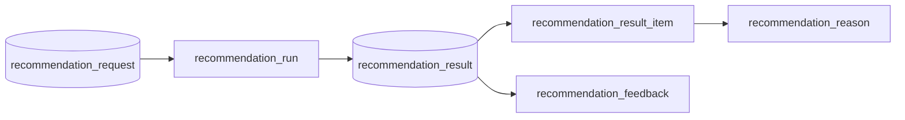
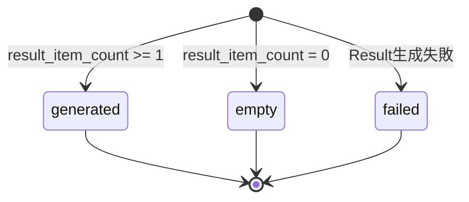

# Recommendation Result テーブル定義書

## 1. ドキュメント情報

| 項目           | 内容                            |
| -------------- | ------------------------------- |
| ドキュメントID | `DB-TBL-MVP-recommendation_result` |
| ドキュメント名 | Recommendation Result テーブル定義書 |
| 対象システム   | Gift Recommendation Service MVP |
| MVP対象        | `yes`                           |
| 作成日         | 2026-06-15                      |
| 更新日         | 2026-06-15                      |

---

## 2. 概要

`recommendation_result` は、Online推薦実行 1 回分（`recommendation_run`）で生成される **推薦結果ヘッダ正本** を保持する Online推薦系テーブルである。

Ranking 完了後に reco が Result Build 処理で生成・保存し、`recommendation_result_item` / `recommendation_reason` / `recommendation_feedback` の親となる。IF-DB-RECO-007（Recommendation Result 保存）の DB 正本（ヘッダ部分）。

API-PUB-002 / API-INT-002 の `recommendationResultId`、API-PUB-004 の Path `resultId`、Observability の `recommendation_result_id` trace キーの参照先となる。

---

## 3. 目的

- Online推薦フロー **Request → Run → Result → Result Item** の **Result ヘッダ** として、推薦結果全体の状態・件数・補足を不変の正本として保存する
- `recommendation_request` / `recommendation_run` との **物理 FK（ON）** で Online コアチェーンを構成する（物理ER §17 No.3）
- `result_status`（`generated` / `empty` / `failed`）で **0 件結果を正常扱い**（`empty`）とし、生成後は原則 UPDATE しない
- 実行時に使用した **version 情報のスナップショット** を保持し、評価・再現性を担保する（Run 側正本から Result 生成時にコピー。§5.7）
- 後続 DDL Task が migration を作成できる粒度まで設計を確定する

---

## 4. テーブル基本情報

| 項目 | 内容 |
| ---- | ---- |
| 物理テーブル名 | `recommendation_result` |
| 論理テーブル名 | Recommendation Result |
| 分類 | Online推薦系 |
| 正本区分 | 内部正本 |
| 主な更新主体 | reco（生成・保存） |
| 主な参照主体 | api（レスポンス組立・Feedback 前提）、web（間接参照）、Observability / Evaluation 将来参照 |
| MVP対象 | `yes` |
| 関連物理ER | `docs/06_実装設計/database/物理ER.md` §8–§11・§17 |

---

## 5. 用途・責務

- Ranking 完了後、reco が **Result Build**（RecommendationResult定義書 §8.2）でヘッダ行を INSERT する
- 同一 `recommendation_run_id` に対して **最大 1 行**（`uq_result_per_run`）
- 生成後は **原則 UPDATE しない**（状態遷移設計書 §5.2.3・終端状態）
- `recommendation_result_item` の **親 Result** として 1:N で参照される（contains）
- `recommendation_feedback` の **Feedback 対象** として参照される（receives）
- 0 件結果は **error ではなく** `result_status = empty` の正常 Result として保存する（テーブル一覧 §3 補足）

### 5.1 対象外

- 推薦結果明細・Snapshot 列（`recommendation_result_item` の責務）
- 推薦理由本文（`recommendation_reason` の責務）
- ユーザー Feedback（`recommendation_feedback` の責務）
- Run ライフサイクル状態（`run_status` は `recommendation_run` の責務）
- Request 入力条件（`recommendation_request` の責務）
- User 派生データ（`user_semantic` / `user_feature` / `user_meaning` の責務）

### 5.2 Online推薦フロー上の位置づけ（Request → Run → Result → Item）

論理ER §14.1・§14.2・処理フロー概要図を正とする。



| 観点 | 方針 |
| ---- | ---- |
| 親 Request | `recommendation_request_id` → **物理 FK ON**。1:N has（再実行で複数 Result） |
| 親 Run | `recommendation_run_id` → **物理 FK ON**。1:0..1 produces（**1 Run 1 Result**） |
| 子 Item | `recommendation_result_item.recommendation_result_id` → 本テーブル（**物理 FK ON**。1:N contains） |
| 子 Feedback | `recommendation_feedback.recommendation_result_id` → 本テーブル（**物理 FK ON**。1:N receives） |
| 子 Reason | **本テーブル経由ではなく** `recommendation_result_item` 経由（§5.1） |

> **後続 Task**: `recommendation_result_item` / `recommendation_reason` / `recommendation_feedback` テーブル定義書（Batch R06 No.3〜5）で子 FK・Snapshot 列を詳細化する。本 Task では **Result ヘッダ列と親子関係方針** を確定する。

### 5.3 親テーブルとの関係整理

| 参照元列 | 参照先 | 関係 | FK制約 | 備考 |
| -------- | ------ | ---- | ------ | ---- |
| `recommendation_request_id` | `recommendation_request.recommendation_request_id` | has | `ON` | Request 再実行で 1:N。recommendation_request 定義書 §8.2 |
| `recommendation_run_id` | `recommendation_run.recommendation_run_id` | produces | `ON` + **UNIQUE** | 1 Run 1 Result。`uq_result_per_run` |

> **`recommendation_run` 定義書（#543）** は未 merge 時、物理ER §9・§11 を正本とする。merge 後は Run 定義書との双方向整合を確認する。

### 5.4 論理ER / ドメイン定義 / API 契約との差分整理

| 出典 | 列・概念 | 本テーブル（MVP 物理 DDL） | 扱い |
| ---- | -------- | -------------------------- | ---- |
| 論理ER §3 | `recommendation_result_id`, `recommendation_request_id`, `recommendation_run_id`, `result_count`, `generated_at`, `result_status` | **採用**（`result_count` → **`result_item_count`** に物理名統一） | §5.4 注記 |
| RecommendationResult §10.1 | `mode` | **`request_mode`** | Request / Run から生成時スナップショット。enum は `request_mode` |
| RecommendationResult §10.1 | `created_at` | **`generated_at`** | 論理ER `generated_at` と同一意味（§17.1 No.3） |
| RecommendationResult §10.1 | `displayed_at`, `expired_at` | **MVP 物理列あり（NULL 可）** | 画面表示・有効期限は将来利用。MVP は未使用可 |
| RecommendationResult §10.1 | version 4 列 | **採用（NULL 可・LOGICAL FK）** | Run 生成時スナップショット。§5.7 |
| RecommendationResult §10.1 | `result_payload`, `debug_payload` | **採用（jsonb）** | API 返却補助・debug 用 |
| RecommendationResult §9.1 例 | `result_status: completed` | **DB は `generated`** | API 層マッピング（§5.6） |
| API-PUB-002 §7.3.1 | `resultStatus: completed / empty / partial` | **DB `generated` / `empty` / `generated`** | `partial` は API 契約上の表現。DB は件数で表現 |
| 認証・認可方針書 §19.2 | `user_id` | **MVP 物理列なし** | Request 経由追跡 |
| 物理ER §11 | `uq_result_per_run` | **採用** | `recommendation_run_id` UNIQUE |

> **`result_count` と `result_item_count`**: 論理ER §3 は `result_count`、ドメイン定義書 §10.1 は `result_item_count`。MVP 物理 DDL では **`result_item_count`** を正とし、論理ER `result_count` と **同一意味** とする。

### 5.5 API-PUB-002 / API-INT-002 → DB 列マッピング

| API（`data`） | DB 列 | 備考 |
| ------------- | ----- | ---- |
| `recommendationResultId` | `recommendation_result_id` | Feedback（API-PUB-004）前提 |
| `recommendationRequestId` | `recommendation_request_id` | 冗長保持（Request 直接参照と整合） |
| `recommendationRunId` | `recommendation_run_id` | 冗長保持 |
| `resultStatus` | `result_status` | **層間マッピングは §5.6** |
| `topK` | `top_k` | Request 実行時値のスナップショット |
| `resultItemCount` | `result_item_count` | 0 件時は `0` |
| `fallbackUsed` | `fallback_used` | |
| `displayMessage` | `display_message` | 0 件時など |
| `meta.traceId` | `trace_id` | Request / Run から引き継ぎ |
| `meta.generatedAt` | `generated_at` | ISO 8601 → timestamptz |
| （items 以外の metadata） | `result_payload` | evaluation / debug 時の version 等 |
| `data.metadata.debugPayload`（Internal） | `debug_payload` | debug 返却時のみ |

`items[]` 本体は **`recommendation_result_item`** に保存（後続 Task #545）。

### 5.6 API `resultStatus` ↔ DB `result_status` マッピング

| API `resultStatus`（API-PUB-002） | DB `result_status` | 条件 |
| --------------------------------- | ------------------ | ---- |
| `completed` | `generated` | `result_item_count >= 1` |
| `empty` | `empty` | `result_item_count = 0`（Hard Filter / Retrieval / Ranking 後 0 件） |
| `partial` | `generated` | `0 < result_item_count < top_k`（API 契約上の部分返却。DB は generated + 件数で表現） |
| （Result 生成失敗） | `failed` | Result Build / 保存失敗時。API は 5xx 等で返却し、行が残る場合のみ |

> OpenAPI / generated の `resultStatus` enum 固定は **Task #469** へ委譲。本 Task では DB 正本を `recommendation_result_status`（`generated` / `empty` / `failed`）とする。

### 5.7 Version 情報の責務境界（`recommendation_run` 連携）

論理ER §3（`recommendation_run` 属性）・RecommendationResult定義書 §10.1・Human Review 整理（§17.1 No.5）を正とする。

| 観点 | 方針 |
| ---- | ---- |
| 実行コンテキスト正本 | **`recommendation_run`** に `semantic_config_version_id` / `model_version_id` / `ranking_config_id` 等の個別列（Run 定義書 #543 で詳細化） |
| Result ヘッダ | **生成時に Run からコピーしたスナップショット** を `semantic_config_version_id` / `model_version_id` / `ranking_config_version_id` / `reason_template_version_id` に保持 |
| FK 方針 | version 参照は **LOGICAL FK**（物理 FK なし。recommendation_request 定義書 §5.7・§17.1 No.6 と同パターン） |
| 目的 | 後続 Item / Reason 更新や Config 変更後も **当時の Result を再現・評価** できるようにする |
| 後続 Task | `recommendation_run_テーブル定義書`（#543）で Run 側列・Index を詳細化し、本テーブルと突合する |

### 5.8 保存禁止情報（payload 方針）

- `result_payload` / `debug_payload` に secret・Authorization・`.env` 実値を含めない
- `debug_payload` は evaluation / `includeDebugInfo=true` 時のみ保存（API-INT-002 §7.3.8）
- 個人情報過剰保持を避け、ログマスキング方針に従う（ログ・Observability設計書 §14.3 相当）

---

## 6. カラム定義

| No | カラム名 | 論理名 | 型 | 必須 | PK | FK | Unique | Default | 説明 |
| --: | -------- | ------ | -- | ---- | -- | -- | ------ | ------- | ---- |
| 1 | `recommendation_result_id` | Recommendation Result ID | `uuid` | `yes` | `yes` | — | `yes` | `gen_random_uuid()` | サロゲート PK。API `recommendationResultId` |
| 2 | `recommendation_request_id` | Recommendation Request ID | `uuid` | `yes` | — | `yes` | — | — | 親 Request。物理 FK ON |
| 3 | `recommendation_run_id` | Recommendation Run ID | `uuid` | `yes` | — | `yes` | `yes` | — | 親 Run。物理 FK ON。**1 Run 1 Result** |
| 4 | `request_mode` | Request Mode | `varchar(32)` | `yes` | — | — | — | — | 生成時スナップショット。`request_mode` enum |
| 5 | `result_status` | Result Status | `varchar(32)` | `yes` | — | — | — | — | `recommendation_result_status`。§5.6 |
| 6 | `top_k` | Top K | `integer` | `yes` | — | — | — | — | 要求返却件数（実行時スナップショット） |
| 7 | `result_item_count` | Result Item Count | `integer` | `yes` | — | — | — | `0` | 保存された Result Item 件数。論理ER `result_count` 相当 |
| 8 | `candidate_count` | Candidate Count | `integer` | `no` | — | — | — | `NULL` | Retrieval 候補件数（分析用） |
| 9 | `fallback_used` | Fallback Used | `boolean` | `yes` | — | — | — | `false` | Fallback 利用有無 |
| 10 | `display_message` | Display Message | `text` | `no` | — | — | — | `NULL` | 画面向け補足（0 件時等） |
| 11 | `caution_message` | Caution Message | `text` | `no` | — | — | — | `NULL` | 注意表示 |
| 12 | `semantic_config_version_id` | Semantic Config Version ID | `uuid` | `no` | — | — | — | `NULL` | Run からコピー。LOGICAL FK |
| 13 | `model_version_id` | Model Version ID | `uuid` | `no` | — | — | — | `NULL` | Run からコピー。LOGICAL FK |
| 14 | `ranking_config_version_id` | Ranking Config Version ID | `uuid` | `no` | — | — | — | `NULL` | Run からコピー。LOGICAL FK |
| 15 | `reason_template_version_id` | Reason Template Version ID | `uuid` | `no` | — | — | — | `NULL` | Run からコピー。LOGICAL FK |
| 16 | `result_payload` | Result Payload | `jsonb` | `no` | — | — | — | `NULL` | 返却 metadata 等の補助 JSON |
| 17 | `debug_payload` | Debug Payload | `jsonb` | `no` | — | — | — | `NULL` | debug 返却時のみ |
| 18 | `trace_id` | Trace ID | `text` | `no` | — | — | — | `NULL` | 横断 trace |
| 19 | `generated_at` | Generated At | `timestamptz` | `yes` | — | — | — | `now()` | Result 生成完了日時（論理ER `generated_at` 相当） |
| 20 | `displayed_at` | Displayed At | `timestamptz` | `no` | — | — | — | `NULL` | 初回画面表示日時（MVP 未使用可） |
| 21 | `expired_at` | Expired At | `timestamptz` | `no` | — | — | — | `NULL` | 有効期限（MVP 未使用可） |

> **MVP で採用しない列**: `user_id`（認証 Epic まで追加しない）。`updated_at` は生成後不変方針のため省略。

---

## 7. 主キー・一意キー

| 種別 | 対象カラム | 方針 | 備考 |
| ---- | ---------- | ---- | ---- |
| PRIMARY KEY | `recommendation_result_id` | サロゲート UUID | API・Feedback・Item FK の参照先 |
| UNIQUE | `recommendation_run_id` | 1 Run 1 Result | 制約名 `uq_result_per_run`（物理ER §11） |

---

## 8. 外部キー・参照関係

### 8.1 参照先（親）

| カラム | 参照先 | FK制約 | 参照整合性 | 備考 |
| ------ | ------ | ------ | ---------- | ---- |
| `recommendation_request_id` | `recommendation_request.recommendation_request_id` | `ON` | 物理 FK | 1:N has |
| `recommendation_run_id` | `recommendation_run.recommendation_run_id` | `ON` | 物理 FK + UNIQUE | 1:0..1 produces |
| `semantic_config_version_id` | `semantic_config_version.semantic_config_version_id` | `LOGICAL` | reco 解決済み ID のみ保存 | 物理 FK なし |
| `model_version_id` | `model_version.model_version_id` | `LOGICAL` | 同上 | 物理 FK なし |
| `ranking_config_version_id` | `ranking_config.ranking_config_id` 等 | `LOGICAL` | Run / Config 定義書と突合（#543 連携） | 物理 FK なし |
| `reason_template_version_id` | `reason_template` 系 version | `LOGICAL` | Reason 定義書連携 | 物理 FK なし |

### 8.2 被参照（子テーブル）

| 参照元 | 参照列 | 関係 | FK制約 | 備考 |
| ------ | ------ | ---- | ------ | ---- |
| `recommendation_result_item` | `recommendation_result_id` | contains | `ON`（DDL Task） | 1:N。Batch R06 No.3 |
| `recommendation_feedback` | `recommendation_result_id` | receives | `ON`（DDL Task） | 1:N。Batch R06 No.5 |
| `evaluation_result` | `recommendation_result_id` | references | `LOGICAL` | Evaluation 系（将来） |
| `error_log` | `owner_id`（`owner_type=recommendation_result`） | may_have | `LOGICAL` | enum §6.15。障害時 |

---

## 9. Index

| Index名 | 対象カラム | 種別 | 用途 | 備考 |
| ------- | ---------- | ---- | ---- | ---- |
| `recommendation_result_pkey` | `recommendation_result_id` | btree（PK） | 主キー | 自動生成 |
| `uq_result_per_run` | `recommendation_run_id` | btree（UNIQUE） | 1 Run 1 Result | 物理ER §11 |
| `idx_recommendation_result_run_id` | `recommendation_run_id` | btree | FK 検索 | UNIQUE と併存または UNIQUE に内包（DDL Task で確定） |
| `idx_recommendation_result_request_id` | `recommendation_request_id` | btree | Request 別 Result 一覧 | 再実行 trace |
| `idx_recommendation_result_generated` | `generated_at` DESC | btree | 時系列分析・Retention 候補 | Observability |
| `idx_recommendation_result_status` | `result_status`, `generated_at` DESC | btree | 状態別集計 | empty / failed 分析 |
| `idx_recommendation_result_trace` | `trace_id` | btree | 横断 trace 検索 | nullable |

---

## 10. 制約

| 制約名 | 種別 | 対象 | 内容 | 備考 |
| ------ | ---- | ---- | ---- | ---- |
| `recommendation_result_pkey` | PRIMARY KEY | `recommendation_result_id` | 主キー | — |
| `uq_result_per_run` | UNIQUE | `recommendation_run_id` | 1 Run 1 Result | 物理ER §11 |
| `fk_result_request` | FOREIGN KEY | `recommendation_request_id` | `recommendation_request` 参照 ON DELETE RESTRICT | DDL Task で確定 |
| `fk_result_run` | FOREIGN KEY | `recommendation_run_id` | `recommendation_run` 参照 ON DELETE RESTRICT | DDL Task で確定 |
| `chk_result_status` | CHECK | `result_status` | `IN ('generated','empty','failed')` | packages 正本と一致 |
| `chk_request_mode` | CHECK | `request_mode` | `IN ('ui','evaluation','batch')` | request_mode enum |
| `chk_top_k_range` | CHECK | `top_k` | `top_k >= 1 AND top_k <= 50` | API-PUB-002 整合 |
| `chk_result_item_count_non_negative` | CHECK | `result_item_count` | `result_item_count >= 0` | — |
| `chk_result_item_count_lte_top_k` | CHECK | `result_item_count`, `top_k` | `result_item_count <= top_k` | MVP 想定 |
| `chk_empty_status_consistency` | CHECK | `result_status`, `result_item_count` | `result_status <> 'empty' OR result_item_count = 0` | empty は 0 件 |
| `chk_generated_status_consistency` | CHECK | `result_status`, `result_item_count` | `result_status <> 'generated' OR result_item_count >= 1` | generated は 1 件以上 |

---

## 11. 状態・enum

| カラム | enum / code | 定義元 | 許容値 | 備考 |
| ------ | ----------- | ------ | ------ | ---- |
| `result_status` | `recommendation_result_status` | `enum定義書` §6.2 / `packages/code-definitions/state/recommendation_result_status.yaml` | `generated`, `empty`, `failed` | 生成後原則更新しない（終端） |
| `request_mode` | `request_mode` | `enum定義書` §6.13 / `packages/code-definitions/application/request_mode.yaml` | `ui`, `evaluation`, `batch` | 生成時スナップショット |
| — | `owner_type`（子 Log 参照用） | `enum定義書` §6.15 | `recommendation_result` | error_log 等から被参照 |

### 11.1 `result_status` 状態遷移（参照）

状態遷移設計書 §5.2 を正とする。いずれも **生成時に確定する終端状態** であり、遷移後の UPDATE は MVP では行わない。



---

## 12. 更新仕様

| 操作 | 実行主体 | 条件 | 更新項目 | 冪等性 | 備考 |
| ---- | -------- | ---- | -------- | ------ | ---- |
| INSERT | reco | Ranking 完了・Result Build 成功 | 全列（初回） | Run 単位で 1 回（`uq_result_per_run`） | IF-DB-RECO-007 |
| SELECT | api / reco | レスポンス組立・Feedback 検証 | — | — | api は JOIN で Item 取得 |
| UPDATE | — | **MVP では行わない** | — | — | 生成後不変（§5.2.3） |
| DELETE | — | **MVP では行わない** | — | — | §13 Retention |

**INSERT 手順（reco）**

1. Ranking 完了後、top_k 件を抽出
2. `result_status` を件数から決定（`generated` / `empty`）
3. Run から version 列・`request_mode`・`trace_id` をスナップショット
4. Result ヘッダ INSERT → `recommendation_result_item` へ続けて INSERT（同一トランザクション推奨）
5. api へ Internal API レスポンス返却 → Public API へマッピング

---

## 13. データ保持・削除

| 観点 | 方針 |
| ---- | ---- |
| 保持期間 | **長期（具体日数未定）**。Observability 設計書では **180〜365 日候補**（Feedback 分析用途）。Online推薦コアは原則削除しない（物理ER §13） |
| 削除方式 | MVP では **DELETE なし** |
| 削除条件 | — |
| 論理削除 | MVP 対象外 |
| アーカイブ | **Phase2 ⑥ データ保持・削除方針 Task** で Request / Run / Result / Feedback と一括確定 |

Snapshot 再現性のため、Result ヘッダは Item / Reason とともに長期保持する。Log 系（90 日）とは別枠（error_log 定義書 §13 との責務分離）。

---

## 14. Migration / DDL

| 項目 | 内容 |
| ---- | ---- |
| DDL対象 | `recommendation_result` |
| migration単位 | 1 テーブル = 1 migration（DDL Task） |
| 適用順序 | 物理ER §15: **`recommendation_request` → `recommendation_run` の後**、**`recommendation_result_item` より前** |
| rollback方針 | forward migration 主体。DROP は Human Review 必須 |
| 破壊的変更有無 | `no`（初回 CREATE） |

**DDL 概要（参考・DDL Task で確定）**

```sql
-- 参考。制約名・Index は DDL Task で最終確定。
CREATE TABLE recommendation_result (
  recommendation_result_id uuid PRIMARY KEY DEFAULT gen_random_uuid(),
  recommendation_request_id uuid NOT NULL REFERENCES recommendation_request(recommendation_request_id),
  recommendation_run_id uuid NOT NULL UNIQUE REFERENCES recommendation_run(recommendation_run_id),
  request_mode varchar(32) NOT NULL,
  result_status varchar(32) NOT NULL,
  top_k integer NOT NULL,
  result_item_count integer NOT NULL DEFAULT 0,
  candidate_count integer,
  fallback_used boolean NOT NULL DEFAULT false,
  display_message text,
  caution_message text,
  semantic_config_version_id uuid,
  model_version_id uuid,
  ranking_config_version_id uuid,
  reason_template_version_id uuid,
  result_payload jsonb,
  debug_payload jsonb,
  trace_id text,
  generated_at timestamptz NOT NULL DEFAULT now(),
  displayed_at timestamptz,
  expired_at timestamptz
);
```

---

## 15. セキュリティ・権限

| 観点 | 方針 |
| ---- | ---- |
| 読み取り権限 | api / reco（service role 経由） |
| 書き込み権限 | **reco のみ**（INSERT）。web / batch から Direct DB 書き込み禁止 |
| service role利用 | api / reco の server 側のみ |
| 個人情報・機微情報 | MVP 匿名利用。`user_id` なし。Request 経由追跡（認証・認可方針書 §19.2） |
| ログ出力制限 | `debug_payload` 全文を error ログに出力しない（§5.8） |

---

## 16. テスト観点

| No | 観点 | 確認内容 | 種別 |
| --: | ---- | -------- | ---- |
| 1 | DDL適用 | CREATE TABLE / Index / CHECK / FK / UNIQUE が定義どおり | migration |
| 2 | uq_result_per_run | 同一 `recommendation_run_id` の二重 INSERT が拒否される | migration |
| 3 | CHECK | 不正 `result_status` / empty と件数不整合が拒否される | migration |
| 4 | FK | 存在しない Request / Run 参照が拒否される | integration |
| 5 | 0 件結果 | `result_status=empty`・`result_item_count=0` で INSERT 可能 | integration |
| 6 | API マッピング | API-PUB-002 `recommendationResultId` が PK と一致 | integration |
| 7 | immutable | MVP で UPDATE が発生しない設計 | manual |
| 8 | trace | `recommendation_result_id` が Observability 設計と整合 | manual |

---

## 17. 未決事項

| No | 論点 | 判断が必要な理由 | 判断者 | 期限 | 備考 |
| --: | ---- | ---------------- | ------ | ---- | ---- |
| 1 | API `resultStatus` と DB `result_status` の正式マッピング表 | OpenAPI enum と DB enum の差異 | Human | Epic 終盤 #469 前 | §5.6 で暫定整理済み |
| 2 | `ranking_config_version_id` の参照先テーブル物理名 | ranking_config 定義書との最終突合 | Human | #543 / Config 系 merge 後 | LOGICAL FK のみ |

### 17.1 Human Review 整理事項（Issue #544）

| No | 論点 | 決定内容 | 備考 |
| --: | ---- | -------- | ---- |
| 1 | `result_status` 物理列 | MVP 物理列あり。`generated` / `empty` / `failed`。生成後原則 UPDATE しない | enum定義書 §6.2 |
| 2 | `uq_result_per_run` | `recommendation_run_id` UNIQUE（1 Run 1 Result） | 物理ER §11 |
| 3 | `generated_at` 物理列名 | 論理ER `generated_at` と同一意味。物理名 **`generated_at`** | RecommendationResult §10.1 `created_at` との差分は §5.4 |
| 4 | Online推薦コア Retention | MVP DELETE なし。具体期間は Phase2 ⑥ Task | Observability 180〜365 日候補を注記 |
| 5 | version 列の保持先 | Run 側が実行正本。Result は **生成時スナップショット** を LOGICAL FK で保持 | §5.7 |
| 6 | 0 件結果 | error ではなく `result_status=empty` の正常 Result | テーブル一覧 §3 補足 |

---

## 18. 関連資料

| 種別 | パス / URL | 用途 |
| ---- | ---------- | ---- |
| 物理ER | `docs/06_実装設計/database/物理ER.md` | §9 / §10 / §11 / §17 |
| 論理ER | `docs/05_アプリケーション設計/アプリ/database/論理ER.md` | §3 / §14.1 / §14.2 |
| テーブル一覧 | `docs/05_アプリケーション設計/アプリ/database/テーブル一覧.md` | §3 No.3 |
| ドメイン定義 | `docs/04_ドメインモデル設計/RecommendationResult定義書.md` | §8–§10 |
| enum | `docs/06_実装設計/database/enum定義書.md` | §6.2 / §8 |
| 状態遷移 | `docs/05_アプリケーション設計/アプリ/状態遷移設計書.md` | §5.2 |
| 親 Request | `docs/06_実装設計/database/recommendation_request_テーブル定義書.md` | has 関係 |
| API 契約 | `docs/06_実装設計/api/API-PUB-002_レコメンド実行API契約仕様書.md` | Response マッピング |
| API 契約 | `docs/06_実装設計/api/API-INT-002_Reco推薦実行API契約仕様書.md` | Internal Response |
| API 契約 | `docs/06_実装設計/api/API-PUB-004_Feedback送信API契約仕様書.md` | resultId 前提 |
| I/F | `docs/05_アプリケーション設計/アプリ/インターフェース一覧.md` | IF-DB-RECO-007 |
| 認証 | `docs/05_アプリケーション設計/基盤/認証・認可方針書.md` | user_id MVP 方針 |
| Observability | `docs/05_アプリケーション設計/アプリ/ログ・Observability設計書.md` | trace / Retention |
| code | `packages/code-definitions/state/recommendation_result_status.yaml` | result_status 正本 |

---

## 19. レビュー観点

- テーブル一覧 §3 No.3・論理ER §14.1 / §14.2・物理ER §9 / §11 と矛盾していない
- `recommendation_run` / `recommendation_result_item` との produces / contains 関係が明記されている
- `recommendation_request` との has 関係（1:N・物理 FK ON）が明記されている
- `result_status` が enum定義書 §6.2 と一致している
- `uq_result_per_run`（1 Run 1 Result）が明記されている
- 生成後原則 UPDATE しない方針が明記されている
- API-PUB-002 `recommendationResultId` マッピングと API / DB `result_status` 差分が整理されている
- `recommendation_request` 定義書と章構成・MVP 方針が一貫している
- apps/** 変更がない
- secret / `.env` 実値が含まれていない
