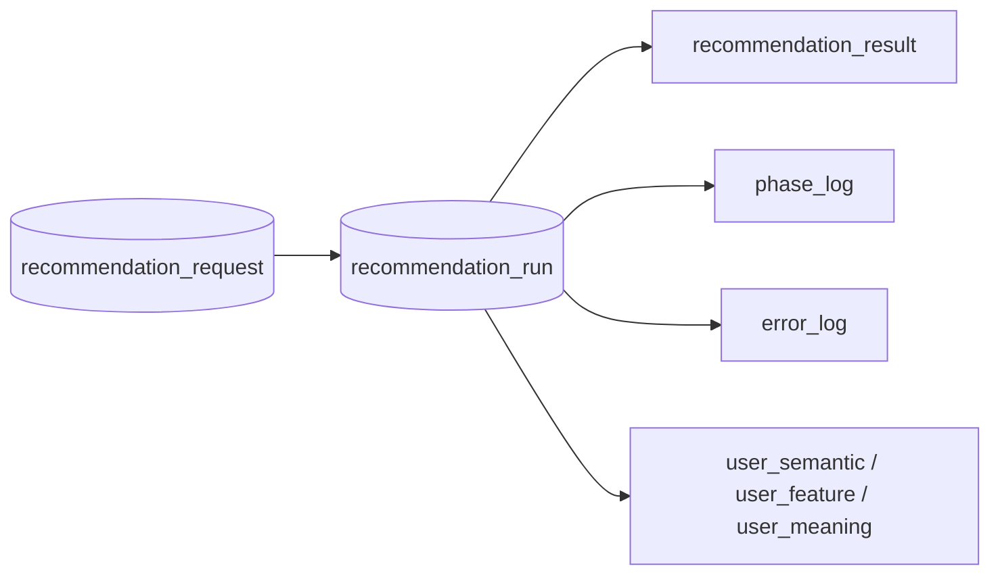
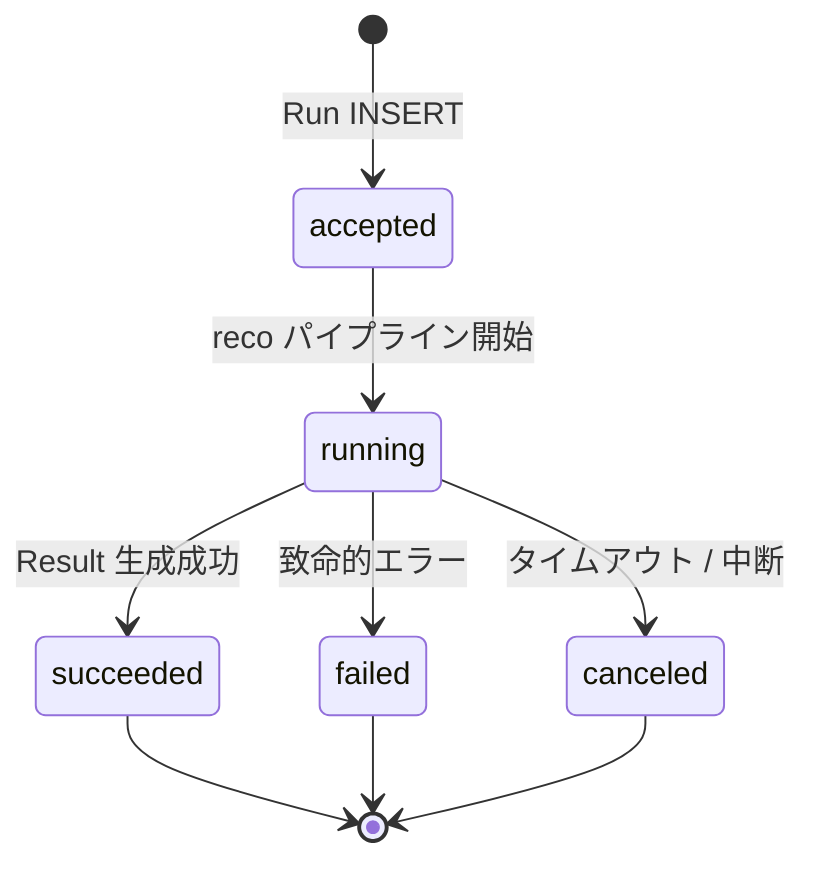

# Recommendation Run テーブル定義書

## 1. ドキュメント情報

| 項目           | 内容                            |
| -------------- | ------------------------------- |
| ドキュメントID | `DB-TBL-MVP-recommendation_run` |
| ドキュメント名 | Recommendation Run テーブル定義書 |
| 対象システム   | Gift Recommendation Service MVP |
| MVP対象        | `yes`                           |
| 作成日         | 2026-06-15                      |
| 更新日         | 2026-06-15                      |

---

## 2. 概要

`recommendation_run` は、Online 推薦パイプライン **1 回分の実行単位** を保持する Online推薦系テーブルである。

`recommendation_request` に紐づき、実行時に解決した `pair_id` および Config / Model / Ranking version を固定して **再現性** を担保する。IF-DB-RECO-001（Config / Version 参照）・IF-DB-RECO-002（Recommendation Run 保存）の DB 正本。

Public API および Observability では `recommendation_run_id` を trace キーとして利用する（ログ・Observability設計書 §10.2）。

---

## 3. 目的

- Online推薦フロー **Request → Run → Result** の **実行正本** として、推薦処理 1 回分の状態（`run_status`）を管理する
- 実行時解決した **`pair_id`** を Run 単位で固定する（物理ER §17 No.1）
- **`semantic_config_version_id` / `model_version_id` / `ranking_config_id`** を個別列で保持し、再現性を担保する（Human Review #537 No.4 / No.6）
- `recommendation_result` および User 派生データ（`user_semantic` 等）の **親 Run** として参照される
- `phase_log` / `error_log` の **owner**（`owner_type = recommendation_run`）として Log 連携する
- 後続 DDL Task が migration を作成できる粒度まで設計を確定する

---

## 4. テーブル基本情報

| 項目 | 内容 |
| ---- | ---- |
| 物理テーブル名 | `recommendation_run` |
| 論理テーブル名 | Recommendation Run |
| 分類 | Online推薦系 |
| 正本区分 | 実行正本 / 状態 |
| 主な更新主体 | reco |
| 主な参照主体 | reco、api（状態参照）、Observability / Admin 将来参照 |
| MVP対象 | `yes` |
| 関連物理ER | `docs/06_実装設計/database/物理ER.md` §8–§11・§17 |

---

## 5. 用途・責務

- reco が API-INT-002 受付後、Config / Pair 解決完了時点で Run 行を **INSERT**（初期 `run_status = accepted`）
- パイプライン開始時に `run_status = running` および `started_at` を設定する（状態遷移設計書 §5.1.3）
- 終端状態（`succeeded` / `failed` / `canceled`）で `completed_at` を設定する
- 詳細なフェーズ進行は **`phase_log`**（`owner_type = recommendation_run`）に記録し、Run 本体の状態更新は最小限に留める（状態遷移設計書 §5.1.4）
- 障害詳細は **`error_log`**（`owner_type = recommendation_run`）に記録する（error_log 定義書 §5.2）
- 同一 Run を **再開しない**。再実行は同一 Request に対する **新規 Run** として INSERT する（状態遷移設計書 §11）

### 5.1 対象外

- 推薦入力条件（`recommendation_request` の責務）
- 推薦結果・理由・Feedback（`recommendation_result` 等の責務）
- User 派生データ本体（`user_semantic` / `user_feature` / `user_meaning` の責務。Run ID で紐づくのみ）
- `recommendation_run_phase_log` 独立テーブル（MVP では `phase_log` に統合。§5.6）
- Config / Master 正本（`semantic_config_version` / `pair_master` 等の責務）

### 5.2 Online推薦フロー上の位置づけ（Request → Run → Result）

論理ER §14.1・処理フロー概要図を正とする。**本テーブルはフロー中核（実行単位）**。



| 観点 | 方針 |
| ---- | ---- |
| 親 Request | `recommendation_request_id` → **`recommendation_request`**（**物理 FK ON**。1:N executes） |
| 子 Result | **`recommendation_result.recommendation_run_id`** → 本テーブル（**物理 FK ON**。1:0..1 produces） |
| 再実行 | 同一 Request に対し **複数 Run** が存在し得る（物理ER §9） |
| 再現性 | Run 作成時に `pair_id` / version 列を **固定**（§5.3・§5.5） |

> **後続 Task**: `recommendation_result` テーブル定義書（Issue #544）で produces 側 FK・unique（1 Run 1 Result）を詳細化する。本 Task では **Run 側列定義と親子関係方針** を確定する。

### 5.3 Pair 解決（`pair_id`）

物理ER §17 No.1・pair_master 定義書・recommendation_request 定義書 §5.3 を正とする。

| 観点 | 方針 |
| ---- | ---- |
| 解決タイミング | reco が Run 作成前に `relationship_code` + `occasion_code`（Request 正本）から `pair_master` を参照して `pair_id` を解決 |
| 保持先 | **`recommendation_run.pair_id`**（Request には保持しない） |
| FK | **`pair_master.pair_id` への物理 FK ON**（制約名 `fk_recommendation_run_pair`。物理ER §11） |
| 失敗時 | Pair 未解決時は Run 行を INSERT しない、または Run 作成前に Validation エラーとして api / reco が拒否（実装 Task で確定） |

### 5.4 論理ER / 状態遷移設計書 / Observability との差分整理

| 出典 | 列・概念 | 本テーブル（MVP 物理 DDL） | 扱い |
| ---- | -------- | -------------------------- | ---- |
| 論理ER §3 | `recommendation_run_id`, `recommendation_request_id`, version 3 列, `started_at`, `completed_at`, `run_status` | **採用** | 一致 |
| 論理ER §3 | `pair_id` | **採用** | 論理ER 表に未記載。物理ER §17 No.1 で Run 側保持 **決定済み** |
| 状態遷移 §5.1.3 | `error_summary` | **物理列なし** | Run 障害詳細は **`error_log`**。Batch の `batch_run_log.error_summary` パターンは Online Run には適用しない（error_log 定義書 §5.2） |
| 物理ER timestamp 方針 | `created_at` / `updated_at` | **採用** | 行作成・`run_status` 更新監査。`started_at` / `completed_at` とは別（パイプライン実行区間） |
| Observability §10.2 | `trace_id` | **物理列なし** | trace は **`recommendation_request.trace_id`** および **`phase_log` / `error_log.trace_id`** で横断連携。Run キーは **`recommendation_run_id`** |

### 5.5 Config / Model / Ranking Version 責務（Request 連携）

recommendation_request 定義書 §5.7・Human Review #537 No.4 / No.6 を正とする。

| 観点 | 方針 |
| ---- | ---- |
| 正本列 | **`semantic_config_version_id` / `model_version_id` / `ranking_config_id`** を本テーブルに **個別列** で保持 |
| Request 側 | version **個別列なし**。evaluation 指定は `validated_payload` のみ |
| 解決 | reco が IF-DB-RECO-001 で現行 Config を解決（ui）または payload から読取（evaluation）し、Run INSERT 時に **コピー** |
| FK | 3 列とも **LOGICAL FK**（物理 FK なし）。INSERT 前に reco が存在確認 |
| 被参照 | semantic_config_version / model_version / ranking_config 各定義書 §8 と双方向整合 |

### 5.6 Log 連携（`phase_log` / `error_log`）

| 観点 | 方針 |
| ---- | ---- |
| `recommendation_run_phase_log` | **物理テーブル作成しない**。`phase_log` に統合（phase_log 定義書 §5.2） |
| phase_log | `owner_type = recommendation_run`、`owner_id = recommendation_run_id`（**LOGICAL** records 関係） |
| error_log | `owner_type = recommendation_run`、`owner_id = recommendation_run_id`（**LOGICAL** may_have 関係） |
| IF | IF-DB-RECO-009（Phase / Error Log 保存）・IF-OBS-001（Phase Log 記録） |
| 責務分離 | Run 本体は **`run_status` のみ** 更新。フェーズ詳細は phase_log、障害詳細は error_log（error_log 定義書 §5.3） |

### 5.7 MOD-RECO-002 Recommendation Run Recorder（入出力）

機能×モジュール対応表を正とする。

| 方向 | 内容 |
| ---- | ---- |
| 入力 | `recommendation_request_id`、解決済み `pair_id`、解決済み version 3 列 |
| 出力 | `recommendation_run_id`、更新後 `run_status` / タイムスタンプ |
| 連携 | Phase Log Writer / Error Log Writer が同一 `recommendation_run_id` を owner として記録 |

---

## 6. カラム定義

| No | カラム名 | 論理名 | 型 | 必須 | PK | FK | Unique | Default | 説明 |
| --: | -------- | ------ | -- | ---- | -- | -- | ------ | ------- | ---- |
| 1 | `recommendation_run_id` | Recommendation Run ID | `uuid` | `yes` | `yes` | — | `yes` | `gen_random_uuid()` | サロゲート PK。API / Observability trace キー |
| 2 | `recommendation_request_id` | Recommendation Request ID | `uuid` | `yes` | — | `ON` | — | — | 親 Request。`recommendation_request` 物理 FK |
| 3 | `pair_id` | Pair ID | `uuid` | `yes` | — | `ON` | — | — | 実行時解決 Pair。`pair_master` 物理 FK（§17 No.1） |
| 4 | `semantic_config_version_id` | Semantic Config Version ID | `uuid` | `yes` | — | LOGICAL | — | — | 使用 Semantic Config Version。再現性固定 |
| 5 | `model_version_id` | Model Version ID | `uuid` | `yes` | — | LOGICAL | — | — | 使用 Model Version（Embedding / LLM 等） |
| 6 | `ranking_config_id` | Ranking Config ID | `uuid` | `yes` | — | LOGICAL | — | — | 使用 Ranking Config |
| 7 | `run_status` | Run Status | `varchar(32)` | `yes` | — | — | — | `'accepted'` | `recommendation_run_status` enum |
| 8 | `started_at` | Started At | `timestamptz` | `no` | — | — | — | `NULL` | パイプライン開始日時。`running` 遷移時に設定 |
| 9 | `completed_at` | Completed At | `timestamptz` | `no` | — | — | — | `NULL` | 終端状態到達日時（`succeeded` / `failed` / `canceled`） |
| 10 | `created_at` | Created At | `timestamptz` | `yes` | — | — | — | `now()` | Run 行作成日時（`accepted` INSERT 時。§5.4） |
| 11 | `updated_at` | Updated At | `timestamptz` | `yes` | — | — | — | `now()` | 最終 `run_status` 更新日時 |

> **MVP で採用しない列**: `error_summary`（§5.4）、`trace_id`（Request / Log 側で連携）、`user_id`（認証 Epic まで追加しない）

---

## 7. 主キー・一意キー

| 種別 | 対象カラム | 方針 | 備考 |
| ---- | ---------- | ---- | ---- |
| PRIMARY KEY | `recommendation_run_id` | サロゲート UUID | Result / User 派生 / Log owner の参照先 |

> MVP では **自然キー UNIQUE は設けない**。同一 Request の再実行は **新規 Run 行** として INSERT する。

---

## 8. 外部キー・参照関係

### 8.1 参照先

| カラム | 参照先 | FK制約 | 参照整合性 | 備考 |
| ------ | ------ | ------ | ---------- | ---- |
| `recommendation_request_id` | `recommendation_request.recommendation_request_id` | `ON` | reco INSERT 前に Request 存在 | 物理ER §9 executes |
| `pair_id` | `pair_master.pair_id` | `ON` | reco Pair 解決 + seed 正本 | 物理ER §9 resolved_at_run。§11 `fk_recommendation_run_pair` |
| `semantic_config_version_id` | `semantic_config_version.semantic_config_version_id` | `LOGICAL` | reco Config 解決 + 存在確認 | semantic_config_version 定義書 §17.1 No.8 |
| `model_version_id` | `model_version.model_version_id` | `LOGICAL` | 同上 | model_version 定義書 §8 |
| `ranking_config_id` | `ranking_config.ranking_config_id` | `LOGICAL` | 同上 | ranking_config 定義書 §8 |

### 8.2 被参照（子テーブル）

| 参照元 | 参照列 | 関係 | FK制約 | 備考 |
| ------ | ------ | ---- | ------ | ---- |
| `recommendation_result` | `recommendation_run_id` | produces | `ON`（DDL Task） | 1:0..1。`uq_result_per_run` は Result 側（物理ER §11） |
| `user_semantic` | `recommendation_run_id` | generates | `ON`（DDL Task） | 1:N |
| `user_feature` | `recommendation_run_id` | generates | `ON`（DDL Task） | 1:N |
| `user_meaning` | `recommendation_run_id` | generates | `ON`（DDL Task） | 1:0..1 |
| `phase_log` | `owner_id`（`owner_type=recommendation_run`） | records | `LOGICAL` | phase_log 定義書 §5.2 |
| `error_log` | `owner_id`（`owner_type=recommendation_run`） | may_have | `LOGICAL` | error_log 定義書 §5.2 |

---

## 9. Index

| Index名 | 対象カラム | 種別 | 用途 | 備考 |
| ------- | ---------- | ---- | ---- | ---- |
| `recommendation_run_pkey` | `recommendation_run_id` | btree（PK） | 主キー | 自動生成 |
| `idx_recommendation_run_request_id` | `recommendation_request_id` | btree | FK / Request 履歴参照 | 物理ER §10 |
| `idx_recommendation_run_status` | `run_status`, `started_at` | btree | 状態監視・運用分析 | 物理ER §10 |
| `idx_recommendation_run_pair_id` | `pair_id` | btree | Pair 参照・分析 | 物理ER §10。§17 No.1 |
| `idx_recommendation_run_semantic_config_version` | `semantic_config_version_id` | btree | version 被参照・分析 | semantic_config_version 定義書 §17.1 No.8 |
| `idx_recommendation_run_model_version` | `model_version_id` | btree | version 被参照 | model_version 定義書 |
| `idx_recommendation_run_ranking_config` | `ranking_config_id` | btree | version 被参照 | ranking_config 定義書 |
| `idx_recommendation_run_created` | `created_at` DESC | btree | 時系列一覧・Retention 将来 | Online コア長期保持 |

---

## 10. 制約

| 制約名 | 種別 | 対象 | 内容 | 備考 |
| ------ | ---- | ---- | ---- | ---- |
| `recommendation_run_pkey` | PRIMARY KEY | `recommendation_run_id` | 主キー | — |
| `fk_recommendation_run_request` | FOREIGN KEY | `recommendation_request_id` | `recommendation_request` 参照 | ON DELETE RESTRICT（DDL Task） |
| `fk_recommendation_run_pair` | FOREIGN KEY | `pair_id` | `pair_master.pair_id` 参照 | 物理ER §11。§17 No.1 |
| `chk_run_status` | CHECK | `run_status` | `run_status IN ('accepted','running','succeeded','failed','canceled')` | packages 正本と一致 |
| `chk_run_started_before_completed` | CHECK | `started_at`, `completed_at` | `completed_at IS NULL OR started_at IS NULL OR started_at <= completed_at` | タイムライン整合 |
| `chk_run_completed_terminal` | CHECK | `run_status`, `completed_at` | 終端状態では `completed_at IS NOT NULL` | 終端 = succeeded / failed / canceled |
| `chk_run_nonterminal_no_completed` | CHECK | `run_status`, `completed_at` | 非終端（accepted / running）では `completed_at IS NULL` | 状態遷移設計書 §5.1 |

> **CHECK 実装**: 終端 / 非終端 CHECK は DDL Task で PostgreSQL 式に展開する。上表は意図の要約。

---

## 11. 状態・enum

| カラム | enum / code | 定義元 | 許容値 | 備考 |
| ------ | ----------- | ------ | ------ | ---- |
| `run_status` | `recommendation_run_status` | `enum定義書` §6.1 / `packages/code-definitions/state/recommendation_run_status.yaml` | `accepted`, `running`, `succeeded`, `failed`, `canceled` | `batch_run_log.run_status` とは **別 enum**（論理 ID 分離） |
| — | `owner_type`（子 Log 参照用） | `enum定義書` §6.15 | `recommendation_run` | phase_log / error_log の owner |

### 11.1 状態遷移（Run 本体）

状態遷移設計書 §5.1 を正とする。



| 現状態 | 次状態 | 更新主体 | 更新列 | 備考 |
| ------ | ------ | -------- | ------ | ---- |
| — | `accepted` | reco | 全列（初回 INSERT） | Pair / version 解決後 |
| `accepted` | `running` | reco | `run_status`, `started_at`, `updated_at` | パイプライン開始 |
| `running` | `succeeded` | reco | `run_status`, `completed_at`, `updated_at` | Result 生成完了 |
| `running` | `failed` | reco | `run_status`, `completed_at`, `updated_at` | error_log 連携 |
| `running` | `canceled` | reco | `run_status`, `completed_at`, `updated_at` | MVP 任意 |

---

## 12. 更新仕様

| 操作 | 実行主体 | 条件 | 更新項目 | 冪等性 | 備考 |
| ---- | -------- | ---- | -------- | ------ | ---- |
| INSERT | reco | Pair / Config 解決成功 | 全列（`run_status=accepted`） | 非冪等（新規 UUID） | IF-DB-RECO-002 |
| UPDATE | reco | 状態遷移 | `run_status`, `started_at` / `completed_at`, `updated_at` | 終端後 UPDATE 禁止 | MOD-RECO-002 |
| SELECT | api / reco | 状態返却・trace | — | — | API-INT-002 Response 整形 |
| DELETE | — | **MVP では行わない** | — | — | §13 Retention |

**INSERT 手順（reco）**

1. `recommendation_request` を参照（`recommendation_request_id`）
2. `relationship_code` + `occasion_code` から `pair_id` を解決
3. IF-DB-RECO-001 で version 3 列を解決
4. `run_status = accepted` で INSERT（`created_at` / `updated_at` 設定）
5. `phase_log` に `request_received` / `config_resolved` 等を記録（IF-DB-RECO-009）
6. 以降、状態遷移に応じて UPDATE

---

## 13. データ保持・削除

| 観点 | 方針 |
| ---- | ---- |
| 保持期間 | **180 日〜365 日**（ログ・Observability設計書 §20.2 参考）。具体日数は **Phase2 ⑥ データ保持方針 Task** で Online コア全体と一括確定 |
| 削除方式 | MVP では **DELETE なし**（Human Review 決定 §17.1 No.5 踏襲） |
| 削除条件 | — |
| 論理削除 | MVP 対象外 |
| アーカイブ | Phase2 ⑥ で確定 |

> **Log との関係**: `phase_log` / `error_log` は **90 日 Tier**（error_log 定義書 §13）。Run 本体が長期保持されても **Log 詳細は先に削除** され得る。

---

## 14. Migration / DDL

| 項目 | 内容 |
| ---- | ---- |
| DDL対象 | `recommendation_run` |
| migration単位 | 1 テーブル = 1 migration（DDL Task） |
| 適用順序 | 物理ER §15: **`recommendation_request` の後**、`pair_master` / Config 群（semantic_config_version / model_version / ranking_config）**merge 済み**、`recommendation_result` **より前** |
| rollback方針 | forward migration 主体。DROP は Human Review 必須 |
| 破壊的変更有無 | `no`（初回 CREATE） |

**DDL 概要（参考・DDL Task で確定）**

```sql
-- 参考。制約名・Index・CHECK は DDL Task で最終確定。
CREATE TABLE recommendation_run (
  recommendation_run_id uuid PRIMARY KEY DEFAULT gen_random_uuid(),
  recommendation_request_id uuid NOT NULL REFERENCES recommendation_request(recommendation_request_id),
  pair_id uuid NOT NULL REFERENCES pair_master(pair_id),
  semantic_config_version_id uuid NOT NULL,
  model_version_id uuid NOT NULL,
  ranking_config_id uuid NOT NULL,
  run_status varchar(32) NOT NULL DEFAULT 'accepted',
  started_at timestamptz,
  completed_at timestamptz,
  created_at timestamptz NOT NULL DEFAULT now(),
  updated_at timestamptz NOT NULL DEFAULT now()
);
```

---

## 15. セキュリティ・権限

| 観点 | 方針 |
| ---- | ---- |
| 読み取り権限 | api / reco（service role 経由） |
| 書き込み権限 | **reco のみ**（INSERT / UPDATE）。web / batch から Direct DB 書き込み禁止 |
| service role利用 | reco / api の server 側のみ |
| 個人情報・機微情報 | Run 本体列には PII を保持しない。Request テキストは親 Request 参照 |
| ログ出力制限 | version ID / run_status のみ。Request payload を Run ログに過剰出力しない |

---

## 16. テスト観点

| No | 観点 | 確認内容 | 種別 |
| --: | ---- | -------- | ---- |
| 1 | DDL適用 | CREATE TABLE / Index / FK / CHECK が定義どおり | migration |
| 2 | FK | 存在しない `recommendation_request_id` / `pair_id` INSERT が拒否される | migration |
| 3 | CHECK | 不正 `run_status` が拒否される | migration |
| 4 | 状態遷移 | accepted → running → succeeded の UPDATE 列が設計どおり | integration |
| 5 | LOGICAL version | 存在しない version UUID INSERT が reco 側で拒否される | integration |
| 6 | 1:N executes | 同一 Request に複数 Run INSERT 可能 | integration |
| 7 | Log 連携 | `phase_log` / `error_log` が `owner_type=recommendation_run` で記録可能 | integration |
| 8 | 再実行 | 同一 Run 行の再開 UPDATE が設計上発生しない | manual |

---

## 17. 未決事項

| No | 論点 | 判断が必要な理由 | 判断者 | 期限 | 備考 |
| --: | ---- | ---------------- | ------ | ---- | ---- |
| — | — | — | — | — | Human Review 決定事項は §17.1 に整理（#537 / 物理ER §17 踏襲） |

### 17.1 Human Review 決定事項（踏襲）

| No | 論点 | 決定内容 | 決定者 | 備考 |
| --: | ---- | -------- | ------ | ---- |
| 1 | `pair_id` の保持先 | **`recommendation_run` に保持**。Request は relationship / occasion のみ | Human | 物理ER §17 No.1 |
| 2 | version 列保持先 | **個別列正本は `recommendation_run`**。Request は validated_payload のみ | Human | #537 No.4 |
| 3 | version 列の物理 FK | **LOGICAL FK 維持**（物理 FK なし）。`pair_id` のみ物理 FK ON | Human | #537 No.6 |
| 4 | `recommendation_run_phase_log` | **物理化しない**。`phase_log` に統合 | Human | phase_log 定義書 §5.2 |
| 5 | Online推薦コア Retention | MVP **DELETE なし**。具体期間は Phase2 ⑥ Task | Human | ログ・Observability §20.2 は参考値 |
| 6 | Run 再実行 | **同一 Run 再開せず**、同一 Request に新規 Run | Human | 状態遷移設計書 §11 |

---

## 18. 関連資料

| 種別 | パス / URL | 用途 |
| ---- | ---------- | ---- |
| 物理ER | `docs/06_実装設計/database/物理ER.md` | §9 FK / §10 Index / §17 |
| 論理ER | `docs/05_アプリケーション設計/アプリ/database/論理ER.md` | §3 / §14.1 |
| テーブル一覧 | `docs/05_アプリケーション設計/アプリ/database/テーブル一覧.md` | §3 No.2 |
| 状態遷移 | `docs/05_アプリケーション設計/アプリ/状態遷移設計書.md` | §5.1 Run 状態 |
| enum | `docs/06_実装設計/database/enum定義書.md` | §6.1 / §6.15 |
| Request | `docs/06_実装設計/database/recommendation_request_テーブル定義書.md` | §5.7 双方向整合 |
| Master | `docs/06_実装設計/database/pair_master_テーブル定義書.md` | pair_id FK |
| Config | `docs/06_実装設計/database/semantic_config_version_テーブル定義書.md` | used_by LOGICAL |
| Config | `docs/06_実装設計/database/model_version_テーブル定義書.md` | used_by LOGICAL |
| Config | `docs/06_実装設計/database/ranking_config_テーブル定義書.md` | used_by LOGICAL |
| Log | `docs/06_実装設計/database/phase_log_テーブル定義書.md` | owner 連携 |
| Log | `docs/06_実装設計/database/error_log_テーブル定義書.md` | may_have 連携 |
| API | `docs/06_実装設計/api/API-INT-002_Reco推薦実行API契約仕様書.md` | Run 生成 I/F |
| I/F | `docs/05_アプリケーション設計/アプリ/インターフェース一覧.md` | IF-DB-RECO-001/002/009 |
| code | `packages/code-definitions/state/recommendation_run_status.yaml` | run_status 正本 |
| Observability | `docs/05_アプリケーション設計/アプリ/ログ・Observability設計書.md` | trace / Retention |

---

## 19. レビュー観点

- テーブル一覧 §3 No.2・論理ER §14.1・物理ER §9 / §10 / §11 / §17 と矛盾していない
- Online推薦フロー（request → run → result）の **実行単位** として明記されている
- `recommendation_request` との executes（ON）・`recommendation_result` との produces（方針）が明記されている
- `pair_id` 物理 FK と version 3 列 LOGICAL FK が DDL 展開可能な粒度である
- `run_status` と enum定義書 §6.1 / packages 正本が一致している
- `phase_log` / `error_log` の owner 連携と `recommendation_run_phase_log` 非物理化が明記されている
- recommendation_request 定義書 §5.7 と双方向整合している
- apps/** 変更がない
- secret / `.env` 実値が含まれていない
