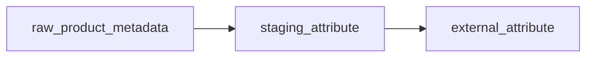
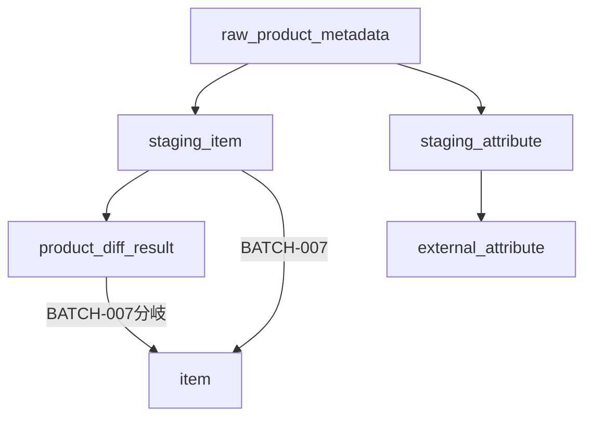

# Staging Attribute テーブル定義書

## 1. ドキュメント情報

| 項目           | 内容                               |
| -------------- | ---------------------------------- |
| ドキュメントID | `DB-TBL-OPT-staging_attribute`     |
| ドキュメント名 | Staging Attribute テーブル定義書   |
| 対象システム   | Gift Recommendation Service MVP    |
| MVP対象        | `optional（△）`                    |
| 作成日         | 2026-06-16                         |
| 更新日         | 2026-06-16（Human Review #576 反映） |

---

## 2. 概要

`staging_attribute` は、外部商品データ連携系における **属性 Staging 中間正本** である。

`raw_product_metadata`（`source_api = attribute_search` または `genre_search` の属性ノード）から BATCH-005（Raw取込・Staging変換）で生成され、楽天 API 由来の正規化属性を一時保持する。反映フェーズで `external_attribute` へ Upsert される。

**MVP では任意テーブル（△）** であり、物理ER §17 No.7 により **MVP DDL 作成対象 60 テーブルから除外** される。本定義書は採用判断・後続 DDL Task への引き継ぎ用として先行整備する。

Staging 系は **物理 FK なし（LOGICAL + Index）**、**成功 Batch 完了後に削除** する一時データ（物理ER §13・`staging_item_テーブル定義書` §13 と同型）。

---

## 3. 目的

- 楽天属性検索API・ジャンル検索API `attributes` / `tagGroups`・（任意）商品検索API 付帯属性を Adapter で正規化した **中間行** を batch が管理する
- `raw_product_metadata` → `staging_attribute` → `external_attribute` の属性昇格フロー中核を物理定義する
- `external_attribute` Upsert キー（`source` + `external_genre_id` + `external_attribute_id`）と列マッピングの Staging 側入力を提供する
- `product_diff_result` との **責務分離**（差分判定は `staging_item` のみが入力）を明確化する
- 処理構成定義書 §10.2 の `staging_item_attribute` 表記を物理名 **`staging_attribute`** に統一する
- 後続 DDL Task が migration を作成できる粒度まで設計を確定する

---

## 4. テーブル基本情報

| 項目 | 内容 |
| ---- | ---- |
| 物理テーブル名 | `staging_attribute` |
| 論理テーブル名 | Staging Attribute |
| 分類 | 外部商品データ連携系 |
| 正本区分 | 一時 / 中間 |
| 主な更新主体 | batch（BATCH-005 Staging 変換・`MOD-BATCH-020` Staging Transformer / `MOD-BATCH-022` Staging Repository / `MOD-BATCH-031` 反映フェーズ） |
| 主な参照主体 | batch のみ（Online / api / reco から Direct 参照しない） |
| MVP対象 | `optional（△）` — テーブル一覧 §5 補足 No.9・§6 No.24。物理ER 上 MVP DDL は `no` |
| 関連物理ER | `docs/06_実装設計/database/物理ER.md` §8–§11・§17 No.7 |

---

## 5. 用途・責務

- **Raw Metadata 単位・ジャンル文脈付き属性ID単位** で Staging 行を作成し、BATCH-005 完了時点の正規化属性を保持する
- 1 回の属性 API / ジャンル API 属性ノードレスポンスから **複数行** を展開し、各 `(external_genre_id, external_attribute_id)` を 1 行として保持する
- 反映フェーズで `source` + `external_genre_id` + `external_attribute_id` をキーに `external_attribute` へ Upsert する **入力正本** となる
- 商品 Staging（`staging_item`）の `attributeIds` シグナルとは **別経路**（§5.9）。hash 入力は `staging_item` Payload が正本
- Public API では返却しない（内部 Batch データ）

### 5.1 対象外

- Raw JSON 本体（Object Storage / `raw_product_metadata` の責務）
- 属性参照マスタ正本（`external_attribute` の責務）
- 商品 Staging（`staging_item` / `staging_item_image` / `staging_ranking_signal` / `staging_genre` の責務）
- 商品差分判定（`product_diff_result` の責務。§5.9）
- 商品×属性中間テーブル（MVP では **作成しない**。`external_attribute_テーブル定義書` §5.6）
- `api_call_log` / `fetch_cursor` 本体
- Public API 公開
- OpenAPI / generated 変更（Epic 終盤 Task #469 へ委譲）

### 5.2 `raw_product_metadata` → `staging_attribute` 関係（transforms_to）

`raw_product_metadata_テーブル定義書` §5.5 / §8.2 に従う。

| 観点 | 方針 |
| ---- | ---- |
| データフロー | `api_call_log` → **`raw_product_metadata`** → **`staging_attribute`**（BATCH-005） |
| 物理ER 関係 | `raw_product_metadata` → `staging_attribute` : `transforms_to`（**LOGICAL** FK。Staging 系は物理 FK なし） |
| カーディナリティ | 1 Raw Metadata : **N** Staging Attribute（1 レスポンス内の複数属性ノード） |
| 参照列 | `staging_attribute.raw_metadata_id` → `raw_product_metadata.raw_metadata_id` |
| trace | `raw_metadata_id` / `staging_attribute_id`（インターフェース一覧 IF-DB-BATCH-005） |
| `source` / `source_api` | **`source` は本テーブルに denormalize**（Upsert キー用）。`source_api` は **`raw_product_metadata.source_api`** 経由で trace（行に持たない） |
| 対象 Raw | 主に `source_api IN ('attribute_search', 'genre_search')`。商品検索API 由来の `attributeIds` 展開は **原則 `staging_item` Payload**（§5.9） |



### 5.3 `staging_attribute` → `external_attribute` 関係（upserts）

`external_attribute_テーブル定義書` §5.2 に従う（#575 merge 済み正本）。

| 観点 | 方針 |
| ---- | ---- |
| 物理ER 関係 | `staging_attribute` → `external_attribute` : `upserts`（**LOGICAL**） |
| Upsert 自然キー | **`source` + `external_genre_id` + `external_attribute_id`**（`external_attribute` 複合 PK と同一体系） |
| カーディナリティ | N Staging 行 : 1 External Attribute（時系列で複数 Staging 行が同一正本行に収束） |
| 反映 Batch / モジュール | BATCH-005 反映フェーズ / `MOD-BATCH-031` External Attribute Updater |
| 正本性 | **永続正本は `external_attribute`**。Staging 行は一時中間 |

### 5.4 BATCH-005 書き込み経路

| Batch | 入力 | Staging 作成 | `external_attribute` 反映 | 備考 |
| ----- | ---- | ------------ | ------------------------- | ---- |
| BATCH-005 | `raw_product_metadata`（`attribute_search` / `genre_search` 属性ノード） | ○（`staging_attribute` INSERT） | ○（反映フェーズで Upsert） | 処理構成定義書 §10.2 |

> **方針**: Staging 行を経由して `external_attribute` へ反映する（`external_attribute_テーブル定義書` §5.2）。MVP では物理テーブル未作成でも、Batch I/F は本定義を正とする。

### 5.5 楽天API マッピング（Staging 列）

| 入力経路（優先順） | 楽天API（正規化後） | Staging 物理カラム | `external_attribute` 列 | 備考 |
| ------------------ | ------------------- | ------------------ | ------------------------- | ---- |
| 1（MVP 優先） | 商品検索API `attributeFlag=1` 付帯属性 | `attribute_name` 等 | 各列 | 名称補完。ID は `external_attribute_id` |
| 2 | ジャンル検索API `tagGroups` / `attributes` | `attribute_group_name`, `attribute_name` | 各列 | §12.2 正規化 `external_attributes` |
| 3（任意） | 属性検索API レスポンス | 各列 | 各列 | MVP 必須ではない（§4.5.2） |
| 共通 | `genreId` | `external_genre_id` | `external_genre_id` | 属性はジャンル文脈でスコープ |
| 共通 | 属性 ID | `external_attribute_id` | `external_attribute_id` | 楽天属性 ID（正の整数） |
| — | — | `source` | `source` | `raw_product_metadata.source` から denormalize。MVP 固定 `rakuten` |
| — | — | `staged_at` | `fetched_at` | Staging 完了日時を正本反映時の `fetched_at` に渡す |

### 5.6 外部商品データ連携設計書 §12.2–§12.3 との差分整理

| 外部商品データ連携設計書 | 本テーブル（MVP 物理 DDL） | 扱い |
| ------------------------ | -------------------------- | ---- |
| `external_attributes`（正規化項目） | `attribute_name` / `attribute_group_name` | Adapter 正規化後の Staging 列 |
| 属性例（ブランド・オーガニック等） | `attribute_name` | Feature 推定補助。MVP では強反映しない（§12.3） |
| `tagGroups` | `attribute_group_name` | ジャンル API 由来時に設定 |
| `fetched_at`（概念） | `staged_at` | Staging 層は **`staged_at`**。正本反映時に `external_attribute.fetched_at` へ写像 |

### 5.7 処理構成定義書 `staging_item_attribute` 表記の整理

| 資料上の名称 | 物理テーブル正本 | 扱い |
| ------------ | ---------------- | ---- |
| `staging_item_attribute`（処理構成定義書 §10.2–§10.3） | **`staging_attribute`** | 本定義書で物理名を **`staging_attribute`** に統一 |
| `item_attribute`（外部商品データ連携設計書 §10.3） | **`external_attribute`** | 属性マスタ正本（`external_attribute_テーブル定義書` §5.6） |

> **正本**: テーブル一覧 §6 No.24 の `staging_attribute` を物理名の正とする。

### 5.8 関連 Staging（同一 Raw 由来・別 Task）

| テーブル | 紐づけ | 備考 |
| -------- | ------ | ---- |
| `staging_item` | 同一 `raw_metadata_id`（商品 API 由来 Raw の場合のみ並存） | 商品 Staging 正本（`staging_item_テーブル定義書` #517） |
| `staging_genre` | 同一 `raw_metadata_id`（ジャンル API Raw の場合） | ジャンル Staging（`staging_genre_テーブル定義書` #525） |
| `staging_ranking_signal` | 同一 `raw_metadata_id` + `external_item_code` | ランキング Staging（#524） |

### 5.9 `product_diff_result` との関係（責務分離）

`product_diff_result_テーブル定義書` §5.1–§5.2 に従う。

| 観点 | 方針 |
| ---- | ---- |
| 直接 FK | **なし**。`staging_attribute` ↔ `product_diff_result` 間に参照列を設けない |
| 差分判定入力 | BATCH-006（Product Diff Detector）は **`staging_item` のみ** を judged_as 入力とする |
| パイプライン位置 | BATCH-005 内で **sibling** として並行生成（処理構成定義書 §10.2） |
| `attributeIds` と属性 Staging | 商品 `attributeIds` は **`staging_item` 正規化 Payload / normalized_hash 入力**（DB 列なし）。属性マスタ Staging は **別テーブル** |
| hash 判定 | `staging_attribute` の有無・内容は **normalized_hash 判定に直接影響しない**（属性マスタは参照辞書経路） |
| Retention | いずれも Staging / 派生一時データ。**同一 `raw_metadata_id` / Batch Run 文脈** で Retention 方針を整合させる |



> **注記**: 上図は責務分離の概念図。`product_diff_result` は `staging_item_id` のみを保持し、`staging_attribute` とは **非連結**。

### 5.10 `staging_item` との参照関係（attributeIds）

`staging_item_テーブル定義書` §5.6 / `item_テーブル定義書` §12.3 に従う。

| 観点 | 方針 |
| ---- | ---- |
| `staging_item` 列 | **`attribute_ids` 列なし**。Payload / hash 入力のみ |
| 本テーブル | 属性 **マスタ辞書** の Staging 中間。商品行とは **1:N ではない**（商品×属性中間なし） |
| `attributeIds` Staging 展開 | **行わない**（Human Review #576 §17.1 No.7 **確定**）。商品検索API `attributeIds` は `staging_item` 正規化 Payload / `normalized_hash` 入力のみ |
| 将来解決 | `(source, external_genre_id, external_attribute_id)` で `external_attribute` へ JOIN。商品側は `attributeIds` 配列 |

### 5.11 論理ER との差分整理

論理ER に `staging_attribute` 詳細属性が未掲載のため、本定義書は **テーブル一覧 §6 No.24**・**外部商品データ連携設計書 §12.3**・**`external_attribute_テーブル定義書` §5.2** を正として物理化する。

| 論点 | 本テーブル | 備考 |
| ---- | ---------- | ---- |
| エンティティ名 | Staging Attribute | テーブル一覧と一致 |
| 自然キー（Staging 冪等） | `raw_metadata_id` + `external_genre_id` + `external_attribute_id` | Raw 内属性一意 |
| Upsert キー（正本側） | `source` + `external_genre_id` + `external_attribute_id` | `external_attribute` PK と同一 |

---

## 6. カラム定義

| No | カラム名 | 論理名 | 型 | 必須 | PK | FK | Unique | Default | 説明 |
| --: | -------- | ------ | -- | ---- | -- | -- | ------ | ------- | ---- |
| 1 | `staging_attribute_id` | Staging Attribute ID | `uuid` | `yes` | `yes` | — | `yes` | `gen_random_uuid()` | サロゲート PK。trace キー（IF-DB-BATCH-005） |
| 2 | `raw_metadata_id` | Raw Metadata ID | `uuid` | `yes` | — | LOGICAL | — | — | 生成元 Raw Metadata。`raw_product_metadata.raw_metadata_id` 参照 |
| 3 | `source` | Data Source | `text` | `yes` | — | — | — | `'rakuten'` | 外部 EC ソース。Upsert キー（`external_attribute.source` と同一）。`raw_product_metadata.source` から denormalize |
| 4 | `external_genre_id` | External Genre ID | `bigint` | `yes` | — | LOGICAL | — | — | 属性が属するジャンル文脈。`external_genre.external_genre_id` 論理参照 |
| 5 | `external_attribute_id` | External Attribute ID | `bigint` | `yes` | — | LOGICAL | — | — | 楽天属性 ID。`external_attribute.external_attribute_id` 論理参照 |
| 6 | `attribute_name` | Attribute Name | `varchar(255)` | `yes` | — | — | — | — | 属性表示名。API 正規化後の名称 |
| 7 | `attribute_group_name` | Attribute Group Name | `varchar(255)` | `no` | — | — | — | `NULL` | 属性グループ名。ジャンル API `tagGroups` 正規化時に設定 |
| 8 | `staged_at` | Staged At | `timestamptz` | `yes` | — | — | — | — | Staging 変換完了日時（UTC） |
| 9 | `created_at` | Created At | `timestamptz` | `yes` | — | — | — | `now()` | 行作成日時 |
| 10 | `updated_at` | Updated At | `timestamptz` | `yes` | — | — | — | `now()` | 行最終更新日時 |

---

## 7. 主キー・一意キー

| 種別 | 対象カラム | 方針 | 備考 |
| ---- | ---------- | ---- | ---- |
| PRIMARY KEY | `staging_attribute_id` | サロゲート UUID | trace キー |
| UNIQUE | `raw_metadata_id`, `external_genre_id`, `external_attribute_id` | Raw 1 件あたり同一ジャンル文脈・属性 ID は 1 Staging 行 | Human Review #576 **確定**（§17.1 No.2）。BATCH-005 冪等 |

---

## 8. 外部キー・参照関係

### 8.1 参照先（論理）

| カラム | 参照先 | FK制約 | 参照整合性 | 備考 |
| ------ | ------ | ------ | ---------- | ---- |
| `raw_metadata_id` | `raw_product_metadata.raw_metadata_id` | `LOGICAL` | Batch で存在確認 | transforms_to 親 |
| `external_genre_id` | `external_genre.external_genre_id` | `LOGICAL` | Upsert 先文脈。Staging 時点では未存在可 | ジャンル正本反映後に整合 |
| `external_attribute_id` | `external_attribute.external_attribute_id` | `LOGICAL` | Upsert 先。Staging 時点では未存在可 | 反映後に正本化 |

### 8.2 被参照（論理）

| 参照元 | 参照列 | 関係 | FK制約 | 備考 |
| ------ | ------ | ---- | ------ | ---- |
| `external_attribute` | `source`, `external_genre_id`, `external_attribute_id` | upserts（間接） | `LOGICAL` | Upsert キー対応 |

### 8.3 `product_diff_result` との非参照

| 観点 | 方針 |
| ---- | ---- |
| 物理 / 論理 FK | **設けない**（§5.9） |
| 差分判定 | `product_diff_result.staging_item_id` → `staging_item` のみ |

### 8.4 関連 Staging（`staging_item` との関係）

| テーブル | 紐づけ | 備考 |
| -------- | ------ | ---- |
| `staging_item` | 同一 `raw_metadata_id`（商品 API 由来 Raw の場合のみ並存） | 属性 API Raw では `staging_item` 行は通常 **0 件** |
| `staging_genre` | 同一 `raw_metadata_id`（ジャンル API Raw で属性ノード展開時） | ジャンル Staging と属性 Staging が **同一 Raw から並存** しうる |

---

## 9. Index

| Index名 | 対象カラム | 種別 | 用途 | 備考 |
| ------- | ---------- | ---- | ---- | ---- |
| `staging_attribute_pkey` | `staging_attribute_id` | btree（PK） | 主キー | 自動生成 |
| `uq_staging_attribute_raw_metadata_attr` | `raw_metadata_id`, `external_genre_id`, `external_attribute_id` | unique btree | BATCH-005 冪等 | §7 |
| `idx_staging_attribute_raw_metadata` | `raw_metadata_id` | btree | Raw 単位一覧・Retention DELETE 補助 | transforms_to 親 |
| `idx_staging_attribute_source_genre_attr` | `source`, `external_genre_id`, `external_attribute_id` | btree | `external_attribute` 反映フェーズの突合 | Upsert キー |

---

## 10. 制約

| 制約名 | 種別 | 対象 | 内容 | 備考 |
| ------ | ---- | ---- | ---- | ---- |
| `staging_attribute_pkey` | PRIMARY KEY | `staging_attribute_id` | 主キー | — |
| `uq_staging_attribute_raw_metadata_attr` | UNIQUE | `raw_metadata_id`, `external_genre_id`, `external_attribute_id` | BATCH 冪等 | §7 |
| `chk_staging_attribute_source_mvp` | CHECK | `source` | `source = 'rakuten'` | MVP 固定 |
| `chk_staging_attribute_name_length` | CHECK | `attribute_name` | `char_length(attribute_name) BETWEEN 1 AND 255` | `external_attribute` と同型 |
| `chk_staging_attribute_group_length` | CHECK | `attribute_group_name` | `attribute_group_name IS NULL OR char_length(attribute_group_name) BETWEEN 1 AND 255` | — |
| `chk_staging_attribute_id_positive` | CHECK | `external_attribute_id` | `external_attribute_id > 0` | 楽天属性 ID は正の整数 |

---

## 11. 状態・enum

| カラム | enum / code | 定義元 | 許容値 | 備考 |
| ------ | ----------- | ------ | ------ | ---- |
| `source` | （code 未定義） | `item.source` / `external_attribute.source` 慣行 | MVP: `rakuten` | CHECK で MVP 固定 |
| — | — | — | — | 状態カラムなし（属性マスタは hash 差分判定対象外） |

---

## 12. 更新仕様

| 操作 | 実行主体 | 条件 | 更新項目 | 冪等性 | 備考 |
| ---- | -------- | ---- | -------- | ------ | ---- |
| INSERT | batch | BATCH-005 Staging 変換成功 | 全業務列 + `staged_at` | `(raw_metadata_id, external_genre_id, external_attribute_id)` UNIQUE | IF-DB-BATCH-005 |
| SELECT | batch | `external_attribute` 反映フェーズ | — | — | Staging 行を読み Upsert |
| DELETE | batch | Batch 成功完了後 Retention | — | `raw_metadata_id` 単位等 | 物理ER §13 |
| INSERT / UPDATE / DELETE | api / reco / web | — | — | **禁止** | Staging は Batch 専用 |

### 12.1 Staging 保存フロー（属性 API / ジャンル属性ノード）

```text
1. raw_product_metadata（source_api IN (attribute_search, genre_search), import_status = raw_saved）を読み取り
2. Object Storage から Raw JSON 取得
3. Staging Transformer（MOD-BATCH-020）で属性ノードを展開
4. Staging Validator（MOD-BATCH-021）で必須項目検証
5. staging_attribute INSERT（1 属性 = 1 行）
6. external_attribute UPSERT（反映フェーズ / MOD-BATCH-031）
7. raw_product_metadata.import_status → staged（必要に応じて imported）
```

### 12.2 INSERT 疑似コード

```sql
INSERT INTO staging_attribute (
  raw_metadata_id,
  source,
  external_genre_id,
  external_attribute_id,
  attribute_name,
  attribute_group_name,
  staged_at
) VALUES (
  :raw_metadata_id,
  :source,
  :external_genre_id,
  :external_attribute_id,
  :attribute_name,
  :attribute_group_name,
  :staged_at
)
ON CONFLICT (raw_metadata_id, external_genre_id, external_attribute_id) DO UPDATE SET
  source = EXCLUDED.source,
  attribute_name = EXCLUDED.attribute_name,
  attribute_group_name = EXCLUDED.attribute_group_name,
  staged_at = EXCLUDED.staged_at,
  updated_at = now();
```

### 12.3 `staging_attribute` → `external_attribute` 列マッピング

| staging_attribute 列 | external_attribute 列 | 備考 |
| -------------------- | --------------------- | ---- |
| `source` | `source` | Upsert キー |
| `external_genre_id` | `external_genre_id` | Upsert キー |
| `external_attribute_id` | `external_attribute_id` | Upsert キー |
| `attribute_name` | `attribute_name` | |
| `attribute_group_name` | `attribute_group_name` | |
| `staged_at` | `fetched_at` | Staging 完了日時を正本の最終反映日時とする |

### 12.4 `external_attribute` Upsert 疑似コード（反映フェーズ）

```sql
INSERT INTO external_attribute (
  source, external_genre_id, external_attribute_id,
  attribute_name, attribute_group_name, fetched_at
)
SELECT
  sa.source,
  sa.external_genre_id,
  sa.external_attribute_id,
  sa.attribute_name,
  sa.attribute_group_name,
  sa.staged_at
FROM staging_attribute sa
WHERE sa.raw_metadata_id = :raw_metadata_id
ON CONFLICT (source, external_genre_id, external_attribute_id) DO UPDATE SET
  attribute_name = EXCLUDED.attribute_name,
  attribute_group_name = EXCLUDED.attribute_group_name,
  fetched_at = EXCLUDED.fetched_at;
```

---

## 13. データ保持・削除

| 観点 | 方針 |
| ---- | ---- |
| 保持期間 | **成功 Batch 完了後即 DELETE** / 失敗・部分成功時 **7〜14 日**（物理ER §13・`staging_item_テーブル定義書` §13 と同型） |
| 削除方式 | 物理 DELETE |
| 削除条件 | 原則 **`raw_metadata_id` 単位**（Raw Metadata Retention と連動）。`product_diff_result` Retention と **独立**（§5.9） |
| 論理削除 | 列なし |
| 履歴 | **保持しない**（Staging 中間のため） |
| アーカイブ | MVP 対象外 |

---

## 14. Migration / DDL

| 項目 | 内容 |
| ---- | ---- |
| DDL対象 | `staging_attribute` |
| **MVP DDL** | **`no`** — 物理ER §17 No.7。MVP 60 テーブルに含めない |
| migration単位 | 1 テーブル = 1 migration（DDL Task。採用時） |
| 適用順序 | 外部商品データ連携系。**`raw_product_metadata` 作成後**、**`external_genre` / `external_attribute` より前または並行** 可（LOGICAL FK）。`staging_item` / `staging_genre` と並行可 |
| rollback方針 | forward migration 主体。DROP は Human Review 必須 |
| 破壊的変更有無 | `no`（初回 CREATE 時） |

> 本定義書は **設計正本** として先行作成する。MVP リリース時に物理テーブルを作成するかは Human Review 論点（§17.1 No.1）。

---

## 15. セキュリティ・権限

| 観点 | 方針 |
| ---- | ---- |
| 読み取り権限 | batch（service role 経由）のみ |
| 書き込み権限 | batch のみ。Online / reco / web からの DML 禁止 |
| service role利用 | Staging Repository / External Attribute Updater に限定 |
| 個人情報・機微情報 | 含まない（属性名・グループ名のみ） |
| ログ出力制限 | 大量属性名を application log に過剰出力しない |

---

## 16. テスト観点

| No | 観点 | 確認内容 | 種別 |
| --: | ---- | -------- | ---- |
| 1 | DDL適用 | CREATE TABLE / Index / CHECK / UNIQUE が定義どおり（採用時） | migration |
| 2 | 冪等 Upsert | 同一 `(raw_metadata_id, external_genre_id, external_attribute_id)` 再 INSERT が UPDATE になる | migration |
| 3 | transforms_to | `raw_metadata_id` 不存在時 Batch が拒否（アプリ validation） | integration |
| 4 | 反映連携 | Staging 行から `external_attribute` Upsert が複合キーで成功する | integration |
| 5 | 多行展開 | 1 ジャンル API 属性ノードから複数行になる | integration |
| 6 | product_diff_result 分離 | BATCH-006 が `staging_attribute` を参照しない | manual |
| 7 | Retention | 成功 Batch 後 DELETE が `raw_metadata_id` 単位で実行可能 | integration |
| 8 | MVP 非作成 | MVP migration に本テーブルが含まれない | manual |
| 9 | 権限 | web client から Direct DB アクセス不可 | manual |

---

## 17. 未決事項

| No | 論点 | 判断が必要な理由 | 判断者 | 期限 | 備考 |
| --: | ---- | ---------------- | ------ | ---- | ---- |
| — | — | — | — | — | Human Review #576 にて §17.1 No.1〜8 を決定済み（下記参照） |

### 17.1 Human Review 決定事項（Issue #576）

| No | 論点 | 決定内容 | 決定者 | 備考 |
| --: | ---- | -------- | ------ | ---- |
| 1 | MVP DDL 作成 | **MVP では作成しない**（物理ER §17 No.7 整合） | Human | `external_attribute` #575 §17.1 No.1 と同型 |
| 2 | UNIQUE キー | **`(raw_metadata_id, external_genre_id, external_attribute_id)`** を必須とする | Human | §7・§12.2 ON CONFLICT |
| 3 | `source` 列 | **採用**。`raw_product_metadata.source` を Staging INSERT 時にコピー | Human | `staging_genre` #525 / `staging_item` #517 と同型 |
| 4 | 入力 API 優先順位 | **商品検索API `attributeFlag` / `attributeIds` 優先** → ジャンル API `attributes` / `tagGroups` → 属性検索API **MVP 不採用** | Human | `external_attribute_テーブル定義書` §12.2・§17.1 No.3 と整合 |
| 5 | Retention | **物理ER §13 方針**（成功 Batch 後即 DELETE） | Human | `staging_item_テーブル定義書` §13 と同一 |
| 6 | `product_diff_result` 関係 | **直接 FK なし**。差分判定は `staging_item` のみ | Human | §5.9 |
| 7 | 商品検索API `attributeIds` Staging 展開 | **展開しない**。`staging_item` Payload / `normalized_hash` 入力のみ | Human | `external_attribute` #575 §17.1 No.4 と整合。§5.10 |
| 8 | `staging_item_attribute` 物理名 | **`staging_attribute` に統一** | Human | §5.7。処理構成定義書 §10.2–§10.3 |

---

## 18. 関連資料

| 種別 | パス / URL | 用途 |
| ---- | ---------- | ---- |
| 物理ER | `docs/06_実装設計/database/物理ER.md` | §17 No.7 MVP 対象外・Staging FK 方針 |
| 論理ER | `docs/05_アプリケーション設計/アプリ/database/論理ER.md` | 商品系・外部連携系 |
| テーブル一覧 | `docs/05_アプリケーション設計/アプリ/database/テーブル一覧.md` | §6 No.24・§5 補足 No.9 |
| enum定義書 | `docs/06_実装設計/database/enum定義書.md` | `source_api` 等 |
| 外部商品連携 | `docs/05_アプリケーション設計/アプリ/外部商品データ連携設計書.md` | §4.5 / §12.2–§12.3 |
| インターフェース一覧 | `docs/05_アプリケーション設計/アプリ/インターフェース一覧.md` | IF-DB-BATCH-005 |
| バッチ設計方針書 | `docs/05_アプリケーション設計/アプリ/batch/バッチ設計方針書.md` | §8.2 属性 Upsert |
| バッチ処理一覧 | `docs/05_アプリケーション設計/アプリ/batch/バッチ処理一覧.md` | BATCH-005 |
| 処理構成定義書 | `docs/05_アプリケーション設計/アプリ/処理構成定義書.md` | §10.2–§10.3 |
| モジュール一覧 | `docs/05_アプリケーション設計/アプリ/モジュール一覧.md` | MOD-BATCH-031 |
| raw_product_metadata 定義書 | `docs/06_実装設計/database/raw_product_metadata_テーブル定義書.md` | §5 transforms_to 親 |
| external_attribute 定義書 | `docs/06_実装設計/database/external_attribute_テーブル定義書.md` | §5.2 Upsert 先（#575 正本） |
| product_diff_result 定義書 | `docs/06_実装設計/database/product_diff_result_テーブル定義書.md` | §5.9 sibling 関係（#526） |
| staging_item 定義書 | `docs/06_実装設計/database/staging_item_テーブル定義書.md` | attributeIds 方針 |
| staging_genre 定義書 | `docs/06_実装設計/database/staging_genre_テーブル定義書.md` | Staging 系章構成参考 |
| external_genre 定義書 | `docs/06_実装設計/database/external_genre_テーブル定義書.md` | ジャンル文脈参照 |
| source_api enum | `packages/code-definitions/batch/source_api.yaml` | `attribute_search` / `genre_search` |

---

## 19. レビュー観点

- テーブル一覧 §6 No.24・§5 補足 No.9（MVP任意）と矛盾していない
- 物理ER §17 No.7（MVP DDL 作成対象外）が §4・§14 で明記されている
- `raw_product_metadata` → `staging_attribute` → `external_attribute` 昇格関係が §5.2 / §5.3 / §12.3 / §12.4 で明記されている
- `external_attribute_テーブル定義書` §5.2 Upsert キー・更新列と整合している
- `product_diff_result_テーブル定義書` との **責務分離**（直接 FK なし・BATCH-006 入力外）が §5.9 / §8.3 で明記されている
- `staging_item` の `attributeIds`（Payload のみ）との関係が §5.10 で整理されている
- 処理構成定義書 `staging_item_attribute` 表記が §5.7 で `staging_attribute` に統一されている
- Staging 系 **物理 FK なし** 方針が §8 で明記されている
- Retention（物理ER §13）が §13 に反映されている
- apps/** / OpenAPI / generated 変更が含まれていない
- secret や `.env` 実値が含まれていない
- Human Review #576 決定事項（§17.1 No.1〜8）が本文に反映されている
