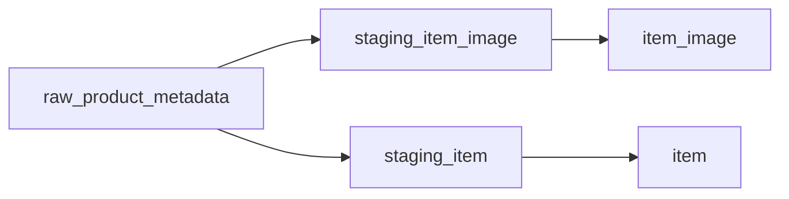

# Staging Item Image テーブル定義書

## 1. ドキュメント情報

| 項目           | 内容                                |
| -------------- | ----------------------------------- |
| ドキュメントID | `DB-TBL-MVP-staging_item_image`     |
| ドキュメント名 | Staging Item Image テーブル定義書   |
| 対象システム   | Gift Recommendation Service MVP   |
| MVP対象        | `yes`                               |
| 作成日         | 2026-06-14                          |
| 更新日         | 2026-06-14（Human Review #523 反映） |

---

## 2. 概要

`staging_item_image` は、外部商品データ連携系における **商品画像 Staging 中間正本** である。

`raw_product_metadata`（Raw Metadata）から BATCH-005（Raw取込・Staging変換）で生成され、楽天商品検索 API の `smallImageUrls` / `mediumImageUrls` を URL 行として一時保持する。BATCH-007（Item反映）の入力となり、最終的に `item_image` へ Upsert される。

Staging 系は **物理 FK なし（LOGICAL + Index）**、**成功 Batch 完了後に削除** する一時データ（物理ER §13・`staging_item_テーブル定義書` §13 と同型）。

---

## 3. 目的

- 楽天 API 由来の画像 URL 配列を **中間行** として batch が管理する
- `raw_product_metadata` → `staging_item_image` → `item_image` の昇格フロー Staging 側を物理定義する
- `staging_item` と **同一 Raw 由来・同一 `external_item_code`** で兄弟紐づけし、BATCH-007 が item 解決後に画像を反映できる入力を提供する
- `is_primary_candidate` により主画像候補を Staging 層で保持し、BATCH-007 で `item_image.is_primary` へ確定する
- 後続 DDL Task が migration を作成できる粒度まで設計を確定する

---

## 4. テーブル基本情報

| 項目 | 内容 |
| ---- | ---- |
| 物理テーブル名 | `staging_item_image` |
| 論理テーブル名 | Staging Item Image |
| 分類 | 外部商品データ連携系 |
| 正本区分 | 一時 / 中間 |
| 主な更新主体 | batch（BATCH-005 / BATCH-007・`MOD-BATCH-020` Staging Transformer / `MOD-BATCH-022` Staging Repository / `MOD-BATCH-024` Item Image Updater） |
| 主な参照主体 | batch のみ（Online / api / reco から Direct 参照しない） |
| MVP対象 | `yes` |
| 関連物理ER | `docs/06_実装設計/database/物理ER.md` §8–§11 |

---

## 5. 用途・責務

- **Raw Metadata 単位・商品コード単位・画像 URL 単位** で Staging 行を作成し、BATCH-005 完了時点の画像 URL 集合を保持する
- `staging_item` と **並行 INSERT**（同一 `raw_metadata_id` + `external_item_code`）し、商品属性と画像を分離管理する
- BATCH-007 で `external_item_code` + `item.source` により `item_id` を解決したうえで `item_image` へ Upsert する **入力正本** となる
- 画像バイナリは保持しない（URL 参照のみ）
- Public API では返却しない（内部 Batch データ）

### 5.1 対象外

- Raw JSON 本体（Object Storage / `raw_product_metadata` の責務）
- 商品正本属性（`staging_item` / `item` の責務）
- Item 画像正本（`item_image` の責務）
- ランキング・ジャンル Staging（`staging_ranking_signal` / `staging_genre` の責務）
- 差分判定結果（`product_diff_result` の責務）
- `source` / `source_system` / `source_api` 列（§5.2）
- `is_active` 列（同期置換 + Retention DELETE で代替）
- 画像バイナリ・CDN（MVP 対象外）
- Public API 公開
- OpenAPI / generated 変更（Epic 終盤 Task #469 へ委譲）

### 5.2 出所・トレース方針（`source` 系列列なし）

| 観点 | 方針 |
| ---- | ---- |
| 取得元 API | 楽天商品検索 API（`item_search`）。`raw_product_metadata.source_api` で trace |
| マーケット識別 | **本テーブルに `source` 列なし**。BATCH-007 で `staging_item.source` または `item.source` と `external_item_code` で item 解決 |
| API トレース | `raw_metadata_id` → `raw_product_metadata.source_api`（監査・デバッグ時） |
| 本テーブル列 | **`source` / `source_system` / `source_api` は MVP 物理 DDL に含めない**（論理ER §9.2・`item_image_テーブル定義書` §5.2 と同型） |

### 5.3 `raw_product_metadata` → `staging_item_image` 関係（transforms_to）

`raw_product_metadata_テーブル定義書` §5.5 / §8.2 に従う。

| 観点 | 方針 |
| ---- | ---- |
| データフロー | `fetch_cursor`（任意）→ `api_call_log` → **`raw_product_metadata`** → **`staging_item_image`**（BATCH-005） |
| 物理ER 関係 | `raw_product_metadata` → `staging_item_image` : `transforms_to`（**LOGICAL** FK。Staging 系は物理 FK なし） |
| カーディナリティ | 1 Raw Metadata : **N** Staging Item Image（1 商品あたり複数 URL 行） |
| 参照列 | `staging_item_image.raw_metadata_id` → `raw_product_metadata.raw_metadata_id` |
| trace | `raw_metadata_id`（インターフェース一覧 IF-DB-BATCH-005） |



### 5.4 `staging_item` との兄弟紐づけ

`staging_item_テーブル定義書` §8.3 に従う。

| 観点 | 方針 |
| ---- | ---- |
| 紐づけキー | **`raw_metadata_id` + `external_item_code`**（物理 FK なし） |
| 作成タイミング | BATCH-005 で `staging_item` INSERT と **同一トランザクションまたは同一フェーズ内** で INSERT |
| 責務分離 | 商品属性は `staging_item`、画像 URL 集合は **本テーブル** |
| `source` | `staging_item.source` を正とし、本テーブルには **denormalize しない**（論理ER §9.2 整合） |
| 存在整合 | 画像行の `external_item_code` は、同一 `raw_metadata_id` の `staging_item` 行と **一致** すること（Staging Validator で検証） |

### 5.5 `staging_item_image` → `item_image` 反映関係（upserts）

`item_image_テーブル定義書` §5.5 / §12.1 に従う。

| 観点 | 方針 |
| ---- | ---- |
| データフロー | **`staging_item_image`**（BATCH-007 読取）→ **`item_image`**（BATCH-007 Upsert） |
| 物理ER 関係 | `staging_item_image` → `item_image` : `upserts`（**LOGICAL**） |
| item 解決 | `external_item_code` + **`item.source`**（`staging_item.source` と同一）で `item_id` を解決。**`item` Upsert 後** に実施 |
| Upsert 自然キー（Item 側） | `item_id` + `image_url`（`item_image_テーブル定義書` §7） |
| 同期置換 | 当該 `item_id` について Staging 集合 S に含まれない既存 `item_image` 行を **DELETE** |
| 反映 Batch | BATCH-007 / `MOD-BATCH-024` Item Image Updater |
| Online 参照 | **禁止**（Staging は Batch 内部のみ） |

### 5.6 主画像候補（`is_primary_candidate`）方針

`item_image_テーブル定義書` §5.3・外部商品データ連携設計書 §11.4 と同一優先順を Staging 層で候補化する。

```text
1. mediumImageUrls[0] に対応する行（image_size_type = medium, display_order = 0）
2. 上記が無い場合 smallImageUrls[0]（image_size_type = small, display_order = 0）
3. 画像行が 0 件の場合は主画像候補なし（BATCH-007 で item_image 行 0 件 + UI プレースホルダー）
```

| 観点 | 方針 |
| ---- | ---- |
| Staging 列 | `is_primary_candidate`（論理ER §9.2） |
| 算出タイミング | **BATCH-005** Staging 変換時（`MOD-BATCH-020`） |
| Item 正本列 | `item_image.is_primary` は **BATCH-007** で `is_primary_candidate` を引き継ぎ確定（§12.3） |
| 制約 | 同一 `(raw_metadata_id, external_item_code)` あたり `is_primary_candidate = true` は **最大 1 行**（§9 partial unique） |

### 5.7 楽天 API マッピング

| 楽天商品検索 API | 物理カラム / 処理 | 備考 |
| ---------------- | ----------------- | ---- |
| `mediumImageUrls[]` | `image_url`, `image_size_type='medium'`, `display_order`=配列 index | 主画像候補優先 |
| `smallImageUrls[]` | `image_url`, `image_size_type='small'`, `display_order`=配列 index | サムネイル候補 |
| `imageFlag` | 反映しない（行の有無で判定） | 画像なし時は行 0 件 |
| — | `staged_at` | BATCH-005 Staging 変換完了時刻（UTC） |
| — | `is_primary_candidate` | §5.6 に従い BATCH-005 で算出 |

> **`normalized_hash` との関係**: `item_テーブル定義書` §12.3 どおり、画像 URL は hash 入力に含むが **列は `item_image` のみ** に保持する。本テーブルは hash 列を持たない。

### 5.8 Staging 層同期置換（BATCH-005 内）

| 観点 | 方針 |
| ---- | ---- |
| 目的 | 同一 `raw_metadata_id` + `external_item_code` について、今回 API レスポンスに **含まれない URL 行を Staging から除去** |
| 実行主体 | BATCH-005（`MOD-BATCH-022` Staging Repository） |
| 方式 | UPSERT 後、当該キーの既存行のうち今回集合外 `image_url` を **DELETE** |
| Item 反映 | BATCH-007 が Staging 集合 S を読み取り、`item_image` 側でも同期 DELETE（`item_image_テーブル定義書` §12.1） |

---

## 6. カラム定義

| No | カラム名 | 論理名 | 型 | 必須 | PK | FK | Unique | Default | 説明 |
| --: | -------- | ------ | -- | ---- | -- | -- | ------ | ------- | ---- |
| 1 | `staging_item_image_id` | Staging Item Image ID | `uuid` | `yes` | `yes` | — | `yes` | `gen_random_uuid()` | サロゲート PK |
| 2 | `raw_metadata_id` | Raw Metadata ID | `uuid` | `yes` | — | LOGICAL | — | — | 生成元 Raw Metadata。`raw_product_metadata.raw_metadata_id` 参照 |
| 3 | `external_item_code` | External Item Code | `text` | `yes` | — | — | — | — | 楽天 `itemCode`。`staging_item.external_item_code` と一致 |
| 4 | `image_url` | Image URL | `text` | `yes` | — | — | — | — | 画像 URL（楽天 CDN 等）。Upsert 自然キー構成要素 |
| 5 | `image_size_type` | Image Size Type | `text` | `yes` | — | — | — | — | `small` / `medium` |
| 6 | `display_order` | Display Order | `integer` | `yes` | — | — | — | `0` | 同一商品内の表示順（API 配列 index 由来） |
| 7 | `is_primary_candidate` | Primary Candidate Flag | `boolean` | `yes` | — | — | — | `false` | 主画像候補。§5.6。BATCH-007 で `item_image.is_primary` へ反映 |
| 8 | `staged_at` | Staged At | `timestamptz` | `yes` | — | — | — | — | Staging 変換完了日時（UTC） |
| 9 | `created_at` | Created At | `timestamptz` | `yes` | — | — | — | `now()` | 行作成日時 |
| 10 | `updated_at` | Updated At | `timestamptz` | `yes` | — | — | — | `now()` | 行最終更新日時 |

> **論理ER §9.2 との差分**: 論理ERは監査用 `created_at` / `updated_at` を列挙していないが、`staging_item_テーブル定義書` と同型で **採用** する。

---

## 7. 主キー・一意キー

| 種別 | 対象カラム | 方針 | 備考 |
| ---- | ---------- | ---- | ---- |
| PRIMARY KEY | `staging_item_image_id` | サロゲート UUID | — |
| UNIQUE | `raw_metadata_id`, `external_item_code`, `image_url` | BATCH-005 冪等キー | Human Review #523 **確定**（§17.1 No.1）。同一 Raw 内の同一商品・同一 URL は 1 行 |
| UNIQUE（partial） | `raw_metadata_id`, `external_item_code` WHERE `is_primary_candidate = true` | 主画像候補 1 件制約 | Human Review #523 **確定**（§17.1 No.3）。Index 名: `uq_staging_item_image_primary_candidate`（§9） |

---

## 8. 外部キー・参照関係

### 8.1 参照先（論理）

| カラム | 参照先 | FK制約 | 参照整合性 | 備考 |
| ------ | ------ | ------ | ---------- | ---- |
| `raw_metadata_id` | `raw_product_metadata.raw_metadata_id` | `LOGICAL` | Batch で存在確認 | transforms_to 親 |

### 8.2 被参照（論理）

| 参照元 | 参照列 | 関係 | FK制約 | 備考 |
| ------ | ------ | ---- | ------ | ---- |
| `item_image` | （間接）`external_item_code` + `image_url` | upserts | `LOGICAL` | `item_id` 解決後に BATCH-007 で反映。物理 FK なし |

### 8.3 兄弟 Staging（同一 Raw 由来）

| テーブル | 紐づけ | 備考 |
| -------- | ------ | ---- |
| `staging_item` | `raw_metadata_id` + `external_item_code` | 商品属性正本（`staging_item_テーブル定義書` §8.3） |
| `staging_ranking_signal` | 同上 | ランキング由来時（`staging_ranking_signal_テーブル定義書` #524） |
| `staging_genre` | `raw_metadata_id` | 別 Task |

---

## 9. Index

| Index名 | 対象カラム | 種別 | 用途 | 備考 |
| ------- | ---------- | ---- | ---- | ---- |
| `staging_item_image_pkey` | `staging_item_image_id` | btree（PK） | 主キー | 自動生成 |
| `uq_staging_item_image_raw_code_url` | `raw_metadata_id`, `external_item_code`, `image_url` | unique btree | BATCH-005 冪等 | §7 |
| `uq_staging_item_image_primary_candidate` | `raw_metadata_id`, `external_item_code` | unique partial | 主画像候補 1 件 | `WHERE is_primary_candidate = true` |
| `idx_staging_item_image_raw_metadata` | `raw_metadata_id` | btree | Raw 単位一覧・Retention DELETE 補助 | transforms_to 親 |
| `idx_staging_item_image_raw_code` | `raw_metadata_id`, `external_item_code` | btree | BATCH-007 の商品単位画像集合取得 | §12.3 |

> 物理ER §10 `staging_item_image` Index 案と整合（Human Review #523 反映）。

---

## 10. 制約

| 制約名 | 種別 | 対象 | 内容 | 備考 |
| ------ | ---- | ---- | ---- | ---- |
| `staging_item_image_pkey` | PRIMARY KEY | `staging_item_image_id` | 主キー | — |
| `uq_staging_item_image_raw_code_url` | UNIQUE | `raw_metadata_id`, `external_item_code`, `image_url` | BATCH-005 冪等 | §7 |
| `uq_staging_item_image_primary_candidate` | UNIQUE | `raw_metadata_id`, `external_item_code` | `is_primary_candidate = true` は商品あたり 1 行 | partial unique |
| `chk_staging_item_image_size_type` | CHECK | `image_size_type` | `image_size_type IN ('small', 'medium')` | `item_image` と整合 |
| `chk_staging_item_image_display_order` | CHECK | `display_order` | `display_order >= 0` | 配列 index 由来 |
| `chk_staging_item_image_url_not_empty` | CHECK | `image_url` | `char_length(trim(image_url)) > 0` | 空 URL 禁止 |

---

## 11. 状態・enum

| カラム | enum / code | 定義元 | 許容値 | 備考 |
| ------ | ----------- | ------ | ------ | ---- |
| `image_size_type` | （code 未定義） | 論理ER §9.2 / `item_image_テーブル定義書` §11 | `small` / `medium` | enum定義書未 YAML 化。CHECK で担保 |
| — | — | — | — | 状態カラムなし（`is_active` 不採用） |

---

## 12. 更新仕様

| 操作 | 実行主体 | 条件 | 更新項目 | 冪等性 | 備考 |
| ---- | -------- | ---- | -------- | ------ | ---- |
| INSERT | batch | BATCH-005 Staging 変換成功 | 全業務列 + `staged_at` | `(raw_metadata_id, external_item_code, image_url)` UNIQUE | IF-DB-BATCH-005 |
| UPSERT | batch | BATCH-005 再実行 | `image_size_type`, `display_order`, `is_primary_candidate`, `staged_at`, `updated_at` | §12.2 ON CONFLICT | 冪等 |
| DELETE | batch | BATCH-005 同期置換 / Retention | — | `raw_metadata_id` 単位等 | §5.8 / §13 |
| SELECT | batch | BATCH-007 Item Image 反映 | — | — | 商品単位画像集合 S |
| INSERT / UPDATE / DELETE | api / reco / web | — | — | **禁止** | Staging は Batch 専用 |

### 12.1 Staging 保存フロー（BATCH-005）

```text
1. raw_product_metadata（import_status = raw_saved）を読み取り
2. Object Storage から Raw JSON 取得
3. Staging Transformer（MOD-BATCH-020）で smallImageUrls / mediumImageUrls を行展開
4. is_primary_candidate を §5.6 で算出
5. Staging Validator（MOD-BATCH-021）で必須項目・兄弟 staging_item 存在を検証
6. staging_item_image UPSERT（staging_item と同一フェーズ）
7. 同期置換：当該 (raw_metadata_id, external_item_code) の集合外 image_url を DELETE（§5.8）
8. raw_product_metadata.import_status → staged
```

### 12.2 INSERT / UPSERT 疑似コード

```sql
INSERT INTO staging_item_image (
  raw_metadata_id,
  external_item_code,
  image_url,
  image_size_type,
  display_order,
  is_primary_candidate,
  staged_at
) VALUES (
  :raw_metadata_id,
  :external_item_code,
  :image_url,
  :image_size_type,
  :display_order,
  :is_primary_candidate,
  :staged_at
)
ON CONFLICT (raw_metadata_id, external_item_code, image_url) DO UPDATE SET
  image_size_type = EXCLUDED.image_size_type,
  display_order = EXCLUDED.display_order,
  is_primary_candidate = EXCLUDED.is_primary_candidate,
  staged_at = EXCLUDED.staged_at,
  updated_at = now();

-- Staging 同期置換（§5.8）
DELETE FROM staging_item_image
 WHERE raw_metadata_id = :raw_metadata_id
   AND external_item_code = :external_item_code
   AND image_url NOT IN (:url_list);
```

### 12.3 BATCH-007 読取・`item_image` 反映

`item_image_テーブル定義書` §12.1 を正とし、本テーブルは **入力集合 S** を提供する。

```text
1. item Upsert 完了（item_id 確定。source + external_item_code）
2. SELECT * FROM staging_item_image
     WHERE raw_metadata_id = :raw_metadata_id
       AND external_item_code = :external_item_code
     → 集合 S
3. S の各行を item_id + image_url で item_image UPSERT
4. is_primary ← is_primary_candidate、fetched_at ← BATCH-007 完了時刻
5. item_image 側で S 外 URL を DELETE（item_image 定義書 §12.1 ステップ 5）
6. S が空の場合：当該 item_id の item_image 行をすべて DELETE
```

### 12.4 `staging_item_image` → `item_image` 列マッピング

| staging_item_image 列 | item_image 列 | 備考 |
| --------------------- | ------------- | ---- |
| （解決）`external_item_code` + `item.source` | `item_id` | BATCH-007 前段で item 解決 |
| `image_url` | `image_url` | Upsert キー構成要素 |
| `image_size_type` | `image_size_type` | そのまま |
| `display_order` | `display_order` | そのまま |
| `is_primary_candidate` | `is_primary` | BATCH-007 で確定 |
| — | `fetched_at` | BATCH-007 反映完了時刻（UTC） |

---

## 13. データ保持・削除

| 観点 | 方針 |
| ---- | ---- |
| 保持期間 | **成功 Batch 完了後即 DELETE** / 失敗・部分成功時 **7〜14 日**（物理ER §13・`staging_item_テーブル定義書` §13 と同型） |
| 削除方式 | 物理 DELETE |
| 削除条件 | 原則 **`raw_metadata_id` 単位**（Raw Metadata Retention と連動）。BATCH-005 内同期置換は §5.8 |
| 論理削除 | 列なし（`is_active` 不採用） |
| 履歴 | **保持しない**（Staging 中間のため） |
| アーカイブ | MVP 対象外 |

---

## 14. Migration / DDL

| 項目 | 内容 |
| ---- | ---- |
| DDL対象 | `staging_item_image` |
| migration単位 | 1 テーブル = 1 migration（DDL Task） |
| 適用順序 | 外部商品データ連携系。**`raw_product_metadata` 作成後**、`staging_item` と **並行または同順** 可（LOGICAL FK）。**`item` / `item_image` より前** |
| rollback方針 | forward migration 主体。DROP は Human Review 必須 |
| 破壊的変更有無 | `no`（初回 CREATE） |

---

## 15. セキュリティ・権限

| 観点 | 方針 |
| ---- | ---- |
| 読み取り権限 | batch（service role 経由）のみ |
| 書き込み権限 | batch のみ。Online / reco / web からの DML 禁止 |
| service role利用 | Staging Repository / Item Image Updater に限定 |
| 個人情報・機微情報 | 公開商品画像 URL のみ。secret 非含有 |
| ログ出力制限 | 大量 image_url を application log に過剰出力しない |

---

## 16. テスト観点

| No | 観点 | 確認内容 | 種別 |
| --: | ---- | -------- | ---- |
| 1 | DDL適用 | CREATE TABLE / Index / CHECK / UNIQUE / partial unique が定義どおり | migration |
| 2 | 冪等 Upsert | 同一 `(raw_metadata_id, external_item_code, image_url)` 再 INSERT が UPDATE になる | migration |
| 3 | 主画像候補一意 | 同一 `(raw_metadata_id, external_item_code)` で `is_primary_candidate=true` が 2 行 INSERT できない | migration |
| 4 | transforms_to | `raw_metadata_id` 不存在時 Batch が拒否（アプリ validation） | integration |
| 5 | 兄弟整合 | `external_item_code` に対応する `staging_item` 行が無い場合 Validator が拒否 | integration |
| 6 | Staging 同期置換 | API から消えた URL が Staging から DELETE される | integration |
| 7 | Item 反映 | BATCH-007 相当で `is_primary_candidate` → `is_primary` が引き継がれる | integration |
| 8 | Retention | 成功 Batch 後 `raw_metadata_id` 単位 DELETE が実行可能 | integration |
| 9 | 権限 | web client から Direct DB アクセス不可 | manual |

---

## 17. 未決事項

| No | 論点 | 判断が必要な理由 | 判断者 | 期限 | 備考 |
| --: | ---- | ---------------- | ------ | ---- | ---- |
| — | — | — | — | — | Human Review #523 にて No.1〜5 を決定済み（下記参照） |

### 17.1 Human Review 決定事項（Issue #523）

| No | 論点 | 決定内容 | 決定者 | 備考 |
| --: | ---- | -------- | ------ | ---- |
| 1 | BATCH-005 冪等 UNIQUE キー | **`(raw_metadata_id, external_item_code, image_url)`** を MVP 必須とする | Human | §7・§12.2 ON CONFLICT。`item_image` の `(item_id, image_url)` と同型 |
| 2 | `source` 列 | **不採用**。item 解決は `staging_item.source` / `item.source` + `external_item_code` | Human | 論理ER §9.2 整合。`staging_item` は `source` 保持、画像 Staging は兄弟キーのみ |
| 3 | `is_primary_candidate` partial unique | **採用**（`(raw_metadata_id, external_item_code)` WHERE `is_primary_candidate = true`） | Human | `item_image.is_primary` partial unique と同型（§9 / §10） |
| 4 | 主画像候補算出タイミング | **BATCH-005 内確定**。BATCH-007 は `is_primary_candidate` を引き継ぎのみ | Human | §5.6 / §12.3 |
| 5 | Staging 同期置換 | **BATCH-005 内で実施**（§5.8）。BATCH-007 は Staging 集合 S を信頼 | Human | `item_image` §12.1 と二段階で整合 |

---

## 18. 関連資料

| 種別 | パス / URL | 用途 |
| ---- | ---------- | ---- |
| 物理ER | `docs/06_実装設計/database/物理ER.md` | §9 transforms_to / upserts / §13 Retention |
| 論理ER | `docs/05_アプリケーション設計/アプリ/database/論理ER.md` | §9.2 / §14.4 |
| テーブル一覧 | `docs/05_アプリケーション設計/アプリ/database/テーブル一覧.md` | §6 No.21 |
| リソース一覧 | `docs/05_アプリケーション設計/アプリ/database/リソース一覧.md` | Staging Item Image 分類 |
| 外部商品連携 | `docs/05_アプリケーション設計/アプリ/外部商品データ連携設計書.md` | §11 商品画像 |
| インターフェース一覧 | `docs/05_アプリケーション設計/アプリ/インターフェース一覧.md` | IF-DB-BATCH-005 |
| バッチ設計方針書 | `docs/05_アプリケーション設計/アプリ/batch/バッチ設計方針書.md` | BATCH-005 / BATCH-007 |
| 処理構成定義書 | `docs/05_アプリケーション設計/アプリ/処理構成定義書.md` | MOD-BATCH-022 / MOD-BATCH-024 |
| raw_product_metadata 定義書 | `docs/06_実装設計/database/raw_product_metadata_テーブル定義書.md` | §5.5 transforms_to 親 |
| staging_item 定義書 | `docs/06_実装設計/database/staging_item_テーブル定義書.md` | §8.3 兄弟紐づけ |
| item_image 定義書 | `docs/06_実装設計/database/item_image_テーブル定義書.md` | §5.5 / §12.1 Upsert 先 |
| item 定義書 | `docs/06_実装設計/database/item_テーブル定義書.md` | §12.1 反映順序 |

---

## 19. レビュー観点

- 論理ER §9.2・テーブル一覧 §6 No.21 と矛盾していない
- 物理ER transforms_to / upserts と整合している
- `raw_product_metadata` → `staging_item_image` → `item_image` 昇格関係が §5.3 / §5.5 / §12 で明記されている
- `staging_item` との兄弟紐づけ（`raw_metadata_id` + `external_item_code`）が §5.4 / §8.3 で明記されている
- `is_primary_candidate` と `item_image.is_primary` の関係が §5.6 / §12.3 / §12.4 で整理されている
- 楽天 API 画像項目マッピングが §5.7 で整理されている
- `source` / `source_system` / `source_api` を行に持たない方針が §5.2 で明示されている
- Staging 系 **物理 FK なし** 方針が §8 で明記されている
- Retention（物理ER §13）が §13 に反映されている
- BATCH-005 冪等キー・同期置換が §7 / §12 に定義されている
- apps/** / OpenAPI / generated 変更が含まれていない
- secret や `.env` 実値が含まれていない
- Human Review #523 決定事項（§17.1 No.1〜5）が本文に反映されている
