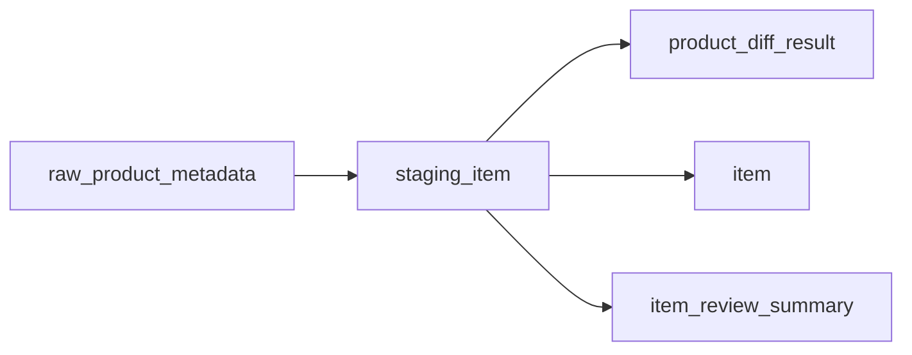
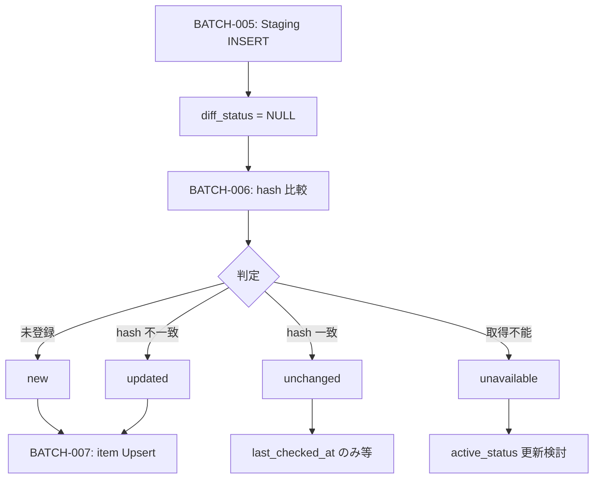

# Staging Item テーブル定義書

## 1. ドキュメント情報

| 項目           | 内容                            |
| -------------- | ------------------------------- |
| ドキュメントID | `DB-TBL-MVP-staging_item`       |
| ドキュメント名 | Staging Item テーブル定義書     |
| 対象システム   | Gift Recommendation Service MVP |
| MVP対象        | `yes`                           |
| 作成日         | 2026-06-14                      |
| 更新日         | 2026-06-14（Human Review #517 反映） |

---

## 2. 概要

`staging_item` は、外部商品データ連携系における **商品 Staging 中間正本** である。

`raw_product_metadata`（Raw Metadata）から BATCH-005（Raw取込・Staging変換）で生成され、正規化済み商品属性と `normalized_hash` を一時保持する。BATCH-006（商品差分判定）・BATCH-007（Item反映）の入力となり、最終的に `item` へ Upsert される。

Staging 系は **物理 FK なし（LOGICAL + Index）**、**成功 Batch 完了後に削除** する一時データ（物理ER §13・§17 No.4）。

---

## 3. 目的

- 楽天 API 由来商品属性を内部正本形式へ変換した **中間行** を batch が管理する
- `raw_product_metadata` → `staging_item` → `item` の昇格フロー中核を物理定義する
- `normalized_hash` / `diff_status` による疑似差分判定の Staging 側入力を提供する
- `item_review_summary` 反映用のレビュー列（`review_average` / `review_count`）を Staging 層で保持する方針を整理する
- 後続 DDL Task が migration を作成できる粒度まで設計を確定する

---

## 4. テーブル基本情報

| 項目 | 内容 |
| ---- | ---- |
| 物理テーブル名 | `staging_item` |
| 論理テーブル名 | Staging Item |
| 分類 | 外部商品データ連携系 |
| 正本区分 | 一時 / 中間 |
| 主な更新主体 | batch（BATCH-005 / BATCH-006 / BATCH-007・`MOD-BATCH-020` Staging Transformer / `MOD-BATCH-022` Staging Repository） |
| 主な参照主体 | batch のみ（Online / api / reco から Direct 参照しない） |
| MVP対象 | `yes` |
| 関連物理ER | `docs/06_実装設計/database/物理ER.md` §8–§11 |

---

## 5. 用途・責務

- **Raw Metadata 単位・商品コード単位** で Staging 行を作成し、BATCH-005 完了時点の正規化商品属性を保持する
- `normalized_hash` を保持し、BATCH-006 で既存 `item.normalized_hash` と比較して `diff_status` / `product_diff_result` を確定する
- BATCH-007 で `source` + `external_item_code` をキーに `item` へ Upsert する **入力正本** となる
- 画像 URL・ランキング・ジャンル Staging は **別テーブル**（`staging_item_image` / `staging_ranking_signal` / `staging_genre`）が担当
- Public API では返却しない（内部 Batch データ）

### 5.1 対象外

- Raw JSON 本体（Object Storage / `raw_product_metadata` の責務）
- Item 正本（`item` の責務）
- 商品画像 URL 集合（`staging_item_image` / `item_image` の責務）
- レビュー要約正本（`item_review_summary` の責務。Staging 列は中間保持のみ）
- 差分判定結果の永続正本（`product_diff_result_テーブル定義書` #526 の責務）
- `api_call_log` / `fetch_cursor` 本体
- Public API 公開
- OpenAPI / generated 変更（Epic 終盤 Task #469 へ委譲）

### 5.2 `raw_product_metadata` → `staging_item` 関係（transforms_to）

`raw_product_metadata_テーブル定義書` §5.5 / §8.2 に従う。

| 観点 | 方針 |
| ---- | ---- |
| データフロー | `fetch_cursor`（任意）→ `api_call_log` → **`raw_product_metadata`** → **`staging_item`**（BATCH-005） |
| 物理ER 関係 | `raw_product_metadata` → `staging_item` : `transforms_to`（**LOGICAL** FK。Staging 系は物理 FK なし） |
| カーディナリティ | 1 Raw Metadata : **N** Staging Item（1 レスポンス内の複数 `itemCode`） |
| 参照列 | `staging_item.raw_metadata_id` → `raw_product_metadata.raw_metadata_id` |
| trace | `raw_metadata_id` / `staging_item_id`（インターフェース一覧 IF-DB-BATCH-005） |
| `source` / `source_api` | **`source` は本テーブルに denormalize**（Upsert キー用）。`source_api` は **`raw_product_metadata.source_api`** 経由で trace（行に持たない） |



### 5.3 `staging_item` → `item` 関係（upserts）

`item_テーブル定義書` §8.2 / §12 に従う。

| 観点 | 方針 |
| ---- | ---- |
| 物理ER 関係 | `staging_item` → `item` : `upserts`（**LOGICAL**） |
| Upsert 自然キー | **`source` + `external_item_code`**（`item.uq_item_source_external_code` と同一体系） |
| カーディナリティ | N Staging 行 : 1 Item（時系列で複数 Staging 行が同一 Item に収束） |
| hash 経路 | `staging_item.normalized_hash` → 比較 → `item.normalized_hash` 更新判定 |
| 反映 Batch | BATCH-007（Item Updater / `MOD-BATCH-024` 等） |
| Online 参照 | **禁止**（Staging は Batch 内部のみ） |

### 5.4 `staging_item` → `product_diff_result` 関係（judged_as）

| 観点 | 方針 |
| ---- | ---- |
| 物理ER 関係 | `staging_item` → `product_diff_result` : `judged_as`（**LOGICAL** 1:0..1） |
| 参照列 | `product_diff_result.staging_item_id` → `staging_item.staging_item_id`（`product_diff_result_テーブル定義書` §5.2 / §8.1） |
| 判定 Batch | BATCH-006（Product Diff Detector / `MOD-BATCH-014`） |
| `diff_status` | Staging 行は **NULL 可**（BATCH-005 時点は未設定）。判定 **正本は `product_diff_result`**。必要なら BATCH-006 で Staging 行も UPDATE（§17.1 No.4 **確定**） |

### 5.5 `staging_item` → `item_review_summary` 反映経路

`item_review_summary_テーブル定義書` §5.6 / §5.7 に従う。

| 観点 | 方針 |
| ---- | ---- |
| データフロー | `staging_item`（BATCH-005）→ `item` Upsert（BATCH-007）→ `item_review_summary`（BATCH-007 / `MOD-BATCH-025`） |
| Staging 列 | `review_average` / `review_count` を **本テーブルに保持**（楽天 `reviewAverage` / `reviewCount` の Staging マッピング） |
| 正本 | レビュー要約の **永続正本は `item_review_summary`**。Staging 列は中間 |

### 5.6 外部商品データ連携設計書 §9.2 との差分整理

| 外部商品データ連携設計書 §9.2 | 本テーブル（MVP 物理 DDL） | 扱い |
| ----------------------------- | -------------------------- | ---- |
| `item_price` | `price` | 論理ER §9.2・`item.price` に合わせ **`price`** |
| `rakuten_genre_id` | `external_genre_id` | 論理ER §9.2・`item.external_genre_id` に合わせ **`external_genre_id`**（`bigint`） |
| `source_api` | （列なし） | **`raw_product_metadata.source_api`** 経由 trace |
| `affiliate_url` | （列なし） | MVP **非保持**（hash 対象任意・外部商品データ連携設計書 §6.4） |
| `image_flag` / `small_image_urls` / `medium_image_urls` | （列なし） | **`staging_item_image`** へ委譲 |
| `rank` / `lastBuildDate` | （列なし） | **`staging_ranking_signal`** へ委譲 |
| `attribute_ids` | （列なし） | MVP **DB 列なし**。正規化 Payload / hash 入力にのみ含める（`item_テーブル定義書` §12.3） |
| `shop_name` | （列なし） | MVP **非保持**（`shop_code` のみ。`item` も `shopName` 非保持） |
| `source`（暗黙） | `source` | Upsert キー用に **明示列として採用**（§17.1 No.2 **確定**） |

### 5.7 `normalized_hash` 責務分担

| 概念 | 正本 / 算出主体 | 用途 |
| ---- | --------------- | ---- |
| `content_hash` | `raw_product_metadata`（BATCH Raw 保存時） | Raw JSON 本体整合性 |
| `normalized_hash` | **`staging_item` / `item`**（batch・BATCH-005 内） | 疑似差分判定・Upsert 更新判定 |
| 算出タイミング | **BATCH-005 Staging 変換完了時**（`MOD-BATCH-012` / `MOD-BATCH-013`） | BATCH-006 は **比較のみ**（§17.1 No.5 **確定**） |
| hash 入力正本 | 外部商品データ連携設計書 §6.4（`item_テーブル定義書` §12.3 と同一） | 画像・レビューは hash 入力に含むが列は子テーブル / Staging レビュー列 |

---

## 6. カラム定義

| No | カラム名 | 論理名 | 型 | 必須 | PK | FK | Unique | Default | 説明 |
| --: | -------- | ------ | -- | ---- | -- | -- | ------ | ------- | ---- |
| 1 | `staging_item_id` | Staging Item ID | `uuid` | `yes` | `yes` | — | `yes` | `gen_random_uuid()` | サロゲート PK。trace キー（IF-DB-BATCH-005） |
| 2 | `raw_metadata_id` | Raw Metadata ID | `uuid` | `yes` | — | LOGICAL | — | — | 生成元 Raw Metadata。`raw_product_metadata.raw_metadata_id` 参照 |
| 3 | `source` | Data Source | `text` | `yes` | — | — | — | `'rakuten'` | 外部 EC ソース。Upsert キー（`item.source` と同一）。`raw_product_metadata.source` から denormalize |
| 4 | `external_item_code` | External Item Code | `text` | `yes` | — | — | — | — | 楽天 `itemCode` |
| 5 | `item_name` | Item Name | `varchar(255)` | `yes` | — | — | — | — | 商品名 |
| 6 | `item_caption` | Item Caption | `text` | `no` | — | — | — | — | 商品説明 |
| 7 | `catchcopy` | Catchcopy | `varchar(500)` | `no` | — | — | — | — | キャッチコピー |
| 8 | `price` | Price | `integer` | `yes` | — | — | — | — | 価格（JPY）。`item.price` へ映射 |
| 9 | `item_url` | Item URL | `text` | `yes` | — | — | — | — | 商品 URL |
| 10 | `external_genre_id` | External Genre ID | `bigint` | `no` | — | LOGICAL | — | — | 楽天 `genreId`。`external_genre.external_genre_id` 論理参照 |
| 11 | `shop_code` | Shop Code | `text` | `no` | — | — | — | — | 楽天 `shopCode` |
| 12 | `availability` | Availability | `smallint` | `no` | — | — | — | — | 楽天 `availability`（0/1）。`item.active_status` 判定入力 |
| 13 | `review_average` | Review Average | `numeric(3,2)` | `no` | — | — | — | — | 楽天 `reviewAverage`。`item_review_summary` 反映用 Staging 保持 |
| 14 | `review_count` | Review Count | `integer` | `no` | — | — | — | — | 楽天 `reviewCount`。0 件可 |
| 15 | `normalized_hash` | Normalized Hash | `varchar(64)` | `yes` | — | — | — | — | 正規化 Payload hash（hex）。差分判定基準 |
| 16 | `diff_status` | Diff Status | `varchar(32)` | `no` | — | — | — | `NULL` | `product_diff_status`。BATCH-006 判定後設定（Staging 保存直後は NULL 可） |
| 17 | `staged_at` | Staged At | `timestamptz` | `yes` | — | — | — | — | Staging 変換完了日時（UTC） |
| 18 | `created_at` | Created At | `timestamptz` | `yes` | — | — | — | `now()` | 行作成日時 |
| 19 | `updated_at` | Updated At | `timestamptz` | `yes` | — | — | — | `now()` | 行最終更新日時 |

> **論理ER §9.2 との差分**: 論理ER §9.2 は Human Review #517 決定（§17.1）に基づき **`source` / `availability` / `review_average` / `review_count` / `staged_at`** を主要属性に含める（`docs/05_アプリケーション設計/アプリ/database/論理ER.md` §9.2 参照）。

---

## 7. 主キー・一意キー

| 種別 | 対象カラム | 方針 | 備考 |
| ---- | ---------- | ---- | ---- |
| PRIMARY KEY | `staging_item_id` | サロゲート UUID | `product_diff_result.staging_item_id` 被参照 |
| UNIQUE | `raw_metadata_id`, `external_item_code` | Raw 1 件あたり同一 `itemCode` は 1 Staging 行 | Human Review #517 **確定**（§17.1 No.1）。BATCH-005 冪等 |

---

## 8. 外部キー・参照関係

### 8.1 参照先（論理）

| カラム | 参照先 | FK制約 | 参照整合性 | 備考 |
| ------ | ------ | ------ | ---------- | ---- |
| `raw_metadata_id` | `raw_product_metadata.raw_metadata_id` | `LOGICAL` | Batch で存在確認 | transforms_to 親 |
| `external_genre_id` | `external_genre.external_genre_id` | `LOGICAL` | Batch で存在確認（未整備 genre は NULL 可） | `item.external_genre_id` と同型 |

### 8.2 被参照（論理）

| 参照元 | 参照列 | 関係 | FK制約 | 備考 |
| ------ | ------ | ---- | ------ | ---- |
| `product_diff_result` | `staging_item_id` | judged_as | `LOGICAL` | `product_diff_result_テーブル定義書` #526 |
| `item` | `source`, `external_item_code` | upserts（間接） | `LOGICAL` | Upsert キー対応。`item_id` は Staging に保持しない |

### 8.3 関連 Staging（同一 Raw 由来）

| テーブル | 紐づけ | 備考 |
| -------- | ------ | ---- |
| `staging_item_image` | `raw_metadata_id` + `external_item_code` | 画像 URL 集合（`staging_item_image_テーブル定義書` #523） |
| `staging_ranking_signal` | 同上 | ランキング由来時（`staging_ranking_signal_テーブル定義書` #524） |
| `staging_genre` | `raw_metadata_id` | ジャンル API 由来時（`staging_genre_テーブル定義書` #525） |

---

## 9. Index

| Index名 | 対象カラム | 種別 | 用途 | 備考 |
| ------- | ---------- | ---- | ---- | ---- |
| `staging_item_pkey` | `staging_item_id` | btree（PK） | 主キー | 自動生成 |
| `uq_staging_item_raw_metadata_code` | `raw_metadata_id`, `external_item_code` | unique btree | BATCH-005 冪等 | §7 |
| `idx_staging_item_raw_metadata` | `raw_metadata_id` | btree | Raw 単位一覧・Retention DELETE 補助 | transforms_to 親 |
| `idx_staging_item_source_code` | `source`, `external_item_code` | btree | BATCH-006/007 の Item 突合 | Upsert キー |
| `idx_staging_item_diff_status` | `diff_status` | btree | 差分判定後の抽出 | nullable 列 |

> 物理ER §10 `staging_item` Index 案と整合（Human Review #517 反映）。

---

## 10. 制約

| 制約名 | 種別 | 対象 | 内容 | 備考 |
| ------ | ---- | ---- | ---- | ---- |
| `staging_item_pkey` | PRIMARY KEY | `staging_item_id` | 主キー | — |
| `uq_staging_item_raw_metadata_code` | UNIQUE | `raw_metadata_id`, `external_item_code` | BATCH-005 冪等 | §7 |
| `chk_staging_item_source_mvp` | CHECK | `source` | `source = 'rakuten'` | MVP 固定 |
| `chk_staging_item_price_non_negative` | CHECK | `price` | `price >= 0` | — |
| `chk_staging_item_review_count` | CHECK | `review_count` | `review_count IS NULL OR review_count >= 0` | — |
| `chk_staging_item_diff_status` | CHECK | `diff_status` | `diff_status IS NULL OR diff_status IN ('new','updated','unchanged','unavailable')` | enum定義書 §6.9 |
| `chk_staging_item_availability` | CHECK | `availability` | `availability IS NULL OR availability IN (0, 1)` | 楽天 API 慣行 |

---

## 11. 状態・enum

| カラム | enum / code | 定義元 | 許容値 | 備考 |
| ------ | ----------- | ------ | ------ | ---- |
| `diff_status` | `product_diff_status` | `enum定義書.md` §6.9 / `packages/code-definitions/state/product_diff_status.yaml` | `new`, `updated`, `unchanged`, `unavailable` | **NULL 可**（BATCH-005 直後）。BATCH-006 で設定 |
| `source` | （code 未定義） | `item.source` 慣行 | MVP: `rakuten` | CHECK |

### 11.1 `diff_status` と Product Diff Result（状態遷移設計書 §6.5）

| 状態 | 意味 | Staging 行への反映 |
| ---- | ---- | ------------------ |
| `new` | 未登録商品 | BATCH-006 後 `diff_status='new'`（任意。正本は `product_diff_result`） |
| `updated` | hash 不一致 | 同上 |
| `unchanged` | hash 一致 | 同上。BATCH-007 は item 業務列更新をスキップ |
| `unavailable` | 取得不能・対象外 | 同上。`item.active_status` 更新検討 |



---

## 12. 更新仕様

| 操作 | 実行主体 | 条件 | 更新項目 | 冪等性 | 備考 |
| ---- | -------- | ---- | -------- | ------ | ---- |
| INSERT | batch | BATCH-005 Staging 変換成功 | 全業務列 + `staged_at` | `(raw_metadata_id, external_item_code)` UNIQUE | IF-DB-BATCH-005 |
| UPDATE | batch | BATCH-006 差分判定完了 | `diff_status`, `updated_at` | `staging_item_id` 指定 | 任意（`product_diff_result` と二重保持） |
| SELECT | batch | BATCH-006 / BATCH-007 | — | — | Item 反映・差分判定 |
| DELETE | batch | Batch 成功完了後 Retention | — | `raw_metadata_id` 単位等 | 物理ER §13 |
| INSERT / UPDATE / DELETE | api / reco / web | — | — | **禁止** | Staging は Batch 専用 |

### 12.1 Staging 保存フロー（BATCH-005）

```text
1. raw_product_metadata（import_status = raw_saved）を読み取り
2. Object Storage から Raw JSON 取得（IF-STG-002）
3. Staging Transformer（MOD-BATCH-020）で外部形式 → 内部列へ映射
4. Normalized Payload Builder / Hash Calculator（MOD-BATCH-012/013）で normalized_hash 算出
5. Staging Validator（MOD-BATCH-021）で必須項目検証
6. staging_item INSERT（+ staging_item_image 等は別テーブル）
7. raw_product_metadata.import_status → staged（raw_product_metadata 定義書 §12）
```

### 12.2 INSERT 疑似コード

```sql
INSERT INTO staging_item (
  raw_metadata_id,
  source,
  external_item_code,
  item_name,
  item_caption,
  catchcopy,
  price,
  item_url,
  external_genre_id,
  shop_code,
  availability,
  review_average,
  review_count,
  normalized_hash,
  staged_at
) VALUES (
  :raw_metadata_id,
  :source,
  :external_item_code,
  :item_name,
  :item_caption,
  :catchcopy,
  :price,
  :item_url,
  :external_genre_id,
  :shop_code,
  :availability,
  :review_average,
  :review_count,
  :normalized_hash,
  :staged_at
)
ON CONFLICT (raw_metadata_id, external_item_code) DO UPDATE SET
  item_name = EXCLUDED.item_name,
  item_caption = EXCLUDED.item_caption,
  catchcopy = EXCLUDED.catchcopy,
  price = EXCLUDED.price,
  item_url = EXCLUDED.item_url,
  external_genre_id = EXCLUDED.external_genre_id,
  shop_code = EXCLUDED.shop_code,
  availability = EXCLUDED.availability,
  review_average = EXCLUDED.review_average,
  review_count = EXCLUDED.review_count,
  normalized_hash = EXCLUDED.normalized_hash,
  diff_status = NULL,
  staged_at = EXCLUDED.staged_at,
  updated_at = now();
```

### 12.3 BATCH-006 差分判定（staging_item 視点）

```text
1. staging_item 行（normalized_hash 保持済み）を読み取り
2. item を source + external_item_code で検索
3. 未存在 → new / 存在 & hash 不一致 → updated / hash 一致 → unchanged / 取得不能 → unavailable
4. product_diff_result INSERT / UPSERT（`product_diff_result_テーブル定義書` §12.1–§12.2）+ 任意で staging_item.diff_status UPDATE
5. unchanged の場合 BATCH-007 は item 業務列を更新せず item.last_checked_at のみ（item 定義書 §12）
```

### 12.4 BATCH-007 Item 反映（staging_item → item 列マッピング）

| staging_item 列 | item 列 | 備考 |
| --------------- | ------- | ---- |
| `source` | `source` | Upsert キー |
| `external_item_code` | `external_item_code` | Upsert キー |
| `item_name` | `item_name` | |
| `item_caption` | `item_caption` | |
| `catchcopy` | `catchcopy` | |
| `price` | `price` | |
| `item_url` | `item_url` | |
| `external_genre_id` | `external_genre_id` | LOGICAL |
| `shop_code` | `shop_code` | |
| `normalized_hash` | `normalized_hash` | hash 変更時のみ item 業務列更新 |
| `availability` | `active_status` / `is_active` | Batch マッピングルール（状態遷移設計書 §7.1） |
| `review_average` | — | `item_review_summary.review_average` へ（BATCH-007 子処理） |
| `review_count` | — | `item_review_summary.review_count` へ |

---

## 13. データ保持・削除

| 観点 | 方針 |
| ---- | ---- |
| 保持期間 | **成功 Batch 完了後即 DELETE** / 失敗・部分成功時 **7〜14 日**（物理ER §13・§17 No.4） |
| 削除方式 | 物理 DELETE |
| 削除条件 | 原則 **`raw_metadata_id` 単位**（Raw Metadata Retention と連動）。`raw_metadata_id` → `api_call_log` → `batch_run_id` 経由の削除も可 |
| 論理削除 | 列なし |
| 履歴 | **保持しない**（Staging 中間のため） |
| アーカイブ | MVP 対象外 |

---

## 14. Migration / DDL

| 項目 | 内容 |
| ---- | ---- |
| DDL対象 | `staging_item` |
| migration単位 | 1 テーブル = 1 migration（DDL Task） |
| 適用順序 | 外部商品データ連携系。**`raw_product_metadata` 作成後**、`staging_item_image` / `product_diff_result` と **並行または先行** 可（LOGICAL FK）。**`item` より前**（Upsert 先だが LOGICAL のため strict 順序不要） |
| rollback方針 | forward migration 主体。DROP は Human Review 必須 |
| 破壊的変更有無 | `no`（初回 CREATE） |

---

## 15. セキュリティ・権限

| 観点 | 方針 |
| ---- | ---- |
| 読み取り権限 | batch（service role 経由）のみ |
| 書き込み権限 | batch のみ。Online / reco / web からの DML 禁止 |
| service role利用 | Staging Repository / Item Updater に限定 |
| 個人情報・機微情報 | 商品公開情報のみ。secret 非含有 |
| ログ出力制限 | 大量商品属性を application log に過剰出力しない |

---

## 16. テスト観点

| No | 観点 | 確認内容 | 種別 |
| --: | ---- | -------- | ---- |
| 1 | DDL適用 | CREATE TABLE / Index / CHECK / UNIQUE が定義どおり | migration |
| 2 | 冪等 Upsert | 同一 `(raw_metadata_id, external_item_code)` 再 INSERT が UPDATE になる | migration |
| 3 | enum整合 | `diff_status` NULL 可 + 4 値 CHECK | migration |
| 4 | transforms_to | `raw_metadata_id` 不存在時 Batch が拒否（アプリ validation） | integration |
| 5 | 差分判定 | BATCH-006 相当で unchanged 時 item 業務列 no-op | integration |
| 6 | Retention | 成功 Batch 後 DELETE が `raw_metadata_id` 単位で実行可能 | integration |
| 7 | 権限 | web client から Direct DB アクセス不可 | manual |

---

## 17. 未決事項

| No | 論点 | 判断が必要な理由 | 判断者 | 期限 | 備考 |
| --: | ---- | ---------------- | ------ | ---- | ---- |
| — | — | — | — | — | Human Review #517 にて No.1〜5 を決定済み（下記参照） |

### 17.1 Human Review 決定事項（Issue #517）

| No | 論点 | 決定内容 | 決定者 | 備考 |
| --: | ---- | -------- | ------ | ---- |
| 1 | UNIQUE キー | **`(raw_metadata_id, external_item_code)`** を MVP 必須とする。同一 Raw 内の itemCode 重複を防止 | Human | §7・§12.2 ON CONFLICT |
| 2 | `source` 列 | **採用**。`raw_product_metadata.source` を Staging INSERT 時にコピー。Upsert キーを item と一致 | Human | §6 No.3 |
| 3 | レビュー列 | **採用**。`review_average` / `review_count` を Staging に保持し BATCH-007 で `item_review_summary` へ | Human | `item_review_summary_テーブル定義書` §5.7 |
| 4 | `diff_status` | **Staging 行は NULL 可**。判定正本は `product_diff_result` を優先。必要なら BATCH-006 で Staging 行も UPDATE | Human | enum定義書「Staging 段階での判定」 |
| 5 | hash 算出タイミング | **BATCH-005 内**（Staging 保存前）に `normalized_hash` を確定。BATCH-006 は比較のみ | Human | 論理ER §9.3 フロー |

---

## 18. 関連資料

| 種別 | パス / URL | 用途 |
| ---- | ---------- | ---- |
| 物理ER | `docs/06_実装設計/database/物理ER.md` | §9 transforms_to / upserts / §13 Retention |
| 論理ER | `docs/05_アプリケーション設計/アプリ/database/論理ER.md` | §9.2 / §9.3 |
| テーブル一覧 | `docs/05_アプリケーション設計/アプリ/database/テーブル一覧.md` | §6 No.20 |
| enum定義書 | `docs/06_実装設計/database/enum定義書.md` | §6.9 product_diff_status |
| 状態遷移設計書 | `docs/05_アプリケーション設計/アプリ/状態遷移設計書.md` | §6.5 Product Diff Result |
| 外部商品連携 | `docs/05_アプリケーション設計/アプリ/外部商品データ連携設計書.md` | §6.3–§6.4 / §9.2 / §7 |
| インターフェース一覧 | `docs/05_アプリケーション設計/アプリ/インターフェース一覧.md` | IF-DB-BATCH-005 |
| バッチ設計方針書 | `docs/05_アプリケーション設計/アプリ/batch/バッチ設計方針書.md` | BATCH-005〜007 |
| 処理構成定義書 | `docs/05_アプリケーション設計/アプリ/処理構成定義書.md` | MOD-BATCH-020〜022 |
| raw_product_metadata 定義書 | `docs/06_実装設計/database/raw_product_metadata_テーブル定義書.md` | §5.5 transforms_to 親 |
| item 定義書 | `docs/06_実装設計/database/item_テーブル定義書.md` | §12 Upsert / hash |
| item_review_summary 定義書 | `docs/06_実装設計/database/item_review_summary_テーブル定義書.md` | §5.6 / §5.7 Staging 反映 |
| external_genre 定義書 | `docs/06_実装設計/database/external_genre_テーブル定義書.md` | external_genre_id 参照 |
| product_diff_status | `packages/code-definitions/state/product_diff_status.yaml` | diff_status 正本 |
| product_diff_result 定義書 | `docs/06_実装設計/database/product_diff_result_テーブル定義書.md` | judged_as 先・BATCH-006 判定正本 |

---

## 19. レビュー観点

- 論理ER §9.2・テーブル一覧 §6 No.20 と矛盾していない（差分は §5.6 で明示）
- 物理ER §9 transforms_to / upserts / judged_as と整合している
- `raw_product_metadata` → `staging_item` → `item` 昇格関係が §5.2 / §5.3 / §12.4 で明記されている
- `normalized_hash` / `diff_status` と BATCH-005〜007 の責務が §5.7 / §11 / §12 で整理されている
- 外部商品データ連携設計書 §9.2 との列差分が §5.6 で整理されている
- Staging 系 **物理 FK なし** 方針が §8 で明記されている
- Retention（物理ER §13）が §13 に反映されている
- `staging_item_image` 本体定義は **`staging_item_image_テーブル定義書`**（#523）へ委譲。本定義書では兄弟紐づけのみ整理
- `product_diff_result` 本体定義は **`product_diff_result_テーブル定義書`**（#526）を正本とし、本定義書では judged_as 関係のみ整理
- apps/** / OpenAPI / generated 変更が含まれていない
- secret や `.env` 実値が含まれていない
- Human Review #517 決定事項（§17.1 No.1〜5）が本文に反映されている
