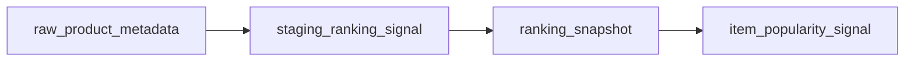

# Staging Ranking Signal テーブル定義書

## 1. ドキュメント情報

| 項目           | 内容                                  |
| -------------- | ------------------------------------- |
| ドキュメントID | `DB-TBL-MVP-staging_ranking_signal`   |
| ドキュメント名 | Staging Ranking Signal テーブル定義書 |
| 対象システム   | Gift Recommendation Service MVP       |
| MVP対象        | `yes`                                 |
| 作成日         | 2026-06-14                            |
| 更新日         | 2026-06-14                            |

---

## 2. 概要

`staging_ranking_signal` は、外部商品データ連携系における **ランキング信号 Staging 中間正本** である。

`raw_product_metadata`（Raw Metadata）から BATCH-005（Raw取込・Staging変換）で生成され、BATCH-002 / IF-DB-BATCH-008 経由で `ranking_snapshot`（ヘッダ）→ `item_popularity_signal`（明細）へ昇格する前段の一時データを保持する。

Staging 系は **物理 FK なし（LOGICAL + Index）**、**成功 Batch 完了後に削除** する一時データ（物理ER §13・§17 No.3 / No.4）。

---

## 3. 目的

- 楽天商品ランキング API 由来の **順位信号**（`rank` + `itemCode` + 観測コンテキスト）を batch が中間保持する
- `raw_product_metadata` → `staging_ranking_signal` → `ranking_snapshot` → `item_popularity_signal` の昇格フロー中核を物理定義する
- `staging_item`（商品属性 Staging）との **責務分離** を明確化する
- 後続 DDL Task が migration を作成できる粒度まで設計を確定する

---

## 4. テーブル基本情報

| 項目 | 内容 |
| ---- | ---- |
| 物理テーブル名 | `staging_ranking_signal` |
| 論理テーブル名 | Staging Ranking Signal |
| 分類 | 外部商品データ連携系 |
| 正本区分 | 一時 / 中間 |
| 主な更新主体 | batch（BATCH-005 作成 / BATCH-002 読取・`MOD-BATCH-020` Staging Transformer / `MOD-BATCH-022` Staging Repository） |
| 主な参照主体 | batch のみ（Online / api / reco から Direct 参照しない） |
| MVP対象 | `yes` |
| 関連物理ER | `docs/06_実装設計/database/物理ER.md` §8–§11 |

---

## 5. 用途・責務

- **Raw Metadata 単位・順位単位** で Staging 行を作成し、BATCH-005 完了時点のランキング信号を保持する
- 同一 API レスポンス内の `genreId` / `period` / `lastBuildDate` を **行単位に冗長保持** し、後続 Snapshot 昇格時のヘッダ get-or-create と明細映射に利用する
- BATCH-002 / IF-DB-BATCH-008 で `ranking_snapshot` ヘッダを get-or-create し、配下 `item_popularity_signal` へ全件反映する **入力正本** となる
- 商品名・価格・URL・画像等の **商品正本属性は保持しない**（`staging_item` / 商品検索 API の責務）
- Public API では返却しない（内部 Batch データ）

### 5.1 対象外

- Raw JSON 本体（Object Storage / `raw_product_metadata` の責務）
- ランキング観測ヘッダ正本（`ranking_snapshot` の責務。#496 merge 済み）
- 人気補助シグナル明細正本（`item_popularity_signal` の責務。#504 merge 済み）
- 商品 Staging 正本（`staging_item` の責務。#517 merge 済み）
- Item / External Genre 正本
- 内部 Popularity スコア算出（`MOD-RECO-017` 実装 Task）
- Public API 公開
- OpenAPI / generated 変更（Epic 終盤 Task #469 へ委譲）

### 5.2 `raw_product_metadata` → `staging_ranking_signal` 関係（transforms_to）

`raw_product_metadata_テーブル定義書` §5.5 / §8.2 に従う。

| 観点 | 方針 |
| ---- | ---- |
| データフロー | `fetch_cursor`（任意）→ `api_call_log` → **`raw_product_metadata`** → **`staging_ranking_signal`**（BATCH-005） |
| 物理ER 関係 | `raw_product_metadata` → `staging_ranking_signal` : `transforms_to`（**LOGICAL** FK。Staging 系は物理 FK なし） |
| カーディナリティ | 1 Raw Metadata : **N** Staging Ranking Signal（1 ランキング API レスポンス内の複数 `rank` 行） |
| 参照列 | `staging_ranking_signal.raw_metadata_id` → `raw_product_metadata.raw_metadata_id` |
| trace | `raw_metadata_id` / `staging_ranking_signal_id`（インターフェース一覧 IF-DB-BATCH-005） |
| `source` / `source_api` | **行に持たない**。`raw_product_metadata.source` / `source_api` 経由で trace（論理ER §9.2・`item_popularity_signal` §5.3 と同型） |



### 5.3 `staging_ranking_signal` → `ranking_snapshot` → `item_popularity_signal` 昇格経路

`ranking_snapshot_テーブル定義書` §5.2 / `item_popularity_signal_テーブル定義書` §5.2 と同一の **2 層 Snapshot 構造** を採用する。

| 観点 | 方針 |
| ---- | ---- |
| Staging 変換 | `raw_product_metadata` → **本テーブル**（BATCH-005 / IF-DB-BATCH-005） |
| 正本反映 | 本テーブル またはランキング API 直接レスポンス → `ranking_snapshot`（ヘッダ get-or-create）→ `item_popularity_signal`（明細全件反映） |
| 反映 Batch | BATCH-002（ランキング Snapshot 反映 / IF-DB-BATCH-008） |
| Staging → 明細物理 FK | **なし**（LOGICAL upserts。物理ER §17 No.3） |
| ヘッダ観測キー | `source` + `external_genre_id` + `period` + `last_build_date`（`ranking_snapshot` 定義書 §7） |
| 明細冪等キー | `ranking_snapshot_id` + `rank`（`item_popularity_signal` 定義書 §7） |
| 論理ER §14.4 との差分 | 論理ERは Staging → `item_popularity_signal` **直接 upserts** を示すが、物理設計では **ヘッダ介在** を採用（本節・昇格先定義書 §5.2） |

#### 5.3.1 昇格時の列マッピング（本テーブル → 正本）

| staging_ranking_signal 列 | ranking_snapshot 列 | item_popularity_signal 列 | 備考 |
| ------------------------- | ------------------- | ------------------------- | ---- |
| （Raw 経由）`source` | `source` | — | ヘッダのみ。`raw_product_metadata.source` から Batch が設定 |
| `external_genre_id` | `external_genre_id` | `external_genre_id` | 冗長列として明細にもコピー |
| `period` | `period` | `period` | 同上 |
| `last_build_date` | `last_build_date` | `last_build_date` | 観測キー構成要素 |
| — | `fetched_at` | `fetched_at` | Batch 反映日時（昇格時に設定） |
| `external_item_code` | — | `external_item_code` | 明細のみ |
| `rank` | — | `rank` | 明細のみ |
| — | — | `item_id` | 昇格時に `item` 解決。未解決時 NULL 可 |

### 5.4 `staging_item` との責務分離（BATCH-005 sibling Staging）

`staging_item_テーブル定義書` §5.6 / §8.3 に従う。

| 観点 | staging_item | staging_ranking_signal（本テーブル） |
| ---- | ------------ | ------------------------------------ |
| 主用途 | 商品属性の Staging 中間正本 | ランキング順位信号の Staging 中間正本 |
| 典型 Raw 由来 | 商品検索 API / 商品詳細系レスポンス | **楽天商品ランキング API** レスポンス |
| 保持する信号 | 名称・価格・URL・hash 等 | **`rank` / `lastBuildDate` / genre / period** |
| 昇格先 | `item`（Upsert） | `ranking_snapshot` → `item_popularity_signal` |
| 紐づけキー | `source` + `external_item_code` | `external_item_code`（Item 解決用）+ `rank`（順位） |
| `rank` / `lastBuildDate` | **列なし**（本テーブルへ委譲） | **保持** |
| 同一 Raw 内共存 | 原則 **排他**（API 種別により Raw が分かれる）。同一 `raw_metadata_id` で商品 Staging とランキング Staging が混在しない | |
| sibling 参照 | §8.3 で本テーブルを関連 Staging として列挙 | `staging_item` / `staging_item_image` / `staging_genre` を sibling として §8.3 で整理 |

> **設計意図**: ランキング API レスポンスは商品正本を含まないため、`staging_item` へ混在させず **専用 Staging テーブル** で保持する（外部商品データ連携設計書 §4.3.4 / §4.3.5）。

### 5.5 楽天ランキング API マッピング

論理ER §8.4 / 外部商品データ連携設計書 §4.3.3 に準拠。

| 楽天ランキング API | 物理カラム | 備考 |
| ------------------ | ---------- | ---- |
| `itemCode` | `external_item_code` | Item 紐づけキー |
| `rank` | `rank` | 人気補助シグナル。BATCH-005 冪等キー構成要素 |
| `genreId`（リクエスト / メタ） | `external_genre_id` | 観測対象ジャンル。`external_genre` LOGICAL 参照 |
| `period`（リクエスト） | `period` | ランキング期間（例: `daily`） |
| `lastBuildDate` | `last_build_date` | ランキング API 更新日時 |
| — | `staged_at` | Staging 変換完了日時（UTC） |
| `itemName` | **反映しない** | `item.item_name` 正本（商品検索 API） |
| `itemPrice` | **反映しない** | `item.price` 正本 |
| `imageUrl` / `smallImageUrls` 等 | **反映しない** | `item_image` 正本 |
| `itemUrl` | **反映しない** | `item.item_url` 正本 |
| `reviewAverage` / `reviewCount` | **反映しない** | `staging_item` / `item_review_summary` 正本 |

### 5.6 未登録 itemCode の扱い

外部商品データ連携設計書 §4.3.5 に従う。

| 観点 | 方針 |
| ---- | ---- |
| Staging 保存 | **ランキング API レスポンスどおり** `external_item_code` + `rank` を保存する |
| Item 未登録 | Staging 段階では **拒否しない**（`item_id` 列は本テーブルに持たない） |
| 後続補完 | BATCH-002 昇格時に `item` 解決。未解決時は `item_popularity_signal.item_id = NULL` + `external_item_code` 保持 |
| 商品正本取得 | ランキング API のみで Item を作成 **しない**。商品検索 API で Fetch Candidate 化（外部商品データ連携設計書 §4.3.5） |

---

## 6. カラム定義

| No | カラム名 | 論理名 | 型 | 必須 | PK | FK | Unique | Default | 説明 |
| --: | -------- | ------ | -- | ---- | -- | -- | ------ | ------- | ---- |
| 1 | `staging_ranking_signal_id` | Staging Ranking Signal ID | `uuid` | `yes` | `yes` | — | `yes` | `gen_random_uuid()` | サロゲート PK。trace キー（IF-DB-BATCH-005） |
| 2 | `raw_metadata_id` | Raw Metadata ID | `uuid` | `yes` | — | LOGICAL | — | — | 生成元 Raw Metadata。`raw_product_metadata.raw_metadata_id` 参照 |
| 3 | `external_item_code` | External Item Code | `text` | `yes` | — | — | — | — | 楽天 `itemCode` |
| 4 | `external_genre_id` | External Genre ID | `bigint` | `yes` | — | LOGICAL | — | — | 楽天 `genreId`。`external_genre.external_genre_id` 論理参照 |
| 5 | `rank` | Rank | `integer` | `yes` | — | — | — | — | 楽天 `rank`（1 始まり想定） |
| 6 | `period` | Ranking Period | `varchar(32)` | `yes` | — | — | — | — | ランキング期間（楽天 API `period`。例: `daily`） |
| 7 | `last_build_date` | Last Build Date | `timestamptz` | `yes` | — | — | — | — | 楽天 `lastBuildDate` |
| 8 | `staged_at` | Staged At | `timestamptz` | `yes` | — | — | — | — | Staging 変換完了日時（UTC） |
| 9 | `created_at` | Created At | `timestamptz` | `yes` | — | — | — | `now()` | 行作成日時 |
| 10 | `updated_at` | Updated At | `timestamptz` | `yes` | — | — | — | `now()` | 行最終更新日時 |

> **論理ER §9.2 との差分**: 論理ER §9.2 の主要属性（`staging_ranking_signal_id` / `raw_metadata_id` / `external_item_code` / `external_genre_id` / `rank` / `period` / `last_build_date` / `staged_at`）と一致。**`source` 列は論理ER §9.2 に未列挙のため MVP 物理 DDL に含めない**（§5.2）。監査用 timestamp として `created_at` / `updated_at` を追加（`staging_item` 同型）。

---

## 7. 主キー・一意キー

| 種別 | 対象カラム | 方針 | 備考 |
| ---- | ---------- | ---- | ---- |
| PRIMARY KEY | `staging_ranking_signal_id` | サロゲート UUID | trace キー |
| UNIQUE | `raw_metadata_id`, `rank` | Raw 1 件あたり同一順位は 1 Staging 行 | **MVP 提案**（§17.1 No.1）。BATCH-005 冪等 |

> 同一 Raw 内で `external_item_code` は `rank` と 1:1 対応するため、`(raw_metadata_id, rank)` と `(raw_metadata_id, external_item_code)` は実質同等。順位軸を明示するため **`rank` を UNIQUE 構成に採用**。

---

## 8. 外部キー・参照関係

### 8.1 参照先（論理）

| カラム | 参照先 | FK制約 | 参照整合性 | 備考 |
| ------ | ------ | ------ | ---------- | ---- |
| `raw_metadata_id` | `raw_product_metadata.raw_metadata_id` | `LOGICAL` | Batch で存在確認 | transforms_to 親 |
| `external_genre_id` | `external_genre.external_genre_id` | `LOGICAL` | Batch で存在確認（未整備 genre は昇格前に解決） | `ranking_snapshot` / `item_popularity_signal` と同型 |

### 8.2 被参照（論理）

| 参照元 | 参照列 | 関係 | FK制約 | 備考 |
| ------ | ------ | ---- | ------ | ---- |
| `item_popularity_signal` | （間接）`external_item_code`, `rank`, 観測コンテキスト | upserts | `LOGICAL` | 物理ER §8。BATCH-002 昇格時に `ranking_snapshot_id` 配下へ反映 |
| `ranking_snapshot` | （間接）観測キー列 | get-or-create | `LOGICAL` | ヘッダは Staging 行集合から集約 |

### 8.3 関連 Staging（同一 Raw 由来・別 Task / sibling）

| テーブル | 紐づけ | 備考 |
| -------- | ------ | ---- |
| `staging_item` | `raw_metadata_id` + `external_item_code`（別 API 由来が原則） | 商品属性 Staging。#517 |
| `staging_item_image` | `raw_metadata_id` + `external_item_code` | 画像 Staging |
| `staging_genre` | `raw_metadata_id` | ジャンル API 由来 |

---

## 9. Index

| Index名 | 対象カラム | 種別 | 用途 | 備考 |
| ------- | ---------- | ---- | ---- | ---- |
| `staging_ranking_signal_pkey` | `staging_ranking_signal_id` | btree（PK） | 主キー | 自動生成 |
| `uq_staging_ranking_signal_raw_metadata_rank` | `raw_metadata_id`, `rank` | unique btree | BATCH-005 冪等 | §7 |
| `idx_staging_ranking_signal_raw_metadata` | `raw_metadata_id` | btree | Raw 単位一覧・Retention DELETE 補助 | transforms_to 親 |
| `idx_staging_ranking_signal_item_code` | `external_item_code` | btree | BATCH-002 昇格時の Item 突合 | nullable なし |
| `idx_staging_ranking_signal_observation` | `external_genre_id`, `period`, `last_build_date` | btree | 観測コンテキスト単位の Staging 一覧 | 昇格前確認 |

> 物理ER §10 には本テーブル Index 行が未記載。本定義書確定後、物理ER §10 / §11 へ横断反映を別 Task で検討する。

---

## 10. 制約

| 制約名 | 種別 | 対象 | 内容 | 備考 |
| ------ | ---- | ---- | ---- | ---- |
| `staging_ranking_signal_pkey` | PRIMARY KEY | `staging_ranking_signal_id` | 主キー | — |
| `uq_staging_ranking_signal_raw_metadata_rank` | UNIQUE | `raw_metadata_id`, `rank` | BATCH-005 冪等 | §7 |
| `chk_staging_ranking_signal_rank_positive` | CHECK | `rank` | `rank >= 1` | 楽天 API 慣行 |
| `chk_staging_ranking_signal_period_length` | CHECK | `period` | `char_length(period) BETWEEN 1 AND 32` | `ranking_snapshot` 同型 |
| `chk_staging_ranking_signal_genre_non_negative` | CHECK | `external_genre_id` | `external_genre_id >= 0` | 楽天 `genreId` |

---

## 11. 状態・enum

| カラム | enum / code | 定義元 | 許容値 | 備考 |
| ------ | ----------- | ------ | ------ | ---- |
| `period` | （code 未定義） | 楽天ランキング API | 例: `realtime`, `daily`, `weekly`, `monthly` | `ranking_snapshot.period` と同一 varchar 保持 |
| — | — | — | — | **状態カラムなし**（`staging_item.diff_status` 相当は不要） |

---

## 12. 更新仕様

| 操作 | 実行主体 | 条件 | 更新項目 | 冪等性 | 備考 |
| ---- | -------- | ---- | -------- | ------ | ---- |
| INSERT | batch | BATCH-005 Staging 変換成功 | 全業務列 + `staged_at` | `(raw_metadata_id, rank)` UNIQUE | IF-DB-BATCH-005 |
| SELECT | batch | BATCH-002 Snapshot 反映 | — | — | 昇格元として読取 |
| DELETE | batch | Batch 成功完了後 Retention | — | `raw_metadata_id` 単位等 | 物理ER §13 |
| INSERT / UPDATE / DELETE | api / reco / web | — | — | **禁止** | Staging は Batch 専用 |

### 12.1 Staging 保存フロー（BATCH-005）

```text
1. raw_product_metadata（import_status = raw_saved、source_api = item_ranking 等）を読み取り
2. Object Storage から Raw JSON 取得
3. Staging Transformer（MOD-BATCH-020）でランキング API 項目 → 内部列へ映射
4. Staging Validator（MOD-BATCH-021）で必須項目検証
5. staging_ranking_signal INSERT（1 レスポンス = N 行）
6. raw_product_metadata.import_status → staged（raw_product_metadata 定義書 §12）
```

### 12.2 INSERT 疑似コード

```sql
INSERT INTO staging_ranking_signal (
  raw_metadata_id,
  external_item_code,
  external_genre_id,
  rank,
  period,
  last_build_date,
  staged_at
) VALUES (
  :raw_metadata_id,
  :external_item_code,
  :external_genre_id,
  :rank,
  :period,
  :last_build_date,
  :staged_at
)
ON CONFLICT (raw_metadata_id, rank) DO UPDATE SET
  external_item_code = EXCLUDED.external_item_code,
  external_genre_id = EXCLUDED.external_genre_id,
  period = EXCLUDED.period,
  last_build_date = EXCLUDED.last_build_date,
  staged_at = EXCLUDED.staged_at,
  updated_at = now();
```

### 12.3 Snapshot 昇格フロー（BATCH-002 / IF-DB-BATCH-008）

```text
1. staging_ranking_signal 行集合（または API 直接レスポンス）を読み取り
2. 観測キー（source + external_genre_id + period + last_build_date）で ranking_snapshot を get-or-create
3. 各 Staging 行を item_popularity_signal 明細へ映射（ranking_snapshot_id + rank で Upsert）
4. item を source + external_item_code で解決し item_id を設定（未解決時 NULL）
5. 同一 ranking_snapshot_id 配下に存在しなくなった rank 明細の DELETE / 論理削除方針は item_popularity_signal 定義書 §12 参照
6. 成功後 Retention で本テーブル行を DELETE（§13）
```

### 12.4 Staging 行 → 正本列マッピング（昇格）

| staging_ranking_signal | item_popularity_signal | 備考 |
| ---------------------- | ---------------------- | ---- |
| `external_item_code` | `external_item_code` | |
| `rank` | `rank` | 冪等キー |
| `external_genre_id` | `external_genre_id` | 冗長列 |
| `period` | `period` | 冗長列 |
| `last_build_date` | `last_build_date` | 冗長列 |
| — | `ranking_snapshot_id` | ヘッダ FK（昇格時設定） |
| — | `item_id` | Item 解決結果 |
| — | `fetched_at` | 昇格 Batch 反映日時 |

---

## 13. データ保持・削除

| 観点 | 方針 |
| ---- | ---- |
| 保持期間 | **成功 Batch 完了後即 DELETE** / 失敗・部分成功時 **7〜14 日**（物理ER §13・§17 No.4） |
| 削除方式 | 物理 DELETE |
| 削除条件 | 原則 **`raw_metadata_id` 単位**（Raw Metadata Retention と連動）。`raw_metadata_id` → `api_call_log` → `batch_run_id` 経由の削除も可 |
| 論理削除 | 列なし |
| 履歴 | **保持しない**（Staging 中間のため。履歴は `ranking_snapshot` / `item_popularity_signal` 側） |
| アーカイブ | MVP 対象外 |

---

## 14. Migration / DDL

| 項目 | 内容 |
| ---- | ---- |
| DDL対象 | `staging_ranking_signal` |
| migration単位 | 1 テーブル = 1 migration（DDL Task） |
| 適用順序 | 外部商品データ連携系。**`raw_product_metadata` 作成後**。`staging_item` / `staging_item_image` / `staging_genre` と **並行可**（LOGICAL FK）。**`ranking_snapshot` / `item_popularity_signal` より前**（昇格元だが LOGICAL のため strict 順序不要） |
| rollback方針 | forward migration 主体。DROP は Human Review 必須 |
| 破壊的変更有無 | `no`（初回 CREATE） |

---

## 15. セキュリティ・権限

| 観点 | 方針 |
| ---- | ---- |
| 読み取り権限 | batch（service role 経由）のみ |
| 書き込み権限 | batch のみ。Online / reco / web からの DML 禁止 |
| service role利用 | Staging Repository / Ranking Snapshot Writer に限定 |
| 個人情報・機微情報 | 商品公開情報（順位・商品コード）のみ。secret 非含有 |
| ログ出力制限 | 大量 Staging 行を application log に過剰出力しない |

---

## 16. テスト観点

| No | 観点 | 確認内容 | 種別 |
| --: | ---- | -------- | ---- |
| 1 | DDL適用 | CREATE TABLE / Index / CHECK / UNIQUE が定義どおり | migration |
| 2 | 冪等 Upsert | 同一 `(raw_metadata_id, rank)` 再 INSERT が UPDATE になる | migration |
| 3 | transforms_to | `raw_metadata_id` 不存在時 Batch が拒否（アプリ validation） | integration |
| 4 | 昇格映射 | BATCH-002 相当で `ranking_snapshot` + `item_popularity_signal` へ期待列が映射される | integration |
| 5 | 責務分離 | `itemName` 等が Staging 行に含まれない | manual |
| 6 | Retention | 成功 Batch 後 DELETE が `raw_metadata_id` 単位で実行可能 | integration |
| 7 | 権限 | web client から Direct DB アクセス不可 | manual |

---

## 17. 未決事項

| No | 論点 | 判断が必要な理由 | 判断者 | 期限 | 備考 |
| --: | ---- | ---------------- | ------ | ---- | ---- |
| 1 | UNIQUE キー | `(raw_metadata_id, rank)` vs `(raw_metadata_id, external_item_code)` | Human | DDL Task 前 | §17.1 参照 |
| 2 | `source` 列 | `staging_item` は採用、本テーブル論理ER §9.2 は未列挙 | Human | DDL Task 前 | §17.1 参照 |
| 3 | Retention 詳細 | 失敗時 7〜14 日の具体値 | Human | 運用 Task | 物理ER §13 |

### 17.1 Human Review 論点（Issue #524）

| No | 論点 | MVP 提案 | 備考 |
| --: | ---- | -------- | ---- |
| 1 | UNIQUE キー | **`(raw_metadata_id, rank)`** | 1 ランキングレスポンス内で順位は一意。`item_popularity_signal` の `ranking_snapshot_id + rank` と対称 |
| 2 | `source` 列 | **非採用** | 論理ER §9.2 準拠。trace は `raw_product_metadata.source`。昇格時ヘッダ `ranking_snapshot.source` に設定 |
| 3 | 論理ER §14.4 直接 upserts | **物理設計どおりヘッダ介在を採用** | `ranking_snapshot` / `item_popularity_signal` 定義書 §5.2 と整合 |
| 4 | Retention | **物理ER §13 踏襲**（成功後即 DELETE） | `staging_item` §13 と同型 |

---

## 18. 関連資料

| 種別 | パス / URL | 用途 |
| ---- | ---------- | ---- |
| 物理ER | `docs/06_実装設計/database/物理ER.md` | §8 transforms_to / upserts / §13 Retention |
| 論理ER | `docs/05_アプリケーション設計/アプリ/database/論理ER.md` | §8.4 / §9.2 / §14.4 |
| テーブル一覧 | `docs/05_アプリケーション設計/アプリ/database/テーブル一覧.md` | §6 No.22 |
| 外部商品連携 | `docs/05_アプリケーション設計/アプリ/外部商品データ連携設計書.md` | §4.3 / §13 |
| インターフェース一覧 | `docs/05_アプリケーション設計/アプリ/インターフェース一覧.md` | IF-DB-BATCH-005 / IF-DB-BATCH-008 |
| バッチ設計方針書 | `docs/05_アプリケーション設計/アプリ/batch/バッチ設計方針書.md` | BATCH-005 / BATCH-002 |
| 処理構成定義書 | `docs/05_アプリケーション設計/アプリ/処理構成定義書.md` | MOD-BATCH-020〜022 |
| raw_product_metadata 定義書 | `docs/06_実装設計/database/raw_product_metadata_テーブル定義書.md` | §5.5 transforms_to 親 |
| ranking_snapshot 定義書 | `docs/06_実装設計/database/ranking_snapshot_テーブル定義書.md` | §5.2 昇格先ヘッダ |
| item_popularity_signal 定義書 | `docs/06_実装設計/database/item_popularity_signal_テーブル定義書.md` | §5.2 昇格先明細 |
| staging_item 定義書 | `docs/06_実装設計/database/staging_item_テーブル定義書.md` | §5.6 / §8.3 sibling |
| external_genre 定義書 | `docs/06_実装設計/database/external_genre_テーブル定義書.md` | external_genre_id 参照 |

---

## 19. レビュー観点

- 論理ER §9.2・テーブル一覧 §6 No.22 と矛盾していない（差分は §6 脚注で明示）
- 物理ER §8 transforms_to / upserts と整合している
- `raw_product_metadata` → 本テーブル → `ranking_snapshot` → `item_popularity_signal` 昇格経路が §5.2 / §5.3 / §12.3 で明記されている
- `staging_item` との責務分離が §5.4 で明記されている
- 外部商品データ連携設計書 §4.3.4 の非反映項目が §5.5 で整理されている
- Staging 系 **物理 FK なし** 方針が §8 で明記されている
- Retention（物理ER §13）が §13 に反映されている
- 論理ER §14.4 直接 upserts との差分が §5.3 で明示されている
- apps/** / OpenAPI / generated 変更が含まれていない
- secret や `.env` 実値が含まれていない
