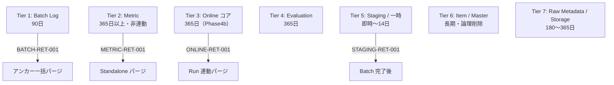

# Gift Recommendation Service MVP データ保持・削除方針書

## 1. ドキュメント情報

| 項目           | 内容                                                         |
| -------------- | ------------------------------------------------------------ |
| ドキュメントID | `DB-RET-POLICY-MVP-001`                                      |
| ドキュメント名 | Gift Recommendation Service MVP データ保持・削除方針書       |
| 対象システム   | Gift Recommendation Service MVP                                |
| MVP対象        | `yes`                                                        |
| 作成日         | 2026-06-17                                                   |
| 更新日         | 2026-06-17                                                   |

---

## 2. 概要

本ドキュメントは、Gift Recommendation Service MVP における **DB および関連ストレージのデータ保持期間・削除条件・削除方式** を横断的に定義する。

Phase2 ③ で各テーブル定義書 §13 に分散記載されていた方針を **本書で正本化** し、Phase4b の purge バッチ（`BATCH-RET-*` / `ONLINE-RET-*` / `METRIC-RET-*` 等）設計の入力とする。

**MVP では自動 purge バッチを実装しない**（`マイグレーション方針書.md` §4 対象外と整合）。本書は運用方針・将来 Batch の仕様正本として機能する。

---

## 3. 目的

- Log / Metric / Online 推薦コア / Evaluation / Staging / Master / Item の保持方針を一箇所に集約する
- 物理 DELETE と論理削除（`is_active` / 状態列）の使い分けを明確にする
- `batch_run_log` をアンカーとする一括パージ（BATCH-RET-001）と、Metric 系の **非連動** 削除を明示する
- Online 推薦コアの具体保持期間（テーブル定義書で「Phase2 ⑥ で確定」とされていた項目）を確定する
- Batch 再実行・冪等性・再現性との関係を整理する
- 個人情報・機微情報・Object Storage との連動方針を定義する

---

## 4. スコープ

| 区分 | 内容 |
| ---- | ---- |
| 対象 | MVP 作成対象 62 テーブル（`テーブル一覧.md` §13）および Raw Product Object（Supabase Storage） |
| 対象（関連） | `phase_log` 統合方針（`recommendation_run_phase_log` 物理テーブルなし） |
| 対象外 | purge バッチの実装コード（Phase4b） |
| 対象外 | partition 設計の詳細（物理ER §17 No.5。本番前検討事項として言及のみ） |
| 対象外 | RLS / 権限の詳細（各テーブル定義書 §15 を正とする） |

---

## 5. 正本関係

| 成果物 | 役割 | 本書との関係 |
| ------ | ---- | ------------ |
| 各 `*_テーブル定義書.md` §13 | テーブル単位の詳細（削除 SQL 例・FK 連動） | 本書が横断正本。矛盾時は **本書 §8 を優先** し、個別定義書は Epic 終盤ゲートで追随修正 |
| `物理ER.md` §13 | テーブル群単位の概要 | 本書で具体化 |
| `テーブル一覧.md` §11 補足 | Log / Metric retention サマリ | 本書 §8 と整合 |
| `ログ・Observability設計書.md` §20 | Retention 候補 | 本書で MVP / Phase4b に落とし込み |
| `マイグレーション方針書.md` | migration / seed 運用 | purge 実装は対象外（§4） |
| `コード定義書.md` | 業務コード定義 | retention ポリシーではない（同書 §11 参照） |
| 本ドキュメント | **保持・削除方針の横断正本** | — |

---

## 6. 削除方式の分類

| 方式 | 定義 | 採用テーブル群 | MVP 自動実行 |
| ---- | ---- | -------------- | ------------ |
| **物理 DELETE** | 行を DB から除去する | Log / Staging / 終端 Queue / Metric（Phase4b） | なし |
| **論理削除（状態列）** | `is_active = false` / `active_status` 変更で無効化 | Master / Config / Semantic 定義 / Evaluation case | 業務操作のみ |
| **Upsert 置換** | 最新状態で上書き。旧行は残さない | Item 正本・外部マスタ | Batch 通常運用 |
| **保持（MVP）** | 期日パージを実施しない | Online コア・Evaluation・Item 正本 | — |

### 6.1 論理削除と物理削除の原則

| 原則 | 内容 |
| ---- | ---- |
| Log 系 | **論理削除を採用しない**（追記型。`error_log` / `phase_log` / `api_call_log` 等） |
| Snapshot 系 | `recommendation_result_item` 等は **UPDATE 不可**。削除は親 Run / Result のパージに連動 |
| Master / Config | **物理 DELETE 原則禁止**。`is_active` または version 追加で無効化 |
| Staging | **物理 DELETE のみ**。中間データのため履歴を残さない |

### 6.2 個人情報・機微情報

| データ | 方針 |
| ------ | ---- |
| ユーザー自由入力（`recommendation_request` の payload 等） | Online コア保持期間に準拠。ログへの全文出力は `ログ・Observability設計書` に従い抑制 |
| LLM prompt 全文 | **原則非保存**（`テーブル一覧.md` §12）。`reason_basis_json` は version 参照のみ |
| Secret / token | DB 非保存。`error_log` / `api_call_log` に実値を含めない（各定義書 §15） |
| Raw JSON 本体 | Object Storage。DB は `raw_product_metadata` の参照メタデータのみ |

---

## 7. Retention Tier 分類



| Tier | 名称 | 代表保持期間 | MVP 自動 DELETE | Phase4b パージ ID |
| ---- | ---- | ------------ | --------------- | ----------------- |
| 1 | Batch Log | **90 日** | なし | `BATCH-RET-001` / `BATCH-RET-002` |
| 2 | Metric | **365 日以上** | なし | `METRIC-RET-001` |
| 3 | Online 推薦コア | **365 日**（本書で確定） | なし | `ONLINE-RET-001` |
| 4 | Evaluation | **365 日** | なし | `EVAL-RET-001`（将来） |
| 5 | Staging / 一時 | 成功後 **即時** / 失敗 **7〜14 日** | なし（Batch 内クリーンアップは可） | `STAGING-RET-001` |
| 6 | Item / Master / Config | **長期**（商品・設定有効期間） | なし | 原則なし（論理削除のみ） |
| 7 | Raw Metadata / Object Storage | DB **365 日** / Storage **90 日**（推奨） | なし | `RAW-RET-001` |

---

## 8. テーブル別保持一覧

### 8.1 Tier 1 — Batch Log（90 日・統一）

Human Review #536 No.10 により Batch 系 Log は **90 日** に統一済み。

| テーブル | 削除基準列 | 保持期間 | 削除方式 | アンカー連動 | 参照定義書 |
| -------- | ---------- | -------- | -------- | ------------ | ---------- |
| `batch_run_log` | `started_at` | 90 日 | 物理 DELETE | **アンカー（最後に削除）** | `batch_run_log_テーブル定義書` §13 |
| `api_call_log` | `requested_at` | 90 日 | 物理 DELETE | BATCH-RET-001 内 **順序 1** | `api_call_log_テーブル定義書` §13 |
| `item_import_summary` | `summarized_at` | 90 日 | 物理 DELETE | BATCH-RET-001 内 **順序 3** | `item_import_summary_テーブル定義書` §13 |
| `error_log` | `occurred_at` | 90 日 | 物理 DELETE | BATCH-RET-001 内 **順序 4** + Standalone（BATCH-RET-002） | `error_log_テーブル定義書` §13 |
| `phase_log` | `created_at` | 90 日 | 物理 DELETE | BATCH-RET-001 内 **順序 5** + Standalone | `phase_log_テーブル定義書` §13 |
| `product_diff_result` | Batch 完了基準 | 成功後短期 / 失敗 7〜14 日 | 物理 DELETE | Staging と連動 | `product_diff_result_テーブル定義書` §13 |

#### 8.1.1 BATCH-RET-001 — Batch Run アンカー一括パージ

`batch_run_log.started_at < now() - interval '90 days'` の Run を対象に、下流を **子 → 親** で物理 DELETE してからアンカー行を削除する。

| 順序 | テーブル | 条件 |
| --: | -------- | ---- |
| 1 | `api_call_log` | `batch_run_id` 一致 |
| 2 | `product_diff_result` | `batch_run_id` 一致（該当 workflow 時） |
| 3 | `item_import_summary` | `batch_run_id` 一致 |
| 4 | `error_log` | `owner_type = batch_run` かつ `owner_id = batch_run_id`（§13.2 参照） |
| 5 | `phase_log` | `owner_type = batch_run` かつ `owner_id = batch_run_id` |
| 6 | `batch_run_log` | アンカー行 |

> **Metric 系は本パージ対象外**（§8.2）。親 `batch_run_log` 削除後も Metric 行は残存し、`batch_run_id` dangling を許容する（#556 / #557 Human Review）。

#### 8.1.2 BATCH-RET-002 — Standalone error_log パージ

Batch Run に紐づかない `error_log`（`owner_type` が batch 以外、または owner 不明）を `occurred_at` 基準 **90 日** で個別 DELETE する。

---

### 8.2 Tier 2 — Metric（365 日以上・batch_run_log 非連動）

| テーブル | 削除基準列 | 保持期間 | 削除方式 | batch_run_log 連動 | 更新主体（MVP） |
| -------- | ---------- | -------- | -------- | ------------------ | --------------- |
| `feature_distribution_metric` | `calculated_at` | **365 日以上** | 物理 DELETE（Phase4b） | **非連動** | batch のみ |
| `meaning_distribution_metric` | `calculated_at` | **365 日以上** | 物理 DELETE（Phase4b） | **非連動** | batch |
| `normalization_distribution_metric` | `calculated_at` | **365 日以上** | 物理 DELETE（Phase4b） | **非連動** | batch |
| `reco_score_distribution_metric` | `calculated_at` | **365 日以上** | 物理 DELETE（Phase4b） | **非連動**（Online Run 連動は §8.3.2） | reco のみ |

#### 8.2.1 METRIC-RET-001 — Metric Standalone パージ

```sql
-- 方針例（Phase4b 実装。MVP では実行しない）
DELETE FROM feature_distribution_metric
 WHERE calculated_at < now() - interval '365 days';
-- meaning / normalization / reco_score も同型（calculated_at 基準）
```

運用で **365〜730 日** に調整可。具体日数は容量監視後に Human Review で確定する。

---

### 8.3 Tier 3 — Online 推薦コア（365 日・本書で確定）

テーブル定義書では「180 日〜365 日」「Phase2 ⑥ で一括確定」とされていた項目を、Observability 設計書 §20.2 および `recommendation_feedback` の暫定値（≥ Result）を踏まえ、**365 日** に統一する。

| 原則 | 内容 |
| ---- | ---- |
| MVP | **自動 DELETE なし**（#537 / #543 / #544 等 Human Review 決定を踏襲） |
| Phase4b 目標 | **365 日** を Online コア横断の保持期間とする |
| Feedback | **Feedback 保持期間 ≥ Result 保持期間**（同一 365 日で充足） |
| 再現性 | Snapshot 列は削除前にアーカイブしない（MVP）。将来 Archive は別 Task |

| テーブル | 削除基準列 | 保持期間 | MVP DELETE | Phase4b パージ |
| -------- | ---------- | -------- | ---------- | -------------- |
| `recommendation_request` | `created_at` | **365 日** | なし | 孤児 Request のみ（§8.3.1） |
| `recommendation_run` | `started_at` | **365 日** | なし | ONLINE-RET-001 アンカー |
| `recommendation_result` | 親 Run に追随 | **365 日** | なし | Run 連動 |
| `recommendation_result_item` | 親 Result に追随 | **365 日** | なし | Run 連動 |
| `recommendation_reason` | 親 Result に追随 | **365 日** | なし | Run 連動 |
| `recommendation_feedback` | `created_at` | **365 日** | なし | Run / Result 連動 |
| `user_semantic` | 親 Run に追随 | **365 日** | なし | Run 連動 |
| `user_feature` | 親 Run に追随 | **365 日** | なし | Run 連動 |
| `user_meaning` | 親 Run に追随 | **365 日** | なし | Run 連動（FK RESTRICT 考慮） |

#### 8.3.1 ONLINE-RET-001 — Online Run 連動パージ（Phase4b）

`recommendation_run.started_at < now() - interval '365 days'` の Run を対象に、子 → 親で削除する。

| 順序 | テーブル | 備考 |
| --: | -------- | ---- |
| 1 | `reco_score_distribution_metric` | `recommendation_run_id` 一致 |
| 2 | `recommendation_feedback` | Run / Result 経由 |
| 3 | `recommendation_reason` | Result 経由 |
| 4 | `recommendation_result_item` | Result 経由 |
| 5 | `recommendation_result` | Run 経由 |
| 6 | `user_semantic` / `user_feature` / `user_meaning` | `recommendation_run_id` 一致 |
| 7 | `phase_log` | `owner_type` が recommendation 系かつ該当 `owner_id` |
| 8 | `error_log` | 該当 Run を owner とする行 |
| 9 | `recommendation_run` | アンカー |
| 10 | `recommendation_request` | **紐づく Run がすべて削除された Request のみ** |

> `evaluation_result.recommendation_result_id` が参照する Result を削除する場合は、Evaluation 側の参照整合を `EVAL-RET-001` または論理 FK の NULL 化方針で事前に確認する（§8.4）。

#### 8.3.2 reco_score_distribution_metric と Online コア

Metric テーブルは §8.2 の Standalone パージ（365 日）を基本とする。Run 単位パージ（§8.3.1 順序 1）は **Run 削除時の整合** 用とし、日次 Standalone より先に Run が消えても Metric 単独保持は §8.2 の非連動原則と矛盾しない（Run 削除後の dangling は許容しない方針：Run パージ時に当該 Metric も削除）。

---

### 8.4 Tier 4 — Evaluation（365 日）

| テーブル | 削除基準列 | 保持期間 | MVP DELETE | 論理削除 |
| -------- | ---------- | -------- | ---------- | -------- |
| `evaluation_dataset` | `created_at` | **365 日** | なし | `is_active = false` で無効化 |
| `evaluation_case` | 親 Dataset に追随 | **365 日** | なし | `is_active = false` |
| `evaluation_run` | `created_at` | **365 日** | なし | — |
| `evaluation_result` | `created_at` | **365 日** | なし | — |
| `evaluation_metric` | `created_at` | **365 日** | なし | — |

日常運用では Dataset / Case の **論理無効化** を優先し、期日到来前の物理 DELETE は行わない。Phase4b の `EVAL-RET-001` は Dataset をアンカーに **子 → 親** で削除する（FK RESTRICT 順序に注意）。

---

### 8.5 Tier 5 — Staging / 一時 / Queue

| テーブル | 保持期間 | 削除タイミング | 削除方式 |
| -------- | -------- | -------------- | -------- |
| `staging_item` | 成功後 **即時** / 失敗 **7〜14 日** | Batch 成功完了後、または `raw_metadata_id` / `batch_run_id` 単位 | 物理 DELETE |
| `staging_item_image` | 同上 | 同上 | 物理 DELETE |
| `staging_ranking_signal` | 同上 | 同上 | 物理 DELETE |
| `staging_genre` | 同上 | 同上 | 物理 DELETE |
| `staging_attribute` | 同上（MVP△） | 同上 | 物理 DELETE |
| `item_generation_queue`（終端行） | `succeeded`/`skipped`: **14 日** / `failed`: **30 日** | `completed_at` 基準 | 物理 DELETE |
| `item_generation_queue`（active） | **削除しない** | `queued` / `processing` は滞留監視 | — |

#### 8.5.1 STAGING-RET-001

- **成功パス**: Item 反映 Batch 正常終端後、当該 `raw_metadata_id` または `batch_run_id` に紐づく Staging 行を **同一トランザクションまたは直後のメンテナンス Step** で DELETE する。
- **失敗パス**: `batch_run_log.started_at` から **7 日**（推奨。上限 **14 日**）を経過した失敗 Run に紐づく Staging を DELETE する。調査用に 7〜14 の範囲は運用開始後に確定可。

---

### 8.6 Tier 6 — Item / Master / Config / Semantic 定義

| 区分 | 保持方針 | 削除方式 | 備考 |
| ---- | -------- | -------- | ---- |
| Item 正本（`item` / `item_image` / `item_review_summary` 等） | 商品有効期間中 | Upsert / `active_status` 論理無効化 | 物理 DELETE 原則禁止 |
| Item 派生（`item_feature` / `item_embedding` / `item_semantic` / `item_meaning` 等） | 親 Item + version 有効期間 | Upsert。履歴 version 行は保持 | 入力 hash 変更で再生成 |
| 外部マスタ（`external_genre` / `external_attribute`） | 長期 | Upsert 正本。物理 DELETE 禁止 | |
| Master（`relationship_master` / `occasion_master` / `pair_master`） | 長期 | `is_active = false` | |
| Semantic / Config 定義群 | 長期（再現性） | version 追加。`is_active` / `is_current` | 物理 DELETE 禁止 |
| `ranking_config` / `model_version` / `feature_normalization_version` / `semantic_config_version` | 長期 | 同上 | |
| `fetch_cursor` | 長期 | Upsert 更新 | 走査再開のため削除しない |
| `ranking_snapshot` / `item_popularity_signal` | 長期（分析・Popularity 正本） | Upsert / 追加 | 期日パージは MVP 対象外 |

---

### 8.7 Tier 7 — Raw Metadata / Object Storage

| 対象 | 保持期間 | 削除方式 | 連動 |
| ---- | -------- | -------- | ---- |
| `raw_product_metadata`（DB 行） | **365 日**（本書で確定。旧候補 180〜365 日の上限採用） | 物理 DELETE | Staging より長期保持 |
| Raw Product Object（Storage） | **90 日**（推奨 lifecycle） | Storage lifecycle / 明示 DELETE | DB メタデータ削除前にオブジェクト削除可否を確認 |

#### 8.7.1 RAW-RET-001

- 条件: `import_status` が終端（`imported` / `skipped` / `failed`）かつ `fetched_at`（または `created_at`）から **365 日** 経過
- Staging は §8.5 により先に削除済みであること
- Storage オブジェクトは DB 行より短い **90 日** lifecycle を推奨（コスト優先）。再処理要件が発生した場合は Human Review で延長

---

## 9. Batch 再実行との関係

| 観点 | 方針 |
| ---- | ---- |
| 冪等性 | purge は **期日経過行のみ** 対象とし、進行中 Batch / Run / Queue active 行には触れない |
| 再実行 | Staging / `product_diff_result` を削除した後でも、Raw Metadata / 外部 API 再取得で再実行可能（取込設計に依存） |
| Metric 再集計 | Metric 行削除後は当該期間の分布統計は **再集計不可**。個別 Item 正本が残っていれば別途 Batch 再集計を検討 |
| Online 再現性 | Run 削除後は当該 Request 条件での **完全再現は不可**（Snapshot 消滅）。365 日は分析・Feedback 用途の下限 |

---

## 10. MVP と Phase4b の境界

| 項目 | MVP | Phase4b |
| ---- | --- | ------- |
| 自動 purge バッチ | **実装しない** | `BATCH-RET-*` / `ONLINE-RET-*` / `METRIC-RET-*` / `STAGING-RET-*` / `RAW-RET-*` を実装 |
| Staging 成功後 DELETE | Batch ワークフロー内の **同期 DELETE** は可 | 同左 + 失敗時スケジュール |
| partition | 未適用（`created_at` Index + DELETE） | 本番前に `phase_log` / `api_call_log` 等で range partition 検討 |
| Archive | 対象外 | Object Storage / 別 DB への退避は将来検討 |
| 監視 | テーブルサイズ・行数の手動確認 | 閾値アラート + 定期パージ |

---

## 11. 索引・パーティションとの関係

| 観点 | 方針 |
| ---- | ---- |
| Retention DELETE 用 Index | 各テーブル定義書 §9 の `idx_*_created` / `idx_*_occurred` / `idx_*_calculated_at` を利用 |
| partition | MVP 未適用。行数増加後、`phase_log` / `api_call_log` / `batch_run_log` で **月次 range partition** を第一候補とする（物理ER §17 No.5） |
| vacuum | 大量 DELETE 後は `VACUUM (ANALYZE)` を運用手順に含める（Phase4b Runbook） |

---

## 12. テーブル一覧 §11 補足との対応

`テーブル一覧.md` §11 の retention 補足は本書 §8 に吸収された。今後の更新は **本書を正** とし、テーブル一覧にはサマリリンクのみ維持する。

| テーブル一覧の記述 | 本書での確定 |
| ------------------ | ------------ |
| Batch 系 Log 90 日 | §8.1（変更なし） |
| Metric 365 日以上・非連動 | §8.2（変更なし） |
| Online コア「物理設計で定義」 | **365 日**（§8.3） |
| `feature_distribution_metric` MVP 更新主体 batch のみ | §8.2（変更なし） |
| `reco_score_distribution_metric` MVP 更新主体 reco のみ | §8.2（変更なし） |

---

## 13. Human Review 観点

| No | 観点 | 推奨 / 確定内容 | 判断者 |
| --: | ---- | --------------- | ------ |
| 1 | Batch Log 90 日統一 | **確定済み**（#536） | Human |
| 2 | Metric と batch_run_log の非連動 | **確定済み**（#556 / #557 / #564） | Human |
| 3 | Online コア具体日数 | **365 日**に統一（§8.3） | Human Review 本 PR |
| 4 | MVP 自動 DELETE なし | **確定**（Online / Evaluation） | Human |
| 5 | Raw Metadata DB 365 日 / Storage 90 日 | 本書案（§8.7） | Human Review 本 PR |
| 6 | Staging 失敗時 7 vs 14 日 | **7 日推奨**（上限 14 日） | Human Review 本 PR |
| 7 | partition 導入タイミング | 本番前ゲート | Human |
| 8 | reco_score Metric の Run 連動削除 | Run パージ時に削除（§8.3.2） | Human Review 本 PR |

---

## 14. 未決事項（Epic 終盤ゲートへ）

| No | 論点 | 理由 | 推奨後続 |
| --: | ---- | ---- | -------- |
| 1 | Metric 保持 365 vs 730 日 | 容量・コスト未実測 | Phase4b 運用開始後に監視 |
| 2 | `reco_score_distribution_metric` MVP△ の go/no-go | Epic 終盤で DDL 含有を再確認 | Epic 終盤ゲート Task |
| 3 | Archive（S3 / 別テーブル）要否 | MVP スコープ外 | Phase4b 以降 |
| 4 | 個別テーブル定義書 §13 との文言差分 | 本書優先で追随修正が必要な場合あり | Epic 終盤整合チェック |

---

## 15. 参照ドキュメント

| ドキュメント | パス |
| ------------ | ---- |
| テーブル一覧 | `docs/05_アプリケーション設計/アプリ/database/テーブル一覧.md` |
| 物理ER | `docs/06_実装設計/database/物理ER.md` |
| ログ・Observability設計書 | `docs/05_アプリケーション設計/アプリ/ログ・Observability設計書.md` |
| マイグレーション方針書 | `docs/06_実装設計/database/マイグレーション方針書.md` |
| コード定義書 | `docs/06_実装設計/database/コード定義書.md` |
| 各テーブル定義書 §13 | `docs/06_実装設計/database/*_テーブル定義書.md` |
| #582 関連ドキュメント反映漏れチェック | Issue #582 / PR #585 |

---

## 16. 変更履歴

| 日付 | 版 | 変更内容 | Issue / PR |
| ---- | -- | -------- | ---------- |
| 2026-06-17 | 1.0 | 初版作成。Tier 分類・62 テーブル横断・Online コア 365 日確定 | #631 |
