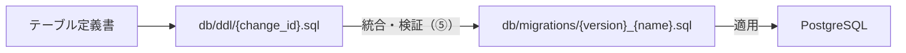
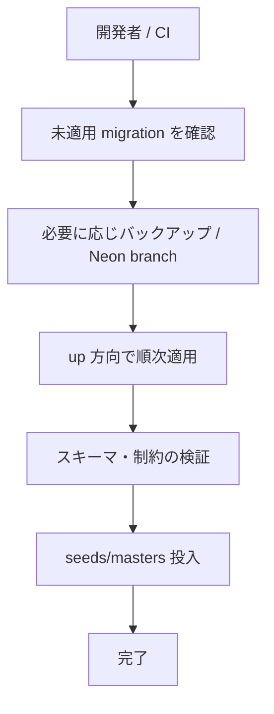

# Gift Recommendation Service MVP マイグレーション方針書

## 1. ドキュメント情報

| 項目           | 内容                                               |
| -------------- | -------------------------------------------------- |
| ドキュメントID | `DB-MIG-POLICY-MVP-001`                            |
| ドキュメント名 | Gift Recommendation Service MVP マイグレーション方針書 |
| 対象システム   | Gift Recommendation Service MVP                    |
| MVP対象        | `yes`                                              |
| 作成日         | 2026-06-16                                         |
| 更新日         | 2026-06-16                                         |

---

## 2. 概要

本ドキュメントは、Gift Recommendation Service MVP における **DB スキーマ変更の管理方針** を定義する。

対象は `db/migrations/`（適用正本）、`db/ddl/`（設計参照用 DDL）、`db/seeds/`（初期データ投入）の配置・命名・適用・ロールバック規約である。

**migration ツールの最終選定は未確定** とし、§6 で候補比較と Human Review 論点を明示する。本書のその他の規約は、ツール選定後も原則維持する。

---

## 3. 目的

- Phase2 ④ DDL / ⑤ migration・seed Task が参照する共通規約を正本化する
- `db/` 配下の役割分担（DDL / migration / seed）を明確にする
- Neon PostgreSQL 上での適用・ロールバック・環境分離の前提を揃える
- CI/CD・デプロイ時の migration 実行責務の土台を提供する

---

## 4. スコープ

| 区分 | 内容 |
| ---- | ---- |
| 対象 | MVP DB スキーマ（PostgreSQL + pgvector）、初期 seed、ローカル開発用 test-data seed |
| 対象外 | 本番データ purge バッチ（Phase4b / データ保持・削除方針書の実装） |
| 対象外 | アプリケーションコード内の ORM migration（採用しない前提） |
| 対象外 | Neon Branch 運用の詳細手順（環境設計方針書・DB構築手順書で補完） |

---

## 5. 正本関係

| 成果物 / ディレクトリ | 役割 | 正本性 | 備考 |
| --------------------- | ---- | ------ | ---- |
| テーブル定義書 | カラム・制約・索引の論理正本 | `docs/06_実装設計/database/*_テーブル定義書.md` | ③ 完了済み |
| `物理ER.md` / `enum定義書.md` / `コード定義書.md` | 構造・enum・業務コードの参照正本 | 同上 `database/` | ② 完了済み |
| `db/ddl/` | **設計・レビュー用 DDL**（1 変更単位） | 参照用。単体で DB に適用しない | ④ Task 成果物 |
| `db/migrations/` | **DB 適用正本**（バージョン管理された変更履歴） | 環境へ適用する SQL の正本 | ⑤ Task 成果物 |
| `db/seeds/` | 初期データ投入 SQL | seed 定義の実行正本 | ⑤ Task 成果物 |
| `初期データ定義書.md` | seed の論理正本（投入順・値の意味） | docs 正本 | ⑤ で作成予定 |
| 本ドキュメント | migration 運用規約の正本 | 本書 | |

### 5.1 DDL と migration の対応



| 観点 | 方針 |
| ---- | ---- |
| 作成順 | ④ で `db/ddl/` を先に作成し、⑤ で `db/migrations/` に統合する |
| 正本 | **環境へ適用するのは `db/migrations/` のみ** とする |
| DDL の用途 | PR レビュー、バッチ単位の差分確認、Epic 終盤整合チェック |
| 重複 | 初期スキーマは `migrations` に 1 本（または up 連番）に集約し、個別 DDL は参照用として残してよい |
| 変更単位 | [成果物一覧×Task Definition化方針書](../../../00_共通/AIエージェント運用/成果物一覧×Task%20Definition化方針書.md) に従い **1 論理変更 = 1 DDL ファイル = 1 Task** |

---

## 6. migration ツール選定（Human Review 必須・未確定）

### 6.1 現状

| 項目 | 状態 |
| ---- | ---- |
| 最終選定 | **未確定**（本 Task では確定しない） |
| 前提 | SQL ファイルベースの migration（[利用技術スタック整理表](../../../05_アプリケーション設計/基盤/利用技術スタック整理表.md) §8.1） |
| RDBMS | PostgreSQL（Neon 想定、[基盤構成設計書](../cross_cutting/基盤構成設計書.md) §5.4） |
| 拡張 | `pgvector`（初期 migration で `CREATE EXTENSION`） |

### 6.2 候補比較

| 候補 | 概要 | メリット | デメリット / 留意 |
| ---- | ---- | -------- | ----------------- |
| **golang-migrate** | CLI + 順序付き up/down SQL | 実績豊富、CI 組み込み容易、up/down 明示 | Go バイナリ依存（CI で install 必要） |
| **dbmate** | 軽量 CLI、timestamp 順 SQL | 導入が簡単、Neon との事例が多い | down は別ファイルまたは手動方針の整理が必要 |
| **psql + 自前スクリプト** | `schema_migrations` テーブル + 番号付き SQL 適用 | 依存最小 | ロールバック・並列適用の実装・運用を自前で担保 |
| **Flyway / Liquibase** | JVM 系 migration 管理 | エンタープライズ向け機能 | MVP では依存・運用が過剰になりやすい |

### 6.3 AI 推奨案（未確定）

Human Review では、次のいずれかを優先検討することを **推奨**する（確定ではない）。

1. **golang-migrate** — up/down を明示し、CI とローカルで同一コマンドを使いやすい
2. **dbmate** — セットアップが軽く、SQL 正本運用と整合しやすい

選定時の判断軸:

- CI（GitHub Actions）での install コスト
- down（ロールバック）の必須度
- Neon の branch / connection pooling との相性
- 開発者のローカル手順の簡潔さ

### 6.4 Human Review で確定すること

- [ ] 採用ツール名とバージョン pin 方針
- [ ] up/down ファイル形式（ツール固有の命名を §7 に反映）
- [ ] CI での migration 検証範囲（lint のみ / ephemeral DB への apply まで）
- [ ] 本番・staging への適用主体（手動 workflow_dispatch / deploy パイプライン連携）

---

## 7. ディレクトリ構成と配置規約

[プロジェクトディレクトリ構成定義書](../../../00_共通/ディレクトリ構成/プロジェクトディレクトリ構成定義書.md) §9 に従う。

```text
db/
├─ migrations/          # 適用正本（バージョン管理）
├─ seeds/
│  ├─ masters/           # マスタ・設定の初期投入
│  └─ test-data/         # ローカル開発・テスト用（任意）
├─ ddl/                  # 設計参照用 DDL（1 変更 = 1 ファイル）
├─ queries/              # 検証・運用 SQL（本 Phase2 では空でも可）
└─ README.md             # ローカル適用手順へのリンク
```

| パス | 配置ルール |
| ---- | ---------- |
| `db/ddl/` | 変更識別子をファイル名に含める（§8.1） |
| `db/migrations/` | 単調増加する version 接頭辞 + 説明（§8.2） |
| `db/seeds/masters/` | テーブルまたは論理グループ単位。投入順は `初期データ定義書.md` に従う |
| `db/seeds/test-data/` | ローカルのみ。本番適用対象外を明記する |

---

## 8. ファイル命名規則

### 8.1 DDL ファイル（`db/ddl/`）

| 項目 | 規約 |
| ---- | ---- |
| 形式 | `{change_id}.sql` |
| change_id | 小文字英数字 + アンダースコア。バッチ ID またはテーブル/変更単位 |
| 例 | `d01_extensions_and_enums.sql`, `item.sql`, `d12_deferred_fk_indexes.sql` |

**推奨バッチ（④ Task 起票の目安）**

| Batch | 区分 | 備考 |
| ----- | ---- | ---- |
| D01 | 拡張・enum 型・共通 | `CREATE EXTENSION vector`、`CREATE TYPE` 等。全テーブルより先 |
| D02 | Semantic / Feature 定義系 | FK 依存の浅い定義系 |
| D03 | Master / Config 系 | |
| D04 | Item 系 | |
| D05 | 外部商品データ連携系 | |
| D06 | Item 派生データ系 | |
| D07 | Online 推薦系 | |
| D08 | User 意味推定系 | |
| D09 | Evaluation 系 | MVP△ テーブル含む場合は Task scope で明示 |
| D10 | Log / Observability 系 | retention は ⑥ で確定。DDL は nullable/索引のみ |
| D11 | Metric 系 | MVP△ 含む |
| D12 | 遅延 FK / 索引追加 | 循環参照回避の後追い |
| D13 | DDL 横断整合チェック | ゲート Task（任意・推奨） |

### 8.2 migration ファイル（`db/migrations/`）

ツール未確定のため、以下は **論理規約** とする。ツール選定後、§6.4 でツール固有の接尾辞（例: `.up.sql`）を追記する。

| 項目 | 規約 |
| ---- | ---- |
| 形式 | `{version}_{snake_case_description}.sql` |
| version | 6 桁ゼロ埋めの連番（`000001` から単調増加） |
| 1 ファイル | **1 論理変更**（DDL Task と対応可能だが、初期スキーマは統合 1 本可） |
| 例 | `000001_initial_schema.sql`, `000002_add_evaluation_indexes.sql` |

初期リリース（MVP）:

- `000001_initial_schema.sql` に D01〜D12 の内容を統合するか、DDL から機械/手動で転記する
- 転記後、DDL と migration の差分がないことを Epic 終盤ゲートで確認する

### 8.3 seed ファイル（`db/seeds/`）

| パス | 形式例 | 備考 |
| ---- | ------ | ---- |
| `masters/` | `{table_or_group}.sql` | `semantic_config.sql`, `relationship_master.sql` |
| `test-data/` | `{scenario}.sql` | 本番非適用。README に明記 |

---

## 9. 環境と接続

| 環境 | 用途 | DB | 適用方針 |
| ---- | ---- | -- | -------- |
| local | 開発者マシン | Docker PostgreSQL または Neon dev branch | migration + seeds（masters + 任意 test-data） |
| develop 相当 | 統合確認 | Neon（develop 用） | migration を明示実行（[CI・CD方針書](../../../05_アプリケーション設計/共通/CI・CD方針書.md) §15.2） |
| staging / production | リリース前・本番 | Neon | 手動承認付き。本書では手順の骨子のみ |

接続は環境変数 `DATABASE_URL` を使用する（値は docs に記載しない、[security.mdc](../../../.cursor/rules/security.mdc)）。

Neon 利用時の留意:

- `CREATE EXTENSION vector` は接続先で許可されていること
- connection pooling（pooler URL）と migration 用 direct URL の使い分けは **DB構築手順書**（P7）で具体化する
- branch 機能を dev 個人環境に使う場合も、適用正本はリポジトリの `db/migrations/` とする

---

## 10. 適用手順（論理フロー）

ツール確定後、同一フローを CLI コマンドに落とし込む。



| ステップ | 内容 |
| -------- | ---- |
| 事前確認 | 対象環境・`DATABASE_URL`・適用対象 commit の migration 一覧を確認 |
| 適用 | version 昇順で **1 回だけ** 適用。途中失敗時は §11 に従う |
| seed | migration 完了後に `masters/` を定義書の順で投入 |
| test-data | ローカルのみ。CI では fixture または別途 test DB 方針 |
| 記録 | PR / デプロイ記録に適用した最大 version を記載 |

ローカル初回構築のコマンド例は、ツール選定後に `db/README.md` に記載する（本 Task ではプレースホルダ可）。

---

## 11. ロールバック方針

| 観点 | 方針 |
| ---- | ---- |
| 基本原則 | **forward-only を基本** とし、down は初期スキーマ期間または明示的な破壊的変更 Task に限定 |
| 1 migration 失敗 | トランザクション内で完結する変更はロールバック。DDL 混在時は手動復旧手順を PR に記載 |
| 本番 | Neon branch / バックアップからのリストアを優先。down の自動実行は原則禁止（Human 承認） |
| データ破壊的変更 | 別 Task・別 migration。バックアップ必須・Human Review 必須 |
| enum / コード値削除 | [enum定義書.md](./enum定義書.md) / [コード定義書.md](./コード定義書.md) の破壊的変更手順に従う |

---

## 12. 変更管理と Task 連携

| ルール | 内容 |
| ------ | ---- |
| 1 変更 = 1 Task | DDL・migration 追加は Issue / Branch / PR を分離（Epic #435 子 Task） |
| PR target | Epic Branch `docs/epic-435-db-physical-design`（Task PR は develop 直向き禁止） |
| レビュー | テーブル定義書・物理 ER との整合、enum/CHECK 制約、FK 順序 |
| MVP△ | `evaluation_*` / 各種 `*_metric` は Task scope で go/no-go。方針書では除外しない |
| 並列 | 同一 migration ファイルの同時編集禁止（[AIエージェント活用型_開発運用フロー設計書](../../../00_共通/AIエージェント運用/AIエージェント活用型_開発運用フロー設計書.md)） |

---

## 13. pgvector と拡張

| 項目 | 方針 |
| ---- | ---- |
| 拡張 | `CREATE EXTENSION IF NOT EXISTS vector;` を D01 / 初期 migration の先頭付近に配置 |
| 型 | `vector` 型カラムは `item_embedding` 等テーブル定義書に従う |
| 索引 | ivfflat 等の索引はデータ投入後 Task または D12 で追加可 |

---

## 14. CI/CD 連携（将来・骨子）

[CI・CD方針書](../../../05_アプリケーション設計/共通/CI・CD方針書.md) に合わせ、以下を Phase4 以降で具体化する。

| タイミング | 想定 |
| ---------- | ---- |
| PR CI | SQL 構文チェック、optional で ephemeral DB への apply |
| develop merge 後 | 統合環境へ migration 明示実行 |
| production deploy | 手動承認後に migration。適用 version をリリース記録に残す |

本 Phase2 では workflow 実装は **out of scope** とする。

---

## 15. 関連ドキュメント

| ドキュメント | 関係 |
| ------------ | ---- |
| [プロジェクトディレクトリ構成定義書](../../../00_共通/ディレクトリ構成/プロジェクトディレクトリ構成定義書.md) §9 | `db/` 配置正本 |
| [基盤構成設計書](../cross_cutting/基盤構成設計書.md) §5.4 | PostgreSQL (Neon) 前提 |
| [利用技術スタック整理表](../../../05_アプリケーション設計/基盤/利用技術スタック整理表.md) §8 | database 技術スタック |
| [実装フェーズ実行プロセス設計書](../../../00_共通/プロジェクト管理/実装フェーズ実行プロセス設計書.md) §6.3 | Phase2 ①〜⑥ 順序 |
| [成果物一覧](../../../00_共通/成果物管理/成果物一覧.md) | マイグレーション方針書・DDL・migration の位置づけ |
| [物理ER.md](./物理ER.md) | テーブル分類・FK 概要 |
| [enum定義書.md](./enum定義書.md) / [コード定義書.md](./コード定義書.md) | CHECK / TYPE の値集合 |

---

## 16. 未確定事項・Human Review 観点

| # | 論点 | 本書の扱い | 判断タイミング |
| - | ---- | ---------- | -------------- |
| 1 | migration ツール選定 | §6 候補比較。未確定 | 本 Task PR の Human Review |
| 2 | Neon pooler / direct URL の使い分け | §9 で骨子のみ | DB構築手順書 Task |
| 3 | 初期スキーマを 1 migration に統合するか DDL 単位で複数にするか | §8.2 で統合 1 本を推奨 | ⑤ 初期 migration Task |
| 4 | MVP△ テーブルの migration 含有 | §12 で Task scope 委譲 | ④⑤ 各 Task / Epic 終盤ゲート |
| 5 | CI での migration apply 自動化 | §14 で将来扱い | Phase4 environment-setup 以降 |

---

## 17. 変更履歴

| 日付 | 変更内容 | 関連 |
| ---- | -------- | ---- |
| 2026-06-16 | 初版作成（Issue #589） | Phase2 ④⑤ 前提 |
