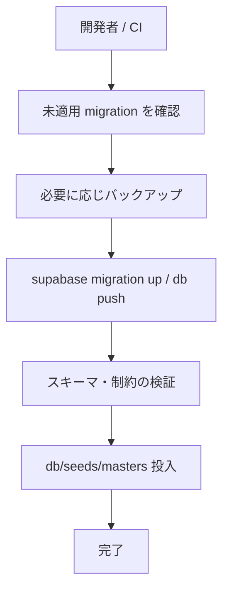

# Gift Recommendation Service MVP マイグレーション方針書

## 1. ドキュメント情報

| 項目           | 内容                                               |
| -------------- | -------------------------------------------------- |
| ドキュメントID | `DB-MIG-POLICY-MVP-001`                            |
| ドキュメント名 | Gift Recommendation Service MVP マイグレーション方針書 |
| 対象システム   | Gift Recommendation Service MVP                    |
| MVP対象        | `yes`                                              |
| 作成日         | 2026-06-16                                         |
| 更新日         | 2026-06-16（Supabase 前提へ更新 #591）             |

---

## 2. 概要

本ドキュメントは、Gift Recommendation Service MVP における **DB スキーマ変更の管理方針** を定義する。

対象は `supabase/migrations/`（適用正本）、`db/ddl/`（設計参照用 DDL）、`db/seeds/`（初期データ投入）、および Supabase Storage（Raw JSON 保存）との連携規約である。

**migration ツールは Supabase CLI に確定**（Human Review 2026-06-16）。ホスティングは **Supabase Hosted PostgreSQL + Supabase Storage** を前提とする。

---

## 3. 目的

- Phase2 ④ DDL / ⑤ migration・seed Task が参照する共通規約を正本化する
- `supabase/` と `db/` の役割分担（migration / DDL / seed）を明確にする
- Supabase（ローカル CLI / 開発用プロジェクト / 本番プロジェクト）上での適用・ロールバック・環境分離の前提を揃える
- CI/CD・デプロイ時の migration 実行責務の土台を提供する

---

## 4. スコープ

| 区分 | 内容 |
| ---- | ---- |
| 対象 | MVP DB スキーマ（Supabase PostgreSQL + pgvector）、初期 seed、ローカル開発用 test-data seed |
| 対象（関連） | Raw JSON 保存先としての Supabase Storage（方針のみ。SDK 実装は Phase4b） |
| 対象外 | 本番データ purge バッチ（Phase4b / データ保持・削除方針書の実装） |
| 対象外 | アプリケーションコード内の ORM migration（採用しない前提） |
| 対象外 | Supabase Auth のアプリ接続（MVP では未接続。§9.1） |
| 対象外 | RLS ポリシー詳細（Phase2 は §9.3 の骨子のみ。Phase4a 以降で具体化） |
| 対象外 | `プロジェクトディレクトリ構成定義書.md` の `db/migrations/` 記述更新（別 Task） |

---

## 5. 正本関係

| 成果物 / ディレクトリ | 役割 | 正本性 | 備考 |
| --------------------- | ---- | ------ | ---- |
| テーブル定義書 | カラム・制約・索引の論理正本 | `docs/06_実装設計/database/*_テーブル定義書.md` | ③ 完了済み |
| `物理ER.md` / `enum定義書.md` / `コード定義書.md` | 構造・enum・業務コードの参照正本 | 同上 `database/` | ② 完了済み |
| `db/ddl/` | **設計・レビュー用 DDL**（1 変更単位） | 参照用。単体で DB に適用しない | ④ Task 成果物 |
| `supabase/migrations/` | **DB 適用正本**（バージョン管理された変更履歴） | 環境へ適用する SQL の正本 | ⑤ Task 成果物 |
| `db/seeds/` | 初期データ投入 SQL（論理配置） | seed 定義の正本 | ⑤ Task 成果物 |
| `初期データ定義書.md` | seed の論理正本（投入順・値の意味） | docs 正本 | ⑤ で作成予定 |
| Supabase Storage | Raw JSON 本体の保存先 | クラウド / ローカル CLI | §9.2 |
| 本ドキュメント | migration 運用規約の正本 | 本書 | |

> `db/migrations/` は本 Phase2 では **使用しない**。適用正本は `supabase/migrations/` とする。ディレクトリ構成定義書との整合は別 Task で更新する。

### 5.1 DDL と migration の対応


| 観点 | 方針 |
| ---- | ---- |
| 作成順 | ④ で `db/ddl/` を先に作成し、⑤ で `supabase/migrations/` に統合する |
| 正本 | **環境へ適用するのは `supabase/migrations/` のみ** とする |
| DDL の用途 | PR レビュー、バッチ単位の差分確認、Epic 終盤整合チェック |
| 重複 | 初期スキーマは migration に 1 本（または連番）に集約し、個別 DDL は参照用として残してよい |
| 変更単位 | [成果物一覧×Task Definition化方針書](../../../00_共通/AIエージェント運用/成果物一覧×Task%20Definition化方針書.md) に従い **1 論理変更 = 1 DDL ファイル = 1 Task** |

---

## 6. migration ツール（確定: Supabase CLI）

### 6.1 確定事項（Human Review 2026-06-16）

| 項目 | 内容 |
| ---- | ---- |
| 採用ツール | **Supabase CLI** |
| 適用正本 | `supabase/migrations/` |
| RDBMS | Supabase Hosted PostgreSQL（[基盤構成設計書](../cross_cutting/基盤構成設計書.md) §5.4 ※横断 docs 更新は別 Task） |
| 拡張 | `pgvector`（初期 migration で `CREATE EXTENSION`） |
| バージョン pin | Phase3 environment-setup Task で CLI バージョンを pin する |

### 6.2 主要コマンド

| 用途 | コマンド | 備考 |
| ---- | -------- | ---- |
| ローカル起動 | `supabase start` | PostgreSQL + pgvector + Storage + Auth（Auth は MVP 未接続） |
| ローカル適用 | `supabase migration up` | 未適用 migration を順次適用 |
| リモート適用 | `supabase db push` | 開発用 / 本番 Supabase プロジェクトへ反映 |
| 新規 migration 作成 | `supabase migration new <name>` | ファイルは `supabase/migrations/` に生成 |
| 停止 | `supabase stop` | ローカルスタック停止 |

ローカルとリモートの詳細手順は Phase3 **DB構築手順書**（P7）および `supabase/README.md` で具体化する。

### 6.3 選定理由（記録）

| 観点 | Supabase CLI 採用の理由 |
| ---- | ------------------------- |
| 環境 parity | ローカル CLI とクラウドプロジェクトで同一 migration フロー |
| Storage 同居 | DB と Storage を同一ベンダーでローカル再現できる |
| 運用単純化 | `db push` / `migration up` で apply 正本が一貫する |

### 6.4 残りの Human / 後続 Task で確定すること

- [x] 採用ツール名（Supabase CLI）
- [x] 適用正本パス（`supabase/migrations/`）
- [ ] CLI バージョン pin（Phase3）
- [ ] CI での migration 検証範囲（lint のみ / `supabase start` + apply まで）
- [ ] 本番への適用主体（手動 workflow_dispatch / deploy パイプライン連携）

---

## 7. ディレクトリ構成と配置規約

[プロジェクトディレクトリ構成定義書](../../../00_共通/ディレクトリ構成/プロジェクトディレクトリ構成定義書.md) §9（`db/`）に加え、本書では `supabase/` を次のとおり扱う。

```text
supabase/
├─ config.toml           # Supabase CLI 設定（後続 Task で実体化）
├─ migrations/           # ★ DB 適用正本
└─ seed.sql              # 任意（db/seeds/ との関係は §8.3）

db/
├─ ddl/                  # 設計参照用 DDL（1 変更 = 1 ファイル）
├─ seeds/
│  ├─ masters/           # マスタ・設定の初期投入 SQL
│  └─ test-data/         # ローカル開発・テスト用（任意）
├─ queries/              # 検証・運用 SQL
└─ README.md
```

| パス | 配置ルール |
| ---- | ---------- |
| `supabase/migrations/` | Supabase CLI 形式の timestamp 付き SQL。単調増加で適用 |
| `db/ddl/` | 変更識別子をファイル名に含める（§8.1） |
| `db/seeds/masters/` | テーブルまたは論理グループ単位。投入順は `初期データ定義書.md` に従う |
| `db/seeds/test-data/` | ローカルのみ。本番適用対象外を明記する |

---

## 8. ファイル命名規則

### 8.1 DDL ファイル（`db/ddl/`）

| 項目 | 規約 |
| ---- | ---- |
| 形式 | `{change_id}.sql` |
| change_id | 小文字英数字 + アンダースコア。バッチ ID またはテーブル/変更単位 |
| 例 | `d01_extensions_and_enums.sql`, `item.sql`, `d12_deferred_fk_indexes.sql` |

**推奨バッチ（④ Task 起票の目安）**

テーブル単位の割当・Issue 進捗の正本は [DDLバッチ分割表.md](./DDLバッチ分割表.md)。

| Batch | 区分 | 備考 |
| ----- | ---- | ---- |
| D01 | 拡張・enum 型・共通 | `CREATE EXTENSION vector`、`CREATE TYPE` 等。全テーブルより先 |
| D02 | Semantic / Feature 定義系 | FK 依存の浅い定義系 |
| D03 | Master / Config 系 | |
| D04 | Item 系 | |
| D05 | 外部商品データ連携系 | |
| D06 | Item 派生データ系 | |
| D07 | Online 推薦系 | |
| D08 | User 意味推定系 | |
| D09 | Evaluation 系 | MVP△ テーブル含む場合は Task scope で明示 |
| D10 | Log / Observability 系 | retention は ⑥ で確定。DDL は nullable/索引のみ |
| D11 | Metric 系 | MVP△ 含む |
| D12 | 遅延 FK / 索引追加 | 循環参照回避の後追い |
| D13 | DDL 横断整合チェック | ゲート Task（任意・推奨） |

### 8.2 migration ファイル（`supabase/migrations/`）

Supabase CLI の慣習に従う。

| 項目 | 規約 |
| ---- | ---- |
| 形式 | `{timestamp}_{snake_case_description}.sql` |
| timestamp | CLI 生成の UTC timestamp（例: `20260616120000`） |
| 1 ファイル | **1 論理変更**（DDL Task と対応可能だが、初期スキーマは統合 1 本可） |
| 例 | `20260616120000_initial_schema.sql` |
| 論理 version | 6 桁連番（`000001` 等）は PR・変更履歴・Epic ゲートで DDL バッチと対応付けて管理 |

初期リリース（MVP）:

- 1 本の migration に D01〜D12 の内容を統合するか、DDL から手動で転記する（**推奨: 統合 1 本**）
- 転記後、DDL と migration の差分がないことを Epic 終盤ゲートで確認する

### 8.3 seed ファイル（`db/seeds/`）

| パス | 形式例 | 備考 |
| ---- | ------ | ---- |
| `masters/` | `{table_or_group}.sql` | `semantic_config.sql`, `relationship_master.sql` |
| `test-data/` | `{scenario}.sql` | 本番非適用。README に明記 |
| `supabase/seed.sql` | 任意 | `db/seeds/` からの集約または symlink 方針は Phase3 で決定 |

投入は `psql` または Supabase CLI の seed 機能を用いる。手順は DB構築手順書で具体化する。

---

## 9. 環境と接続

### 9.0 環境一覧

| 環境 | 用途 | 構成 | migration 適用 |
| ---- | ---- | ---- | -------------- |
| local | 開発者マシン | `supabase start`（PostgreSQL + pgvector + Storage + Auth 起動）+ Redis（Docker） | `supabase migration up` |
| cloud dev | 統合・結合テスト | 開発用 Supabase プロジェクト（Database + Storage） | `supabase db push` または link 後 `migration up` |
| prod | 本番 | 本番 Supabase プロジェクト（Database + Storage） | 手動承認後。Human merge 後に適用 |

接続は環境変数 `DATABASE_URL` を使用する（値は docs に記載しない、[security.mdc](../../../.cursor/rules/security.mdc)）。

Supabase 利用時の留意:

- `CREATE EXTENSION vector` は Supabase PostgreSQL で有効化可能であること
- **migration 適用**は direct / session 接続を用いる（pooler URL は非推奨）
- **アプリクエリ**（api / reco / batch）は pooler 接続可
- server / batch は `service_role` を使用し、client へ露出しない

### 9.1 Supabase Auth（MVP 未接続）

| 項目 | 方針 |
| ---- | ---- |
| ローカル CLI | Auth サービスは起動する（`supabase start` の標準スタック） |
| MVP アプリ | **Supabase Auth には接続しない** |
| DB 窓口 | **api** が Public API 経由の DB アクセス窓口。batch は `service_role` で直接接続 |
| 将来 | 会員登録・ログイン導入時に Supabase Auth 接続を別 Task / Phase で設計 |

[認証・認可方針書](../../../05_アプリケーション設計/基盤/認証・認可方針書.md) の「MVP では会員登録・ログインなし」と整合させる。

### 9.2 Supabase Storage（Raw JSON）

| 項目 | 方針 |
| ---- | ---- |
| 役割 | 外部商品 API レスポンスの Raw JSON 本体保存（旧 S3 / Object Storage 相当） |
| DB 側 | `raw_product_metadata.object_key` 等メタデータのみ DB 保持（テーブル定義書どおり） |
| バケット例 | `raw-products`（環境は Supabase プロジェクト分離で自動分離） |
| 実装 | Phase4b batch。本 Phase2 では IF 方針の正本化のみ |

[インターフェース一覧](../../../05_アプリケーション設計/アプリ/インターフェース一覧.md) §10 Storage IF は Supabase Storage SDK を前提に後続 Task で更新する。

### 9.3 RLS（Row Level Security）

| 項目 | Phase2 方針 |
| ---- | ----------- |
| RLS | **無効**、または **全拒否 + `service_role` のみ実質アクセス** |
| 認可 | **api 層**で制御（認証・認可方針書と一致） |
| 将来 | ユーザー認証（Supabase Auth）導入時に RLS ポリシーを別 Phase で設計 |

---

## 10. 適用手順（論理フロー）



| ステップ | 内容 |
| -------- | ---- |
| 事前確認 | 対象環境・接続 URL・適用対象 commit の migration 一覧を確認 |
| ローカル | `supabase start` → `supabase migration up` |
| リモート | プロジェクト link 後 `supabase db push`（または運用で定めた CI 手順） |
| seed | migration 完了後に `db/seeds/masters/` を定義書の順で投入 |
| test-data | ローカルのみ |
| 記録 | PR / デプロイ記録に適用した最新 migration timestamp を記載 |

ローカル初回構築のコマンド例は `supabase/README.md` および `db/README.md` を参照する。

---

## 11. ロールバック方針

| 観点 | 方針 |
| ---- | ---- |
| 基本原則 | **forward-only を基本**。Supabase CLI の down は初期スキーマ期間または明示 Task に限定 |
| 1 migration 失敗 | トランザクション内で完結する変更はロールバック。DDL 混在時は手動復旧手順を PR に記載 |
| 本番 | Supabase バックアップ / PITR からのリストアを優先。down の自動実行は原則禁止（Human 承認） |
| データ破壊的変更 | 別 Task・別 migration。バックアップ必須・Human Review 必須 |
| enum / コード値削除 | [enum定義書.md](./enum定義書.md) / [コード定義書.md](./コード定義書.md) の破壊的変更手順に従う |

---

## 12. 変更管理と Task 連携

| ルール | 内容 |
| ------ | ---- |
| 1 変更 = 1 Task | DDL・migration 追加は Issue / Branch / PR を分離（Epic #435 子 Task） |
| PR target | Epic Branch `docs/epic-435-db-physical-design`（Task PR は develop 直向き禁止） |
| merge | **Human（`ryo-chan-k6`）のみ**。bot による merge 禁止 |
| レビュー | テーブル定義書・物理 ER との整合、enum/CHECK 制約、FK 順序 |
| MVP△ | `evaluation_*` / 各種 `*_metric` は Task scope で go/no-go |
| 並列 | 同一 migration ファイルの同時編集禁止 |

---

## 13. pgvector と拡張

| 項目 | 方針 |
| ---- | ---- |
| 拡張 | `CREATE EXTENSION IF NOT EXISTS vector;` を D01 / 初期 migration の先頭付近に配置 |
| 型 | `vector` 型カラムは `item_embedding` 等テーブル定義書に従う |
| 索引 | ivfflat 等の索引はデータ投入後 Task または D12 で追加可 |

---

## 14. CI/CD 連携（将来・骨子）

| タイミング | 想定 |
| ---------- | ---- |
| PR CI | SQL 構文チェック、optional で `supabase start` + migration apply |
| develop merge 後 | 開発用 Supabase プロジェクトへ migration 明示実行 |
| production deploy | 手動承認後に migration。適用 timestamp をリリース記録に残す |

本 Phase2 では workflow 実装は **out of scope** とする。

---

## 15. 関連ドキュメント

| ドキュメント | 関係 |
| ------------ | ---- |
| [プロジェクトディレクトリ構成定義書](../../../00_共通/ディレクトリ構成/プロジェクトディレクトリ構成定義書.md) §9 | `db/` 配置（`supabase/` 更新は別 Task） |
| [基盤構成設計書](../cross_cutting/基盤構成設計書.md) §5.4 | PostgreSQL 前提（Supabase へ横断更新予定） |
| [認証・認可方針書](../../../05_アプリケーション設計/基盤/認証・認可方針書.md) | Auth 未接続・api 窓口 |
| [利用技術スタック整理表](../../../05_アプリケーション設計/基盤/利用技術スタック整理表.md) §8 | database / Storage 技術スタック |
| [実装フェーズ実行プロセス設計書](../../../00_共通/プロジェクト管理/実装フェーズ実行プロセス設計書.md) §6.3 | Phase2 ①〜⑥ 順序 |
| [成果物一覧](../../../00_共通/成果物管理/成果物一覧.md) | マイグレーション方針書・DDL・migration の位置づけ |
| [物理ER.md](./物理ER.md) | テーブル分類・FK 概要 |
| [enum定義書.md](./enum定義書.md) / [コード定義書.md](./コード定義書.md) | CHECK / TYPE の値集合 |

---

## 16. 未確定事項・Human Review 観点

| # | 論点 | 状態 | 判断タイミング |
| - | ---- | ---- | -------------- |
| 1 | migration ツール | **確定**: Supabase CLI | — |
| 2 | 適用正本パス | **確定**: `supabase/migrations/` | — |
| 3 | pooler / direct URL 詳細 | 骨子のみ（§9） | DB構築手順書 Task |
| 4 | 初期スキーマ統合 | 統合 1 本を推奨 | ⑤ 初期 migration Task |
| 5 | MVP△ テーブル含有 | Task scope 委譲 | ④⑤ / Epic 終盤ゲート |
| 6 | CI migration apply | 将来扱い | Phase3 / Phase4 |
| 7 | ディレクトリ構成定義書の `db/migrations/` | 別 Task で更新 | Task B |

---

## 17. 変更履歴

| 日付 | 変更内容 | 関連 |
| ---- | -------- | ---- |
| 2026-06-16 | 初版作成（Issue #589 / PR #590） | Phase2 ④⑤ 前提 |
| 2026-06-16 | Supabase 前提へ更新（Human Review 確定事項反映） | Issue #591 |
