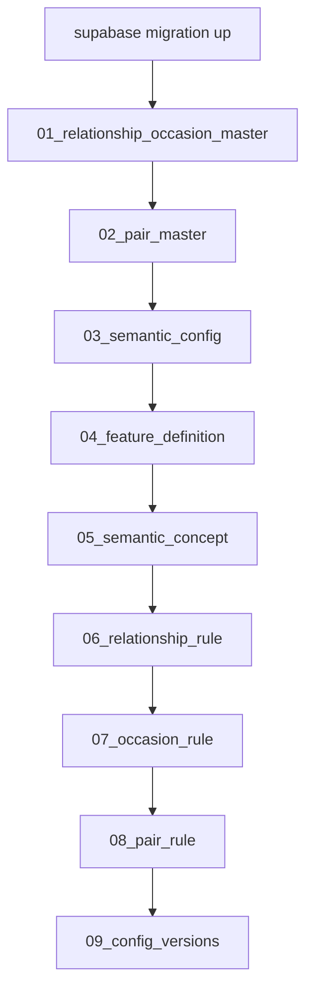

# Gift Recommendation Service MVP 初期データ定義書

## 1. ドキュメント情報

| 項目           | 内容                                               |
| -------------- | -------------------------------------------------- |
| ドキュメントID | `DB-SEED-MVP-001`                                  |
| ドキュメント名 | Gift Recommendation Service MVP 初期データ定義書   |
| 対象システム   | Gift Recommendation Service MVP                    |
| MVP対象        | `yes`                                              |
| 作成日         | 2026-06-17                                         |
| 更新日         | 2026-06-17                                         |

---

## 2. 概要

本ドキュメントは、MVP DB 構築時に投入する **master seed** の論理正本である。

対象は `supabase/seeds/masters/` 配下の SQL および、適用前提となる `supabase/migrations/` の初期スキーマである。投入順・固定 ID・値の意味・正本 docs 参照を定義し、Phase4a `packages/code-definitions` 整備前の docs ブリッジとして機能する。

---

## 3. 目的

- migration 適用後の master seed 投入順と依存関係を正本化する
- Feature / Semantic / Config 系の初期値が参照する docs を明示する
- seed SQL ファイルとテーブル行数の対応を固定する
- ローカル検証・Human Review 時の確認観点を提供する

---

## 4. 正本関係

| 成果物 / パス | 役割 | 正本性 |
| ------------- | ---- | ------ |
| 本ドキュメント | seed の論理正本（投入順・値の意味） | docs 正本 |
| `supabase/migrations/*_initial_schema.sql` | DB スキーマ適用正本 | migration 正本 |
| `supabase/seeds/masters/*.sql` | master 投入 SQL 正本 | seed SQL 正本 |
| `db/ddl/d01..d12` | migration 統合の参照元（Phase2 設計参照。単体適用しない） | 設計参照 |
| [Featureルール定義書](../../04_ドメインモデル設計/Featureルール定義書.md) | Relationship / Occasion / Pair Rule 数値 | ドメイン正本 |
| [Ranking定義書](../../04_ドメインモデル設計/Ranking定義書.md) | `ranking_config.parameter_json` | ドメイン正本 |
| 各 `*_テーブル定義書.md` | 列制約・MVP 行数 | DB 物理正本 |

---

## 5. スコープ

| 区分 | 内容 |
| ---- | ---- |
| 対象 | Master / Config / Semantic 定義系の初期投入 |
| 対象外 | `supabase/seeds/test-data/`（ローカル開発用。Epic C C2） |
| 対象外 | `semantic_rule` / `concept_feature_rule` の完全 seed（MVP は稀疏または後続 Task） |
| 対象外 | `reason_template`（MVP 最小 seed なし。Phase4b 以降） |
| 対象外 | 商品・ユーザー・Run 系トランザクションデータ |

---

## 6. 固定識別子（MVP seed）

冪等 UPSERT とクロスファイル参照のため、以下の UUID / 定数を seed 正本とする。

| 論理名 | 値 | 利用テーブル |
| ------ | -- | ------------ |
| `semantic_config_id` | `a1111111-1111-4111-8111-111111111101` | `semantic_config` |
| `semantic_config_version_id` | `a1111111-1111-4111-8111-111111111102` | `semantic_config_version` 配下全 Rule / Definition |
| `config_name` | `mvp_semantic_config` | `semantic_config` |
| `version_label` | `v1.0.0` | `semantic_config_version` |
| `valid_from` | `2026-06-17 12:00:00+00` | `semantic_config_version` |
| `valid_to` | `9999-12-31 23:59:59+00` | `semantic_config_version` |

---

## 7. 投入順序

FK 依存に従い、ファイル名の昇順で投入する。



| 順 | ファイル | 対象テーブル | 行数（MVP） | 正本参照 |
| -- | -------- | ------------ | ----------- | -------- |
| — | `supabase/migrations/20260617120000_initial_schema.sql` | 全スキーマ | — | `db/ddl/d01..d12` |
| 1 | `01_relationship_occasion_master.sql` | `relationship_master`, `occasion_master` | 12, 15 | Featureルール §5.1 / §7.1 |
| 2 | `02_pair_master.sql` | `pair_master` | 180 | 12 Relationship × 15 Occasion 全組み合わせ |
| 3 | `03_semantic_config.sql` | `semantic_config`, `semantic_config_version` | 1, 1 | semantic_config 定義書 §5.2 |
| 4 | `04_feature_definition.sql` | `feature_definition` | 8 | enum定義書 §6.16 / API-PUB-007 |
| 5 | `05_semantic_concept.sql` | `semantic_concept` | 18 | semantic_concept 定義書 §10.1 |
| 6 | `06_relationship_rule.sql` | `relationship_rule` | 96 | Featureルール §6.2 |
| 7 | `07_occasion_rule.sql` | `occasion_rule` | 120 | Featureルール §8.2 |
| 8 | `08_pair_rule.sql` | `pair_rule` | 112 | Featureルール §9.3（14 Pair × 8 Feature） |
| 9 | `09_config_versions.sql` | `model_version`, `ranking_config`, `feature_normalization_version` | 3, 1, 1 | 各テーブル定義書 §6.1 |

---

## 8. データ定義詳細

### 8.1 Relationship Master（12 件）

[Featureルール定義書 §5.1](../../04_ドメインモデル設計/Featureルール定義書.md) のコード・表示名・`display_order` を転記する。

| relationship_code | relationship_label | display_order |
| ----------------- | ------------------ | ------------- |
| `lover` | 恋人 | 1 |
| `spouse` | 配偶者 | 2 |
| `family_parent` | 親 | 3 |
| `family_child` | 子ども | 4 |
| `family_sibling` | 兄弟姉妹 | 5 |
| `friend_close` | 親しい友人 | 6 |
| `friend_casual` | 友人・知人 | 7 |
| `colleague` | 同僚 | 8 |
| `boss` | 上司 | 9 |
| `subordinate` | 部下・後輩 | 10 |
| `business_partner` | 取引先 | 11 |
| `other` | その他 | 12 |

### 8.2 Occasion Master（15 件）

[Featureルール定義書 §7.1](../../04_ドメインモデル設計/Featureルール定義書.md) を正本とする。物理列名は `occasion_label`（論理ER の `occasion_label_jp` は採用しない）。

### 8.3 Pair Master（180 件）

MVP では **Relationship 12 × Occasion 15 の全組み合わせ** を `is_active = true` で投入する。

- 根拠: `recommendation_run.pair_id` 解決時に任意の Master 組み合わせを許容するため
- `pair_rule` が定義する 14 組み合わせは §8.6 で補正。未定義 Pair は delta = 0（行なし）

### 8.4 Semantic Config / Version

| 項目 | 値 |
| ---- | -- |
| `config_name` | `mvp_semantic_config` |
| `config_description` | MVP default semantic / feature configuration lineage |
| `version_label` | `v1.0.0` |
| `is_current` | `true`（当該 `semantic_config_id` 内で 1 件） |

### 8.5 Feature Definition（8 件）

| feature_code | feature_label | feature_group | display_order |
| ------------ | ------------- | ------------- | ------------- |
| `formality` | 格式 | `social` | 1 |
| `safety` | 安心感 | `social` | 2 |
| `brand_appropriateness` | ブランド適合 | `social` | 3 |
| `emotion` | 感情 | `symbolic` | 4 |
| `novelty` | 新しさ | `symbolic` | 5 |
| `intimacy` | 親密さ | `symbolic` | 6 |
| `symbolic_identity` | 象徴性 | `symbolic` | 7 |
| `story_richness` | ストーリー性 | `symbolic` | 8 |

### 8.6 Semantic Concept（18 件）

[semantic_concept_テーブル定義書 §10.1](./semantic_concept_テーブル定義書.md) の `concept_code` / `concept_label` を転記する。

### 8.7 Relationship / Occasion / Pair Rule

| テーブル | 行数 | 値の正本 |
| -------- | ---- | -------- |
| `relationship_rule` | 96（12×8） | Featureルール §6.2 `feature_base_value` |
| `occasion_rule` | 120（15×8） | Featureルール §8.2 `feature_base_value` |
| `pair_rule` | 112（14×8） | Featureルール §9.3 `feature_delta` |

`pair_rule` は `pair_master` を `relationship_code` + `occasion_code` で JOIN し `pair_id` を解決して投入する。

### 8.8 Model Version（3 件）

| provider | model_name | model_type | version_label | is_current |
| -------- | ---------- | ---------- | ------------- | ---------- |
| `openai` | `text-embedding-3-small` | `embedding` | `v001` | `true` |
| `openai` | `gpt-4o-mini` | `llm` | `v001` | `true` |
| `internal` | `mvp_ranking_v1` | `ranking` | `v001` | `true` |

> secret（API キー等）は seed に含めない。

### 8.9 Ranking Config（1 件）

| config_name | config_version | 正本 |
| ----------- | -------------- | ---- |
| `mvp_ranking_config` | `v001` | Ranking定義書 §6.2 / ranking_config 定義書 §6.1 |

`parameter_json` 初期値:

```json
{
  "ranking_weights": { "context": 0.70, "popularity": 0.20, "risk": 0.10 },
  "lambda_mmr": 0.75,
  "mmr_candidate_limit": 50,
  "top_k_default": 10,
  "diversity_method": "mmr"
}
```

### 8.10 Feature Normalization Version（1 件）

| normalization_method | is_current | parameter_json |
| -------------------- | ---------- | -------------- |
| `sigmoid` | `true` | `{"center_feature": 0.5, "k_feature": 4.0}` |

正本: Featureルール定義書 §14.3 / feature_normalization_version 定義書 §6.1

---

## 9. ローカル適用手順

詳細は [ローカルDB検証手順書](./ローカルDB検証手順書.md) および [supabase/README.md](../../../supabase/README.md) を参照する。

```bash
# フルリセット（migration + master seed）
./scripts/db/reset-local.sh

# または migration 済みで master のみ再投入
./scripts/db/seed-masters.sh
```

正本手順: [DB構築手順書](./DB構築手順書.md) §9。

**一括検証クエリ（行数）:**

```sql
SELECT 'relationship_master' AS t, count(*) FROM relationship_master
UNION ALL SELECT 'occasion_master', count(*) FROM occasion_master
UNION ALL SELECT 'pair_master', count(*) FROM pair_master
UNION ALL SELECT 'relationship_rule', count(*) FROM relationship_rule
UNION ALL SELECT 'occasion_rule', count(*) FROM occasion_rule
UNION ALL SELECT 'pair_rule', count(*) FROM pair_rule;
```

期待値: 12, 15, 180, 96, 120, 112

---

## 10. 冪等性・再投入

- 各 seed ファイルは `BEGIN` / `COMMIT` でトランザクション化する
- Master 系は `ON CONFLICT ... DO UPDATE` で再投入可能
- `feature_normalization_version` は `is_current` 切替後に INSERT（履歴保持）

---

## 11. 関連ドキュメント

| ドキュメント | 関係 |
| ------------ | ---- |
| [マイグレーション方針書](./マイグレーション方針書.md) | migration / seed 配置規約 |
| [コード定義書](./コード定義書.md) | 業務コード（本 seed では Master code を使用） |
| [enum定義書](./enum定義書.md) | `feature_code` 等 |
| [DDLバッチ分割表](./DDLバッチ分割表.md) | migration 統合元 DDL |

---

## 12. 変更履歴

| 日付 | 変更内容 | 関連 |
| ---- | -------- | ---- |
| 2026-06-17 | 初版作成（Issue #627 / #628 / #629） | Phase2 ⑤ migration・seed |
| 2026-06-19 | seed SQL 正本を supabase/seeds/masters へ移行 | Issue #660 |
