# Gift Recommendation Service MVP 物理ER

## 1. ドキュメント情報

| 項目           | 内容                                       |
| -------------- | ------------------------------------------ |
| ドキュメントID | `DB-PHYSICAL-ER-MVP-001`                   |
| ドキュメント名 | Gift Recommendation Service MVP 物理ER     |
| 対象システム   | Gift Recommendation Service MVP            |
| MVP対象        | `yes`                                      |
| 作成日         | 2026-06-06                                 |
| 更新日         | 2026-06-06                                 |

---

## 2. 概要

本ドキュメントは、Gift Recommendation Service MVP における PostgreSQL（Supabase）上の物理ER仕様書である。

論理ER・テーブル一覧・正本定義表を入力とし、MVPで永続化する **62 物理テーブル** の関係、物理設計方針、制約・Index方針、後続テーブル定義書・DDLへの引き継ぎ事項を定義する。

本ドキュメントではカラム型・NULL可否・具体DDLは確定しない。それらは後続 Task（テーブル定義書 / DDL）で定義する。

---

## 3. 目的

- 論理ER上のエンティティを物理テーブルへ落とし込む
- テーブル一覧で定義した 62 テーブルの PK / FK / 多重度 / 正本区分を物理設計レベルで整理する
- Online推薦 / Batch商品連携 / Semantic・Feature / Evaluation / Log・Metric の責務境界をDB設計に反映する
- enum・テーブル定義書・DDL・migration Task の共通前提を提供する

---

## 4. 設計対象

| 項目             | 内容                                                                 |
| ---------------- | -------------------------------------------------------------------- |
| 対象DB           | PostgreSQL（Supabase）                                               |
| 対象スキーマ     | MVPでは同一DB内。論理分割として `app` / `log` / `metric` を想定する  |
| 対象テーブル群   | テーブル一覧 §13 合計 62 テーブル                                    |
| 前提論理ER       | `docs/05_アプリケーション設計/アプリ/database/論理ER.md`             |
| 前提テーブル一覧 | `docs/05_アプリケーション設計/アプリ/database/テーブル一覧.md`       |
| DB方針           | 正本・派生・Snapshot・Log・Metric を用途ごとに分離し、Object Storage上の Raw JSON 本体はDB化しない |

### 4.1 論理ERとの主な差分（物理化判断）

| No | 論点 | 物理設計方針 | 根拠 |
| --: | ---- | ------------ | ---- |
| 1 | `recommendation_run_phase_log` | 物理テーブルとして **作成しない**。`phase_log` に統合する | テーブル一覧 §11 補足 |
| 2 | `ranking_snapshot` | **追加**する。ランキング取得単位のヘッダテーブル | テーブル一覧 §14 No.1 |
| 3 | `pair_master` | **追加**する。Relationship × Occasion の有効組み合わせマスタ | テーブル一覧 §14 No.13 |
| 4 | `item_meaning` | 物理テーブルとして **作成**する | テーブル一覧 §7 |
| 5 | `feature_rule`（論理ER上の抽象名） | `relationship_rule` / `occasion_rule` / `pair_rule` / `concept_feature_rule` / `input_type_rule` / `feature_integration_rule` / `normalization_rule` へ **分解** | テーブル一覧 §8 |
| 6 | `raw_product_object` | DBテーブル化 **しない**（Object Storage 管理） | テーブル一覧 §12 |
| 7 | `feedback_analysis_result` | MVP 62 テーブル対象 **外**（Evaluation 低優先度。必要時は後続 Task 化） | 論理ER §18.2 |

---

## 5. 物理設計方針

| 観点         | 方針 |
| ------------ | ---- |
| 主キー       | 業務エンティティは `uuid`（`gen_random_uuid()`）を基本とする。Log / Metric の大量追記系は `bigint` identity も許容する |
| 外部キー     | Online推薦コアチェーン（Request → Run → Result → Result Item）および Item 派生系は **物理FKを張る**。Batch / Staging / 汎用 Log は性能・運用柔軟性のため **論理FK + Index** を基本とし、Human Review後に物理FK化を検討する |
| unique制約   | テーブル一覧で定義した冪等キー（例: `item_popularity_signal`: `ranking_snapshot_id + rank`）を unique 制約候補とする |
| index        | FK列、状態カラム（`*_status`）、外部参照キー（`external_item_code`, `source`, `semantic_config_version_id` 等）、時系列検索列（`created_at`, `started_at`）に Index を付与する |
| JSON / JSONB | 可変構造・内訳保存（`score_breakdown_json`, `detail_json`, `parameter_json`, `extracted_semantic_json` 等）は JSONB を基本とする。検索キーに使う項目は正規化列として別途保持する |
| timestamp    | `created_at`（NOT NULL）を原則必須とする。更新があるテーブルは `updated_at` を付与する。実行系は `started_at` / `completed_at` / `generated_at` / `fetched_at` を用途に応じて保持する |
| 論理削除     | 原則採用しない。`active_status` / `is_active` / 各種 `*_status` による状態管理を基本とする |
| 履歴管理     | 業務状態の途中経過は `phase_log` / `error_log` に追記する。Snapshot 系（`recommendation_result_item` 等）は上書きしない |
| partition    | MVPでは未適用。`phase_log` / `error_log` / `api_call_log` は保持期間確定後に range partition（月次等）を検討する |
| pgvector     | `item_embedding.embedding_vector` に `vector` 型を使用する。Index は ivfflat または hnsw をデータ量確定後に選定する（後続 DDL Task） |

### 5.1 schema 分割方針（MVP）

| schema  | 配置テーブル群 | 備考 |
| ------- | -------------- | ---- |
| `app`   | Online推薦 / User意味 / Item / 外部連携（Staging除く正本）/ Item派生 / Semantic / Master / Evaluation | 業務データ・設定正本 |
| `log`   | `batch_run_log`, `phase_log`, `error_log`, `api_call_log`, `item_import_summary`, Staging 系, `product_diff_result`, `fetch_cursor` | 追記・一時・実行追跡 |
| `metric`| `feature_distribution_metric`, `meaning_distribution_metric`, `normalization_distribution_metric`, `reco_score_distribution_metric` | 分布監視 |

MVPでは同一DB・同一 Supabase プロジェクト内で schema を分ける。アプリからの search_path は後続 Repository 設計で確定する。

---

## 6. 全体物理ER図

以下は主要テーブル群と関係の概観である。全 62 テーブルの詳細は §8・§9 を正とする。

```mermaid
erDiagram
    recommendation_request ||--o{ recommendation_run : "executes"
    recommendation_run ||--o| recommendation_result : "produces"
    recommendation_request ||--o{ recommendation_result : "has"

    recommendation_run ||--o{ user_semantic : "generates"
    recommendation_run ||--o{ user_feature : "generates"
    recommendation_run ||--o| user_meaning : "generates"

    recommendation_result ||--o{ recommendation_result_item : "contains"
    recommendation_result_item ||--o{ recommendation_reason : "has"
    recommendation_result ||--o{ recommendation_feedback : "receives"
    recommendation_result_item ||--o{ recommendation_feedback : "receives"

    relationship_master ||--o{ recommendation_request : "selected_by"
    occasion_master ||--o{ recommendation_request : "selected_by"
    pair_master ||--o{ recommendation_request : "resolved_to"

    item ||--o{ item_image : "has"
    item ||--o| item_review_summary : "has"
    item ||--o{ item_popularity_signal : "has"
    item ||--o{ item_feature : "has"
    item ||--o{ item_meaning : "has"
    item ||--o{ item_embedding : "has"
    item ||--o{ item_generation_queue : "queued"
    item ||--o{ recommendation_result_item : "snapshotted_by"

    external_genre ||--o{ item : "classifies"
    ranking_snapshot ||--o{ item_popularity_signal : "contains"

    semantic_config ||--o{ semantic_config_version : "has"
    semantic_config_version ||--o{ semantic_concept : "defines"
    semantic_config_version ||--o{ feature_definition : "defines"
    semantic_config_version ||--o{ semantic_rule : "contains"
    semantic_config_version ||--o{ relationship_rule : "contains"
    semantic_config_version ||--o{ occasion_rule : "contains"
    semantic_config_version ||--o{ pair_rule : "contains"
    semantic_config_version ||--o{ concept_feature_rule : "contains"
    semantic_config_version ||--o{ normalization_rule : "contains"

    semantic_config_version ||--o{ recommendation_run : "used_by"
    model_version ||--o{ recommendation_run : "used_by"
    ranking_config ||--o{ recommendation_run : "used_by"
    feature_normalization_version ||--o{ user_feature : "normalizes"
    feature_normalization_version ||--o{ item_feature : "normalizes"

    batch_run_log ||--o{ api_call_log : "has"
    fetch_cursor ||--o{ api_call_log : "controls"
    api_call_log ||--o{ raw_product_metadata : "produces"

    raw_product_metadata ||--o{ staging_item : "transforms_to"
    raw_product_metadata ||--o{ staging_item_image : "transforms_to"
    raw_product_metadata ||--o{ staging_ranking_signal : "transforms_to"
    raw_product_metadata ||--o{ staging_genre : "transforms_to"

    staging_item ||--o| product_diff_result : "judged_as"
    staging_item ||--o| item : "upserts"
    staging_item_image ||--o{ item_image : "upserts"
    staging_ranking_signal ||--o{ item_popularity_signal : "upserts"
    staging_genre ||--o{ external_genre : "upserts"

    batch_run_log ||--o{ item_import_summary : "summarizes"
    batch_run_log ||--o{ phase_log : "records"
    batch_run_log ||--o{ error_log : "may_have"
    recommendation_run ||--o{ phase_log : "records"
    recommendation_run ||--o{ error_log : "may_have"

    evaluation_dataset ||--o{ evaluation_case : "contains"
    evaluation_dataset ||--o{ evaluation_run : "executed_by"
    evaluation_run ||--o{ evaluation_result : "produces"
    evaluation_result ||--o{ evaluation_metric : "has"
```

---

## 7. テーブル分類

| 分類 | 主なテーブル | 位置づけ | MVP対象 |
| ---- | ------------ | -------- | ------- |
| Online推薦系 | `recommendation_request`, `recommendation_run`, `recommendation_result`, `recommendation_result_item`, `recommendation_reason`, `recommendation_feedback` | ユーザー入力・推薦実行・結果・理由・Feedback | `yes` |
| User意味推定系 | `user_semantic`, `user_feature`, `user_meaning` | Online推薦時に reco が生成する派生データ | `yes` |
| Item系 | `item`, `item_image`, `item_review_summary`, `external_genre`, `external_attribute`, `ranking_snapshot`, `item_popularity_signal` | Online推薦で参照する商品正本・補助情報 | `partial`（`external_attribute` は任意） |
| 外部商品データ連携系 | `fetch_cursor`, `api_call_log`, `raw_product_metadata`, `staging_*`, `product_diff_result`, `item_import_summary` | Batch による Raw 参照・Staging・Item 反映 | `partial`（`staging_attribute` は任意） |
| Item派生データ系 | `item_generation_queue`, `item_semantic`, `item_feature`, `item_meaning`, `item_embedding` | Batch 事前生成の推薦用派生データ | `yes` |
| Semantic / Feature定義系 | `semantic_config`, `semantic_config_version`, `semantic_concept`, `feature_definition`, `semantic_rule`, 各種 `*_rule` | 意味・Feature 定義と変換ルール（設定正本） | `partial`（`input_type_rule`, `feature_integration_rule` は任意） |
| Master / Config系 | `relationship_master`, `occasion_master`, `pair_master`, `model_version`, `ranking_config`, `reason_template`, `feature_normalization_version` | 入力マスタ・モデル・Ranking・理由・正規化 version | `yes` |
| Evaluation系 | `evaluation_dataset`, `evaluation_case`, `evaluation_run`, `evaluation_result`, `evaluation_metric` | オフライン評価 | `partial` |
| Log / Observability系 | `batch_run_log`, `phase_log`, `error_log`, 各種 `*_metric` | 実行記録・分布監視 | `partial`（`reco_score_distribution_metric` は任意） |

---

## 8. テーブル一覧

テーブル名の正本は `docs/05_アプリケーション設計/アプリ/database/テーブル一覧.md` とする。

| テーブル名 | 論理名 | 分類 | 正本区分 | 主な更新主体 | MVP対象 |
| ---------- | ------ | ---- | -------- | ------------ | ------- |
| `recommendation_request` | Recommendation Request | Online推薦系 | 内部正本 | api / reco | `yes` |
| `recommendation_run` | Recommendation Run | Online推薦系 | 実行正本 / 状態 | reco | `yes` |
| `recommendation_result` | Recommendation Result | Online推薦系 | 内部正本 | reco | `yes` |
| `recommendation_result_item` | Recommendation Result Item | Online推薦系 | Snapshot / 内部正本 | reco | `yes` |
| `recommendation_reason` | Recommendation Reason | Online推薦系 | 派生Snapshot | reco | `yes` |
| `recommendation_feedback` | Recommendation Feedback | Online推薦系 | 内部正本 | api | `yes` |
| `user_semantic` | User Semantic | User意味推定系 | 派生 | reco | `yes` |
| `user_feature` | User Feature | User意味推定系 | 派生 | reco | `yes` |
| `user_meaning` | User Meaning | User意味推定系 | 派生 | reco | `yes` |
| `item` | Item | Item系 | 内部商品正本 | batch | `yes` |
| `item_image` | Item Image | Item系 | 内部正本 / 外部参照 | batch | `yes` |
| `item_review_summary` | Item Review Summary | Item系 | 派生 / 補助情報 | batch | `yes` |
| `external_genre` | External Genre | Item系 | 外部参照 / 内部正本 | batch | `yes` |
| `external_attribute` | External Attribute | Item系 | 外部参照 | batch | `partial` |
| `ranking_snapshot` | Ranking Snapshot | Item系 | Snapshot | batch | `yes` |
| `item_popularity_signal` | Item Popularity Signal | Item系 | Snapshot / 派生 | batch | `yes` |
| `fetch_cursor` | Fetch Cursor | 外部商品データ連携系 | 状態 / 管理情報 | batch | `yes` |
| `api_call_log` | API Call Log | 外部商品データ連携系 | Log | batch | `yes` |
| `raw_product_metadata` | Raw Product Metadata | 外部商品データ連携系 | Raw Metadata | batch | `yes` |
| `staging_item` | Staging Item | 外部商品データ連携系 | 一時 / 中間 | batch | `yes` |
| `staging_item_image` | Staging Item Image | 外部商品データ連携系 | 一時 / 中間 | batch | `yes` |
| `staging_ranking_signal` | Staging Ranking Signal | 外部商品データ連携系 | 一時 / 中間 | batch | `yes` |
| `staging_genre` | Staging Genre | 外部商品データ連携系 | 一時 / 中間 | batch | `yes` |
| `staging_attribute` | Staging Attribute | 外部商品データ連携系 | 一時 / 中間 | batch | `partial` |
| `product_diff_result` | Product Diff Result | 外部商品データ連携系 | 派生 / 判定結果 | batch | `yes` |
| `item_import_summary` | Item Import Summary | 外部商品データ連携系 | Log / 集計 | batch | `yes` |
| `item_generation_queue` | Item Generation Queue | Item派生データ系 | 状態 / Queue | batch | `yes` |
| `item_semantic` | Item Semantic | Item派生データ系 | 派生 | batch / reco | `yes` |
| `item_feature` | Item Feature | Item派生データ系 | 派生 / 推薦用正本 | batch | `yes` |
| `item_meaning` | Item Meaning | Item派生データ系 | 派生 / 推薦用正本 | batch | `yes` |
| `item_embedding` | Item Embedding | Item派生データ系 | 派生 / 推薦用正本 | batch | `yes` |
| `semantic_config` | Semantic Config | Semantic / Feature定義系 | 設定正本 | database / reco | `yes` |
| `semantic_config_version` | Semantic Config Version | Semantic / Feature定義系 | 設定正本 | database / reco | `yes` |
| `semantic_concept` | Semantic Concept | Semantic / Feature定義系 | 設定正本 | database / reco | `yes` |
| `feature_definition` | Feature Definition | Semantic / Feature定義系 | 設定正本 | database / reco | `yes` |
| `semantic_rule` | Semantic Rule | Semantic / Feature定義系 | 設定正本 | database / reco | `yes` |
| `relationship_rule` | Relationship Rule | Semantic / Feature定義系 | 設定正本 | database / reco | `yes` |
| `occasion_rule` | Occasion Rule | Semantic / Feature定義系 | 設定正本 | database / reco | `yes` |
| `pair_rule` | Pair Rule | Semantic / Feature定義系 | 設定正本 | database / reco | `yes` |
| `concept_feature_rule` | Concept Feature Rule | Semantic / Feature定義系 | 設定正本 | database / reco | `yes` |
| `input_type_rule` | Input Type Rule | Semantic / Feature定義系 | 設定正本 | database / reco | `partial` |
| `feature_integration_rule` | Feature Integration Rule | Semantic / Feature定義系 | 設定正本 | database / reco | `partial` |
| `normalization_rule` | Normalization Rule | Semantic / Feature定義系 | 設定正本 | database / reco | `yes` |
| `relationship_master` | Relationship Master | Master / Config系 | 設定正本 | database / api | `yes` |
| `occasion_master` | Occasion Master | Master / Config系 | 設定正本 | database / api | `yes` |
| `pair_master` | Pair Master | Master / Config系 | 設定正本 | database / api / reco | `yes` |
| `model_version` | Model Version | Master / Config系 | 設定正本 | database / reco / batch | `yes` |
| `ranking_config` | Ranking Config | Master / Config系 | 設定正本 | database / reco | `yes` |
| `reason_template` | Reason Template | Master / Config系 | 設定正本 | database / reco | `yes` |
| `feature_normalization_version` | Feature Normalization Version | Master / Config系 | 設定正本 | database / batch / reco | `yes` |
| `evaluation_dataset` | Evaluation Dataset | Evaluation系 | 内部正本 | reco / batch | `partial` |
| `evaluation_case` | Evaluation Case | Evaluation系 | 内部正本 | reco / batch | `partial` |
| `evaluation_run` | Evaluation Run | Evaluation系 | 実行Log | reco / batch | `partial` |
| `evaluation_result` | Evaluation Result | Evaluation系 | 派生 / Log | reco / batch | `partial` |
| `evaluation_metric` | Evaluation Metric | Evaluation系 | 派生 / Metric | reco / batch | `partial` |
| `batch_run_log` | Batch Run Log | Log / Observability系 | Log | batch | `yes` |
| `phase_log` | Phase Log | Log / Observability系 | Log | api / reco / batch | `yes` |
| `error_log` | Error Log | Log / Observability系 | Log | api / reco / batch | `yes` |
| `feature_distribution_metric` | Feature Distribution Metric | Log / Observability系 | Metric | batch / reco | `yes` |
| `meaning_distribution_metric` | Meaning Distribution Metric | Log / Observability系 | Metric | batch / reco | `yes` |
| `normalization_distribution_metric` | Normalization Distribution Metric | Log / Observability系 | Metric | batch | `yes` |
| `reco_score_distribution_metric` | Reco Score Distribution Metric | Log / Observability系 | Metric | reco | `partial` |

---

## 9. 関係定義

主要な FK 関係を示す。`FK制約` 列は MVP 初期 DDL の方針（`ON` = 物理FK、`LOGICAL` = 論理FK + Index）を表す。

| From | To | 関係 | FK制約 | カーディナリティ | 備考 |
| ---- | -- | ---- | ------ | ---------------- | ---- |
| `recommendation_request.recommendation_request_id` | `recommendation_run.recommendation_request_id` | executes | `ON` | 1:N | 再実行により複数 Run |
| `recommendation_run.recommendation_run_id` | `recommendation_result.recommendation_run_id` | produces | `ON` | 1:0..1 | 1 Run あたり最大 1 Result |
| `recommendation_request.recommendation_request_id` | `recommendation_result.recommendation_request_id` | has | `ON` | 1:N | Request 再実行で複数 Result |
| `recommendation_result.recommendation_result_id` | `recommendation_result_item.recommendation_result_id` | contains | `ON` | 1:N | |
| `recommendation_result_item.recommendation_result_item_id` | `recommendation_reason.recommendation_result_item_id` | has | `ON` | 1:N | |
| `recommendation_result.recommendation_result_id` | `recommendation_feedback.recommendation_result_id` | receives | `ON` | 1:N | |
| `recommendation_result_item.recommendation_result_item_id` | `recommendation_feedback.recommendation_result_item_id` | receives | `LOGICAL` | 1:N | nullable FK |
| `recommendation_run.recommendation_run_id` | `user_semantic.recommendation_run_id` | generates | `ON` | 1:N | |
| `recommendation_run.recommendation_run_id` | `user_feature.recommendation_run_id` | generates | `ON` | 1:N | |
| `recommendation_run.recommendation_run_id` | `user_meaning.recommendation_run_id` | generates | `ON` | 1:0..1 | |
| `relationship_master.relationship_code` | `recommendation_request.relationship_code` | selected_by | `LOGICAL` | 1:N | マスタコード参照 |
| `occasion_master.occasion_code` | `recommendation_request.occasion_code` | selected_by | `LOGICAL` | 1:N | マスタコード参照 |
| `pair_master.pair_id` | `recommendation_request.pair_id` | resolved_to | `LOGICAL` | 1:N | **保持先は未決**（§17 参照） |
| `item.item_id` | `recommendation_result_item.item_id` | snapshotted_by | `ON` | 1:N | Snapshot は Item 更新で上書きしない |
| `item.item_id` | `item_image.item_id` | has | `ON` | 1:N | |
| `item.item_id` | `item_review_summary.item_id` | has | `ON` | 1:0..1 | |
| `item.item_id` | `item_popularity_signal.item_id` | has | `LOGICAL` | 1:N | item 未解決時は code 紐づけ |
| `ranking_snapshot.ranking_snapshot_id` | `item_popularity_signal.ranking_snapshot_id` | contains | `ON` | 1:N | 冪等キー: snapshot + rank |
| `external_genre.external_genre_id` | `item.external_genre_id` | classifies | `LOGICAL` | 1:N | |
| `semantic_config.semantic_config_id` | `semantic_config_version.semantic_config_id` | has | `ON` | 1:N | |
| `semantic_config_version.semantic_config_version_id` | `recommendation_run.semantic_config_version_id` | used_by | `LOGICAL` | 1:N | 再現性保持 |
| `model_version.model_version_id` | `recommendation_run.model_version_id` | used_by | `LOGICAL` | 1:N | |
| `ranking_config.ranking_config_id` | `recommendation_run.ranking_config_id` | used_by | `LOGICAL` | 1:N | |
| `feature_normalization_version.feature_normalization_version_id` | `user_feature.feature_normalization_version_id` | normalizes | `LOGICAL` | 1:N | |
| `feature_normalization_version.feature_normalization_version_id` | `item_feature.feature_normalization_version_id` | normalizes | `LOGICAL` | 1:N | |
| `item.item_id` | `item_feature.item_id` | has | `ON` | 1:N | 世代: version + input_hash |
| `item.item_id` | `item_meaning.item_id` | has | `ON` | 1:N | |
| `item.item_id` | `item_embedding.item_id` | has | `ON` | 1:N | |
| `item.item_id` | `item_generation_queue.item_id` | queued | `ON` | 1:N | |
| `batch_run_log.batch_run_id` | `api_call_log.batch_run_id` | has | `LOGICAL` | 1:N | |
| `fetch_cursor.fetch_cursor_id` | `api_call_log.fetch_cursor_id` | controls | `LOGICAL` | 1:N | |
| `api_call_log.api_call_log_id` | `raw_product_metadata.api_call_log_id` | produces | `LOGICAL` | 1:N | |
| `raw_product_metadata.raw_metadata_id` | `staging_item.raw_metadata_id` | transforms_to | `LOGICAL` | 1:N | |
| `staging_item.staging_item_id` | `product_diff_result.staging_item_id` | judged_as | `LOGICAL` | 1:0..1 | |
| `staging_item.external_item_code` | `item.external_item_code` | upserts | `LOGICAL` | N:1 | Upsert キー |
| `evaluation_dataset.evaluation_dataset_id` | `evaluation_case.evaluation_dataset_id` | contains | `ON` | 1:N | Evaluation 系 |
| `evaluation_run.evaluation_run_id` | `evaluation_result.evaluation_result_id` | produces | `ON` | 1:N | |
| `phase_log.owner_id` | `recommendation_run.recommendation_run_id` 等 | records | `LOGICAL` | N:1 | polymorphic: owner_type + owner_id |

---

## 10. Index設計

MVP で付与する Index の方針。具体定義はテーブル定義書で確定する。

| テーブル | Index名（案） | 対象カラム | 種別 | 用途 | 備考 |
| -------- | ------------- | ---------- | ---- | ---- | ---- |
| `recommendation_run` | `idx_recommendation_run_request_id` | `recommendation_request_id` | btree | FK / 履歴参照 | |
| `recommendation_run` | `idx_recommendation_run_status` | `run_status`, `started_at` | btree | 状態監視 | |
| `recommendation_result` | `idx_recommendation_result_run_id` | `recommendation_run_id` | btree | FK | unique 候補 |
| `recommendation_result_item` | `idx_result_item_result_id_rank` | `recommendation_result_id`, `rank` | btree | 結果表示 | |
| `item` | `uq_item_source_external_code` | `source`, `external_item_code` | unique | Upsert キー | |
| `item` | `idx_item_active_status` | `active_status`, `is_active` | btree | Retrieval 前フィルタ | |
| `item_popularity_signal` | `uq_ips_snapshot_rank` | `ranking_snapshot_id`, `rank` | unique | 冪等キー | テーブル一覧 §14 No.2 |
| `item_feature` | `idx_item_feature_lookup` | `item_id`, `semantic_config_version_id`, `feature_code` | btree | Online 参照 | input_hash は unique 候補 |
| `item_embedding` | `idx_item_embedding_item_model` | `item_id`, `model_version_id` | btree | Online 参照 | vector Index は別途 |
| `item_embedding` | `idx_item_embedding_vector` | `embedding_vector` | ivfflat/hnsw | 類似検索 | DDL Task で確定 |
| `phase_log` | `idx_phase_log_owner` | `owner_type`, `owner_id`, `started_at` | btree | Run/Batch 追跡 | Run phase log 統合先 |
| `error_log` | `idx_error_log_owner` | `owner_type`, `owner_id`, `occurred_at` | btree | 障害調査 | |
| `api_call_log` | `idx_api_call_log_batch` | `batch_run_id`, `requested_at` | btree | Batch 分析 | |
| `raw_product_metadata` | `idx_raw_metadata_status` | `import_status`, `fetched_at` | btree | 取込監視 | |
| `product_diff_result` | `idx_product_diff_batch_code` | `batch_run_id`, `external_item_code` | btree | 差分追跡 | Retention 対象候補 |
| `item_generation_queue` | `idx_item_gen_queue_status` | `queue_status`, `queued_at` | btree | 再生成処理 | |
| `pair_master` | `uq_pair_relationship_occasion` | `relationship_code`, `occasion_code` | unique | 組み合わせ一意 | |

---

## 11. 制約設計

| テーブル | 制約名（案） | 種別 | 対象 | 内容 | 備考 |
| -------- | ------------ | ---- | ---- | ---- | ---- |
| `recommendation_result` | `uq_result_per_run` | unique | `recommendation_run_id` | 1 Run 1 Result | nullable run は別途検討 |
| `item` | `uq_item_source_external_code` | unique | `source`, `external_item_code` | 商品 Upsert キー | |
| `item_popularity_signal` | `uq_ips_snapshot_rank` | unique | `ranking_snapshot_id`, `rank` | ランキング明細一意 | |
| `item_feature` | `uq_item_feature_idempotent` | unique | `item_id`, `semantic_config_version_id`, `feature_code`, `feature_input_hash`, `feature_normalization_version_id` | 再生成冪等 | テーブル一覧 §7 補足 |
| `item_embedding` | `uq_item_embedding_idempotent` | unique | `item_id`, `model_version_id`, `embedding_input_hash` | Embedding 冪等 | |
| `pair_master` | `uq_pair_relationship_occasion` | unique | `relationship_code`, `occasion_code` | Pair 一意 | |
| `feature_definition` | `chk_feature_code_mvp` | check | `feature_code` | MVP 8 軸のみ | enum Task と連携 |
| `user_feature` / `item_feature` | `chk_feature_value_range` | check | `feature_value` / `normalized_feature_value` | 0.0〜1.0 | |
| `recommendation_result_item` | — | — | Snapshot 列 | UPDATE 禁止方針 | アプリ・DB 双方で上書き防止 |

---

## 12. 状態・enum連携

状態カラムおよび enum は後続 Task（enum/コード定義）で `packages/code-definitions` に正本化する。物理ER上の対応は以下とする。

| 対象 | 状態 / enum | 定義元 | 利用テーブル | 備考 |
| ---- | ----------- | ------ | ------------ | ---- |
| Recommendation Run | `run_status` | 状態遷移設計書 / enum Task | `recommendation_run` | accepted / running / succeeded / failed / canceled |
| Recommendation Result | `result_status` | 同上 | `recommendation_result` | generated / empty / failed |
| Recommendation Feedback | `feedback_status` | 同上 | `recommendation_feedback` | submitted / invalid / ignored |
| Batch Run | `run_status` | 同上 | `batch_run_log` | queued / running / succeeded / partially_succeeded / failed / canceled |
| API Call | `call_status` | 同上 | `api_call_log` | requested / succeeded / failed / rate_limited / skipped |
| Raw Import | `import_status` | 同上 | `raw_product_metadata` | raw_saved / staged / imported / skipped / failed |
| Fetch Cursor | `cursor_status` | 同上 | `fetch_cursor` | active / paused / exhausted / failed |
| Product Diff | `diff_status` | 同上 | `product_diff_result`, `staging_item` | new / updated / unchanged / unavailable |
| Item | `active_status` | 同上 | `item` | active / inactive / unavailable / excluded |
| Generation Queue | `queue_status` | 同上 | `item_generation_queue` | queued / processing / succeeded / failed / skipped |
| Phase Log | `phase_status` | 同上 | `phase_log` | started / succeeded / failed / skipped |
| Evaluation Run | `evaluation_status` | 同上 | `evaluation_run` | queued / running / succeeded / failed / canceled |
| Feature Code | `feature_code` | Feature Definition / enum Task | `feature_definition`, `item_feature`, `user_feature` | MVP 8 軸固定 |
| Request Mode | `request_mode` | Recommendation Request 定義 | `recommendation_request` | ui / evaluation / batch |

---

## 13. データ保持・削除

| テーブル群 | 保持期間 | 削除方式 | 削除条件 | 備考 |
| ---------- | -------- | -------- | -------- | ---- |
| Online推薦コア（Request / Result / Feedback） | 未定（長期） | 原則削除しない | — | Snapshot 再現性優先。保持期間はデータ保持方針 Task |
| User派生（semantic / feature / meaning） | Run 単位で長期 | 原則削除しない | — | 再現性確保 |
| Item 正本・派生 | 商品有効期間中 | Upsert / 状態更新 | `active_status` 変更 | 物理削除は原則しない |
| Staging 系 | 短期（日〜週） | TRUNCATE / DELETE | Batch 完了後 | 保持期間は未決（§17） |
| `product_diff_result` | 短期 | DELETE | Batch 完了後 | 長期保存不要の場合 Retention |
| Log 系（phase / error / api_call / batch_run） | 中期（月単位） | partition drop / DELETE | 保持期間経過 | partition は後続 DDL |
| Metric 系 | 中期 | DELETE / 集約 | 保持期間経過 | 将来 `metric_summary` 統合可 |
| Raw Metadata | 中期 | 状態更新 + アーカイブ | Object Storage 側 lifecycle と連動 | DB は参照のみ |

---

## 14. セキュリティ・権限

| 観点 | 方針 |
| ---- | ---- |
| DB権限 | Supabase service role は server 側（api / reco / batch）のみ。anon key は MVP では Direct DB アクセス不可 |
| secret取り扱い | 接続文字列・API キーは Git / docs / seed に記載しない。環境変数名のみ docs 化 |
| 個人情報・機微情報 | Recommendation Request / Feedback の自由記述は個人情報混入リスクあり。ログ・Metric への平文出力を避ける |
| ログ出力制限 | `error_log.error_detail_json` に secret・Authorization・個人情報を含めない。マスク方針はアプリ設計に従う |
| service role利用 | batch の大量 Upsert、reco の Run 記録、api の Request / Feedback 保存に限定。web client からは使用しない |

---

## 15. Migration / DDL接続

| 項目 | 内容 |
| ---- | ---- |
| DDL作成単位 | schema 単位 → テーブル群単位 → テーブル単位の順。Master / Config → Item → Online → Log の依存順を基本とする |
| migration命名 | `YYYYMMDDHHMMSS_
.sql`（db/migrations 正本は DDL Task） |
| 適用順序 | enum / extension（pgvector）→ schema 作成 → Master → Semantic → Item → 派生 → Online → Batch/Log → Metric → index / FK 追加 |
| rollback方針 | MVP では forward migration 主体。破壊的変更は down migration を Human Review 必須とする |
| 破壊的変更有無 | `no`（本 Task 時点。DDL Task 時に再評価） |
| Human Review必須事項 | schema 分割採否、物理 FK 追加範囲、partition 導入、pgvector Index 方式、本番 migration 適用 |

---

## 16. 後続テーブル定義書への引き継ぎ

- 各テーブルについて `{物理テーブル名}_テーブル定義書.md` を 1 テーブル 1 Task で作成する（テーブル一覧 §1.1）
- 全 62 テーブルの PK / FK / unique / index / 正本区分 / 更新主体を本ドキュメント §8〜§11 から転記する
- `recommendation_run_phase_log` 用のテーブル定義書は **作成しない**
- `ranking_snapshot` と `item_popularity_signal` の親子関係・冪等キーを優先的に定義する
- `item_feature` / `item_embedding` の `feature_input_hash` / `embedding_input_hash` 列を必須候補とする
- `phase_log` に `owner_type` / `owner_id` / `phase_name` / `phase_status` を定義し、Run / Batch / Evaluation のフェーズ記録を統合する
- `pair_master` と各種 `*_rule` テーブルの FK / version 列を Semantic Config Version に揃える
- Snapshot 列（`recommendation_result_item`）は UPDATE 不可方針をテーブル定義書に明記する
- enum / check 制約は enum Task 成果物と突合する

---

## 17. 未決事項

| No | 論点 | 判断が必要な理由 | 判断者 | 期限 | 備考 |
| --: | ---- | ---------------- | ------ | ---- | ---- |
| 1 | `pair_id` の保持先 | `recommendation_request` と `recommendation_run` のどちらに解決済み Pair を保持するかで再現性・API 契約が変わる | Human | テーブル定義 Task 前 | テーブル一覧 §3 補足 |
| 2 | Request 条件の保持方式 | budget / preferred / ng 等を列分解するか JSONB 一本化するか | Human | テーブル定義 Task | 論理ER §18.1 |
| 3 | Batch / Staging への物理 FK | 性能・削除運用と整合性のトレードオフ | Human | DDL Task | 本ドキュメント §5 は LOGICAL 基本 |
| 4 | Staging 保持期間 | 毎回削除 vs 一定期間保持 | Human | データ保持方針 Task | |
| 5 | Log partition 要否 | データ量見積もり未確定 | Human | DDL Task | |
| 6 | pgvector Index 方式 | ivfflat vs hnsw、データ量依存 | Human | DDL Task | |
| 7 | `external_attribute` / `staging_attribute` | MVP でテーブル作成するか | Human | テーブル定義 Task | 現状 `partial` |
| 8 | schema 分割（app / log / metric） | MVP で物理 schema を分けるか public 単一にするか | Human | DDL Task | Issue #438 Human Review 観点 |

---

## 18. 関連資料

| 種別 | パス / URL | 用途 |
| ---- | ---------- | ---- |
| 論理ER | `docs/05_アプリケーション設計/アプリ/database/論理ER.md` | エンティティ・関係の入力正本 |
| テーブル一覧 | `docs/05_アプリケーション設計/アプリ/database/テーブル一覧.md` | 物理テーブル名・分類の正本 |
| 正本定義表 | `docs/05_アプリケーション設計/アプリ/database/正本定義表.md` | 正本区分・上書き方針 |
| 状態遷移設計書 | `docs/05_アプリケーション設計/アプリ/状態遷移設計書.md` | 状態カラム・enum 候補 |
| 実装フェーズ実行プロセス設計書 | `docs/00_共通/プロジェクト管理/実装フェーズ実行プロセス設計書.md` | Phase2 Task 分割 |
| 物理ERテンプレート | `prompts/templates/docs/physical-er-spec.md` | 成果物章構成 |
| Epic Definition | `prompts/definitions/epics/db-physical-design/epic.yaml` | Phase2 全体 scope |

---

## 19. レビュー観点

- 論理ER・テーブル一覧・正本定義表と矛盾していないか
- 62 テーブルが網羅され、論理ER上の `recommendation_run_phase_log` が物理化されていないか
- `ranking_snapshot` / `pair_master` / `item_meaning` / 各種 `*_rule` 分解がテーブル一覧と一致しているか
- 主キー・外部キー・unique 制約・index 方針が後続 DDL へ展開できる粒度であるか
- Online / Batch / Log / Metric の責務が混在していないか
- Raw Product Object が DB テーブル化されていないか
- Snapshot（`recommendation_result_item`）の上書き禁止方針が明示されているか
- Online 推薦中に Item 系を更新しない前提が維持されているか
- migration や破壊的 DB 変更が Human Review 事項として明示されているか
- secret や `.env` 実値が含まれていないか
- 未決事項（pair_id 保持先 / schema 分割 / FK 範囲）が §17 に整理されているか
