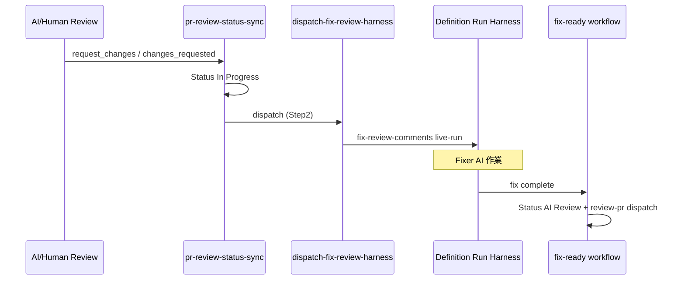

# Fixer 自動 dispatch 設計書

## 1. 目的

本ドキュメントは、Epic #308（Fixer 自動起動）における **Request changes 契機の Fixer harness 自動 dispatch** の設計正本である。

PR 作成 → AI Review 自動化（`pr-created` → `dispatch-review-pr-harness.cjs`）と対称に、**Request changes → Fixer（`/fix-review-comments`）** を自動 dispatch する方針・条件・失敗時 recovery を定義する。

| 項目 | 内容 |
| ---- | ---- |
| Epic Issue | #308 |
| 関連 Task | #322（設計） / #324（スクリプト） / #326（workflow） / #328（docs 反映） |
| Human 判断ログ | `ai-logs/human-decisions/2026-06-02-fixer-auto-dispatch-ai-review-request-changes.md` |

実装（スクリプト・workflow 変更）は本書の後続 Task で行う。本書は **設計のみ** を正本とする。

---

## 2. 背景と非対称（現状）

| 段階 | 自動化 | 根拠 |
| ---- | ------ | ---- |
| PR 作成 → AI Review | 自動 | `pr-created-status-and-slack.yml` → `dispatch-review-pr-harness.cjs` |
| Request changes → Status `In Progress` | 自動 | `pr-review-status-sync.yml` |
| **Request changes → Fixer** | **自動（Task #326）** | `pr-review-status-sync.yml` → `dispatch-fix-review-harness.cjs` |
| fix 完了 → 再 AI Review | 自動 | `publish-fix-complete-and-dispatch.cjs` → `pr-ready-for-ai-review.yml` |

実例: PR #306（Human Request changes 後、Status のみ更新、Fixer 未起動）。

---

## 3. Human 判断（確定済み）

| 判断事項 | 結論 | 判断日 |
| -------- | ---- | ------ |
| dispatch 契機 | **AI Review `request_changes` と Human Review `changes_requested` の双方** | 2026-06-02 |
| dispatch 失敗時 recovery | **手動 CLI のみ**（workflow 自動リトライ / 別 `workflow_dispatch` は採用しない） | 2026-06-02 |
| 再指摘時（`already_at_next_status`） | **Fixer auto-dispatch しない**（現行 workflow 維持）。必要時は **手動 CLI** | 2026-06-02（Task #328） |

---

## 4. dispatch 契機

### 4.1 対象 Review Result / Review state

Fixer auto-dispatch は **`request_changes` に相当する指摘** を契機とする。

| 経路 | トリガ | workflow route | Review Result / state |
| ---- | ------ | -------------- | --------------------- |
| AI Review | `repository_dispatch`（`ai_review_status_sync`） | `repository_dispatch` | `review_result: request_changes` |
| Human Review | `pull_request_review`（`submitted`） | `human_review` | `state: changes_requested` |

正本 workflow: [PRレビュー完了時 Status 更新ワークフロー](./PRレビュー完了時Status更新ワークフロー仕様書.md)（`.github/workflows/pr-review-status-sync.yml`）。

### 4.2 dispatch しない Review Result（Status 同期のみ）

以下は Status 更新・Slack 通知は行うが、**Fixer harness は dispatch しない**（現行 `pr-review-status-sync` と同様）。

| Review Result | 次 Status（例） | 理由 |
| ------------- | --------------- | ---- |
| `approve_for_human_review` | `Human Review` | 修正不要 |
| `needs_human_decision` | `Human Review` または `In Progress` | 人間判断優先（本文 §22 参照） |
| `split_required` | `In Progress` | 別 Issue 化が必要。Fixer 自動起動は scope 外修正を誘発しうる |
| `blocked` | `In Progress` | 前提不足。Fixer では解消不能 |

### 4.3 再指摘時（`already_at_next_status`）

[PRレビュー完了時 Status 更新ワークフロー](./PRレビュー完了時Status更新ワークフロー仕様書.md) §5.3 の **次 Status が現在 Status と同一** のとき、Status 更新・Slack・確認コメントを skip する（`already_at_next_status`）。

| 項目 | 方針（Human 判断確定: Task #328） |
| ---- | --------------------------------- |
| Fixer auto-dispatch | **行わない**（Step1 が早期 return するため `markDispatchFixer` 未到達） |
| workflow 変更 | **採用しない**（fix-ready の `skipWithSummaryAndMaybeDispatch` 同型の skip 時 dispatch は導入しない） |
| recovery | 再指摘で Fixer が必要な場合、**手動 CLI**（[§8.2](#82-recoveryhuman-判断確定)） |

**理由（要約）:**

- 冪等性: 重複 `request_changes` / `changes_requested` イベントによる Fixer の二重起動を防ぐ
- recovery 方針との整合: dispatch 失敗・skip いずれも手動 CLI に集約
- fix-ready との非対称: fix 完了イベントは Status が既に `AI Review` でも再 AI Review dispatch が必要な場合がある。request_changes 再受信は Status 更新不要＝自動 Fixer も起動しない

---

## 5. workflow 統合方針（Task3 実装済み）

### 5.1 2 step 構成（pr-created と同型）

[PR作成時 Status 更新・Slack通知ワークフロー](./PR作成時Status更新・Slack通知ワークフロー仕様書.md) と同様、**同一 job 内で Status 同期と dispatch を分離**する。

```text
pr-review-status-sync job
  Step 1: Status 更新 + Slack + PR コメント（既存 github-script）
          → output: dispatch_fixer=true/false, pr_number, issue_number, pr_head_sha
  Step 2: Checkout PR head（Review Definition / Task Definition 解決用）
  Step 3: node dispatch-fix-review-harness.cjs --context request-changes ...
```

### 5.2 Step 1 完了後に dispatch する理由

Status を `In Progress` に更新してから Fixer を起動する。dispatch 失敗時も **Status は更新済み** となり得る（[§8 失敗時挙動](#8-失敗時挙動) 参照）。

### 5.3 fix-ready 連鎖との関係

Fixer 完了後の **再 AI Review** は既存の `fix-ready` → `pr-ready-for-ai-review.yml` → `dispatch-review-pr-harness.cjs` を維持する。本 Epic では **fix-ready 側を変更しない**（退行防止）。

---

## 6. dispatch スクリプト（Task2 実装済み）

### 6.1 新規スクリプト

| 項目 | 内容 |
| ---- | ---- |
| ファイル | `.github/scripts/dispatch-fix-review-harness.cjs` |
| 参照実装 | `dispatch-review-pr-harness.cjs` |
| Harness command | `fix-review-comments`（Definition Run Harness レジストリに live-run 解禁が必要な場合は Task2 で確認） |
| context 値（案） | `request-changes` |

### 6.2 解決対象

| 解決物 | 方針 |
| ------ | ---- |
| Task Definition | PR 本文 / Issue 本文 / PR head の branch summary / PR changed files から解決（review 側と同型） |
| Review Definition | Fixer 用 `pr-review.yaml` が無い場合は **Task Definition パス**を `--definition` で Harness に渡す（`/fix-review-comments @task.yaml` と同型） |

Review Definition 専用ファイルの要否は Task2 で確定する。最低限 Task Definition パス解決で動作すること。

### 6.3 CLI 出力

成功・失敗・skip いずれも JSON を stdout に出力。失敗時は `recovery_command` を含める（`dispatch-review-pr-harness.cjs` と同型）。

---

## 7. skip 条件

`dispatch-fix-review-harness.cjs` は `dispatch-review-pr-harness.cjs` の skip パターンを **可能な限り揃える**。

| 条件 | 挙動 | reason（例） |
| ---- | ---- | ------------ |
| PR from fork | skip（job success） | `fork_pr` |
| `type: infra` / `area: infra` ラベル | skip | `infra_pr` |
| Epic PR（`unit: epic` ラベル、または `feature/epic-*` branch） | skip | `epic_pr` |
| 変更ファイルが `.github/` のみ | skip | `automation_only_changes` |
| Review Result が `request_changes` 以外 | Step1 で dispatch 出力 false | （dispatch step 未実行） |
| Fixer 不要（Task Definition で `ai_review` 相当の gate が false） | 将来拡張。Task2 で要否判断 | — |

**採用しない:** dispatch 失敗時の workflow 内自動リトライ。

---

## 8. 失敗時挙動

### 8.1 dispatch 失敗（Task3 step）

| 項目 | 挙動 |
| ---- | ---- |
| スクリプト戻り値 | `ok: false` → `process.exitCode = 1` |
| workflow job | **failure（赤）** |
| Fixer Definition Run Harness | **dispatch されない**（後続チェーン未起動） |
| 先行 Step 1 | **完了済みの可能性あり**（Status `In Progress`、Slack、PR コメント） |

### 8.2 recovery（Human 判断確定）

| 項目 | 内容 |
| ---- | ---- |
| 方針 | **手動 CLI のみ** |
| 自動 recovery | workflow 再実行・別 `workflow_dispatch` による暗黙リトライは **採用しない** |
| 手順 | Actions log の JSON から `recovery_command` をコピーして実行 |

recovery コマンド例（Task2 実装後）:

```bash
node .github/scripts/dispatch-fix-review-harness.cjs \
  --repository ryo-chan-k6/GiftRecommendAPP_MVP_CYCLE_3 \
  --pr <PR番号> \
  --issue <Task Issue番号> \
  --requested-by manual-recovery \
  --context request-changes
```

オプションで `--definition prompts/definitions/tasks/.../task.yaml` を明示可能とする。

### 8.3 Harness job 失敗（dispatch 成功後）

Definition Run Harness 本体が失敗した場合は [Definition Run Harnessワークフロー仕様書](./Definition%20Run%20Harnessワークフロー仕様書.md) §16.2 に従う（Fixer harness live-run の recovery）。

| 失敗種別 | 典型原因 | recovery |
| -------- | -------- | -------- |
| post-verify Branch 違反 | （修正前）PR head への正当 push を誤検知 | develop に Task #360 修正を取り込み再 dispatch |
| Agent 成功・fix-complete 未投稿 | Cloud Agent の GitHub write 不可 | Harness `publish-fix-complete-harness-fallback`（`GH_BOT_TOKEN`）または手動 `publish-fix-complete-and-dispatch.cjs` / fix-ready workflow_dispatch |

---

## 9. Status 遷移（参考）



---

## 10. Task 完了状況

| Task | Issue | 内容 | 状態 |
| ---- | ----- | ---- | ---- |
| Task1 設計 | #322 | 本設計書 | 完了 |
| Task2 スクリプト | #324 | `dispatch-fix-review-harness.cjs` + 単体テスト | 完了 |
| Task3 workflow | #326 | `pr-review-status-sync.yml` 2 step 化 | 完了 |
| Task4 docs | #328 | Harness 仕様書・運用 docs 反映 | 完了 |

---

## 11. 正本関係

| 対象 | 正本 |
| ---- | ---- |
| 本設計 | 本書 |
| Status 遷移・Review Result 分類 | [PRレビュー完了時 Status 更新ワークフロー](./PRレビュー完了時Status更新ワークフロー仕様書.md) |
| Harness 一般 | [Definition Run Harnessワークフロー仕様書](./Definition%20Run%20Harnessワークフロー仕様書.md) |
| Fixer Command | `.cursor/commands/fix-review-comments.md` |
| Human 判断 | `ai-logs/human-decisions/2026-06-02-fixer-auto-dispatch-ai-review-request-changes.md` |

---

## 12. 変更履歴

| 日付 | 内容 |
| ---- | ---- |
| 2026-06-02 | 初版（Task #322）。Human 判断（AI request_changes 対象、手動 CLI recovery）反映 |
| 2026-06-02 | Task #328。実装完了反映、`already_at_next_status` 運用方針（§4.3）追加 |
