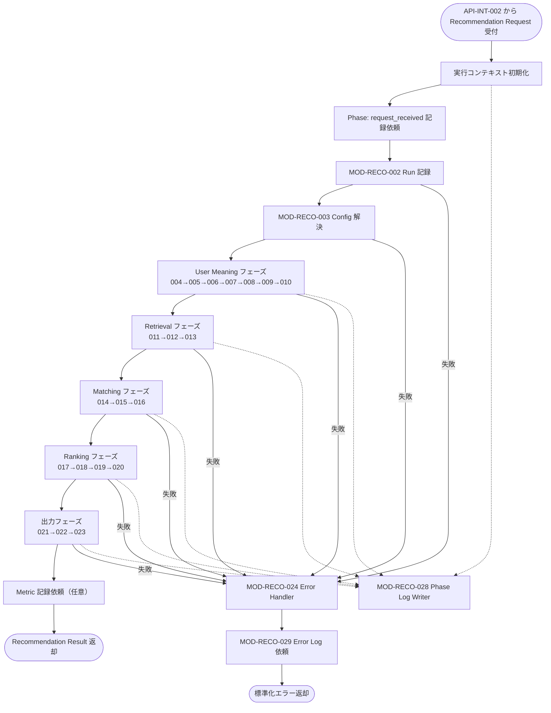

# Recommendation Orchestrator モジュール仕様書

## 1. ドキュメント情報

| 項目           | 内容                                                     |
| -------------- | -------------------------------------------------------- |
| ドキュメントID | `MOD-RECO-001`                                           |
| ドキュメント名 | Recommendation Orchestrator モジュール仕様書             |
| 対象システム   | Gift Recommendation Service（`apps/reco`）               |
| MVP対象        | `○`                                                      |
| 作成日         | 2026-06-25                                               |
| 更新日         | 2026-06-25                                               |

---

## 2. 概要

Recommendation Orchestrator（推薦実行制御）は、Reco オンライン推薦パイプラインの起点モジュールである。`API-INT-002`（Reco推薦実行）のエンドポイント層から `Recommendation Request` を受け取り、`MOD-RECO-002`〜`MOD-RECO-029` の各モジュールを定義済みの処理順序で呼び出し、最終的に `Recommendation Result` を返却する。

本モジュールは **実行制御** に責務を限定し、Semantic 抽出・Retrieval・Matching・Ranking・Reason 生成などのドメイン計算は各下位モジュールに委譲する。Phase Log / Error Log の **記録契機の管理** と、異常時の **パイプライン中断・エラー伝播** を担う。

---

## 3. 目的

- `apps/reco` における推薦パイプライン実装・単体テストの前提となる Orchestrator 責務を定義する
- 入出力、依存モジュール、処理順序、状態遷移、例外・ログ方針を後続実装可能な粒度で整理する
- Recoモジュール一覧・モジュール一覧・ドメイン定義書との整合を担保する

---

## 4. モジュール基本情報

| 項目 | 内容 |
| ---- | ---- |
| モジュールID | `MOD-RECO-001` |
| モジュール名 | 推薦実行制御 |
| 物理名 | `Recommendation Orchestrator` |
| 分類 | 実行制御 |
| 処理種別 | `OL` |
| 配置予定 | `apps/reco/src/reco/application/recommendation-orchestrator/**` |
| 所属Epic | `MOD-RECO-001`（Epic Issue #260） |
| MVP対象 | `○` |
| 主な呼び出し元 | `API-INT-002` Reco推薦実行の reco 内部ハンドラ（`apps/reco/src/reco/api/**`） |
| 主な呼び出し先 | `MOD-RECO-002`〜`MOD-RECO-025`（OL パイプライン）、`MOD-RECO-028` / `MOD-RECO-029`（ログ）、`MOD-RECO-024`（エラー処理） |

`MOD-API-*` / `MOD-RECO-*` / `MOD-BATCH-*` 配下のTaskでは、該当モジュールIDの責務範囲に変更を限定する。`MOD-RECO-*` では `apps/reco/src/reco/api/**` の API-INT エンドポイント層を対象に含めない。エンドポイント層の変更が必要な場合は、該当する `API-INT-*` Epic 配下 Task として扱う。

---

## 5. 責務

### 5.1 主責務

- Reco オンライン推薦パイプライン全体の **実行順序を制御** する（Recoモジュール一覧 §5.2 の処理順序に従う）
- `Recommendation Request` から **実行コンテキスト**（`recommendation_run` 紐づけ、trace、mode 等）を初期化し、下位モジュールへ受け渡す
- **実行モード**（`ui` / `evaluation` / `batch`）に応じたパイプライン起動を判定する
- 各処理フェーズの **開始・終了契機** を管理し、`MOD-RECO-028` Phase Log Writer への記録を依頼する
- 下位モジュールの失敗を検知し、`MOD-RECO-024` Reco Error Handler 経由で **標準化エラー・Error Log** へ接続する
- 正常終了時に `Recommendation Result`（Response 相当）を呼び出し元へ返却する
- 異常終了時に **Error Code**（`GRS-REC-*`）とともに失敗応答を呼び出し元へ返却する
- 推薦全体の **処理時間計測**（`recommendation_latency_ms`）の起点・終点を管理する

### 5.2 対象外責務

- `API-INT-002` エンドポイント層（HTTP 受付、reco 側防御的 Validation、OpenAPI スキーマ整合）の実装
- `MOD-RECO-002`〜`MOD-RECO-029` 各モジュール **本体** のアルゴリズム・永続化詳細の実装
- `MOD-RECO-026` / `MOD-RECO-027`（処理種別 `BT`）のオンライン推薦中の直接呼び出し
- Semantic 抽出、Feature 生成、Retrieval、Matching、Ranking、Reason 生成の **計算ロジック**
- Phase Log / Error Log / Metric の **物理書き込み実装**（`MOD-RECO-028` / `MOD-RECO-029` / `MOD-RECO-025` に委譲）
- 例外の **Error Code への変換ロジック** 詳細（`MOD-RECO-024` に委譲）
- Public API（`API-PUB-002`）向けレスポンス形式への変換（`apps/api` 側責務）
- OpenAPI / Orval / generated の変更
- DB schema / DDL の変更

---

## 6. 入出力

### 6.1 入力

| 入力 | 型 / 構造 | 必須 | 生成元 | 用途 | 備考 |
| ---- | --------- | ---- | ------ | ---- | ---- |
| `recommendation_request` | `RecommendationRequest`（RecommendationRequest定義書） | `true` | `API-INT-002` reco 内部ハンドラ | 推薦条件・mode・top_k 等の起点入力 | `recommendation_request_id` を含む |
| `trace_id` | `string` | `true` | 呼び出し元（api / batch） | 横断トレース | ログ・Phase Log の `trace_id` に引き継ぐ |
| `execution_mode` | `ui` \| `evaluation` \| `batch` | `true` | `recommendation_request.mode` | パイプライン起動判定 | Recoモジュール一覧 §6.1 実行モード |
| `caller_context` | 呼び出し元メタデータ | `false` | `API-INT-002` / Offline Evaluation | 評価・再実行時の付加情報 | 詳細は実装 Task で型定義 |

### 6.2 出力

| 出力 | 型 / 構造 | 利用先 | 用途 | 備考 |
| ---- | --------- | ------ | ---- | ---- |
| `recommendation_result` | `RecommendationResult`（RecommendationResult定義書） | `API-INT-002` reco 内部ハンドラ → `apps/api` | 推薦結果の正本 | 正常終了時 |
| `execution_context` | パイプライン実行コンテキスト | 下位 `MOD-RECO-*` | run_id、config version、中間成果物の受け渡し | Orchestrator 内部状態 |
| `reco_error` | 標準化 reco エラー | 呼び出し元 | 失敗時の Error Code・メッセージ粒度 | `MOD-RECO-024` 経由で生成 |
| `phase_log_events` | Phase 記録依頼 | `MOD-RECO-028` | フェーズ開始・終了・失敗の記録 | Orchestrator は契機管理のみ |
| `error_log_events` | Error 記録依頼 | `MOD-RECO-029` | 失敗時のエラー詳細記録 | `MOD-RECO-024` 経由が原則 |

---

## 7. 依存関係

### 7.1 依存モジュール

| 依存先 | 方向 | 用途 | 失敗時の扱い | 備考 |
| ------ | ---- | ---- | ------------ | ---- |
| `MOD-RECO-002` Recommendation Run Recorder | 呼び出し | 推薦実行単位（`recommendation_run`）の記録開始 | パイプライン中断、`GRS-REC-002` 相当 | 処理順序 2 |
| `MOD-RECO-003` Config Version Resolver | 呼び出し | 利用 config / model version の解決 | パイプライン中断、`GRS-REC-003` | 処理順序 3 |
| `MOD-RECO-004` User Semantic Extractor | 呼び出し | Semantic Concept 抽出 | パイプライン中断、`GRS-REC-004` | User Meaning フェーズ |
| `MOD-RECO-005` External Condition Feature Estimator | 呼び出し | relationship / occasion から Feature 推定 | パイプライン中断、`GRS-REC-005` | |
| `MOD-RECO-006` Internal Condition Feature Estimator | 呼び出し | preferred / non_preferred / free text から Feature 推定 | パイプライン中断、`GRS-REC-005` | |
| `MOD-RECO-007` User Feature Generator | 呼び出し | User Feature 統合生成 | パイプライン中断、`GRS-REC-005` | |
| `MOD-RECO-008` User Meaning Projector | 呼び出し | social / symbolic / λ_ctx 算出 | パイプライン中断、`GRS-REC-006` | |
| `MOD-RECO-009` User Context Builder | 呼び出し | Retrieval 用 context 生成 | パイプライン中断、`GRS-REC-005` | |
| `MOD-RECO-010` Query Embedding Generator | 呼び出し | query embedding 生成 | パイプライン中断、`GRS-REC-007` | |
| `MOD-RECO-011` Pre Hard Filter Executor | 呼び出し | Retrieval 前の商品集合絞り込み | パイプライン中断、`GRS-REC-008` | |
| `MOD-RECO-012` Candidate Retriever | 呼び出し | 候補商品抽出 | パイプライン中断、`GRS-REC-009` | |
| `MOD-RECO-013` Post Hard Filter Executor | 呼び出し | Retrieval 後の除外 | パイプライン中断、`GRS-REC-010` | |
| `MOD-RECO-014` Feature Matcher | 呼び出し | feature 一致度計算 | パイプライン中断、`GRS-REC-011` | |
| `MOD-RECO-015` Meaning Match Aggregator | 呼び出し | social_match / symbolic_match 集約 | パイプライン中断、`GRS-REC-011` | |
| `MOD-RECO-016` Context Scorer | 呼び出し | context_score 算出 | パイプライン中断、`GRS-REC-011` | |
| `MOD-RECO-017` Popularity Scorer | 呼び出し | popularity_score 算出 | パイプライン中断、`GRS-REC-012` | Ranking 前段 |
| `MOD-RECO-018` Risk Scorer | 呼び出し | risk_penalty 算出 | パイプライン中断、`GRS-REC-012` | Ranking 前段 |
| `MOD-RECO-019` Final Score Calculator | 呼び出し | final_score 算出 | パイプライン中断、`GRS-REC-012` | **スコア計算**責務。順位決定は含まない |
| `MOD-RECO-020` Final Ranker | 呼び出し | 表示順位 rank 決定 | パイプライン中断、`GRS-REC-012` | **順位決定**責務。スコア計算は含まない |
| `MOD-RECO-021` Recommendation Result Builder | 呼び出し | recommendation_result 生成 | パイプライン中断、`GRS-REC-012` | |
| `MOD-RECO-022` Result Snapshot Builder | 呼び出し | 表示時点 Snapshot 生成 | パイプライン中断、`GRS-REC-012` | |
| `MOD-RECO-023` Reason Generator | 呼び出し | 推薦理由生成 | 方針により部分成功または中断、`GRS-REC-013` | Reason 失敗時の部分返却は未決（§16） |
| `MOD-RECO-024` Reco Error Handler | 呼び出し | 例外の標準化・ログ接続 | エラー応答生成の前提 | 各フェーズ失敗時 |
| `MOD-RECO-025` Metric Logger | 呼び出し（任意） | 件数・処理時間・分布メトリクス記録 | 記録失敗は推薦結果に影響させない | MVP対象 `△` |
| `MOD-RECO-028` Phase Log Writer | 呼び出し | phase_log 永続化 | 記録失敗は推薦結果に影響させない（warn ログ） | 各フェーズ境界 |
| `MOD-RECO-029` Error Log Writer | 間接呼び出し | error_log 永続化 | `MOD-RECO-024` 経由 | 失敗時 |
| `MOD-RECO-026` Item Semantic Generator | 直接呼び出しなし | BT 事前生成データの間接利用 | OL では対象外 | 処理種別 `BT` |
| `MOD-RECO-027` Item Feature Generator | 直接呼び出しなし | BT 事前生成データの間接利用 | OL では対象外 | 処理種別 `BT` |

### 7.2 参照データ

| データ | 参照元 | 用途 | version / config | 備考 |
| ------ | ------ | ---- | ---------------- | ---- |
| `semantic_config_version` | DB（`MOD-RECO-003` 経由） | Semantic / Feature ルール | `MOD-RECO-003` が解決 | Orchestrator は参照のみ |
| `model_version` | DB（`MOD-RECO-003` 経由） | Embedding / LLM / Reason モデル | 同上 | |
| `ranking_config` | DB（`MOD-RECO-003` 経由） | Ranking パラメータ | 同上 | |
| `item_feature` / `item_embedding` | DB（事前 BT 生成） | Retrieval / Matching | `MOD-RECO-026` / `027` 成果物 | OL では読み取りのみ |

---

## 8. 処理仕様

### 8.1 処理フロー

### 8.2 処理ステップ

Recoモジュール一覧 §5.2 の処理順序に従う。Orchestrator は各ステップの **呼び出し順序・入力受け渡し・失敗時中断** を担当する。

| No | 処理 | 入力 | 出力 | 補足 |
| --: | ---- | ---- | ---- | ---- |
| 1 | 実行コンテキスト初期化 | `recommendation_request`, `trace_id` | `execution_context` | mode 判定を含む |
| 2 | Phase Log（request_received） | `execution_context` | phase 記録依頼 | `MOD-RECO-028` |
| 3 | Recommendation Run 記録 | `execution_context` | `recommendation_run` | `MOD-RECO-002` |
| 4 | Config / Version 解決 | request context, mode | config_version 群 | `MOD-RECO-003` |
| 5 | Semantic 抽出 | request text / relationship / occasion | semantic_extraction_result | `MOD-RECO-004` |
| 6 | 外部条件 Feature 推定 | relationship / occasion | external_feature_estimate | `MOD-RECO-005` |
| 7 | 内部条件 Feature 推定 | preferred / non_preferred / free text | internal_feature_estimate | `MOD-RECO-006` |
| 8 | User Feature 生成 | 外部・内部 Feature 推定結果 | user_feature | `MOD-RECO-007` |
| 9 | User Meaning 射影 | user_feature | user_social / user_symbolic / λ_ctx | `MOD-RECO-008` |
| 10 | User Context 生成 | semantic / user_feature | user_context | `MOD-RECO-009` |
| 11 | Query Embedding 生成 | user_context | query_embedding | `MOD-RECO-010` |
| 12 | Pre Hard Filter | request / item / budget / ng | pre_filtered_item_pool | `MOD-RECO-011` |
| 13 | 候補商品抽出 | query_embedding / item_embedding / pool | retrieval_candidate | `MOD-RECO-012` |
| 14 | Post Hard Filter | retrieval_candidate / semantic NG | validated_candidate | `MOD-RECO-013` |
| 15 | feature 一致度計算 | user_feature / item_feature | feature_match | `MOD-RECO-014` |
| 16 | 意味マッチ集約 | feature_match | social_match / symbolic_match | `MOD-RECO-015` |
| 17 | 文脈スコア算出 | matches / λ_ctx | context_score | `MOD-RECO-016` |
| 18 | 人気補正算出 | popularity signals | popularity_score | `MOD-RECO-017` |
| 19 | リスク補正算出 | risk signals / context | risk_penalty | `MOD-RECO-018` |
| 20 | 最終スコア算出 | context / popularity / risk | final_score | `MOD-RECO-019` |
| 21 | 最終順位生成 | final_score / diversity | ranked_items | `MOD-RECO-020` |
| 22 | Recommendation Result 生成 | ranked_items / score_breakdown | recommendation_result | `MOD-RECO-021` |
| 23 | Result Snapshot 生成 | ranked_items / item values | result item snapshot | `MOD-RECO-022` |
| 24 | Reason 生成 | snapshot / score_breakdown / context | recommendation_reason | `MOD-RECO-023` |
| 25 | 正常終了・Result 返却 | 上記成果物 | `recommendation_result` | 呼び出し元へ返却 |

**0件結果**: 候補 0 件は各下位モジュールの責務で検知する。最終的に表示対象 0 件の場合、HTTP 200 と `GRS-REC-001`（推薦候補0件）を返す方針はエラーコード定義書に従い、`MOD-RECO-024` と呼び出し元（api）で最終化する。

### 8.3 アルゴリズム / 計算仕様

本モジュールはスコア計算・意味推定・候補抽出などの **アルゴリズムを実装しない**。処理順序の制御、実行コンテキストの受け渡し、フェーズ境界の管理のみを担当する。

| 項目 | 内容 |
| ---- | ---- |
| パイプライン制御 | Recoモジュール一覧 §5.2 の順序どおりに同期的に各モジュールを呼び出す（MVP） |
| 実行モード分岐 | `ui` / `evaluation` / `batch` に応じて `MOD-RECO-003` へ mode を渡し、利用 config を切り替える |
| Ranking 責務分離 | `MOD-RECO-019`（final_score）→ `MOD-RECO-020`（rank）の順で呼び出す。機能×モジュール対応表と整合 |

---

## 9. データ項目マッピング

Orchestrator はドメイン変換の **ハブ** として、下位モジュール間の受け渡しを行う。主要マッピングは各 `MOD-RECO-*` モジュール仕様書で詳述し、本仕様書では起点・終点のみ示す。

| 入力項目 | 内部項目 | 出力項目 | 変換内容 | 備考 |
| -------- | -------- | -------- | -------- | ---- |
| `recommendation_request.*` | `execution_context.request` | - | コンテキストへ格納 | RecommendationRequest定義書 |
| - | `execution_context.run_id` | `recommendation_result.run_id` | Run 記録後に紐づけ | `MOD-RECO-002` |
| - | `execution_context.config_versions` | `recommendation_result.version_info` | Version 情報の引き継ぎ | `MOD-RECO-003` |
| - | `ranked_items` + reasons | `recommendation_result.items[]` | Result 構築 | `MOD-RECO-021`〜`023` |

---

## 10. 状態・例外

### 10.1 状態

Orchestrator が管理する推薦実行の論理状態（`recommendation_run.status` の詳細は状態遷移設計書・`MOD-RECO-002` に委譲）。

| 状態 | 意味 | 遷移条件 | 記録先 |
| ---- | ---- | -------- | ------ |
| `running` | パイプライン実行中 | Run 記録成功後、Result 返却前 | `recommendation_run` / Phase Log |
| `succeeded` | 正常終了 | 全必須フェーズ成功、Result 返却 | `recommendation_run` |
| `failed` | 異常終了 | いずれかの必須フェーズ失敗 | `recommendation_run` / Error Log |
| `empty_result` | 0件結果（ビジネス上の空結果） | 候補 0 件だが処理は完了 | `recommendation_run`（`GRS-REC-001`） |

**リトライ**: MVP では Orchestrator 単体でのパイプライン自動リトライは行わない。呼び出し元（`apps/api`）または人間操作による再実行に委ねる（§16 未決事項参照）。

### 10.2 例外

| 例外 | Error Code | 発生条件 | 呼び出し元への返却 | ログ |
| ---- | ---------- | -------- | ------------------ | ---- |
| 推薦候補0件 | `GRS-REC-001` | 最終表示対象 0 件 | HTTP 200（api 層で Public 形式へ変換） | Phase Log に候補数を記録 |
| 推薦実行失敗 | `GRS-REC-002` | Run 記録・パイプライン制御失敗 | 500 系 | Error Log + Phase Log（failed） |
| Config 解決失敗 | `GRS-REC-003` | `MOD-RECO-003` 失敗 | 500 系 | 同上 |
| Semantic 抽出失敗 | `GRS-REC-004` | `MOD-RECO-004` 失敗 | 500 系 | 同上 |
| User Feature 系失敗 | `GRS-REC-005` | `MOD-RECO-005`〜`009` 失敗 | 500 系 | 同上 |
| User Meaning 射影失敗 | `GRS-REC-006` | `MOD-RECO-008` 失敗 | 500 系 | 同上 |
| Query Embedding 失敗 | `GRS-REC-007` | `MOD-RECO-010` 失敗 | 500 系 | 同上 |
| Pre Hard Filter 失敗 | `GRS-REC-008` | `MOD-RECO-011` 失敗 | 500 系 | 同上 |
| Retrieval 失敗 | `GRS-REC-009` | `MOD-RECO-012` 失敗 | 500 系 | 同上 |
| Post Hard Filter 失敗 | `GRS-REC-010` | `MOD-RECO-013` 失敗 | 500 系 | 同上 |
| Matching 失敗 | `GRS-REC-011` | `MOD-RECO-014`〜`016` 失敗 | 500 系 | 同上 |
| Ranking 失敗 | `GRS-REC-012` | `MOD-RECO-017`〜`022` 失敗 | 500 系 | 同上 |
| Reason 生成失敗 | `GRS-REC-013` | `MOD-RECO-023` 失敗 | 500 系（部分成功方針は §16） | 同上 |
| Reco タイムアウト | `GRS-REC-101` | 推薦全体または下位処理がタイムアウト | 504 系 | Error Log |
| Run 状態不整合 | `GRS-REC-201` | 実行状態の競合 | 409 系 | Error Log |
| 想定外エラー | `GRS-REC-999` | 上記に分類できない例外 | 500 系 | Error Log（critical） |

Error Code の正本はエラーコード定義書。Orchestrator は `MOD-RECO-024` が返す標準化結果を呼び出し元へ伝播する。

---

## 11. DB / 永続化

Orchestrator 本体は DB へ **直接書き込まない**。永続化は下位モジュールに委譲する。

| テーブル | 操作 | 主な項目 | トランザクション | 備考 |
| -------- | ---- | -------- | ---------------- | ---- |
| `recommendation_run` | insert / update | run_id, status, request_id | `MOD-RECO-002` が管理 | Orchestrator は呼び出しのみ |
| `phase_log` | insert | phase_name, phase_status, duration_ms | `MOD-RECO-028` が管理 | フェーズ境界ごと |
| `error_log` | insert | error_code, phase_name, detail_json | `MOD-RECO-029` が管理 | 失敗時 |

---

## 12. ログ・メトリクス

### 12.0 ログ出力タイミング（Orchestrator 責務）

| 種別 | 内容 | 出力タイミング | 保存先 | 備考 |
| ---- | ---- | -------------- | ------ | ---- |
| Phase Log 依頼 | フェーズ開始（`started`） | 各 `MOD-RECO-003`〜`023` の直前 | `phase_log`（`MOD-RECO-028`） | `request_received` はパイプライン開始時 |
| Phase Log 依頼 | フェーズ成功（`succeeded`） | 各モジュール正常 return 直後 | 同上 | `duration_ms` を付与 |
| Phase Log 依頼 | フェーズ失敗（`failed`） | 例外検知・中断決定時 | 同上 | `error_code` を付与 |
| Error Log 依頼 | 例外詳細 | `MOD-RECO-024` 呼び出し時 | `error_log`（`MOD-RECO-029`） | secret はマスキング |
| 構造化ログ | パイプライン開始・終了 | Orchestrator entry / exit | アプリログ | trace_id 必須 |

Phase 名の一覧はログ・Observability設計書 §10.3（`request_received`, `config_resolved`, `semantic_extracted`, … `response_built`）に準拠する。

### 12.1 メトリクス

| Metric | 内容 | 集計単位 | 用途 |
| ------ | ---- | -------- | ---- |
| `recommendation_latency_ms` | 推薦全体の処理時間 | Run | SLO 監視・ボトルネック分析 |
| `phase_duration_ms` | フェーズ別処理時間 | Phase | フェーズ単位の遅延分析 |
| `pre_filter_candidate_count` | Pre Hard Filter 後候補数 | Run | 0件原因調査 |
| `retrieval_candidate_count` | Retrieval 候補数 | Run | 同上 |
| `post_filter_candidate_count` | Post Hard Filter 後候補数 | Run | 同上 |
| `final_result_count` | 最終推薦件数 | Run | 品質・空結果率 |

メトリクスの永続化は `MOD-RECO-025` Metric Logger に委譲する（MVP対象 `△`）。Orchestrator は計測起点・終点と、下位モジュールからのカウント受け渡しを担う。

---

## 13. 性能・非機能

| 観点 | 方針 |
| ---- | ---- |
| レイテンシ | 推薦全体の目標値は非機能要件定義書・SLO 設計に従う。Orchestrator は `recommendation_latency_ms` を計測する |
| 計算量 | パイプラインは MVP では **直列実行**。下位モジュールの計算量は各モジュール仕様書に委譲 |
| タイムアウト | 推薦全体タイムアウト超過時は `GRS-REC-101` を返す。具体値は実装・運用 Task で設定（API-INT-002 契約と整合） |
| リトライ | Orchestrator 内の自動リトライは MVP では **行わない**（§16 参照） |
| キャッシュ | Orchestrator 本体ではキャッシュを持たない。config / embedding キャッシュは下位モジュールまたは infra 層 |
| 並列実行 | MVP ではパイプライン内のモジュール並列実行は行わない。同一 run_id の二重実行は `GRS-REC-201` で拒否 |

---

## 14. テスト観点

| No | 観点 | 確認内容 | 種別 |
| --: | ---- | -------- | ---- |
| 1 | 正常系（ui mode） | 全モジュール成功時に `Recommendation Result` が返ること | unit |
| 2 | 正常系（evaluation / batch mode） | mode に応じた config 解決・パイプライン起動が行われること | unit |
| 3 | 処理順序 | `MOD-RECO-002`→`003`→…→`023` の呼び出し順が Recoモジュール一覧 §5.2 と一致すること | unit |
| 4 | Ranking 責務分離 | `MOD-RECO-019` の後に `MOD-RECO-020` が呼ばれること | unit |
| 5 | 境界値（0件） | 候補 0 件時に `GRS-REC-001` 相当の扱いになること | unit |
| 6 | 例外系（下位失敗） | 各フェーズ失敗でパイプラインが中断し、対応する `GRS-REC-*` が伝播すること | unit |
| 7 | 依存モジュール失敗 | `MOD-RECO-003` 失敗時に後続 User Meaning が呼ばれないこと | unit |
| 8 | Phase Log 契機 | 主要フェーズの開始・終了で `MOD-RECO-028` が呼ばれること | unit / integration |
| 9 | Error Log 接続 | 失敗時に `MOD-RECO-024`→`MOD-RECO-029` が呼ばれること | unit / integration |
| 10 | DB / ログ | Run / Phase / Error が下位モジュール経由で記録されること（Orchestrator 直書き込みなし） | integration |
| 11 | タイムアウト | 全体タイムアウト時に `GRS-REC-101` になること | integration |
| 12 | trace 伝播 | `trace_id` が Phase Log / 構造化ログに引き継がれること | unit |

---

## 15. 変更管理

### 15.1 変更履歴

| 日付 | 変更内容 | 関連Issue / PR |
| ---- | -------- | -------------- |
| 2026-06-25 | 初版作成 | Issue #758 |

---

## 16. 未決事項

| No | 論点 | 判断が必要な理由 | 判断者 | 期限 | 備考 |
| --: | ---- | ---------------- | ------ | ---- | ---- |
| 1 | Orchestrator の責務範囲（Phase Log / Error Handling / Config 解決をどこまで内包するか） | 契機管理と実装の境界がモジュール間で重複しうる | Human Reviewer | - | 本仕様書は契機管理＋委譲方針で記載 |
| 2 | 物理配置パス `apps/reco/src/reco/application/recommendation-orchestrator/**` の最終確定 | Epic 定義と旧想定パスの差異 | Human Reviewer | - | Epic `epic_scope.allowed_paths` を採用 |
| 3 | `MOD-RECO-002` / `003` の呼び出し詳細を本仕様書でどこまで記述するか | 各モジュール仕様書 Task との線引き | Human Reviewer | - | 依存関係表・処理ステップで概要のみ記載 |
| 4 | Reason 生成失敗時の部分成功（Result のみ返却）を許容するか | `GRS-REC-013` と UX のトレードオフ | Human Reviewer | - | Reason生成定義書と合わせて判断 |
| 5 | 推薦パイプライン処理順序の優先正本（処理構成定義書 / 処理フロー概要図 / Recoモジュール一覧 §5） | 抽象度の異なる複数 docs が存在 | Human Reviewer | - | 本仕様書は Recoモジュール一覧 §5.2 を正とする |
| 6 | 推薦全体・フェーズ別タイムアウトの具体値 | API-INT-002 契約・運用 SLO との整合 | 実装 Task / 運用 | - | 実装仕様書で確定 |

---

## 17. 関連資料

| 種別 | パス / URL | 用途 |
| ---- | ---------- | ---- |
| Recoモジュール一覧 | `docs/05_アプリケーション設計/アプリ/reco/Recoモジュール一覧.md` | モジュール定義・処理順序 |
| モジュール一覧 | `docs/05_アプリケーション設計/アプリ/モジュール一覧.md` | 全体配置 |
| 機能×モジュール対応表 | `docs/05_アプリケーション設計/アプリ/機能×モジュール対応表.md` | API-INT-002 連携 |
| 処理構成定義書 | `docs/05_アプリケーション設計/アプリ/処理構成定義書.md` | OL / BT 分離 |
| 処理フロー概要図 | `docs/05_アプリケーション設計/アプリ/処理フロー概要図.md` | 全体フロー |
| エラーコード定義書 | `docs/05_アプリケーション設計/アプリ/エラーコード定義書.md` | `GRS-REC-*` |
| ログ・Observability設計書 | `docs/05_アプリケーション設計/アプリ/ログ・Observability設計書.md` | Phase Log / Metric |
| RecommendationRequest定義書 | `docs/04_ドメインモデル設計/RecommendationRequest定義書.md` | 入力構造 |
| RecommendationResult定義書 | `docs/04_ドメインモデル設計/RecommendationResult定義書.md` | 出力構造 |
| Retrieval / Matching / Ranking / Reason生成定義書 | `docs/04_ドメインモデル設計/` 配下 | フェーズ前提 |
| API-INT-002 契約仕様書 | `docs/06_実装設計/api/API-INT-002_Reco推薦実行API契約仕様書.md` | 呼び出し I/F（エンドポイント層は out of scope） |
| module-spec テンプレート | `prompts/templates/docs/module-spec.md` | 章構成 |
| Epic Definition | `prompts/definitions/epics/mod-reco-001-recommendation-orchestrator/epic.yaml` | allowed_paths |

---

## 18. レビュー観点

- Recoモジュール一覧のモジュール名・物理名・分類・処理種別・MVP対象と一致している
- モジュール一覧の `MOD-RECO-001` 行と整合している
- Orchestrator の責務が実行制御に限定され、他モジュール本体の仕様が混入していない
- `apps/reco/src/reco/api/**`（API-INT エンドポイント層）の変更を本仕様書の実装範囲に含めていない
- 依存モジュール（`MOD-RECO-002`〜`029`）の呼び出し方向・用途・失敗時の扱いが明確である
- `MOD-RECO-019`（Final Score Calculator）と `MOD-RECO-020`（Final Ranker）の責務分離が明確である
- Phase Log / Error Log の出力タイミングが整理されている
- 未決事項が隠れずに明記されている
- secret や `.env` 実値が含まれていない

---

## 19. 備考

- 本仕様書は `MOD-RECO-001` の **実行制御** 責務に限定する。各下位 `MOD-RECO-*` の詳細は別 Task のモジュール仕様書で定義する
- `API-INT-002` エンドポイント層は `[Epic]API-INT-002` 配下で設計・実装する
- Batch モジュール `MOD-RECO-026` / `027` はオンライン推薦パイプラインからは直接呼び出さない（事前生成データを参照）
- Human Review では §16 の未決事項、特に責務境界と物理配置パスの確定を確認すること
