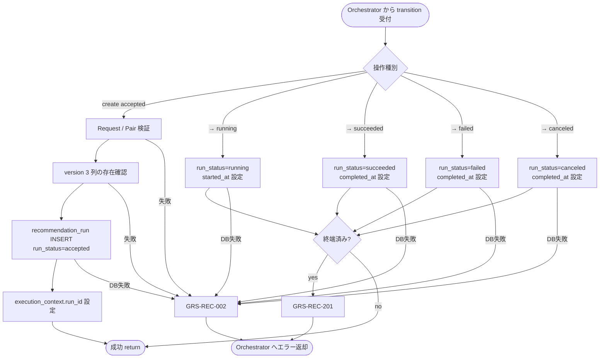
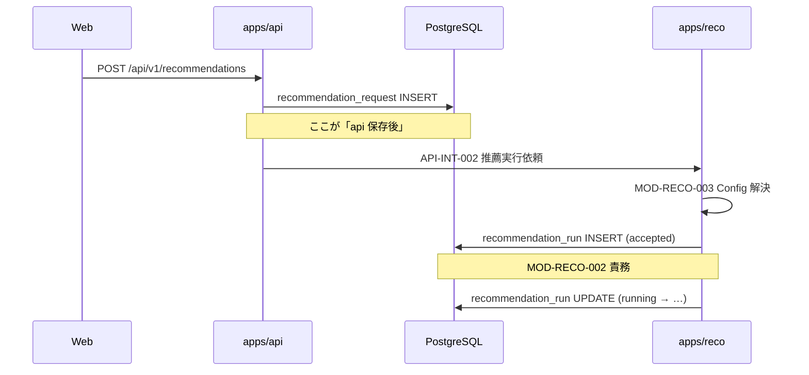

# Recommendation Run Recorder モジュール仕様書

## 1. ドキュメント情報

| 項目           | 内容                                                     |
| -------------- | -------------------------------------------------------- |
| ドキュメントID | `MOD-RECO-002`                                           |
| ドキュメント名 | Recommendation Run Recorder モジュール仕様書             |
| 対象システム   | Gift Recommendation Service（`apps/reco`）               |
| MVP対象        | `○`                                                      |
| 作成日         | 2026-06-25                                               |
| 更新日         | 2026-06-27                                               |

---

## 2. 概要

Recommendation Run Recorder（Recommendation Run記録）は、Reco オンライン推薦パイプラインにおける **推薦実行単位**（`recommendation_run`）の永続化と状態遷移を担うモジュールである。`MOD-RECO-001` Recommendation Orchestrator から `execution_context` を受け取り、`recommendation_run` 行の **INSERT / UPDATE** を行い、Request・Result・Phase Log・Error Log を紐づける **owner キー**（`recommendation_run_id`）を提供する。

本モジュールは **Run 本体の状態管理** に責務を限定し、フェーズ詳細の記録（`MOD-RECO-028`）、障害詳細の記録（`MOD-RECO-029`）、Config 解決（`MOD-RECO-003`）、推薦計算ロジックは行わない。

---

## 3. 目的

- `apps/reco` における `recommendation_run` 永続化・状態遷移実装・単体テストの前提を定義する
- Orchestrator との I/F（`execution_context` 入出力）、失敗時の扱い、DB マッピングを後続実装可能な粒度で整理する
- Recoモジュール一覧・`recommendation_run` テーブル定義書・状態遷移設計書・ログ・Observability設計書との整合を担保する

---

## 4. モジュール基本情報

| 項目 | 内容 |
| ---- | ---- |
| モジュールID | `MOD-RECO-002` |
| モジュール名 | Recommendation Run記録 |
| 物理名 | `Recommendation Run Recorder` |
| 分類 | ログ・観測 |
| 処理種別 | `OL` |
| 配置予定 | `apps/reco/src/reco/application/recommendation-run-recorder/**` |
| 所属Epic | `MOD-RECO-002`（Epic Issue #776） |
| MVP対象 | `○` |
| 主な呼び出し元 | `MOD-RECO-001` Recommendation Orchestrator |
| 主な呼び出し先 | `RecommendationRunRepository`（`infrastructure/db/`）、`pair_master` 参照（Pair 解決） |

`MOD-API-*` / `MOD-RECO-*` / `MOD-BATCH-*` 配下のTaskでは、該当モジュールIDの責務範囲に変更を限定する。`MOD-RECO-*` では `apps/reco/src/reco/api/**` の API-INT エンドポイント層を対象に含めない。エンドポイント層の変更が必要な場合は、該当する `API-INT-*` Epic 配下 Task として扱う。

---

## 5. 責務

### 5.1 主責務

- 推薦実行単位（`recommendation_run`）を **記録** し、`recommendation_run_id` を `execution_context` へ返却する
- `Recommendation Request`（`recommendation_request_id`）と Run の **1:N executes** 関係を維持する（同一 Request の再実行は **新規 Run 行** として INSERT）
- `relationship_code` + `occasion_code`（Request 正本）から `pair_id` を解決し、Run 行に **固定** する（`recommendation_run_テーブル定義書` §5.3）
- 解決済み Config / Model / Ranking version 3 列を Run 行に **コピー** して再現性を担保する（§5.5）
- `run_status` の状態遷移（`accepted` → `running` → 終端）を管理し、`started_at` / `completed_at` / `updated_at` を更新する（状態遷移設計書 §5.1）
- パイプライン **正常終了** 時に `run_status = succeeded` へ遷移する（Reason fallback を含む正常 Result 返却は Orchestrator 方針に従い succeeded）
- パイプライン **異常終了** 時に `run_status = failed` へ遷移する（`MOD-RECO-024` 経由の Error Log 連携は Orchestrator / Error Handler 責務）
- **タイムアウト / 中断** 時に `run_status = canceled` へ遷移する（MVP では任意。Orchestrator が `GRS-REC-101` 検知時に依頼）
- 終端状態（`succeeded` / `failed` / `canceled`）到達後の **UPDATE 禁止** を実装で担保する（テーブル定義書 §12）
- Request・Result・Phase Log・Error Log を紐づける **owner 基点**（`recommendation_run_id`）を提供する（Recoモジュール一覧 §6.23.1）

### 5.2 対象外責務

- `API-INT-002` エンドポイント層（HTTP 受付、reco 側防御的 Validation、OpenAPI スキーマ整合）の実装
- `MOD-RECO-001` Orchestrator の **実行順序制御**・Phase Log 契機管理
- `MOD-RECO-003` Config Version Resolver 本体の **version 解決ロジック**（解決結果の受け取りと Run 行への反映は本モジュール責務）
- `MOD-RECO-028` Phase Log Writer / `MOD-RECO-029` Error Log Writer の **物理書き込み**
- `MOD-RECO-024` Reco Error Handler の **Error Code 変換**
- Semantic 抽出・Retrieval・Matching・Ranking・Reason 生成などの **ドメイン計算**
- `recommendation_result` / `user_semantic` 等の **子テーブル本体** の生成（Run ID の参照先提供のみ）
- `phase_log` / `error_log` 行の INSERT（owner として `recommendation_run_id` を **参照される** のみ）
- Public API（`API-PUB-002`）向けレスポンス形式への変換（`apps/api` 側責務）
- OpenAPI / Orval / generated の変更
- DB schema / DDL の変更
- Run 行の DELETE / アーカイブ（Retention は Phase2 Task）

---

## 6. 入出力

### 6.1 入力

| 入力 | 型 / 構造 | 必須 | 生成元 | 用途 | 備考 |
| ---- | --------- | ---- | ------ | ---- | ---- |
| `execution_context` | パイプライン実行コンテキスト | `true` | `MOD-RECO-001` | Run 記録・状態遷移の起点 | `request` / `trace_id` / `mode` を含む |
| `execution_context.request` | `RecommendationRequest` | `true` | Orchestrator | `recommendation_request_id`、relationship / occasion | RecommendationRequest定義書 |
| `execution_context.trace_id` | `string` | `true` | 呼び出し元（api / batch） | ログ横断連携 | Run テーブルには物理列なし。Request / Log 側で連携 |
| `pair_id` | `uuid` | `true`（INSERT 時） | 本モジュール（Pair 解決）または `execution_context` | Run 行の FK | `pair_master` 参照 |
| `semantic_config_version_id` | `uuid` | `true`（INSERT 時） | `MOD-RECO-003` 解決結果 | 再現性固定 | LOGICAL FK |
| `model_version_id` | `uuid` | `true`（INSERT 時） | `MOD-RECO-003` 解決結果 | 同上 | LOGICAL FK |
| `ranking_config_id` | `uuid` | `true`（INSERT 時） | `MOD-RECO-003` 解決結果 | 同上 | LOGICAL FK |
| `transition` | `accepted` \| `running` \| `succeeded` \| `failed` \| `canceled` | `true` | Orchestrator 契機 | 状態遷移指示 | 操作ごとに指定 |
| `failure_context` | 失敗メタデータ | `false` | Orchestrator / `MOD-RECO-024` | `failed` 遷移時の監査 | 詳細は `error_log` に委譲 |

### 6.2 出力

| 出力 | 型 / 構造 | 利用先 | 用途 | 備考 |
| ---- | --------- | ------ | ---- | ---- |
| `execution_context.run_id` | `uuid`（`recommendation_run_id`） | `MOD-RECO-001`、下位 `MOD-RECO-*` | Run 紐づけキー | INSERT 成功後に設定 |
| `recommendation_run` | DB 行スナップショット | Orchestrator、Repository 層 | 現在の `run_status` / タイムスタンプ | ドメイン型は実装 Task で定義 |
| `reco_error` | 標準化 reco エラー | Orchestrator | Run 記録失敗時 | `GRS-REC-002` / `GRS-REC-201` 等 |

---

## 7. 依存関係

### 7.1 依存モジュール

| 依存先 | 方向 | 用途 | 失敗時の扱い | 備考 |
| ------ | ---- | ---- | ------------ | ---- |
| `MOD-RECO-001` Recommendation Orchestrator | 被呼び出し | Run 記録・状態遷移の契機提供 | — | 唯一の呼び出し元 |
| `MOD-RECO-003` Config Version Resolver | **呼び出し前提** | version 3 列の解決（INSERT 前に Orchestrator が実行） | version 未解決時は INSERT 不可 → Orchestrator が `GRS-REC-003` | 解決ロジック本体は `003` 責務。物理呼び出し順は **003 → 002（INSERT）**（§8.2・§16.1 No.1） |
| `MOD-RECO-024` Reco Error Handler | 間接連携 | 失敗時の標準化エラー生成 | Run 更新失敗は `GRS-REC-002` | Error Handler は Orchestrator 経由 |
| `RecommendationRunRepository` | 呼び出し | INSERT / UPDATE | パイプライン中断、`GRS-REC-002` | `apps/reco/src/reco/infrastructure/db/`（§16.1 No.3） |

### 7.2 参照データ

| データ | 参照元 | 用途 | version / config | 備考 |
| ------ | ------ | ---- | ---------------- | ---- |
| `recommendation_request` | DB | 親 Request 存在確認、`relationship_code` / `occasion_code` | — | 物理 FK ON |
| `pair_master` | DB | `pair_id` 解決 | — | 物理 FK ON（Run → pair） |
| `semantic_config_version` | DB | INSERT 前存在確認 | `MOD-RECO-003` が解決 | LOGICAL FK |
| `model_version` | DB | 同上 | 同上 | LOGICAL FK |
| `ranking_config` | DB | 同上 | 同上 | LOGICAL FK |
| `recommendation_run_status` | `packages/code-definitions/state/recommendation_run_status.yaml` | `run_status` 許容値 | enum 正本 | enum定義書 §6.1 |

---

## 8. 処理仕様

### 8.1 処理フロー



### 8.2 処理ステップ

#### 8.2.1 Orchestrator からの呼び出し順（確定）

`recommendation_run` INSERT には version 3 列が必須のため、Orchestrator（`MOD-RECO-001`）は **物理呼び出し順** を以下とする（`recommendation_run_テーブル定義書` §12 INSERT 手順と整合）。

```text
1. execution_context 初期化（MOD-RECO-001）
2. Phase Log: request_received（MOD-RECO-028 依頼）
3. Config / Version 解決（MOD-RECO-003）  ← version 3 列を execution_context へ設定
4. Recommendation Run INSERT（MOD-RECO-002, transition=accepted）
5. Run UPDATE → running（MOD-RECO-002）    ← User Meaning フェーズ開始前
6. … 下位モジュール（004〜023）…
7. Run UPDATE → succeeded / failed / canceled（MOD-RECO-002）
```

Recoモジュール一覧 §5.2 のモジュール番号（002→003）は **論理依存の整理** であり、上記の **Config 解決 → Run INSERT** の物理順と矛盾する場合は本仕様書の呼び出し順を正とする。`MOD-RECO-001` モジュール仕様書および Orchestrator **実装**（Issue #777 exception_scope）は本順序に整合済み。

#### 8.2.2 本モジュール内部ステップ

| No | 処理 | 入力 | 出力 | 補足 |
| --: | ---- | ---- | ---- | ---- |
| 1 | Pair 解決 | `execution_context.request`（relationship / occasion） | `pair_id` | `pair_master` 参照。未解決時は INSERT せず失敗 |
| 2 | version 受け取り | `execution_context`（`MOD-RECO-003` 済み） | version 3 列 | INSERT 必須。未設定時は失敗 |
| 3 | Run INSERT（accepted） | request_id, pair_id, version 3 列 | `recommendation_run_id` | IF-DB-RECO-002。`created_at` / `updated_at` 設定 |
| 4 | execution_context 更新 | `recommendation_run_id` | `execution_context.run_id` | 下位モジュールへ伝播 |
| 5 | Run UPDATE（running） | `run_id` | 更新後 Run | パイプライン本処理開始時。`started_at` 設定 |
| 6 | Run UPDATE（終端） | `run_id`, `transition` | 更新後 Run | `succeeded` / `failed` / `canceled`。`completed_at` 設定 |
| 7 | 終端ガード | 現 `run_status` | — | 終端後 UPDATE は `GRS-REC-201` |

**再実行方針**: 同一 `recommendation_run_id` の **再開 UPDATE は行わない**。同一 Request の再実行は Orchestrator が新規 `create accepted` を依頼する（状態遷移設計書 §11・テーブル定義書 §17.1 No.6）。

### 8.3 アルゴリズム / 計算仕様

本モジュールは **状態機械** による Run 本体管理が中心であり、スコア計算・意味推定は行わない。

| 項目 | 内容 |
| ---- | ---- |
| Pair 解決 | Request の `relationship_code` + `occasion_code` をキーに `pair_master` を検索し `pair_id` を取得 |
| version 固定 | INSERT 時に `MOD-RECO-003` が解決した 3 列を **コピー**（以降 Run 行で不変） |
| 状態遷移 | 状態遷移設計書 §5.1.3 / テーブル定義書 §11.1 に従う有限状態機械 |
| 0件結果 | 候補 0 件でもパイプライン完了時は `succeeded`（`GRS-REC-001` は Orchestrator / api 層表現。Run は succeeded） |
| 冪等性 | INSERT は非冪等（新規 UUID）。同一 Run への重複終端 UPDATE は拒否 |

---

## 9. データ項目マッピング

| 入力項目 | 内部項目 | 出力項目 | 変換内容 | 備考 |
| -------- | -------- | -------- | -------- | ---- |
| `execution_context.request.recommendation_request_id` | — | `recommendation_run.recommendation_request_id` | そのまま FK | Request 存在必須 |
| `relationship_code` + `occasion_code` | `pair_id`（解決結果） | `recommendation_run.pair_id` | `pair_master` 参照 | §5.3 |
| `execution_context.config_versions.*` | — | `semantic_config_version_id` 等 3 列 | `MOD-RECO-003` 成果のコピー | LOGICAL FK 存在確認 |
| — | `recommendation_run_id`（新規 UUID） | `execution_context.run_id` | INSERT 後に紐づけ | Observability trace キー |
| `transition=running` | — | `run_status`, `started_at` | UPDATE | 非終端 → running |
| `transition=succeeded` \| `failed` \| `canceled` | — | `run_status`, `completed_at`, `updated_at` | UPDATE | 終端遷移 |

---

## 10. 状態・例外

### 10.1 状態

`recommendation_run.run_status` の正本は状態遷移設計書 §5.1 および `recommendation_run_テーブル定義書` §11。

| 状態 | 意味 | 遷移条件 | 記録先 |
| ---- | ---- | -------- | ------ |
| `accepted` | reco が Run 行を作成し、実行待ち | Pair / version 解決後 INSERT | `recommendation_run` |
| `running` | パイプライン本処理実行中 | Orchestrator が User Meaning 以降を開始する契機 | `recommendation_run`（`started_at`） |
| `succeeded` | 推薦処理正常終了（Reason fallback 含む） | Result 返却完了 | `recommendation_run`（`completed_at`） |
| `failed` | 異常終了 | `021`/`022` 以前の必須フェーズ失敗、または Result 返却不能 | `recommendation_run` + `error_log` |
| `canceled` | タイムアウト / 中断 | Orchestrator が `GRS-REC-101` 等を検知 | `recommendation_run`（MVP 任意） |

**Phase との関係**: フェーズ詳細（`request_received`, `config_resolved`, …）は **`phase_log`** に記録し、Run 本体は上記 5 状態のみ更新する（状態遷移設計書 §5.1.4）。

### 10.2 例外

| 例外 | Error Code | 発生条件 | 呼び出し元への返却 | ログ |
| ---- | ---------- | -------- | ------------------ | ---- |
| Run 記録失敗 | `GRS-REC-002` | INSERT / UPDATE 失敗、Pair 未解決、version 未設定、FK 違反 | 500 系（Orchestrator 経由） | Error Log 依頼 + 構造化ログ（`trace_id`） |
| Run 状態不整合 | `GRS-REC-201` | 終端済み Run への UPDATE、不正な状態遷移 | 409 系 | Error Log + warn |
| 想定外エラー | `GRS-REC-999` | 上記に分類できない DB / 内部例外 | 500 系 | Error Log（critical） |

Error Code の正本はエラーコード定義書。本モジュールは例外を **送出または `reco_error` として返却** し、Orchestrator が `MOD-RECO-024` へ接続する。

**Orchestrator 連携（失敗時）**: `MOD-RECO-001` は `MOD-RECO-002` 失敗時に **パイプラインを中断** し、`GRS-REC-002` 相当を呼び出し元へ伝播する（MOD-RECO-001 §7.1・§10.2）。

---

## 11. DB / 永続化

| テーブル | 操作 | 主な項目 | トランザクション | 備考 |
| -------- | ---- | -------- | ---------------- | ---- |
| `recommendation_run` | INSERT | `recommendation_run_id`, `recommendation_request_id`, `pair_id`, version 3 列, `run_status=accepted`, `created_at`, `updated_at` | 単一 INSERT。親 Request トランザクションとは分離可 | IF-DB-RECO-002 |
| `recommendation_run` | UPDATE | `run_status`, `started_at`, `completed_at`, `updated_at` | 状態遷移ごとに 1 UPDATE。終端後禁止 | MOD-RECO-002 専責 |
| `pair_master` | SELECT | `pair_id` | Pair 解決時読取 | 書込みなし |
| `recommendation_request` | SELECT | 存在確認 | INSERT 前検証 | 書込みなし |

**トランザクション方針**: MVP では Run INSERT と Phase Log INSERT の **同一 DB トランザクション必須は課さない**（Phase Log は `MOD-RECO-028` 責務）。Run 記録失敗時はパイプライン中断を優先する。

---

## 12. ログ・メトリクス

| 種別 | 内容 | 出力タイミング | 保存先 | 備考 |
| ---- | ---- | -------------- | ------ | ---- |
| 構造化ログ | Run 作成（`recommendation_run_id`, `run_status=accepted`） | INSERT 成功時 | アプリログ | `trace_id` 必須。Request payload は出さない |
| 構造化ログ | 状態遷移（`from_status` → `to_status`） | 各 UPDATE 成功時 | アプリログ | Run ID・status のみ。PII なし（§12.0 参照） |
| 構造化ログ | Run 記録失敗 | 例外時 | アプリログ | Error レベル。secret マスキング |
| Error Log 依頼 | 障害詳細 | `failed` / 記録失敗時 | `error_log`（`MOD-RECO-029`） | 物理書込みは `029` |

### 12.0 構造化ログの具体例

本モジュールが出力する **アプリ標準ログ**（`infrastructure/logger/` 経由）のイメージ。DB の `phase_log` / `error_log` とは別系統である。

**Run INSERT 成功時（accepted）**

```json
{
  "level": "info",
  "event": "recommendation_run_created",
  "trace_id": "tr_01HXYZ...",
  "recommendation_run_id": "550e8400-e29b-41d4-a716-446655440000",
  "recommendation_request_id": "660e8400-e29b-41d4-a716-446655440001",
  "run_status": "accepted",
  "module_id": "MOD-RECO-002"
}
```

**状態遷移 UPDATE 成功時（例: running → succeeded）**

```json
{
  "level": "info",
  "event": "recommendation_run_status_changed",
  "trace_id": "tr_01HXYZ...",
  "recommendation_run_id": "550e8400-e29b-41d4-a716-446655440000",
  "from_status": "running",
  "to_status": "succeeded",
  "module_id": "MOD-RECO-002"
}
```

運用・調査では、`trace_id` で api ログと突合し、`recommendation_run_id` で `phase_log` / `error_log` の owner と突合する（ログ・Observability設計書 §5）。

### 12.1 メトリクス

| Metric | 内容 | 集計単位 | 用途 |
| ------ | ---- | -------- | ---- |
| `recommendation_run_count` | 推薦実行数 | Run / mode | Observability・SLO（ログ・Observability設計書） |
| `recommendation_run_failed_count` | Run 記録・終端 failed 数 | Run | 障害率監視 |
| `recommendation_run_duration_ms` | `started_at`〜`completed_at` | Run | パイプライン所要時間（Orchestrator 計測と併用可） |

メトリクス永続化の詳細は `MOD-RECO-025` Metric Logger に委譲可能（MVP対象 `△`）。本モジュールは **計測イベントの発火** を担う。

---

## 13. 性能・非機能

| 観点 | 方針 |
| ---- | ---- |
| レイテンシ | Run INSERT / UPDATE は **数 ms 台** を目標。パイプライン全体 SLO の誤差に収める |
| 計算量 | O(1)（単一行 CRUD + Pair 1 件参照） |
| タイムアウト | 専用 hard timeout は設けない。DB ドライバ / 接続プール既定に従う |
| リトライ | MVP では **自動リトライしない**。失敗時は `GRS-REC-002` で中断 |
| キャッシュ | Pair / version のキャッシュは持たない（`003` / Repository 層に委譲） |
| 並列実行 | 同一 `recommendation_run_id` への並列 UPDATE を禁止（楽観 / 終端ガード） |

---

## 14. テスト観点

| No | 観点 | 確認内容 | 種別 |
| --: | ---- | -------- | ---- |
| 1 | 正常系（accepted INSERT） | Pair / version 揃い時に `run_status=accepted` で行が作成され `run_id` が返る | unit |
| 2 | 正常系（running → succeeded） | `started_at` / `completed_at` が設計どおり設定される | unit |
| 3 | 正常系（failed） | パイプライン失敗契機で `failed` + `completed_at` になる | unit |
| 4 | 境界値（同一 Request 再実行） | 同一 `recommendation_request_id` に複数 Run INSERT 可能 | unit / integration |
| 5 | 例外系（Pair 未解決） | 不正 relationship / occasion で INSERT せず `GRS-REC-002` | unit |
| 6 | 例外系（version 欠落） | version 3 列いずれか欠落で INSERT 失敗 | unit |
| 7 | 例外系（FK 違反） | 存在しない `recommendation_request_id` で拒否 | unit / integration |
| 8 | 終端ガード | `succeeded` 後の UPDATE が `GRS-REC-201` | unit |
| 9 | 状態遷移整合 | 許容遷移のみ成功（例: `accepted`→`running`、不正 `accepted`→`succeeded` は拒否） | unit |
| 10 | Orchestrator 連携 | 記録失敗時に Orchestrator がパイプライン中断する（モック） | unit |
| 11 | DB / ログ | 構造化ログに `recommendation_run_id` / `trace_id` が出力される | integration |
| 12 | 0件結果 | 候補 0 件完了時も `succeeded` になる | unit |
| 13 | canceled（任意） | タイムアウト契機で `canceled` 遷移 | unit |

---

## 15. 変更管理

### 15.1 変更履歴

| 日付 | 変更内容 | 関連Issue / PR |
| ---- | -------- | -------------- |
| 2026-06-25 | 初版作成 | Issue #777 |
| 2026-06-26 | Human Review 反映（呼び出し順・Repository 配置・ログ例・文字修正） | Issue #777 |
| 2026-06-26 | Epic `allowed_paths` に infrastructure Repository パスを追記 | Issue #777 |
| 2026-06-27 | 関連正本 docs 横断整合（MOD-RECO-001・Recoモジュール一覧・状態遷移・機能×モジュール対応表） | Issue #777 |
| 2026-06-27 | exception_scope: Orchestrator 003→002 呼び出し順・RunStatus DB enum 整合 | Issue #777 |

---

## 16. 未決事項

| No | 論点 | 判断が必要な理由 | 判断者 | 期限 | 備考 |
| --: | ---- | ---------------- | ------ | ---- | ---- |
| - | なし | - | - | - | §16.1 の論点は確定済み |

### 16.1 確定済み論点（Issue #777 Human Review）

| No | 論点 | 確定内容 |
| --: | ---- | -------- |
| 1 | INSERT タイミングと処理順序 | Orchestrator は **`MOD-RECO-003` 解決後**に `MOD-RECO-002` の INSERT（`accepted`）を呼ぶ。Recoモジュール一覧 §5.2 の番号順より **テーブル INSERT 前提** を優先する（§8.2.1） |
| 2 | `accepted` 遷移の主体 | **reco（本モジュール）が `recommendation_run` 行を INSERT** する。api は `recommendation_request` の保存のみ（§16.2） |
| 3 | Repository / 型の配置 | **application** = ユースケース本体、`domain/recommendation/run.py` = エンティティ・`run_status` enum、`infrastructure/db/repositories/recommendation_run_repository.py` = DB 永続化（§16.3） |

### 16.2 api 保存と reco Run 作成の関係（確定の補足）

状態遷移設計書 §5.1.3 の「api 保存後に reco 生成でも可」は、**誰が `recommendation_run` 行を INSERT するか** の実装選択肢を示す記述である。MVP では以下の **時系列** を正とする。



| 観点 | 主体 | 内容 |
| ---- | ---- | ---- |
| `recommendation_request` 保存 | **api** | Public API 受付時に入力条件正本を永続化 |
| `recommendation_run` 作成 | **reco（本モジュール）** | api からの内部 API 呼び出し後、Config 解決済みの `execution_context` で INSERT |
| api 側 Run INSERT | **採用しない** | 本 Epic scope 外。api は Run 行を直接書かない |

### 16.3 コード配置（確定・現行 scaffold 準拠）

`apps/reco` の Phase4a scaffold およびプロジェクトディレクトリ構成定義書 §7.3 を確認した結果、以下を正とする。

| 層 | 配置パス | 責務 |
| -- | -------- | ---- |
| Application | `apps/reco/src/reco/application/recommendation-run-recorder/` | `RunRecorderPort` 実装、状態遷移、Pair 解決オーケストレーション |
| Domain | `apps/reco/src/reco/domain/recommendation/run.py` | `RecommendationRun` エンティティ、`run_status` enum（DB enum と整合） |
| Infrastructure | `apps/reco/src/reco/infrastructure/db/repositories/recommendation_run_repository.py` | `recommendation_run` の INSERT / UPDATE（`session.py` 利用） |
| Infrastructure | `apps/reco/src/reco/infrastructure/db/repositories/pair_master_reader.py`（任意） | Pair 解決用 SELECT。単純なら Repository 内に同居可 |
| Logger | `apps/reco/src/reco/infrastructure/logger/` | 構造化ログ出力（既存 scaffold） |

**根拠（事実）**: 現行リポジトリには `infrastructure/db/session.py`、`domain/recommendation/run.py`、`application/recommendation-orchestrator/ports.py`（`RunRecorderPort`）が存在する。`pipeline/**` は計算ステージ用であり Run 永続化は配置しない。

**Epic scope**: `epic.yaml` の `allowed_paths` に `infrastructure/db/repositories/recommendation_run*` / `pair_master*` および対応 unit test パスを **追記済み**（Issue #777）。

---

## 17. 関連資料

| 種別 | パス / URL | 用途 |
| ---- | ---------- | ---- |
| Recoモジュール一覧 | `docs/05_アプリケーション設計/アプリ/reco/Recoモジュール一覧.md` | §6.23.1 モジュール定義・§5.2 処理順序 |
| モジュール一覧 | `docs/05_アプリケーション設計/アプリ/モジュール一覧.md` | 全体配置 |
| 機能×モジュール対応表 | `docs/05_アプリケーション設計/アプリ/機能×モジュール対応表.md` | §7.1 推薦処理順序 |
| MOD-RECO-001 仕様書 | `docs/06_実装設計/reco/MOD-RECO-001_Recommendation Orchestratorモジュール仕様書.md` | 呼び出し元・失敗時中断 |
| recommendation_run テーブル定義書 | `docs/06_実装設計/database/recommendation_run_テーブル定義書.md` | 列・FK・状態遷移・§5.7 I/F |
| 状態遷移設計書 | `docs/05_アプリケーション設計/アプリ/状態遷移設計書.md` | §5.1 Run 状態 |
| エラーコード定義書 | `docs/05_アプリケーション設計/アプリ/エラーコード定義書.md` | `GRS-REC-002` / `GRS-REC-201` |
| ログ・Observability設計書 | `docs/05_アプリケーション設計/アプリ/ログ・Observability設計書.md` | trace / Run Log 分類 |
| RecommendationRequest定義書 | `docs/04_ドメインモデル設計/RecommendationRequest定義書.md` | 入力構造 |
| Epic Definition | `prompts/definitions/epics/mod-reco-002-recommendation-run-recorder/epic.yaml` | `allowed_paths` |
| module-spec テンプレート | `prompts/templates/docs/module-spec.md` | 章構成 |

### 17.1 後続整合 Task

Issue #777 exception_scope により、以下は本 Issue で整合済み。

| 対象 | 整合内容 | 状態 |
| ---- | -------- | ---- |
| `MOD-RECO-001` Orchestrator 実装 | `_execute_pipeline` の呼び出し順 **003 → 002（INSERT）**、`ORCHESTRATOR_MODULE_ORDER` | Issue #777 で完了 |
| `domain/recommendation/run.py` | `RunStatus` を DB enum へ整合 | Issue #777 で完了 |

---

## 18. レビュー観点

- Recoモジュール一覧 §6.23.1 のモジュール名・物理名・分類・処理種別・MVP対象と一致している
- `recommendation_run_テーブル定義書` §5.7 / §11 / §12 と矛盾していない
- `MOD-RECO-001` との呼び出し方向・失敗時パイプライン中断（`GRS-REC-002`）が明確である
- `apps/reco/src/reco/api/**`（API-INT エンドポイント層）を責務範囲に含めていない
- Phase Log / Error Log の **owner** として `recommendation_run_id` を提供する責務が明記されている
- Orchestrator 呼び出し順（003 → 002 INSERT）と Repository 配置が §8.2.1 / §16.1 で確定している
- secret や `.env` 実値が含まれていない

---

## 19. 備考

- 本仕様書は `MOD-RECO-002` の **Run 永続化・状態遷移** 責務に限定する
- `API-INT-002` エンドポイント層は `[Epic]API-INT-002` 配下で設計・実装する
- 配置パスは `apps/reco/src/reco/application/recommendation-run-recorder/**`（application）と `infrastructure/db/repositories/`（Repository）に分離（§16.3）
- Orchestrator 呼び出し順（003 → 002 INSERT）は Issue #777 exception_scope で実装整合済み（`application/recommendation-orchestrator/**`）
- `recommendation_run` の DDL / migration は本 Epic の DB 専用 Task で実施する（本 Task は docs のみ）
