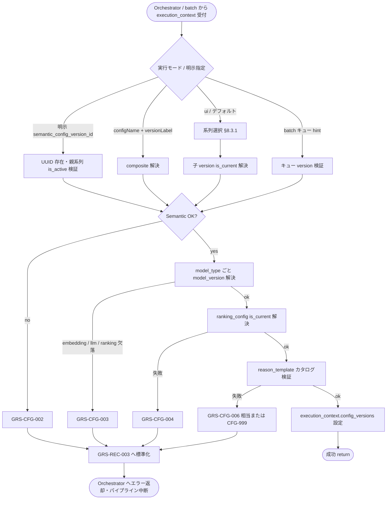

# Config Version Resolver モジュール仕様書

## 1. ドキュメント情報

| 項目           | 内容                                                     |
| -------------- | -------------------------------------------------------- |
| ドキュメントID | `MOD-RECO-003`                                           |
| ドキュメント名 | Config Version Resolver モジュール仕様書                 |
| 対象システム   | Gift Recommendation Service（`apps/reco`）               |
| MVP対象        | `○`                                                      |
| 作成日         | 2026-06-25                                               |
| 更新日         | 2026-06-25                                               |

---

## 2. 概要

Config Version Resolver（Config / Version解決）は、Reco 推薦パイプラインおよび batch 商品意味生成パイプラインにおいて、**利用する設定・モデル Version** を DB 正本から解決し、`execution_context` へ引き渡すモジュールである。`MOD-RECO-001` Recommendation Orchestrator から **処理順序 3** で呼び出され、Semantic / Feature ルール、Embedding / LLM モデル、Ranking パラメータの **再現性固定** に必要な version ID 群を確定する。

本モジュールは **設定解決** に責務を限定し、Semantic 抽出・Feature 生成・Ranking 計算・Reason 文面生成などのドメイン計算は行わない。DB への書き込みは行わず、IF-DB-RECO-001（Config / Version 参照）に基づく **読み取り専用** の解決を担う。

---

## 3. 目的

- `apps/reco` における Config / Version 解決実装・単体テストの前提を定義する
- Orchestrator との I/F（`execution_context` 入出力）、失敗時のパイプライン中断（`GRS-REC-003`）を後続実装可能な粒度で整理する
- Recoモジュール一覧・各 Config テーブル定義書・エラーコード定義書・ログ・Observability設計書との整合を担保する

---

## 4. モジュール基本情報

| 項目 | 内容 |
| ---- | ---- |
| モジュールID | `MOD-RECO-003` |
| モジュール名 | Config / Version解決 |
| 物理名 | `Config Version Resolver` |
| 分類 | 設定解決 |
| 処理種別 | `共通`（OL 推薦・BT 商品意味生成の双方から利用） |
| 配置予定 | `apps/reco/src/reco/application/config-version-resolver/**` |
| 所属Epic | `MOD-RECO-003`（Epic Issue #778） |
| MVP対象 | `○` |
| 主な呼び出し元 | `MOD-RECO-001` Recommendation Orchestrator（OL）、batch パイプライン各モジュール（BT・間接呼び出し） |
| 主な呼び出し先 | Config / Master Repository 群（DB アクセス層。`semantic_config_version` / `model_version` / `ranking_config` / `semantic_config` / `reason_template`） |

`MOD-API-*` / `MOD-RECO-*` / `MOD-BATCH-*` 配下のTaskでは、該当モジュールIDの責務範囲に変更を限定する。`MOD-RECO-*` では `apps/reco/src/reco/api/**` の API-INT エンドポイント層を対象に含めない。エンドポイント層の変更が必要な場合は、該当する `API-INT-*` Epic 配下 Task として扱う。

---

## 5. 責務

### 5.1 主責務

- 推薦実行で利用する **`semantic_config_version_id`** を解決する（IF-DB-RECO-001: `semantic_config_version` 表中心。親 `semantic_config` の JOIN は reco 内で **系列選択時のみ** 限定利用）
- Semantic 抽出・Feature 生成で参照する **Semantic / Feature ルール Version**（`semantic_config_version` 配下の子定義）の基点 ID を確定する
- Run 実行に必要な **`model_version_id`** を **`model_type` 単位**（MVP: `embedding` / `llm` / `ranking`）で解決する
- Ranking 計算に利用する **`ranking_config_id`** を解決する（現行有効 `is_current = true`）
- 解決結果を **`execution_context.config_versions`**（または同等構造）へ格納し、下位 `MOD-RECO-*` および `MOD-RECO-002` Recommendation Run Recorder へ引き渡す
- **実行モード**（`ui` / `evaluation` / `batch`）および Request 上の **明示 version 指定** に応じて解決方針を切り替える
- Reason 生成フェーズの前提として、**`reason_template` カタログの利用可能性**（`is_active = true` の行が存在すること）を検証する
- 解決失敗時に **詳細 Error Code**（`GRS-CFG-*`）を生成し、Orchestrator へ **`GRS-REC-003`** 相当として伝播する（`MOD-RECO-024` 経由が原則）
- batch 起点の商品意味生成（BATCH-009〜015）において、キュー行または実行コンテキストに含まれる version ヒントを解釈し、同一解決ロジックを適用する

### 5.2 対象外責務

- `API-INT-002` エンドポイント層（HTTP 受付、reco 側防御的 Validation、`execution.configName` / `execution.versionLabel` の **Public 表面形式** から内部 UUID への変換の **入口** 実装）
- `MOD-RECO-001` Orchestrator の **実行順序制御**・Phase Log 契機管理
- `MOD-RECO-002` の **`recommendation_run` 永続化**・`run_status` 状態遷移（解決結果の **受け取り先** ではあるが、INSERT / UPDATE は `002` 責務）
- Semantic Concept / Feature の **計算・生成ロジック**（`MOD-RECO-004`〜`027`）
- Ranking スコア・順位の **計算**（`MOD-RECO-017`〜`020`）
- Reason 文面の **テンプレート選択・文面生成**（`MOD-RECO-023`。Item 単位の `template_id` 決定は `023` 責務）
- Config 正本の **seed 投入・運用更新**（database 運用責務）
- `semantic_config` 親系列の **CRUD**（api マスタ参照 API の責務）
- Phase Log / Error Log の **物理書き込み**（`MOD-RECO-028` / `MOD-RECO-029`）
- Public API（`API-PUB-007` 等）向け `configName` / `versionLabel` の **表面マッピング**（`apps/api` 責務）
- OpenAPI / Orval / generated の変更
- DB schema / DDL の変更

---

## 6. 入出力

### 6.1 入力

| 入力 | 型 / 構造 | 必須 | 生成元 | 用途 | 備考 |
| ---- | --------- | ---- | ------ | ---- | ---- |
| `execution_context` | パイプライン実行コンテキスト | `true` | `MOD-RECO-001` / batch 呼び出し元 | 解決の起点 | `request` / `mode` / `trace_id` を含む |
| `execution_context.request` | `RecommendationRequest` | `true`（OL） | Orchestrator | relationship / occasion、実行条件 | batch ではキュー行メタデータで代替可 |
| `execution_context.mode` | `ui` \| `evaluation` \| `batch` | `true` | `recommendation_request.execution.mode` | 解決方針分岐 | Recoモジュール一覧 §6.1 実行モード |
| `execution_context.request.execution.semantic_config_version_id` | `uuid` | `false` | Request（evaluation / batch） | 明示 Semantic Config Version 指定 | 指定時は存在・有効性検証後に採用 |
| `execution_context.request.execution.model_version_id` | `uuid` | `false` | Request | 明示 Model Version 指定（単一） | MVP では **embedding 用** の上書きとして解釈。未指定時は `is_current` 解決 |
| `execution_context.request.execution.config_name` | `string` | `false` | API-INT-002 経由（evaluation） | Treatment 系列の明示割当ヒント | composite 解決の第 1 キー。詳細は §16 |
| `execution_context.request.execution.version_label` | `string` | `false` | 同上 | 子 version の明示指定 | `config_name` とセットで使用 |
| `batch_context.semantic_config_version_id` | `uuid` | `false` | `item_generation_queue` 等 | batch 再実行・固定 version | OL 未指定時と同様の検証を適用 |

### 6.2 出力

| 出力 | 型 / 構造 | 利用先 | 用途 | 備考 |
| ---- | --------- | ------ | ---- | ---- |
| `execution_context.config_versions` | `ResolvedConfigVersions`（実装 Task で型定義） | `MOD-RECO-002`、下位 `MOD-RECO-*`、batch | Run 再現性・計算入力の version 固定 | 本モジュールの主出力 |
| `config_versions.semantic_config_version_id` | `uuid` | `MOD-RECO-002`、Semantic / Feature 系 | Semantic / Feature ルール基点 | LOGICAL FK 検証済み |
| `config_versions.model_versions` | `Record<model_type, uuid>` | Embedding / LLM / Reason 系 | 技術モデル version 群 | MVP 必須: `embedding`, `llm`, `ranking` |
| `config_versions.ranking_config_id` | `uuid` | Ranking 系（`MOD-RECO-017`〜`020`） | Ranking パラメータ | `ranking_config.is_current` 解決 |
| `config_versions.reason_template_catalog_ok` | `boolean` | `MOD-RECO-023` | Reason フェーズ前提検証結果 | `false` 時は Reason 前に失敗させる方針（§10.2） |
| `config_versions.resolution_metadata` | 解決監査メタデータ | ログ・Metric | 系列名・version_label・解決経路 | secret を含まない |
| `reco_error` | 標準化 reco エラー | Orchestrator | 解決失敗時 | `GRS-REC-003`（表面）+ 内部 `GRS-CFG-*` |

---

## 7. 依存関係

### 7.1 依存モジュール

| 依存先 | 方向 | 用途 | 失敗時の扱い | 備考 |
| ------ | ---- | ---- | ------------ | ---- |
| `MOD-RECO-001` Recommendation Orchestrator | 被呼び出し | OL パイプラインでの解決契機 | — | 処理順序 3（§16 参照） |
| batch パイプライン各モジュール | 被呼び出し | BT 商品意味生成時の version 解決 | batch 側で `GRS-BAT-*` へ変換 | 処理種別 `共通` |
| `MOD-RECO-024` Reco Error Handler | 間接連携 | `GRS-CFG-*` → `GRS-REC-003` の標準化 | 解決失敗でパイプライン中断 | Orchestrator 経由 |
| DB Repository（Config 群） | 呼び出し | IF-DB-RECO-001 SELECT | `GRS-CFG-*` / `GRS-REC-003` | infra 層。Epic `allowed_paths` 内で実装 |

### 7.2 参照データ

| データ | 参照元 | 用途 | version / config | 備考 |
| ------ | ------ | ---- | ---------------- | ---- |
| `semantic_config` | DB | 系列選択（`is_active`） | 第 1 層フィルタ | reco 内 JOIN は系列選択時のみ |
| `semantic_config_version` | DB | Semantic / Feature ルール version | `is_current` / 明示指定 | IF-DB-RECO-001 中心 |
| `model_version` | DB | Embedding / LLM / Ranking モデル | `model_type` + `is_current` | `semantic_config_version` と分離（CF-01 / CF-02） |
| `ranking_config` | DB | Ranking パラメータ JSON | `is_current` | `model_version` と独立次元 |
| `reason_template` | DB | Reason カタログ存在確認 | `is_active = true` | Item 単位解決は `MOD-RECO-023` |

---

## 8. 処理仕様

### 8.1 処理フロー

### 8.2 処理ステップ

| No | 処理 | 入力 | 出力 | 補足 |
| --: | ---- | ---- | ---- | ---- |
| 1 | 入力検証 | `execution_context` | — | `mode` 必須。OL では `request` 必須 |
| 2 | Semantic Config 系列選択 | `mode`, 明示 `config_name` | 対象 `semantic_config_id` | §8.3.1 |
| 3 | Semantic Config Version 解決 | 系列 ID / 明示 UUID / composite | `semantic_config_version_id` | §8.3.2 |
| 4 | Model Version 解決 | 明示 `model_version_id`, `model_type` | `model_versions` マップ | §8.3.3 |
| 5 | Ranking Config 解決 | — | `ranking_config_id` | `is_current = true`。欠損時は §8.3.4 |
| 6 | Reason Template カタログ検証 | — | `reason_template_catalog_ok` | 各 `template_type` に active 行が存在 |
| 7 | execution_context 更新 | 解決結果 | `config_versions` | 下位モジュールへ伝播 |
| 8 | 監査メタデータ付与 | 解決経路 | `resolution_metadata` | ログ用。secret 不含 |

### 8.3 アルゴリズム / 計算仕様

本モジュールは **設定解決ルール** の適用が中心であり、意味推定・スコア計算は行わない。

#### 8.3.1 Semantic Config 系列選択（第 1 層）

`semantic_config_テーブル定義書` §12.1 に従う。

| 順位 | 条件 | 採用系列 |
| --: | ---- | -------- |
| 1 | Request / batch に **Treatment 系列の明示割当**（`config_name` 等）がある | 指定 `config_name` に対応する `semantic_config`（`is_active = true` 必須） |
| 2 | 上記なし、または複数 `is_active = true` で fallback | **`config_name = 'mvp_semantic_config'` 固定** |
| — | `is_active = false` の系列 | **解決対象外**（スキップ。エラーにしない） |

#### 8.3.2 Semantic Config Version 解決（第 2 層）

`semantic_config_version_テーブル定義書` §5.2 に従う。

| 条件 | 解決方法 |
| ---- | -------- |
| `execution.semantic_config_version_id` が指定されている | UUID で行を特定。親系列 `is_active = true` を満たすことを検証 |
| `configName` + `versionLabel` composite が指定されている | 親 JOIN 後、系列内 `version_label` で特定（evaluation モード） |
| 上記いずれもなし | 選択系列内で `semantic_config_version.is_current = true` を解決 |
| 解決不能（0 件 / 2 件以上 current） | `GRS-CFG-002`（Semantic Config Resolve Failed） |

MVP では **`valid_from` / `valid_to` による期間解決は必須としない**（テーブル定義書 §6.1）。

#### 8.3.3 Model Version 解決

`model_version_テーブル定義書` §12 に従う。

| model_type | MVP 必須 | 解決方針 |
| ---------- | -------- | -------- |
| `embedding` | `yes` | `is_current = true`。Request 明示 `model_version_id` がある場合は **embedding 用として上書き**（存在・`model_type` 整合を検証） |
| `llm` | `yes` | `is_current = true` |
| `ranking` | `yes` | `is_current = true`（技術モデル識別。Ranking **パラメータ** は `ranking_config`） |

いずれかの `model_type` で現行 version が解決できない場合は `GRS-CFG-003`。

#### 8.3.4 Ranking Config 解決

`ranking_config_テーブル定義書` および Ranking定義書 §13 に従う。

| 条件 | 解決方法 |
| ---- | -------- |
| 現行 Config 存在 | `is_current = true` の行を解決（MVP 初期系列: `config_name = 'default_ranking'`） |
| 欠損 | Ranking定義書 §13 の fallback 方針に従い再検索。解決不能なら `GRS-CFG-004` |

`ranking_config` と `model_version`（`model_type = ranking`）は **独立 Config 次元**（相互 FK なし）。

#### 8.3.5 Reason Template カタログ検証

| 条件 | 方針 |
| ---- | ---- |
| MVP OL Run | `template_type` ごとに `is_active = true` の行が **最低 1 件** 存在することを確認 |
| Item 単位のテンプレート選択 | **本モジュールでは行わない**（`MOD-RECO-023` が `reason_template_テーブル定義書` §7.1 の優先順位で解決） |
| 検証失敗 | `GRS-CFG-006` または `GRS-CFG-999`（実装 Task でマッピング確定） |

#### 8.3.6 実行モード別の解決方針

| mode | Semantic Config | Model Version | Ranking Config |
| ---- | ----------------- | ------------- | -------------- |
| `ui` | デフォルト系列 + `is_current` | 全 `model_type` の `is_current` | `is_current` |
| `evaluation` | 明示 UUID または composite 優先。未指定時は `ui` 同等 | 明示指定を尊重。未指定は `is_current` | `is_current`（evaluation 用 Ranking 上書きは §16） |
| `batch` | キュー hint またはデフォルト | 同上 | `is_current` |

| 項目 | 内容 |
| ---- | ---- |
| 冪等性 | 同一入力・同一 DB 状態であれば同一解決結果（読み取り専用） |
| キャッシュ | MVP では Run 内メモリキャッシュのみ可。プロセス横断キャッシュは任意（§13） |
| 親 JOIN | reco は `semantic_config_version` 中心。`semantic_config` JOIN は **系列選択・composite 解決時のみ**（`semantic_config_version_テーブル定義書` §5.3.1） |

---

## 9. データ項目マッピング

| 入力項目 | 内部項目 | 出力項目 | 変換内容 | 備考 |
| -------- | -------- | -------- | -------- | ---- |
| `request.execution.mode` | `resolve_policy.mode` | — | 解決方針の選択 | |
| `request.execution.semantic_config_version_id` | `resolve_hints.semantic_config_version_id` | `config_versions.semantic_config_version_id` | 明示指定時は検証後採用 | |
| `request.execution.config_name` + `version_label` | `resolve_hints.composite` | `config_versions.semantic_config_version_id` | composite → UUID | API-INT 境界で api が変換済みの場合あり |
| —（現行解決） | `resolved.semantic` | `config_versions.semantic_config_version_id` | `is_active` → `is_current` | デフォルト系列 fallback 含む |
| `request.execution.model_version_id` | `resolve_hints.embedding_model_version_id` | `config_versions.model_versions.embedding` | 上書き | MVP は embedding のみ |
| — | `resolved.model_by_type` | `config_versions.model_versions.*` | `model_type` キーでマップ化 | |
| — | `resolved.ranking` | `config_versions.ranking_config_id` | `is_current` 解決 | |
| — | `catalog.reason_template` | `config_versions.reason_template_catalog_ok` | 存在検証のみ | per-item ID は `023` |

**Orchestrator マッピング（正本: MOD-RECO-001 §9）**

| 内部項目 | 出力項目（Result 側） | 備考 |
| -------- | --------------------- | ---- |
| `execution_context.config_versions` | `recommendation_result.version_info` | Result 構築時に `MOD-RECO-021` が引き継ぐ |

**Run 記録マッピング（正本: `recommendation_run_テーブル定義書` §5.5）**

| 解決出力 | Run 列 | 備考 |
| -------- | ------ | ---- |
| `semantic_config_version_id` | `recommendation_run.semantic_config_version_id` | `MOD-RECO-002` が INSERT 時にコピー |
| `model_versions.embedding`（代表） | `recommendation_run.model_version_id` | Run 列は **単一 UUID**。代表 `model_type` の選定は §16 |
| `ranking_config_id` | `recommendation_run.ranking_config_id` | 同上 |

---

## 10. 状態・例外

### 10.1 状態

本モジュールは **ステートレス**（リクエスト単位の解決）とする。永続状態は持たない。

| 状態 | 意味 | 遷移条件 | 記録先 |
| ---- | ---- | -------- | ------ |
| — | なし | — | — |

### 10.2 例外

| 例外 | Error Code | 発生条件 | 呼び出し元への返却 | ログ |
| ---- | ---------- | -------- | ------------------ | ---- |
| 現行 Config なし | `GRS-CFG-001` | 解決対象の current 行が 0 件 | `GRS-REC-003`（500 系） | Error Log + Phase `config_resolved` = failed |
| Semantic Config 解決失敗 | `GRS-CFG-002` | 系列 / version 解決不能、整合性違反 | 同上 | 同上 |
| Model Version 解決失敗 | `GRS-CFG-003` | 必須 `model_type` の current 欠落 | 同上 | 同上 |
| Ranking Config 解決失敗 | `GRS-CFG-004` | `ranking_config` 解決不能 | 同上 | 同上 |
| Master 不足 | `GRS-CFG-005` | relationship / occasion マスタ不足（本モジュールでは **通常発生しない**。Pair 解決は `002` 責務） | — | 参考定義のみ |
| Feature 定義不足 | `GRS-CFG-006` | 解決した version 配下に Feature 定義が存在しない | `GRS-REC-003` または下位モジュールへ | 実装 Task で検証タイミング確定 |
| Reason カタログ不足 | `GRS-CFG-006` または `GRS-CFG-999` | active `reason_template` 欠落 | `GRS-REC-003` | §8.3.5 |
| Config 想定外 | `GRS-CFG-999` | 上記に分類できない DB / 解決エラー | `GRS-REC-003` | Error Log（critical） |
| パイプライン表面コード | `GRS-REC-003` | Orchestrator へ伝播する **Reco 推薦失敗** の表面コード | 500 系 | `MOD-RECO-024` が `GRS-CFG-*` を集約 |

Error Code の正本はエラーコード定義書。本モジュールは **詳細コード（CFG）** を生成し、Orchestrator / Error Handler が **REC-003** へ集約する。

---

## 11. DB / 永続化

本モジュールは DB へ **書き込まない**。参照のみ。

| テーブル | 操作 | 主な項目 | トランザクション | 備考 |
| -------- | ---- | -------- | ---------------- | ---- |
| `semantic_config` | SELECT | `config_name`, `is_active` | 読み取りのみ | 系列選択 |
| `semantic_config_version` | SELECT | `semantic_config_version_id`, `version_label`, `is_current` | 同上 | IF-DB-RECO-001 中心 |
| `model_version` | SELECT | `model_version_id`, `model_type`, `is_current` | 同上 | |
| `ranking_config` | SELECT | `ranking_config_id`, `parameter_json`, `is_current` | 同上 | |
| `reason_template` | SELECT | `reason_template_id`, `template_type`, `is_active` | 同上 | カタログ検証 |

解決結果の永続化は `MOD-RECO-002`（`recommendation_run` への version 3 列コピー）および各下位モジュールの責務。

---

## 12. ログ・メトリクス

| 種別 | 内容 | 出力タイミング | 保存先 | 備考 |
| ---- | ---- | -------------- | ------ | ---- |
| Phase Log 依頼 | `config_resolved`（`started` / `succeeded` / `failed`） | 解決開始 / 完了 / 失敗 | `phase_log`（`MOD-RECO-028`） | Orchestrator が契機管理 |
| 構造化ログ | 解決結果サマリ（version_label, config_name, model_type 一覧） | 解決完了時 | アプリログ | **UUID はマスク可**。secret 不含 |
| Error Log 依頼 | `GRS-CFG-*` 詳細 | 解決失敗時 | `error_log`（`MOD-RECO-029`） | `MOD-RECO-024` 経由 |

### 12.1 メトリクス

| Metric | 内容 | 集計単位 | 用途 |
| ------ | ---- | -------- | ---- |
| `config_resolve_duration_ms` | Config 解決処理時間 | Run / batch 実行 | ボトルネック分析 |
| `config_resolve_failure_count` | 解決失敗件数（`GRS-CFG-*` 別） | Run | 設定不備の検知 |
| `semantic_config_series_used` | 採用した `config_name` | Run | A/B 系列利用状況 |

メトリクス永続化は `MOD-RECO-025` Metric Logger に委譲可能（MVP対象 `△`）。

---

## 13. 性能・非機能

| 観点 | 方針 |
| ---- | ---- |
| レイテンシ | Run 全体のごく小さい割合（DB 数回 SELECT）。SLO への直接寄与は限定的 |
| 計算量 | O(1)〜O(n)。n は active 系列数・model_type 数（MVP では定数級） |
| タイムアウト | DB クエリは infra 層の statement timeout に従う。本モジュール単体 timeout は設けない |
| リトライ | MVP では自動リトライなし。DB 一時障害は `GRS-CFG-999` → 呼び出し元再実行 |
| キャッシュ | Run 内同一解決の再利用は可。cross-run キャッシュは任意（Config 更新遅延リスクに注意） |
| 並列実行 | ステートレス。同一 `execution_context` への並行解決は呼び出し元が禁止 |

---

## 14. テスト観点

| No | 観点 | 確認内容 | 種別 |
| --: | ---- | -------- | ---- |
| 1 | 正常系（ui） | デフォルト系列 + 全 `model_type` + ranking が解決される | unit |
| 2 | 正常系（evaluation） | 明示 `semantic_config_version_id` が検証され採用される | unit |
| 3 | 正常系（composite） | `configName` + `versionLabel` で UUID 解決 | unit |
| 4 | 系列選択 | 複数 `is_active` 時に `mvp_semantic_config` へ fallback | unit |
| 5 | Treatment 明示割当 | 指定 `config_name` 系列が採用される | unit |
| 6 | 非 active 系列 | `is_active = false` 系列がスキップされる | unit |
| 7 | Semantic 失敗 | current 0 件 / 2 件以上で `GRS-CFG-002` | unit |
| 8 | Model 失敗 | 必須 `model_type` 欠落で `GRS-CFG-003` | unit |
| 9 | Ranking 失敗 | `ranking_config` 欠落で `GRS-CFG-004` | unit |
| 10 | Reason カタログ | active template 欠落時の失敗 | unit |
| 11 | execution_context 更新 | 解決結果が `config_versions` に格納される | unit |
| 12 | Orchestrator 連携 | 失敗時にパイプライン中断・`GRS-REC-003` 伝播（モック） | unit |
| 13 | DB 整合 | 存在しない UUID 指定で拒否 | integration |
| 14 | ログ | `config_resolved` Phase・構造化ログに trace_id が含まれる | integration |
| 15 | 冪等性 | 同一入力で同一解決結果 | unit |

---

## 15. 変更管理

### 15.1 変更履歴

| 日付 | 変更内容 | 関連Issue / PR |
| ---- | -------- | -------------- |
| 2026-06-25 | 初版作成 | Issue #779 |

---

## 16. 未決事項

| No | 論点 | 判断が必要な理由 | 判断者 | 期限 | 備考 |
| --: | ---- | ---------------- | ------ | ---- | ---- |
| 1 | Orchestrator 呼び出し順序（`002`→`003`）と Run INSERT の両立 | Recoモジュール一覧 §5.2 / MOD-RECO-001 は **002 を 003 より先**に呼ぶが、`recommendation_run` INSERT には **version 3 列必須**（`recommendation_run_テーブル定義書` §12） | Human / 実装 Task | 実装 Task 前 | MOD-RECO-002 §16 No.1 と同一論点。推奨: Orchestrator が **003 解決後に 002 の INSERT** を行うよう契機調整、または `002` の allocate / commit 分割 |
| 2 | Treatment 系列の明示割当インターフェース | `semantic_config_テーブル定義書` §12.1 は「MOD-RECO-003 Task で具体化」と記載 | Human / 実装 Task | 実装 Task 前 | Request / API-INT / A/B フラグの正本フィールドを確定 |
| 3 | `recommendation_run.model_version_id` の代表 `model_type` | Run 列は単一 UUID だが、解決結果は `model_type` マップ | 実装 Task | 実装 Task 前 | MVP 推奨: **embedding** を Run 列に記録し、他 type は `execution_context` のみ |
| 4 | evaluation 時の Ranking Config 上書き | evaluation_run は ranking_config を保持するが、Request からの上書き有無が未整理 | Human | 実装 Task 前 | Ranking定義書 §13 参照 |
| 5 | `GRS-CFG-006` の検証タイミング | Feature 定義不足を解決時に検知するか、下位モジュール初回参照時か | 実装 Task | 実装 Task 前 | 早期失敗 vs 遅延検知のトレードオフ |
| 6 | batch コンテキストの入力型 | キュー行フィールドと `execution_context` のマッピング詳細 | 実装 Task | 実装 Task 前 | BT モジュール仕様書との整合 |

---

## 17. 関連資料

| 種別 | パス / URL | 用途 |
| ---- | ---------- | ---- |
| Recoモジュール一覧 | `docs/05_アプリケーション設計/アプリ/reco/Recoモジュール一覧.md` | §6.2 モジュール定義・§5.2 処理順序 |
| モジュール一覧 | `docs/05_アプリケーション設計/アプリ/モジュール一覧.md` | 全体配置 |
| 機能×モジュール対応表 | `docs/05_アプリケーション設計/アプリ/機能×モジュール対応表.md` | Config / Version解決の機能対応 |
| インターフェース一覧 | `docs/05_アプリケーション設計/アプリ/インターフェース一覧.md` | IF-DB-RECO-001 |
| MOD-RECO-001 仕様書 | `docs/06_実装設計/reco/MOD-RECO-001_Recommendation Orchestratorモジュール仕様書.md` | 呼び出し元・`GRS-REC-003` |
| MOD-RECO-002 仕様書 | `docs/06_実装設計/reco/MOD-RECO-002_Recommendation Run Recorderモジュール仕様書.md` | version 3 列の受け渡し・§16 順序論点 |
| semantic_config テーブル定義書 | `docs/06_実装設計/database/semantic_config_テーブル定義書.md` | 系列選択 §12.1 |
| semantic_config_version テーブル定義書 | `docs/06_実装設計/database/semantic_config_version_テーブル定義書.md` | version 解決・JOIN 方針 |
| model_version テーブル定義書 | `docs/06_実装設計/database/model_version_テーブル定義書.md` | model_type 解決 |
| ranking_config テーブル定義書 | `docs/06_実装設計/database/ranking_config_テーブル定義書.md` | Ranking パラメータ |
| reason_template テーブル定義書 | `docs/06_実装設計/database/reason_template_テーブル定義書.md` | カタログ検証・§7.1 優先順位 |
| recommendation_run テーブル定義書 | `docs/06_実装設計/database/recommendation_run_テーブル定義書.md` | version 3 列・INSERT 手順 |
| RecommendationRequest定義書 | `docs/04_ドメインモデル設計/RecommendationRequest定義書.md` | execution 条件・明示 version |
| Ranking定義書 | `docs/04_ドメインモデル設計/Ranking定義書.md` | ranking_config 関係 |
| エラーコード定義書 | `docs/05_アプリケーション設計/アプリ/エラーコード定義書.md` | `GRS-REC-003` / `GRS-CFG-*` |
| ログ・Observability設計書 | `docs/05_アプリケーション設計/アプリ/ログ・Observability設計書.md` | `config_resolved` Phase |
| Epic Definition | `prompts/definitions/epics/mod-reco-003-config-version-resolver/epic.yaml` | `allowed_paths` |
| module-spec テンプレート | `prompts/templates/docs/module-spec.md` | 章構成 |

---

## 18. レビュー観点

- Recoモジュール一覧 §6.2 のモジュール名・物理名・分類・処理種別・MVP対象と一致している
- `MOD-RECO-001` との呼び出し方向・失敗時パイプライン中断（`GRS-REC-003`）が明確である
- `apps/reco/src/reco/api/**`（API-INT エンドポイント層）を責務範囲に含めていない
- Semantic / Model / Ranking の解決階層が各テーブル定義書と矛盾していない
- `reason_template` の Run レベル検証と `MOD-RECO-023` の Item 単位解決の責務境界が明記されている
- `002`→`003` 処理順序論点が §16 で明示されている（未確定を断定していない）
- 入力、出力、例外、ログ、テスト観点が後続実装可能な粒度である
- secret や `.env` 実値が含まれていない

---

## 19. 備考

- 本仕様書は `MOD-RECO-003` の **Config / Version 解決** 責務に限定する
- `API-INT-002` エンドポイント層は `[Epic]API-INT-002` 配下で設計・実装する
- 配置パスは `apps/reco/src/reco/application/config-version-resolver/**` に確定（implementation Task Definition 準拠）
- batch からの利用は処理種別 `共通` に基づく。個別 BATCH モジュールとの I/F 詳細は各 batch 仕様で補足する
- DB DDL / migration は本 Epic の DB 専用 Task で実施する（本 Task は docs のみ）
