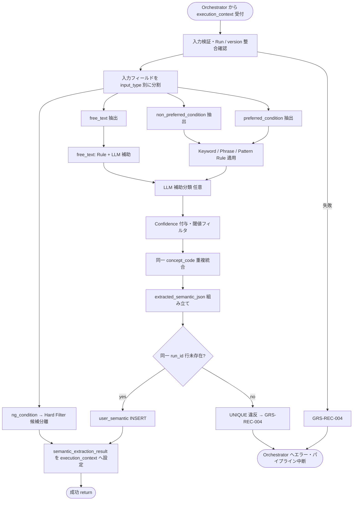

# User Semantic Extractor モジュール仕様書

## 1. ドキュメント情報

| 項目           | 内容                                                     |
| -------------- | -------------------------------------------------------- |
| ドキュメントID | `MOD-RECO-004`                                           |
| ドキュメント名 | User Semantic Extractor モジュール仕様書                 |
| 対象システム   | Gift Recommendation Service（`apps/reco`）               |
| MVP対象        | `○`                                                      |
| 作成日         | 2026-06-26                                               |
| 更新日         | 2026-06-26                                               |

---

## 2. 概要

User Semantic Extractor（Semantic抽出）は、Reco オンライン推薦パイプラインの **User Meaning フェーズ** において、`Recommendation Request` のユーザー入力（好み条件・避けたい条件・自由記述等）から **Semantic Concept** を抽出するモジュールである。`MOD-RECO-001` Recommendation Orchestrator から **`MOD-RECO-003` Config 解決および `MOD-RECO-002` Run INSERT の後**に呼び出され、抽出結果を `semantic_extraction_result` として `execution_context` へ返却する。同時に `user_semantic` テーブルへ IF-DB-RECO-003 に基づき INSERT する。

本モジュールは **Semantic Concept 抽出** に責務を限定し、Feature 値の生成・User Meaning 射影・Retrieval / Matching / Ranking 計算は行わない。`relationship` / `occasion` の構造化入力は **補助文脈** として参照するが、外部条件 Feature 推定（`MOD-RECO-005`）の代替とはしない。

---

## 3. 目的

- `apps/reco` における User Semantic Extractor 実装・単体テストの前提を定義する
- Orchestrator との I/F（`execution_context` 入出力）、失敗時のパイプライン中断（`GRS-REC-004`）を後続実装可能な粒度で整理する
- Recoモジュール一覧・Semantic Concept / Semanticルール定義書・`user_semantic` テーブル定義書との整合を担保する

---

## 4. モジュール基本情報

| 項目 | 内容 |
| ---- | ---- |
| モジュールID | `MOD-RECO-004` |
| モジュール名 | Semantic抽出 |
| 物理名 | `User Semantic Extractor` |
| 分類 | User Meaning |
| 処理種別 | `OL` |
| 配置予定 | `apps/reco/src/reco/application/user-semantic-extractor/**` |
| 所属Epic | `MOD-RECO-004`（Epic Issue #797） |
| MVP対象 | `○` |
| 主な呼び出し元 | `MOD-RECO-001` Recommendation Orchestrator |
| 主な呼び出し先 | Semantic Rule Repository / Semantic Concept Repository / External AI API Client（LLM 補助）、`user_semantic` Repository（IF-DB-RECO-003） |

`MOD-API-*` / `MOD-RECO-*` / `MOD-BATCH-*` 配下のTaskでは、該当モジュールIDの責務範囲に変更を限定する。`MOD-RECO-*` では `apps/reco/src/reco/api/**` の API-INT エンドポイント層を対象に含めない。エンドポイント層の変更が必要な場合は、該当する `API-INT-*` Epic 配下 Task として扱う。

---

## 5. 責務

### 5.1 主責務

- `Recommendation Request` のテキスト入力から **Semantic Concept** を抽出する（Semanticルール定義書 §18.1）
- **好み条件**（`preferred_condition`）と **避けたい条件**（`non_preferred_condition`）を区別し、`input_intent`（`prefer` / `avoid`）を付与する
- **自由入力**（`free_text` / `raw_input_text`）から意味的な手がかりを抽出する
- `relationship_code` / `occasion_code` を **補助文脈** として解釈に利用する（構造化 Feature 推定は `MOD-RECO-005` 責務）
- 抽出時点の **`semantic_config_version_id`**（`execution_context.config_versions` から）に紐づく `semantic_rule` / `semantic_concept` を参照する
- 抽出結果に **`concept_code` / `confidence` / `evidence_texts` / `extraction_method` / `source_type`** を付与する（Semanticルール定義書 §4.1、`user_semantic` §5.3）
- 同一 `concept_code` の重複を **confidence 最大値で統合**する（Semanticルール定義書 §14.2）
- **`confidence >= 0.60`** を通常採用ラインとする（Semanticルール定義書 §9.4）
- 構造化結果を **`semantic_extraction_result`** として `execution_context` へ返却し、後続 `MOD-RECO-005` / `006` / `009` へ引き渡す
- **`user_semantic`** テーブルへ **1 Run あたり 1 行** INSERT する（IF-DB-RECO-003、`user_semantic_テーブル定義書` §7）
- 絶対 NG 条件（`ng_condition`）から **Hard Filter 候補**を分離判定する（Semantic Concept 化と Hard Filter の責務分離。§8.3.3 参照）
- 抽出失敗時に **`GRS-REC-004`** 相当のエラーを Orchestrator へ返却し、パイプライン中断を促す

### 5.2 対象外責務

- `API-INT-002` エンドポイント層（HTTP 受付、reco 側防御的 Validation、OpenAPI スキーマ整合）
- `MOD-RECO-001` Orchestrator の **実行順序制御**・Phase Log 契機管理（Orchestrator が `semantic_extracted` Phase を依頼）
- `MOD-RECO-003` Config / Version 解決
- `MOD-RECO-002` Recommendation Run 記録（Run INSERT は完了済みであることを前提とする）
- **外部条件 Feature 推定**（`relationship` / `occasion` からの Feature 値算出。`MOD-RECO-005` 責務）
- **内部条件 Feature 推定**（`MOD-RECO-006` 責務）
- **User Feature 生成**・**User Meaning 射影**（`MOD-RECO-007` / `008`）
- **Hard Filter 実行**（Pre / Post Hard Filter。`MOD-RECO-011` / `013` 責務）。本モジュールは Hard Filter **候補の分離判定**のみ
- **予算条件**の解釈（Hard Filter / Retrieval 責務）
- **Item Semantic 抽出**（`MOD-RECO-026`、処理種別 `BT`）
- Phase Log / Error Log の **物理書き込み**（`MOD-RECO-028` / `029`。Orchestrator / Error Handler 経由）
- Public API 向けレスポンス形式への変換（`apps/api` 責務）
- OpenAPI / Orval / generated の変更
- DB schema / DDL の変更

---

## 6. 入出力

### 6.1 入力

| 入力 | 型 / 構造 | 必須 | 生成元 | 用途 | 備考 |
| ---- | --------- | ---- | ------ | ---- | ---- |
| `execution_context` | パイプライン実行コンテキスト | `true` | `MOD-RECO-001` | 抽出の起点 | `run_id` / `trace_id` / `config_versions` を含む |
| `execution_context.request` | `RecommendationRequest` | `true` | Orchestrator | テキスト・文脈入力 | RecommendationRequest定義書 |
| `execution_context.request.preferred_condition` | 好み条件 | `false` | Request | preferred 系 Semantic 抽出 | `preferred_text` / `preferred_keywords` |
| `execution_context.request.non_preferred_condition` | 避けたい条件 | `false` | Request | avoid 系 Semantic 抽出 | `non_preferred_text` / `non_preferred_keywords` |
| `execution_context.request.ng_condition` | 絶対 NG 条件 | `false` | Request | Hard Filter 候補分離 | Semantic Concept 化は原則対象外（§8.3.3） |
| `execution_context.request.free_text` | 自由入力 | `false` | Request | 自由文 Semantic 抽出 | `raw_input_text` と同等扱い可 |
| `execution_context.request.relationship` | 贈答関係 | `true` | Request | 補助文脈 | `relationship_code` / `relationship_label` |
| `execution_context.request.occasion` | 贈答目的 | `true` | Request | 補助文脈 | `occasion_code` / `occasion_label` |
| `execution_context.config_versions.semantic_config_version_id` | `uuid` | `true` | `MOD-RECO-003` | ルール / Concept 参照 version | Run 行と整合必須 |
| `execution_context.run_id` | `uuid` | `true` | `MOD-RECO-002` | `user_semantic` 親キー | `recommendation_run_id` |

**入力テキスト全欠損**: `preferred` / `non_preferred` / `ng` / `free_text` がすべて空でも **失敗にしない**。`concepts: []` の結果を返却し `user_semantic` 行を INSERT してよい（`user_semantic_テーブル定義書` §12.1）。

### 6.2 出力

| 出力 | 型 / 構造 | 利用先 | 用途 | 備考 |
| ---- | --------- | ------ | ---- | ---- |
| `semantic_extraction_result` | ドメインオブジェクト（実装 Task で型定義） | `execution_context`、下位 `MOD-RECO-*` | 抽出 Concept 集合の正本（Run 内メモリ） | Semanticルール定義書 §17.2 相当 |
| `semantic_extraction_result.concepts[]` | Concept 配列 | `MOD-RECO-006` / `009` / `013` | 各 Concept の code / intent / confidence 等 | `user_semantic.extracted_semantic_json` と同型 |
| `semantic_extraction_result.hard_filter_candidates[]` | Hard Filter 候補配列 | `MOD-RECO-011` / `013`（間接） | NG / 予算等の分離結果 | Semanticルール定義書 §17.3 相当 |
| `semantic_extraction_result.user_semantic_id` | `uuid` | ログ・下位モジュール | 永続化行 ID | INSERT 成功後 |
| `execution_context.semantic_extraction_result` | 上記への参照 | Orchestrator 受け渡し | 後続フェーズ入力 | Orchestrator Port 契約 |
| `reco_error` | 標準化 reco エラー | Orchestrator | 抽出失敗時 | `GRS-REC-004` |

**`semantic_extraction_result` と DB の関係**: メモリ上の `semantic_extraction_result` は `user_semantic.extracted_semantic_json` と **同内容**とする。Public API には公開しない（`user_semantic_テーブル定義書` §5.3）。

---

## 7. 依存関係

### 7.1 依存モジュール

| 依存先 | 方向 | 用途 | 失敗時の扱い | 備考 |
| ------ | ---- | ---- | ------------ | ---- |
| `MOD-RECO-001` Recommendation Orchestrator | 被呼び出し | OL パイプラインでの抽出契機 | — | User Meaning フェーズ先頭（論理順序 4） |
| `MOD-RECO-003` Config Version Resolver | 間接依存 | `semantic_config_version_id` の前提 | `003` 失敗時は本モジュール未到達 | 解決済み `config_versions` を入力 |
| `MOD-RECO-002` Recommendation Run Recorder | 間接依存 | `recommendation_run_id` の前提 | `002` 失敗時は本モジュール未到達 | Run INSERT 完了後に呼び出し |
| External AI API Client | 呼び出し | LLM 補助分類 | `GRS-REC-004` | 機能×モジュール対応表。server 側のみ |
| `MOD-RECO-024` Reco Error Handler | 間接連携 | 例外の標準化 | 抽出失敗でパイプライン中断 | Orchestrator 経由 |
| `MOD-RECO-028` Phase Log Writer | 間接連携 | `semantic_extracted` Phase 記録 | 記録失敗は推薦結果に影響させない | Orchestrator が契機管理 |
| `MOD-RECO-029` Error Log Writer | 間接連携 | 失敗詳細記録 | `MOD-RECO-024` 経由 | 失敗時 |

**下位利用モジュール（本モジュール出力の利用先）**

| モジュール | 利用する出力 |
| ---------- | ------------ |
| `MOD-RECO-005` External Condition Feature Estimator | `execution_context`（relationship / occasion は Request 直接参照が主。Semantic 結果は補助） |
| `MOD-RECO-006` Internal Condition Feature Estimator | `semantic_extraction_result.concepts[]` |
| `MOD-RECO-009` User Context Builder | `semantic_extraction_result` |
| `MOD-RECO-013` Post Hard Filter Executor | `semantic_extraction_result`（Semantic NG 照合） |

### 7.2 参照データ

| データ | 参照元 | 用途 | version / config | 備考 |
| ------ | ------ | ---- | ---------------- | ---- |
| `semantic_config_version` | DB | 解決済み version の検証 | `execution_context.config_versions` | 読み取りのみ |
| `semantic_concept` | DB | 有効 Concept カタログ | 当該 `semantic_config_version_id` | `is_active = true` のみ出力 |
| `semantic_rule` | DB | keyword / phrase / pattern ルール | 同上 | IF-DB-RECO-001 系 |
| `input_type_rule` | DB | 入力種別ごとの適用方針 | 同上 | `free_text` は `semantic_extraction_then_apply` |
| `recommendation_run` | DB | 親 Run 存在・version 整合 | Run 固定 | INSERT 前に SELECT 検証 |

---

## 8. 処理仕様

### 8.1 処理フロー



### 8.2 処理ステップ

| No | 処理 | 入力 | 出力 | 補足 |
| --: | ---- | ---- | ---- | ---- |
| 1 | 入力検証 | `execution_context` | — | `run_id` / `semantic_config_version_id` / `request.relationship` / `request.occasion` 必須 |
| 2 | Run 整合確認 | `recommendation_run_id` | — | Run 存在、`semantic_config_version_id` が Run 行と一致 |
| 3 | 入力テキスト収集 | Request 各条件フィールド | 正規化テキスト集合 | 空文字はスキップ |
| 4 | input_type 判定 | 各テキスト | `preferred_condition` / `non_preferred_condition` / `free_text` / `ng_condition` | Semanticルール定義書 §3.1 |
| 5 | Hard Filter 候補分離 | `ng_condition` / 予算キーワード | `hard_filter_candidates[]` | Semantic Concept 化しない（§8.3.3） |
| 6 | Rule ベース抽出 | テキスト + `semantic_rule` | Concept 候補 | keyword → phrase → pattern 順 |
| 7 | LLM 補助分類 | 曖昧入力 + Concept カタログ | 追加 Concept 候補 | External AI API Client。timeout は §13 |
| 8 | Confidence 付与・閾値適用 | 候補 Concept | 採用 Concept 集合 | `>= 0.60` 採用（§8.3.2） |
| 9 | 重複統合 | 採用 Concept | 統合後 Concept 集合 | 同一 `concept_code` は confidence 最大 |
| 10 | JSON 組み立て | 統合 Concept | `extracted_semantic_json` | `user_semantic` §5.3 スキーマ |
| 11 | 永続化 | Run ID + JSON | `user_semantic` 行 | IF-DB-RECO-003 INSERT |
| 12 | 結果返却 | 永続化結果 | `semantic_extraction_result` | `execution_context` へ設定 |

**Orchestrator 呼び出し順序（正本: MOD-RECO-001 §8.2.1）**

```text
… → MOD-RECO-003 Config 解決 → MOD-RECO-002 Run INSERT → MOD-RECO-004 Semantic 抽出 → MOD-RECO-005 …
```

本モジュールは User Meaning フェーズの **先頭**（論理順序 4）である。`005` / `006` は本モジュール完了後に Orchestrator が呼び出す（Recoモジュール一覧 §5.2）。

### 8.3 アルゴリズム / 計算仕様

Semanticルール定義書 §18.1（User 入力抽出フロー）および §17.4（MVP 実装方式）に従う。

| 項目 | 内容 |
| ---- | ---- |
| Rule 優先順 | keyword / phrase / pattern ルールを先に適用し、不足分を LLM 補助で補完 |
| MVP 実装方式 | `semantic_rule`（DB）+ seed 投入 + **LLM 補助**（YAML / JSON 辞書併用可） |
| Concept 有効性 | 当該 `semantic_config_version_id` かつ `semantic_concept.is_active = true` のみ出力 |
| relationship / occasion | 構造化コードは **上書きしない**。自由文内の関係・用途言及のみ補助候補として解釈可（Semanticルール定義書 §3.3） |
| 否定文脈 | 「〜ではない」「〜すぎない」は `assertion_polarity` / `input_intent` で表現（Semanticルール定義書 §19.1） |
| 0 件 Concept | 閾値以上 0 件でも成功。`concepts: []` で INSERT |

#### 8.3.1 preferred / non_preferred / free_text の区別

| input_type | Request フィールド | `input_intent` 典型 | 備考 |
| ---------- | ------------------ | --------------------- | ---- |
| `preferred_condition` | `preferred_text`, `preferred_keywords` | `prefer` | 好み・期待方向 |
| `non_preferred_condition` | `non_preferred_text`, `non_preferred_keywords` | `avoid` | 避けたい傾向。**NG 条件ではない** |
| `free_text` | `free_text`, `raw_input_text` | `prefer` / `avoid` / `neutral` | LLM 比重を高めてよい |
| `ng_condition` | `ng_text`, `ng_keywords` | —（Hard Filter へ） | §8.3.3 |

Recoモジュール一覧 §6.3 注意点: `non_preferred` は Hard Filter の NG 条件と **区別**する。

#### 8.3.2 Confidence 閾値

| confidence | 扱い |
| ---------- | ---- |
| `>= 0.80` | 高信頼採用 |
| `0.60〜0.79` | 通常採用 |
| `< 0.60` | 原則除外（監査ログに残してよい） |

正本: Semanticルール定義書 §9.4。Feature への影響は `concept_feature_delta * confidence`（Featureルール定義書）。

#### 8.3.3 ng_condition と Hard Filter の分離

| 入力種別 | 本モジュールの扱い | 後続モジュール |
| -------- | ------------------ | -------------- |
| `ng_condition`（例: アルコール NG） | **Hard Filter 候補**として `hard_filter_candidates[]` へ分離。Semantic Concept 化は **原則しない** | `MOD-RECO-011` Pre Hard Filter |
| `non_preferred_condition` | Semantic Concept 抽出（`avoid` intent） | Feature / Matching |
| 予算・配送・在庫条件 | Semantic 対象外 | Hard Filter / Retrieval |

例外: `ng_text` に意味的ニュアンスのみ含む場合（例: 「派手すぎるのは NG」）は `ng_candidate` intent の Concept 抽出を **許容**するが、カテゴリ / 属性の **絶対除外**は Hard Filter へ委譲する。

#### 8.3.4 Orchestrator Port 契約（概要）

| 方向 | 契約 |
| ---- | ---- |
| 呼び出し | `extract_semantics(execution_context) -> execution_context`（メソッド名は実装 Task で確定） |
| 成功 | `execution_context.semantic_extraction_result` が設定される |
| 失敗 | 例外または `reco_error`（`GRS-REC-004`）を Orchestrator へ返却。後続 `005`〜`023` は **呼ばれない** |
| Phase Log | Orchestrator が `semantic_extracted` の started / succeeded / failed を `MOD-RECO-028` へ依頼 |
| Wiring | User Meaning フェーズ（`004`〜`010`）は **未配線（スタブ）**（MOD-RECO-001 §8.4.2）。本モジュール実装 Task 完了後、フェーズ Wiring Task で差し替え |

---

## 9. データ項目マッピング

| 入力項目 | 内部項目 | 出力項目 | 変換内容 | 備考 |
| -------- | -------- | -------- | -------- | ---- |
| `request.preferred_condition.*` | `inputs[].source_type=preferred_condition` | `concepts[].input_intent=prefer` | Rule / LLM 抽出 | |
| `request.non_preferred_condition.*` | `inputs[].source_type=non_preferred_condition` | `concepts[].input_intent=avoid` | 同上 | |
| `request.free_text` | `inputs[].source_type=free_text` | `concepts[]` | LLM 比重可 | `input_type_rule` 参照 |
| `request.ng_condition.*` | `hard_filter_candidates[]` | — | Hard Filter 分離 | Semantic JSON には含めない |
| `request.relationship.relationship_code` | `context.relationship` | —（補助） | LLM / Rule 文脈 | Feature 推定は `005` |
| `request.occasion.occasion_code` | `context.occasion` | —（補助） | 同上 | |
| `config_versions.semantic_config_version_id` | `version_id` | `user_semantic.semantic_config_version_id` | 列 + JSON 外保持 | Run 行と一致必須 |
| `run_id` | `recommendation_run_id` | `user_semantic.recommendation_run_id` | FK | UNIQUE 1 行 |
| 統合 Concept 集合 | `extracted_semantic_json` | `semantic_extraction_result.concepts[]` | 同内容 | メモリ ↔ DB |
| — | `user_semantic_id` | `semantic_extraction_result.user_semantic_id` | INSERT 後 UUID | |

**`extracted_semantic_json` スキーマ正本**: `user_semantic_テーブル定義書` §5.3。

---

## 10. 状態・例外

### 10.1 状態

本モジュールは Run 内 **1 回実行・1 行 INSERT** のステートレス処理とする（同一 Run 内の再抽出・UPDATE は MVP 禁止）。

| 状態 | 意味 | 遷移条件 | 記録先 |
| ---- | ---- | -------- | ------ |
| — | モジュール内部状態なし | — | — |

Run 全体の状態（`recommendation_run.status`）は `MOD-RECO-002` が管理。本モジュール失敗時は Run を `failed` へ遷移させる（Orchestrator / `002` 連携）。

### 10.2 例外

| 例外 | Error Code | 発生条件 | 呼び出し元への返却 | ログ |
| ---- | ---------- | -------- | ------------------ | ---- |
| Semantic 抽出失敗 | `GRS-REC-004` | Rule / LLM / DB INSERT 等の回復不能エラー | 500 系。パイプライン中断 | Error Log + Phase `semantic_extracted` = failed |
| Run 不整合 | `GRS-REC-004` | Run 未存在、`semantic_config_version_id` 不一致 | 同上 | 同上 |
| 重複 INSERT | `GRS-REC-004` | 同一 `recommendation_run_id` 行が既存 | 同上 | UNIQUE violation |
| LLM / 外部 API 失敗 | `GRS-REC-004` | External AI API Client タイムアウト・5xx | 同上 | secret マスキング |
| 入力検証失敗 | `GRS-REC-004` | 必須 context 欠落（`run_id` / version / relationship / occasion） | 同上 | 同上 |
| 0 件 Concept | —（成功） | 閾値以上 Concept 0 件 | 処理継続 | Phase Log に concept_count=0 |

Error Code の正本はエラーコード定義書。Orchestrator は `MOD-RECO-024` 経由で標準化結果を呼び出し元へ伝播する（MOD-RECO-001 §10.2）。

**リトライ**: 本モジュール内の自動リトライは MVP では **行わない**。LLM 呼び出し失敗は即 `GRS-REC-004`。呼び出し元による再 Run は新規 `recommendation_run` として扱う。

---

## 11. DB / 永続化

| テーブル | 操作 | 主な項目 | トランザクション | 備考 |
| -------- | ---- | -------- | ---------------- | ---- |
| `user_semantic` | INSERT | `recommendation_run_id`, `semantic_config_version_id`, `extracted_semantic_json`, `generated_at` | Run 内 1 回。Orchestrator トランザクション境界は実装 Task で確定 | IF-DB-RECO-003 |
| `semantic_rule` | SELECT | ルール定義 | 読み取りのみ | |
| `semantic_concept` | SELECT | Concept カタログ | 読み取りのみ | |
| `recommendation_run` | SELECT | Run 存在・version | 読み取りのみ | INSERT 前検証 |

**永続化ポリシー**

| 観点 | 方針 |
| ---- | ---- |
| 保存単位 | **1 Run あたり 1 行**（UNIQUE `recommendation_run_id`） |
| UPDATE / DELETE | MVP **禁止** |
| batch | 本テーブルへの DML **禁止** |
| api | 直接 DML **禁止** |

正本: `user_semantic_テーブル定義書` §5.2 / §12。

---

## 12. ログ・メトリクス

| 種別 | 内容 | 出力タイミング | 保存先 | 備考 |
| ---- | ---- | -------------- | ------ | ---- |
| Phase Log 依頼 | `semantic_extracted`（`started` / `succeeded` / `failed`） | 抽出開始 / 完了 / 失敗 | `phase_log`（`MOD-RECO-028`） | Orchestrator が契機管理 |
| 構造化ログ | 抽出サマリ（concept_count, rule_hit_count, llm_used, duration_ms） | 抽出完了時 | アプリログ | `trace_id` 必須。入力全文・API キーは出力しない |
| Error Log 依頼 | `GRS-REC-004` 詳細 | 失敗時 | `error_log`（`MOD-RECO-029`） | `MOD-RECO-024` 経由 |
| Metric 依頼 | `semantic_extraction_latency_ms` | 抽出完了時 | Metric Logger（`MOD-RECO-025`） | MVP 対象 `△` |

### 12.1 メトリクス

| Metric | 内容 | 集計単位 | 用途 |
| ------ | ---- | -------- | ---- |
| `semantic_extraction_latency_ms` | Semantic 抽出処理時間 | Run | ボトルネック分析（ログ・Observability設計書 §11） |
| `semantic_concept_count` | 採用 Concept 件数 | Run | 品質・空抽出監視 |
| `semantic_llm_call_count` | LLM 呼び出し回数 | Run | コスト監視 |
| `semantic_rule_hit_count` | Rule ヒット件数 | Run | Rule カバレッジ |

---

## 13. 性能・非機能

| 観点 | 方針 |
| ---- | ---- |
| レイテンシ | 単独 hard timeout **300ms**（暫定）。User Meaning 一括（`004`〜`010`）**hard 1,000ms** 内に収める（MOD-RECO-001 §13.2） |
| 計算量 | 入力テキスト長 × Rule 数 + LLM 1 回（MVP 目安）。Run 内直列 |
| タイムアウト | LLM 呼び出しは External AI API Client の timeout に従う。超過時 `GRS-REC-004` |
| リトライ | モジュール内自動リトライ **なし**（§10.2） |
| キャッシュ | 同一 Run 内で `semantic_rule` / `semantic_concept` のメモリキャッシュ可 |
| 並列実行 | MVP では入力フィールド間の並列抽出は **行わない**（直列で十分） |

**PoC 連携**: タイムアウト暫定値は PoC（`docs/90_PoC/性能フィジビリティ/`）検証後に更新する（MOD-RECO-001 §13.2 と同方針）。

---

## 14. テスト観点

| No | 観点 | 確認内容 | 種別 |
| --: | ---- | -------- | ---- |
| 1 | 正常系（preferred） | 好みテキストから `prefer` intent の Concept が抽出されること | unit |
| 2 | 正常系（non_preferred） | 避けたい条件から `avoid` intent の Concept が抽出されること | unit |
| 3 | 正常系（free_text） | 自由文から Concept が抽出されること（LLM モック） | unit |
| 4 | 境界値（入力全空） | 全テキスト空でも `concepts: []` で成功し INSERT されること | unit |
| 5 | 境界値（0 件 Concept） | 閾値未満のみの場合 `concepts: []` となること | unit |
| 6 | 境界値（confidence 閾値） | `0.59` 除外、`0.60` 採用されること | unit |
| 7 | 重複統合 | 同一 `concept_code` が confidence 最大で 1 件に統合されること | unit |
| 8 | ng 分離 | `ng_condition` が Hard Filter 候補へ分離され Semantic JSON に混在しないこと | unit |
| 9 | preferred / non_preferred 区別 | 避けたい条件が `prefer` として誤抽出されないこと | unit |
| 10 | version 整合 | 出力 `semantic_config_version_id` が Run / `config_versions` と一致すること | unit |
| 11 | 例外系（Run 不整合） | Run 未存在・version 不一致で `GRS-REC-004` となること | unit |
| 12 | 例外系（重複 INSERT） | 同一 Run への 2 回目呼び出しで失敗すること | unit |
| 13 | 例外系（LLM 失敗） | External AI API 失敗で `GRS-REC-004` となり後続が呼ばれないこと | unit / integration |
| 14 | DB 永続化 | INSERT 後 `extracted_semantic_json` が §5.3 スキーマを満たすこと | integration |
| 15 | Orchestrator 連携 | 明示 DI で Orchestrator が `004` 成功後に `005` を呼ぶこと | integration |
| 16 | ログ | `trace_id` が構造化ログに含まれ、入力全文・secret が含まれないこと | unit |
| 17 | タイムアウト | hard timeout 超過で `GRS-REC-004` となること | integration |

---

## 15. 変更管理

### 15.1 変更履歴

| 日付 | 変更内容 | 関連Issue / PR |
| ---- | -------- | -------------- |
| 2026-06-26 | 初版作成 | Issue #798 |

---

## 16. 未決事項

| No | 論点 | 判断が必要な理由 | 判断者 | 期限 | 備考 |
| --: | ---- | ---------------- | ------ | ---- | ---- |
| 1 | LLM 呼び出しの必須 / 任意境界 | Rule のみで足りる入力と LLM 必須入力の切り分けが実装詳細に影響 | Human + 実装 Task | 実装 Task 着手前 | MVP は LLM 補助 **許容**（Semanticルール定義書 §17.4） |
| 2 | 単体 hard timeout 300ms の妥当性 | PoC 未完了。User Meaning 一括 1,000ms との配分 | Human | PoC 完了後 | MOD-RECO-001 §13.2 参照 |
| 3 | `hard_filter_candidates` の Orchestrator 受け渡し形式 | `011` / `013` への具体的 Port 型は Pre Hard Filter 仕様書 Task で確定 | 実装 Task | `MOD-RECO-011` 仕様書作成時 | 本仕様書では分離 **責務のみ**確定 |

---

## 17. 関連資料

| 種別 | パス / URL | 用途 |
| ---- | ---------- | ---- |
| Recoモジュール一覧 | `docs/05_アプリケーション設計/アプリ/reco/Recoモジュール一覧.md` | モジュール定義・§6.3 Semantic抽出 |
| モジュール一覧 | `docs/05_アプリケーション設計/アプリ/モジュール一覧.md` | 全体配置 |
| 機能×モジュール対応表 | `docs/05_アプリケーション設計/アプリ/機能×モジュール対応表.md` | 入出力・External AI API Client |
| Semantic Concept定義書 | `docs/04_ドメインモデル設計/SemanticConcept定義書.md` | Concept 定義 |
| Semanticルール定義書 | `docs/04_ドメインモデル設計/Semanticルール定義書.md` | 抽出フロー・confidence |
| RecommendationRequest定義書 | `docs/04_ドメインモデル設計/RecommendationRequest定義書.md` | 入力構造 |
| user_semantic テーブル定義書 | `docs/06_実装設計/database/user_semantic_テーブル定義書.md` | 永続化・JSON スキーマ |
| semantic_rule テーブル定義書 | `docs/06_実装設計/database/semantic_rule_テーブル定義書.md` | Rule 参照 |
| インターフェース一覧 | `docs/05_アプリケーション設計/アプリ/インターフェース一覧.md` | IF-DB-RECO-003 |
| エラーコード定義書 | `docs/05_アプリケーション設計/アプリ/エラーコード定義書.md` | `GRS-REC-004` |
| ログ・Observability設計書 | `docs/05_アプリケーション設計/アプリ/ログ・Observability設計書.md` | Phase / Metric |
| MOD-RECO-001 仕様書 | `docs/06_実装設計/reco/MOD-RECO-001_Recommendation Orchestratorモジュール仕様書.md` | 呼び出し順・失敗時中断 |
| MOD-RECO-003 仕様書 | `docs/06_実装設計/reco/MOD-RECO-003_Config Version Resolverモジュール仕様書.md` | version 前提 |
| module-spec テンプレート | `prompts/templates/docs/module-spec.md` | 章構成 |
| Epic Definition | `prompts/definitions/epics/mod-reco-004-user-semantic-extractor/epic.yaml` | allowed_paths |

---

## 18. レビュー観点

- Recoモジュール一覧 §4 / §6.3 のモジュール名・物理名・分類・処理種別・MVP対象と一致している
- モジュール一覧の `MOD-RECO-004` 行と整合している
- Orchestrator（MOD-RECO-001）との I/F（`execution_context` 入出力・`GRS-REC-004` 失敗時中断）が明確である
- `apps/reco/src/reco/api/**`（API-INT エンドポイント層）の変更を本仕様書の実装範囲に含めていない
- `non_preferred` と `ng_condition` / Hard Filter の責務境界が明確である
- `user_semantic` テーブル定義書 §5.3 の JSON スキーマと整合している
- Feature 生成（`005`〜`007`）の責務が混入していない
- secret や `.env` 実値が含まれていない

---

## 19. 備考

- 本仕様書は `MOD-RECO-004` の **Semantic Concept 抽出** 責務に限定する
- 配置パスは Epic `epic_scope.allowed_paths` に従い `apps/reco/src/reco/application/user-semantic-extractor/**` を正とする（旧想定 `apps/reco/src/modules/**` は採用しない）
- Orchestrator からの呼び出しは MVP では **スタブ**（MOD-RECO-001 §8.4.2）。本モジュール implementation Task 完了後、User Meaning フェーズ Wiring Task で `build_default_stub_ports` を差し替える
- `relationship` / `occasion` の構造化 Feature 推定は `MOD-RECO-005` が担当する。本モジュールは自由文内の関係・用途言及を **補助的**に解釈するにとどめる（Semanticルール定義書 §3.3）
- Item 側の対称モジュールは `MOD-RECO-026` Item Semantic Generator（処理種別 `BT`）である。抽出フローは Semanticルール定義書 §18.2 を参照するが、本 Epic scope 外
