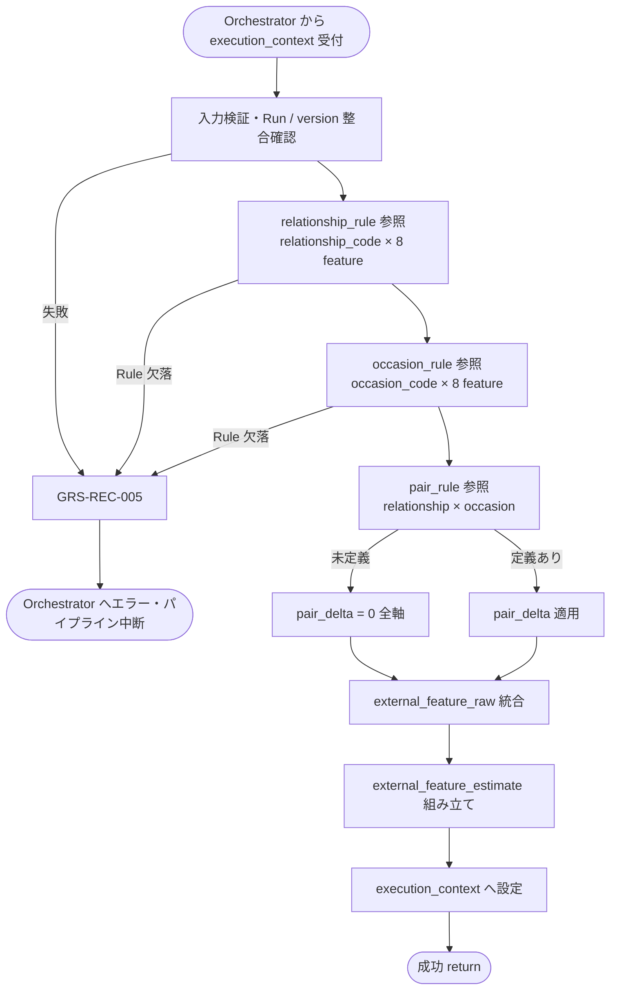

# External Condition Feature Estimator モジュール仕様書

## 1. ドキュメント情報

| 項目           | 内容                                                     |
| -------------- | -------------------------------------------------------- |
| ドキュメントID | `MOD-RECO-005`                                           |
| ドキュメント名 | External Condition Feature Estimator モジュール仕様書    |
| 対象システム   | Gift Recommendation Service（`apps/reco`）               |
| MVP対象        | `○`                                                      |
| 作成日         | 2026-06-26                                               |
| 更新日         | 2026-06-26                                               |

---

## 2. 概要

External Condition Feature Estimator（外部条件特徴量推定）は、Reco オンライン推薦パイプラインの **User Meaning フェーズ** において、`Recommendation Request` の構造化入力である **relationship（贈答関係）** と **occasion（贈答目的）** から、MVP 8 軸 Feature の **外部条件由来 raw 値**（`external_feature_raw`）を推定するモジュールである。`MOD-RECO-001` Recommendation Orchestrator から **`MOD-RECO-004` User Semantic Extractor の直後**に呼び出され、推定結果を `external_feature_estimate` として `execution_context` へ返却する。

本モジュールは **外部条件 Feature 推定** に責務を限定し、Semantic Concept 抽出・内部条件（好み / 避けたい / 自由文）Feature 推定・User Feature 統合・正規化・User Meaning 射影・Retrieval / Matching / Ranking 計算は行わない。`semantic_extraction_result` は **補助文脈** として参照し得るが、relationship / occasion の構造化 Feature 推定の **代替とはしない**（`MOD-RECO-004` モジュール仕様書 §2）。

---

## 3. 目的

- `apps/reco` における External Condition Feature Estimator 実装・単体テストの前提を定義する
- Orchestrator との I/F（`execution_context` 入出力）、失敗時のパイプライン中断（`GRS-REC-005`）を後続実装可能な粒度で整理する
- Recoモジュール一覧・Feature定義書・Featureルール定義書・Orchestrator 仕様書との整合を担保する

---

## 4. モジュール基本情報

| 項目 | 内容 |
| ---- | ---- |
| モジュールID | `MOD-RECO-005` |
| モジュール名 | 外部条件特徴量推定 |
| 物理名 | `External Condition Feature Estimator` |
| 分類 | User Meaning |
| 処理種別 | `OL` |
| 配置予定 | `apps/reco/src/reco/application/external-condition-feature-estimator/**` |
| 所属Epic | `MOD-RECO-005`（Epic Issue #805） |
| MVP対象 | `○` |
| 主な呼び出し元 | `MOD-RECO-001` Recommendation Orchestrator |
| 主な呼び出し先 | Feature Rule Repository（`relationship_rule` / `occasion_rule` / `pair_rule` 参照） |

`MOD-API-*` / `MOD-RECO-*` / `MOD-BATCH-*` 配下のTaskでは、該当モジュールIDの責務範囲に変更を限定する。`MOD-RECO-*` では `apps/reco/src/reco/api/**` の API-INT エンドポイント層を対象に含めない。エンドポイント層の変更が必要な場合は、該当する `API-INT-*` Epic 配下 Task として扱う。

---

## 5. 責務

### 5.1 主責務

- `Recommendation Request` の **`relationship`**（`relationship_code` / `relationship_label`）から、贈答関係性に応じた Feature **基準値**（`relationship_feature`）を `relationship_rule` により解決する（Featureルール定義書 §6）
- `Recommendation Request` の **`occasion`**（`occasion_code` / `occasion_label`）から、贈答用途に応じた Feature **基準値**（`occasion_feature`）を `occasion_rule` により解決する（Featureルール定義書 §8）
- `relationship_code` × `occasion_code` の組み合わせに対し、**Pair Rule**（`pair_rule`）による Feature **補正値**（`pair_delta`）を適用する。未定義組み合わせは **補正 0** とする（Featureルール定義書 §9.2）
- 上記を Featureルール定義書 §12.2 の統合式に従い **`external_feature_raw`**（8 軸）へ集約する
- 推定時点の **`semantic_config_version_id`**（`execution_context.config_versions` から）に紐づく Rule を参照する
- 構造化結果を **`external_feature_estimate`** として `execution_context` へ返却し、後続 `MOD-RECO-007` User Feature Generator へ引き渡す
- 推定失敗時に **`GRS-REC-005`** 相当のエラーを Orchestrator へ返却し、パイプライン中断を促す

### 5.2 対象外責務

- `API-INT-002` エンドポイント層（HTTP 受付、reco 側防御的 Validation、OpenAPI スキーマ整合）
- `MOD-RECO-001` Orchestrator の **実行順序制御**・Phase Log 契機管理
- `MOD-RECO-003` Config / Version 解決
- `MOD-RECO-002` Recommendation Run 記録（Run INSERT は完了済みであることを前提とする）
- `MOD-RECO-004` **Semantic Concept 抽出**（本モジュールは Semantic 結果を補助参照するにとどめる）
- **内部条件 Feature 推定**（`preferred` / `non_preferred` / `free text`。`MOD-RECO-006` 責務）
- **User Feature 統合**・**sigmoid 正規化**・**`user_feature` 永続化**（`MOD-RECO-007` 責務）
- **User Meaning 射影**（`MOD-RECO-008` 責務）
- **Concept Feature Rule** による Semantic 由来 Delta（`MOD-RECO-006` / `007` 責務）
- relationship / occasion **マスタの CRUD**（`MOD-API-012` Master Repository / DB seed 責務）
- Hard Filter 実行（`MOD-RECO-011` / `013` 責務）
- Phase Log / Error Log の **物理書き込み**（`MOD-RECO-028` / `029`。Orchestrator / Error Handler 経由）
- Public API 向けレスポンス形式への変換（`apps/api` 責務）
- OpenAPI / Orval / generated の変更
- DB schema / DDL の変更

---

## 6. 入出力

### 6.1 入力

| 入力 | 型 / 構造 | 必須 | 生成元 | 用途 | 備考 |
| ---- | --------- | ---- | ------ | ---- | ---- |
| `execution_context` | パイプライン実行コンテキスト | `true` | `MOD-RECO-001` | 推定の起点 | `run_id` / `trace_id` / `config_versions` を含む |
| `execution_context.request` | `RecommendationRequest` | `true` | Orchestrator | 外部条件入力 | RecommendationRequest定義書 |
| `execution_context.request.relationship` | 贈答関係 | `true` | Request | **主入力** | `relationship_code` / `relationship_label` |
| `execution_context.request.occasion` | 贈答目的 | `true` | Request | **主入力** | `occasion_code` / `occasion_label` |
| `execution_context.config_versions.semantic_config_version_id` | `uuid` | `true` | `MOD-RECO-003` | Rule 参照 version | Run 行と整合必須 |
| `execution_context.run_id` | `uuid` | `true` | `MOD-RECO-002` | Run 整合検証 | `recommendation_run_id` |
| `execution_context.semantic_extraction_result` | Semantic 抽出結果 | `false` | `MOD-RECO-004` | **補助文脈**（任意） | 構造化 Feature 推定の代替にしない |
| `execution_context.recommendation_run` | Run 行スナップショット | `false` | `MOD-RECO-002` | `pair_id` 参照（任意） | Pair 解決済み Run。未設定時は code から Rule 参照 |

**入力の正本**: relationship / occasion の構造化コードは **Request を正**とする。`MOD-RECO-004` は自由文内の関係・用途言及を補助解釈するにとどめ、本モジュールの主入力を上書きしない（Semanticルール定義書 §3.3、`MOD-RECO-004` §2）。

### 6.2 出力

| 出力 | 型 / 構造 | 利用先 | 用途 | 備考 |
| ---- | --------- | ------ | ---- | ---- |
| `external_feature_estimate` | ドメインオブジェクト（実装 Task で型定義） | `execution_context`、下位 `MOD-RECO-*` | 外部条件 Feature raw 推定の正本（Run 内メモリ） | Featureルール定義書 §12.2 相当 |
| `external_feature_estimate.relationship_code` | `string` | ログ・下位モジュール | 入力のエコー | |
| `external_feature_estimate.occasion_code` | `string` | 同上 | 入力のエコー | |
| `external_feature_estimate.relationship_feature` | `Record<feature_code, number>` | `MOD-RECO-007` | Relationship 基準値（8 軸） | `relationship_rule` 由来 |
| `external_feature_estimate.occasion_feature` | `Record<feature_code, number>` | `MOD-RECO-007` | Occasion 基準値（8 軸） | `occasion_rule` 由来 |
| `external_feature_estimate.pair_delta` | `Record<feature_code, number>` | `MOD-RECO-007` | Pair 補正値（8 軸） | 未定義時は全軸 `0` |
| `external_feature_estimate.external_feature_raw` | `Record<feature_code, number>` | `MOD-RECO-007` | 統合後外部条件 raw（8 軸） | §8.3.2 の統合式結果 |
| `external_feature_estimate.semantic_config_version_id` | `uuid` | 再現性・監査 | Rule 参照 version | `config_versions` と一致必須 |
| `external_feature_estimate.estimation_method` | `rule` 固定（MVP） | ログ | 推定方式 | LLM 不使用 |
| `execution_context.external_feature_estimate` | 上記への参照 | Orchestrator 受け渡し | 後続フェーズ入力 | Orchestrator Port 契約 |
| `reco_error` | 標準化 reco エラー | Orchestrator | 推定失敗時 | `GRS-REC-005` |

**永続化**: 本モジュールは **DB へ INSERT しない**。`user_feature` への永続化は `MOD-RECO-007` が担当する（`user_feature_テーブル定義書` §5.4）。Relationship / Occasion / Pair の寄与分解も MVP では DB に保存しない（`source_type: aggregated` 方針、`user_feature_テーブル定義書` §5.3）。

**MVP 8 軸 `feature_code` 正本**: `formality`, `safety`, `brand_appropriateness`, `emotion`, `novelty`, `intimacy`, `symbolic_identity`, `story_richness`（Feature定義書 / enum定義書 §6.16）。

---

## 7. 依存関係

### 7.1 依存モジュール

| 依存先 | 方向 | 用途 | 失敗時の扱い | 備考 |
| ------ | ---- | ---- | ------------ | ---- |
| `MOD-RECO-001` Recommendation Orchestrator | 被呼び出し | OL パイプラインでの推定契機 | — | User Meaning フェーズ（論理順序 5） |
| `MOD-RECO-003` Config Version Resolver | 間接依存 | `semantic_config_version_id` の前提 | `003` 失敗時は本モジュール未到達 | 解決済み `config_versions` を入力 |
| `MOD-RECO-002` Recommendation Run Recorder | 間接依存 | `recommendation_run_id` / `pair_id` の前提 | `002` 失敗時は本モジュール未到達 | Run INSERT 完了後に呼び出し |
| `MOD-RECO-004` User Semantic Extractor | 間接依存 | `semantic_extraction_result`（補助） | `004` 失敗時は本モジュール未到達 | 主入力は Request の relationship / occasion |
| `MOD-RECO-024` Reco Error Handler | 間接連携 | 例外の標準化 | 推定失敗でパイプライン中断 | Orchestrator 経由 |
| `MOD-RECO-028` Phase Log Writer | 間接連携 | User Meaning フェーズ記録 | 記録失敗は推薦結果に影響させない | MVP では専用 `phase_name` なし（§12） |
| `MOD-RECO-029` Error Log Writer | 間接連携 | 失敗詳細記録 | `MOD-RECO-024` 経由 | 失敗時 |

**下位利用モジュール（本モジュール出力の利用先）**

| モジュール | 利用する出力 |
| ---------- | ------------ |
| `MOD-RECO-007` User Feature Generator | `external_feature_estimate`（`external_feature_raw` および分解値） |
| `MOD-RECO-006` Internal Condition Feature Estimator | 直接利用なし（Orchestrator が並列的に `006` を呼び、`007` で統合） |

### 7.2 参照データ

| データ | 参照元 | 用途 | version / config | 備考 |
| ------ | ------ | ---- | ---------------- | ---- |
| `relationship_rule` | DB（IF-DB-RECO-001 系） | Relationship 基準値 | 当該 `semantic_config_version_id` | `is_active = true` のみ。読み取りのみ |
| `occasion_rule` | DB | Occasion 基準値 | 同上 | 同上 |
| `pair_rule` | DB | Relationship × Occasion 補正 | 同上 | 未定義組み合わせは補正 0 |
| `relationship_master` / `occasion_master` | DB（間接） | コード妥当性の論理参照 | Master 正本 | Request 検証は API 層が先行。本モジュールは Rule 行存在を検証 |
| `feature_integration_rule` | DB | 外部条件統合重み | 同上 | §8.3.2 の `relationship_weight` / `occasion_weight` |
| `recommendation_run` | DB | Run 存在・version・`pair_id` 整合 | Run 固定 | SELECT 検証 |
| `semantic_config_version` | DB | version 有効性 | `config_versions` | 読み取りのみ |

**Master 参照**: 機能×モジュール対応表は Relationship / Occasion の Master を `MOD-API-012` Master Repository と記載する。本モジュールは **Rule テーブル参照**を主とし、Master はコード体系の論理正本として扱う（api 経由の Master 取得は本 Epic scope 外）。

---

## 8. 処理仕様

### 8.1 処理フロー



### 8.2 処理ステップ

| No | 処理 | 入力 | 出力 | 補足 |
| --: | ---- | ---- | ---- | ---- |
| 1 | 入力検証 | `execution_context` | — | `run_id` / `semantic_config_version_id` / `request.relationship` / `request.occasion` 必須 |
| 2 | Run 整合確認 | `recommendation_run_id` | — | Run 存在、`semantic_config_version_id` が Run 行と一致 |
| 3 | Relationship Rule 解決 | `relationship_code`, version | `relationship_feature`（8 軸） | 12 分類いずれか。欠落行は失敗 |
| 4 | Occasion Rule 解決 | `occasion_code`, version | `occasion_feature`（8 軸） | 15 分類いずれか。欠落行は失敗 |
| 5 | Pair Rule 解決 | `relationship_code` × `occasion_code` | `pair_delta`（8 軸） | 未定義は全軸 `0`（成功扱い） |
| 6 | 外部条件 raw 統合 | 上記 3 集合 | `external_feature_raw`（8 軸） | §8.3.2 |
| 7 | 結果組み立て | 統合結果 + メタデータ | `external_feature_estimate` | `estimation_method: rule` |
| 8 | 結果返却 | 組み立て結果 | `execution_context.external_feature_estimate` | 後続 `006` / `007` へ |

**Orchestrator 呼び出し順序（正本: MOD-RECO-001 §8.2.1）**

```text
… → MOD-RECO-004 Semantic 抽出 → MOD-RECO-005 外部条件 Feature 推定 → MOD-RECO-006 内部条件 Feature 推定 → MOD-RECO-007 …
```

本モジュールは User Meaning フェーズの **論理順序 5** である。`MOD-RECO-006` は本モジュール完了後に Orchestrator が呼び出す（Recoモジュール一覧 §5.2）。フロー図上は Semantic 抽出後に外部・内部が分岐するが、**物理呼び出しは直列**（`005` → `006`）とする。

### 8.3 アルゴリズム / 計算仕様

Featureルール定義書 §6〜§9・§12.2・§22 に従う。MVP は **Rule ベースのみ**（LLM 不使用）。

| 項目 | 内容 |
| ---- | ---- |
| 推定方式 | `relationship_rule` + `occasion_rule` + `pair_rule` のルックアップと算術統合 |
| Rule version | `execution_context.config_versions.semantic_config_version_id` に紐づく行のみ |
| Pair 未定義 | `pair_delta[axis] = 0`（Featureルール定義書 §9.2） |
| 値域（基準値） | `relationship_feature` / `occasion_feature` の各軸は Rule 定義どおり **0.0〜1.0** を想定 |
| 値域（統合後） | `external_feature_raw` は Pair Delta 加算により **0.0〜1.0 外**となり得る（Featureルール定義書 §6.2）。clip / sigmoid は `MOD-RECO-007` 責務 |
| Semantic 補助 | `semantic_extraction_result` は監査ログまたは将来拡張用。MVP では **統合式に加算しない** |

#### 8.3.1 MVP 8 軸と外部条件の主影響

| 区分 | feature | 外部条件での主な影響源 |
| ---- | ------- | ---------------------- |
| Social | `formality` | relationship / occasion / pair |
| Social | `safety` | relationship / occasion / pair |
| Social | `brand_appropriateness` | relationship / occasion / pair |
| Symbolic | `emotion` | relationship / occasion / pair |
| Symbolic | `novelty` | relationship / occasion / pair |
| Symbolic | `intimacy` | relationship / occasion / pair |
| Symbolic | `symbolic_identity` | relationship / occasion / pair |
| Symbolic | `story_richness` | relationship / occasion / pair |

正本: Feature定義書・Featureルール定義書 §6.1 / §8.1。Social 3 軸は relationship / occasion の影響が特に強いが、MVP では **8 軸すべて**に Rule 値を保持する。

#### 8.3.2 外部条件 raw 統合式（MVP）

Featureルール定義書 §12.2・§12.3 を正とする。

```text
external_feature_raw[axis]
  = relationship_weight * relationship_feature[axis]
  + occasion_weight   * occasion_feature[axis]
  + pair_delta[axis]
```

| パラメータ | MVP 初期値 | 参照元 |
| ---------- | ---------: | ------ |
| `relationship_weight` | `0.50` | `feature_integration_rule`（version 解決済み） |
| `occasion_weight` | `0.50` | 同上 |
| `pair_delta` 係数 | `1.00`（delta 自体に内包） | Featureルール定義書 §12.3 |

**例（概念）**: `boss` × `birthday` は Pair Rule により intimacy / emotion を抑制し formality / safety を強める（Featureルール定義書 §9.3 一覧参照）。

#### 8.3.3 Rule 欠落・コード異常時の扱い

| 条件 | 扱い | Error Code |
| ---- | ---- | ---------- |
| `relationship_code` に対し当該 version の `relationship_rule` が 8 軸いずれか欠落 | 失敗 | `GRS-REC-005` |
| `occasion_code` に対し当該 version の `occasion_rule` が 8 軸いずれか欠落 | 失敗 | `GRS-REC-005` |
| `pair_rule` 未定義 | **成功**。`pair_delta` 全軸 `0` | — |
| `semantic_config_version_id` 不一致 / Run 未存在 | 失敗 | `GRS-REC-005` |
| Request の relationship / occasion 欠落 | 失敗 | `GRS-REC-005` |

#### 8.3.4 Orchestrator Port 契約（概要）

| 方向 | 契約 |
| ---- | ---- |
| 呼び出し | `estimate_external_features(execution_context) -> execution_context`（メソッド名は実装 Task で確定） |
| 成功 | `execution_context.external_feature_estimate` が設定される |
| 失敗 | 例外または `reco_error`（`GRS-REC-005`）を Orchestrator へ返却。後続 `006`〜`023` は **呼ばれない** |
| Phase Log | MVP では専用 `phase_name` なし（§12）。Orchestrator は User Meaning 一括ウォッチドッグを適用 |
| Wiring | User Meaning フェーズ（`004`〜`010`）は **未配線（スタブ）**（MOD-RECO-001 §8.4.2）。本モジュール実装 Task 完了後、フェーズ Wiring Task で差し替え |

---

## 9. データ項目マッピング

| 入力項目 | 内部項目 | 出力項目 | 変換内容 | 備考 |
| -------- | -------- | -------- | -------- | ---- |
| `request.relationship.relationship_code` | `relationship_code` | `external_feature_estimate.relationship_code` | エコー | Request 正本 |
| `request.occasion.occasion_code` | `occasion_code` | `external_feature_estimate.occasion_code` | エコー | Request 正本 |
| `relationship_rule.feature_base_value` | `relationship_feature[axis]` | 同上キー | Rule ルックアップ | 8 行 / code |
| `occasion_rule.feature_base_value` | `occasion_feature[axis]` | 同上キー | Rule ルックアップ | 8 行 / code |
| `pair_rule.*_delta` | `pair_delta[axis]` | 同上キー | 補正適用 or `0` | signed delta |
| 統合結果 | `external_feature_raw[axis]` | `external_feature_estimate.external_feature_raw` | §8.3.2 | 未正規化 |
| `config_versions.semantic_config_version_id` | `version_id` | `external_feature_estimate.semantic_config_version_id` | エコー | Run と一致必須 |
| — | — | `execution_context.external_feature_estimate` | コンテキストへ格納 | `007` 入力 |

**`semantic_extraction_result` との関係**: 自由文由来の relationship / occasion 言及は `004` が Semantic Concept 化する。本モジュールは **構造化コードのみ**を Feature 推定に用い、Semantic JSON とは独立した正本を持つ。

---

## 10. 状態・例外

### 10.1 状態

本モジュールは Run 内 **1 回実行・ステートレス**（再推定・UPDATE は MVP 禁止）とする。

| 状態 | 意味 | 遷移条件 | 記録先 |
| ---- | ---- | -------- | ------ |
| — | モジュール内部状態なし | — | — |

Run 全体の状態（`recommendation_run.status`）は `MOD-RECO-002` が管理。本モジュール失敗時は Run を `failed` へ遷移させる（Orchestrator / `002` 連携）。

### 10.2 例外

| 例外 | Error Code | 発生条件 | 呼び出し元への返却 | ログ |
| ---- | ---------- | -------- | ------------------ | ---- |
| 外部条件 Feature 推定失敗 | `GRS-REC-005` | Rule 欠落・DB 参照失敗・統合エラー等の回復不能エラー | 500 系。パイプライン中断 | Error Log + 構造化ログ |
| Run 不整合 | `GRS-REC-005` | Run 未存在、`semantic_config_version_id` 不一致 | 同上 | 同上 |
| 入力検証失敗 | `GRS-REC-005` | 必須 context / relationship / occasion 欠落 | 同上 | 同上 |
| Pair Rule 未定義 | —（成功） | 当該組み合わせの `pair_rule` なし | 処理継続（`pair_delta = 0`） | 構造化ログに `pair_rule_applied: false` 可 |

Error Code の正本はエラーコード定義書。Orchestrator は `MOD-RECO-005`〜`009` 失敗を **User Feature 系失敗**として `GRS-REC-005` に集約する（MOD-RECO-001 §10.2）。

**リトライ**: 本モジュール内の自動リトライは MVP では **行わない**。呼び出し元による再 Run は新規 `recommendation_run` として扱う。

---

## 11. DB / 永続化

| テーブル | 操作 | 主な項目 | トランザクション | 備考 |
| -------- | ---- | -------- | ---------------- | ---- |
| — | — | なし | — | 本モジュールは DB へ書き込まない |

**読み取りのみ**

| テーブル | 操作 | 主な項目 | トランザクション | 備考 |
| -------- | ---- | -------- | ---------------- | ---- |
| `relationship_rule` | SELECT | `relationship_code`, `feature_code`, `feature_base_value` | 読み取りのみ | version 絞り込み |
| `occasion_rule` | SELECT | `occasion_code`, `feature_code`, `feature_base_value` | 読み取りのみ | 同上 |
| `pair_rule` | SELECT | `relationship_code`, `occasion_code`, `*_delta` | 読み取りのみ | 0 件は正常 |
| `feature_integration_rule` | SELECT | 外部条件統合重み | 読み取りのみ | §8.3.2 |
| `recommendation_run` | SELECT | Run 存在・version・`pair_id` | 読み取りのみ | 整合検証 |

**永続化ポリシー**

| 観点 | 方針 |
| ---- | ---- |
| 本モジュール出力 | **メモリのみ**（`execution_context`） |
| 最終 User Feature | `MOD-RECO-007` が `user_feature` へ 8 行 INSERT（IF-DB-RECO-003） |
| 寄与分解 | MVP では DB に保存しない（`user_feature.source_type = aggregated` 固定） |

---

## 12. ログ・メトリクス

| 種別 | 内容 | 出力タイミング | 保存先 | 備考 |
| ---- | ---- | -------------- | ------ | ---- |
| 構造化ログ | 推定サマリ（`relationship_code`, `occasion_code`, `pair_rule_applied`, `duration_ms`） | 推定完了時 | アプリログ | `trace_id` 必須。Rule 実値の全量ダンプは避ける |
| Error Log 依頼 | `GRS-REC-005` 詳細 | 失敗時 | `error_log`（`MOD-RECO-029`） | `MOD-RECO-024` 経由 |
| Metric 依頼 | `external_feature_estimation_latency_ms` | 推定完了時 | Metric Logger（`MOD-RECO-025`） | MVP 対象 `△` |

**Phase Log（MVP）**: `phase_log.phase_name`（`recommendation_run_phase_name`）には、外部条件推定専用の値は **定義されていない**（`semantic_extracted` の次は `user_feature_generated`）。本モジュール単位の Phase Log 依頼は MVP では **行わない**。Orchestrator / `MOD-RECO-028` は User Meaning 一括または `user_feature_generated`（`007`）で記録する（ログ・Observability設計書 §10.3、`phase_log_テーブル定義書` §11.2）。

### 12.1 メトリクス

| Metric | 内容 | 集計単位 | 用途 |
| ------ | ---- | -------- | ---- |
| `external_feature_estimation_latency_ms` | 外部条件 Feature 推定処理時間 | Run | ボトルネック分析 |
| `external_pair_rule_applied` | Pair Rule 適用有無（0/1） | Run | Rule カバレッジ監視 |

---

## 13. 性能・非機能

### 13.1 方針概要

| 観点 | 方針 |
| ---- | ---- |
| レイテンシ | MVP 初版では **モジュール単体 hard timeout を設けない**。User Meaning 一括（`004`〜`010`）**hard 1,000ms** を上位ガードとする（MOD-RECO-001 §13.2） |
| 計算量 | Rule ルックアップ O(1)（8 軸 × 固定コード）+ 軽量算術。DB は version + code インデックス利用 |
| タイムアウト | 本モジュール単体の hard 上限は **MVP では未定義**。Orchestrator の User Meaning 一括ウォッチドッグ（1,000ms）が適用される |
| リトライ | モジュール内自動リトライ **なし**（§10.2） |
| キャッシュ | 同一 Run 内で Rule 行のメモリキャッシュ可。同一 `semantic_config_version_id` の Run 間キャッシュは実装 Task で検討 |
| 並列実行 | MVP では `005` と `006` を Orchestrator が **直列**呼び出し。モジュール内並列は不要 |

### 13.2 タイムアウト（MVP）

| 種別 | 対象 | MVP 値 | 超過時の扱い |
| ---- | ---- | ------ | ------------ |
| hard | `MOD-RECO-005` 単体 | **なし**（PoC 後に確定） | — |
| hard（上位） | User Meaning 一括（`004`〜`010`） | **1,000ms** | 該当 `GRS-REC-004`〜`007`（MOD-RECO-001 §13.2） |
| hard（全体） | 推薦パイプライン全体 | **4,000ms** | `GRS-REC-101` |

---

## 14. テスト観点

| No | 観点 | 確認内容 | 種別 |
| --: | ---- | -------- | ---- |
| 1 | 正常系（代表 relationship） | `boss` 等のコードで `relationship_feature` 8 軸が Rule どおり取得されること | unit |
| 2 | 正常系（代表 occasion） | `birthday` 等のコードで `occasion_feature` 8 軸が Rule どおり取得されること | unit |
| 3 | 正常系（Pair 適用） | `lover` × `birthday` で `pair_delta` が非ゼロとなり統合結果に反映されること | unit |
| 4 | 正常系（Pair 未定義） | 未定義組み合わせで `pair_delta` 全ゼロ・成功すること | unit |
| 5 | 統合式 | `external_feature_raw` が §8.3.2 の重み付き平均 + delta と一致すること | unit |
| 6 | 境界値（other × other） | Pair 補正なしで Relationship / Occasion 基準値のみ統合されること | unit |
| 7 | version 整合 | 出力 `semantic_config_version_id` が Run / `config_versions` と一致すること | unit |
| 8 | 例外系（Rule 欠落） | relationship または occasion の Rule 欠落で `GRS-REC-005` となること | unit |
| 9 | 例外系（Run 不整合） | Run 未存在・version 不一致で `GRS-REC-005` となること | unit |
| 10 | 例外系（入力欠落） | relationship / occasion 欠落で `GRS-REC-005` となること | unit |
| 11 | Semantic 非代替 | `semantic_extraction_result` の有無が構造化コード推定結果を上書きしないこと | unit |
| 12 | DB 非永続化 | 成功時も本モジュールが `user_feature` 等へ INSERT しないこと | unit |
| 13 | Orchestrator 連携 | 明示 DI で Orchestrator が `004` 成功後に `005` を呼び、`005` 失敗時に `006` 以降を呼ばないこと | integration |
| 14 | ログ | `trace_id` が構造化ログに含まれ、secret が含まれないこと | unit |
| 15 | タイムアウト | User Meaning 一括 hard 1,000ms 超過で `GRS-REC-005` 系となること（単体 hard は MVP 未設定） | integration |
| 16 | 出力受け渡し | `external_feature_estimate` が `execution_context` に格納され `007` が参照できること | unit / integration |

---

## 15. 変更管理

### 15.1 変更履歴

| 日付 | 変更内容 | 関連Issue / PR |
| ---- | -------- | -------------- |
| 2026-06-26 | 初版作成 | Issue #806 |

---

## 16. 未決事項

| No | 論点 | 判断が必要な理由 | 判断者 | 期限 | 備考 |
| --: | ---- | ---------------- | ------ | ---- | ---- |
| 1 | `MOD-RECO-005` 単体 soft / hard timeout | PoC 実測前のため数値未確定 | Human | PoC 完了後 | §13.2。MVP 初版は一括 1,000ms のみ |
| 2 | 外部 / 内部 Feature 推定の専用 `phase_name` 追加 | 現行 `phase_log` CHECK に該当値なし | Human / Observability Task | 任意 | §12。構造化ログで代替 |
| 3 | `external_feature_raw` 分解値の Run 永続化 | 監査・再現性と storage のトレードオフ | Human | 将来 | 現状は `007` 統合後のみ `user_feature` 保存 |

---

## 17. 関連資料

| 種別 | パス / URL | 用途 |
| ---- | ---------- | ---- |
| Recoモジュール一覧 | `docs/05_アプリケーション設計/アプリ/reco/Recoモジュール一覧.md` | モジュール定義・§6.4 外部条件特徴量推定 |
| モジュール一覧 | `docs/05_アプリケーション設計/アプリ/モジュール一覧.md` | 全体配置 |
| 機能×モジュール対応表 | `docs/05_アプリケーション設計/アプリ/機能×モジュール対応表.md` | 入出力・Master 依存 |
| Feature定義書 | `docs/04_ドメインモデル設計/Feature定義書.md` | 8 軸定義 |
| Featureルール定義書 | `docs/04_ドメインモデル設計/Featureルール定義書.md` | Rule・統合式・Pair Rule |
| RecommendationRequest定義書 | `docs/04_ドメインモデル設計/RecommendationRequest定義書.md` | relationship / occasion 入力 |
| relationship_rule テーブル定義書 | `docs/06_実装設計/database/relationship_rule_テーブル定義書.md` | Rule 物理化 |
| occasion_rule テーブル定義書 | `docs/06_実装設計/database/occasion_rule_テーブル定義書.md` | Rule 物理化 |
| pair_rule テーブル定義書 | `docs/06_実装設計/database/pair_rule_テーブル定義書.md` | Pair 補正 |
| user_feature テーブル定義書 | `docs/06_実装設計/database/user_feature_テーブル定義書.md` | 永続化は `007` 責務 |
| インターフェース一覧 | `docs/05_アプリケーション設計/アプリ/インターフェース一覧.md` | IF-DB-RECO-001 |
| エラーコード定義書 | `docs/05_アプリケーション設計/アプリ/エラーコード定義書.md` | `GRS-REC-005` |
| ログ・Observability設計書 | `docs/05_アプリケーション設計/アプリ/ログ・Observability設計書.md` | Phase / Metric |
| MOD-RECO-001 仕様書 | `docs/06_実装設計/reco/MOD-RECO-001_Recommendation Orchestratorモジュール仕様書.md` | 呼び出し順・失敗時中断 |
| MOD-RECO-004 仕様書 | `docs/06_実装設計/reco/MOD-RECO-004_User Semantic Extractorモジュール仕様書.md` | Semantic との責務境界 |
| module-spec テンプレート | `prompts/templates/docs/module-spec.md` | 章構成 |
| Epic Definition | `prompts/definitions/epics/mod-reco-005-external-condition-feature-estimator/epic.yaml` | allowed_paths |

---

## 18. レビュー観点

- Recoモジュール一覧 §4 / §6.4 のモジュール名・物理名・分類・処理種別・MVP対象と一致している
- モジュール一覧の `MOD-RECO-005` 行と整合している
- Orchestrator（MOD-RECO-001）との I/F（`execution_context` 入出力・`GRS-REC-005` 失敗時中断）が明確である
- `apps/reco/src/reco/api/**`（API-INT エンドポイント層）の変更を本仕様書の実装範囲に含めていない
- Featureルール定義書 §12.2 の外部条件統合式と一致している
- `MOD-RECO-004` との責務境界（構造化コード vs Semantic 補助）が明確である
- `MOD-RECO-007` との責務境界（raw 推定 vs 統合・正規化・永続化）が明確である
- Pair Rule 未定義時の成功扱いが Featureルール定義書 §9.2 と一致している
- secret や `.env` 実値が含まれていない

---

## 19. 備考

- 本仕様書は `MOD-RECO-005` の **外部条件 Feature 推定** 責務に限定する
- 配置パスは Epic `epic_scope.allowed_paths` に従い `apps/reco/src/reco/application/external-condition-feature-estimator/**` を正とする
- Orchestrator からの呼び出しは MVP では **スタブ**（MOD-RECO-001 §8.4.2）。本モジュール implementation Task 完了後、User Meaning フェーズ Wiring Task で `build_default_stub_ports` を差し替える
- 出力名は Recoモジュール一覧の **`external_feature_estimate`** を正とする（機能×モジュール対応表の `external_condition_feature` は論理出力名として同義だが、実装・Port 契約では `external_feature_estimate` に統一する）
- `formality` / `safety` / `brand_appropriateness` 等の Social Feature は本モジュールが外部文脈から推定するが、最終 Matching は `MOD-RECO-014` 以降の責務である
