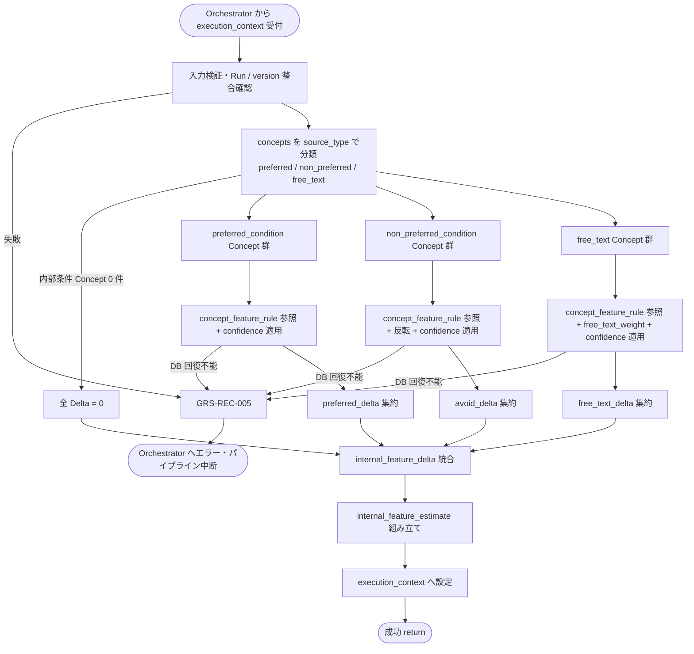

# Internal Condition Feature Estimator モジュール仕様書

## 1. ドキュメント情報

| 項目           | 内容                                                     |
| -------------- | -------------------------------------------------------- |
| ドキュメントID | `MOD-RECO-006`                                           |
| ドキュメント名 | Internal Condition Feature Estimator モジュール仕様書    |
| 対象システム   | Gift Recommendation Service（`apps/reco`）               |
| MVP対象        | `○`                                                      |
| 作成日         | 2026-06-28                                               |
| 更新日         | 2026-06-28（§16.1 Human 決定反映 — 全論点確定）         |

---

## 2. 概要

Internal Condition Feature Estimator（内部条件特徴量推定）は、Reco オンライン推薦パイプラインの **User Meaning フェーズ** において、`MOD-RECO-004` User Semantic Extractor が抽出した **Semantic Concept**（好み / 避けたい / 自由文由来）を **`concept_feature_rule`** に基づき MVP 8 軸 Feature の **内部条件由来 Delta**（`internal_feature_delta`）へ変換するモジュールである。`MOD-RECO-001` Recommendation Orchestrator から **`MOD-RECO-005` External Condition Feature Estimator の直後**に呼び出され、推定結果を `internal_feature_estimate` として `execution_context` へ返却する。

本モジュールは **内部条件 Feature 推定** に責務を限定し、Semantic Concept 抽出・外部条件（relationship / occasion）Feature 推定・User Feature 統合・正規化・User Meaning 射影・Retrieval / Matching / Ranking 計算は行わない。`Recommendation Request` の構造化フィールド（`preferred_condition` / `non_preferred_condition` / `free_text`）は **`MOD-RECO-004` による Concept 化済み**であることを前提とし、本モジュールの **主入力は `semantic_extraction_result.concepts[]`** とする（Request テキストの再抽出は行わない）。

---

## 3. 目的

- `apps/reco` における Internal Condition Feature Estimator 実装・単体テストの前提を定義する
- Orchestrator との I/F（`execution_context` 入出力）、失敗時のパイプライン中断（`GRS-REC-005`）を後続実装可能な粒度で整理する
- Recoモジュール一覧・Feature定義書・Featureルール定義書・Orchestrator 仕様書・`MOD-RECO-004` 仕様書との整合を担保する

---

## 4. モジュール基本情報

| 項目 | 内容 |
| ---- | ---- |
| モジュールID | `MOD-RECO-006` |
| モジュール名 | 内部条件特徴量推定 |
| 物理名 | `Internal Condition Feature Estimator` |
| 分類 | User Meaning |
| 処理種別 | `OL` |
| 配置予定 | `apps/reco/src/reco/application/internal-condition-feature-estimator/**` |
| 所属Epic | `MOD-RECO-006`（Epic Issue #813） |
| MVP対象 | `○` |
| 主な呼び出し元 | `MOD-RECO-001` Recommendation Orchestrator |
| 主な呼び出し先 | Concept Feature Rule Repository（`concept_feature_rule` 参照） |

`MOD-API-*` / `MOD-RECO-*` / `MOD-BATCH-*` 配下のTaskでは、該当モジュールIDの責務範囲に変更を限定する。`MOD-RECO-*` では `apps/reco/src/reco/api/**` の API-INT エンドポイント層を対象に含めない。エンドポイント層の変更が必要な場合は、該当する `API-INT-*` Epic 配下 Task として扱う。

---

## 5. 責務

### 5.1 主責務

- `semantic_extraction_result.concepts[]` のうち **`source_type` が内部条件**（`preferred_condition` / `non_preferred_condition` / `free_text`）の Concept を対象に、`concept_feature_rule` により Feature **補正 Delta** を解決する（Featureルール定義書 §10・§11）
- **好み条件**（`source_type = preferred_condition`、`input_intent = prefer`）由来 Concept に対し **`preferred_delta`**（8 軸）を集約する（Featureルール定義書 §11.2）
- **避けたい条件**（`source_type = non_preferred_condition`、`input_intent = avoid`）由来 Concept に対し、Concept Feature Delta を **反転**（× `-1`）して **`avoid_delta`**（8 軸）を集約する（Featureルール定義書 §11.3）
- **自由入力**（`source_type = free_text`）由来 Concept に対し **`free_text_delta`**（8 軸）を集約する。MVP では **`free_text_weight = 0.70`** を適用する（Featureルール定義書 §12.3）
- 各 Concept への適用時に **`confidence`** による重み付けを行う（`effective_delta = concept_delta * confidence`。Featureルール定義書 §12.4）
- 推定時点の **`semantic_config_version_id`**（`execution_context.config_versions` から）に紐づく Rule を参照する
- 上記 3 集合を Featureルール定義書 §12.2 の統合式に従い **`internal_feature_delta`**（8 軸）へ集約する
- 構造化結果を **`internal_feature_estimate`** として `execution_context` へ返却し、後続 `MOD-RECO-007` User Feature Generator へ引き渡す
- 推定失敗時に **`GRS-REC-005`** 相当のエラーを Orchestrator へ返却し、パイプライン中断を促す

### 5.2 対象外責務

- `API-INT-002` エンドポイント層（HTTP 受付、reco 側防御的 Validation、OpenAPI スキーマ整合）
- `MOD-RECO-001` Orchestrator の **実行順序制御**・Phase Log 契機管理
- `MOD-RECO-003` Config / Version 解決
- `MOD-RECO-002` Recommendation Run 記録（Run INSERT は完了済みであることを前提とする）
- `MOD-RECO-004` **Semantic Concept 抽出**（本モジュールは抽出結果を消費するのみ。Request テキストの再 Rule / LLM 適用は行わない）
- **外部条件 Feature 推定**（`relationship` / `occasion`。`MOD-RECO-005` 責務）
- **User Feature 統合**・**sigmoid 正規化**・**`user_feature` 永続化**（`MOD-RECO-007` 責務）
- **User Meaning 射影**（`MOD-RECO-008` 責務）
- **`ng_condition` / `budget_condition` の Feature 化**（Hard Filter 責務。`MOD-RECO-011` / `013`）
- **`hard_filter_candidates[]` の生成・merge**（`MOD-RECO-004` / `011` 責務）
- Concept Feature Rule / Semantic Concept **マスタの CRUD**（DB seed / API-PUB-008 責務）
- Hard Filter 実行（`MOD-RECO-011` / `013` 責務）
- Phase Log / Error Log の **物理書き込み**（`MOD-RECO-028` / `029`。Orchestrator / Error Handler 経由）
- Public API 向けレスポンス形式への変換（`apps/api` 責務）
- OpenAPI / Orval / generated の変更
- DB schema / DDL の変更

---

## 6. 入出力

### 6.1 入力

| 入力 | 型 / 構造 | 必須 | 生成元 | 用途 | 備考 |
| ---- | --------- | ---- | ------ | ---- | ---- |
| `execution_context` | パイプライン実行コンテキスト | `true` | `MOD-RECO-001` | 推定の起点 | `run_id` / `trace_id` / `config_versions` を含む |
| `execution_context.semantic_extraction_result` | Semantic 抽出結果 | `true` | `MOD-RECO-004` | **主入力** | `concepts[]` が空でも可（§8.3.3） |
| `execution_context.semantic_extraction_result.concepts[]` | Concept 配列 | `true`（配列自体） | `MOD-RECO-004` | 内部条件 Feature Delta 算出 | `concept_code` / `source_type` / `input_intent` / `confidence` 等 |
| `execution_context.request` | `RecommendationRequest` | `true` | Orchestrator | 監査・整合確認 | RecommendationRequest定義書 |
| `execution_context.request.preferred_condition` | 好み条件 | `false` | Request | 入力有無のエコー・ログ | 本モジュールは **再抽出しない** |
| `execution_context.request.non_preferred_condition` | 避けたい条件 | `false` | Request | 同上 | **NG 条件ではない**（Recoモジュール一覧 §6.3） |
| `execution_context.request.free_text` | 自由入力 | `false` | Request | 同上 | |
| `execution_context.config_versions.semantic_config_version_id` | `uuid` | `true` | `MOD-RECO-003` | Rule 参照 version | Run 行と整合必須 |
| `execution_context.run_id` | `uuid` | `true` | `MOD-RECO-002` | Run 整合検証 | `recommendation_run_id` |
| `execution_context.external_feature_estimate` | 外部条件推定結果 | `false` | `MOD-RECO-005` | 整合確認のみ | 本モジュールは **参照しない**（統合は `007`） |

**入力の正本**: 内部条件 Feature 推定の Concept 集合は **`semantic_extraction_result.concepts[]` を正**とする。Request の `preferred_condition` / `non_preferred_condition` / `free_text` は `004` が Concept 化済みであることの論理前提であり、本モジュールは Request テキストから Semantic 抽出を **行わない**（`MOD-RECO-004` §2・§8.3.6）。

**`ng_condition` の扱い**: `ng_condition` および `hard_filter_candidates[]` は本モジュールの入力・処理対象外とする。機能×モジュール対応表の論理入力名に `ng` が含まれる場合でも、Hard Filter 責務であり本モジュール scope 外である（Recoモジュール一覧 §6.5 主な入力は `preferred_text` / `non_preferred_text` / `semantic_extraction_result`）。

### 6.2 出力

| 出力 | 型 / 構造 | 利用先 | 用途 | 備考 |
| ---- | --------- | ------ | ---- | ---- |
| `internal_feature_estimate` | ドメインオブジェクト（実装 Task で型定義） | `execution_context`、下位 `MOD-RECO-*` | 内部条件 Feature Delta 推定の正本（Run 内メモリ） | Featureルール定義書 §12.2 相当 |
| `internal_feature_estimate.preferred_delta` | `Record<feature_code, number>` | `MOD-RECO-007` | 好み条件由来 Delta（8 軸） | `preferred_condition` 由来 Concept 集約 |
| `internal_feature_estimate.avoid_delta` | `Record<feature_code, number>` | `MOD-RECO-007` | 避けたい条件由来 Delta（8 軸） | `non_preferred_condition` 由来。反転適用済み |
| `internal_feature_estimate.free_text_delta` | `Record<feature_code, number>` | `MOD-RECO-007` | 自由文由来 Delta（8 軸） | `free_text_weight` 適用済み |
| `internal_feature_estimate.internal_feature_delta` | `Record<feature_code, number>` | `MOD-RECO-007` | 統合後内部条件 Delta（8 軸） | §8.3.2 の統合式結果 |
| `internal_feature_estimate.applied_concept_count` | `number` | ログ | 適用 Concept 件数 | `confidence >= 0.60` かつ Rule 参照成功 |
| `internal_feature_estimate.semantic_config_version_id` | `uuid` | 再現性・監査 | Rule 参照 version | `config_versions` と一致必須 |
| `internal_feature_estimate.estimation_method` | `rule` 固定（MVP） | ログ | 推定方式 | LLM 不使用 |
| `execution_context.internal_feature_estimate` | 上記への参照 | Orchestrator 受け渡し | 後続フェーズ入力 | Orchestrator Port 契約 |
| `reco_error` | 標準化 reco エラー | Orchestrator | 推定失敗時 | `GRS-REC-005` |

**永続化**: 本モジュールは **DB へ INSERT しない**。`user_feature` への永続化および `user_feature_raw` / `user_feature_normalized` の生成は `MOD-RECO-007` が担当する（`user_feature_テーブル定義書` §5.4）。内部条件 Delta の寄与分解も MVP では DB に保存しない（`MOD-RECO-005` §11 と同型方針。§16.1 No.3 確定済み）。

**MVP 8 軸 `feature_code` 正本**: `formality`, `safety`, `brand_appropriateness`, `emotion`, `novelty`, `intimacy`, `symbolic_identity`, `story_richness`（Feature定義書 / enum定義書 §6.16）。

**出力名**: Recoモジュール一覧の **`internal_feature_estimate`** を正とする（機能×モジュール対応表の `internal_condition_feature` は論理出力名として同義だが、実装・Port 契約では `internal_feature_estimate` に統一する）。

---

## 7. 依存関係

### 7.1 依存モジュール

| 依存先 | 方向 | 用途 | 失敗時の扱い | 備考 |
| ------ | ---- | ---- | ------------ | ---- |
| `MOD-RECO-001` Recommendation Orchestrator | 被呼び出し | OL パイプラインでの推定契機 | — | User Meaning フェーズ（論理順序 7） |
| `MOD-RECO-003` Config Version Resolver | 間接依存 | `semantic_config_version_id` の前提 | `003` 失敗時は本モジュール未到達 | 解決済み `config_versions` を入力 |
| `MOD-RECO-002` Recommendation Run Recorder | 間接依存 | `recommendation_run_id` の前提 | `002` 失敗時は本モジュール未到達 | Run INSERT 完了後に呼び出し |
| `MOD-RECO-004` User Semantic Extractor | 直接依存 | `semantic_extraction_result.concepts[]` | `004` 失敗時は本モジュール未到達 | Semantic 抽出の正本 |
| `MOD-RECO-005` External Condition Feature Estimator | 間接依存 | 物理呼び出し順序の前提 | `005` 失敗時は本モジュール未到達 | 出力は本モジュール非参照 |
| `MOD-RECO-024` Reco Error Handler | 間接連携 | 例外の標準化 | 推定失敗でパイプライン中断 | Orchestrator 経由 |
| `MOD-RECO-028` Phase Log Writer | 間接連携 | User Meaning フェーズ記録 | 記録失敗は推薦結果に影響させない | MVP では専用 `phase_name` なし（§12） |
| `MOD-RECO-029` Error Log Writer | 間接連携 | 失敗詳細記録 | `MOD-RECO-024` 経由 | 失敗時 |

**下位利用モジュール（本モジュール出力の利用先）**

| モジュール | 利用する出力 |
| ---------- | ------------ |
| `MOD-RECO-007` User Feature Generator | `internal_feature_estimate`（`internal_feature_delta` および分解値） |

### 7.2 参照データ

| データ | 参照元 | 用途 | version / config | 備考 |
| ------ | ------ | ---- | ---------------- | ---- |
| `concept_feature_rule` | DB（IF-DB-RECO-001 系） | Concept → Feature Delta | 当該 `semantic_config_version_id` | `is_active = true` のみ。読み取りのみ |
| `semantic_concept` | DB（間接） | `concept_code` → `semantic_concept_id` 解決 | 同上 | Rule ルックアップの FK |
| `input_type_rule` | DB | 入力種別ごとの適用方針 | 同上 | `free_text` は `semantic_extraction_then_apply` |
| `feature_integration_rule` | DB | 内部条件統合重み（`free_text_weight` 等） | 同上 | §8.3.2 |
| `recommendation_run` | DB | Run 存在・version 整合 | Run 固定 | SELECT 検証 |
| `semantic_config_version` | DB | version 有効性 | `config_versions` | 読み取りのみ |
| `user_semantic` | DB（間接） | `004` INSERT 済みの論理整合 | Run 固定 | 本モジュールは UPDATE しない |

**稀疏 seed**: MVP では `concept_feature_rule` は **稀疏 seed**（全 18 Concept × 8 軸の完全行列は必須としない — `concept_feature_rule_テーブル定義書` §5）。特定 Concept × 軸の Rule 行が存在しない場合、その軸への寄与は **0** とする（§8.3.4）。

---

## 8. 処理仕様

### 8.1 処理フロー



### 8.2 処理ステップ

| No | 処理 | 入力 | 出力 | 補足 |
| --: | ---- | ---- | ---- | ---- |
| 1 | 入力検証 | `execution_context` | — | `run_id` / `semantic_config_version_id` / `semantic_extraction_result` 必須 |
| 2 | Run 整合確認 | `recommendation_run_id` | — | Run 存在、`semantic_config_version_id` が Run 行と一致 |
| 3 | Concept 分類 | `concepts[]` | 3 グループ | `source_type` でフィルタ。`ng_condition` 由来は **除外** |
| 4 | 採用ライン適用 | 各 Concept | — | `confidence >= 0.60` のみ適用（`MOD-RECO-004` §5.1 と整合） |
| 5 | Preferred Delta 算出 | prefer 群 | `preferred_delta`（8 軸） | §8.3.1 |
| 6 | Avoid Delta 算出 | avoid 群 | `avoid_delta`（8 軸） | §8.3.1。Delta 反転 |
| 7 | Free Text Delta 算出 | free_text 群 | `free_text_delta`（8 軸） | §8.3.1。`free_text_weight` 適用 |
| 8 | 内部条件 Delta 統合 | 上記 3 集合 | `internal_feature_delta`（8 軸） | §8.3.2 |
| 9 | 結果組み立て | 統合結果 + メタデータ | `internal_feature_estimate` | `estimation_method: rule` |
| 10 | 結果返却 | 組み立て結果 | `execution_context.internal_feature_estimate` | 後続 `007` へ |

**Orchestrator 呼び出し順序（正本: MOD-RECO-001 §8.2.1）**

```text
… → MOD-RECO-004 Semantic 抽出 → MOD-RECO-005 外部条件 Feature 推定 → MOD-RECO-006 内部条件 Feature 推定 → MOD-RECO-007 …
```

本モジュールは User Meaning フェーズの **論理順序 7** である。`MOD-RECO-005` 完了後に Orchestrator が呼び出す（Recoモジュール一覧 §5.2）。フロー図上は Semantic 抽出後に外部・内部が分岐するが、**物理呼び出しは直列**（`005` → `006`）とする（`MOD-RECO-005` §8.2 と同型）。

### 8.3 アルゴリズム / 計算仕様

Featureルール定義書 §10〜§12・§22 に従う。MVP は **Rule ベースのみ**（LLM 不使用）。

| 項目 | 内容 |
| ---- | ---- |
| 推定方式 | `concept_feature_rule` ルックアップ + `confidence` / 入力種別重み + 算術集約 |
| Rule version | `execution_context.config_versions.semantic_config_version_id` に紐づく行のみ |
| Concept 採用 | `confidence >= 0.60`（`MOD-RECO-004` と整合） |
| 稀疏 Rule | Concept × 軸の Rule 行欠落は **0 寄与**（失敗にしない） |
| 値域（Delta） | 加算後は **0.0〜1.0 外**となり得る。clip / sigmoid は `MOD-RECO-007` 責務 |
| Semantic 再抽出 | **行わない**。`004` 出力を正とする |

#### 8.3.1 Concept 単位 Delta 算出

各 Concept × 各 `feature_code` 軸について:

```text
base_delta = feature_delta * polarity_sign * confidence
```

| パラメータ | 内容 |
| ---------- | ---- |
| `feature_delta` | `concept_feature_rule.feature_delta`（0.0〜1.0） |
| `polarity_sign` | §8.3.1.1 の解決式 |
| `confidence` | `concepts[].confidence` |

##### 8.3.1.1 `polarity_sign` 解決（MVP）

| `concept_feature_rule.polarity` | `polarity_sign` | 備考 |
| ------------------------------- | --------------: | ---- |
| `positive` | `+1` | enum定義書 §6.22 |
| `negative` | `-1` | 同上 |
| `mixed` | `+1`（`input_intent` が `prefer` / `neutral`）<br>`-1`（`input_intent` が `avoid`） | SemanticConcept §9.3 の文脈依存は Post-MVP。MVP は intent 基準 |

**`non_preferred_condition` 由来の §11.3 反転（× `-1`）との関係**

| `polarity` | `non_preferred` 追加反転 | 理由 |
| ---------- | ------------------------ | ---- |
| `positive` / `negative` | **適用する**（`polarity_sign` 算出後に × `-1`） | Featureルール定義書 §11.3 |
| `mixed` | **適用しない** | `input_intent` / `source_type` で符号化済み。二重反転防止 |

**MVP seed 方針（§16.1 No.5 確定済み）**: sparse seed では `polarity = mixed` 行を **原則投入しない**。Concept × 軸ごとに Featureルール定義書 §10.3 の符号に従い `positive` / `negative` で行を分ける（`concept_feature_rule_テーブル定義書` §17.1 No.5）。`relationship` / `occasion` による mixed 符号の動的切替は MVP scope 外（Post-MVP Task 化）。

**入力種別ごとの集約先と追加係数**

| `source_type` | 集約先 | 追加係数 | 備考 |
| ------------- | ------ | -------- | ---- |
| `preferred_condition` | `preferred_delta[axis]` | `× 1.00` | Featureルール定義書 §12.3 `preferred_delta` weight |
| `non_preferred_condition` | `avoid_delta[axis]` | `× -1.00`（`polarity` が `positive` / `negative` の Rule 行のみ） | §11.3。`mixed` 行は §8.3.1.1 により追加反転しない |
| `free_text` | `free_text_delta[axis]` | `× 0.70` | §12.3 `free_text_weight` |

同一 `source_type` 内で複数 Concept が同一軸に寄与する場合、**加算**して集約する。

**否定 Concept**（`not_too_much` / `not_too_safe` 等）: `004` が `preferred_condition` として抽出した場合は Rule 定義 Delta を **そのまま** `preferred_delta` へ加算する（Featureルール定義書 §11.4）。`non_preferred_condition` として抽出された場合は §11.3 の反転を **追加で**適用する（`polarity = mixed` 行を除く — §8.3.1.1）。

#### 8.3.2 内部条件 Delta 統合式（MVP）

Featureルール定義書 §12.2 を正とする。

```text
internal_feature_delta[axis]
  = preferred_delta[axis]
  + avoid_delta[axis]
  + free_text_delta[axis]
```

| パラメータ | MVP 初期値 | 参照元 |
| ---------- | ---------: | ------ |
| `preferred_delta` 係数 | `1.00` | `feature_integration_rule`（version 解決済み） |
| `avoid_delta` 係数 | `1.00` | 同上（反転は §8.3.1 で適用済み） |
| `free_text_weight` | `0.70` | 同上 |

**下位統合（参考）**: `MOD-RECO-007` は `user_feature_raw[axis] = external_feature_raw[axis] + internal_feature_delta[axis]` を算出する（Featureルール定義書 §12.2）。本モジュールは `internal_feature_delta` までを担当する。

#### 8.3.3 内部条件 Concept 0 件時の扱い

| 条件 | 扱い | Error Code |
| ---- | ---- | ---------- |
| `preferred` / `non_preferred` / `free_text` がすべて空で `004` が `concepts: []` を返却 | **成功**。全 Delta ゼロ | — |
| 内部条件 Concept は存在するが `confidence >= 0.60` が 0 件 | **成功**。全 Delta ゼロ | — |
| 内部条件 Concept 0 件 | **成功** | — |

`MOD-RECO-004` の「入力テキスト全欠損でも失敗にしない」方針（`MOD-RECO-004` §6.1）と整合する。

#### 8.3.4 Rule 欠落・コード異常時の扱い

| 条件 | 扱い | Error Code |
| ---- | ---- | ---------- |
| 特定 Concept × 軸の `concept_feature_rule` 行なし（稀疏 seed） | **成功**。当該軸寄与 `0` | — |
| 特定 Concept に Rule 行が 1 件もない | **成功**。当 Concept 寄与 `0` | — |
| `semantic_config_version_id` 不一致 / Run 未存在 | 失敗 | `GRS-REC-005` |
| `semantic_extraction_result` 欠落 | 失敗 | `GRS-REC-005` |
| `concept_feature_rule` 参照の DB 回復不能エラー | 失敗 | `GRS-REC-005` |
| 必須 context 欠落（`run_id` / version） | 失敗 | `GRS-REC-005` |

#### 8.3.5 Orchestrator Port 契約（概要）

| 方向 | 契約 |
| ---- | ---- |
| 呼び出し | `estimate_internal_features(execution_context) -> execution_context`（メソッド名は実装 Task で確定） |
| 成功 | `execution_context.internal_feature_estimate` が設定される |
| 失敗 | 例外または `reco_error`（`GRS-REC-005`）を Orchestrator へ返却。後続 `007`〜`023` は **呼ばれない** |
| Phase Log | MVP では専用 `phase_name` なし（§12）。Orchestrator は User Meaning 一括ウォッチドッグを適用 |
| Wiring | User Meaning フェーズ（`004`〜`010`）は **未配線（スタブ）**（MOD-RECO-001 §8.4.2）。本モジュール実装 Task 完了後、フェーズ Wiring Task で差し替え |

---

## 9. データ項目マッピング

| 入力項目 | 内部項目 | 出力項目 | 変換内容 | 備考 |
| -------- | -------- | -------- | -------- | ---- |
| `semantic_extraction_result.concepts[].concept_code` | `concept_code` | —（集約のみ） | Rule ルックアップキー | `semantic_concept_id` 解決 |
| `concepts[].source_type=preferred_condition` | prefer 群 | `preferred_delta[axis]` | Delta 加算 | |
| `concepts[].source_type=non_preferred_condition` | avoid 群 | `avoid_delta[axis]` | Delta 反転加算 | × `-1` |
| `concepts[].source_type=free_text` | free_text 群 | `free_text_delta[axis]` | 重み付き加算 | `× 0.70` |
| `concepts[].confidence` | `confidence` | — | `effective_delta` 係数 | `>= 0.60` のみ |
| `concept_feature_rule.feature_delta` + `polarity` | 符号付き Delta | 各 `*_delta[axis]` | Rule 参照 | 稀疏欠落は `0` |
| 統合結果 | `internal_feature_delta[axis]` | `internal_feature_estimate.internal_feature_delta` | §8.3.2 | 未正規化 |
| `config_versions.semantic_config_version_id` | `version_id` | `internal_feature_estimate.semantic_config_version_id` | エコー | Run と一致必須 |
| — | — | `execution_context.internal_feature_estimate` | コンテキストへ格納 | `007` 入力 |

**Request テキストとの関係**: `request.preferred_condition.*` 等は `004` が Concept 化した結果が `concepts[]` に反映されていることを前提とする。Request と `concepts[]` の不整合検出は MVP では **警告ログのみ**（Hard fail にしない。§16.1 No.4 確定済み）。

---

## 10. 状態・例外

### 10.1 状態

本モジュールは Run 内 **1 回実行・ステートレス**（再推定・UPDATE は MVP 禁止）とする。

| 状態 | 意味 | 遷移条件 | 記録先 |
| ---- | ---- | -------- | ------ |
| — | モジュール内部状態なし | — | — |

Run 全体の状態（`recommendation_run.status`）は `MOD-RECO-002` が管理。本モジュール失敗時は Run を `failed` へ遷移させる（Orchestrator / `002` 連携）。

### 10.2 例外

| 例外 | Error Code | 発生条件 | 呼び出し元への返却 | ログ |
| ---- | ---------- | -------- | ------------------ | ---- |
| 内部条件 Feature 推定失敗 | `GRS-REC-005` | Rule 参照の回復不能エラー・統合エラー等 | 500 系。パイプライン中断 | Error Log + 構造化ログ |
| Run 不整合 | `GRS-REC-005` | Run 未存在、`semantic_config_version_id` 不一致 | 同上 | 同上 |
| 入力検証失敗 | `GRS-REC-005` | 必須 context / `semantic_extraction_result` 欠落 | 同上 | 同上 |
| 内部条件 Concept 0 件 / 稀疏 Rule 欠落 | —（成功） | §8.3.3 / §8.3.4 | 処理継続（全 Delta ゼロまたは部分ゼロ） | 構造化ログに `applied_concept_count: 0` 可 |

Error Code の正本はエラーコード定義書。Orchestrator は `MOD-RECO-005`〜`009` 失敗を **User Feature 系失敗**として `GRS-REC-005` に集約する（MOD-RECO-001 §10.2）。

**リトライ**: 本モジュール内の自動リトライは MVP では **行わない**。呼び出し元による再 Run は新規 `recommendation_run` として扱う。

---

## 11. DB / 永続化

| テーブル | 操作 | 主な項目 | トランザクション | 備考 |
| -------- | ---- | -------- | ---------------- | ---- |
| — | — | なし | — | 本モジュールは DB へ書き込まない |

**読み取りのみ**

| テーブル | 操作 | 主な項目 | トランザクション | 備考 |
| -------- | ---- | -------- | ---------------- | ---- |
| `concept_feature_rule` | SELECT | `semantic_concept_id`, `feature_code`, `feature_delta`, `polarity` | 読み取りのみ | version 絞り込み |
| `semantic_concept` | SELECT | `concept_code`, `semantic_concept_id` | 読み取りのみ | Rule JOIN |
| `feature_integration_rule` | SELECT | 内部条件統合重み | 読み取りのみ | §8.3.2 |
| `input_type_rule` | SELECT | 入力種別方針 | 読み取りのみ | 監査用 |
| `recommendation_run` | SELECT | Run 存在・version | 読み取りのみ | 整合検証 |

**永続化ポリシー**

| 観点 | 方針 |
| ---- | ---- |
| 本モジュール出力 | **メモリのみ**（`execution_context`） |
| 最終 User Feature | `MOD-RECO-007` が `user_feature` へ 8 行 INSERT（IF-DB-RECO-003） |
| 寄与分解 | MVP では DB に保存しない（§16.1 No.3 確定済み） |

---

## 12. ログ・メトリクス

| 種別 | 内容 | 出力タイミング | 保存先 | 備考 |
| ---- | ---- | -------------- | ------ | ---- |
| 構造化ログ | 推定サマリ（`applied_concept_count`, `preferred_count`, `avoid_count`, `free_text_count`, `duration_ms`） | 推定完了時 | アプリログ | `trace_id` 必須。Rule 実値の全量ダンプは避ける |
| Error Log 依頼 | `GRS-REC-005` 詳細 | 失敗時 | `error_log`（`MOD-RECO-029`） | `MOD-RECO-024` 経由 |
| Metric 依頼 | `internal_feature_estimation_latency_ms` | 推定完了時 | Metric Logger（`MOD-RECO-025`） | MVP 対象 `△` |

**Phase Log（MVP）**: `phase_log.phase_name`（`recommendation_run_phase_name`）には、内部条件推定専用の値は **定義されていない**（`semantic_extracted` の次は `user_feature_generated`）。本モジュール単位の Phase Log 依頼は MVP では **行わない**。Orchestrator / `MOD-RECO-028` は User Meaning 一括または `user_feature_generated`（`007`）で記録する（ログ・Observability設計書 §10.3、`MOD-RECO-005` §12 と同型）。

### 12.1 メトリクス

| Metric | 内容 | 集計単位 | 用途 |
| ------ | ---- | -------- | ---- |
| `internal_feature_estimation_latency_ms` | 内部条件 Feature 推定処理時間 | Run | ボトルネック分析 |
| `internal_applied_concept_count` | 適用 Concept 件数 | Run | Rule カバレッジ監視 |

---

## 13. 性能・非機能

### 13.1 方針概要

| 観点 | 方針 |
| ---- | ---- |
| レイテンシ | MVP 初版では **モジュール単体 hard timeout を設けない**。User Meaning 一括（`004`〜`010`）**hard 1,000ms** を上位ガードとする（MOD-RECO-001 §13.2） |
| 計算量 | Concept 数 × 8 軸の Rule ルックアップ + 軽量加算。DB は version + concept インデックス利用 |
| タイムアウト | 本モジュール単体の hard 上限は **MVP では設けない**（§16.1 No.1 確定済み）。Orchestrator の User Meaning 一括ウォッチドッグ（1,000ms）が適用される |
| リトライ | モジュール内自動リトライ **なし**（§10.2） |
| キャッシュ | 同一 Run 内で Rule 行のメモリキャッシュ可。同一 `semantic_config_version_id` の Run 間キャッシュは実装 Task で検討 |
| 並列実行 | MVP では `005` と `006` を Orchestrator が **直列**呼び出し。モジュール内並列は不要 |

### 13.2 タイムアウト（MVP）

| 種別 | 対象 | MVP 値 | 超過時の扱い |
| ---- | ---- | ------ | ------------ |
| hard | `MOD-RECO-006` 単体 | **なし**（PoC 後に §13.2 へ追記可 — §16.1 No.1 確定済み） | — |
| hard（上位） | User Meaning 一括（`004`〜`010`） | **1,000ms** | 該当 `GRS-REC-004`〜`007`（MOD-RECO-001 §13.2） |
| hard（全体） | 推薦パイプライン全体 | **4,000ms** | `GRS-REC-101` |

---

## 14. テスト観点

| No | 観点 | 確認内容 | 種別 |
| --: | ---- | -------- | ---- |
| 1 | 正常系（preferred） | `preferred_condition` 由来 Concept で `preferred_delta` が Rule × confidence どおり加算されること | unit |
| 2 | 正常系（non_preferred） | `non_preferred_condition` 由来 Concept で Delta が反転し `avoid_delta` に反映されること | unit |
| 3 | 正常系（free_text） | `free_text` 由来 Concept で `free_text_weight`（0.70）が適用されること | unit |
| 4 | 正常系（統合式） | `internal_feature_delta` が §8.3.2 の和と一致すること | unit |
| 5 | 正常系（複数 Concept 加算） | 同一軸へ複数 Concept 寄与が加算されること | unit |
| 6 | 境界値（Concept 0 件） | 内部条件 Concept なしで全 Delta ゼロ・成功すること | unit |
| 7 | 境界値（confidence 閾値） | `confidence < 0.60` の Concept が適用されないこと | unit |
| 8 | 境界値（稀疏 Rule） | Rule 行欠落軸が 0 寄与・成功すること | unit |
| 9 | 否定 Concept | `not_too_safe` 等が prefer 抽出時に反転せず Rule どおり適用されること | unit |
| 10 | version 整合 | 出力 `semantic_config_version_id` が Run / `config_versions` と一致すること | unit |
| 11 | 例外系（Run 不整合） | Run 未存在・version 不一致で `GRS-REC-005` となること | unit |
| 12 | 例外系（入力欠落） | `semantic_extraction_result` 欠落で `GRS-REC-005` となること | unit |
| 13 | 例外系（DB 失敗） | Rule 参照の回復不能エラーで `GRS-REC-005` となること | unit |
| 14 | ng 非混入 | `ng_condition` / `hard_filter_candidates` が Delta 算出に使われないこと | unit |
| 15 | Semantic 非再抽出 | Request テキスト変更のみでは `004` 未再実行時に結果が変わらないこと（本モジュールが Request を読まない） | unit |
| 16 | DB 非永続化 | 成功時も本モジュールが `user_feature` 等へ INSERT しないこと | unit |
| 17 | Orchestrator 連携 | 明示 DI で Orchestrator が `005` 成功後に `006` を呼び、`006` 失敗時に `007` 以降を呼ばないこと | integration |
| 18 | ログ | `trace_id` が構造化ログに含まれ、secret が含まれないこと | unit |
| 19 | タイムアウト | User Meaning 一括 hard 1,000ms 超過で `GRS-REC-005` 系となること（単体 hard は MVP 未設定） | integration |
| 20 | 出力受け渡し | `internal_feature_estimate` が `execution_context` に格納され `007` が参照できること | unit / integration |

---

## 15. 変更管理

### 15.1 変更履歴

| 日付 | 変更内容 | 関連Issue / PR |
| ---- | -------- | -------------- |
| 2026-06-28 | 初版作成 | Issue #814 |
| 2026-06-28 | §16.1 Human 決定反映（No.1〜4 確定、No.5 推奨案を §8.3.1.1 へ追記） | Issue #814 |
| 2026-06-28 | §16.1 No.5 確定（`mixed` polarity 符号解決） | Issue #814 |

---

## 16. 未決事項

| No | 論点 | 判断が必要な理由 | 判断者 | 期限 | 備考 |
| --: | ---- | ---------------- | ------ | ---- | ---- |
| - | なし | - | - | - | - |

### 16.1 確定済み論点（Issue #814 Human 判断）

| No | 論点 | 確定内容 |
| --: | ---- | -------- |
| 1 | タイムアウト（MVP 初版） | **モジュール単体 hard を設けない**。User Meaning 一括 **hard 1,000ms** のみ。単体 soft / hard 値は PoC 後に §13.2 へ追記 |
| 2 | 外部 / 内部 Feature 推定の Phase Log | 専用 `phase_name` は **追加しない**。構造化ログ（§12）で代替。`user_feature_generated`（`007`）まで Phase を細分化しない |
| 3 | `internal_feature_delta` 分解値の Run 永続化 | **永続化しない**。`execution_context` 上のメモリ正本のみ。DB 保存は `MOD-RECO-007` が統合・正規化後の `user_feature` 8 行のみ（`user_feature_テーブル定義書` §5.3） |
| 4 | Request と `concepts[]` の不整合 | **警告ログのみ**（Hard fail にしない）。Semantic 抽出失敗の fail は `MOD-RECO-004` 責務 |
| 5 | `mixed` polarity の符号解決 | **実行時**: `input_intent` 基準（`prefer` / `neutral` → `+1`、`avoid` → `-1`）。`mixed` 行には §11.3 追加反転を **適用しない**（§8.3.1.1）。**seed**: MVP sparse seed では `mixed` 行を原則使わず §10.3 符号を `positive` / `negative` 行に分解。**Post-MVP**: `relationship` / `occasion` 文脈切替（SemanticConcept §9.3）は将来 Task 化 |

---

## 17. 関連資料

| 種別 | パス / URL | 用途 |
| ---- | ---------- | ---- |
| Recoモジュール一覧 | `docs/05_アプリケーション設計/アプリ/reco/Recoモジュール一覧.md` | モジュール定義・§6.5 内部条件特徴量推定 |
| モジュール一覧 | `docs/05_アプリケーション設計/アプリ/モジュール一覧.md` | 全体配置 |
| 機能×モジュール対応表 | `docs/05_アプリケーション設計/アプリ/機能×モジュール対応表.md` | 入出力・パイプライン順序 |
| Feature定義書 | `docs/04_ドメインモデル設計/Feature定義書.md` | 8 軸定義 |
| Featureルール定義書 | `docs/04_ドメインモデル設計/Featureルール定義書.md` | Concept Rule・統合式・入力種別 |
| RecommendationRequest定義書 | `docs/04_ドメインモデル設計/RecommendationRequest定義書.md` | preferred / non_preferred / free_text |
| concept_feature_rule テーブル定義書 | `docs/06_実装設計/database/concept_feature_rule_テーブル定義書.md` | Rule 物理化 |
| user_feature テーブル定義書 | `docs/06_実装設計/database/user_feature_テーブル定義書.md` | 永続化は `007` 責務 |
| user_semantic テーブル定義書 | `docs/06_実装設計/database/user_semantic_テーブル定義書.md` | `004` 出力 JSON 正本 |
| インターフェース一覧 | `docs/05_アプリケーション設計/アプリ/インターフェース一覧.md` | IF-DB-RECO-001 |
| エラーコード定義書 | `docs/05_アプリケーション設計/アプリ/エラーコード定義書.md` | `GRS-REC-005` |
| ログ・Observability設計書 | `docs/05_アプリケーション設計/アプリ/ログ・Observability設計書.md` | Phase / Metric |
| MOD-RECO-001 仕様書 | `docs/06_実装設計/reco/MOD-RECO-001_Recommendation Orchestratorモジュール仕様書.md` | 呼び出し順・失敗時中断 |
| MOD-RECO-004 仕様書 | `docs/06_実装設計/reco/MOD-RECO-004_User Semantic Extractorモジュール仕様書.md` | Semantic 抽出・Concept 構造 |
| MOD-RECO-005 仕様書 | `docs/06_実装設計/reco/MOD-RECO-005_External Condition Feature Estimatorモジュール仕様書.md` | 外部条件との責務境界・同型非機能方針 |
| module-spec テンプレート | `prompts/templates/docs/module-spec.md` | 章構成 |
| Epic Definition | `prompts/definitions/epics/mod-reco-006-internal-condition-feature-estimator/epic.yaml` | allowed_paths |

---

## 18. レビュー観点

- Recoモジュール一覧 §4 / §6.5 のモジュール名・物理名・分類・処理種別・MVP対象と一致している
- モジュール一覧の `MOD-RECO-006` 行と整合している
- Orchestrator（MOD-RECO-001）との I/F（`execution_context` 入出力・`GRS-REC-005` 失敗時中断）が明確である
- `apps/reco/src/reco/api/**`（API-INT エンドポイント層）の変更を本仕様書の実装範囲に含めていない
- Featureルール定義書 §11〜§12 の内部条件統合式と一致している
- `MOD-RECO-004` との責務境界（Semantic 抽出 vs Concept → Delta 変換）が明確である
- `MOD-RECO-005` との責務境界（外部条件 raw vs 内部条件 Delta）が明確である
- `MOD-RECO-007` との責務境界（Delta 推定 vs 統合・正規化・永続化）が明確である
- `ng_condition` / Hard Filter と `non_preferred_condition` の区別が明確である
- 稀疏 seed 時の成功扱いが `concept_feature_rule_テーブル定義書` と一致している
- secret や `.env` 実値が含まれていない

---

## 19. 備考

- 本仕様書は `MOD-RECO-006` の **内部条件 Feature 推定** 責務に限定する
- 配置パスは Epic `epic_scope.allowed_paths` に従い `apps/reco/src/reco/application/internal-condition-feature-estimator/**` を正とする
- Orchestrator からの呼び出しは MVP では **スタブ**（MOD-RECO-001 §8.4.2）。本モジュール implementation Task 完了後、User Meaning フェーズ Wiring Task で `build_default_stub_ports` を差し替える
- 出力名は Recoモジュール一覧の **`internal_feature_estimate`** を正とする
- `non_preferred` は「避けたい傾向」であり、絶対除外の `ng_condition` とは **区別**する（Recoモジュール一覧 §6.3 注意点）
