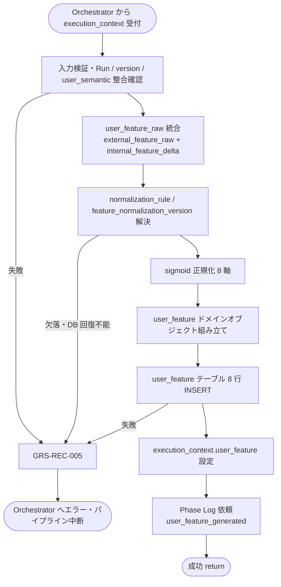

# User Feature Generator モジュール仕様書

## 1. ドキュメント情報

| 項目           | 内容                                              |
| -------------- | ------------------------------------------------- |
| ドキュメントID | `MOD-RECO-007`                                    |
| ドキュメント名 | User Feature Generator モジュール仕様書           |
| 対象システム   | Gift Recommendation Service（`apps/reco`）        |
| MVP対象        | `○`                                               |
| 作成日         | 2026-06-28                                        |
| 更新日         | 2026-06-28                                        |

---

## 2. 概要

User Feature Generator（User Feature 生成）は、Reco オンライン推薦パイプラインの **User Meaning フェーズ** において、`MOD-RECO-005` External Condition Feature Estimator および `MOD-RECO-006` Internal Condition Feature Estimator が推定した **外部条件 raw**（`external_feature_raw`）と **内部条件 Delta**（`internal_feature_delta`）を統合し、MVP 8 軸 Feature の **raw 値**（`user_feature_raw`）を算出したうえで **sigmoid 正規化**を適用して **User Feature**（`user_feature_normalized`）を生成するモジュールである。`MOD-RECO-001` Recommendation Orchestrator から **`MOD-RECO-006` の直後**に呼び出され、正規化結果を `user_feature` として `execution_context` へ返却し、**`user_feature` テーブルへ 8 行 INSERT** する。

本モジュールは **User Feature 統合・正規化・永続化** に責務を限定し、Semantic Concept 抽出・外部 / 内部条件 Feature 推定・User Meaning 射影・Retrieval / Matching / Ranking 計算は行わない。`005` / `006` が `execution_context` 上に推定結果を設定済みであること、および `MOD-RECO-004` による **`user_semantic` INSERT 完了**を前提とする。

---

## 3. 目的

- `apps/reco` における User Feature Generator 実装・単体テストの前提を定義する
- Orchestrator との I/F（`execution_context` 入出力）、失敗時のパイプライン中断（`GRS-REC-005`）、`user_feature` 永続化（IF-DB-RECO-003）を後続実装可能な粒度で整理する
- Recoモジュール一覧・Feature定義書・Featureルール定義書・Orchestrator 仕様書・`MOD-RECO-005` / `006` 仕様書・`user_feature_テーブル定義書` との整合を担保する

---

## 4. モジュール基本情報

| 項目 | 内容 |
| ---- | ---- |
| モジュールID | `MOD-RECO-007` |
| モジュール名 | User Feature 生成 |
| 物理名 | `User Feature Generator` |
| 分類 | User Meaning |
| 処理種別 | `OL` |
| 配置予定 | `apps/reco/src/reco/application/user-feature-generator/**` |
| 所属Epic | `MOD-RECO-007`（Epic Issue #821） |
| MVP対象 | `○` |
| 主な呼び出し元 | `MOD-RECO-001` Recommendation Orchestrator |
| 主な呼び出し先 | Normalization Rule Repository / User Feature Repository（`user_feature` INSERT） |

`MOD-API-*` / `MOD-RECO-*` / `MOD-BATCH-*` 配下の Task では、該当モジュール ID の責務範囲に変更を限定する。`MOD-RECO-*` では `apps/reco/src/reco/api/**` の API-INT エンドポイント層を対象に含めない。エンドポイント層の変更が必要な場合は、該当する `API-INT-*` Epic 配下 Task として扱う。

---

## 5. 責務

### 5.1 主責務

- `execution_context.external_feature_estimate.external_feature_raw` と `execution_context.internal_feature_estimate.internal_feature_delta` を Featureルール定義書 §12.2 に従い **8 軸ごとに加算**し、`user_feature_raw`（8 軸）を算出する
- Run 解決済み `semantic_config_version_id` に紐づく **`normalization_rule`** から `feature_normalization_version_id` を解決し、**`feature_normalization_version.parameter_json`** に基づき **sigmoid 正規化**を適用して `user_feature_normalized`（8 軸、0.0〜1.0）を生成する（Featureルール定義書 §14）
- 正規化結果を **`user_feature`** ドメインオブジェクトとして `execution_context` へ返却し、後続 `MOD-RECO-008` User Meaning Projector / `MOD-RECO-014` Feature Matcher 等へ引き渡す
- **`user_feature` テーブルへ 8 行 INSERT**（`recommendation_run_id` × `feature_code` 一意、IF-DB-RECO-003）する。各行に同一 `feature_normalization_version_id` と `source_type = aggregated` を記録する
- 8 行 INSERT 完了後、**Phase Log**（`phase_name = user_feature_generated`）を Orchestrator / `MOD-RECO-028` 経由で依頼する
- 生成失敗時に **`GRS-REC-005`** 相当のエラーを Orchestrator へ返却し、パイプライン中断を促す

### 5.2 対象外責務

- `API-INT-002` エンドポイント層（HTTP 受付、reco 側防御的 Validation、OpenAPI スキーマ整合）
- `MOD-RECO-001` Orchestrator の **実行順序制御**・Phase Log 契機管理（本モジュールは完了通知のみ）
- `MOD-RECO-003` Config / Version 解決（解決済み `config_versions` を消費するのみ）
- `MOD-RECO-002` Recommendation Run 記録（Run INSERT は完了済みであることを前提とする）
- `MOD-RECO-004` **Semantic Concept 抽出**・`user_semantic` 生成（INSERT 完了を前提とするのみ。本モジュールは Semantic 再抽出を行わない）
- **外部条件 Feature 推定**（`MOD-RECO-005` 責務）
- **内部条件 Feature 推定**（`MOD-RECO-006` 責務）
- **User Meaning 射影**（social / symbolic / `λ_ctx`。`MOD-RECO-008` 責務）
- **User Context 生成**（`MOD-RECO-009` 責務）
- **`ng_condition` / `budget_condition` の Feature 化**（Hard Filter 責務）
- Relationship / Occasion / Pair / Concept の **Rule ルックアップと Delta 推定**（`005` / `006` 責務）
- **`user_feature` の UPDATE / DELETE**（MVP では生成後不変）
- Phase Log / Error Log の **物理書き込み実装**（`MOD-RECO-028` / `029`。Orchestrator / Error Handler 経由）
- Public API 向けレスポンス形式への変換（`apps/api` 責務）
- OpenAPI / Orval / generated の変更
- DB schema / DDL の変更

---

## 6. 入出力

### 6.1 入力

| 入力 | 型 / 構造 | 必須 | 生成元 | 用途 | 備考 |
| ---- | --------- | ---- | ------ | ---- | ---- |
| `execution_context` | パイプライン実行コンテキスト | `true` | `MOD-RECO-001` | 生成の起点 | `run_id` / `trace_id` / `config_versions` を含む |
| `execution_context.external_feature_estimate` | 外部条件推定結果 | `true` | `MOD-RECO-005` | **主入力（外部 raw）** | `external_feature_raw` 必須 |
| `execution_context.external_feature_estimate.external_feature_raw` | `Record<feature_code, number>` | `true` | `MOD-RECO-005` | 外部条件統合 raw（8 軸） | §8.3.1 |
| `execution_context.internal_feature_estimate` | 内部条件推定結果 | `true` | `MOD-RECO-006` | **主入力（内部 Delta）** | `internal_feature_delta` 必須 |
| `execution_context.internal_feature_estimate.internal_feature_delta` | `Record<feature_code, number>` | `true` | `MOD-RECO-006` | 内部条件 Delta（8 軸） | 全軸 0 も可（§8.3.3） |
| `execution_context.config_versions.semantic_config_version_id` | `uuid` | `true` | `MOD-RECO-003` | 正規化 Rule 参照 version | Run 行と整合必須 |
| `execution_context.run_id` | `uuid` | `true` | `MOD-RECO-002` | Run 整合・INSERT キー | `recommendation_run_id` |
| `execution_context.semantic_extraction_result` | Semantic 抽出結果 | `false` | `MOD-RECO-004` | 監査・整合確認 | 本モジュールは **統合式に加算しない** |
| `execution_context.request` | `RecommendationRequest` | `true` | Orchestrator | 監査・ログ | 本モジュールは Request から Feature を再推定しない |

**前提データ（DB）**

| 入力 | 型 / 構造 | 必須 | 生成元 | 用途 | 備考 |
| ---- | --------- | ---- | ------ | ---- | ---- |
| 同一 Run の `user_semantic` 行 | DB 行 | `true` | `MOD-RECO-004` | 生成順序の論理前提 | `user_feature_テーブル定義書` §5.6 |
| `recommendation_run` 行 | DB 行 | `true` | `MOD-RECO-002` | Run 存在・version 整合 | SELECT 検証 |

**分解値の扱い**: `external_feature_estimate` の `relationship_feature` / `occasion_feature` / `pair_delta`、および `internal_feature_estimate` の `preferred_delta` / `avoid_delta` / `free_text_delta` は本モジュールの **統合式入力には用いない**（`005` / `006` が既に `external_feature_raw` / `internal_feature_delta` へ集約済み）。監査ログまたは将来拡張用に `execution_context` 上で参照可能である。

### 6.2 出力

| 出力 | 型 / 構造 | 利用先 | 用途 | 備考 |
| ---- | --------- | ------ | ---- | ---- |
| `user_feature` | ドメインオブジェクト（実装 Task で型定義） | `execution_context`、下位 `MOD-RECO-*` | 正規化済み User Feature 正本（Run 内メモリ） | Featureルール定義書 §12.5 相当 |
| `user_feature.features` | `Record<feature_code, number>` | `MOD-RECO-008` / `014` 等 | 正規化後 8 軸値（0.0〜1.0） | DB `feature_value` と一致 |
| `user_feature.user_feature_raw` | `Record<feature_code, number>` | ログ・将来分析 | 統合後未正規化 raw（8 軸） | **DB 非永続化**（§11） |
| `user_feature.feature_normalization_version_id` | `uuid` | 再現性・監査 | 適用正規化 version | 8 行 INSERT 共通 |
| `user_feature.semantic_config_version_id` | `uuid` | 監査 | Rule 参照 version | `config_versions` と一致必須 |
| `user_feature.generated_at` | `timestamptz` | 監査 | 生成完了日時（UTC） | 8 行共通 |
| `execution_context.user_feature` | 上記への参照 | Orchestrator 受け渡し | 後続フェーズ入力 | Orchestrator Port 契約 |
| `reco_error` | 標準化 reco エラー | Orchestrator | 生成失敗時 | `GRS-REC-005` |

**永続化**: 本モジュールは **`user_feature` テーブルへ 8 行 INSERT** する（IF-DB-RECO-003）。`user_feature_raw` および `005` / `006` の分解値は MVP では **DB に保存しない**（`user_feature_テーブル定義書` §5.3・§17.1 No.2 決定済み）。

**MVP 8 軸 `feature_code` 正本**: `formality`, `safety`, `brand_appropriateness`, `emotion`, `novelty`, `intimacy`, `symbolic_identity`, `story_richness`（Feature定義書 / enum定義書 §6.16）。

**出力名**: Recoモジュール一覧の **`user_feature`** を正とする（機能×モジュール対応表の論理出力名と同義）。

---

## 7. 依存関係

### 7.1 依存モジュール

| 依存先 | 方向 | 用途 | 失敗時の扱い | 備考 |
| ------ | ---- | ---- | ------------ | ---- |
| `MOD-RECO-001` Recommendation Orchestrator | 被呼び出し | OL パイプラインでの生成契機 | — | User Meaning フェーズ（論理順序 8） |
| `MOD-RECO-003` Config Version Resolver | 間接依存 | `semantic_config_version_id` の前提 | `003` 失敗時は本モジュール未到達 | 解決済み `config_versions` を入力 |
| `MOD-RECO-002` Recommendation Run Recorder | 間接依存 | `recommendation_run_id` の前提 | `002` 失敗時は本モジュール未到達 | Run INSERT 完了後に呼び出し |
| `MOD-RECO-004` User Semantic Extractor | 間接依存 | `user_semantic` INSERT 完了 | `004` 失敗時は本モジュール未到達 | 生成順序前提（§6.1） |
| `MOD-RECO-005` External Condition Feature Estimator | 直接依存 | `external_feature_estimate` | `005` 失敗時は本モジュール未到達 | `external_feature_raw` 必須 |
| `MOD-RECO-006` Internal Condition Feature Estimator | 直接依存 | `internal_feature_estimate` | `006` 失敗時は本モジュール未到達 | `internal_feature_delta` 必須 |
| `MOD-RECO-024` Reco Error Handler | 間接連携 | 例外の標準化 | 生成失敗でパイプライン中断 | Orchestrator 経由 |
| `MOD-RECO-028` Phase Log Writer | 間接連携 | `user_feature_generated` 記録 | 記録失敗は推薦結果に影響させない | §12 |
| `MOD-RECO-029` Error Log Writer | 間接連携 | 失敗詳細記録 | `MOD-RECO-024` 経由 | 失敗時 |

**下位利用モジュール（本モジュール出力の利用先）**

| モジュール | 利用する出力 |
| ---------- | ------------ |
| `MOD-RECO-008` User Meaning Projector | `user_feature.features`（正規化 8 軸） |
| `MOD-RECO-009` User Context Builder | `user_feature`（論理入力の一部） |
| `MOD-RECO-014` Feature Matcher | `user_feature`（Matching 入力） |
| `MOD-RECO-015`〜`018` | 間接（Matching / Ranking 経由） |

### 7.2 参照データ

| データ | 参照元 | 用途 | version / config | 備考 |
| ------ | ------ | ---- | ---------------- | ---- |
| `normalization_rule` | DB | 正規化 binding 解決 | 当該 `semantic_config_version_id` | `is_active = true` のみ。読み取りのみ |
| `feature_normalization_version` | DB | sigmoid パラメータ（`parameter_json`） | `normalization_rule` 経由 | 読み取りのみ |
| `recommendation_run` | DB | Run 存在・version 整合 | Run 固定 | SELECT 検証 |
| `user_semantic` | DB | 生成順序・version 整合 | Run 固定 | 存在確認。本モジュールは UPDATE しない |
| `semantic_config_version` | DB | version 有効性 | `config_versions` | 読み取りのみ |

**正規化解決フロー（正本: `user_feature_テーブル定義書` §12.1）**

```text
semantic_config_version_id（Run / config_versions）
  → normalization_rule（is_active=true, version 内 1 行）
  → feature_normalization_version_id
  → feature_normalization_version.parameter_json
  → sigmoid 正規化（8 軸）
```

---

## 8. 処理仕様

### 8.1 処理フロー



### 8.2 処理ステップ

| No | 処理 | 入力 | 出力 | 補足 |
| --: | ---- | ---- | ---- | ---- |
| 1 | 入力検証 | `execution_context` | — | `run_id` / `semantic_config_version_id` / `external_feature_estimate` / `internal_feature_estimate` 必須 |
| 2 | Run 整合確認 | `recommendation_run_id` | — | Run 存在、`semantic_config_version_id` が Run 行と一致 |
| 3 | Semantic 前提確認 | `recommendation_run_id` | — | 同一 Run の `user_semantic` 行が存在すること |
| 4 | User Feature raw 統合 | `external_feature_raw`, `internal_feature_delta` | `user_feature_raw`（8 軸） | §8.3.1 |
| 5 | 正規化 binding 解決 | `semantic_config_version_id` | `feature_normalization_version_id`, `parameter_json` | §8.3.2 |
| 6 | sigmoid 正規化 | `user_feature_raw`, パラメータ | `user_feature_normalized`（8 軸） | §8.3.3 |
| 7 | 結果組み立て | 正規化結果 + メタデータ | `user_feature` ドメインオブジェクト | `generated_at` 設定 |
| 8 | DB 永続化 | 8 軸値 | `user_feature` 8 行 | §11。`source_type = aggregated` |
| 9 | 結果返却 | 組み立て結果 | `execution_context.user_feature` | 後続 `008` へ |
| 10 | Phase Log 依頼 | 成功 | — | `phase_name = user_feature_generated` |

**Orchestrator 呼び出し順序（正本: MOD-RECO-001 §8.2.1）**

```text
… → MOD-RECO-005 外部条件 Feature 推定 → MOD-RECO-006 内部条件 Feature 推定 → MOD-RECO-007 User Feature 生成 → MOD-RECO-008 …
```

本モジュールは User Meaning フェーズの **論理順序 8** である。`MOD-RECO-006` 完了後に Orchestrator が呼び出す（Recoモジュール一覧 §5.2）。

### 8.3 アルゴリズム / 計算仕様

Featureルール定義書 §12.2・§12.5・§14 に従う。MVP は **Rule ベース sigmoid 正規化**（LLM 不使用）。

| 項目 | 内容 |
| ---- | ---- |
| 統合方式 | `005` / `006` 出力の **8 軸加算**（Feature 再推定なし） |
| 正規化方式 | `normalization_method = sigmoid`（MVP 固定） |
| Rule version | `execution_context.config_versions.semantic_config_version_id` に紐づく binding のみ |
| 値域（raw） | `user_feature_raw` は **0.0〜1.0 外**となり得る |
| 値域（normalized） | `user_feature_normalized[axis]` は **0.0〜1.0**（DB CHECK 整合） |
| clip | **主正規化に用いない**。異常値対策として sigmoid 後の最終安全 clip のみ許容（Featureルール定義書 §14.1 注記） |

#### 8.3.1 User Feature raw 統合式（MVP）

Featureルール定義書 §12.2 を正とする。`005` / `006` が算出済みの集合を **そのまま加算**する。

```text
user_feature_raw[axis]
  = external_feature_raw[axis]
  + internal_feature_delta[axis]
```

| パラメータ | 供給元 | 備考 |
| ---------- | ------ | ---- |
| `external_feature_raw[axis]` | `MOD-RECO-005` | relationship / occasion / pair 統合済み |
| `internal_feature_delta[axis]` | `MOD-RECO-006` | preferred / avoid / free_text 統合済み |

**8 軸ループ**: MVP 固定 8 `feature_code` すべてについて上式を適用する。キー欠落時は **0** として扱わない — 入力オブジェクトに 8 軸すべてが存在することを入力検証で要求する（§8.3.4）。

#### 8.3.2 正規化パラメータ解決（MVP）

| ステップ | 内容 |
| -------- | ---- |
| 1 | `semantic_config_version_id` で `normalization_rule` を Lookup（`is_active = true`） |
| 2 | `feature_normalization_version_id` を取得 |
| 3 | `feature_normalization_version.parameter_json` から `center_feature` / `k_feature` を読取 |
| 4 | `normalization_method` が `sigmoid` であることを検証 |

MVP 初期パラメータ（Featureルール定義書 §14.3、全 Feature 共通）:

| パラメータ | 初期値 | 内容 |
| ---------- | -----: | ---- |
| `center_feature` | `0.5` | 中立点 |
| `k_feature` | `4.0` | 感度係数 |

version ごとの上書きは `parameter_json` 正本に従う（`feature_normalization_version_テーブル定義書`）。

#### 8.3.3 sigmoid 正規化（MVP）

Featureルール定義書 §14.2 を正とする。各 `feature_code` 軸について:

```text
user_feature_normalized[axis]
  = sigmoid(k_feature * (user_feature_raw[axis] - center_feature))
```

```text
sigmoid(x) = 1 / (1 + exp(-x))
```

| 観点 | 方針 |
| ---- | ---- |
| 出力値域 | 理論上 (0, 1)。DB 保存時は `numeric(8,6)` かつ CHECK `0.0〜1.0` |
| 最終 clip | sigmoid 後のみ §8.3.3.1 `guard_clip` を適用（raw への clip は禁止） |
| raw 保持 | `user_feature.user_feature_raw` に Run 内メモリ正本として保持（§12.5） |

##### 8.3.3.1 sigmoid 後 guard_clip（MVP 確定）

Featureルール定義書 §3.7 の `guard_clip(normalized_value, 0.0, 1.0)` を正とする。主正規化の代替ではなく、浮動小数誤差・`numeric(8,6)` / CHECK 整合の **最終安全ガード** のみに用いる。

```text
sigmoid_value = sigmoid(k_feature * (user_feature_raw[axis] - center_feature))

if sigmoid_value is NaN or is_infinite(sigmoid_value):
  fail with GRS-REC-005

feature_value = guard_clip(sigmoid_value, 0.0, 1.0)
feature_value = round_to_scale(feature_value, 6)   # numeric(8,6) 整合
```

| 項目 | MVP 確定値 | 備考 |
| ---- | ---------- | ---- |
| `guard_clip` 下限 | **`0.0`（ inclusive ）** | Feature定義書 §3.1 値域と一致 |
| `guard_clip` 上限 | **`1.0`（ inclusive ）** | `chk_user_feature_value_range` と一致 |
| 算式 | `min(1.0, max(0.0, sigmoid_value))` | 端点 0.0 / 1.0 は有効値（open interval 化しない） |
| DB 保存前丸め | **小数第 6 位**（round half to even 可） | `numeric(8,6)` 列整合 |
| NaN / ±Inf | **`GRS-REC-005` で失敗** | 0.5 等への黙示的フォールバックは行わない |
| clip 発動監視 | pre-guard 値が `[0.0, 1.0]` 外の軸数を Metric 記録可 | §12.1 `user_feature_guard_clip_applied_count`。sigmoid 単体では稀 |

**採用理由（要約）**: sigmoid（`k=4`, `center=0.5`）は理論上 (0, 1) だが、極端 raw や浮動小数演算で `1.0` 超過・微小負値が起こり得る。閾値を `[0.0, 1.0]` 以外に設けると Feature定義書・DB CHECK と二重管理になり、意味の潰れも生じうるため、正本どおり **端点固定の guard_clip のみ** とする。

#### 8.3.4 入力欠落・異常時の扱い

| 条件 | 扱い | Error Code |
| ---- | ---- | ---------- |
| `external_feature_estimate` 欠落 | 失敗 | `GRS-REC-005` |
| `internal_feature_estimate` 欠落 | 失敗 | `GRS-REC-005` |
| `external_feature_raw` / `internal_feature_delta` の 8 軸キー欠落 | 失敗 | `GRS-REC-005` |
| `internal_feature_delta` 全軸 0 | **成功** | — |
| `normalization_rule` 欠落（active 行なし） | 失敗 | `GRS-REC-005` |
| `feature_normalization_version` 欠落 / `parameter_json` 不正 | 失敗 | `GRS-REC-005` |
| 同一 Run の `user_semantic` 行なし | 失敗 | `GRS-REC-005` |
| `semantic_config_version_id` 不一致 / Run 未存在 | 失敗 | `GRS-REC-005` |
| `user_feature` INSERT 失敗（unique 違反含む） | 失敗 | `GRS-REC-005` |
| 同一 Run への 2 回目 INSERT 試行 | 失敗 | `GRS-REC-005`（`uq_user_feature_per_run_axis`） |

#### 8.3.5 Orchestrator Port 契約（概要）

| 方向 | 契約 |
| ---- | ---- |
| 呼び出し | `generate_user_features(execution_context) -> execution_context`（メソッド名は実装 Task で確定） |
| 成功 | `execution_context.user_feature` が設定され、DB に 8 行 INSERT 済み |
| 失敗 | 例外または `reco_error`（`GRS-REC-005`）を Orchestrator へ返却。後続 `008`〜`023` は **呼ばれない** |
| Phase Log | 成功時 **`user_feature_generated`** を依頼（§12） |
| Wiring | User Meaning フェーズ（`004`〜`010`）は **未配線（スタブ）**（MOD-RECO-001 §8.4.2）。本モジュール実装 Task 完了後、フェーズ Wiring Task で差し替え |

---

## 9. データ項目マッピング

| 入力項目 | 内部項目 | 出力項目 | 変換内容 | 備考 |
| -------- | -------- | -------- | -------- | ---- |
| `external_feature_estimate.external_feature_raw[axis]` | `external_raw[axis]` | — | 統合入力 | `005` 正本 |
| `internal_feature_estimate.internal_feature_delta[axis]` | `internal_delta[axis]` | — | 統合入力 | `006` 正本 |
| 統合結果 | `user_feature_raw[axis]` | `user_feature.user_feature_raw` | §8.3.1 加算 | メモリのみ |
| sigmoid 結果 | `normalized[axis]` | `user_feature.features[axis]` | §8.3.3 | DB `feature_value` |
| `normalization_rule.feature_normalization_version_id` | `norm_version_id` | `user_feature.feature_normalization_version_id` | binding 解決 | 8 行共通 |
| `config_versions.semantic_config_version_id` | `version_id` | `user_feature.semantic_config_version_id` | エコー | Run と一致必須 |
| `run_id` | `recommendation_run_id` | `user_feature.recommendation_run_id` | エコー | INSERT キー |
| — | `generated_at` | `user_feature.generated_at` | `now()` UTC | 8 行共通 |
| — | — | `user_feature` 行 × 8 | INSERT | `source_type = aggregated` |
| — | — | `execution_context.user_feature` | コンテキスト格納 | Port 契約 |

---

## 10. 状態・例外

### 10.1 状態

本モジュールは Run 内 **1 回実行・ステートレス**（再生成・UPDATE は MVP 禁止）とする。

| 状態 | 意味 | 遷移条件 | 記録先 |
| ---- | ---- | -------- | ------ |
| — | モジュール内部状態なし | — | — |

Run 全体の状態（`recommendation_run.status`）は `MOD-RECO-002` が管理。本モジュール失敗時は Run を `failed` へ遷移させる（Orchestrator / `002` 連携）。

### 10.2 例外

| 例外 | Error Code | 発生条件 | 呼び出し元への返却 | ログ |
| ---- | ---------- | -------- | ------------------ | ---- |
| User Feature 生成失敗 | `GRS-REC-005` | 統合・正規化・DB INSERT の回復不能エラー | 500 系。パイプライン中断 | Error Log + 構造化ログ |
| Run 不整合 | `GRS-REC-005` | Run 未存在、`semantic_config_version_id` 不一致 | 同上 | 同上 |
| 入力検証失敗 | `GRS-REC-005` | 必須 estimate 欠落・8 軸キー欠落 | 同上 | 同上 |
| 正規化 Rule 欠落 | `GRS-REC-005` | `normalization_rule` / `feature_normalization_version` 解決不能 | 同上 | 同上 |
| Semantic 前提未充足 | `GRS-REC-005` | 同一 Run の `user_semantic` 不存在 | 同上 | 同上 |
| 永続化失敗 | `GRS-REC-005` | `user_feature` INSERT 失敗・unique 違反 | 同上 | 同上 |

Error Code の正本はエラーコード定義書。Orchestrator は `MOD-RECO-005`〜`009` 失敗を **User Feature 系失敗**として `GRS-REC-005` に集約する（MOD-RECO-001 §10.2）。

**リトライ**: 本モジュール内の自動リトライは MVP では **行わない**。呼び出し元による再 Run は新規 `recommendation_run` として扱う。

---

## 11. DB / 永続化

### 11.1 書き込み

| テーブル | 操作 | 主な項目 | トランザクション | 備考 |
| -------- | ---- | -------- | ---------------- | ---- |
| `user_feature` | INSERT × 8 | `recommendation_run_id`, `feature_code`, `feature_value`, `feature_normalization_version_id`, `source_type`, `generated_at` | Run 内 1 トランザクション推奨 | IF-DB-RECO-003。`uq_user_feature_per_run_axis` |

**INSERT 方針**

| 観点 | 方針 |
| ---- | ---- |
| 行数 | **8 行 / Run**（MVP 8 `feature_code` 各 1 行） |
| `feature_value` | sigmoid 正規化後値（`user_feature_normalized`） |
| `source_type` | **`aggregated` 固定**（全 8 行） |
| `feature_normalization_version_id` | 8 行すべて同一 ID |
| raw 値 | **永続化しない**（reco 内一時変数 / `execution_context` メモリのみ） |
| UPDATE / DELETE | **禁止**（MVP） |
| 冪等性 | 同一 Run への 2 回目 INSERT は unique 制約で拒否 |

### 11.2 読み取り

| テーブル | 操作 | 主な項目 | トランザクション | 備考 |
| -------- | ---- | -------- | ---------------- | ---- |
| `normalization_rule` | SELECT | binding, `feature_normalization_version_id` | 読み取りのみ | version 絞り込み |
| `feature_normalization_version` | SELECT | `parameter_json`, `normalization_method` | 読み取りのみ | sigmoid パラメータ |
| `recommendation_run` | SELECT | Run 存在・version | 読み取りのみ | 整合検証 |
| `user_semantic` | SELECT | Run 存在 | 読み取りのみ | 生成順序前提 |

**永続化ポリシー（`005` / `006` との境界）**

| 観点 | 方針 |
| ---- | ---- |
| `005` / `006` 出力 | **メモリのみ**（`execution_context`） |
| 本モジュール出力（DB） | **正規化後 8 行のみ**（`user_feature`） |
| 寄与分解 | Relationship / Occasion / Concept 等の個別 source は MVP では DB に保存しない |

---

## 12. ログ・メトリクス

| 種別 | 内容 | 出力タイミング | 保存先 | 備考 |
| ---- | ---- | -------------- | ------ | ---- |
| 構造化ログ | 生成サマリ（`run_id`, `feature_normalization_version_id`, `duration_ms`, 8 軸の min/max のみ） | 生成完了時 | アプリログ | `trace_id` 必須。Feature 全量ダンプは避ける |
| Phase Log 依頼 | `phase_name = user_feature_generated` | 8 行 INSERT 完了後 | `phase_log`（`MOD-RECO-028`） | enum定義書 §6.18・状態遷移設計書 |
| Error Log 依頼 | `GRS-REC-005` 詳細 | 失敗時 | `error_log`（`MOD-RECO-029`） | `MOD-RECO-024` 経由 |
| Metric 依頼 | `user_feature_generation_latency_ms` | 生成完了時 | Metric Logger（`MOD-RECO-025`） | MVP 対象 `△` |

**Phase Log（MVP）**: User Meaning フェーズにおいて **`user_feature_generated` は本モジュール成功時に記録する**（`005` / `006` には専用 `phase_name` なし — MOD-RECO-005 §12 と対比）。`semantic_extracted`（`004`）の次の User Meaning 系 Phase 正本は本値とする（ログ・Observability設計書 §10.3、`phase_log_テーブル定義書` §11.2）。

**INSERT と Phase Log のトランザクション境界（MVP 確定）**

| 観点 | 方針 |
| ---- | ---- |
| 実行順 | `user_feature` 8 行 INSERT **成功後**に Phase Log 依頼（best-effort） |
| 同一 DB トランザクション | **含めない**。Phase Log 失敗で Feature INSERT をロールバックしない |
| Phase Log 失敗時 | 警告ログ + Metric 記録。**推薦結果・Run 成功・`execution_context.user_feature` は維持**（MOD-RECO-001 / `MOD-RECO-028` 方針） |
| 本モジュールの成功判定 | **8 行 INSERT 完了**をもって成功。Phase Log 成否は成功条件に含めない |

### 12.1 メトリクス

| Metric | 内容 | 集計単位 | 用途 |
| ------ | ---- | -------- | ---- |
| `user_feature_generation_latency_ms` | User Feature 生成処理時間（統合 + 正規化 + INSERT） | Run | ボトルネック分析 |
| `user_feature_raw_out_of_range_count` | raw 値が [0,1] 外となった軸数 | Run | 正規化前分布監視 |
| `user_feature_guard_clip_applied_count` | guard_clip 適用前に `[0.0, 1.0]` 外だった軸数 | Run | sigmoid 後安全ガード監視 |

---

## 13. 性能・非機能

### 13.1 方針概要

| 観点 | 方針 |
| ---- | ---- |
| レイテンシ | MVP 初版では **モジュール単体 hard timeout を設けない**。User Meaning 一括（`004`〜`010`）**hard 1,000ms** を上位ガードとする（MOD-RECO-001 §13.2） |
| 計算量 | 8 軸加算 + sigmoid 8 回 + DB INSERT 8 行。O(1) 算術 |
| タイムアウト | 本モジュール単体の hard 上限は **MVP では設けない**（§16.1 No.1 確定済み）。Orchestrator の User Meaning 一括ウォッチドッグ（1,000ms）が適用される |
| リトライ | モジュール内自動リトライ **なし**（§10.2） |
| キャッシュ | 同一 Run 内で `normalization_rule` / `feature_normalization_version` のメモリキャッシュ可 |
| 並列実行 | 不要（Orchestrator 直列呼び出し） |

### 13.2 タイムアウト（MVP）

| 種別 | 対象 | MVP 値 | 超過時の扱い |
| ---- | ---- | ------ | ------------ |
| hard | `MOD-RECO-007` 単体 | **なし**（PoC 後に §13.2 へ追記可 — §16.1 No.1 確定済み） | — |
| hard（上位） | User Meaning 一括（`004`〜`010`） | **1,000ms** | 該当 `GRS-REC-004`〜`007`（MOD-RECO-001 §13.2） |
| hard（全体） | 推薦パイプライン全体 | **4,000ms** | `GRS-REC-101` |

---

## 14. テスト観点

| No | 観点 | 確認内容 | 種別 |
| --: | ---- | -------- | ---- |
| 1 | 正常系（統合式） | `user_feature_raw[axis]` が `external_feature_raw + internal_feature_delta` と一致すること | unit |
| 2 | 正常系（sigmoid） | 代表 raw 値で sigmoid 出力が Featureルール定義書 §14.2 と一致すること | unit |
| 3 | 正常系（8 軸完備） | 8 `feature_code` すべてについて正規化値が 0.0〜1.0 であること | unit |
| 4 | 正常系（内部 Delta ゼロ） | `internal_feature_delta` 全 0 でも `external_feature_raw` のみで成功すること | unit |
| 5 | 正常系（DB INSERT） | 成功時に `user_feature` へ 8 行 INSERT され、値・version が一致すること | unit / integration |
| 6 | 正常系（Phase Log） | 成功時に `user_feature_generated` Phase Log 依頼が行われること | integration |
| 7 | version 整合 | 出力 `feature_normalization_version_id` が binding 解決結果と一致すること | unit |
| 8 | 境界値（raw 超域） | raw が 1.0 超でも sigmoid + guard_clip 後に DB CHECK 内に収まること | unit |
| 9 | 境界値（center = 0.5） | raw = 0.5 で normalized ≈ 0.5 となること（§14.3 例） | unit |
| 9a | guard_clip 端点 | sigmoid 出力が 1.0000001 等のとき `feature_value = 1.0` となること | unit |
| 9b | NaN / Inf | sigmoid 結果が NaN / ±Inf のとき `GRS-REC-005` となること | unit |
| 10 | 例外系（estimate 欠落） | `external_feature_estimate` または `internal_feature_estimate` 欠落で `GRS-REC-005` となること | unit |
| 11 | 例外系（8 軸キー欠落） | raw / delta の軸欠落で `GRS-REC-005` となること | unit |
| 12 | 例外系（正規化 Rule 欠落） | `normalization_rule` 欠落で `GRS-REC-005` となること | unit |
| 13 | 例外系（user_semantic 未存在） | 同一 Run に `user_semantic` なしで `GRS-REC-005` となること | unit |
| 14 | 例外系（Run 不整合） | Run 未存在・version 不一致で `GRS-REC-005` となること | unit |
| 15 | 例外系（INSERT 失敗） | unique 違反・DB エラーで `GRS-REC-005` となること | unit / integration |
| 16 | 非再推定 | Request 変更のみでは `005` / `006` 未再実行時に結果が変わらないこと | unit |
| 17 | raw 非永続化 | 成功時も `user_feature_raw` が DB に保存されないこと | unit |
| 18 | Orchestrator 連携 | 明示 DI で Orchestrator が `006` 成功後に `007` を呼び、`007` 失敗時に `008` 以降を呼ばないこと | integration |
| 19 | ログ | `trace_id` が構造化ログに含まれ、secret が含まれないこと | unit |
| 20 | タイムアウト | User Meaning 一括 hard 1,000ms 超過で `GRS-REC-005` 系となること（単体 hard は MVP 未設定） | integration |
| 21 | 出力受け渡し | `user_feature` が `execution_context` に格納され `008` が参照できること | unit / integration |

---

## 15. 変更管理

### 15.1 変更履歴

| 日付 | 変更内容 | 関連Issue / PR |
| ---- | -------- | -------------- |
| 2026-06-28 | 初版作成 | Issue #822 |
| 2026-06-28 | §8.3.3.1 guard_clip 確定・§12 Phase Log トランザクション境界確定 | Issue #822 Human 判断 |

---

## 16. 未決事項

| No | 論点 | 判断が必要な理由 | 判断者 | 期限 | 備考 |
| --: | ---- | ---------------- | ------ | ---- | ---- |
| - | なし | - | - | - | - |

### 16.1 確定済み論点（`005` / `006` Human 判断と整合）

| No | 論点 | 確定内容 |
| --: | ---- | -------- |
| 1 | タイムアウト（MVP 初版） | **モジュール単体 hard を設けない**。User Meaning 一括 **hard 1,000ms** のみ。単体 soft / hard 値は PoC 後に §13.2 へ追記 |
| 2 | Phase Log 粒度 | `005` / `006` に専用 `phase_name` は **追加しない**。**`user_feature_generated` は本モジュール（`007`）成功時に記録** |
| 3 | raw / 分解値の Run 永続化 | **`user_feature_raw` および `005` / `006` 分解値は DB に保存しない**。正規化後 `user_feature` 8 行のみ（`user_feature_テーブル定義書` §5.3） |
| 4 | 正規化方式 | MVP は **固定パラメータ sigmoid**（Featureルール定義書 §14.2）。`normalization_rule` → `feature_normalization_version` binding で解決 |
| 5 | `source_type` | **`aggregated` 固定**（全 8 行） |
| 6 | sigmoid 後 guard_clip | **`guard_clip(v, 0.0, 1.0)`** → **小数第 6 位丸め** → INSERT。NaN / ±Inf は **`GRS-REC-005`**（§8.3.3.1） |
| 7 | INSERT と Phase Log のトランザクション境界 | INSERT **成功で本モジュール成功**。Phase Log は **best-effort・別トランザクション**。Phase Log 失敗は **推薦結果に影響させない**（§12） |

---

## 17. 関連資料

| 種別 | パス / URL | 用途 |
| ---- | ---------- | ---- |
| Recoモジュール一覧 | `docs/05_アプリケーション設計/アプリ/reco/Recoモジュール一覧.md` | モジュール定義・§6.6 User Feature 生成 |
| モジュール一覧 | `docs/05_アプリケーション設計/アプリ/モジュール一覧.md` | 全体配置 |
| 機能×モジュール対応表 | `docs/05_アプリケーション設計/アプリ/機能×モジュール対応表.md` | 入出力・パイプライン順序 |
| Feature定義書 | `docs/04_ドメインモデル設計/Feature定義書.md` | 8 軸定義 |
| Featureルール定義書 | `docs/04_ドメインモデル設計/Featureルール定義書.md` | 統合式・sigmoid 正規化 |
| user_feature テーブル定義書 | `docs/06_実装設計/database/user_feature_テーブル定義書.md` | 永続化・Phase Log |
| user_semantic テーブル定義書 | `docs/06_実装設計/database/user_semantic_テーブル定義書.md` | 生成順序前提 |
| normalization_rule テーブル定義書 | `docs/06_実装設計/database/normalization_rule_テーブル定義書.md` | binding 解決 |
| feature_normalization_version テーブル定義書 | `docs/06_実装設計/database/feature_normalization_version_テーブル定義書.md` | sigmoid パラメータ |
| インターフェース一覧 | `docs/05_アプリケーション設計/アプリ/インターフェース一覧.md` | IF-DB-RECO-003 |
| エラーコード定義書 | `docs/05_アプリケーション設計/アプリ/エラーコード定義書.md` | `GRS-REC-005` |
| ログ・Observability設計書 | `docs/05_アプリケーション設計/アプリ/ログ・Observability設計書.md` | Phase / Metric |
| MOD-RECO-001 仕様書 | `docs/06_実装設計/reco/MOD-RECO-001_Recommendation Orchestratorモジュール仕様書.md` | 呼び出し順・失敗時中断 |
| MOD-RECO-005 仕様書 | `docs/06_実装設計/reco/MOD-RECO-005_External Condition Feature Estimatorモジュール仕様書.md` | 外部 raw 供給・責務境界 |
| MOD-RECO-006 仕様書 | `docs/06_実装設計/reco/MOD-RECO-006_Internal Condition Feature Estimatorモジュール仕様書.md` | 内部 Delta 供給・責務境界 |
| module-spec テンプレート | `prompts/templates/docs/module-spec.md` | 章構成 |
| Epic Definition | `prompts/definitions/epics/mod-reco-007-user-feature-generator/epic.yaml` | allowed_paths |

---

## 18. レビュー観点

- Recoモジュール一覧 §4 / §6.6 のモジュール名・物理名・分類・処理種別・MVP 対象と一致している
- モジュール一覧の `MOD-RECO-007` 行と整合している
- Orchestrator（MOD-RECO-001）との I/F（`execution_context` 入出力・`GRS-REC-005` 失敗時中断）が明確である
- `apps/reco/src/reco/api/**`（API-INT エンドポイント層）の変更を本仕様書の実装範囲に含めていない
- Featureルール定義書 §12.2・§14 の統合式・sigmoid 正規化と一致している
- `MOD-RECO-005` / `006` との責務境界（raw / Delta 推定 vs 統合・正規化・永続化）が明確である
- `user_feature_テーブル定義書` の 8 行 INSERT・`source_type = aggregated`・raw 非永続化方針と一致している
- `user_feature_generated` Phase Log 記録タイミングがログ・Observability 設計と一致している
- secret や `.env` 実値が含まれていない

---

## 19. 備考

- 本仕様書は `MOD-RECO-007` の **User Feature 統合・正規化・永続化** 責務に限定する
- 配置パスは Epic `epic_scope.allowed_paths` に従い `apps/reco/src/reco/application/user-feature-generator/**` を正とする
- User Meaning フェーズ Wiring（`004`〜`010` スタブ差し替え）は Orchestrator 実装 / Wiring Task の責務であり、本 Task scope 外である
