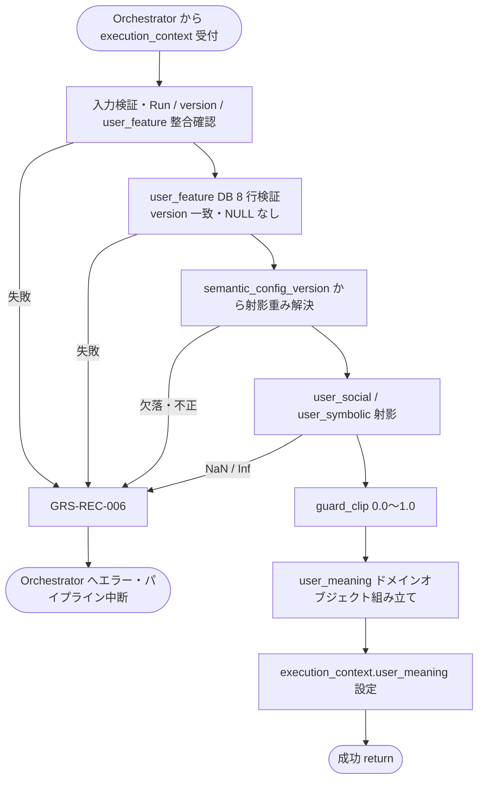

# User Meaning Projector モジュール仕様書

## 1. ドキュメント情報

| 項目           | 内容                                              |
| -------------- | ------------------------------------------------- |
| ドキュメントID | `MOD-RECO-008`                                    |
| ドキュメント名 | User Meaning Projector モジュール仕様書           |
| 対象システム   | Gift Recommendation Service（`apps/reco`）        |
| MVP対象        | `○`                                               |
| 作成日         | 2026-06-29                                        |
| 更新日         | 2026-06-29（§16 推奨案確定）                      |

---

## 2. 概要

User Meaning Projector（User Meaning 射影）は、Reco オンライン推薦パイプラインの **User Meaning フェーズ** において、`MOD-RECO-007` User Feature Generator が生成した **正規化済み User Feature**（`user_feature`）を Gift Meaning Space 上の **Social / Symbolic 座標**（`user_social` / `user_symbolic`）へ射影するモジュールである。`MOD-RECO-001` Recommendation Orchestrator から **`MOD-RECO-007` の直後**に呼び出され、射影結果を `user_meaning` ドメインオブジェクト（射影部分）として `execution_context` へ返却し、後続 `MOD-RECO-009` User Context Builder / `MOD-RECO-015` Meaning Match Aggregator / `MOD-RECO-016` Context Scorer 等へ引き渡す。

本モジュールは **User Feature → Social / Symbolic 射影** に責務を限定し、Feature 統合・正規化、`λ_ctx`（`lambda_ctx`）算出、User Context 生成、`user_meaning` テーブル INSERT、Retrieval / Matching / Ranking 計算は行わない。`007` が `execution_context.user_feature` および `user_feature` テーブルへ 8 行 INSERT 済みであることを前提とする。

---

## 3. 目的

- `apps/reco` における User Meaning Projector 実装・単体テストの前提を定義する
- Orchestrator との I/F（`execution_context` 入出力）、失敗時のパイプライン中断（`GRS-REC-006`）を後続実装可能な粒度で整理する
- Recoモジュール一覧・GiftMeaningSpace定義書・`user_meaning_テーブル定義書`・Orchestrator 仕様書・`MOD-RECO-007` 仕様書との整合を担保する

---

## 4. モジュール基本情報

| 項目 | 内容 |
| ---- | ---- |
| モジュールID | `MOD-RECO-008` |
| モジュール名 | User Meaning 射影 |
| 物理名 | `User Meaning Projector` |
| 分類 | User Meaning |
| 処理種別 | `OL` |
| 配置予定 | `apps/reco/src/reco/application/user-meaning-projector/**` |
| 所属Epic | `MOD-RECO-008`（Epic Issue #829） |
| MVP対象 | `○` |
| 主な呼び出し元 | `MOD-RECO-001` Recommendation Orchestrator |
| 主な呼び出し先 | Meaning Projection Config Repository（射影重み参照） |

`MOD-API-*` / `MOD-RECO-*` / `MOD-BATCH-*` 配下の Task では、該当モジュール ID の責務範囲に変更を限定する。`MOD-RECO-*` では `apps/reco/src/reco/api/**` の API-INT エンドポイント層を対象に含めない。エンドポイント層の変更が必要な場合は、該当する `API-INT-*` Epic 配下 Task として扱う。

---

## 5. 責務

### 5.1 主責務

- `execution_context.user_feature.features`（正規化済み 8 軸、`0.0〜1.0`）を入力として、GiftMeaningSpace定義書 §5.2 / §5.3 の射影式に従い **`user_social`** および **`user_symbolic`** を算出する
- Run 解決済み `semantic_config_version_id` に紐づく **Social / Symbolic 射影重み**（`w_formality` 等）を解決し、**加重平均**を適用する。重み未設定時は **単純平均** とする（`user_meaning_テーブル定義書` §5.3・§17.1 No.3）
- 射影結果を **`user_meaning`** ドメインオブジェクト（射影部分）として `execution_context` へ返却し、後続 `MOD-RECO-009` / `015` / `016` 等へ引き渡す
- 入力 `user_feature` の `feature_normalization_version_id` を射影結果メタデータとして保持し、後続 `user_meaning` 行 INSERT 時の再現性キーとする
- 射影失敗時に **`GRS-REC-006`** 相当のエラーを Orchestrator へ返却し、パイプライン中断を促す

### 5.2 対象外責務

- `API-INT-002` エンドポイント層（HTTP 受付、reco 側防御的 Validation、OpenAPI スキーマ整合）
- `MOD-RECO-001` Orchestrator の **実行順序制御**・Phase Log 契機管理（本モジュールは射影計算のみ）
- `MOD-RECO-003` Config / Version 解決（解決済み `config_versions` を消費するのみ）
- `MOD-RECO-002` Recommendation Run 記録（Run INSERT は完了済みであることを前提とする）
- `MOD-RECO-004` Semantic Concept 抽出・`user_semantic` 生成
- **User Feature 統合・正規化・永続化**（`MOD-RECO-007` 責務）
- **`λ_ctx`（`lambda_ctx`）算出**（`MOD-RECO-009` 責務。`user_meaning_テーブル定義書` §5.4）
- **User Context 生成**（preferred / non_preferred context、`MOD-RECO-009` 責務）
- **`user_meaning` テーブル INSERT**（`lambda_ctx` 非 NULL 列を含む 1 行 INSERT は `009` 完了後に IF-DB-RECO-003 で実施。§11）
- **`user_meaning_projected` Phase Log 記録**（`user_meaning` 行 INSERT 成功後。`009` または INSERT 担当モジュールの責務。§12）
- Query Embedding 生成・Retrieval / Matching / Ranking 計算
- **`ng_condition` / `budget_condition` の Feature 化**（Hard Filter 責務）
- **`user_meaning` の UPDATE / DELETE**（MVP では生成後不変）
- Phase Log / Error Log の **物理書き込み実装**（`MOD-RECO-028` / `029`。Orchestrator / Error Handler 経由）
- Public API 向けレスポンス形式への変換（`apps/api` 責務）
- OpenAPI / Orval / generated の変更
- DB schema / DDL の変更

---

## 6. 入出力

### 6.1 入力

| 入力 | 型 / 構造 | 必須 | 生成元 | 用途 | 備考 |
| ---- | --------- | ---- | ------ | ---- | ---- |
| `execution_context` | パイプライン実行コンテキスト | `true` | `MOD-RECO-001` | 射影の起点 | `run_id` / `trace_id` / `config_versions` を含む |
| `execution_context.user_feature` | User Feature ドメインオブジェクト | `true` | `MOD-RECO-007` | **主入力** | §8.3.1 |
| `execution_context.user_feature.features` | `Record<feature_code, number>` | `true` | `MOD-RECO-007` | 正規化済み 8 軸値（0.0〜1.0） | DB `feature_value` と一致 |
| `execution_context.user_feature.feature_normalization_version_id` | `uuid` | `true` | `MOD-RECO-007` | 再現性・監査 | 後続 `user_meaning` INSERT キー |
| `execution_context.config_versions.semantic_config_version_id` | `uuid` | `true` | `MOD-RECO-003` | 射影重み参照 version | Run 行と整合必須 |
| `execution_context.run_id` | `uuid` | `true` | `MOD-RECO-002` | Run 整合・検証キー | `recommendation_run_id` |
| `execution_context.request` | `RecommendationRequest` | `true` | Orchestrator | 監査・ログ | 本モジュールは Request から Feature を再推定しない |

**前提データ（DB）**

| 入力 | 型 / 構造 | 必須 | 生成元 | 用途 | 備考 |
| ---- | --------- | ---- | ------ | ---- | ---- |
| 同一 Run の `user_feature` 8 行 | DB 行 | `true` | `MOD-RECO-007` | 整合検証 | `user_meaning_テーブル定義書` §12.1 step 2–4 |
| `recommendation_run` 行 | DB 行 | `true` | `MOD-RECO-002` | Run 存在・version 整合 | SELECT 検証 |

**入力正本**: 射影計算の **算術入力** は `execution_context.user_feature.features` を正とする。DB 8 行は **存在・version 整合・欠損検証** に用い、値不一致時は `GRS-REC-006` とする（§8.3.4）。

### 6.2 出力

| 出力 | 型 / 構造 | 利用先 | 用途 | 備考 |
| ---- | --------- | ------ | ---- | ---- |
| `user_meaning` | ドメインオブジェクト（射影部分、実装 Task で型定義） | `execution_context`、下位 `MOD-RECO-*` | Social / Symbolic 射影結果（Run 内メモリ） | `lambda_ctx` は **含まない** |
| `user_meaning.user_social` | `number` | `MOD-RECO-009` / `015` / `016` 等 | Social 座標（0.0〜1.0） | DB `user_social` と一致（INSERT 後） |
| `user_meaning.user_symbolic` | `number` | 同上 | Symbolic 座標（0.0〜1.0） | DB `user_symbolic` と一致（INSERT 後） |
| `user_meaning.feature_normalization_version_id` | `uuid` | 再現性・監査 | 入力 `user_feature` と同一 | 後続 INSERT 共通 |
| `user_meaning.recommendation_run_id` | `uuid` | 監査 | Run キー | `run_id` エコー |
| `user_meaning.projected_at` | `timestamptz` | 監査 | 射影完了日時（UTC） | INSERT 前のメモリ正本 |
| `execution_context.user_meaning` | 上記への参照 | Orchestrator 受け渡し | 後続フェーズ入力 | Orchestrator Port 契約 |
| `reco_error` | 標準化 reco エラー | Orchestrator | 射影失敗時 | `GRS-REC-006` |

**永続化**: 本モジュールは **`user_meaning` テーブルへ INSERT しない**（`lambda_ctx` 列が非 NULL のため、`MOD-RECO-009` 完了後に IF-DB-RECO-003 で 1 行 INSERT。`user_meaning_テーブル定義書` §12.1）。

**MVP 8 軸 `feature_code` 正本**: `formality`, `safety`, `brand_appropriateness`, `emotion`, `novelty`, `intimacy`, `symbolic_identity`, `story_richness`（Feature定義書 / enum定義書 §6.16）。

**出力名**: Recoモジュール一覧 §6.7 の **`user_social` / `user_symbolic`** を正とする。Orchestrator 処理ステップ表（MOD-RECO-001 §8.2）の `λ_ctx` は **パイプライン論理出力**であり、**算出責務は `MOD-RECO-009`**（`user_meaning_テーブル定義書` §5.2 / §5.4）。

---

## 7. 依存関係

### 7.1 依存モジュール

| 依存先 | 方向 | 用途 | 失敗時の扱い | 備考 |
| ------ | ---- | ---- | ------------ | ---- |
| `MOD-RECO-001` Recommendation Orchestrator | 被呼び出し | OL パイプラインでの射影契機 | — | User Meaning フェーズ（論理順序 9） |
| `MOD-RECO-003` Config Version Resolver | 間接依存 | `semantic_config_version_id` の前提 | `003` 失敗時は本モジュール未到達 | 解決済み `config_versions` を入力 |
| `MOD-RECO-002` Recommendation Run Recorder | 間接依存 | `recommendation_run_id` の前提 | `002` 失敗時は本モジュール未到達 | Run INSERT 完了後に呼び出し |
| `MOD-RECO-007` User Feature Generator | 直接依存 | `user_feature`（正規化 8 軸） | `007` 失敗時は本モジュール未到達 | `user_feature.features` 必須 |
| `MOD-RECO-024` Reco Error Handler | 間接連携 | 例外の標準化 | 射影失敗でパイプライン中断 | Orchestrator 経由 |
| `MOD-RECO-029` Error Log Writer | 間接連携 | 失敗詳細記録 | `MOD-RECO-024` 経由 | 失敗時 |

**下位利用モジュール（本モジュール出力の利用先）**

| モジュール | 利用する出力 |
| ---------- | ------------ |
| `MOD-RECO-009` User Context Builder | `user_meaning.user_social` / `user_symbolic`（`lambda_ctx` 算出・`user_meaning` INSERT の入力） |
| `MOD-RECO-015` Meaning Match Aggregator | 間接（Matching 経由） |
| `MOD-RECO-016` Context Scorer | 間接（`lambda_ctx` は `009` 供給） |

### 7.2 参照データ

| データ | 参照元 | 用途 | version / config | 備考 |
| ------ | ------ | ---- | ---------------- | ---- |
| `user_feature` | DB | 8 行存在・version 整合検証 | Run 固定 | 読み取りのみ。本モジュールは UPDATE しない |
| `semantic_config_version` | DB | Social / Symbolic 射影重み | `config_versions.semantic_config_version_id` | GiftMeaningSpace §5.4。`MeaningProjectionConfigRepository` 経由で読取 |
| `recommendation_run` | DB | Run 存在・version 整合 | Run 固定 | SELECT 検証 |

**射影重み解決フロー（正本: GiftMeaningSpace §5.4 / `user_meaning_テーブル定義書` §5.3）**

```text
semantic_config_version_id（Run / config_versions）
  → semantic_config_version 内 Social/Symbolic 射影重み（w_formality 等）
  → 未設定時は単純平均（各軸等重み 1/n）
  → user_social / user_symbolic 算出
```

---

## 8. 処理仕様

### 8.1 処理フロー



### 8.2 処理ステップ

| No | 処理 | 入力 | 出力 | 補足 |
| --: | ---- | ---- | ---- | ---- |
| 1 | 入力検証 | `execution_context` | — | `run_id` / `user_feature` / `semantic_config_version_id` 必須 |
| 2 | Run 整合確認 | `recommendation_run_id` | — | Run 存在、`semantic_config_version_id` が Run 行と一致 |
| 3 | User Feature 前提確認 | `user_feature.features` | — | 8 軸キー完備・値域 0.0〜1.0 |
| 4 | DB 整合確認 | `recommendation_run_id` | — | 同一 Run の `user_feature` 8 行存在、NULL なし、同一 `feature_normalization_version_id` |
| 5 | 射影重み解決 | `semantic_config_version_id` | 重み集合 | §8.3.2 |
| 6 | Social 射影 | Social 3 軸 + 重み | `user_social` | §8.3.1 |
| 7 | Symbolic 射影 | Symbolic 5 軸 + 重み | `user_symbolic` | §8.3.1 |
| 8 | 結果組み立て | 射影結果 + メタデータ | `user_meaning` ドメインオブジェクト | `projected_at` 設定。`lambda_ctx` は設定しない |
| 9 | 結果返却 | 組み立て結果 | `execution_context.user_meaning` | 後続 `009` へ |

**Orchestrator 呼び出し順序（正本: MOD-RECO-001 §8.2.1）**

```text
… → MOD-RECO-007 User Feature 生成 → MOD-RECO-008 User Meaning 射影 → MOD-RECO-009 User Context 生成 → …
```

本モジュールは User Meaning フェーズの **論理順序 9** である。`MOD-RECO-007` 完了後に Orchestrator が呼び出す（Recoモジュール一覧 §5.2）。

### 8.3 アルゴリズム / 計算仕様

GiftMeaningSpace定義書 §5.2 / §5.3 および `user_meaning_テーブル定義書` §5.3 を正とする。MVP は **Rule ベース加重平均射影**（LLM 不使用）。

| 項目 | 内容 |
| ---- | ---- |
| 射影方式 | Social / Symbolic 各軸の **加重平均**（重み未設定時 **単純平均**） |
| 入力値域 | 正規化済み Feature 値 **0.0〜1.0**（`007` 正本） |
| 出力値域 | `user_social` / `user_symbolic` は **0.0〜1.0**（DB CHECK 整合） |
| Rule version | `execution_context.config_versions.semantic_config_version_id` に紐づく設定のみ |
| 重みスナップショット | **`user_meaning` 行に denormalize しない**（Run 経由で再現。§17.1 No.2） |

#### 8.3.1 Social / Symbolic 射影式（MVP）

GiftMeaningSpace §5.2 / §5.3 を正とする。

```text
user_social =
  w_formality * formality
+ w_safety * safety
+ w_brand_appropriateness * brand_appropriateness

user_symbolic =
  w_emotion * emotion
+ w_novelty * novelty
+ w_intimacy * intimacy
+ w_symbolic_identity * symbolic_identity
+ w_story_richness * story_richness
```

| パラメータ | 供給元 | 備考 |
| ---------- | ------ | ---- |
| `formality` 等 8 軸 | `execution_context.user_feature.features` | `007` 正規化済み正本 |
| `w_*` | `semantic_config_version` 内射影重み | 未設定時は各グループ内 **等重み**（単純平均） |

**加重平均の正規化**: 重みが設定されている場合、各グループ（Social 3 軸 / Symbolic 5 軸）内で **重み合計で除算**し、結果が Feature 値域内に収まるようにする。重み合計が 0 または負の場合は **`GRS-REC-006`** とする。

#### 8.3.2 射影重み解決（MVP）

| ステップ | 内容 |
| -------- | ---- |
| 1 | `MeaningProjectionConfigRepository.get_weights(semantic_config_version_id)` を呼び出す（§16.1 No.8） |
| 2 | 返却重み（`w_formality` / `w_safety` / `w_brand_appropriateness` / `w_emotion` / `w_novelty` / `w_intimacy` / `w_symbolic_identity` / `w_story_richness`）を取得 |
| 3 | 全重み未設定 → 各グループ **単純平均**（`user_meaning_テーブル定義書` §17.1 No.3） |
| 4 | 一部のみ設定 → 設定済み重みを用い、未設定軸は等重み 1 で扱い、グループ内で正規化 |

**Repository I/F（MVP 確定・論理正本）**

| 項目 | 内容 |
| ---- | ---- |
| インターフェース | `MeaningProjectionConfigRepository.get_weights(semantic_config_version_id)` |
| 返却型 | 8 軸射影重み（各 `number \| null`） |
| 論理正本 | GiftMeaningSpace §5.2 / §5.3 / §5.4 |
| 物理 Lookup | `semantic_config_version` 配下設定（infrastructure 実装 Task で JSON 列・JOIN 経路を確定） |
| 失敗時 | 重み解決不能 → **`GRS-REC-006`** |

#### 8.3.3 射影後 guard_clip（MVP）

Feature 入力は既に 0.0〜1.0 だが、加重平均後の浮動小数誤差対策として **`guard_clip(value, 0.0, 1.0)`** を適用する（`MOD-RECO-007` §8.3.3.1 と同型）。

```text
if projected_value is NaN or is_infinite(projected_value):
  fail with GRS-REC-006

clipped = guard_clip(projected_value, 0.0, 1.0)
result = round_to_scale(clipped, 4)   # numeric(6,4) 列整合
```

| 項目 | MVP 確定値 | 備考 |
| ---- | ---------- | ---- |
| `guard_clip` 下限 | **`0.0`（ inclusive ）** | `chk_user_meaning_social_range` / `symbolic_range` と一致 |
| `guard_clip` 上限 | **`1.0`（ inclusive ）** | 同上 |
| NaN / ±Inf | **`GRS-REC-006` で失敗** | 0.5 等への黙示的フォールバックは行わない |
| DB 保存前丸め | **小数第 4 位**（round half to even 可） | `numeric(6,4)` 列整合 |

#### 8.3.4 入力欠落・異常時の扱い

| 条件 | 扱い | Error Code |
| ---- | ---- | ---------- |
| `user_feature` 欠落 | 失敗 | `GRS-REC-006` |
| `user_feature.features` の 8 軸キー欠落 | 失敗 | `GRS-REC-006` |
| Feature 値が 0.0〜1.0 外 | 失敗 | `GRS-REC-006` |
| 同一 Run の `user_feature` DB 行が 8 行未満 | 失敗 | `GRS-REC-006` |
| いずれか `feature_value IS NULL` | 失敗 | `GRS-REC-006` |
| 8 行の `feature_normalization_version_id` 不一致 | 失敗（**多数決不採用**） | `GRS-REC-006` |
| `execution_context` と DB の Feature 値不一致 | 失敗 | `GRS-REC-006` |
| 射影重み解決不能（version 欠落等） | 失敗 | `GRS-REC-006` |
| 射影結果 NaN / ±Inf | 失敗 | `GRS-REC-006` |
| `semantic_config_version_id` 不一致 / Run 未存在 | 失敗 | `GRS-REC-006` |

#### 8.3.5 Orchestrator Port 契約（概要）

| 方向 | 契約 |
| ---- | ---- |
| 呼び出し | `project_user_meaning(execution_context) -> execution_context`（メソッド名は実装 Task で確定） |
| 成功 | `execution_context.user_meaning` に `user_social` / `user_symbolic` が設定される（`lambda_ctx` 未設定） |
| 失敗 | 例外または `reco_error`（`GRS-REC-006`）を Orchestrator へ返却。後続 `009`〜`023` は **呼ばれない** |
| Phase Log | 本モジュール単体では **`user_meaning_projected` を記録しない**（`009` が INSERT 成功後に記録。§16.1 No.10） |
| Wiring | User Meaning フェーズ（`004`〜`010`）は **未配線（スタブ）**（MOD-RECO-001 §8.4.2）。本モジュール実装 Task 完了後、フェーズ Wiring Task で差し替え |

---

## 9. データ項目マッピング

| 入力項目 | 内部項目 | 出力項目 | 変換内容 | 備考 |
| -------- | -------- | -------- | -------- | ---- |
| `user_feature.features[formality]` 等 | Social 3 軸 | — | 射影入力 | `007` 正本 |
| `user_feature.features[emotion]` 等 | Symbolic 5 軸 | — | 射影入力 | `007` 正本 |
| 射影結果 | `social_scalar` | `user_meaning.user_social` | §8.3.1 + guard_clip | DB `user_social`（INSERT 後） |
| 射影結果 | `symbolic_scalar` | `user_meaning.user_symbolic` | §8.3.1 + guard_clip | DB `user_symbolic`（INSERT 後） |
| `user_feature.feature_normalization_version_id` | `norm_version_id` | `user_meaning.feature_normalization_version_id` | エコー | INSERT 時共通 |
| `run_id` | `recommendation_run_id` | `user_meaning.recommendation_run_id` | エコー | INSERT キー |
| — | `projected_at` | `user_meaning.projected_at` | `now()` UTC | メモリ正本 |
| — | — | `execution_context.user_meaning` | コンテキスト格納 | Port 契約 |
| — | — | `lambda_ctx` | **本モジュールでは生成しない** | `009` 責務 |

---

## 10. 状態・例外

### 10.1 状態

本モジュールは Run 内 **1 回実行・ステートレス**（再射影・UPDATE は MVP 禁止）とする。

| 状態 | 意味 | 遷移条件 | 記録先 |
| ---- | ---- | -------- | ------ |
| — | モジュール内部状態なし | — | — |

Run 全体の状態（`recommendation_run.status`）は `MOD-RECO-002` が管理。本モジュール失敗時は Run を `failed` へ遷移させる（Orchestrator / `002` 連携）。

### 10.2 例外

| 例外 | Error Code | 発生条件 | 呼び出し元への返却 | ログ |
| ---- | ---------- | -------- | ------------------ | ---- |
| User Meaning 射影失敗 | `GRS-REC-006` | 射影・整合検証の回復不能エラー | 500 系。パイプライン中断 | Error Log + 構造化ログ |
| Run 不整合 | `GRS-REC-006` | Run 未存在、`semantic_config_version_id` 不一致 | 同上 | 同上 |
| 入力検証失敗 | `GRS-REC-006` | `user_feature` 欠落・8 軸キー欠落・値域外 | 同上 | 同上 |
| DB 整合失敗 | `GRS-REC-006` | `user_feature` 8 行欠落・NULL・version 不一致 | 同上 | 同上 |
| 射影重み解決失敗 | `GRS-REC-006` | `semantic_config_version` 欠落・重み不正 | 同上 | 同上 |
| 算術異常 | `GRS-REC-006` | 射影結果 NaN / ±Inf | 同上 | 同上 |

Error Code の正本はエラーコード定義書。Orchestrator は `MOD-RECO-008` 失敗を **User Meaning 射影失敗**として `GRS-REC-006` に分類する（MOD-RECO-001 §10.2）。`MOD-RECO-005`〜`007` / `009` 失敗は `GRS-REC-005` に集約される点と区別する。

**リトライ**: 本モジュール内の自動リトライは MVP では **行わない**。呼び出し元による再 Run は新規 `recommendation_run` として扱う。

---

## 11. DB / 永続化

### 11.1 書き込み

| テーブル | 操作 | 主な項目 | トランザクション | 備考 |
| -------- | ---- | -------- | ---------------- | ---- |
| — | — | — | — | **本モジュールは DML を行わない** |

**`user_meaning` INSERT 方針（`009` との境界・§16.1 No.10 確定）**

| 観点 | 方針 |
| ---- | ---- |
| INSERT 主体 | **`MOD-RECO-009`** が `UserMeaningRepository` 経由で IF-DB-RECO-003 1 行 INSERT |
| 本モジュールの成果 | `execution_context.user_meaning`（`user_social` / `user_symbolic`）を **メモリ正本**として `009` へ引き渡す |
| `lambda_ctx` | `009` が算出。算出不能時は **`0.5` 固定**で INSERT（`user_meaning_テーブル定義書` §17.1 No.8） |
| Phase Log | **`user_meaning_projected`** は INSERT 成功後に **`009` が依頼**（§12） |
| 冪等性 | 同一 Run への 2 回目 INSERT は `uq_user_meaning_recommendation_run` で拒否 |
| UPDATE / DELETE | **禁止**（MVP） |

### 11.2 読み取り

| テーブル | 操作 | 主な項目 | トランザクション | 備考 |
| -------- | ---- | -------- | ---------------- | ---- |
| `user_feature` | SELECT × 8 | `feature_code`, `feature_value`, `feature_normalization_version_id` | 読み取りのみ | 存在・NULL・version 整合 |
| `semantic_config_version` | SELECT | 射影重み設定 | 読み取りのみ | version 絞り込み |
| `recommendation_run` | SELECT | Run 存在・version | 読み取りのみ | 整合検証 |

---

## 12. ログ・メトリクス

| 種別 | 内容 | 出力タイミング | 保存先 | 備考 |
| ---- | ---- | -------------- | ------ | ---- |
| 構造化ログ | 射影サマリ（`run_id`, `user_social`, `user_symbolic`, `duration_ms`） | 射影完了時 | アプリログ | `trace_id` 必須。Feature 全量ダンプは避ける |
| Error Log 依頼 | `GRS-REC-006` 詳細 | 失敗時 | `error_log`（`MOD-RECO-029`） | `MOD-RECO-024` 経由 |
| Metric 依頼 | `user_meaning_projection_latency_ms` | 射影完了時 | Metric Logger（`MOD-RECO-025`） | MVP 対象 `△` |

**Phase Log（MVP）**: **`user_meaning_projected` は本モジュールでは記録しない**。`user_meaning` 行 INSERT 成功後に **`MOD-RECO-009` が記録**する（§16.1 No.10、ログ・Observability設計書 §10.3、`user_meaning_テーブル定義書` §12.1 step 10）。

### 12.1 メトリクス

| Metric | 内容 | 集計単位 | 用途 |
| ------ | ---- | -------- | ---- |
| `user_meaning_projection_latency_ms` | User Meaning 射影処理時間 | Run | ボトルネック分析 |
| `user_meaning_projection_guard_clip_applied_count` | guard_clip 適用前に `[0.0, 1.0]` 外だった射影結果数 | Run | 射影後安全ガード監視 |

---

## 13. 性能・非機能

### 13.1 方針概要

| 観点 | 方針 |
| ---- | ---- |
| レイテンシ | MVP 初版では **モジュール単体 hard timeout を設けない**。User Meaning 一括（`004`〜`010`）**hard 1,000ms** を上位ガードとする（MOD-RECO-001 §13.2） |
| 計算量 | Social 3 軸 + Symbolic 5 軸の加重平均 + DB SELECT 8 行。O(1) 算術 |
| タイムアウト | 本モジュール単体の hard 上限は **MVP では設けない**。Orchestrator の User Meaning 一括ウォッチドッグ（1,000ms）が適用される |
| リトライ | モジュール内自動リトライ **なし**（§10.2） |
| キャッシュ | 同一 Run 内で `semantic_config_version` 射影重みのメモリキャッシュ可 |
| 並列実行 | 不要（Orchestrator 直列呼び出し） |

### 13.2 タイムアウト（MVP）

| 種別 | 対象 | MVP 値 | 超過時の扱い |
| ---- | ---- | ------ | ------------ |
| hard | `MOD-RECO-008` 単体 | **なし**（PoC 後に §13.2 へ追記可） | — |
| hard（上位） | User Meaning 一括（`004`〜`010`） | **1,000ms** | 該当 `GRS-REC-004`〜`007`（MOD-RECO-001 §13.2） |
| hard（全体） | 推薦パイプライン全体 | **4,000ms** | `GRS-REC-101` |

---

## 14. テスト観点

| No | 観点 | 確認内容 | 種別 |
| --: | ---- | -------- | ---- |
| 1 | 正常系（Social 射影） | 代表 3 軸値と重みで `user_social` が GiftMeaningSpace §5.2 と一致すること | unit |
| 2 | 正常系（Symbolic 射影） | 代表 5 軸値と重みで `user_symbolic` が GiftMeaningSpace §5.3 と一致すること | unit |
| 3 | 正常系（単純平均） | 射影重み未設定時に各グループが単純平均になること | unit |
| 4 | 正常系（加重平均） | 射影重み設定時に加重平均が正しく正規化されること | unit |
| 5 | 正常系（出力受け渡し） | `user_meaning` が `execution_context` に格納され `009` が参照できること | unit / integration |
| 6 | version 整合 | 出力 `feature_normalization_version_id` が入力 `user_feature` と一致すること | unit |
| 7 | 境界値（全軸 0.0） | `user_social` / `user_symbolic` が 0.0 となること | unit |
| 8 | 境界値（全軸 1.0） | `user_social` / `user_symbolic` が 1.0 となること | unit |
| 9 | guard_clip 端点 | 理論値が 1.00001 等のとき clip 後 1.0 となること | unit |
| 10 | NaN / Inf | 射影結果が NaN / ±Inf のとき `GRS-REC-006` となること | unit |
| 11 | 例外系（user_feature 欠落） | `user_feature` 欠落で `GRS-REC-006` となること | unit |
| 12 | 例外系（8 軸キー欠落） | Feature 軸欠落で `GRS-REC-006` となること | unit |
| 13 | 例外系（値域外） | Feature 値が 0.0〜1.0 外で `GRS-REC-006` となること | unit |
| 14 | 例外系（DB 8 行欠落） | 同一 Run に `user_feature` 8 行なしで `GRS-REC-006` となること | unit / integration |
| 15 | 例外系（version 不一致） | 8 行の `feature_normalization_version_id` 不一致で `GRS-REC-006` となること | unit |
| 16 | 例外系（Run 不整合） | Run 未存在・version 不一致で `GRS-REC-006` となること | unit |
| 17 | 非再推定 | Request 変更のみでは `007` 未再実行時に結果が変わらないこと | unit |
| 18 | lambda_ctx 非生成 | 成功時も `execution_context.user_meaning` に `lambda_ctx` が設定されないこと | unit |
| 19 | DB 非書込 | 成功時も `user_meaning` テーブルへ INSERT されないこと | unit |
| 20 | Orchestrator 連携 | 明示 DI で Orchestrator が `007` 成功後に `008` を呼び、`008` 失敗時に `009` 以降を呼ばないこと | integration |
| 21 | ログ | `trace_id` が構造化ログに含まれ、secret が含まれないこと | unit |
| 22 | タイムアウト | User Meaning 一括 hard 1,000ms 超過で `GRS-REC-006` 系となること（単体 hard は MVP 未設定） | integration |

---

## 15. 変更管理

### 15.1 変更履歴

| 日付 | 変更内容 | 関連Issue / PR |
| ---- | -------- | -------------- |
| 2026-06-29 | 初版作成 | Issue #830 |
| 2026-06-29 | §16 未決 3 件を推奨案で確定（`λ_ctx` 境界・Repository 契約・INSERT 主体） | Issue #830 Human 判断 |
| 2026-06-29 | Recoモジュール一覧 `λ_ctx` 責務境界整合（§16.1 No.9 参照更新） | Issue #839 |

---

## 16. 未決事項

| No | 論点 | 判断が必要な理由 | 判断者 | 期限 | 備考 |
| --: | ---- | ---------------- | ------ | ---- | ---- |
| - | なし | - | - | - | - |

### 16.1 確定済み論点（`user_meaning_テーブル定義書` Human Review #555 と整合）

| No | 論点 | 確定内容 |
| --: | ---- | -------- |
| 1 | 射影入力列 | **`user_feature.feature_value`**（正規化済み 8 軸） |
| 2 | 射影方式 | **`semantic_config_version` 内加重平均**。未設定時 **単純平均** |
| 3 | 重みスナップショット | **`user_meaning` 行に保持しない**（Run → version 参照） |
| 4 | `feature_normalization_version_id` 8 行不一致 | **射影拒否**（`GRS-REC-006`）。**多数決不採用** |
| 5 | 値域 | **`user_social` / `user_symbolic` は 0.0〜1.0**（`numeric(6,4)`） |
| 6 | `lambda_ctx` | **`MOD-RECO-009` 算出**。算出不能時 **`0.5` 固定 INSERT**（`009` 側） |
| 7 | タイムアウト（MVP 初版） | **モジュール単体 hard を設けない**。User Meaning 一括 **hard 1,000ms** のみ |
| 8 | 射影重み Repository 契約 | **`MeaningProjectionConfigRepository.get_weights(semantic_config_version_id)`** を正とする。返却型は 8 軸重み（`w_formality` 等、GiftMeaningSpace §5.2 / §5.3）。**全重み未設定時は単純平均**。物理 JSON 列・Lookup 経路は infrastructure 実装 Task で確定するが、論理 I/F は本行を正本とする |
| 9 | `λ_ctx` と Recoモジュール一覧 §6.7 | **`user_meaning_テーブル定義書` §5.4 をモジュール境界の正本**とし、`008` は `user_social` / `user_symbolic` のみ算出。一覧修正は **Issue #839** で完了（`Recoモジュール一覧` §4 / §5.2 / §6.7 / §6.8 / §8.1） |
| 10 | `user_meaning` INSERT 主体 | **`MOD-RECO-009` が IF-DB-RECO-003 で 1 行 INSERT** する。`008` 出力（`user_social` / `user_symbolic`）と `009` 算出 `lambda_ctx` を合成し、`UserMeaningRepository` 経由で永続化。成功後 **`user_meaning_projected` Phase Log** を記録。`008` は **DML しない** |

---

## 17. 関連資料

| 種別 | パス / URL | 用途 |
| ---- | ---------- | ---- |
| Recoモジュール一覧 | `docs/05_アプリケーション設計/アプリ/reco/Recoモジュール一覧.md` | モジュール定義・§6.7 User Meaning 射影 |
| モジュール一覧 | `docs/05_アプリケーション設計/アプリ/モジュール一覧.md` | 全体配置 |
| 機能×モジュール対応表 | `docs/05_アプリケーション設計/アプリ/機能×モジュール対応表.md` | 入出力・パイプライン順序 |
| GiftMeaningSpace定義書 | `docs/04_ドメインモデル設計/GiftMeaningSpace定義書.md` | §5–§7 射影ルール |
| Feature定義書 | `docs/04_ドメインモデル設計/Feature定義書.md` | 8 軸定義 |
| user_feature テーブル定義書 | `docs/06_実装設計/database/user_feature_テーブル定義書.md` | 射影入力正本 |
| user_meaning テーブル定義書 | `docs/06_実装設計/database/user_meaning_テーブル定義書.md` | 射影出力・INSERT タイミング |
| semantic_config_version テーブル定義書 | `docs/06_実装設計/database/semantic_config_version_テーブル定義書.md` | 射影重み |
| インターフェース一覧 | `docs/05_アプリケーション設計/アプリ/インターフェース一覧.md` | IF-DB-RECO-003 |
| エラーコード定義書 | `docs/05_アプリケーション設計/アプリ/エラーコード定義書.md` | `GRS-REC-006` |
| ログ・Observability設計書 | `docs/05_アプリケーション設計/アプリ/ログ・Observability設計書.md` | Phase / Metric |
| MOD-RECO-001 仕様書 | `docs/06_実装設計/reco/MOD-RECO-001_Recommendation Orchestratorモジュール仕様書.md` | 呼び出し順・失敗時中断 |
| MOD-RECO-007 仕様書 | `docs/06_実装設計/reco/MOD-RECO-007_User Feature Generatorモジュール仕様書.md` | 入力 `user_feature` 供給・責務境界 |
| module-spec テンプレート | `prompts/templates/docs/module-spec.md` | 章構成 |
| Epic Definition | `prompts/definitions/epics/mod-reco-008-user-meaning-projector/epic.yaml` | allowed_paths |

---

## 18. レビュー観点

- Recoモジュール一覧 §4 / §6.7 のモジュール名・物理名・分類・処理種別・MVP 対象と一致している
- モジュール一覧の `MOD-RECO-008` 行と整合している
- Orchestrator（MOD-RECO-001）との I/F（`execution_context` 入出力・`GRS-REC-006` 失敗時中断）が明確である
- `apps/reco/src/reco/api/**`（API-INT エンドポイント層）の変更を本仕様書の実装範囲に含めていない
- GiftMeaningSpace §5.2 / §5.3 の射影式と一致している
- `MOD-RECO-007` との責務境界（Feature 正規化 vs Meaning 射影）が明確である
- `user_meaning_テーブル定義書` の射影ルール・INSERT タイミング・`lambda_ctx` 境界と一致している
- secret や `.env` 実値が含まれていない

---

## 19. 備考

- 本仕様書は `MOD-RECO-008` の **User Feature → Social / Symbolic 射影** 責務に限定する
- 配置パスは Epic `epic_scope.allowed_paths` に従い `apps/reco/src/reco/application/user-meaning-projector/**` を正とする
- User Meaning フェーズ Wiring（`004`〜`010` スタブ差し替え）は Orchestrator 実装 / Wiring Task の責務であり、本 Task scope 外である
- `λ_ctx` 責務境界・INSERT 主体・Repository 契約は §16.1 No.8〜10 で確定済み。Recoモジュール一覧の `λ_ctx` 記載修正は **Issue #839** で完了
