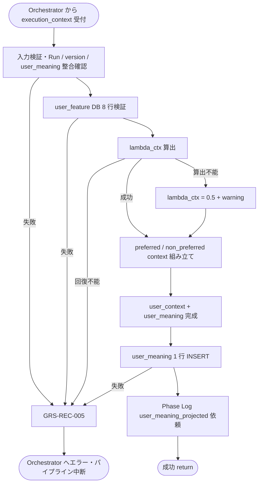

# User Context Builder モジュール仕様書

## 1. ドキュメント情報

| 項目           | 内容                                              |
| -------------- | ------------------------------------------------- |
| ドキュメントID | `MOD-RECO-009`                                    |
| ドキュメント名 | User Context Builder モジュール仕様書             |
| 対象システム   | Gift Recommendation Service（`apps/reco`）        |
| MVP対象        | `○`                                               |
| 作成日         | 2026-06-29                                        |
| 更新日         | 2026-06-29（Human 判断反映）                      |

---

## 2. 概要

User Context Builder（User Context 生成）は、Reco オンライン推薦パイプラインの **User Meaning フェーズ** において、`MOD-RECO-008` User Meaning Projector が算出した **Social / Symbolic 射影**（`user_social` / `user_symbolic`）に加え、**`lambda_ctx`（贈答リスク許容度）** を算出し、Retrieval 用の **`preferred_context` / `non_preferred_context`** を組み立てて **`user_context`** ドメインオブジェクトとして `execution_context` へ返却するモジュールである。`MOD-RECO-001` Recommendation Orchestrator から **`MOD-RECO-008` の直後**に呼び出され、完了後 **`user_meaning` テーブルへ 1 行 INSERT**（IF-DB-RECO-003）し、**`user_meaning_projected` Phase Log** を依頼する。

本モジュールは **User Context 生成・`lambda_ctx` 算出・`user_meaning` 永続化** に責務を限定し、User Feature 統合・Social / Symbolic 射影・Query Embedding 生成・Hard Filter・Matching / Ranking 計算は行わない。`008` が `execution_context.user_meaning`（射影部分）を設定済みであること、`007` が `user_feature` 8 行 INSERT 済みであること、および `004` が `semantic_extraction_result` を供給済みであることを前提とする。

---

## 3. 目的

- `apps/reco` における User Context Builder 実装・単体テストの前提を定義する
- Orchestrator との I/F（`execution_context` 入出力）、失敗時のパイプライン中断（`GRS-REC-005`）を後続実装可能な粒度で整理する
- Recoモジュール一覧・Retrieval定義書・`user_meaning_テーブル定義書`・Matching定義書・Orchestrator 仕様書・`MOD-RECO-008` 仕様書との整合を担保する

---

## 4. モジュール基本情報

| 項目 | 内容 |
| ---- | ---- |
| モジュールID | `MOD-RECO-009` |
| モジュール名 | User Context 生成 |
| 物理名 | `User Context Builder` |
| 分類 | User Meaning |
| 処理種別 | `OL` |
| 配置予定 | `apps/reco/src/reco/application/user-context-builder/**` |
| 所属Epic | `MOD-RECO-009`（Epic Issue #837） |
| MVP対象 | `○` |
| 主な呼び出し元 | `MOD-RECO-001` Recommendation Orchestrator |
| 主な呼び出し先 | Lambda Context Rule Repository / User Meaning Repository（`user_meaning` INSERT） |

`MOD-API-*` / `MOD-RECO-*` / `MOD-BATCH-*` 配下の Task では、該当モジュール ID の責務範囲に変更を限定する。`MOD-RECO-*` では `apps/reco/src/reco/api/**` の API-INT エンドポイント層を対象に含めない。エンドポイント層の変更が必要な場合は、該当する `API-INT-*` Epic 配下 Task として扱う。

---

## 5. 責務

### 5.1 主責務

- **`lambda_ctx`（`λ_ctx`）** を `relationship` / `occasion` / `user_feature` / 射影結果（`user_social` / `user_symbolic`）等を入力として算出し、**0.0〜1.0** に正規化する（Matching定義書 §4.5 / `user_meaning_テーブル定義書` §5.4）
- **`preferred_context`** を Retrieval定義書 §9.2 の Query 構成要素（`context_query` / `preferred_query` / `free_text_query` / `semantic_query` / `embedding_query_text`）に従い組み立てる
- **`non_preferred_context`** を **好み検索文脈と分離**して組み立てる（Retrieval定義書 §9.4・コンテキスト境界定義書 UM-04 / UM-06）。**主検索 query には含めない**
- 上記と `lambda_ctx` を **`user_context`** ドメインオブジェクトとして `execution_context` へ返却し、後続 `MOD-RECO-010` Query Embedding Generator / `MOD-RECO-016` Context Scorer / `MOD-RECO-018` Risk Scorer 等へ引き渡す
- `008` 出力の `user_social` / `user_symbolic` と本モジュール算出 `lambda_ctx` を合成し、**`execution_context.user_meaning` を完成**させる
- **`user_meaning` テーブルへ 1 行 INSERT**（`UserMeaningRepository` 経由、IF-DB-RECO-003）。`lambda_ctx` 非 NULL 列を含む
- INSERT 成功後、**Phase Log**（`phase_name = user_meaning_projected`）を Orchestrator / `MOD-RECO-028` 経由で依頼する
- 回復不能な User Context 生成失敗時に **`GRS-REC-005`** 相当のエラーを Orchestrator へ返却し、パイプライン中断を促す
- `lambda_ctx` **算出不能時**は **`0.5` 固定**で INSERT し、`error_log` に **警告**を記録する（`user_meaning_テーブル定義書` §17.1 No.8 決定済み）

### 5.2 対象外責務

- `API-INT-002` エンドポイント層（HTTP 受付、reco 側防御的 Validation、OpenAPI スキーマ整合）
- `MOD-RECO-001` Orchestrator の **実行順序制御**・Phase Log 契機管理（本モジュールは User Context 生成・`user_meaning` INSERT 完了通知のみ）
- `MOD-RECO-003` Config / Version 解決（解決済み `config_versions` を消費するのみ）
- `MOD-RECO-002` Recommendation Run 記録（Run INSERT は完了済みであることを前提とする）
- `MOD-RECO-004` **Semantic Concept 抽出**（`semantic_extraction_result` を消費するのみ。再抽出しない）
- **User Feature 統合・正規化**（`MOD-RECO-007` 責務）
- **Social / Symbolic 射影**（`user_social` / `user_symbolic` 算出。`MOD-RECO-008` 責務）
- **Query Embedding 生成**（`MOD-RECO-010` 責務）
- **Hard Filter 実行**（`ng_condition` / `budget_condition`。`MOD-RECO-011` / `013` 責務）
- **Context Score / feature 一致度 / Ranking 計算**（`MOD-RECO-014`〜`020` 責務）
- **`ng_condition` を Retrieval 主 query に混在させる処理**（NG は Filter 責務。`exclude_query` は `009` の主出力に含めない）
- **`user_meaning` の UPDATE / DELETE**（MVP では生成後不変）
- Phase Log / Error Log の **物理書き込み実装**（`MOD-RECO-028` / `029`。Orchestrator / Error Handler 経由）
- Public API 向けレスポンス形式への変換（`apps/api` 責務）
- OpenAPI / Orval / generated の変更
- DB schema / DDL の変更

---

## 6. 入出力

### 6.1 入力

| 入力 | 型 / 構造 | 必須 | 生成元 | 用途 | 備考 |
| ---- | --------- | ---- | ------ | ---- | ---- |
| `execution_context` | パイプライン実行コンテキスト | `true` | `MOD-RECO-001` | 生成の起点 | `run_id` / `trace_id` / `config_versions` を含む |
| `execution_context.user_meaning` | User Meaning ドメインオブジェクト（射影部分） | `true` | `MOD-RECO-008` | **射影入力** | `user_social` / `user_symbolic` 必須。`lambda_ctx` は未設定 |
| `execution_context.user_meaning.user_social` | `number` | `true` | `MOD-RECO-008` | 射影結果・INSERT 列 | 0.0〜1.0 |
| `execution_context.user_meaning.user_symbolic` | `number` | `true` | `MOD-RECO-008` | 同上 | 0.0〜1.0 |
| `execution_context.user_meaning.feature_normalization_version_id` | `uuid` | `true` | `MOD-RECO-008` | INSERT 再現性キー | `007` と同一 |
| `execution_context.user_feature` | User Feature ドメインオブジェクト | `true` | `MOD-RECO-007` | **`lambda_ctx` 算出・文脈生成** | 正規化 8 軸 |
| `execution_context.user_feature.features` | `Record<feature_code, number>` | `true` | `MOD-RECO-007` | Feature 参照 | 0.0〜1.0 |
| `execution_context.semantic_extraction_result` | Semantic 抽出結果 | `true` | `MOD-RECO-004` | **`semantic_query` 生成** | `concepts[]` |
| `execution_context.request` | `RecommendationRequest` | `true` | Orchestrator | **Query 文脈生成** | §6.1.1 |
| `execution_context.config_versions.semantic_config_version_id` | `uuid` | `true` | `MOD-RECO-003` | `lambda_ctx` Rule 参照 version | Run 行と整合必須 |
| `execution_context.run_id` | `uuid` | `true` | `MOD-RECO-002` | Run 整合・INSERT キー | `recommendation_run_id` |

#### 6.1.1 `execution_context.request` から参照する項目

| 項目 | 用途 | 備考 |
| ---- | ---- | ---- |
| `relationship`（`relationship_code` / `relationship_label`） | `context_query` / `lambda_ctx` | 外部条件文脈 |
| `occasion`（`occasion_code` / `occasion_label`） | 同上 | 外部条件文脈 |
| `preferred_text` / `preferred_keywords` | `preferred_query` | 任意（空可） |
| `non_preferred_text` / `non_preferred_keywords` | `non_preferred_context` | **主 query には含めない** |
| `free_text` | `free_text_query` / `embedding_query_text` | 任意（空可） |
| `ng_text` / `ng_keywords` / `ng_categories` | **参照しない**（Hard Filter 責務） | `009` は NG を User Context 主 query に混在させない |

**前提データ（DB）**

| 入力 | 型 / 構造 | 必須 | 生成元 | 用途 | 備考 |
| ---- | --------- | ---- | ------ | ---- | ---- |
| 同一 Run の `user_feature` 8 行 | DB 行 | `true` | `MOD-RECO-007` | INSERT 前整合検証 | `user_meaning_テーブル定義書` §12.1 step 2–4 |
| `recommendation_run` 行 | DB 行 | `true` | `MOD-RECO-002` | Run 存在・version 整合 | SELECT 検証 |

**入力正本**: User Context の **検索文脈**は `execution_context.request` と `semantic_extraction_result` を正とする。`lambda_ctx` の **Rule 参照**は `semantic_config_version_id` を正とする。射影座標の算術正本は `execution_context.user_meaning`（`008` 出力）とする。

### 6.2 出力

| 出力 | 型 / 構造 | 利用先 | 用途 | 備考 |
| ---- | --------- | ------ | ---- | ---- |
| `user_context` | ドメインオブジェクト（実装 Task で型定義） | `execution_context`、下位 `MOD-RECO-*` | Retrieval / Matching / Ranking 入力 | §6.2.1 |
| `user_context.preferred_context` | Value Object | `MOD-RECO-010` | 好み・文脈検索用 query 集合 | Retrieval §9.2 |
| `user_context.non_preferred_context` | Value Object | `MOD-RECO-010`（任意） | 避けたい文脈（主 query 外） | UM-06 |
| `user_context.lambda_ctx` | `number` | `MOD-RECO-016` / `018` 等 | Context Score 統合重み | 0.0〜1.0 |
| `execution_context.user_meaning` | User Meaning 完成体 | Orchestrator 受け渡し | **`lambda_ctx` 設定済み** | INSERT 後 DB と一致 |
| `execution_context.user_meaning.lambda_ctx` | `number` | `MOD-RECO-016` Context Scorer | Matching 入力 | DB `lambda_ctx` 列と一致 |
| `execution_context.user_context` | 上記への参照 | Orchestrator Port 契約 | 後続フェーズ入力 | |
| `user_meaning_id` | `uuid` | ログ・監査 | INSERT 成功後の行 ID | Repository 返却 |
| `reco_error` | 標準化 reco エラー | Orchestrator | 回復不能失敗時 | `GRS-REC-005` |

#### 6.2.1 `user_context` 構造（MVP）

Retrieval定義書 §9.2 / ドメインモデル §4.3 を正とする。

| フィールド | 型 | 必須 | 内容 |
| ---------- | -- | ---- | ---- |
| `preferred_context.context_query` | `string` | `true` | `relationship` / `occasion` から構成する文脈検索語 |
| `preferred_context.preferred_query` | `string` | `false` | `preferred_text` / `preferred_keywords` から構成 |
| `preferred_context.free_text_query` | `string` | `false` | `free_text` から抽出する補助検索語 |
| `preferred_context.semantic_query` | `string` | `false` | `semantic_extraction_result.concepts[]` から構成 |
| `preferred_context.embedding_query_text` | `string` | `true` | Embedding 生成用結合自然文（§8.3.2） |
| `non_preferred_context.avoid_query_text` | `string` | `false` | `non_preferred_text` / `non_preferred_keywords` から構成。**主 query に混在しない** |
| `lambda_ctx` | `number` | `true` | 贈答リスク許容度（0.0〜1.0） |

**`embedding_query_text` の正本**: `MOD-RECO-010` が Embedding 生成に利用する **結合テキスト**は、本モジュールが `preferred_context.embedding_query_text` として供給する。`010` は本フィールドを再構成しない（MVP）。

**永続化**: 本モジュールは **`user_meaning` テーブルへ 1 行 INSERT** する（`008` は DML しない。`user_meaning_テーブル定義書` §12.1）。

---

## 7. 依存関係

### 7.1 依存モジュール

| 依存先 | 方向 | 用途 | 失敗時の扱い | 備考 |
| ------ | ---- | ---- | ------------ | ---- |
| `MOD-RECO-001` Recommendation Orchestrator | 被呼び出し | OL パイプラインでの User Context 生成契機 | — | User Meaning フェーズ（論理順序 10） |
| `MOD-RECO-003` Config Version Resolver | 間接依存 | `semantic_config_version_id` の前提 | `003` 失敗時は本モジュール未到達 | 解決済み `config_versions` を入力 |
| `MOD-RECO-002` Recommendation Run Recorder | 間接依存 | `recommendation_run_id` の前提 | `002` 失敗時は本モジュール未到達 | Run INSERT 完了後に呼び出し |
| `MOD-RECO-004` User Semantic Extractor | 直接依存 | `semantic_extraction_result` | `004` 失敗時は本モジュール未到達 | `semantic_query` 生成 |
| `MOD-RECO-007` User Feature Generator | 直接依存 | `user_feature` | `007` 失敗時は本モジュール未到達 | `lambda_ctx` / 文脈生成 |
| `MOD-RECO-008` User Meaning Projector | 直接依存 | `user_meaning`（射影部分） | `008` 失敗時は本モジュール未到達 | `user_social` / `user_symbolic` 必須 |
| `MOD-RECO-024` Reco Error Handler | 間接連携 | 例外の標準化 | User Context 失敗でパイプライン中断 | Orchestrator 経由 |
| `MOD-RECO-028` Phase Log Writer | 間接連携 | `user_meaning_projected` 記録 | 記録失敗は推薦結果に影響させない | INSERT 成功後 |
| `MOD-RECO-029` Error Log Writer | 間接連携 | 失敗詳細・警告記録 | `MOD-RECO-024` 経由 | 失敗時 / `lambda_ctx` 警告時 |

**下位利用モジュール（本モジュール出力の利用先）**

| モジュール | 利用する出力 |
| ---------- | ------------ |
| `MOD-RECO-010` Query Embedding Generator | `user_context`（`preferred_context.embedding_query_text` 等） |
| `MOD-RECO-016` Context Scorer | `user_context.lambda_ctx` / `execution_context.user_meaning.lambda_ctx` |
| `MOD-RECO-018` Risk Scorer | `user_context`（文脈参照） |

### 7.2 参照データ

| データ | 参照元 | 用途 | version / config | 備考 |
| ------ | ------ | ---- | ---------------- | ---- |
| `user_feature` | DB | 8 行存在・version 整合検証 | Run 固定 | INSERT 前検証 |
| `semantic_config_version` | DB | **`lambda_ctx` Rule** 参照 | `config_versions.semantic_config_version_id` | §8.3.1 |
| `relationship` / `occasion` マスタ | DB | ラベル解決・Rule キー | マスタ参照 | `005` と同一 version 前提 |
| `recommendation_run` | DB | Run 存在・version 整合 | Run 固定 | SELECT 検証 |

**`lambda_ctx` Rule 解決フロー（MVP）**

```text
semantic_config_version_id（Run / config_versions）
  → lambda_ctx_rule（relationship_code × occasion_code 等）
  → Rule 未設定時は 0.5 固定（Social / Symbolic バランス型）+ error_log 警告
  → 算術異常（NaN / ±Inf）時は GRS-REC-005
```

---

## 8. 処理仕様

### 8.1 処理フロー



### 8.2 処理ステップ

| No | 処理 | 入力 | 出力 | 補足 |
| --: | ---- | ---- | ---- | ---- |
| 1 | 入力検証 | `execution_context` | — | `run_id` / `user_meaning` / `user_feature` / `request` 必須 |
| 2 | Run 整合確認 | `recommendation_run_id` | — | Run 存在、`semantic_config_version_id` が Run 行と一致 |
| 3 | User Meaning 前提確認 | `user_meaning.user_social` / `user_symbolic` | — | 値域 0.0〜1.0、`lambda_ctx` 未設定 |
| 4 | DB 整合確認 | `recommendation_run_id` | — | 同一 Run の `user_feature` 8 行存在、NULL なし、同一 `feature_normalization_version_id` |
| 5 | `lambda_ctx` 算出 | relationship / occasion / user_feature / 射影結果 | `lambda_ctx` | §8.3.1 |
| 6 | preferred context 組み立て | request / semantic_extraction_result | `preferred_context.*` | §8.3.2 |
| 7 | non_preferred context 組み立て | request | `non_preferred_context.*` | §8.3.3 |
| 8 | `user_context` 組み立て | 上記 | `user_context` | `lambda_ctx` を含む |
| 9 | `user_meaning` 完成 | 射影結果 + `lambda_ctx` | `execution_context.user_meaning` | `lambda_ctx` 設定 |
| 10 | `user_meaning` INSERT | 完成体 | `user_meaning_id` | IF-DB-RECO-003 |
| 11 | Phase Log 依頼 | INSERT 成功 | phase 記録依頼 | `user_meaning_projected` |
| 12 | 結果返却 | 組み立て結果 | `execution_context.user_context` | 後続 `010` へ |

**Orchestrator 呼び出し順序（正本: MOD-RECO-001 §8.2.1）**

```text
… → MOD-RECO-008 User Meaning 射影 → MOD-RECO-009 User Context 生成 → MOD-RECO-010 Query Embedding 生成 → …
```

本モジュールは User Meaning フェーズの **論理順序 10** である。`MOD-RECO-008` 完了後に Orchestrator が呼び出す（Recoモジュール一覧 §5.2）。

### 8.3 アルゴリズム / 計算仕様

#### 8.3.1 `lambda_ctx` 算出（MVP）

Matching定義書 §4.5 / §9.3 および `user_meaning_テーブル定義書` §5.4 を正とする。

| 項目 | 内容 |
| ---- | ---- |
| 意味 | Social Match と Symbolic Match の **統合重み**（贈答リスク許容度） |
| 値域 | **0.0〜1.0**（`0.0` = Social 重視、`1.0` = Symbolic 重視） |
| Rule 正本 | Run 解決済み `semantic_config_version_id` に紐づく **`lambda_ctx_rule`**（Repository 経由） |
| 主入力 | `relationship_code` / `occasion_code` / `user_feature.features` / `user_social` / `user_symbolic` |
| 算出不能時 | **`0.5` 固定**で INSERT。`error_log` に **警告**（パイプラインは継続） |
| NaN / ±Inf | **回復不能** → `GRS-REC-005` |

**MVP 算出優先順位**

| 優先 | 方式 | 内容 |
| --: | ---- | ---- |
| 1 | Rule Lookup | `LambdaContextRuleRepository.get_lambda_ctx(semantic_config_version_id, relationship_code, occasion_code)` が返す基準値 |
| 2 | Pair 補正 | `pair_rule` に `lambda_ctx_delta` が定義されている場合は加算（Featureルール定義書 §9 と同型の拡張。未設定時は 0） |
| 3 | フォールバック | Rule 未設定・算出不能時 → **`0.5` 固定**（Social / Symbolic バランス型）+ warning |

**guard_clip（MVP）**

```text
if lambda_ctx is NaN or is_infinite(lambda_ctx):
  fail with GRS-REC-005

clipped = guard_clip(lambda_ctx, 0.0, 1.0)
result = round_to_scale(clipped, 4)   # numeric(6,4) 列整合
```

| 項目 | MVP 確定値 | 備考 |
| ---- | ---------- | ---- |
| `guard_clip` 下限 | **`0.0`（ inclusive ）** | `chk_user_meaning_lambda_ctx_range` と一致 |
| `guard_clip` 上限 | **`1.0`（ inclusive ）** | 同上 |
| 算出不能（Rule 欠落等） | **`0.5` 固定 INSERT** + warning | §17.1 No.8 決定済み |
| NaN / ±Inf | **`GRS-REC-005` で失敗** | 0.5 への黙示的変換は行わない |

**Repository I/F（MVP 論理正本）**

| 項目 | 内容 |
| ---- | ---- |
| インターフェース | `LambdaContextRuleRepository.get_lambda_ctx(semantic_config_version_id, relationship_code, occasion_code)` |
| 返却型 | `number \| null`（`null` = Rule 未設定） |
| 物理 Lookup | `semantic_config_version` 配下設定（**未整備**。別 Task で JSON 列・JOIN 経路・seed を確定） |
| Rule 未設定 | **`0.5` 固定** + warning（優先 3 フォールバック） |
| MVP 実装 | `InMemoryLambdaContextRuleRepository`（常に `null` 返却）で優先 3 へ到達可能。DB 接続は別 Task |

#### 8.3.2 preferred context 組み立て（MVP）

Retrieval定義書 §9.2 / §9.4 を正とする。

| 出力フィールド | 生成元 | 方針 |
| -------------- | ------ | ---- |
| `context_query` | `relationship_label` / `occasion_label` / 補助キーワード | 空白区切りで連結。空 label はスキップ |
| `preferred_query` | `preferred_text` / `preferred_keywords` | 正規化（全角半角・連続空白圧縮）。空なら省略可 |
| `free_text_query` | `free_text` | 長文は **先頭 N 文字（MVP: 200 文字）** に truncate |
| `semantic_query` | `semantic_extraction_result.concepts[].concept_code` または label | confidence 降順で上位 K 件（MVP: **最大 5**） |
| `embedding_query_text` | 上記 + relationship / occasion の自然文要約 | §8.3.2.1 |

##### 8.3.2.1 `embedding_query_text` 生成（MVP）

Retrieval定義書 §9.3 例に準拠する。

```text
embedding_query_text =
  "{relationship_label}への{occasion_label}。"
  + preferred_text（存在時）
  + free_text 要約（存在時）
  + "。" で終端
```

| 方針 | 内容 |
| ---- | ---- |
| 最大長 | MVP **512 文字**（超過時は末尾 truncate + `…`） |
| `non_preferred_text` | **含めない**（Retrieval §9.4） |
| `ng_text` | **含めない**（Hard Filter 責務） |
| 空入力 | relationship / occasion のみで最小文脈を構成（失敗にしない） |

#### 8.3.3 non_preferred context 組み立て（MVP）

| 出力フィールド | 生成元 | 方針 |
| -------------- | ------ | ---- |
| `avoid_query_text` | `non_preferred_text` / `non_preferred_keywords` | 正規化して保持。**`preferred_context` / `embedding_query_text` へ混在させない** |

`non_preferred_context` は **Matching / Ranking 減点**および将来の **non_preferred Embedding** 用に保持する。MVP の Vector Retrieval 主 query には **使用しない**（Retrieval定義書 §9.4 / §11.4）。

#### 8.3.4 入力欠落・異常時の扱い

| 条件 | 扱い | Error Code |
| ---- | ---- | ---------- |
| `user_meaning` 欠落 | 失敗 | `GRS-REC-005` |
| `user_social` / `user_symbolic` 欠落・値域外 | 失敗 | `GRS-REC-005` |
| `user_feature` 欠落 | 失敗 | `GRS-REC-005` |
| 同一 Run の `user_feature` DB 行が 8 行未満 | 失敗 | `GRS-REC-005` |
| いずれか `feature_value IS NULL` | 失敗 | `GRS-REC-005` |
| 8 行の `feature_normalization_version_id` 不一致 | 失敗（**多数決不採用**） | `GRS-REC-005` |
| `semantic_extraction_result` 欠落 | 失敗 | `GRS-REC-005` |
| `relationship` / `occasion` 欠落 | 失敗 | `GRS-REC-005` |
| `lambda_ctx` Rule 未設定 | **`0.5` 固定** + warning | 継続 |
| `lambda_ctx` NaN / ±Inf | 失敗 | `GRS-REC-005` |
| `user_meaning` INSERT 失敗（UNIQUE 違反等） | 失敗 | `GRS-REC-005` |
| `semantic_config_version_id` 不一致 / Run 未存在 | 失敗 | `GRS-REC-005` |
| preferred / non_preferred / free_text 全空 | **失敗にしない** | 最小 `context_query` で継続 |

#### 8.3.5 Orchestrator Port 契約（概要）

| 方向 | 契約 |
| ---- | ---- |
| 呼び出し | `build_user_context(execution_context) -> execution_context`（メソッド名は実装 Task で確定） |
| 成功 | `execution_context.user_context` 設定、`execution_context.user_meaning.lambda_ctx` 設定、`user_meaning` INSERT 完了 |
| 失敗 | 例外または `reco_error`（`GRS-REC-005`）を Orchestrator へ返却。後続 `010`〜`023` は **呼ばれない** |
| Phase Log | **`user_meaning_projected`** は **`user_meaning` INSERT 成功後**に依頼（`008` では記録しない） |
| Wiring | User Meaning フェーズ（`004`〜`010`）は **未配線（スタブ）**（MOD-RECO-001 §8.4.2）。本モジュール実装 Task 完了後、フェーズ Wiring Task で差し替え |

---

## 9. データ項目マッピング

| 入力項目 | 内部項目 | 出力項目 | 変換内容 | 備考 |
| -------- | -------- | -------- | -------- | ---- |
| `request.relationship` / `request.occasion` | 文脈キー | `preferred_context.context_query` | ラベル連結 | Retrieval §9.2 |
| `request.preferred_text` 等 | preferred 入力 | `preferred_context.preferred_query` | 正規化 | 空可 |
| `request.free_text` | free 入力 | `preferred_context.free_text_query` | truncate | 空可 |
| `semantic_extraction_result.concepts[]` | semantic 集合 | `preferred_context.semantic_query` | 上位 K 件連結 | `004` 正本 |
| 上記合成 | query 集合 | `preferred_context.embedding_query_text` | 自然文結合 | §8.3.2.1 |
| `request.non_preferred_text` 等 | avoid 入力 | `non_preferred_context.avoid_query_text` | 正規化 | 主 query 外 |
| relationship / occasion / user_feature / 射影 | Rule 入力 | `lambda_ctx` | §8.3.1 | DB 列 |
| `user_meaning.user_social` / `user_symbolic` | 射影結果 | DB `user_social` / `user_symbolic` | エコー | `008` 正本 |
| 算出 `lambda_ctx` | context 重み | `user_context.lambda_ctx` / DB `lambda_ctx` | guard_clip | Matching §4.5 |
| `user_meaning.feature_normalization_version_id` | version | DB 同名列 | エコー | `008` / `007` 共通 |
| `run_id` | `recommendation_run_id` | DB 同名列 | エコー | INSERT キー |
| — | — | `execution_context.user_context` | コンテキスト格納 | Port 契約 |
| — | — | `execution_context.user_meaning` | `lambda_ctx` 完成 | Port 契約 |

---

## 10. 状態・例外

### 10.1 状態

本モジュールは Run 内 **1 回実行・ステートレス**（再生成・UPDATE は MVP 禁止）とする。

| 状態 | 意味 | 遷移条件 | 記録先 |
| ---- | ---- | -------- | ------ |
| — | モジュール内部状態なし | — | — |

Run 全体の状態（`recommendation_run.status`）は `MOD-RECO-002` が管理。本モジュール失敗時は Run を `failed` へ遷移させる（Orchestrator / `002` 連携）。

### 10.2 例外

| 例外 | Error Code | 発生条件 | 呼び出し元への返却 | ログ |
| ---- | ---------- | -------- | ------------------ | ---- |
| User Context 生成失敗 | `GRS-REC-005` | 回復不能な生成・INSERT エラー | 500 系。パイプライン中断 | Error Log + 構造化ログ |
| Run 不整合 | `GRS-REC-005` | Run 未存在、`semantic_config_version_id` 不一致 | 同上 | 同上 |
| 入力検証失敗 | `GRS-REC-005` | `user_meaning` / `user_feature` / `request` 欠落 | 同上 | 同上 |
| DB 整合失敗 | `GRS-REC-005` | `user_feature` 8 行欠落・NULL・version 不一致 | 同上 | 同上 |
| `lambda_ctx` 算術異常 | `GRS-REC-005` | NaN / ±Inf | 同上 | 同上 |
| `user_meaning` INSERT 失敗 | `GRS-REC-005` | UNIQUE 違反・FK 違反等 | 同上 | 同上 |
| `lambda_ctx` 算出不能（警告） | —（継続） | Rule 未設定等 | パイプライン継続（`0.5` INSERT） | **warning** を Error Log |

Error Code の正本はエラーコード定義書。Orchestrator は `MOD-RECO-009` 失敗を **`GRS-REC-005`（User Feature Generation Failed 系）** に分類する（MOD-RECO-001 §7.1）。`MOD-RECO-008` 失敗（`GRS-REC-006`）と区別する。

**リトライ**: 本モジュール内の自動リトライは MVP では **行わない**。呼び出し元による再 Run は新規 `recommendation_run` として扱う。

---

## 11. DB / 永続化

### 11.1 書き込み

| テーブル | 操作 | 主な項目 | トランザクション | 備考 |
| -------- | ---- | -------- | ---------------- | ---- |
| `user_meaning` | INSERT × 1 | `recommendation_run_id`, `feature_normalization_version_id`, `user_social`, `user_symbolic`, `lambda_ctx`, `generated_at` | Run 内 1 回 | IF-DB-RECO-003 |

**INSERT 方針（`008` との境界・`user_meaning_テーブル定義書` §12.1）**

| 観点 | 方針 |
| ---- | ---- |
| INSERT 主体 | **本モジュール**が `UserMeaningRepository` 経由で 1 行 INSERT |
| 射影座標 | `008` 出力（`user_social` / `user_symbolic`）を **エコー** |
| `lambda_ctx` | 本モジュールが算出。算出不能時 **`0.5` 固定** |
| Phase Log | **`user_meaning_projected`** は INSERT 成功後に依頼 |
| 冪等性 | 同一 Run への 2 回目 INSERT は `uq_user_meaning_recommendation_run` で拒否 → `GRS-REC-005` |
| UPDATE / DELETE | **禁止**（MVP） |

**INSERT 疑似 SQL（正本: `user_meaning_テーブル定義書` §12.2）**

```sql
INSERT INTO user_meaning (
  recommendation_run_id,
  feature_normalization_version_id,
  user_social,
  user_symbolic,
  lambda_ctx,
  generated_at
) VALUES (
  :recommendation_run_id,
  :feature_normalization_version_id,
  :user_social,
  :user_symbolic,
  :lambda_ctx,
  now()
);
```

### 11.2 読み取り

| テーブル | 操作 | 主な項目 | トランザクション | 備考 |
| -------- | ---- | -------- | ---------------- | ---- |
| `user_feature` | SELECT × 8 | `feature_code`, `feature_value`, `feature_normalization_version_id` | 読み取りのみ | INSERT 前整合 |
| `semantic_config_version` | SELECT | `lambda_ctx_rule` 等 | 読み取りのみ | Rule 解決 |
| `recommendation_run` | SELECT | Run 存在・version | 読み取りのみ | 整合検証 |

---

## 12. ログ・メトリクス

| 種別 | 内容 | 出力タイミング | 保存先 | 備考 |
| ---- | ---- | -------------- | ------ | ---- |
| 構造化ログ | User Context サマリ（`run_id`, `lambda_ctx`, `context_query_len`, `duration_ms`） | 生成完了時 | アプリログ | `trace_id` 必須。生テキスト全文ダンプは避ける |
| Phase Log 依頼 | `user_meaning_projected` | INSERT 成功後 | `phase_log`（`MOD-RECO-028`） | ログ・Observability設計書 §10.3 |
| Error Log 依頼 | `GRS-REC-005` 詳細 | 失敗時 | `error_log`（`MOD-RECO-029`） | `MOD-RECO-024` 経由 |
| Error Log 依頼（警告） | `lambda_ctx` 算出不能（`0.5` 採用） | フォールバック時 | `error_log`（警告レベル） | §17.1 No.8 |
| Metric 依頼 | `user_context_build_latency_ms` | 生成完了時 | Metric Logger（`MOD-RECO-025`） | MVP 対象 `△` |

### 12.1 メトリクス

| Metric | 内容 | 集計単位 | 用途 |
| ------ | ---- | -------- | ---- |
| `user_context_build_latency_ms` | User Context 生成処理時間 | Run | ボトルネック分析 |
| `lambda_ctx_fallback_count` | `0.5` 固定フォールバック回数 | Run | Rule 欠落監視 |
| `embedding_query_text_length` | `embedding_query_text` 文字数 | Run | Query 品質監視 |

Observability §12.12 の `lambda_ctx_mean` / `lambda_ctx_std` 等は **`user_context` 生成結果**を入力とする分布メトリクス名である（`meaning_distribution_metric` 別 Task）。

---

## 13. 性能・非機能

### 13.1 方針概要

| 観点 | 方針 |
| ---- | ---- |
| レイテンシ | MVP 初版では **モジュール単体 hard timeout を設けない**。User Meaning 一括（`004`〜`010`）**hard 1,000ms** を上位ガードとする（MOD-RECO-001 §13.2） |
| 計算量 | Rule Lookup + 文字列正規化 + DB SELECT 8 行 + INSERT 1 行。O(1) 算術 + O(n) 文字列（n = 入力テキスト長） |
| タイムアウト | 本モジュール単体の hard 上限は **MVP では設けない** |
| リトライ | モジュール内自動リトライ **なし**（§10.2） |
| キャッシュ | 同一 Run 内で `lambda_ctx_rule` のメモリキャッシュ可 |
| 並列実行 | 不要（Orchestrator 直列呼び出し） |

### 13.2 タイムアウト（MVP）

| 種別 | 対象 | MVP 値 | 超過時の扱い |
| ---- | ---- | ------ | ------------ |
| hard | `MOD-RECO-009` 単体 | **なし** | — |
| hard（上位） | User Meaning 一括（`004`〜`010`） | **1,000ms** | 該当 `GRS-REC-004`〜`007`（MOD-RECO-001 §13.2） |
| hard（全体） | 推薦パイプライン全体 | **4,000ms** | `GRS-REC-101` |

---

## 14. テスト観点

| No | 観点 | 確認内容 | 種別 |
| --: | ---- | -------- | ---- |
| 1 | 正常系（context_query） | relationship / occasion から `context_query` が生成されること | unit |
| 2 | 正常系（preferred_query） | `preferred_text` 存在時に `preferred_query` が設定されること | unit |
| 3 | 正常系（semantic_query） | `concepts[]` から `semantic_query` が生成されること | unit |
| 4 | 正常系（embedding_query_text） | Retrieval §9.3 例と同型の自然文が生成されること | unit |
| 5 | 正常系（non_preferred 分離） | `non_preferred_text` が `embedding_query_text` に **含まれない**こと | unit |
| 6 | 正常系（lambda_ctx Rule） | Rule 設定時に期待値が返ること | unit |
| 7 | 正常系（lambda_ctx フォールバック） | Rule 未設定・算出不能時に `0.5` で INSERT し warning が記録されること | unit / integration |
| 8 | 正常系（user_meaning INSERT） | IF-DB-RECO-003 経路で 1 行 INSERT されること | integration |
| 9 | 正常系（Phase Log） | INSERT 成功後に `user_meaning_projected` が依頼されること | integration |
| 10 | 正常系（出力受け渡し） | `user_context` / `user_meaning.lambda_ctx` が `execution_context` に格納されること | unit |
| 11 | 境界値（入力全空） | preferred / non_preferred / free_text 全空でも最小 context で成功すること | unit |
| 12 | 境界値（lambda_ctx 端点） | `0.0` / `1.0` がそのまま保存されること | unit |
| 13 | guard_clip | 理論値が 1.00001 等のとき clip 後 1.0 となること | unit |
| 14 | NaN / Inf | `lambda_ctx` が NaN / ±Inf のとき `GRS-REC-005` となること | unit |
| 15 | 例外系（user_meaning 欠落） | `008` 未実行相当で `GRS-REC-005` となること | unit |
| 16 | 例外系（DB 8 行欠落） | `user_feature` 8 行なしで `GRS-REC-005` となること | unit / integration |
| 17 | 例外系（INSERT 重複） | 同一 Run 2 回目 INSERT で `GRS-REC-005` となること | integration |
| 18 | 非再推定 | Request 変更のみでは `008` 未再実行時に射影座標が変わらないこと | unit |
| 19 | Orchestrator 連携 | `008` 成功後に `009` を呼び、`009` 失敗時に `010` 以降を呼ばないこと | integration |
| 20 | ログ | `trace_id` が構造化ログに含まれ、secret・生テキスト全文が含まれないこと | unit |

---

## 15. 変更管理

### 15.1 変更履歴

| 日付 | 変更内容 | 関連Issue / PR |
| ---- | -------- | -------------- |
| 2026-06-29 | 初版作成 | Issue #838 |
| 2026-06-29 | Human 判断反映（`lambda_ctx` フォールバック確定・未決整理） | Issue #838 |

---

## 16. 未決事項

| No | 論点 | 判断が必要な理由 | 判断者 | 期限 | 備考 |
| --: | ---- | ---------------- | ------ | ---- | ---- |
| 1 | `lambda_ctx_rule` の物理スキーマ（JSON 列名・seed 初期値） | `user_meaning.lambda_ctx` 列は整備済みだが、Rule Lookup 用の物理正本（テーブル or JSON + seed）が未設計。別 Task 化が必要 | Human + Worker | Rule DB 接続 Task 前 | 論理 I/F は §8.3.1。MVP は `InMemory` + **`0.5` フォールバック**で実装可 |
| 2 | Recoモジュール一覧 §6.7 の `λ_ctx` 算出責務記載 | `008` 仕様書 §16.1 No.9 と一覧表記が矛盾。正本は `user_meaning_テーブル定義書` §5.4 | Human | 別 docs Task | **Issue #839**（本 Task scope 外） |

### 16.1 確定済み論点（`user_meaning_テーブル定義書` Human Review #555 / `MOD-RECO-008` §16.1 と整合）

| No | 論点 | 確定内容 |
| --: | ---- | -------- |
| 1 | `lambda_ctx` 算出主体 | **`MOD-RECO-009`**（本モジュール） |
| 2 | `lambda_ctx` 算出不能時 | **`0.5` 固定 INSERT** + `error_log` 警告 |
| 3 | `user_meaning` INSERT 主体 | **本モジュール**（IF-DB-RECO-003 1 行） |
| 4 | Phase Log | **`user_meaning_projected`** は INSERT 成功後に本モジュールが依頼 |
| 5 | preferred / non_preferred 分離 | **UM-04 / UM-06**。non_preferred を主 query に含めない |
| 6 | NG 条件 | **Hard Filter 責務**。本モジュールの主 query に混在しない |
| 7 | 値域 | **`lambda_ctx` は 0.0〜1.0**（`numeric(6,4)`） |
| 8 | 8 行 version 不一致 | **INSERT 拒否**（`GRS-REC-005`）。多数決不採用 |
| 9 | `λ_ctx` と Recoモジュール一覧 §6.7 | **`user_meaning_テーブル定義書` §5.4 をモジュール境界の正本**とする。一覧修正は Issue #839 |
| 10 | Rule 未設定時の `lambda_ctx` | **`0.5` 固定**（Social / Symbolic バランス型）+ warning。射影ヒューリスティック（`user_symbolic` 採用）は **不採用** |

---

## 17. 関連資料

| 種別 | パス / URL | 用途 |
| ---- | ---------- | ---- |
| Recoモジュール一覧 | `docs/05_アプリケーション設計/アプリ/reco/Recoモジュール一覧.md` | モジュール定義・§6.8 User Context 生成 |
| モジュール一覧 | `docs/05_アプリケーション設計/アプリ/モジュール一覧.md` | 全体配置 |
| 機能×モジュール対応表 | `docs/05_アプリケーション設計/アプリ/機能×モジュール対応表.md` | 入出力・パイプライン順序 |
| Retrieval定義書 | `docs/04_ドメインモデル設計/Retrieval定義書.md` | §9 Query 構成・§9.4 Build 方針 |
| Matching定義書 | `docs/04_ドメインモデル設計/Matching定義書.md` | §4.5 / §9 `lambda_ctx` |
| ドメインモデル | `docs/04_ドメインモデル設計/ドメインモデル.md` | preferred / non_preferred context |
| コンテキスト境界定義書 | `docs/04_ドメインモデル設計/コンテキスト境界定義書.md` | UM-04 / UM-06 |
| GiftMeaningSpace定義書 | `docs/04_ドメインモデル設計/GiftMeaningSpace定義書.md` | User Meaning 生成物 |
| user_meaning テーブル定義書 | `docs/06_実装設計/database/user_meaning_テーブル定義書.md` | INSERT・`lambda_ctx` 正本 |
| user_feature テーブル定義書 | `docs/06_実装設計/database/user_feature_テーブル定義書.md` | 前提 8 行 |
| インターフェース一覧 | `docs/05_アプリケーション設計/アプリ/インターフェース一覧.md` | IF-DB-RECO-003 |
| エラーコード定義書 | `docs/05_アプリケーション設計/アプリ/エラーコード定義書.md` | `GRS-REC-005` |
| ログ・Observability設計書 | `docs/05_アプリケーション設計/アプリ/ログ・Observability設計書.md` | Phase / Metric |
| MOD-RECO-001 仕様書 | `docs/06_実装設計/reco/MOD-RECO-001_Recommendation Orchestratorモジュール仕様書.md` | 呼び出し順・失敗時中断 |
| MOD-RECO-004 仕様書 | `docs/06_実装設計/reco/MOD-RECO-004_User Semantic Extractorモジュール仕様書.md` | `semantic_extraction_result` |
| MOD-RECO-007 仕様書 | `docs/06_実装設計/reco/MOD-RECO-007_User Feature Generatorモジュール仕様書.md` | `user_feature` 供給 |
| MOD-RECO-008 仕様書 | `docs/06_実装設計/reco/MOD-RECO-008_User Meaning Projectorモジュール仕様書.md` | 射影・INSERT 境界 |
| module-spec テンプレート | `prompts/templates/docs/module-spec.md` | 章構成 |
| Epic Definition | `prompts/definitions/epics/mod-reco-009-user-context-builder/epic.yaml` | allowed_paths |

---

## 18. レビュー観点

- Recoモジュール一覧 §4 / §6.8 のモジュール名・物理名・分類・処理種別・MVP 対象と一致している
- モジュール一覧の `MOD-RECO-009` 行と整合している
- Orchestrator（MOD-RECO-001）との I/F（`execution_context` 入出力・`GRS-REC-005` 失敗時中断）が明確である
- `apps/reco/src/reco/api/**`（API-INT エンドポイント層）の変更を本仕様書の実装範囲に含めていない
- Retrieval定義書 §9 の Query 構成・non_preferred 分離方針と一致している
- `MOD-RECO-008` との責務境界（射影 vs Context 生成・INSERT）が明確である
- `user_meaning_テーブル定義書` の `lambda_ctx`・INSERT タイミング・Phase Log と一致している
- secret や `.env` 実値が含まれていない

---

## 19. 備考

- 本仕様書は `MOD-RECO-009` の **User Context 生成・`lambda_ctx` 算出・`user_meaning` 永続化** 責務に限定する
- 配置パスは Epic `epic_scope.allowed_paths` に従い `apps/reco/src/reco/application/user-context-builder/**` を正とする
- User Meaning フェーズ Wiring（`004`〜`010` スタブ差し替え）は Orchestrator 実装 / Wiring Task の責務であり、本 Task scope 外である
- Recoモジュール一覧 §6.7 / §5.2 に残る `λ_ctx` 算出責務の記載修正は **Issue #839**（`prompts/definitions/tasks/mod-reco-009-user-context-builder/reco-module-list-lambda-ctx-boundary-alignment.yaml`）
