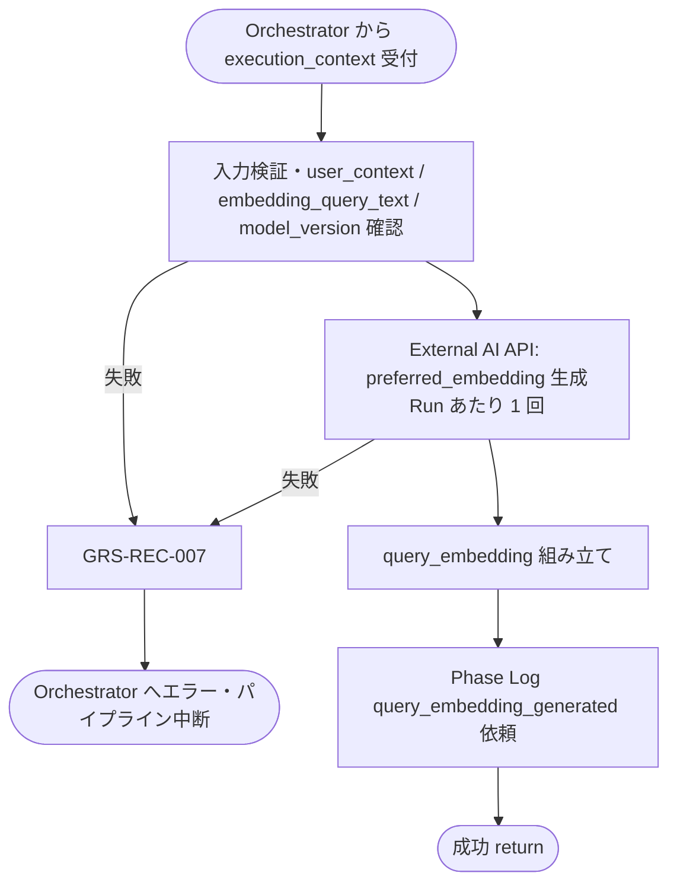

# Query Embedding Generator モジュール仕様書

## 1. ドキュメント情報

| 項目           | 内容                                              |
| -------------- | ------------------------------------------------- |
| ドキュメントID | `MOD-RECO-010`                                    |
| ドキュメント名 | Query Embedding Generator モジュール仕様書        |
| 対象システム   | Gift Recommendation Service（`apps/reco`）        |
| MVP対象        | `○`                                               |
| 作成日         | 2026-06-29                                        |
| 更新日         | 2026-06-29（`non_preferred_embedding` MVP 対象外を反映） |

---

## 2. 概要

Query Embedding Generator（Query Embedding 生成）は、Reco オンライン推薦パイプラインの **User Meaning フェーズ末尾**（Retrieval フェーズ直前）において、`MOD-RECO-009` User Context Builder が組み立てた **`user_context`**（特に `preferred_context.embedding_query_text`）を入力として、**Retrieval 用の Query Embedding ベクトル**を外部 Embedding API 経由で生成し、`execution_context` へ返却するモジュールである。`MOD-RECO-001` Recommendation Orchestrator から **`MOD-RECO-009` の直後**に呼び出され、完了後 **`query_embedding_generated` Phase Log** を依頼する。

本モジュールは **Query Embedding 生成・`query_embedding` ドメインオブジェクト組み立て** に責務を限定し、User Context 組み立て・Hard Filter・候補商品抽出・Matching / Ranking 計算は行わない。`009` が `execution_context.user_context` を設定済みであること、および `003` が `config_versions.model_versions.embedding` を解決済みであることを前提とする。

MVP では **外部 Embedding API 呼び出しを Run あたり 1 回**（`preferred_embedding` のみ）に限定する。`non_preferred_condition` の扱いは **Feature 系統**（`MOD-RECO-006`〜`007` → Matching `avoid_similarity` → Ranking `avoid_risk`）を正とし、**`non_preferred_embedding` は生成しない**（将来の MVP 機能拡張候補。§16.1 No.11）。

---

## 3. 目的

- `apps/reco` における Query Embedding Generator 実装・単体テストの前提を定義する
- Orchestrator との I/F（`execution_context` 入出力）、失敗時のパイプライン中断（`GRS-REC-007`）を後続実装可能な粒度で整理する
- Recoモジュール一覧・Retrieval定義書・ドメインモデル・`MOD-RECO-003` / `MOD-RECO-009` 仕様書・Orchestrator 仕様書との整合を担保する

---

## 4. モジュール基本情報

| 項目 | 内容 |
| ---- | ---- |
| モジュールID | `MOD-RECO-010` |
| モジュール名 | Query Embedding 生成 |
| 物理名 | `Query Embedding Generator` |
| 分類 | Retrieval |
| 処理種別 | `OL` |
| 配置予定 | `apps/reco/src/reco/application/query-embedding-generator/**` |
| 所属Epic | `MOD-RECO-010`（Epic Issue #848） |
| MVP対象 | `○` |
| 主な呼び出し元 | `MOD-RECO-001` Recommendation Orchestrator |
| 主な呼び出し先 | External AI API Client（Embedding API / IF-EXT-005） |

`MOD-API-*` / `MOD-RECO-*` / `MOD-BATCH-*` 配下の Task では、該当モジュール ID の責務範囲に変更を限定する。`MOD-RECO-*` では `apps/reco/src/reco/api/**` の API-INT エンドポイント層を対象に含めない。エンドポイント層の変更が必要な場合は、該当する `API-INT-*` Epic 配下 Task として扱う。

---

## 5. 責務

### 5.1 主責務

- `execution_context.user_context.preferred_context.embedding_query_text` を **Embedding 生成入力テキストの正本**として受け取り、**`preferred_embedding`**（1536 次元ベクトル）を生成する
- Run 解決済み **`config_versions.model_versions.embedding`**（`model_version_id`）に対応する Embedding モデルで API 呼び出しを行い、**`item_embedding` と同一モデル**であることを保証する（`MOD-RECO-003` §9.1）
- 生成結果を **`query_embedding`** ドメインオブジェクトとして `execution_context` へ返却し、後続 `MOD-RECO-012` Candidate Retriever へ引き渡す
- 生成成功後、**Phase Log**（`phase_name = query_embedding_generated`）を Orchestrator / `MOD-RECO-028` 経由で依頼する
- 回復不能な Query Embedding 生成失敗時に **`GRS-REC-007`** 相当のエラーを Orchestrator へ返却し、パイプライン中断を促す

### 5.2 対象外責務

- `API-INT-002` エンドポイント層（HTTP 受付、reco 側防御的 Validation、OpenAPI スキーマ整合）
- `MOD-RECO-001` Orchestrator の **実行順序制御**・Phase Log 契機管理（本モジュールは Embedding 生成完了通知のみ）
- `MOD-RECO-003` Config / Version 解決（解決済み `config_versions` を消費するのみ）
- `MOD-RECO-002` Recommendation Run 記録（Run INSERT は完了済みであることを前提とする）
- **User Context 組み立て**（`embedding_query_text` 再構成を含む。`MOD-RECO-009` 責務）
- **Semantic 抽出・User Feature 統合・User Meaning 射影**（`MOD-RECO-004`〜`008` 責務）
- **Pre / Post Hard Filter 実行**（`MOD-RECO-011` / `013` 責務）
- **候補商品抽出（pgvector 類似検索）**（`MOD-RECO-012` 責務）
- **Item Embedding 生成・永続化**（BATCH-015 / `item_embedding` 責務。OL では参照のみ）
- **`query_embedding` の DB 永続化**（正本定義表：派生 / 一時・Run 内メモリ正本）
- Phase Log / Error Log の **物理書き込み実装**（`MOD-RECO-028` / `029`。Orchestrator / Error Handler 経由）
- Public API 向けレスポンス形式への変換（`apps/api` 責務）
- OpenAPI / Orval / generated の変更
- DB schema / DDL の変更
- **`non_preferred_embedding` 生成**（MVP 対象外。avoid は Feature 系統で処理。§8.3.2）
- **`non_preferred_context.avoid_query_text` の参照・消費**（`009` が保持するが、本モジュールは `embedding_query_text` のみ使用）

---

## 6. 入出力

### 6.1 入力

| 入力 | 型 / 構造 | 必須 | 生成元 | 用途 | 備考 |
| ---- | --------- | ---- | ------ | ---- | ---- |
| `execution_context` | パイプライン実行コンテキスト | `true` | `MOD-RECO-001` | 生成の起点 | `run_id` / `trace_id` / `config_versions` を含む |
| `execution_context.user_context` | User Context ドメインオブジェクト | `true` | `MOD-RECO-009` | **Embedding 入力文脈** | §6.1.1 |
| `execution_context.user_context.preferred_context` | Value Object | `true` | `MOD-RECO-009` | 好み検索用 query 集合 | Retrieval §9.2 |
| `execution_context.user_context.preferred_context.embedding_query_text` | `string` | `true` | `MOD-RECO-009` | **Embedding 生成テキスト（唯一の API 入力）** | 本モジュールは再構成しない（MVP） |
| `execution_context.config_versions.model_versions.embedding` | `uuid` | `true` | `MOD-RECO-003` | Embedding モデル version | `item_embedding.model_version_id` と整合必須 |
| `execution_context.run_id` | `uuid` | `true` | `MOD-RECO-002` | Run 整合・ログ相関 | `recommendation_run_id` |

#### 6.1.1 `embedding_query_text` の扱い（MVP）

| 観点 | 方針 |
| ---- | ---- |
| 正本 | **`MOD-RECO-009` が供給する `preferred_context.embedding_query_text`** をそのまま使用する |
| 再構成 | **行わない**（`009` 仕様書 §6.2.1・Retrieval §9.4 と整合） |
| 最小文脈 | relationship / occasion のみで構成された短い文でも **失敗にしない**（`009` が保証） |
| `non_preferred_text` | **主 query（`embedding_query_text`）に含まれない**前提で受け取る |
| `ng_text` | **参照しない**（Hard Filter 責務） |

**入力正本**: Embedding 生成テキストは `execution_context.user_context` を正とする。モデル version は `execution_context.config_versions.model_versions.embedding` を正とする。

### 6.2 出力

| 出力 | 型 / 構造 | 利用先 | 用途 | 備考 |
| ---- | --------- | ------ | ---- | ---- |
| `query_embedding` | ドメインオブジェクト（実装 Task で型定義） | `execution_context`、下位 `MOD-RECO-*` | Vector Retrieval 入力 | §6.2.1 |
| `query_embedding.preferred_embedding` | Embedding Value Object | `MOD-RECO-012` | Vector 検索（主 query） | 必須。MVP は本フィールドのみ |
| `execution_context.query_embedding` | 上記への参照 | Orchestrator Port 契約 | 後続フェーズ入力 | |
| `reco_error` | 標準化 reco エラー | Orchestrator | 回復不能失敗時 | `GRS-REC-007` |

#### 6.2.1 `query_embedding` 構造（MVP）

MVP では **`preferred_embedding` のみ**を含む。ドメインモデル上の `non_preferred_embedding` は **本モジュールでは生成しない**（§8.3.2・§16.1 No.11）。

| フィールド | 型 | 必須 | 内容 |
| ---------- | -- | ---- | ---- |
| `preferred_embedding.vector` | `number[]` | `true` | Embedding ベクトル（**1536 次元**。`item_embedding` と同一） |
| `preferred_embedding.model_version_id` | `uuid` | `true` | 生成に使用した `model_version_id` |
| `preferred_embedding.dimensions` | `number` | `true` | ベクトル次元数（MVP: **1536** 固定） |
| `preferred_embedding.source_text_hash` | `string` | `false` | 入力テキストの hash（監査・再現性。ログには hash のみ） |

**永続化**: 本モジュールは **`query_embedding` を DB へ書き込まない**（正本定義表 §5.10：派生 / 一時・Run 内生成）。Public API へ **ベクトル値を返さない**（API一覧・バッチ設計方針書と整合）。

**`query_embedding` とドメイン用語の対応（MVP）**

| モジュール一覧の出力名 | ドメインオブジェクト内フィールド |
| ---------------------- | -------------------------------- |
| `query_embedding` | ルートオブジェクト（`preferred_embedding` のみ含有） |
| —（内包） | `preferred_embedding` |
| `non_preferred_embedding` | **MVP では出力しない**（将来拡張候補） |

---

## 7. 依存関係

### 7.1 依存モジュール

| 依存先 | 方向 | 用途 | 失敗時の扱い | 備考 |
| ------ | ---- | ---- | ------------ | ---- |
| `MOD-RECO-001` Recommendation Orchestrator | 被呼び出し | OL パイプラインでの Query Embedding 生成契機 | — | User Meaning フェーズ末尾（論理順序 11） |
| `MOD-RECO-003` Config Version Resolver | 間接依存 | `model_versions.embedding` の前提 | `003` 失敗時は本モジュール未到達 | 解決済み `config_versions` を入力 |
| `MOD-RECO-002` Recommendation Run Recorder | 間接依存 | `recommendation_run_id` の前提 | `002` 失敗時は本モジュール未到達 | Run INSERT 完了後に呼び出し |
| `MOD-RECO-009` User Context Builder | 直接依存 | `user_context` / `embedding_query_text` | `009` 失敗時は本モジュール未到達 | User Context 完成後 |
| External AI API Client | 呼び出し | Embedding API（IF-EXT-005 / API-EXT-004） | `GRS-REC-007` | server 側のみ。secret は Client 内保持 |
| `MOD-RECO-024` Reco Error Handler | 間接連携 | 例外の標準化 | Query Embedding 失敗でパイプライン中断 | Orchestrator 経由 |
| `MOD-RECO-028` Phase Log Writer | 間接連携 | `query_embedding_generated` 記録 | 記録失敗は推薦結果に影響させない | 生成成功後 |
| `MOD-RECO-029` Error Log Writer | 間接連携 | 失敗詳細記録 | `MOD-RECO-024` 経由 | 失敗時 |

**下位利用モジュール（本モジュール出力の利用先）**

| モジュール | 利用する出力 |
| ---------- | ------------ |
| `MOD-RECO-012` Candidate Retriever | `query_embedding.preferred_embedding`（必須） |
| `MOD-RECO-014`〜`020` Matching / Ranking | **直接は利用しない**。avoid は Feature 系統（§8.3.2） |
| `MOD-RECO-011` Pre Hard Filter Executor | **直接は利用しない**（Orchestrator 順序上、本モジュールの後に実行） |

### 7.2 参照データ

| データ | 参照元 | 用途 | version / config | 備考 |
| ------ | ------ | ---- | ---------------- | ---- |
| `model_version` | DB（`003` 解決済み） | Embedding モデル ID・物理名解決 | `config_versions.model_versions.embedding` | `item_embedding` と同一 version 必須 |
| `recommendation_run` | DB | Run 存在・`model_version_id` 列整合 | Run 固定 | SELECT 検証（任意・実装 Task で詳細化） |

**Embedding モデル整合フロー（MVP）**

```text
config_versions.model_versions.embedding（003 解決済み）
  → recommendation_run.model_version_id と一致必須（003 §9.1）
  → External AI API Client が model 物理名へ解決
  → preferred_embedding 生成（1536 次元）
  → MOD-RECO-012 が同一 model_version_id の item_embedding と cosine 比較
```

---

## 8. 処理仕様

### 8.1 処理フロー



### 8.2 処理ステップ

| No | 処理 | 入力 | 出力 | 補足 |
| --: | ---- | ---- | ---- | ---- |
| 1 | 入力検証 | `execution_context` | — | `run_id` / `user_context` / `embedding_query_text` / `model_versions.embedding` 必須 |
| 2 | Run 整合確認（任意） | `recommendation_run_id` | — | Run 存在。`model_version_id` が `config_versions` と一致 |
| 3 | モデル解決 | `model_versions.embedding` | Embedding モデル物理名 | External AI API Client 経由 |
| 4 | preferred Embedding 生成 | `embedding_query_text` | `preferred_embedding` | IF-EXT-005。**Run あたり 1 回**。§8.3.1 |
| 5 | `query_embedding` 組み立て | 上記 | `query_embedding` | `preferred_embedding` のみ。`execution_context` へ格納 |
| 6 | Phase Log 依頼 | 生成成功 | phase 記録依頼 | `query_embedding_generated` |
| 7 | 結果返却 | 組み立て結果 | `execution_context.query_embedding` | 後続 `011` / `012` へ |

**Orchestrator 呼び出し順序（正本: MOD-RECO-001 §8.2.1）**

```text
… → MOD-RECO-009 User Context 生成 → MOD-RECO-010 Query Embedding 生成 → MOD-RECO-011 Pre Hard Filter → MOD-RECO-012 候補商品抽出 → …
```

本モジュールは User Meaning フェーズの **論理順序 11** である。`MOD-RECO-009` 完了後に Orchestrator が呼び出す（Recoモジュール一覧 §5.2）。

### 8.3 アルゴリズム / 計算仕様

#### 8.3.1 preferred Embedding 生成（MVP）

| 項目 | 内容 |
| ---- | ---- |
| 入力テキスト | `user_context.preferred_context.embedding_query_text`（`009` 正本。再構成しない） |
| モデル | Run 解決済み `config_versions.model_versions.embedding` に紐づく Embedding モデル |
| MVP 現行モデル | **`text-embedding-3-small`**（1536 次元。`item_embedding_テーブル定義書` §17.1 No.3 決定済み） |
| API | IF-EXT-005（Embedding API呼び出し）/ API-EXT-004（OpenAI Embedding API） |
| 出力検証 | `vector.length === 1536`。NaN / ±Inf 含有時は **回復不能** → `GRS-REC-007` |
| 空テキスト | `009` が relationship / occasion のみの最小文を供給する前提。**空文字のみ**は `GRS-REC-007` |

**Client I/F（MVP 論理正本）**

| 項目 | 内容 |
| ---- | ---- |
| インターフェース | `EmbeddingApiClient.generate(text, model_version_id, metadata)` |
| 返却型 | `{ vector: number[], model_version_id: uuid, dimensions: number }` |
| metadata | `run_id`, `trace_id`, `purpose = query_embedding_preferred`（ベクトル・API キーは含めない） |
| 物理実装 | infrastructure 層（secret は env 経由。本モジュールは Client Port のみ依存） |

#### 8.3.2 `non_preferred_embedding` は MVP 対象外（avoid の Feature 系統）

MVP では **外部 API 利用最小化**のため、`non_preferred_embedding` は **生成しない**。`user_context.non_preferred_context` は `009` が保持するが、本モジュールは **参照・消費しない**。

| 観点 | MVP 方針 |
| ---- | -------- |
| avoid の正本経路 | **Feature 系統**：`006` 内部条件推定 → `007` User Feature → Matching `avoid_similarity`（Matching定義書 §10）→ Ranking `avoid_risk`（Ranking定義書 §8.5） |
| Hard Filter | `non_preferred_condition` は **Hard Filter にしない**（Retrieval定義書 §8.5） |
| 本モジュール | **`embedding_query_text` からの 1 回 API のみ**。2 回目呼び出しは行わない |
| 将来拡張 | MVP 機能拡張で `non_preferred_embedding` 生成を追加する場合は、別 Task で本仕様書・`012` 仕様を更新する（§16.1 No.11） |

#### 8.3.3 入力欠落・異常時の扱い

| 条件 | 扱い | Error Code |
| ---- | ---- | ---------- |
| `user_context` 欠落 | 失敗 | `GRS-REC-007` |
| `embedding_query_text` 欠落 | 失敗 | `GRS-REC-007` |
| `embedding_query_text` が空文字のみ | 失敗 | `GRS-REC-007` |
| `model_versions.embedding` 欠落 | 失敗 | `GRS-REC-007` |
| ベクトル次元不一致（≠ 1536） | 失敗 | `GRS-REC-007` |
| ベクトルに NaN / ±Inf | 失敗 | `GRS-REC-007` |
| External API タイムアウト | 失敗（詳細 `GRS-LLM-101`） | 表面 `GRS-REC-007` |
| External API 5xx / 生成失敗 | 失敗（詳細 `GRS-LLM-103`） | 表面 `GRS-REC-007` |
| External API レート制限 | 失敗（詳細 `GRS-LLM-102`） | 表面 `GRS-REC-007` |

---

## 9. データ項目マッピング

| 入力項目 | 内部項目 | 出力項目 | 変換内容 | 備考 |
| -------- | -------- | -------- | -------- | ---- |
| `user_context.preferred_context.embedding_query_text` | `embedding_request.text` | `preferred_embedding.vector` | External AI API Embedding 生成（**1 回**） | テキスト再構成なし |
| `config_versions.model_versions.embedding` | `embedding_request.model_version_id` | `preferred_embedding.model_version_id` | モデル ID 引き継ぎ | `item_embedding` と一致 |
| — | — | `query_embedding` | `preferred_embedding` のみルートに格納 | `execution_context` へ設定 |

---

## 10. 状態・例外

### 10.1 状態

本モジュールは **ステートレス**（Run 内 1 回呼び出し・メモリ上の一時成果物）とする。

| 状態 | 意味 | 遷移条件 | 記録先 |
| ---- | ---- | -------- | ------ |
| — | なし | — | — |

### 10.2 例外

| 例外 | Error Code | 発生条件 | 呼び出し元への返却 | ログ |
| ---- | ---------- | -------- | ------------------ | ---- |
| Query Embedding 失敗 | `GRS-REC-007` | 入力検証失敗・API 失敗・ベクトル異常 | 500 系。パイプライン中断 | Error Log + Phase `query_embedding_generated` = failed |
| Embedding API 失敗 | `GRS-LLM-103`（詳細） | External AI API 生成失敗 | Orchestrator 表面は `GRS-REC-007` | secret マスキング。ベクトル全文は出さない |
| Embedding API タイムアウト | `GRS-LLM-101`（詳細） | Client timeout 超過 | 同上 | 同上 |
| Embedding API レート制限 | `GRS-LLM-102`（詳細） | 429 等 | 同上 | 同上 |
| Run 不整合 | `GRS-REC-007` | `user_context` 欠落・model version 不整合 | 同上 | 同上 |

Error Code の正本はエラーコード定義書。Orchestrator は `MOD-RECO-010` 失敗を **Query Embedding 失敗**として `GRS-REC-007` に分類する（MOD-RECO-001 §10.2）。`MOD-RECO-005`〜`009` 失敗は `GRS-REC-005` / `006` に集約される点と区別する。

**リトライ**: 本モジュール内の自動リトライは MVP では **行わない**。呼び出し元による再 Run は新規 `recommendation_run` として扱う。

---

## 11. DB / 永続化

### 11.1 書き込み

| テーブル | 操作 | 主な項目 | トランザクション | 備考 |
| -------- | ---- | -------- | ---------------- | ---- |
| — | — | — | — | **本モジュールは DML を行わない** |

**`query_embedding` 保持方針（正本: 正本定義表 §5.10）**

| 観点 | 方針 |
| ---- | ---- |
| 正本区分 | **派生 / 一時**（reco・Run 内メモリ） |
| 永続化 | **しない**（Online 実行ごとに生成） |
| Public 露出 | **禁止**（内部 Retrieval 専用） |
| ログ | ベクトル全文・API キーを **出力しない**。`dimensions` / `model_version_id` / hash / 所要時間のみ |

### 11.2 読み取り

| テーブル | 操作 | 主な項目 | トランザクション | 備考 |
| -------- | ---- | -------- | ---------------- | ---- |
| `model_version` | SELECT（任意） | `model_version_id`, 物理モデル名 | 読み取りのみ | Client 実装が Repository 経由で解決する場合 |
| `recommendation_run` | SELECT（任意） | `model_version_id` | 読み取りのみ | Run 整合検証 |

---

## 12. ログ・メトリクス

| 種別 | 内容 | 出力タイミング | 保存先 | 備考 |
| ---- | ---- | -------------- | ------ | ---- |
| 構造化ログ | Embedding 生成サマリ（`run_id`, `model_version_id`, `dimensions`, `duration_ms`） | 生成完了時 | アプリログ | `trace_id` 必須。入力全文・ベクトル・secret は含めない |
| Phase Log 依頼 | `query_embedding_generated` | 生成成功時 | `phase_log`（`MOD-RECO-028`） | ログ・Observability設計書 §10.3 |
| Error Log 依頼 | `GRS-REC-007` / `GRS-LLM-*` 詳細 | 失敗時 | `error_log`（`MOD-RECO-029`） | `MOD-RECO-024` 経由 |
| Metric 依頼 | `embedding_call_count` / `embedding_latency_ms` | API 呼び出し時 | Metric Logger（`MOD-RECO-025`） | API一覧・MVP 対象 |

### 12.1 メトリクス

| Metric | 内容 | 集計単位 | 用途 |
| ------ | ---- | -------- | ---- |
| `query_embedding_generation_latency_ms` | Query Embedding 生成処理時間（API 含む） | Run | ボトルネック分析 |
| `embedding_call_count` | Embedding API 呼び出し回数（MVP: **1 回 / Run**） | Run | コスト・外部依存監視 |
| `embedding_failure_count` | Embedding 生成失敗件数 | Run | 外部 API 品質監視 |

---

## 13. 性能・非機能

### 13.1 方針概要

| 観点 | 方針 |
| ---- | ---- |
| レイテンシ | MVP 初版では **モジュール単体 hard timeout を設けない**。User Meaning 一括（`004`〜`010`）**hard 1,000ms** を上位ガードとする（MOD-RECO-001 §13.2） |
| 計算量 | External API 呼び出し **1 回 / Run**（`preferred_embedding` のみ）。Run 内直列 |
| タイムアウト | 本モジュール単体の hard 上限は **MVP では設けない**。Orchestrator の User Meaning 一括ウォッチドッグ（1,000ms）が適用される。API Client の soft timeout は infrastructure 実装 Task で定義 |
| リトライ | モジュール内自動リトライ **なし**（§10.2） |
| キャッシュ | 同一 Run 内・同一入力テキストの Embedding **キャッシュは MVP では行わない**（実装単純化） |
| 並列実行 | 不要（API **1 回**・Orchestrator 直列呼び出し） |

### 13.2 タイムアウト（MVP）

| 種別 | 対象 | MVP 値 | 超過時の扱い |
| ---- | ---- | ------ | ------------ |
| hard | `MOD-RECO-010` 単体 | **なし** | — |
| hard（上位） | User Meaning 一括（`004`〜`010`） | **1,000ms** | 該当 `GRS-REC-004`〜`007`（MOD-RECO-001 §13.2） |
| hard（全体） | 推薦パイプライン全体 | **4,000ms** | `GRS-REC-101` |
| soft（Client） | Embedding API 呼び出し | **未定**（infrastructure Task で `text-embedding-3-small` 実測後に設定） | 超過時 `GRS-LLM-101` → 表面 `GRS-REC-007` |

---

## 14. テスト観点

| No | 観点 | 確認内容 | 種別 |
| --: | ---- | -------- | ---- |
| 1 | 正常系（preferred） | `embedding_query_text` から 1536 次元 `preferred_embedding` が生成されること | unit |
| 2 | 正常系（model version） | 出力 `model_version_id` が `config_versions.model_versions.embedding` と一致すること | unit |
| 3 | 正常系（出力受け渡し） | `query_embedding` が `execution_context` に格納され `012` が参照できること | unit / integration |
| 4 | 正常系（API 1 回） | `avoid_query_text` 非空でも Embedding API が **1 回のみ**呼ばれること | unit |
| 5 | 正常系（non_preferred 非生成） | 成功時 `query_embedding` に `non_preferred_embedding` が **含まれない**こと | unit |
| 6 | 正常系（Phase Log） | 生成成功後に `query_embedding_generated` が依頼されること | integration |
| 7 | テキスト再構成なし | `009` 供給の `embedding_query_text` が API 入力としてそのまま渡ること | unit |
| 8 | 境界値（最小文脈） | relationship / occasion のみの短い `embedding_query_text` で成功すること | unit |
| 9 | 境界値（長文） | `009` が truncate 済みの `embedding_query_text`（最大 512 文字）で API が呼ばれること | unit |
| 10 | 例外系（user_context 欠落） | `009` 未実行相当で `GRS-REC-007` となること | unit |
| 11 | 例外系（embedding_query_text 空） | 空文字のみで `GRS-REC-007` となること | unit |
| 12 | 例外系（model version 欠落） | `model_versions.embedding` 欠落で `GRS-REC-007` となること | unit |
| 13 | 例外系（次元不一致） | API が 1536 以外を返したとき `GRS-REC-007` となること | unit |
| 14 | 例外系（NaN / Inf） | ベクトルに異常値含有で `GRS-REC-007` となること | unit |
| 15 | 例外系（API 失敗） | External AI API 失敗で `GRS-REC-007` となり `011` 以降が呼ばれないこと | unit / integration |
| 16 | 例外系（API タイムアウト） | Client timeout で `GRS-REC-007`（詳細 `GRS-LLM-101`）となること | unit |
| 17 | DB 非書込 | 成功時も `query_embedding` テーブル等へ書き込まれないこと | unit |
| 18 | Orchestrator 連携 | `009` 成功後に `010` を呼び、`010` 失敗時に `012` を呼ばないこと | integration |
| 19 | ログ | `trace_id` が構造化ログに含まれ、ベクトル全文・secret・入力全文が含まれないこと | unit |
| 20 | item モデル整合 | 生成 `model_version_id` が Run 行・`item_embedding` 参照 version と一致前提で動作すること | integration |

---

## 15. 変更管理

### 15.1 変更履歴

| 日付 | 変更内容 | 関連Issue / PR |
| ---- | -------- | -------------- |
| 2026-06-29 | 初版作成 | Issue #849 |
| 2026-06-29 | `non_preferred_embedding` を MVP 対象外に変更（外部 API 最小化・Feature 系統 avoid） | Issue #849 Human 判断 |

---

## 16. 未決事項

| No | 論点 | 判断が必要な理由 | 判断者 | 期限 | 備考 |
| --: | ---- | ---------------- | ------ | ---- | ---- |
| 1 | Embedding API Client の soft timeout 具体値 | User Meaning 一括 1,000ms 内に収めるため、単体 Client timeout の推奨値が PoC 実測前は未確定 | Human + Worker | infrastructure 実装 Task 前 | MVP はモジュール単体 hard なし。§13.2 |
| 2 | `non_preferred_embedding` の将来実装 | MVP 機能拡張で 2 回目 API 生成を再導入する場合の利用モジュール・アルゴリズム | Human | 拡張 Task 起票時 | §16.1 No.11。現 MVP では **生成しない** |

### 16.1 確定済み論点

| No | 論点 | 確定内容 |
| --: | ---- | -------- |
| 1 | `embedding_query_text` 正本 | **`MOD-RECO-009`** が `preferred_context.embedding_query_text` として供給。`010` は **再構成しない**（MVP） |
| 2 | 主 query と non_preferred の分離 | **`embedding_query_text` に non_preferred / ng を含めない**（Retrieval §9.4 / `009` §8.3.3） |
| 3 | Embedding モデル | Run 解決済み **`config_versions.model_versions.embedding`**。`item_embedding` と **同一モデル必須**（`003` §9.1） |
| 4 | ベクトル次元 | **1536**（`text-embedding-3-small`。`item_embedding_テーブル定義書` §17.1 No.3） |
| 5 | 永続化 | **`query_embedding` は DB へ書かない**（正本定義表 §5.10） |
| 6 | 失敗時 Error Code | 表面 **`GRS-REC-007`**（Orchestrator）。詳細は `GRS-LLM-101`〜`103` |
| 7 | Phase Log | **`query_embedding_generated`** を生成成功後に依頼（ログ・Observability設計書） |
| 8 | Orchestrator 順序 | **`009` 直後・`011` 直前**（論理順序 11。MOD-RECO-001 §8.2.1） |
| 9 | モジュール内リトライ | **なし**（MVP） |
| 10 | Public API 露出 | Embedding ベクトルは **返さない** |
| 11 | `non_preferred_embedding` | **MVP では生成しない**。avoid は Feature 系統（Matching `avoid_similarity` / Ranking `avoid_risk`）。外部 API は **Run あたり 1 回** |

---

## 17. 関連資料

| 種別 | パス / URL | 用途 |
| ---- | ---------- | ---- |
| Recoモジュール一覧 | `docs/05_アプリケーション設計/アプリ/reco/Recoモジュール一覧.md` | モジュール定義・§6.9 Query Embedding 生成 |
| モジュール一覧 | `docs/05_アプリケーション設計/アプリ/モジュール一覧.md` | 全体配置 |
| 機能×モジュール対応表 | `docs/05_アプリケーション設計/アプリ/機能×モジュール対応表.md` | 入出力・パイプライン順序 |
| Retrieval定義書 | `docs/04_ドメインモデル設計/Retrieval定義書.md` | Query Build・Vector Retrieval |
| ドメインモデル | `docs/04_ドメインモデル設計/ドメインモデル.md` | `preferred_embedding`（MVP）。`non_preferred_embedding` は将来拡張 |
| Matching定義書 | `docs/04_ドメインモデル設計/Matching定義書.md` | avoid の Feature 系統（§10） |
| Ranking定義書 | `docs/04_ドメインモデル設計/Ranking定義書.md` | `avoid_risk`（§8.5） |
| コンテキスト境界定義書 | `docs/04_ドメインモデル設計/コンテキスト境界定義書.md` | User Meaning → Retrieval 連携 |
| 正本定義表 | `docs/05_アプリケーション設計/アプリ/database/正本定義表.md` | Query Embedding 一時データ方針 |
| エラーコード定義書 | `docs/05_アプリケーション設計/アプリ/エラーコード定義書.md` | `GRS-REC-007` / `GRS-LLM-*` |
| ログ・Observability設計書 | `docs/05_アプリケーション設計/アプリ/ログ・Observability設計書.md` | Phase Log・Metric |
| インターフェース一覧 | `docs/05_アプリケーション設計/アプリ/インターフェース一覧.md` | IF-EXT-005 |
| API一覧 | `docs/05_アプリケーション設計/アプリ/api/API一覧.md` | API-EXT-004 |
| item_embedding テーブル定義書 | `docs/06_実装設計/database/item_embedding_テーブル定義書.md` | 次元・モデル整合 |
| MOD-RECO-001 仕様書 | `docs/06_実装設計/reco/MOD-RECO-001_Recommendation Orchestratorモジュール仕様書.md` | 呼び出し順序・`GRS-REC-007` |
| MOD-RECO-003 仕様書 | `docs/06_実装設計/reco/MOD-RECO-003_Config Version Resolverモジュール仕様書.md` | embedding model version |
| MOD-RECO-009 仕様書 | `docs/06_実装設計/reco/MOD-RECO-009_User Context Builderモジュール仕様書.md` | `embedding_query_text` 正本 |
| module-spec テンプレート | `prompts/templates/docs/module-spec.md` | 章構成 |
| Epic Definition | `prompts/definitions/epics/mod-reco-010-query-embedding-generator/epic.yaml` | allowed_paths |

---

## 18. レビュー観点

- Recoモジュール一覧のモジュール名・物理名・分類（Retrieval / OL）と一致している
- 対象 `MOD-RECO-010` の責務範囲に収まり、API-INT エンドポイント層の変更を混在させていない
- `MOD-RECO-009` との `embedding_query_text` 境界が明確（再構成しない）
- Orchestrator との I/F（`execution_context` 入出力）と `GRS-REC-007` 失敗時のパイプライン中断が明確
- `item_embedding` とのモデル・次元整合（1536 / 同一 `model_version_id`）が後続実装可能な粒度である
- MVP で **`non_preferred_embedding` を生成しない**方針と、avoid の Feature 系統への委譲が明確である
- 外部 Embedding API が **Run あたり 1 回**であることが明確である
- 入力、出力、依存モジュール、例外、ログ、テスト観点が後続実装可能な粒度である
- secret や `.env` 実値が含まれていない

---

## 19. 備考

- 本仕様書は **Query Embedding 生成モジュール本体**に限定する。候補商品の pgvector 検索・Hybrid 検索の詳細は `MOD-RECO-012` 仕様書で定義する
- External AI API Client の concrete 実装（timeout・rate limit・secret 注入）は infrastructure / Epic 横断 Task の scope とする。本モジュールは **Port 契約**のみ定義する
- **`non_preferred_embedding` の将来実装**は、外部 API コスト・Retrieval / Matching への影響が大きいため、MVP 機能拡張 Task として別途 Human 判断・docs 更新後に実装する
