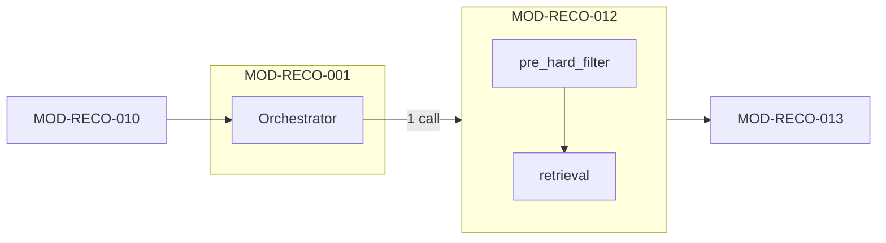

# MOD-RECO-011 廃止・移行記録

## 1. ドキュメント情報

| 項目           | 内容                                                                 |
| -------------- | -------------------------------------------------------------------- |
| ドキュメントID | `MOD-RECO-011`                                                       |
| ドキュメント名 | MOD-RECO-011 廃止・移行記録                                          |
| ドキュメント種別 | **廃止・移行記録**（実装モジュール仕様書の正本ではない）           |
| 対象システム   | Gift Recommendation Service（`apps/reco`）                           |
| 関連 Issue     | #862（設計判断・移行記録 Task）                                      |
| 作成日         | 2026-06-30                                                           |
| 更新日         | 2026-06-30（`MOD-RECO-011` 廃止・`MOD-RECO-012` 統合を確定）         |

---

## 2. 廃止通知

| 項目 | 内容 |
| ---- | ---- |
| 廃止対象 | **`MOD-RECO-011`（Pre Hard Filter Executor）を独立実装モジュールとして廃止** |
| 廃止日（設計確定） | 2026-06-30 |
| 判断者 | Human Review（Issue #862 設計議論に基づく） |
| 移行先 | **`MOD-RECO-012`（Candidate Retriever）内サブモジュール `pre_hard_filter`** |
| 維持する概念 | パイプライン上の **Pre Hard Filter フェーズ**、論理リソース **`pre_filtered_item_pool`** |
| 実装正本（移行先） | `docs/06_実装設計/reco/MOD-RECO-012_Candidate Retrieverモジュール仕様書.md`（**未作成**。Step 3 Task で作成） |

**廃止理由（要約）**

- `representation = predicate` を徹底する場合、Pre Hard Filter の実行は **Retrieval SQL への predicate 埋め込み**と一体であり、独立モジュールとして DB に触る必然性が薄い
- 独立モジュールを維持しても実装が薄くなり、Epic / Orchestrator / 観測の維持コストが相対的に大きい
- 将来の Filter 拡張は主に predicate 複雑化であり、`012` 内 `pre_hard_filter` サブモジュールで吸収可能

**本ドキュメントの位置づけ**

- 旧「モジュール仕様書」案の設計判断・移管対象を記録する
- **実装・単体テストの正本は `MOD-RECO-012` 仕様書**とする
- Recoモジュール一覧等の横断正本は **Step 4（横断 docs Task）完了まで暫定的に旧記述が残る**（§9 参照）

---

## 3. 確定済み設計方針

| 項目 | 確定内容 |
| ---- | -------- |
| モジュール境界 | `MOD-RECO-011` 廃止。`MOD-RECO-012` 内 `pre_hard_filter` に統合 |
| パイプライン概念 | Pre Hard Filter **フェーズ**は docs 上維持（Retrieval定義書・機能一覧の Pre / Post 分離は維持） |
| Orchestrator 呼び出し | **`010 → 012` の 1 呼び出し**。012 内部で `pre_hard_filter` → `retrieval` |
| 論理リソース | `pre_filtered_item_pool` を `execution_context` 上の中間成果物として維持 |
| Phase Log | **`pre_hard_filter_completed` を維持**（012 内部サブフェーズとして記録） |
| Error Code | **`GRS-REC-008` を維持**（意味: 構造化 Pre Filter 失敗。発生元は 012 内部） |
| Metric | **`pre_filter_candidate_count` を維持**（012 が predicate 評価後に記録） |
| 物理配置 | `apps/reco/src/reco/application/candidate-retriever/pre-hard-filter/**` |
| DB アクセス | 011 単体での COUNT / Filter 実行は行わない。predicate 適用・件数確認は **012 内**で実施 |
| Fallback | NG / 予算条件の緩和は **行わない**（Retrieval定義書 §15.3） |



---

## 4. パイプライン上維持する概念

以下は **廃止しない**（ドメイン・運用・観測上のフェーズとして維持）。

| 概念 | 維持内容 |
| ---- | -------- |
| Pre Hard Filter フェーズ | Retrieval **前**の構造化 Hard Filter（予算・NG・active・availability・data quality 等） |
| `pre_filtered_item_pool` | Pre Hard Filter 通過済み item 集合の論理リソース（正本定義表：一時 / 派生・Run 内） |
| Pre / Post 分離 | Pre = 構造化除外・性能目的。Post（`MOD-RECO-013`）= Semantic NG・avoid・重複・表示前 Validation |
| 処理順（論理） | User Meaning 完了 → Query Embedding → **Pre Hard Filter** → Retrieval → Post Hard Filter → Matching … |

**Orchestrator 呼び出し順序（移行後・確定）**

```text
… → MOD-RECO-010 Query Embedding 生成 → MOD-RECO-012 候補商品抽出（内部: pre_hard_filter → retrieval）→ MOD-RECO-013 Post Hard Filter → …
```

---

## 5. `MOD-RECO-012` へ移管する責務

旧 `MOD-RECO-011` 案から **`pre_hard_filter` サブモジュール**へ移管する主責務。

| 責務 | 内容 | 正本参照 |
| ---- | ---- | -------- |
| Filter 条件 merge | `request.ng_condition`（**primary**）+ `hard_filter_candidates[]`（004 出力）の merge / dedup | `MOD-RECO-004` §8.3.5、Retrieval §8.4 |
| 予算 Filter | `budgetMin` / `budgetMax` | Retrieval §8.3 |
| NG Filter | キーワード・カテゴリ等の構造化 NG | Retrieval §8.4 |
| 商品有効状態 | `is_active` / `active_status` | item テーブル定義書 |
| availability | 利用不可商品の除外 | Retrieval §8.2 |
| data quality | URL / 画像 / 名称欠落の除外 | 処理構成定義書 §6.2 |
| predicate 組み立て | `filter_predicate` の生成（**DB 実行は retrieval 側と一体**） | 本記録 §6 |
| pool 生成 | `pre_filtered_item_pool` を `execution_context` に設定 | 本記録 §6 |
| 観測（Pre フェーズ） | `pre_hard_filter_completed`、`pre_filter_candidate_count`、`GRS-REC-008` | ログ・Observability設計書 |

**移管しない責務（境界）**

| 対象 | 担当 |
| ---- | ---- |
| Semantic 抽出・`hard_filter_candidates` 生成 | `MOD-RECO-004` |
| Query Embedding 生成 | `MOD-RECO-010`（Filter 判定には使用しない） |
| pgvector / Hybrid 検索 | `012` 内 `retrieval` |
| Semantic NG・avoid・重複（Retrieval 後） | `MOD-RECO-013` |
| `non_preferred_condition` の Hard Filter 化 | Matching / Ranking（Retrieval §8.5） |
| Orchestrator 実行順序制御 | `MOD-RECO-001` |
| Phase Log / Error Log 物理書き込み | `MOD-RECO-028` / `029`（012 から依頼） |

---

## 6. `pre_filtered_item_pool`（移管仕様要約）

012 仕様書へ移管する技術要点。詳細は Step 3 で確定する。

### 6.1 論理構造

| フィールド | 必須 | 内容 |
| ---------- | ---- | ---- |
| `representation` | `true` | `predicate` / `session_table` / `materialized_ids` |
| `total_before_filter` | `true` | Filter 前件数（012 が取得） |
| `total_after_filter` | `true` | Filter 後件数（= `pre_filter_candidate_count`） |
| `filter_summary` | `false` | Filter 種別ごとの除外件数サマリ |
| `applied_conditions` | `false` | 適用条件の正規化サマリ（secret・全文ログ禁止） |

- **0 件は成功**（`GRS-REC-001` は Orchestrator / 下位管轄）
- 正本テーブルへの永続 DML は **行わない**

### 6.2 物理表現（`representation`）

| `representation` | MVP 本番 | 用途 |
| ---------------- | -------- | ---- |
| `predicate` | **第一候補** | `filter_predicate` を保持。retrieval が subquery / JOIN で再利用 |
| `session_table` | 第二候補 | Run スコープ一時表 + `session_handle` |
| `materialized_ids` | 限定（テスト・閾値以下） | `uuid[]` 全件具体化。**本番前提にしない** |

### 6.3 Filter 適用順（正本: Retrieval §8.6）

1. `active_item_filter` → 2. `availability_filter` → 3. `budget_filter` → 4. `ng_category_filter` → 5. `ng_keyword_filter` → 6. `data_quality_filter` → 7. `duplicate_item_filter`（MVP は簡易可）

### 6.4 012 内処理順（確定）

```text
1. 入力検証（execution_context / request / semantic_extraction_result）
2. pre_hard_filter: merge → filter_predicate 組み立て → pre_filtered_item_pool 生成
3. （任意）EXISTS / COUNT で 0 件早期確認
4. retrieval: predicate 埋め込み vector 検索（+ 将来 hybrid 等）
5. Phase Log / Metric（Pre フェーズ分）
```

---

## 7. 012 仕様書への移管チェックリスト（Step 3）

`MOD-RECO-012_Candidate Retrieverモジュール仕様書.md` 作成時に、以下を **必ず** 含める。

- [ ] サブモジュール構成（`pre_hard_filter` / `retrieval`）
- [ ] Orchestrator Port（`010` 後の **1 回呼び出し**）
- [ ] `hard_filter_candidates` 受け取りと merge 方針（§5 表）
- [ ] `pre_filtered_item_pool` 論理・物理表現（§6）
- [ ] `GRS-REC-008` / `pre_hard_filter_completed` / `pre_filter_candidate_count` の発火タイミング
- [ ] `013` / `010` / `004` との責務境界
- [ ] 配置: `candidate-retriever/pre-hard-filter/**`
- [ ] 本廃止記録への参照（設計経緯）
- [ ] テスト観点（旧 011 案 §14 相当を `pre_hard_filter` 単体 + 012 結合に再配置）

---

## 8. 廃止に伴い実施しないこと

| 項目 | 内容 |
| ---- | ---- |
| 独立 Epic 実装 | `apps/reco/src/reco/application/pre-hard-filter-executor/**` は **作成しない** |
| Orchestrator からの `011` 呼び出し | 実装しない（001 更新は Step 4 / 実装 Task） |
| Epic #861 配下の implementation / unit-test Task | **着手しない**（Step 5 でキャンセル） |
| 011 単体での DB COUNT | 独立モジュールとして実施しない |

---

## 9. 横断 docs 更新（Step 4 完了）

Issue #867 / Step 4（横断 docs Task）により、以下の正本を **012 統合版**へ更新済み（2026-06-30）。

| 正本 | 更新内容 |
| ---- | -------- |
| Recoモジュール一覧 §4 / §5 / §6.10 / §6.11 | `MOD-RECO-011` 独立行廃止・`012` 統合記述 |
| MOD-RECO-001 仕様書 | `010 → 012` 1 呼び出し・`008`/`009` 発生元 |
| エラーコード定義書 | `GRS-REC-008` / `009` 発生元を `MOD-RECO-012` に明記 |
| モジュール一覧・機能×モジュール対応表・処理構成定義書・機能一覧 | モジュール対応を `012` 統合版へ更新 |
| MOD-RECO-010 仕様書 | パイプライン順序参照を更新 |

**読み方**: 本廃止記録と横断 docs は整合済み。実装判断は本記録および `MOD-RECO-012` モジュール仕様書を正とする。

---

## 10. 後続 Task 一覧

| Step | Issue（予定） | worktree | 成果物 |
| --: | ------------- | -------- | ------ |
| 3 | 012 モジュール仕様書 Task（新規） | 専用 worktree | `MOD-RECO-012_...モジュール仕様書.md` |
| 4 | 横断 docs 更新 Task（新規） | 専用 worktree | Recoモジュール一覧・001・エラー・Observability 等 | **完了**（Issue #867） |
| 5 | Epic / Definition 整理 Task（新規） | 専用 worktree | #861 クローズ、012 Epic scope、011 implementation キャンセル |
| 6 | 012 実装 Task（新規） | 専用 worktree | `candidate-retriever/pre-hard-filter/**` 等 |

運用: **1 Issue = 1 Branch = 1 worktree = 1 PR**（`.cursor/rules/worktree.mdc`）

---

## 11. 変更履歴

| 日付 | 変更内容 | 関連 Issue / PR |
| ---- | -------- | --------------- |
| 2026-06-30 | 初版としてモジュール仕様書案を作成 | Issue #862 |
| 2026-06-30 | `pre_filtered_item_pool` 物理表現を predicate 中心に改訂（仕様書案） | Issue #862 Human フィードバック |
| 2026-06-30 | **`MOD-RECO-011` 廃止・`012` 統合を確定**。本文を廃止・移行記録へ全面改訂 | Issue #862 Pivot |
| 2026-06-30 | Step 4 横断 docs 整合完了 | Issue #867 |

---

## 12. 関連資料

| 種別 | パス | 用途 |
| ---- | ---- | ---- |
| 移行先（未作成） | `docs/06_実装設計/reco/MOD-RECO-012_Candidate Retrieverモジュール仕様書.md` | 実装正本 |
| Retrieval定義書 | `docs/04_ドメインモデル設計/Retrieval定義書.md` | Hard Filter ドメイン正本 |
| Recoモジュール一覧 | `docs/05_アプリケーション設計/アプリ/reco/Recoモジュール一覧.md` | Step 4 で更新 |
| MOD-RECO-001 仕様書 | `docs/06_実装設計/reco/MOD-RECO-001_Recommendation Orchestratorモジュール仕様書.md` | Step 4 で更新 |
| MOD-RECO-004 / 010 仕様書 | `docs/06_実装設計/reco/` 配下 | 境界参照 |
| エラーコード定義書 | `docs/05_アプリケーション設計/アプリ/エラーコード定義書.md` | `GRS-REC-008` |
| ログ・Observability設計書 | `docs/05_アプリケーション設計/アプリ/ログ・Observability設計書.md` | Phase / Metric |
| Epic #861 Definition | `prompts/definitions/epics/mod-reco-011-pre-hard-filter-executor/epic.yaml` | Step 5 で整理 |
| Epic #012 Definition | `prompts/definitions/epics/mod-reco-012-candidate-retriever/epic.yaml` | Step 5 で scope 拡張 |

---

## 13. 備考

- 本ファイル名は互換性のため `MOD-RECO-011_Pre Hard Filter Executorモジュール仕様書.md` を維持するが、**内容は廃止・移行記録**である
- Issue #862 の Task Definition（`module-spec.yaml`）は当初「モジュール仕様書作成」であったが、Human 判断により **設計判断・移行記録 Task（Pivot）** として完了する
- secret・`.env` 実値は記載しない
