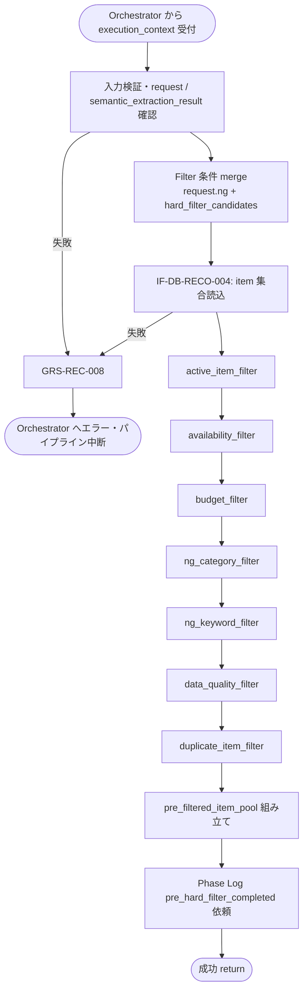

# Pre Hard Filter Executor モジュール仕様書

## 1. ドキュメント情報

| 項目           | 内容                                              |
| -------------- | ------------------------------------------------- |
| ドキュメントID | `MOD-RECO-011`                                    |
| ドキュメント名 | Pre Hard Filter Executor モジュール仕様書         |
| 対象システム   | Gift Recommendation Service（`apps/reco`）        |
| MVP対象        | `○`                                               |
| 作成日         | 2026-06-30                                        |
| 更新日         | 2026-06-30                                        |

---

## 2. 概要

Pre Hard Filter Executor（Pre Hard Filter）は、Reco オンライン推薦パイプラインの **Retrieval フェーズ先頭**（User Meaning フェーズ直後）において、`MOD-RECO-001` Recommendation Orchestrator から `execution_context` を受け取り、**Retrieval 前に商品母集団を構造化条件で絞り込む**モジュールである。`MOD-RECO-010` Query Embedding Generator 完了後、**`MOD-RECO-012` Candidate Retriever の直前**に実行する。

本モジュールは **Pre Hard Filter（構造化 Hard Filter）の実行** に責務を限定し、Embedding 類似度検索・Semantic NG 照合・Matching / Ranking 計算は行わない。絞り込み結果を **`pre_filtered_item_pool`** として `execution_context` へ返却し、後続 Retrieval が全商品ではなく通過済み集合のみを検索対象とできるようにする（性能確保が主目的。Recoモジュール一覧 §6.10）。

MVP では **DB からの item 参照（IF-DB-RECO-004）** と **Run 内メモリ上の pool 生成** を行い、pool の DB 永続化は行わない（正本定義表 §5.10：一時 / 派生）。

---

## 3. 目的

- `apps/reco` における Pre Hard Filter Executor 実装・単体テストの前提を定義する
- Orchestrator との I/F（`execution_context` 入出力）、失敗時のパイプライン中断（`GRS-REC-008`）を後続実装可能な粒度で整理する
- Recoモジュール一覧・Retrieval定義書・Recommendation Request定義書・`MOD-RECO-004` / `010` 仕様書・Orchestrator 仕様書との整合を担保する

---

## 4. モジュール基本情報

| 項目 | 内容 |
| ---- | ---- |
| モジュールID | `MOD-RECO-011` |
| モジュール名 | Pre Hard Filter |
| 物理名 | `Pre Hard Filter Executor` |
| 分類 | Retrieval |
| 処理種別 | `OL` |
| 配置予定 | `apps/reco/src/reco/application/pre-hard-filter-executor/**` |
| 所属Epic | `MOD-RECO-011`（Epic Issue #861） |
| MVP対象 | `○` |
| 主な呼び出し元 | `MOD-RECO-001` Recommendation Orchestrator |
| 主な呼び出し先 | Item Repository（IF-DB-RECO-004） |

`MOD-API-*` / `MOD-RECO-*` / `MOD-BATCH-*` 配下の Task では、該当モジュール ID の責務範囲に変更を限定する。`MOD-RECO-*` では `apps/reco/src/reco/api/**` の API-INT エンドポイント層を対象に含めない。エンドポイント層の変更が必要な場合は、該当する `API-INT-*` Epic 配下 Task として扱う。

---

## 5. 責務

### 5.1 主責務

- Retrieval 前に **Pre Hard Filter** を実行し、検索対象商品集合を構造化条件で絞り込む（Recoモジュール一覧 §6.10）
- **`execution_context.request.budget`**（`budgetMin` / `budgetMax`）に基づく **予算 Filter** を適用する（Retrieval定義書 §8.3）
- **`execution_context.request.ng_condition`** を **primary** として NG Filter を適用する（Recommendation Request定義書 §9）
- **`execution_context.semantic_extraction_result.hard_filter_candidates[]`**（`MOD-RECO-004` 出力）を **merge / dedup** し、構造化 NG と統合して Filter 条件を組み立てる（§8.3.2）
- **`item.is_active = true`** および **`active_status`** に基づく **商品有効状態 Filter** を適用する（item_テーブル定義書 §6、`状態遷移設計書` §7.1.3）
- **販売状態・利用不可商品**（availability）を除外する（Retrieval定義書 §8.2 `availability_filter`）
- **データ品質最低条件**（URL 欠落、画像欠落等）を満たさない商品を除外する（処理構成定義書 §6.2）
- 絞り込み結果を **`pre_filtered_item_pool`** として `execution_context` へ返却し、`MOD-RECO-012` へ引き渡す
- 成功後、**Phase Log**（`phase_name = pre_hard_filter_completed`）を Orchestrator / `MOD-RECO-028` 経由で依頼する
- **`pre_filter_candidate_count`** メトリクスを Orchestrator / `MOD-RECO-025` へ渡す（0 件も正常値として記録）
- 回復不能な Pre Hard Filter 失敗時に **`GRS-REC-008`** 相当のエラーを Orchestrator へ返却し、パイプライン中断を促す

### 5.2 対象外責務

- `API-INT-002` エンドポイント層（HTTP 受付、reco 側防御的 Validation、OpenAPI スキーマ整合）
- `MOD-RECO-001` Orchestrator の **実行順序制御**・Phase Log 契機管理（本モジュールは Filter 完了通知のみ）
- **Semantic 抽出・Hard Filter 候補の生成**（`MOD-RECO-004` 責務。本モジュールは merge / 適用のみ）
- **Query Embedding 生成・消費**（`MOD-RECO-010` 責務。Orchestrator 順序上は直前だが、Filter 判定には **利用しない**）
- **候補商品抽出（pgvector / Hybrid 検索）**（`MOD-RECO-012` 責務）
- **Post Hard Filter**（Semantic NG・avoid 類似・重複・表示前 Validation。`MOD-RECO-013` 責務）
- **`non_preferred_condition` の Hard Filter 化**（Matching / Ranking で減点。Retrieval定義書 §8.5）
- **Fallback による NG / 予算条件の緩和**（Retrieval定義書 §15.3：Hard Filter は緩めない）
- **`pre_filtered_item_pool` の DB 永続化**（正本：Run 内メモリ。正本定義表 §5.10）
- Phase Log / Error Log の **物理書き込み実装**（`MOD-RECO-028` / `029`。Orchestrator / Error Handler 経由）
- Public API 向けレスポンス形式への変換（`apps/api` 責務）
- OpenAPI / Orval / generated の変更
- DB schema / DDL の変更
- Item 正本の更新（Online 推薦中の `item` UPDATE 禁止。item_テーブル定義書 §5.2）

---

## 6. 入出力

### 6.1 入力

| 入力 | 型 / 構造 | 必須 | 生成元 | 用途 | 備考 |
| ---- | --------- | ---- | ------ | ---- | ---- |
| `execution_context` | パイプライン実行コンテキスト | `true` | `MOD-RECO-001` | Filter の起点 | `run_id` / `trace_id` / `request` を含む |
| `execution_context.request` | `RecommendationRequest` | `true` | `API-INT-002` 経由 | 予算・NG 等の構造化条件 | Recommendation Request定義書 |
| `execution_context.request.budget` | Budget Condition | `false` | Request | 予算 Filter | `budgetMin` / `budgetMax`。未指定時は Filter スキップ |
| `execution_context.request.ng_condition` | NG Condition | `false` | Request | NG Filter **primary** | `ng_text` / `ng_keywords` 等 |
| `execution_context.semantic_extraction_result` | Semantic 抽出結果 | `true` | `MOD-RECO-004` | `hard_filter_candidates[]` 参照 | `004` 失敗時は本モジュール未到達 |
| `execution_context.semantic_extraction_result.hard_filter_candidates[]` | Hard Filter 候補配列 | `false` | `MOD-RECO-004` | NG 等の merge 入力 | §8.3.2。空配列可 |
| `execution_context.run_id` | `uuid` | `true` | `MOD-RECO-002` | ログ・Run 相関 | |
| `execution_context.query_embedding` | Query Embedding | `false` | `MOD-RECO-010` | — | **Filter 判定には使用しない**（順序整合のため context に存在し得る） |

**入力正本（Filter 条件）**

| 観点 | 正本 |
| ---- | ---- |
| 予算 | `execution_context.request.budget`（`budgetMin` / `budgetMax`） |
| 構造化 NG | `execution_context.request.ng_condition`（**primary**） |
| 抽出由来 NG 候補 | `execution_context.semantic_extraction_result.hard_filter_candidates[]`（**merge 参照**） |
| 商品属性 | DB 参照（IF-DB-RECO-004：`item` / `item_image` / `active_status` / `price`） |

**前提**: `MOD-RECO-002` Run INSERT、`MOD-RECO-004` Semantic 抽出、`MOD-RECO-010` Query Embedding 生成が完了済みであること（Orchestrator §8.2.1 論理順序 12）。

### 6.2 出力

| 出力 | 型 / 構造 | 利用先 | 用途 | 備考 |
| ---- | --------- | ------ | ---- | ---- |
| `pre_filtered_item_pool` | ドメインオブジェクト（実装 Task で型定義） | `execution_context`、下位 `MOD-RECO-*` | Retrieval 対象 item 集合 | §6.2.1 |
| `execution_context.pre_filtered_item_pool` | 上記への参照 | Orchestrator Port 契約 | 後続 `012` 入力 | |
| `pre_filter_candidate_count` | `number` | Orchestrator / `MOD-RECO-025` | 候補数メトリクス | 0 件も正常 |
| `reco_error` | 標準化 reco エラー | Orchestrator | 回復不能失敗時 | `GRS-REC-008` |

#### 6.2.1 `pre_filtered_item_pool` 構造（MVP）

| フィールド | 型 | 必須 | 内容 |
| ---------- | -- | ---- | ---- |
| `item_ids` | `uuid[]` | `true` | Pre Hard Filter **通過**した `item_id` 集合（順序は未定・実装 Task で確定） |
| `total_before_filter` | `number` | `true` | Filter 前の参照対象 item 件数（監査・メトリクス用） |
| `total_after_filter` | `number` | `true` | Filter 後件数（`item_ids.length` と一致） |
| `filter_summary` | object | `false` | Filter 種別ごとの除外件数サマリ（§8.2.2） |
| `applied_conditions` | object | `false` | 適用した budget / ng 条件の正規化サマリ（secret・全文ログ禁止） |

**0 件の扱い**: pool が空（`total_after_filter = 0`）でも **成功** とする。最終的な `GRS-REC-001`（推薦候補 0 件）判定は Orchestrator / 下位モジュール / `MOD-RECO-024` が担当（エラーコード定義書 §12 補足）。

**永続化**: 本モジュールは **`pre_filtered_item_pool` を DB へ書き込まない**（リソース一覧：一時 / 派生・reco・OL）。

---

## 7. 依存関係

### 7.1 依存モジュール

| 依存先 | 方向 | 用途 | 失敗時の扱い | 備考 |
| ------ | ---- | ---- | ------------ | ---- |
| `MOD-RECO-001` Recommendation Orchestrator | 被呼び出し | OL パイプラインでの Pre Hard Filter 契機 | — | Retrieval フェーズ先頭（論理順序 12） |
| `MOD-RECO-002` Recommendation Run Recorder | 間接依存 | `recommendation_run_id` の前提 | `002` 失敗時は本モジュール未到達 | Run INSERT 完了後 |
| `MOD-RECO-004` User Semantic Extractor | 間接依存 | `hard_filter_candidates[]` | `004` 失敗時は未到達 | merge 参照 |
| `MOD-RECO-010` Query Embedding Generator | 間接依存 | 直前フェーズ完了の前提 | `010` 失敗時は未到達 | **出力は Filter に不使用** |
| Item Repository（IF-DB-RECO-004） | 呼び出し | Pre Hard Filter 用 item 参照 | `GRS-REC-008` | `item` / `item_image` / `active_status` / `price` |
| Database Connection Manager | 間接依存 | DB 接続 | 接続失敗 → `GRS-REC-008` | Repository Base 経由 |
| `MOD-RECO-024` Reco Error Handler | 間接連携 | 例外の標準化 | Filter 失敗でパイプライン中断 | Orchestrator 経由 |
| `MOD-RECO-028` Phase Log Writer | 間接連携 | `pre_hard_filter_completed` 記録 | 記録失敗は推薦結果に影響させない | 成功後 |
| `MOD-RECO-029` Error Log Writer | 間接連携 | 失敗詳細記録 | `MOD-RECO-024` 経由 | 失敗時 |

**下位利用モジュール（本モジュール出力の利用先）**

| モジュール | 利用する出力 |
| ---------- | ------------ |
| `MOD-RECO-012` Candidate Retriever | `pre_filtered_item_pool.item_ids`（必須）。`query_embedding` は `012` が別途 `execution_context` から参照 |
| `MOD-RECO-013` Post Hard Filter Executor | **直接は利用しない**（`012` 出力を入力） |
| `MOD-RECO-014`〜`023` | **直接は利用しない** |

### 7.2 参照データ

| データ | 参照元 | 用途 | version / config | 備考 |
| ------ | ------ | ---- | ---------------- | ---- |
| `item` | DB（IF-DB-RECO-004） | 価格・有効状態・URL・ジャンル・名称等 | 読み取りのみ | Online 中 UPDATE 禁止 |
| `item_image` | DB（同上） | 画像有無判定 | 読み取りのみ | 最低 1 件の有効画像 |
| `external_genre` | DB（任意 JOIN） | NG カテゴリ Filter | 読み取りのみ | MVP は genre 名 / ID マッチ |
| `recommendation_run` | DB（任意） | Run 存在検証 | Run 固定 | SELECT のみ |

---

## 8. 処理仕様

### 8.1 処理フロー



### 8.2 処理ステップ

| No | 処理 | 入力 | 出力 | 補足 |
| --: | ---- | ---- | ---- | ---- |
| 1 | 入力検証 | `execution_context` | — | `run_id` / `request` / `semantic_extraction_result` 必須 |
| 2 | Filter 条件 merge | `request.ng_condition`, `hard_filter_candidates[]` | `merged_filter_conditions` | §8.3.2 |
| 3 | item 集合読込 | Repository Query | `candidate_items[]` | IF-DB-RECO-004。全 active item を起点とするか、実装 Task で Query 最適化 |
| 4 | active_item_filter | `candidate_items`, `is_active`, `active_status` | 絞込集合 | `is_active = true` 必須 |
| 5 | availability_filter | 絞込集合 | 同上 | 販売停止・取得不可を除外 |
| 6 | budget_filter | 絞込集合, `request.budget` | 同上 | §8.3.1。未指定時スキップ |
| 7 | ng_category_filter | 絞込集合, merged NG | 同上 | ジャンル / カテゴリ NG |
| 8 | ng_keyword_filter | 絞込集合, merged NG | 同上 | 名称・説明・タグのキーワード NG |
| 9 | data_quality_filter | 絞込集合 | 同上 | URL 必須・画像 1 件以上（MVP） |
| 10 | duplicate_item_filter | 絞込集合 | 同上 | `external_item_code` 等で dedup |
| 11 | pool 組み立て | 最終集合 | `pre_filtered_item_pool` | `execution_context` へ格納 |
| 12 | メトリクス | `total_after_filter` | `pre_filter_candidate_count` | Orchestrator へ |
| 13 | Phase Log 依頼 | 成功 | phase 記録依頼 | `pre_hard_filter_completed` |
| 14 | 結果返却 | pool | `execution_context.pre_filtered_item_pool` | 後続 `012` へ |

**Orchestrator 呼び出し順序（正本: MOD-RECO-001 §8.2.1）**

```text
… → MOD-RECO-010 Query Embedding 生成 → MOD-RECO-011 Pre Hard Filter → MOD-RECO-012 候補商品抽出 → …
```

本モジュールは Retrieval フェーズの **論理順序 12** である。

#### 8.2.1 Filter 適用順（正本: Retrieval定義書 §8.6）

| 順序 | Filter ID | MVP 優先 |
| --: | --------- | -------- |
| 1 | `active_item_filter` | ○ |
| 2 | `availability_filter` | ○ |
| 3 | `budget_filter` | ○ |
| 4 | `ng_category_filter` | ○ |
| 5 | `ng_keyword_filter` | ○ |
| 6 | `data_quality_filter` | ○ |
| 7 | `duplicate_item_filter` | △（同一 Run 内 dedup。MVP は簡易実装可） |

Retrieval定義書 §8.6 注記：MVP では `active_item_filter` / `budget_filter` / `ng_keyword_filter` を優先する。上表の全 Filter を **仕様上定義** し、実装 Task で段階的に充足してよい。

#### 8.2.2 `filter_summary`（任意・MVP）

| キー | 内容 |
| ---- | ---- |
| `excluded_by_active` | 非 active 除外件数 |
| `excluded_by_availability` | 利用不可除外件数 |
| `excluded_by_budget` | 予算外除外件数 |
| `excluded_by_ng_category` | NG カテゴリ除外件数 |
| `excluded_by_ng_keyword` | NG キーワード除外件数 |
| `excluded_by_data_quality` | データ品質除外件数 |
| `excluded_by_duplicate` | 重複除外件数 |

ログ・Metric 用。個別 item の除外理由全文は MVP では **必須としない**（Post Hard Filter の `excluded_candidate_log` は `013` 責務）。

### 8.3 アルゴリズム / 計算仕様

#### 8.3.1 budget_filter（MVP）

正本: Retrieval定義書 §8.3、Recommendation Request定義書 §7.2。

| 条件 | 処理 |
| ---- | ---- |
| `budgetMin` のみ | `item.price >= budgetMin` |
| `budgetMax` のみ | `item.price <= budgetMax` |
| 両方指定 | `budgetMin <= item.price <= budgetMax` |
| 両方未指定 | Filter **スキップ** |
| 価格不明（NULL 等） | **原則除外**（Retrieval §8.3 注意点） |

MVP では送料を価格 Filter に **含めない**。税込 / 税抜は取得価格をそのまま利用（Retrieval §8.3）。

#### 8.3.2 NG 条件 merge（`hard_filter_candidates`）

正本: `MOD-RECO-004` 仕様書 §8.3.5。本 Task で merge / dedup 詳細を確定する。

**優先順位**

| 優先 | ソース | 扱い |
| --: | ------ | ---- |
| 1 | `execution_context.request.ng_condition` | **primary**（構造化 NG 正本） |
| 2 | `semantic_extraction_result.hard_filter_candidates[]` | **merge 参照**（`004` が `ng_text` / free_text 由来で生成） |

**merge 方針（MVP）**

| 観点 | 方針 |
| ---- | ---- |
| dedup キー | `hard_filter_type` + 正規化キーワード / カテゴリ code（実装 Task で型定義） |
| 競合 | 同一 NG が Request と candidates の両方にある場合、**1 件に統合**（除外は 1 回のみ） |
| Semantic Concept | `hard_filter_candidates` は Semantic Concept 化 **しない**（`004` 確定済み） |
| `non_preferred_condition` | **merge 対象外**（Hard Filter にしない） |

**候補要素（`004` 出力・MVP 想定）**

| フィールド | 用途 |
| ---------- | ---- |
| `hard_filter_type` | `category` / `keyword` / `attribute` / `budget` 等 |
| `match_value` | マッチ対象（キーワード・カテゴリ code 等） |
| `evidence_text` | 根拠（ログは要約のみ。全文は構造化ログに出さない） |
| `confidence` | merge 時の tie-break 参考（MVP は Request primary が優先） |
| `source_type` | `ng_condition` / `free_text` 等 |

#### 8.3.3 ng_keyword_filter / ng_category_filter（MVP）

正本: Retrieval定義書 §8.4。

| NG 種別 | マッチ対象（MVP） | 備考 |
| ------- | ----------------- | ---- |
| NG キーワード | `item_name`, `item_caption`, `catchcopy`（部分一致・正規化は実装 Task） | 大文字小文字・全半角は実装 Task |
| NG カテゴリ | `external_genre_id` または genre 名マッピング | 属性 NG は情報がある場合のみ |

#### 8.3.4 data_quality_filter（MVP）

処理構成定義書 §6.2・モジュール一覧 §8.3 に準拠。

| 条件 | 処理 |
| ---- | ---- |
| `item_url` 空 | 除外 |
| 有効 `item_image` 0 件 | 除外 |
| `item_name` 空 | 除外 |

#### 8.3.5 Pre / Post Hard Filter 境界

| 観点 | Pre Hard Filter（本モジュール） | Post Hard Filter（`MOD-RECO-013`） |
| ---- | ------------------------------- | ----------------------------------- |
| タイミング | Retrieval **前** | Retrieval **後** |
| 主目的 | 性能（母集団削減）+ 構造化 NG | 意味的 NG・重複・表示前 Validation |
| 入力 | Request / item metadata | `retrieval_candidate` / semantic |
| Semantic NG | **扱わない** | **扱う** |
| avoid | **扱わない** | **扱う** |

#### 8.3.6 Orchestrator Port 契約（MVP 論理正本）

| 項目 | 内容 |
| ---- | ---- |
| 呼び出し | `apply_pre_hard_filter(execution_context) -> execution_context`（メソッド名は実装 Task で確定） |
| 成功 | `execution_context.pre_filtered_item_pool` が設定される |
| 失敗 | 例外または `reco_error`（`GRS-REC-008`）を Orchestrator へ返却。後続 `012`〜`023` は **呼ばれない** |
| Phase Log | Orchestrator が `pre_hard_filter_completed` の started / succeeded / failed を `MOD-RECO-028` へ依頼 |
| 0 件 pool | **成功**。`012` 以降で空結果処理（最終 `GRS-REC-001` は Orchestrator 管轄） |

---

## 9. データ項目マッピング

| 入力項目 | 内部項目 | 出力項目 | 変換内容 | 備考 |
| -------- | -------- | -------- | -------- | ---- |
| `request.budget.budgetMin` / `budgetMax` | `filter.budget_range` | — | 価格 range 判定 | 未指定時スキップ |
| `request.ng_condition.*` | `filter.ng_primary` | — | NG Filter 条件 | primary |
| `hard_filter_candidates[]` | `filter.ng_merged` | — | merge / dedup | `004` 出力 |
| `item.item_id`（DB） | `candidate_items[]` | `pre_filtered_item_pool.item_ids[]` | 各 Filter 通過後に残存 | IF-DB-RECO-004 |
| — | `candidate_items.length` | `pre_filtered_item_pool.total_before_filter` | 読込件数 | |
| — | 通過件数 | `pre_filtered_item_pool.total_after_filter` | Filter 後件数 | = `pre_filter_candidate_count` |

---

## 10. 状態・例外

### 10.1 状態

本モジュールは **ステートレス**（Run 内 1 回呼び出し・メモリ上の一時成果物）とする。

| 状態 | 意味 | 遷移条件 | 記録先 |
| ---- | ---- | -------- | ------ |
| — | なし | — | — |

### 10.2 例外

| 例外 | Error Code | 発生条件 | 呼び出し元への返却 | ログ |
| ---- | ---------- | -------- | ------------------ | ---- |
| Pre Hard Filter 失敗 | `GRS-REC-008` | 入力検証失敗・DB 参照失敗・Filter 処理不能 | 500 系。パイプライン中断 | Error Log + Phase `pre_hard_filter_completed` = failed |
| DB 参照失敗 | `GRS-DB-*`（詳細） | Repository / 接続エラー | Orchestrator 表面は `GRS-REC-008` | secret マスキング |
| Run 不整合 | `GRS-REC-008` | `request` / `semantic_extraction_result` 欠落 | 同上 | 同上 |
| 候補 0 件 | —（正常） | 全 item が Filter 除外 | **中断しない**。後続へ | `pre_filter_candidate_count = 0` |

Error Code の正本はエラーコード定義書。Orchestrator は `MOD-RECO-011` 失敗を **Pre Hard Filter 失敗**として `GRS-REC-008` に分類する（MOD-RECO-001 §10.2）。

**リトライ**: 本モジュール内の自動リトライは MVP では **行わない**。DB 一時障害も Orchestrator 単位リトライは行わず、呼び出し元再 Run に委ねる（MOD-RECO-001 §10.1）。

**Fallback 禁止**: 予算・NG 条件を緩めて pool を artificially に増やす処理は **行わない**（Retrieval定義書 §15.3）。

---

## 11. DB / 永続化

### 11.1 書き込み

| テーブル | 操作 | 主な項目 | トランザクション | 備考 |
| -------- | ---- | -------- | ---------------- | ---- |
| — | — | — | — | **本モジュールは DML を行わない** |

### 11.2 読み取り

| テーブル | 操作 | 主な項目 | トランザクション | 備考 |
| -------- | ---- | -------- | ---------------- | ---- |
| `item` | SELECT | `item_id`, `price`, `is_active`, `active_status`, `item_name`, `item_caption`, `item_url`, `external_genre_id` | 読み取りのみ | IF-DB-RECO-004 |
| `item_image` | SELECT | `item_id`, 画像 URL 存在 | 読み取りのみ | 画像有無判定 |
| `external_genre` | SELECT（任意） | genre 名 / ID | 読み取りのみ | NG カテゴリ用 |

**Query 方針（MVP）**: 全 active item を読込後 in-memory Filter とするか、DB 側で predicate push-down するかは **実装 Task** で決定する。性能 PoC 結果に応じて索引・Query 最適化を別 Task 化してよい。

---

## 12. ログ・メトリクス

| 種別 | 内容 | 出力タイミング | 保存先 | 備考 |
| ---- | ---- | -------------- | ------ | ---- |
| 構造化ログ | Filter サマリ（`run_id`, `total_before_filter`, `total_after_filter`, `duration_ms`） | 完了時 | アプリログ | `trace_id` 必須。NG 全文・item 一覧は含めない |
| Phase Log 依頼 | `pre_hard_filter_completed` | 成功時 | `phase_log`（`MOD-RECO-028`） | ログ・Observability設計書 §10.3 |
| Error Log 依頼 | `GRS-REC-008` / `GRS-DB-*` 詳細 | 失敗時 | `error_log`（`MOD-RECO-029`） | `MOD-RECO-024` 経由 |
| Metric 依頼 | `pre_filter_candidate_count` | 成功時 | Metric Logger（`MOD-RECO-025`） | 0 件も記録 |

### 12.1 メトリクス

| Metric | 内容 | 集計単位 | 用途 |
| ------ | ---- | -------- | ---- |
| `pre_filter_candidate_count` | Pre Hard Filter 後候補数 | Run | 0 件原因調査（MOD-RECO-001 §12.1） |
| `pre_hard_filter_latency_ms` | Pre Hard Filter 処理時間 | Run | ボトルネック分析 |
| `pre_hard_filter_exclusion_rate` | 除外率（before - after）/ before | Run | Filter 効果監視 |

---

## 13. 性能・非機能

### 13.1 方針概要

| 観点 | 方針 |
| ---- | ---- |
| レイテンシ | MVP 初版では **モジュール単体 hard timeout を設けない**。Retrieval 一括（`011`〜`013`）**hard 1,000ms** を上位ガードとする（MOD-RECO-001 §13.2） |
| 計算量 | item 件数 N に対し O(N) の逐次 Filter（MVP）。DB push-down で改善可 |
| タイムアウト | 本モジュール単体 hard 上限は **MVP では設けない**。Orchestrator Retrieval 一括ウォッチドッグ（1,000ms）が適用される |
| リトライ | モジュール内自動リトライ **なし**（§10.2） |
| キャッシュ | item 集合の Run 横断キャッシュは MVP では **行わない** |
| 並列実行 | 不要（Orchestrator 直列呼び出し） |

### 13.2 タイムアウト（MVP）

| 種別 | 対象 | MVP 値 | 超過時の扱い |
| ---- | ---- | ------ | ------------ |
| hard | `MOD-RECO-011` 単体 | **なし** | — |
| hard（上位） | Retrieval 一括（`011`〜`013`） | **1,000ms** | 該当 `GRS-REC-008`〜`010`（MOD-RECO-001 §13.2） |
| hard（全体） | 推薦パイプライン全体 | **4,000ms** | `GRS-REC-101` |

**性能目標**: Pre Hard Filter により Retrieval の pgvector 検索対象を **全 item → 通過 subset** に削減し、Retrieval フェーズの計算量を抑える（処理構成定義書 §6.2）。具体 SLO は PoC 後に更新。

---

## 14. テスト観点

| No | 観点 | 確認内容 | 種別 |
| --: | ---- | -------- | ---- |
| 1 | 正常系（budget） | `budgetMin` / `budgetMax` 範囲内 item のみ pool に残ること | unit |
| 2 | 正常系（ng keyword） | NG キーワード含有 item が除外されること | unit |
| 3 | 正常系（active） | `is_active = false` item が除外されること | unit |
| 4 | 正常系（data quality） | URL / 画像欠落 item が除外されること | unit |
| 5 | 正常系（merge） | `request.ng_condition` と `hard_filter_candidates[]` が dedup されること | unit |
| 6 | 正常系（0 件） | 全除外でも **成功** し `GRS-REC-008` にならないこと | unit |
| 7 | 正常系（出力受け渡し） | `pre_filtered_item_pool` が `execution_context` に格納され `012` が参照できること | unit / integration |
| 8 | 正常系（Phase Log） | 成功後に `pre_hard_filter_completed` が依頼されること | integration |
| 9 | 正常系（metric） | `pre_filter_candidate_count` が正しく設定されること | unit |
| 10 | 境界値（budget 未指定） | 予算 Filter がスキップされること | unit |
| 11 | 境界値（budget 片方のみ） | Min のみ / Max のみが正しく適用されること | unit |
| 12 | 境界値（価格不明） | 価格 NULL item が除外されること | unit |
| 13 | 境界値（NG 空） | `ng_condition` 空かつ candidates 空で NG Filter スキップすること | unit |
| 14 | 責務境界（non_preferred） | `non_preferred_condition` が Hard Filter されないこと | unit |
| 15 | 責務境界（query_embedding） | `query_embedding` の有無が Filter 結果に影響しないこと | unit |
| 16 | 例外系（request 欠落） | `GRS-REC-008` となること | unit |
| 17 | 例外系（semantic 欠落） | `semantic_extraction_result` 欠落で `GRS-REC-008` となること | unit |
| 18 | 例外系（DB 失敗） | Repository 失敗で `GRS-REC-008` となり `012` 以降が呼ばれないこと | unit / integration |
| 19 | DB 非書込 | 成功時も pool が DB へ永続化されないこと | unit |
| 20 | Orchestrator 連携 | `010` 成功後に `011` を呼び、`011` 失敗時に `012` を呼ばないこと | integration |
| 21 | Filter 順序 | §8.2.1 の適用順が仕様通りであること | unit |
| 22 | ログ | `trace_id` が構造化ログに含まれ、NG 全文・secret が含まれないこと | unit |

---

## 15. 変更管理

### 15.1 変更履歴

| 日付 | 変更内容 | 関連Issue / PR |
| ---- | -------- | -------------- |
| 2026-06-30 | 初版作成 | Issue #862 |

---

## 16. 未決事項

| No | 論点 | 判断が必要な理由 | 判断者 | 期限 | 備考 |
| --: | ---- | ---------------- | ------ | ---- | ---- |
| 1 | IF-DB-RECO-004 Query 最適化方針 | 全件読込 vs DB predicate push-down は item 件数・PoC 実測に依存 | Human + Worker | 実装 Task 前 | §11.2 |
| 2 | NG キーワード正規化ルール | 全半角・大文字小書・部分一致の詳細は実装品質に影響 | Human | 実装 Task 前 | §8.3.3 |
| 3 | `availability_filter` の MVP 判定根拠 | `active_status` enum 値と販売停止の対応は item 状態遷移と整合要 | Human | 実装 Task 前 | §8.2.1 No.2 |
| 4 | `duplicate_item_filter` MVP 必須度 | Recoモジュール一覧では data quality に含むが、Batch dedup 前提なら簡略化可 | Human | 実装 Task 前 | §8.2.1 No.7 |

### 16.1 確定済み論点

| No | 論点 | 確定内容 |
| --: | ---- | -------- |
| 1 | Orchestrator 順序 | **`010` 直後・`012` 直前**（論理順序 12。MOD-RECO-001 §8.2.1） |
| 2 | 失敗時 Error Code | 表面 **`GRS-REC-008`**（Orchestrator） |
| 3 | 0 件 pool | **成功**（`GRS-REC-001` は Orchestrator / 下位管轄） |
| 4 | NG 条件 primary | **`request.ng_condition` primary** + `hard_filter_candidates[]` merge（`004` §8.3.5） |
| 5 | `query_embedding` | **Filter 判定に使用しない**（`010` 仕様書と整合） |
| 6 | `non_preferred_condition` | **Hard Filter 対象外**（Retrieval §8.5） |
| 7 | 永続化 | **`pre_filtered_item_pool` は DB へ書かない**（正本定義表） |
| 8 | Phase Log | **`pre_hard_filter_completed`**（ログ・Observability設計書） |
| 9 | Fallback | **NG / 予算を緩めない**（Retrieval §15.3） |
| 10 | Filter 適用順 | Retrieval §8.6 を正とする |
| 11 | モジュール内リトライ | **なし**（MVP） |
| 12 | API-INT 層 | **対象外**（Epic #861 epic_scope） |

---

## 17. 関連資料

| 種別 | パス / URL | 用途 |
| ---- | ---------- | ---- |
| Recoモジュール一覧 | `docs/05_アプリケーション設計/アプリ/reco/Recoモジュール一覧.md` | モジュール定義・§6.10 Pre Hard Filter |
| モジュール一覧 | `docs/05_アプリケーション設計/アプリ/モジュール一覧.md` | 全体配置・§8.3 責務分離 |
| 機能×モジュール対応表 | `docs/05_アプリケーション設計/アプリ/機能×モジュール対応表.md` | 入出力・パイプライン順序 |
| 処理構成定義書 | `docs/05_アプリケーション設計/アプリ/処理構成定義書.md` | §6.2 Pre Hard Filter |
| Retrieval定義書 | `docs/04_ドメインモデル設計/Retrieval定義書.md` | Hard Filter・§8.3〜8.6 |
| Recommendation Request定義書 | `docs/04_ドメインモデル設計/RecommendationRequest定義書.md` | budget / ng_condition |
| Semanticルール定義書 | `docs/04_ドメインモデル設計/Semanticルール定義書.md` | §15 Hard Filter 候補分離 |
| 正本定義表 | `docs/05_アプリケーション設計/アプリ/database/正本定義表.md` | pre_filtered_item_pool 一時データ |
| リソース一覧 | `docs/05_アプリケーション設計/アプリ/database/リソース一覧.md` | Pre Filtered Item Pool |
| インターフェース一覧 | `docs/05_アプリケーション設計/アプリ/インターフェース一覧.md` | IF-DB-RECO-004 |
| エラーコード定義書 | `docs/05_アプリケーション設計/アプリ/エラーコード定義書.md` | `GRS-REC-008` / `GRS-REC-001` |
| ログ・Observability設計書 | `docs/05_アプリケーション設計/アプリ/ログ・Observability設計書.md` | Phase Log・Metric |
| item テーブル定義書 | `docs/06_実装設計/database/item_テーブル定義書.md` | `is_active` / `price` |
| MOD-RECO-001 仕様書 | `docs/06_実装設計/reco/MOD-RECO-001_Recommendation Orchestratorモジュール仕様書.md` | 呼び出し順序・`GRS-REC-008` |
| MOD-RECO-004 仕様書 | `docs/06_実装設計/reco/MOD-RECO-004_User Semantic Extractorモジュール仕様書.md` | `hard_filter_candidates` 受け渡し |
| MOD-RECO-010 仕様書 | `docs/06_実装設計/reco/MOD-RECO-010_Query Embedding Generatorモジュール仕様書.md` | 直前モジュール・責務境界 |
| module-spec テンプレート | `prompts/templates/docs/module-spec.md` | 章構成 |
| Epic Definition | `prompts/definitions/epics/mod-reco-011-pre-hard-filter-executor/epic.yaml` | allowed_paths |

---

## 18. レビュー観点

- Recoモジュール一覧のモジュール名・物理名・分類（Retrieval / OL）と一致している
- 対象 `MOD-RECO-011` の責務範囲に収まり、API-INT エンドポイント層の変更を混在させていない
- Orchestrator との I/F（`execution_context` 入出力）と `GRS-REC-008` 失敗時のパイプライン中断が明確
- `MOD-RECO-004` との `hard_filter_candidates` merge 境界が明確（Request primary）
- `MOD-RECO-010` / `012` / `013` との責務境界（Embedding 検索・Semantic NG・avoid）が明確
- Pre / Post Hard Filter のタイミングと目的の分離が明確
- 0 件 pool を成功扱いとする方針が Orchestrator / エラーコード定義書と整合している
- 入力、出力、依存モジュール、例外、ログ、テスト観点が後続実装可能な粒度である
- secret や `.env` 実値が含まれていない

---

## 19. 備考

- 本仕様書は **Pre Hard Filter Executor モジュール本体**に限定する。pgvector 類似検索・Hybrid 検索の詳細は `MOD-RECO-012` 仕様書で定義する
- Post Hard Filter（Semantic NG・重複・表示前 Validation）の詳細は `MOD-RECO-013` 仕様書で定義する
- Item Repository（IF-DB-RECO-004）の concrete Query・索引戦略は infrastructure / 実装 Task の scope とする。本モジュールは **Port 契約と Filter ロジック**を定義する
- 商品件数増加時の Filter 性能は `[Epic]PoC:Reco性能フィジビリティ検証` 成果を参照し、必要に応じて §13 を更新する（別 Task）
