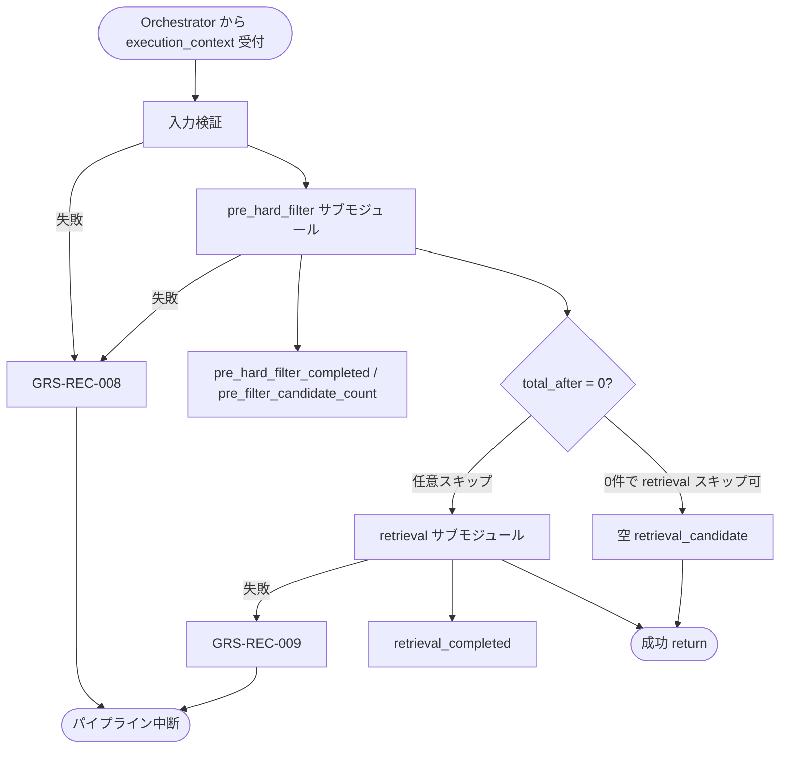

# Candidate Retriever モジュール仕様書

## 1. ドキュメント情報

| 項目           | 内容                                              |
| -------------- | ------------------------------------------------- |
| ドキュメントID | `MOD-RECO-012`                                    |
| ドキュメント名 | Candidate Retriever モジュール仕様書              |
| 対象システム   | Gift Recommendation Service（`apps/reco`）        |
| MVP対象        | `○`                                               |
| 作成日         | 2026-06-30                                        |
| 更新日         | 2026-06-30（`pre_hard_filter` サブモジュール統合） |

---

## 2. 概要

Candidate Retriever（候補商品抽出）は、Reco オンライン推薦パイプラインの **Retrieval フェーズ**において、`MOD-RECO-001` Recommendation Orchestrator から `execution_context` を **1 回**受け取り、内部で **Pre Hard Filter（構造化絞り込み）** と **候補商品抽出（Vector Retrieval）** を順に実行し、`retrieval_candidate` を `execution_context` へ返却するモジュールである。`MOD-RECO-010` Query Embedding Generator 完了後、**`MOD-RECO-013` Post Hard Filter の直前**に Orchestrator から呼び出される。

**設計経緯（`MOD-RECO-011` 廃止）**: 旧 `MOD-RECO-011`（Pre Hard Filter Executor）は独立モジュールとして廃止し、Pre Hard Filter 責務を本モジュール内サブモジュール **`pre_hard_filter`** に統合する（正本: `MOD-RECO-011` 廃止・移行記録、Issue #862 / PR #863）。パイプライン上の **Pre Hard Filter フェーズ**・論理リソース **`pre_filtered_item_pool`**・観測（`pre_hard_filter_completed` / `GRS-REC-008` / `pre_filter_candidate_count`）は **維持**する。

Online 推薦の対象は **DB 取り込み済み item**（Retrieval定義書 §2.2）である。取り込み件数増加を見据え、通過 item を **`uuid[]` としてアプリメモリに全件具体化しない**（§6.2.2）。Filter 条件は **DB predicate push-down** で表現し、Vector 検索 SQL に埋め込む。

---

## 3. 目的

- `apps/reco` における Candidate Retriever（`pre_hard_filter` + `retrieval`）実装・単体テストの前提を定義する
- Orchestrator との I/F（`execution_context` 入出力）、Pre / Retrieval 各フェーズの失敗時パイプライン中断（`GRS-REC-008` / `GRS-REC-009`）を後続実装可能な粒度で整理する
- Recoモジュール一覧・Retrieval定義書・`MOD-RECO-004` / `010` / `013` 仕様書・`MOD-RECO-011` 廃止記録との整合を担保する

---

## 4. モジュール基本情報

| 項目 | 内容 |
| ---- | ---- |
| モジュールID | `MOD-RECO-012` |
| モジュール名 | 候補商品抽出 |
| 物理名 | `Candidate Retriever` |
| 分類 | Retrieval |
| 処理種別 | `OL` |
| 配置予定 | `apps/reco/src/reco/application/candidate-retriever/**` |
| 所属Epic | `MOD-RECO-012`（Epic Issue #864） |
| MVP対象 | `○` |
| 主な呼び出し元 | `MOD-RECO-001` Recommendation Orchestrator |
| 主な呼び出し先 | Item Repository（IF-DB-RECO-004）、Item Embedding 参照 |

### 4.1 サブモジュール構成

| サブモジュール | 配置 | 責務 |
| -------------- | ---- | ---- |
| `pre_hard_filter` | `candidate-retriever/pre-hard-filter/**` | 構造化 Hard Filter・`pre_filtered_item_pool` 生成・Pre フェーズ観測 |
| `retrieval` | `candidate-retriever/retrieval/**` | predicate 適用 Vector 検索・`retrieval_candidate` 生成 |

`MOD-API-*` / `MOD-RECO-*` / `MOD-BATCH-*` 配下の Task では、該当モジュール ID の責務範囲に変更を限定する。`MOD-RECO-*` では `apps/reco/src/reco/api/**` の API-INT エンドポイント層を対象に含めない。

---

## 5. 責務

### 5.1 主責務（モジュール全体）

- `MOD-RECO-010` 完了後、Orchestrator から **1 回**呼び出され、内部で `pre_hard_filter` → `retrieval` を **直列実行**する
- **Pre Hard Filter フェーズ**（サブモジュール `pre_hard_filter`）を実行し、検索対象商品集合を構造化条件で絞り込む（Recoモジュール一覧 §6.11・旧 §6.10 相当）
- **候補商品抽出**（サブモジュール `retrieval`）を実行し、`pre_filtered_item_pool` を対象に Embedding 類似度検索で `retrieval_candidate` を生成する
- `execution_context.pre_filtered_item_pool` および `execution_context.retrieval_candidate` を設定し、`MOD-RECO-013` へ引き渡す
- Pre フェーズ成功時に **`pre_hard_filter_completed` Phase Log** および **`pre_filter_candidate_count`** メトリクスを Orchestrator / `MOD-RECO-028` / `025` 経由で依頼する
- Retrieval フェーズ成功時に **`retrieval_completed` Phase Log**（ログ・Observability設計書）を依頼する
- Pre Filter 失敗時 **`GRS-REC-008`**、Retrieval 失敗時 **`GRS-REC-009`** を Orchestrator へ返却し、パイプライン中断を促す

### 5.2 対象外責務

- `API-INT-002` エンドポイント層
- `MOD-RECO-001` Orchestrator の実行順序制御・Phase Log 契機の物理実装
- **Semantic 抽出・`hard_filter_candidates` 生成**（`MOD-RECO-004` 責務）
- **Query Embedding 生成**（`MOD-RECO-010` 責務）
- **Post Hard Filter**（Semantic NG・avoid・重複。`MOD-RECO-013` 責務）
- **`non_preferred_condition` の Hard Filter 化**（Matching / Ranking。Retrieval §8.5）
- **Fallback による NG / 予算緩和**（Retrieval §15.3）
- **`pre_filtered_item_pool` / `retrieval_candidate` の正本テーブル永続化**
- Phase Log / Error Log の物理書き込み（`MOD-RECO-028` / `029`）
- OpenAPI / DB schema 変更
- **`MOD-RECO-011` 独立モジュール・`pre-hard-filter-executor/**` パッケージの新規作成**（廃止済み）

### 5.3 サブモジュール `pre_hard_filter` の責務

- `execution_context.request.budget` に基づく **予算 Filter**（Retrieval §8.3）
- `execution_context.request.ng_condition` を **primary** とする NG Filter（Recommendation Request定義書 §9）
- `execution_context.semantic_extraction_result.hard_filter_candidates[]` の **merge / dedup**（`MOD-RECO-004` §8.3.5）
- `item.is_active` / `active_status` による **商品有効状態 Filter**
- **availability_filter**・**data_quality_filter**（Retrieval §8.2 / 処理構成定義書 §6.2）
- **`filter_predicate` 組み立て**および **`pre_filtered_item_pool`** 生成（§6.2）
- （任意）`EXISTS` / `COUNT` による **0 件早期確認**（vector 検索スキップ判断。実装 Task で確定）
- **`pre_filter_candidate_count`** の算出・Orchestrator への受け渡し

**`pre_hard_filter` が行わないこと**: pgvector 検索、Semantic NG 照合、`query_embedding` の消費（Filter 判定に使用しない）

### 5.4 サブモジュール `retrieval` の責務

- `pre_filtered_item_pool`（**predicate / handle 参照**）を検索対象とする **Vector Retrieval**（MVP 必須）
- `execution_context.query_embedding.preferred_embedding` と `item_embedding` の類似度検索（`item_embedding` と同一 `model_version_id`）
- **`candidate_limit`** に基づく候補件数制御（Retrieval定義書）
- **`retrieval_candidate`** ドメインオブジェクトの組み立て（`item_id`、類似度、取得根拠等。実装 Task で型定義）
- predicate を Vector 検索 SQL の `WHERE` / subquery に **埋め込む**（§8.3.4）

**MVP 対象外（将来拡張）**: Keyword Retrieval、Hybrid 検索、Context Category Retrieval、Fallback 候補補完（Retrieval §9〜§15。§16 参照）

---

## 6. 入出力

### 6.1 入力（Orchestrator → 本モジュール）

| 入力 | 型 / 構造 | 必須 | 生成元 | 用途 | 備考 |
| ---- | --------- | ---- | ------ | ---- | ---- |
| `execution_context` | パイプライン実行コンテキスト | `true` | `MOD-RECO-001` | 処理起点 | |
| `execution_context.request` | `RecommendationRequest` | `true` | API-INT-002 経由 | 予算・NG | |
| `execution_context.semantic_extraction_result` | Semantic 抽出結果 | `true` | `MOD-RECO-004` | `hard_filter_candidates[]` | |
| `execution_context.query_embedding` | Query Embedding | `true` | `MOD-RECO-010` | Vector 検索 | **Pre Filter では不使用** |
| `execution_context.config_versions` | Config 群 | `true` | `MOD-RECO-003` | Embedding model version | |
| `execution_context.run_id` | `uuid` | `true` | `MOD-RECO-002` | ログ相関 | |

**前提**: `MOD-RECO-002` Run INSERT、`MOD-RECO-004`〜`010` が完了済み（Orchestrator 論理順序 11 まで）。

### 6.2 出力（本モジュール → Orchestrator / 後続）

| 出力 | 型 / 構造 | 利用先 | 用途 | 備考 |
| ---- | --------- | ------ | ---- | ---- |
| `execution_context.pre_filtered_item_pool` | 論理 pool | 内部 `retrieval` / 観測 | Pre Filter 結果 | §6.2.1 |
| `execution_context.retrieval_candidate` | 候補集合 | `MOD-RECO-013` | Post Hard Filter 入力 | 実装 Task で型定義 |
| `pre_filter_candidate_count` | `number` | Orchestrator / `MOD-RECO-025` | Pre 後件数 | 0 件も正常 |
| `reco_error` | 標準化 reco エラー | Orchestrator | 失敗時 | `GRS-REC-008` / `009` |

#### 6.2.1 `pre_filtered_item_pool` 論理構造

| フィールド | 型 | 必須 | 内容 |
| ---------- | -- | ---- | ---- |
| `representation` | enum | `true` | `predicate` / `session_table` / `materialized_ids` |
| `total_before_filter` | `number` | `true` | Filter 前件数 |
| `total_after_filter` | `number` | `true` | Filter 後件数（= `pre_filter_candidate_count`） |
| `filter_summary` | object | `false` | Filter 種別ごとの除外件数 |
| `applied_conditions` | object | `false` | 適用条件サマリ（secret 禁止） |

**`representation`（MVP 本番）**

| 値 | MVP 本番 | 内容 |
| -- | -------- | ---- |
| `predicate` | **第一候補** | `filter_predicate`（§6.2.2） |
| `session_table` | 第二候補 | `session_handle`（Run スコープ一時表） |
| `materialized_ids` | 限定（テスト・閾値以下） | `item_ids[]`。本番前提にしない |

#### 6.2.2 `filter_predicate`（`representation = predicate` 時）

| フィールド | 必須 | 内容 |
| ---------- | ---- | ---- |
| `merged_filter_conditions` | `true` | merge 済み NG / budget 等（§8.3.2） |
| `active_only` | `true` | MVP: `true` 固定 |
| `data_quality_rules` | `false` | URL / 画像必須等 |
| `repository_query_ref` | `false` | infrastructure Query テンプレート ID |

#### 6.2.3 `retrieval_candidate`（MVP 概要）

実装 Task で型定義。論理上は以下を含む。

| フィールド | 必須 | 内容 |
| ---------- | ---- | ---- |
| `candidates[]` | `true` | 候補 item 配列（`candidate_limit` 以下） |
| `candidates[].item_id` | `true` | 商品 ID |
| `candidates[].similarity_score` | `true` | Vector 類似度 |
| `candidates[].retrieval_method` | `false` | MVP: `vector` 固定可 |
| `total_retrieved` | `true` | 取得件数 |

**0 件の扱い**: Pre Filter 後 0 件・Retrieval 0 件とも **モジュールとしては成功**可能。最終 `GRS-REC-001` は Orchestrator 管轄。

---

## 7. 依存関係

### 7.1 依存モジュール

| 依存先 | 方向 | 用途 | 失敗時 | 備考 |
| ------ | ---- | ---- | ------ | ---- |
| `MOD-RECO-001` | 被呼び出し | Retrieval フェーズ契機 | — | `010` 直後・`013` 直前 |
| `MOD-RECO-004` | 間接 | `hard_filter_candidates[]` | 未到達 | merge 参照 |
| `MOD-RECO-010` | 間接 | `query_embedding` | 未到達 | retrieval のみ使用 |
| Item Repository（IF-DB-RECO-004） | 呼び出し | Filter / Vector 検索 | `008` / `009` | |
| `MOD-RECO-028` / `025` / `024` | 間接 | 観測・エラー | — | Orchestrator 経由 |

**下位利用**: `MOD-RECO-013` が `retrieval_candidate` を入力とする。

### 7.2 参照データ

| データ | 参照元 | 用途 |
| ------ | ------ | ---- |
| `item` | DB | 価格・有効状態・名称等 |
| `item_image` | DB | 画像有無 |
| `item_embedding` | DB | Vector 検索 |
| `external_genre` | DB（任意） | NG カテゴリ |

---

## 8. 処理仕様

### 8.1 処理フロー（モジュール全体）



### 8.2 処理ステップ

| No | 処理 | サブモジュール | 入力 | 出力 |
| --: | ---- | -------------- | ---- | ---- |
| 1 | 入力検証 | モジュール入口 | `execution_context` | — |
| 2 | Filter 条件 merge | `pre_hard_filter` | `request.ng`, `hard_filter_candidates[]` | `merged_filter_conditions` |
| 3 | `filter_predicate` 組み立て | `pre_hard_filter` | merged 条件 | `filter_predicate` |
| 4 | 件数集計（任意） | `pre_hard_filter` | predicate | `total_before/after` |
| 5 | `pre_filtered_item_pool` 生成 | `pre_hard_filter` | 上記 | pool（`representation`） |
| 6 | Pre フェーズ観測 | `pre_hard_filter` | `total_after` | Phase / Metric 依頼 |
| 7 | Vector 検索 SQL 組み立て | `retrieval` | pool + `query_embedding` | DB Query |
| 8 | 候補取得 | `retrieval` | Query 結果 | `retrieval_candidate` |
| 9 | Retrieval フェーズ観測 | `retrieval` | 成功 | `retrieval_completed` 依頼 |
| 10 | 結果返却 | モジュール出口 | 上記 | `execution_context` 更新 |

**Orchestrator 呼び出し順序（移行後・確定）**

```text
… → MOD-RECO-010 → MOD-RECO-012（内部: pre_hard_filter → retrieval）→ MOD-RECO-013 → …
```

**暫定整合**: MOD-RECO-001 仕様書 §8.2.1 は Step 4（横断 docs Task）完了まで旧記述（`011`→`012` 分離）が残る。実装判断は本仕様書を正とする。

#### 8.2.1 Filter 適用順（`pre_hard_filter`・正本: Retrieval §8.6）

1. `active_item_filter` → 2. `availability_filter` → 3. `budget_filter` → 4. `ng_category_filter` → 5. `ng_keyword_filter` → 6. `data_quality_filter` → 7. `duplicate_item_filter`（MVP 簡易可）

### 8.3 アルゴリズム / 計算仕様

#### 8.3.1 budget_filter（MVP）

| 条件 | 処理 |
| ---- | ---- |
| `budgetMin` のみ | `item.price >= budgetMin` |
| `budgetMax` のみ | `item.price <= budgetMax` |
| 両方 | 範囲内 |
| 両方未指定 | スキップ |
| 価格不明 | **原則除外** |

#### 8.3.2 NG 条件 merge

| 優先 | ソース | 扱い |
| --: | ------ | ---- |
| 1 | `request.ng_condition` | **primary** |
| 2 | `hard_filter_candidates[]` | merge / dedup |

競合時は 1 件に統合。`non_preferred_condition` は対象外。

#### 8.3.3 Pre / Post Hard Filter 境界

| 観点 | `pre_hard_filter`（本モジュール内） | `MOD-RECO-013` |
| ---- | ----------------------------------- | -------------- |
| タイミング | Retrieval 前 | Retrieval 後 |
| 主目的 | 性能 + 構造化 NG | Semantic NG・avoid・重複 |
| Semantic NG | **扱わない** | **扱う** |

#### 8.3.4 Vector Retrieval（MVP・`retrieval`）

```text
SELECT item_id, embedding <=> :query_vector AS similarity
FROM item_embedding
JOIN item ON ...
WHERE <filter_predicate>
ORDER BY similarity
LIMIT :candidate_limit
```

- `filter_predicate` は `pre_hard_filter` が組み立てたものを **同一 Query 内**で再利用する
- 全 item の in-memory 列挙・百万件 `IN (...)` 展開を **前提にしない**
- `candidate_limit` は内部取得件数（Retrieval定義書。`top_k` との分離は Orchestrator / 下位で維持）

#### 8.3.5 Orchestrator Port 契約（MVP）

| 項目 | 内容 |
| ---- | ---- |
| 呼び出し | `retrieve_candidates(execution_context) -> execution_context`（名称は実装 Task で確定） |
| 成功 | `pre_filtered_item_pool` および `retrieval_candidate` が設定される |
| Pre 失敗 | `GRS-REC-008`。`013` 以降は呼ばれない |
| Retrieval 失敗 | `GRS-REC-009`。同上 |
| Phase Log | Pre: `pre_hard_filter_completed`、Retrieval: `retrieval_completed` |

---

## 9. データ項目マッピング

| 入力項目 | 内部項目 | 出力項目 | 変換 |
| -------- | -------- | -------- | ---- |
| `request.budget` | `filter_predicate` | `pre_filtered_item_pool` | 価格述語 |
| `request.ng_condition` + `hard_filter_candidates[]` | `filter_predicate` | 同上 | merge 後述語 |
| `filter_predicate` + `query_embedding` | Vector SQL | `retrieval_candidate` | 類似度検索 |
| `COUNT(*)` after filter | — | `pre_filter_candidate_count` | 件数 |

---

## 10. 状態・例外

### 10.1 状態

本モジュールは **ステートレス**（Run 内 1 回呼び出し）。

### 10.2 例外

| 例外 | Error Code | 発生フェーズ | 発生条件 | 返却 |
| ---- | ---------- | ------------ | -------- | ---- |
| Pre Hard Filter 失敗 | `GRS-REC-008` | `pre_hard_filter` | 入力検証失敗・predicate 組み立て不能・DB 失敗 | 500・中断 |
| Retrieval 失敗 | `GRS-REC-009` | `retrieval` | Vector 検索失敗・DB 失敗 | 500・中断 |
| 候補 0 件 | — | 両フェーズ | 全除外 or 検索 0 件 | **成功**。後続へ |

**リトライ**: モジュール内自動リトライ **なし**（MVP）。**Fallback による NG / 予算緩和禁止**。

---

## 11. DB / 永続化

### 11.1 書き込み

| テーブル | 操作 | 備考 |
| -------- | ---- | ---- |
| 正本テーブル（`item` 等） | **なし** | Online 中 UPDATE 禁止 |
| Run スコープ一時表 | INSERT（任意） | `representation = session_table` 時のみ |

### 11.2 読み取り

| テーブル | 操作 | 用途 |
| -------- | ---- | ---- |
| `item` | SELECT / COUNT | Filter・join |
| `item_image` | SELECT / EXISTS | data quality |
| `item_embedding` | SELECT（vector） | Retrieval |

**方針**: Filter と Retrieval は **DB predicate push-down** を第一候補とする（§8.3.4）。

---

## 12. ログ・メトリクス

| 種別 | 内容 | タイミング | サブフェーズ |
| ---- | ---- | ---------- | ------------ |
| Phase Log | `pre_hard_filter_completed` | Pre 成功 | `pre_hard_filter` |
| Phase Log | `retrieval_completed` | Retrieval 成功 | `retrieval` |
| Metric | `pre_filter_candidate_count` | Pre 成功 | `pre_hard_filter` |
| Error Log | `GRS-REC-008` / `009` | 失敗時 | 各サブモジュール |

### 12.1 メトリクス（Pre フェーズ）

| Metric | 内容 | 集計単位 |
| ------ | ---- | -------- |
| `pre_filter_candidate_count` | Pre Filter 後候補数 | Run |
| `pre_hard_filter_latency_ms` | Pre 処理時間 | Run |
| `pre_hard_filter_exclusion_rate` | 除外率 | Run |

Retrieval 系メトリクス（`retrieval_candidate_count` 等）は実装 Task / Observability 設計書と整合させる（§16）。

---

## 13. 性能・非機能

| 観点 | 方針 |
| ---- | ---- |
| レイテンシ | モジュール単体 hard timeout は設けない。Retrieval 一括（`012`+`013`）**hard 1,000ms** 上位ガード（MOD-RECO-001 §13.2） |
| 計算量 | Filter / Retrieval とも DB 内評価。`uuid[]` 全件メモリ保持は本番前提にしない |
| リトライ | なし |
| キャッシュ | Run 横断 item キャッシュなし（MVP） |
| 0 件早期打ち切り | `total_after_filter = 0` 時に vector 検索をスキップしてよい（実装 Task で確定） |

---

## 14. テスト観点

### 14.1 `pre_hard_filter` 単体

| No | 観点 | 確認内容 | 種別 |
| --: | ---- | -------- | ---- |
| 1 | budget / ng / active | 各 Filter が predicate に反映される | unit |
| 2 | merge | `request.ng` primary + candidates dedup | unit |
| 3 | 0 件 Pre | 成功・`GRS-REC-008` にならない | unit |
| 4 | predicate 表現 | 本番経路で `representation = predicate` | unit |
| 5 | non_preferred 除外 | Hard Filter されない | unit |
| 6 | query_embedding 非依存 | Filter 結果に embedding が影響しない | unit |

### 14.2 `retrieval` 単体

| No | 観点 | 確認内容 | 種別 |
| --: | ---- | -------- | ---- |
| 7 | Vector 正常系 | predicate 適用下で類似度順に取得 | unit |
| 8 | candidate_limit | 上限件数が守られる | unit |
| 9 | model_version | `query_embedding` と `item_embedding` の version 整合 | unit |
| 10 | DB 失敗 | `GRS-REC-009` | unit |

### 14.3 モジュール結合・Orchestrator

| No | 観点 | 確認内容 | 種別 |
| --: | ---- | -------- | ---- |
| 11 | 内部順序 | `pre_hard_filter` → `retrieval` の順 | unit / integration |
| 12 | Phase Log | `pre_hard_filter_completed` が Pre 後に依頼される | integration |
| 13 | Metric | `pre_filter_candidate_count` が設定される | unit |
| 14 | Orchestrator | `010` 後に 1 回呼び出し・失敗時 `013` 未到達 | integration |
| 15 | ログ | `trace_id` あり・secret なし | unit |

---

## 15. 変更管理

### 15.1 変更履歴

| 日付 | 変更内容 | 関連 Issue / PR |
| ---- | -------- | --------------- |
| 2026-06-30 | 初版作成（`pre_hard_filter` 統合版） | Issue #865 |
| 2026-06-30 | §16 未決事項テーブルを module-spec テンプレート列に整合（AI Review 指摘対応） | PR #866 |

---

## 16. 未決事項

| No | 論点 | 判断が必要な理由 | 判断者 | 期限 | 備考 |
| --: | ---- | ---------------- | ------ | ---- | ---- |
| 1 | `materialized_ids` 閾値 | テスト用小規模 materialize の上限が未確定 | Human + Worker | 実装 Task 起票前 | predicate 第一候補との併用方針 |
| 2 | NG キーワード正規化 | Filter predicate 生成の前提が未確定 | Human | 実装 Task 起票前 | 実装 Task 前 |
| 3 | `availability_filter` MVP 判定 | `active_status` との整合方針が未確定 | Human | 実装 Task 起票前 | `active_status` 整合 |
| 4 | `session_table` 採用条件 | predicate のみで足りるかの判断が必要 | Human + Worker | 実装 Task 起票前 | 実装着手前に Human 判断推奨 |
| 5 | `candidate_limit` 既定値 | Retrieval定義書・API との整合が未確定 | Human | 実装 Task 起票前 | 実装着手前に Human 判断推奨 |
| 6 | Retrieval 系 Metric 名 | Observability 設計書との命名整合が未確定 | Worker | 実装 Task 中 | Observability 設計書 |
| 7 | 0 件時の retrieval スキップ | 性能と観測のトレードオフが未確定 | Worker | 実装 Task 中 | 性能 vs 観測のトレードオフ |

### 16.1 確定済み論点

| No | 論点 | 確定内容 |
| --: | ---- | -------- |
| 1 | `MOD-RECO-011` | **廃止**。`pre_hard_filter` に統合（#862 / #863） |
| 2 | Orchestrator 呼び出し | **`010` 後に `012` を 1 回** |
| 3 | Pre 観測 | `pre_hard_filter_completed` / `GRS-REC-008` / `pre_filter_candidate_count` **維持** |
| 4 | Retrieval 失敗 | `GRS-REC-009` |
| 5 | pool 物理表現 | 本番 **`predicate` 第一候補** |
| 6 | 配置 | `candidate-retriever/pre-hard-filter/**` |

---

## 17. 関連資料

| 種別 | パス | 用途 |
| ---- | ---- | ---- |
| 011 廃止記録 | `docs/06_実装設計/reco/MOD-RECO-011_Pre Hard Filter Executorモジュール仕様書.md` | 設計経緯・移管元 |
| Recoモジュール一覧 | `docs/05_アプリケーション設計/アプリ/reco/Recoモジュール一覧.md` | §6.11 |
| Retrieval定義書 | `docs/04_ドメインモデル設計/Retrieval定義書.md` | Hard Filter・Vector |
| MOD-RECO-001 | `docs/06_実装設計/reco/MOD-RECO-001_Recommendation Orchestratorモジュール仕様書.md` | 呼び出し（Step 4 で更新） |
| MOD-RECO-004 / 010 / 013 | `docs/06_実装設計/reco/` 配下 | 境界 |
| エラーコード定義書 | `docs/05_アプリケーション設計/アプリ/エラーコード定義書.md` | `008` / `009` |
| Epic Definition | `prompts/definitions/epics/mod-reco-012-candidate-retriever/epic.yaml` | allowed_paths |

---

## 18. レビュー観点

- Recoモジュール一覧 §6.11 のモジュール名・分類と矛盾しない（§6.10 の 011 行は Step 4 まで暫定）
- `pre_hard_filter` / `retrieval` の責務境界が明確
- `MOD-RECO-011` 廃止記録（#863）と整合
- Orchestrator **1 呼び出し**・`GRS-REC-008` / `009` の切り分けが明確
- `pre_filtered_item_pool` が predicate 中心で、本番 `uuid[]` 全件具体化を前提にしていない
- `010` / `004` / `013` との境界が明確
- 後続実装可能な粒度のテスト観点がある
- secret が含まれていない

---

## 19. 備考

- 本仕様書は **`MOD-RECO-012` 実装の正本**である。旧 `MOD-RECO-011` モジュール仕様書案の技術詳細は本書へ移管済み
- Keyword / Hybrid / Fallback Retrieval は MVP 外（Retrieval定義書。別 Task で拡張）
- Item Repository の concrete Query・索引は infrastructure / 実装 Task の scope
- 横断 docs（Recoモジュール一覧・MOD-RECO-001 等）の `011` 記述更新は **Step 4** の scope
