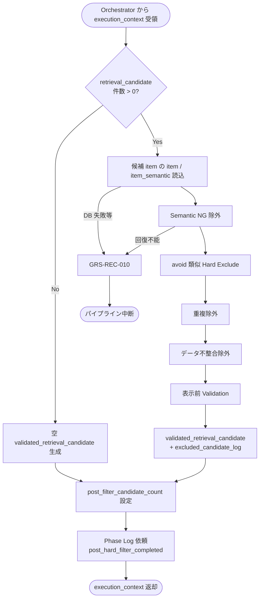

# Post Hard Filter Executor モジュール仕様書

## 1. ドキュメント情報

| 項目           | 内容                                              |
| -------------- | ------------------------------------------------- |
| ドキュメントID | `MOD-RECO-013`                                    |
| ドキュメント名 | Post Hard Filter Executor モジュール仕様書        |
| 対象システム   | Gift Recommendation Service（`apps/reco`）        |
| MVP対象        | `○`                                               |
| 作成日         | 2026-07-01                                        |
| 更新日         | 2026-07-01                                        |

---

## 2. 概要

Post Hard Filter Executor（Post Hard Filter）は、Reco オンライン推薦パイプラインの **Retrieval フェーズ後段**において、`MOD-RECO-001` Recommendation Orchestrator から `execution_context` を **1 回**受け取り、`MOD-RECO-012` Candidate Retriever が生成した `retrieval_candidate` に対して **意味的除外・重複排除・表示前 Validation** を適用し、`validated_retrieval_candidate` を `execution_context` へ返却するモジュールである。`MOD-RECO-012` 完了後、**`MOD-RECO-014` Feature Matcher の直前**に Orchestrator から呼び出される。

Pre Hard Filter（`MOD-RECO-012` 内 `pre_hard_filter`）では判定しきれない **Semantic NG**、**avoid 類似**、Retrieval 後に初めて確認すべき **重複・データ不整合** を扱う（Recoモジュール一覧 §6.12、処理構成定義書 §6.4、Retrieval定義書 §8.1）。

**命名注記**: Recoモジュール一覧 §5.2 / §8.1 のデータフローでは `validated_candidate` と略記される。本仕様書および正本定義表・処理構成定義書では論理リソース名 **`validated_retrieval_candidate`** を正とし、`execution_context` 上のフィールド名は実装 Task で確定する（§6.2）。

---

## 3. 目的

- `apps/reco` における Post Hard Filter Executor 実装・単体テストの前提を定義する
- Orchestrator との I/F（`execution_context` 入出力）、失敗時のパイプライン中断（`GRS-REC-010`）を後続実装可能な粒度で整理する
- Pre Hard Filter（`MOD-RECO-012`）との責務境界、Semantic 系入力（`MOD-RECO-004`）との関係を明確化する
- Recoモジュール一覧・Retrieval定義書・`MOD-RECO-001` / `012` / `004` 仕様書との整合を担保する

---

## 4. モジュール基本情報

| 項目 | 内容 |
| ---- | ---- |
| モジュールID | `MOD-RECO-013` |
| モジュール名 | Post Hard Filter |
| 物理名 | `Post Hard Filter Executor` |
| 分類 | Retrieval |
| 処理種別 | `OL` |
| 配置予定 | `apps/reco/src/reco/application/post-hard-filter-executor/**` |
| 所属Epic | `MOD-RECO-013`（Epic Issue #876） |
| MVP対象 | `○` |
| 主な呼び出し元 | `MOD-RECO-001` Recommendation Orchestrator |
| 主な呼び出し先 | Item Repository（IF-DB-RECO-004）、Item Semantic 参照 |

`MOD-API-*` / `MOD-RECO-*` / `MOD-BATCH-*` 配下の Task では、該当モジュール ID の責務範囲に変更を限定する。`MOD-RECO-*` では `apps/reco/src/reco/api/**` の API-INT エンドポイント層を対象に含めない。

---

## 5. 責務

### 5.1 主責務

- `MOD-RECO-012` 完了後、Orchestrator から **1 回**呼び出され、`retrieval_candidate` を入力として Post Hard Filter を実行する
- **Semantic NG 照合**: `semantic_extraction_result.concepts[]` のうち `input_intent = ng_candidate` と `item_semantic` を照合し、該当候補を除外する（`MOD-RECO-004` §8.3.5。構造化 `ng_condition` の primary 判定は Pre 側）
- **avoid 類似確認**: `input_intent = avoid` の User Concept と `item_semantic` の類似度が **Hard Exclude 閾値**以上の候補を除外する（§8.3.2。閾値は §16 参照）
- **重複候補除外**: `retrieval_candidate` 内の同一 `item_id`（および MVP で定義する同一商品キー）の重複を排除する（Retrieval §8.2 `duplicate_item_filter` の Retrieval 後適用）
- **データ不整合確認**: 候補 item の必須参照データ欠落（例: `item_semantic` 不在、`item` 行不整合）を検知し、方針に従い除外または `GRS-REC-010` とする（§8.3.4）
- **表示前 Validation**: Matching / Result 表示に必要な最低限属性（名称・画像・有効状態等）を再確認し、不適格候補を除外する（処理構成定義書 §6.4）
- `execution_context.validated_retrieval_candidate` および **`excluded_candidate_log`**（除外理由サマリ）を設定し、`MOD-RECO-014` へ引き渡す
- 成功時に **`post_hard_filter_completed` Phase Log** および **`post_filter_candidate_count`** メトリクスを Orchestrator / `MOD-RECO-028` / `025` 経由で依頼する
- 回復不能失敗時 **`GRS-REC-010`** を Orchestrator へ返却し、パイプライン中断を促す

### 5.2 対象外責務

- `API-INT-002` エンドポイント層
- `MOD-RECO-001` Orchestrator の実行順序制御・Phase Log 契機の物理実装
- **Pre Hard Filter**（予算・構造化 NG・active 等。`MOD-RECO-012` 内 `pre_hard_filter` 責務）
- **Semantic 抽出・`hard_filter_candidates` 生成**（`MOD-RECO-004` 責務）
- **候補商品抽出（Vector Retrieval）**（`MOD-RECO-012` 内 `retrieval` 責務）
- **`non_preferred_condition` の一般 avoid 減点**（Matching / Ranking 責務。Post では **Hard Exclude 閾値超過時のみ**除外）
- **Matching / Ranking スコア計算**（`MOD-RECO-014` 以降）
- **Fallback による NG / 予算 / avoid 条件の緩和**（Retrieval §15.3）
- **`validated_retrieval_candidate` / `excluded_candidate_log` の正本テーブル永続化**（MVP では Run 内メモリ。DB 永続は別 Task）
- Phase Log / Error Log の物理書き込み（`MOD-RECO-028` / `029`）
- OpenAPI / DB schema 変更
- `item_semantic` / `item_feature` の生成・更新（batch 責務）

---

## 6. 入出力

### 6.1 入力（Orchestrator → 本モジュール）

| 入力 | 型 / 構造 | 必須 | 生成元 | 用途 | 備考 |
| ---- | --------- | ---- | ------ | ---- | ---- |
| `execution_context` | パイプライン実行コンテキスト | `true` | `MOD-RECO-001` | 処理起点 | |
| `execution_context.retrieval_candidate` | 候補集合 | `true` | `MOD-RECO-012` | Filter 対象 | §6.2.1 |
| `execution_context.semantic_extraction_result` | Semantic 抽出結果 | `true` | `MOD-RECO-004` | NG / avoid Concept | `concepts[]` |
| `execution_context.request` | `RecommendationRequest` | `true` | API-INT-002 経由 | 文脈・trace | Post では primary NG 再適用しない |
| `execution_context.config_versions` | Config 群 | `true` | `MOD-RECO-003` | `semantic_config_version_id` | item_semantic 参照 |
| `execution_context.run_id` | `uuid` | `true` | `MOD-RECO-002` | ログ相関 | |
| `item_semantic`（DB） | 行 / JSON | 条件付き | batch（BATCH-010） | Semantic NG / avoid 照合 | 候補ごと SELECT |

**前提**: `MOD-RECO-002` Run INSERT、`MOD-RECO-004`〜`012` が完了済み（Orchestrator 論理順序 12 まで）。

**空入力**: `retrieval_candidate.total_retrieved = 0` の場合、Filter 処理は **スキップ可能**（空 `validated_retrieval_candidate` を返却し **成功**とする。`GRS-REC-010` にしない）。

### 6.2 出力（本モジュール → Orchestrator / 後続）

| 出力 | 型 / 構造 | 利用先 | 用途 | 備考 |
| ---- | --------- | ------ | ---- | ---- |
| `execution_context.validated_retrieval_candidate` | 候補集合 | `MOD-RECO-014` | Matching 入力 | §6.2.2 |
| `execution_context.excluded_candidate_log` | 除外ログ | 観測 / 評価 | 除外理由 | §6.2.3 |
| `post_filter_candidate_count` | `number` | Orchestrator / `MOD-RECO-025` | Post 後件数 | 0 件も正常 |
| `reco_error` | 標準化 reco エラー | Orchestrator | 失敗時 | `GRS-REC-010` |

#### 6.2.1 `retrieval_candidate`（入力・参照）

`MOD-RECO-012` モジュール仕様書 §6.2.3 を正とする。本モジュールは **読み取りのみ**（変更しない）。

#### 6.2.2 `validated_retrieval_candidate`（MVP 概要）

実装 Task で型定義。論理上は以下を含む。

| フィールド | 必須 | 内容 |
| ---------- | ---- | ---- |
| `candidates[]` | `true` | Post Filter 通過候補（元順序または類似度順を維持） |
| `candidates[].item_id` | `true` | 商品 ID |
| `candidates[].similarity_score` | `true` | Retrieval 類似度（入力から引き継ぎ） |
| `candidates[].validation_status` | `false` | MVP: `passed` 固定可 |
| `total_validated` | `true` | 通過件数（= `post_filter_candidate_count`） |
| `total_excluded` | `true` | 除外件数 |

**0 件の扱い**: 全候補除外・入力 0 件とも **モジュールとしては成功**可能。最終 `GRS-REC-001`（推薦候補 0 件）は Orchestrator 管轄。

#### 6.2.3 `excluded_candidate_log`（MVP 概要）

| フィールド | 必須 | 内容 |
| ---------- | ---- | ---- |
| `entries[]` | `false` | 除外レコード（MVP ではサマリのみでも可） |
| `entries[].item_id` | `true` | 除外された item |
| `entries[].reason_code` | `true` | 除外理由コード（§8.3） |
| `entries[].reason_detail` | `false` | マスキング済み詳細（secret 禁止） |
| `summary_by_reason` | `false` | 理由別件数 |

正本区分は Log（正本定義表 §5.10.2）。MVP では **Run 内メモリ**に保持し、Orchestrator / Metric Logger 経由で観測可能にする。DB テーブル永続は **MVP 対象外（△）**（リソース一覧）。

---

## 7. 依存関係

### 7.1 依存モジュール

| 依存先 | 方向 | 用途 | 失敗時 | 備考 |
| ------ | ---- | ---- | ------ | ---- |
| `MOD-RECO-001` | 被呼び出し | Retrieval 後段契機 | — | `012` 直後・`014` 直前 |
| `MOD-RECO-012` | 間接 | `retrieval_candidate` | 未到達 | 入力正本 |
| `MOD-RECO-004` | 間接 | `concepts[]` | 未到達 | NG / avoid |
| Item Repository（IF-DB-RECO-004） | 呼び出し | `item` / `item_semantic` 参照 | `GRS-REC-010` | |
| `MOD-RECO-028` / `025` / `024` | 間接 | 観測・エラー | — | Orchestrator 経由 |

**下位利用**: `MOD-RECO-014` Feature Matcher が `validated_retrieval_candidate` を入力とする。

### 7.2 参照データ

| データ | 参照元 | 用途 | version / config | 備考 |
| ------ | ------ | ---- | ---------------- | ---- |
| `item` | DB | 表示前 Validation・有効状態再確認 | — | SELECT のみ |
| `item_semantic` | DB | Semantic NG / avoid 照合 | `semantic_config_version_id` | SELECT のみ |
| `item_image` | DB | 表示前 Validation | — | EXISTS 等 |
| `semantic_concept` | DB（間接） | Concept コード解決 | config 配下 | ルール参照 |

Online 推薦中に `item_semantic` を **更新しない**（item_semantic テーブル定義書 §5.2）。

---

## 8. 処理仕様

### 8.1 処理フロー

### 8.2 処理ステップ

| No | 処理 | 入力 | 出力 | 補足 |
| --: | ---- | ---- | ---- | ---- |
| 1 | 入力検証 | `execution_context` | — | `retrieval_candidate` 必須。0 件は Step 2 へ |
| 2 | 参照データ読込 | `candidates[].item_id` | item / item_semantic | バッチ SELECT 推奨 |
| 3 | Semantic NG 除外 | `concepts[]`（`ng_candidate`）+ item_semantic | 中間候補 | §8.3.1 |
| 4 | avoid Hard Exclude | `concepts[]`（`avoid`）+ item_semantic | 中間候補 | §8.3.2 |
| 5 | 重複除外 | 中間候補 | 中間候補 | §8.3.3 |
| 6 | データ不整合除外 | item 整合性 | 中間候補 | §8.3.4 |
| 7 | 表示前 Validation | item / item_image | `validated_retrieval_candidate` | §8.3.5 |
| 8 | 除外ログ組立 | 各 Step の除外 | `excluded_candidate_log` | |
| 9 | 観測値設定 | 通過件数 | `post_filter_candidate_count` | Orchestrator へ |

**Filter 適用順（MVP）**: Semantic NG → avoid Hard Exclude → duplicate → inconsistency → display validation。同一候補が複数理由で除外される場合、**最初にヒットした理由**を `excluded_candidate_log` に記録する。

### 8.3 アルゴリズム / 計算仕様

Post Hard Filter は **候補集合の絞り込み**のみを行い、Matching / Ranking スコアは算出しない。

#### 8.3.1 Semantic NG 照合

| 項目 | 内容 |
| ---- | ---- |
| 入力 Concept | `semantic_extraction_result.concepts[]` のうち `input_intent = ng_candidate` |
| 照合先 | 候補 item の `item_semantic.semantic_json`（同一 `semantic_config_version_id`） |
| 判定 | Concept コード / ルールに基づき item が NG に該当する場合 **除外** |
| Pre との境界 | 構造化 `request.ng_condition` の primary 判定は **`MOD-RECO-012` pre_hard_filter**。本 Step は **Semantic 化された NG**（`004` 出力）を対象 |

#### 8.3.2 avoid 類似 Hard Exclude

| 項目 | 内容 |
| ---- | ---- |
| 入力 Concept | `concepts[]` のうち `input_intent = avoid`（`non_preferred_condition` 由来） |
| 照合先 | `item_semantic` |
| 類似度 | Concept–Item Semantic 間の類似度（実装 Task で方式確定。Embedding / Concept 一致等） |
| Hard Exclude | 類似度 **≥ hard_exclude_threshold** の候補を **除外** |
| Matching との境界 | 閾値未満の avoid 近傍は **除外せず** `MOD-RECO-014` 以降へ（Matching / Ranking で減点） |

**`hard_exclude_threshold`**: §16 No.1 で Human 判断。暫定参照として Reason生成定義書の `avoid_similarity >= 0.60` は **Reason 補足用**であり、Hard Exclude 閾値の正本ではない。

#### 8.3.3 重複除外

| 項目 | 内容 |
| ---- | ---- |
| 対象 | `retrieval_candidate.candidates[]` |
| キー | MVP: **`item_id` 単位**で一意化（Retrieval §8.2 `duplicate_item_filter`） |
| 順序 | 先勝ち（Retrieval 類似度順を維持。重複は除外ログに記録） |

#### 8.3.4 データ不整合

| 不整合 | MVP 方針 |
| ------ | -------- |
| `item` 行不存在 | **除外** + warn ログ |
| `item_semantic` 不在（NG / avoid 照合が必要な Run） | **除外**（照合不能） |
| `item_semantic` 不在（User 側 NG / avoid Concept 0 件） | Validation のみ実施（照合スキップ可） |
| `semantic_config_version_id` 不一致 | **除外** |
| Pre 通過後の active 失効 | **除外**（表示前 Validation） |
| 参照 DB 障害 | **`GRS-REC-010`**（パイプライン中断） |

#### 8.3.5 表示前 Validation（MVP）

| 確認項目 | 内容 |
| -------- | ---- |
| 商品名称 | 空文字・欠落を除外 |
| 画像 | `item_image` が 1 件以上（data quality。`012` pre 側と整合） |
| 有効状態 | `is_active = true` かつ `active_status = 'active'` |
| 価格 | 価格不明 item は **除外**（Retrieval §8.3 注意点と整合） |

#### 8.3.6 Pre / Post Hard Filter 境界

| 観点 | `MOD-RECO-012`（`pre_hard_filter`） | 本モジュール（`MOD-RECO-013`） |
| ---- | ----------------------------------- | ------------------------------ |
| タイミング | Retrieval **前** | Retrieval **後** |
| 主目的 | 性能 + 構造化 NG / 予算 / active | Semantic NG・avoid Hard Exclude・重複・表示前 Validation |
| `ng_condition`（構造化） | **primary** | 再適用 **しない** |
| Semantic NG（`ng_candidate`） | **扱わない** | **扱う** |
| `non_preferred`（avoid） | Hard Filter **しない** | **Hard Exclude 閾値超過時のみ**除外 |
| duplicate | MVP: pre 側では省略可 | **Retrieval 後に実施** |

#### 8.3.7 Orchestrator Port 契約（MVP）

| 項目 | 内容 |
| ---- | ---- |
| 呼び出し | `apply_post_hard_filter(execution_context) -> execution_context`（名称は実装 Task で確定） |
| 成功 | `validated_retrieval_candidate` / `excluded_candidate_log` / `post_filter_candidate_count` が設定される |
| 失敗 | `GRS-REC-010`。`014` 以降は呼ばれない |
| Phase Log | `post_hard_filter_completed` |
| Wiring | Retrieval フェーズ（`012`〜`013`）は **未配線（スタブ）**（MOD-RECO-001 §8.4.2） |

---

## 9. データ項目マッピング

| 入力項目 | 内部項目 | 出力項目 | 変換内容 | 備考 |
| -------- | -------- | -------- | -------- | ---- |
| `retrieval_candidate.candidates[]` | 各 Filter Step | `validated_retrieval_candidate.candidates[]` | 除外・重複排除 | 類似度引き継ぎ |
| `semantic_extraction_result.concepts[]` | NG / avoid 判定 | `excluded_candidate_log` | 理由コード付与 | |
| `item_semantic.semantic_json` | Concept 照合 | — | 読み取りのみ | |
| — | 通過件数 | `post_filter_candidate_count` | COUNT | Metric 用 |

---

## 10. 状態・例外

### 10.1 状態

本モジュールは **ステートレス**（Run 内 1 回呼び出し）。

| 状態 | 意味 | 遷移条件 | 記録先 |
| ---- | ---- | -------- | ------ |
| — | モジュール内部状態なし | — | — |

### 10.2 例外

| 例外 | Error Code | 発生条件 | 呼び出し元への返却 | ログ |
| ---- | ---------- | -------- | ------------------ | ---- |
| Post Hard Filter 失敗 | `GRS-REC-010` | 入力検証失敗・DB 参照不能・内部エラー | 500 系・中断 | Error Log + Phase failed |
| 候補 0 件（入力 / 出力） | — | 入力 0 件 or 全除外 | **成功**。後続へ | `post_filter_candidate_count = 0` |

**リトライ**: モジュール内自動リトライ **なし**（MVP）。**Fallback による条件緩和禁止**（Retrieval §15.3）。

Error Code の正本はエラーコード定義書。Orchestrator は `MOD-RECO-024` 経由で標準化結果を呼び出し元へ伝播する。

---

## 11. DB / 永続化

### 11.1 書き込み

| テーブル | 操作 | 備考 |
| -------- | ---- | ---- |
| 正本テーブル（`item` / `item_semantic` 等） | **なし** | Online 中 UPDATE 禁止 |
| `excluded_candidate_log` 永続 | **MVP なし** | Run 内メモリ。将来 Task で検討 |

### 11.2 読み取り

| テーブル | 操作 | 用途 |
| -------- | ---- | ---- |
| `item` | SELECT | Validation・有効状態 |
| `item_semantic` | SELECT | Semantic NG / avoid |
| `item_image` | SELECT / EXISTS | 表示前 Validation |

**方針**: 候補 `item_id` 集合に対する **バッチ SELECT** を第一候補とし、候補件数は `candidate_limit` 上限（通常 50〜100）である。

---

## 12. ログ・メトリクス

| 種別 | 内容 | タイミング | 保存先 | 備考 |
| ---- | ---- | ---------- | ------ | ---- |
| Phase Log | `post_hard_filter_completed` | 成功 | `phase_log`（`MOD-RECO-028`） | ログ・Observability設計書 §10.3 |
| Metric | `post_filter_candidate_count` | 成功 | Metric Logger | §12.1 |
| Error Log | `GRS-REC-010` | 失敗 | `error_log`（`MOD-RECO-029`） | |

### 12.1 メトリクス

| Metric | 内容 | 集計単位 | 用途 |
| ------ | ---- | -------- | ---- |
| `post_filter_candidate_count` | Post Filter 後候補数 | Run | 候補数推移（§11.3） |
| `post_hard_filter_latency_ms` | Post 処理時間 | Run | 性能監視 |
| `post_hard_filter_exclusion_count` | 除外件数 | Run | 品質調査（任意） |

`post_hard_filter_exclusion_rate` は MVP では **記録しない**（Pre 側と同様 Post-MVP 検討）。

---

## 13. 性能・非機能

| 観点 | 方針 |
| ---- | ---- |
| レイテンシ | モジュール単体 hard timeout は設けない。Retrieval 一括（`012`+`013`）**hard 1,000ms** 上位ガード（MOD-RECO-001 §13.2） |
| 計算量 | 候補件数 O(n)。n ≤ `candidate_limit`。item 参照はバッチ化 |
| タイムアウト | 上位 Orchestrator / DB 接続タイムアウトに従う |
| リトライ | なし |
| キャッシュ | Run 横断 item キャッシュなし（MVP） |
| 並列実行 | 同一 Run 内 1 回・同期実行 |
| 0 件早期終了 | 入力 0 件時は Filter スキップ。空 output + Phase Log 維持 |

---

## 14. テスト観点

| No | 観点 | 確認内容 | 種別 |
| --: | ---- | -------- | ---- |
| 1 | Semantic NG | `ng_candidate` Concept に該当する item が除外される | unit |
| 2 | avoid Hard Exclude | 閾値以上の avoid 類似 item が除外され、未満は残る | unit |
| 3 | 重複除外 | 同一 `item_id` が 1 件に集約される | unit |
| 4 | データ不整合 | `item_semantic` 欠落等で除外。DB 障害で `GRS-REC-010` | unit |
| 5 | 表示前 Validation | 名称欠落・画像なし・ inactive が除外される | unit |
| 6 | 入力 0 件 | 成功・`GRS-REC-010` にならない | unit |
| 7 | 全除外 | 成功・`post_filter_candidate_count = 0` | unit |
| 8 | Pre 境界 | 構造化 NG は再適用しない（012 側で除外済み前提） | unit |
| 9 | non_preferred | 閾値未満 avoid は Matching へ残る | unit |
| 10 | Orchestrator 連携 | `012` 後 1 回呼び出し・失敗時 `014` 未到達 | integration |
| 11 | Phase Log / Metric | `post_hard_filter_completed` / `post_filter_candidate_count` | integration |
| 12 | ログ | `trace_id` あり・secret なし | unit |

---

## 15. 変更管理

### 15.1 変更履歴

| 日付 | 変更内容 | 関連 Issue / PR |
| ---- | -------- | --------------- |
| 2026-07-01 | 初版作成 | Issue #877 |

---

## 16. 未決事項

| No | 論点 | 判断が必要な理由 | 判断者 | 期限 | 備考 |
| --: | ---- | ---------------- | ------ | ---- | ---- |
| 1 | avoid Hard Exclude 閾値（`hard_exclude_threshold`） | Post と Matching / Ranking の avoid 責務分割に影響 | Human | 実装 Task 前 | Semanticルール §15.2 は avoid を絶対除外としない |
| 2 | avoid / NG 類似度の算出方式 | Embedding 利用可否・Concept 一致ルールの確定 | Human | 実装 Task 前 | Matching の `avoid_similarity` との共通化検討 |
| 3 | `excluded_candidate_log` の DB 永続 | リソース一覧で MVP △。評価・監査要件に依存 | Human | Post-MVP 可 | Run 内メモリを MVP 正とする |
| 4 | `execution_context` フィールド名 | `validated_candidate` vs `validated_retrieval_candidate` | Human | 実装 Task 前 | 本仕様書は後者を論理正本とする |

---

## 17. 関連資料

| 種別 | パス | 用途 |
| ---- | ---- | ---- |
| Recoモジュール一覧 | `docs/05_アプリケーション設計/アプリ/reco/Recoモジュール一覧.md` | §6.12 |
| モジュール一覧 | `docs/05_アプリケーション設計/アプリ/モジュール一覧.md` | §8.3 Pre/Post 分離 |
| Retrieval定義書 | `docs/04_ドメインモデル設計/Retrieval定義書.md` | Hard Filter・avoid 分離 |
| Semanticルール定義書 | `docs/04_ドメインモデル設計/Semanticルール定義書.md` | input_intent / NG |
| MOD-RECO-001 | `docs/06_実装設計/reco/MOD-RECO-001_Recommendation Orchestratorモジュール仕様書.md` | 呼び出し・`GRS-REC-010` |
| MOD-RECO-004 | `docs/06_実装設計/reco/MOD-RECO-004_User Semantic Extractorモジュール仕様書.md` | concepts / NG 境界 |
| MOD-RECO-012 | `docs/06_実装設計/reco/MOD-RECO-012_Candidate Retrieverモジュール仕様書.md` | Pre / 入力 |
| item_semantic テーブル定義書 | `docs/06_実装設計/database/item_semantic_テーブル定義書.md` | 参照のみ |
| エラーコード定義書 | `docs/05_アプリケーション設計/アプリ/エラーコード定義書.md` | `GRS-REC-010` |
| ログ・Observability設計書 | `docs/05_アプリケーション設計/アプリ/ログ・Observability設計書.md` | Phase / Metric |
| Epic Definition | `prompts/definitions/epics/mod-reco-013-post-hard-filter-executor/epic.yaml` | allowed_paths |

---

## 18. レビュー観点

- Recoモジュール一覧 §6.12 のモジュール名・物理名・入出力と一致している
- `MOD-RECO-012` pre_hard_filter との Pre / Post 境界が明確である
- Orchestrator Port 契約（`execution_context` 入出力・`GRS-REC-010`）が MOD-RECO-001 と整合している
- API-INT-002 エンドポイント層を責務範囲に含めていない
- avoid と non_preferred の Hard Filter 化範囲が Retrieval / Semantic 定義と矛盾しない（閾値は §16）
- secret や `.env` 実値が含まれていない

---

## 19. 備考

- 物理配置は Epic `allowed_paths` に従い `apps/reco/src/reco/application/post-hard-filter-executor/**` を第一候補とする（Epic #876 Human 判断事項と整合）
- Orchestrator Wiring は Retrieval フェーズ（`012`〜`013`）単位で実施する（MOD-RECO-001 §8.4.2）
- 011 廃止後も **Pre Hard Filter フェーズ**は `MOD-RECO-012` 内で維持され、本モジュールは **Post のみ**を担当する
