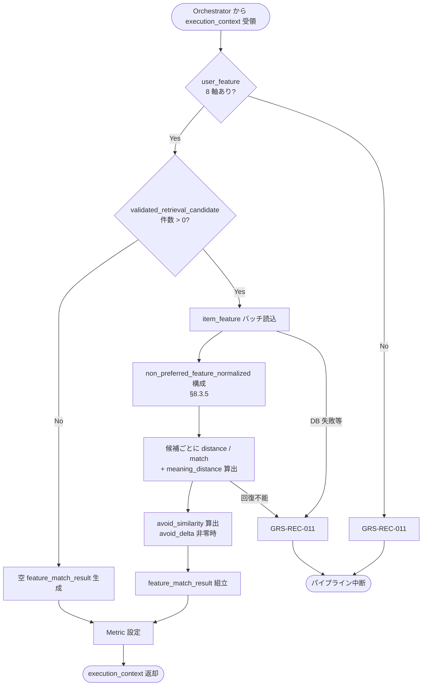

# Feature Matcher モジュール仕様書

## 1. ドキュメント情報

| 項目           | 内容                                       |
| -------------- | ------------------------------------------ |
| ドキュメントID | `MOD-RECO-014`                             |
| ドキュメント名 | Feature Matcher モジュール仕様書           |
| 対象システム   | Gift Recommendation Service（`apps/reco`） |
| MVP対象        | `○`                                        |
| 作成日         | 2026-07-02                                 |
| 更新日         | 2026-07-02（§16 Human 判断反映）         |

---

## 2. 概要

Feature Matcher（feature 一致度計算）は、Reco オンライン推薦パイプラインの **Matching フェーズ先頭**において、`MOD-RECO-001` Recommendation Orchestrator から `execution_context` を **1 回**受け取り、`MOD-RECO-007` が生成した **User Feature**（`user_feature`）と、候補商品ごとの **Item Feature**（`item_feature`）を **8 軸 Feature 単位**で比較し、**Feature Distance / Feature Match** を候補ごとに算出して `feature_match_result` として `execution_context` へ返却するモジュールである。`MOD-RECO-013` Post Hard Filter 完了後、**`MOD-RECO-015` Meaning Match Aggregator の直前**に Orchestrator から呼び出される。

本モジュールは **Feature 単位の距離・一致度計算**に責務を限定し、Social / Symbolic 集約（`MOD-RECO-015`）、Context Score 算出（`MOD-RECO-016`）、Ranking 減点（`avoid_risk` 等）は行わない。Matching 算出式の正本は **Matching定義書** §5〜§6 を正とする。

**命名注記**: Recoモジュール一覧 §6.13 / §8.1 では出力論理名を **`feature_match`** と略記する。機能×モジュール対応表・処理構成定義書では **`feature_match_result`** を用いる。本仕様書・`execution_context` フィールド名は **`feature_match_result`** を正とする（§6.2.2）。

---

## 3. 目的

- `apps/reco` における Feature Matcher 実装・単体テストの前提を定義する
- Orchestrator との I/F（`execution_context` 入出力）、失敗時のパイプライン中断（`GRS-REC-011`）を後続実装可能な粒度で整理する
- User Feature / Item Feature の 8 軸比較、Feature 欠損・異常値の扱い、候補除外方針を明確化する
- Recoモジュール一覧・Matching定義書・Feature定義書・`MOD-RECO-001` / `007` / `013` 仕様書との整合を担保する

---

## 4. モジュール基本情報

| 項目 | 内容 |
| ---- | ---- |
| モジュールID | `MOD-RECO-014` |
| モジュール名 | feature 一致度計算 |
| 物理名 | `Feature Matcher` |
| 分類 | Matching |
| 処理種別 | `OL` |
| 配置予定 | `apps/reco/src/reco/application/feature-matcher/**` |
| 所属Epic | `MOD-RECO-014`（Epic Issue #896） |
| MVP対象 | `○` |
| 主な呼び出し元 | `MOD-RECO-001` Recommendation Orchestrator |
| 主な呼び出し先 | Item Feature Repository（IF-DB-RECO-005） |

`MOD-API-*` / `MOD-RECO-*` / `MOD-BATCH-*` 配下の Task では、該当モジュール ID の責務範囲に変更を限定する。`MOD-RECO-*` では `apps/reco/src/reco/api/**` の API-INT エンドポイント層を対象に含めない。

---

## 5. 責務

### 5.1 主責務

- `MOD-RECO-013` 完了後、Orchestrator から **1 回**呼び出され、`validated_retrieval_candidate` に含まれる候補 `item_id` 集合に対して Matching を実行する
- `execution_context.user_feature.features`（正規化済み 8 軸、0.0〜1.0）と、Run 解決済み `semantic_config_version_id` に紐づく **`item_feature.normalized_feature_value`**（商品 × 8 軸）を **Feature 単位の絶対距離**（Matching定義書 §5.2）で比較する
- 各 Feature について `feature_distance[f]` / `feature_match[f]` を算出し、候補ごとに **`meaning_distance` を常時算出**する（§8.3.3）
- **`avoid_similarity`** を `internal_feature_estimate.avoid_delta` から構成した avoid 専用ベクトルで算出する（§8.3.5。`avoid_delta` 全零時は省略）
- 候補ごとに **`feature_match_result`**（8 軸 distance / match、メタデータ）を組み立て、`execution_context` へ返却し **`MOD-RECO-015`** へ引き渡す
- **`item_feature` 不在・欠損**候補について、§8.3.4 の方針に従い除外または Feature 補完を行う
- 成功時に **Matching フェーズ向け Metric**（§12.1）を Orchestrator / `MOD-RECO-025` 経由で依頼する
- 回復不能失敗時 **`GRS-REC-011`** を Orchestrator へ返却し、パイプライン中断を促す

### 5.2 対象外責務

- `API-INT-002` エンドポイント層
- `MOD-RECO-001` Orchestrator の実行順序制御・Phase Log 契機の物理実装
- **User Feature 生成・正規化**（`MOD-RECO-005`〜`007` 責務）
- **Item Feature 生成・更新**（batch / `MOD-RECO-027` 責務。Online では **参照のみ**）
- **Post Hard Filter**（`MOD-RECO-013` 責務）
- **Social Match / Symbolic Match 集約**（`MOD-RECO-015` 責務）
- **Context Score 算出**（`MOD-RECO-016` 責務。`lambda_ctx` は本モジュールでは **使用しない**）
- **Ranking 減点**（`avoid_risk` / `risk_penalty` / `final_score` 等。`avoid_similarity` を算出しても **減点は行わない**。Ranking定義書 §8.5）
- **Hard Exclude**（NG / avoid / 予算等。Matching 前段で完了済み。Matching定義書 §10.4）
- **`feature_match_result` の正本 DB 永続化**（MVP では Run 内メモリ。DB 永続は別 Task）
- Phase Log `matching_completed` の **最終記録**（Matching フェーズ `014`〜`016` 完了後に Orchestrator が記録。§12）
- OpenAPI / DB schema 変更

---

## 6. 入出力

### 6.1 入力（Orchestrator → 本モジュール）

| 入力 | 型 / 構造 | 必須 | 生成元 | 用途 | 備考 |
| ---- | --------- | ---- | ------ | ---- | ---- |
| `execution_context` | パイプライン実行コンテキスト | `true` | `MOD-RECO-001` | 処理起点 | |
| `execution_context.user_feature` | User Feature ドメインオブジェクト | `true` | `MOD-RECO-007` | Matching ユーザー側入力 | §6.2.1 |
| `execution_context.user_feature.features` | `Record<feature_code, number>` | `true` | `MOD-RECO-007` | 正規化 8 軸 | 0.0〜1.0 |
| `execution_context.validated_retrieval_candidate` | 候補集合 | `true` | `MOD-RECO-013` | 候補 `item_id` 列 | §6.2.3 参照 |
| `execution_context.config_versions` | Config 群 | `true` | `MOD-RECO-003` | `semantic_config_version_id` | item_feature 参照 |
| `execution_context.run_id` | `uuid` | `true` | `MOD-RECO-002` | ログ相関 | |
| `execution_context.internal_feature_estimate` | 内部条件 Feature 推定 | `true` | `MOD-RECO-006` | `avoid_similarity` 入力（`avoid_delta`） | §8.3.5。`006` 完了済み前提 |
| `execution_context.internal_feature_estimate.avoid_delta` | `Record<feature_code, number>` | `true` | `MOD-RECO-006` | `non_preferred_feature_normalized` 構成 | 全軸 0 の場合は `avoid_similarity` 省略 |
| `item_feature`（DB） | 行集合 | 条件付き | batch（BATCH-012/013） | Item 側 8 軸 | IF-DB-RECO-005 |

**前提**: `MOD-RECO-002` Run INSERT、`MOD-RECO-004`〜`013` が完了済み（Orchestrator 論理順序 13 まで）。`user_feature` は 8 軸すべて存在すること。

**空入力**: `validated_retrieval_candidate.total_validated = 0` の場合、Matching 計算は **スキップ**（空 `feature_match_result` を返却し **成功**とする。`GRS-REC-011` にしない）。

### 6.2 出力（本モジュール → Orchestrator / 後続）

| 出力 | 型 / 構造 | 利用先 | 用途 | 備考 |
| ---- | --------- | ------ | ---- | ---- |
| `execution_context.feature_match_result` | 候補別 Matching 結果集合 | `MOD-RECO-015` | 意味マッチ集約入力 | §6.2.2 |
| `feature_matcher_candidate_count` | `number` | Orchestrator / `MOD-RECO-025` | Matching 対象候補数 | 0 件も正常 |
| `feature_matcher_excluded_count` | `number` | 観測 | item_feature 欠損等で除外した件数 | §8.3.4 |
| `reco_error` | 標準化 reco エラー | Orchestrator | 失敗時 | `GRS-REC-011` |

#### 6.2.1 `user_feature`（入力・参照）

`MOD-RECO-007` モジュール仕様書 §6.2 を正とする。本モジュールは **`user_feature.features`**（正規化 8 軸）を **読み取りのみ**使用する。

| フィールド | 必須 | 内容 |
| ---------- | ---- | ---- |
| `features[feature_code]` | `true` | 8 軸すべて必須（`formality` / `safety` / `brand_appropriateness` / `emotion` / `novelty` / `intimacy` / `symbolic_identity` / `story_richness`） |
| `feature_normalization_version_id` | `true` | 監査・再現性（結果へエコー可） |
| `semantic_config_version_id` | `true` | item_feature 参照 version と一致必須 |

#### 6.2.2 `feature_match_result`（MVP 概要）

`execution_context` フィールド名は **`feature_match_result`**。ドメイン型は **`FeatureMatchResult`**（配置: `apps/reco/src/reco/application/feature-matcher/models.py` または `domain/**`。実装 Task で最終配置を確定）。論理上は以下を含む。

| フィールド | 必須 | 内容 |
| ---------- | ---- | ---- |
| `entries[]` | `true` | 候補ごとの Feature Match 結果（除外候補は含めない） |
| `entries[].item_id` | `true` | 候補商品 ID |
| `entries[].features` | `true` | Feature 別結果マップ（§6.2.2.1） |
| `entries[].avoid_similarity` | `false` | Matching定義書 §10.2。`avoid_delta` 全零時は省略（`null`） |
| `entries[].meaning_distance` | `true` | Matching定義書 §11.3。**MVP 常時出力**（§16.1 No.7） |
| `entries[].calculated_at` | `true` | 算出日時（UTC） |
| `entries[].model_version_id` | `false` | Matching ロジック version（MVP では config 解決値をエコー可） |
| `total_matched` | `true` | `entries` 件数 |
| `total_excluded` | `true` | item_feature 欠損等で Matching 対象外とした件数 |

##### 6.2.2.1 Feature 別結果（`entries[].features[feature_code]`）

| フィールド | 必須 | 内容 |
| ---------- | ---- | ---- |
| `distance` | `true` | `feature_distance[f]`（0.0〜1.0） |
| `match` | `true` | `feature_match[f]`（0.0〜1.0） |
| `match_method` | `false` | MVP: `one_minus_distance` 固定可 |
| `imputed` | `false` | Feature 欠損補完（0.5）を適用した場合 `true` |

**0 件の扱い**: 入力候補 0 件・全候補除外とも **モジュールとしては成功**可能（空 `feature_match_result`）。**全候補 Matching 対象外**の場合、Orchestrator は **`MOD-RECO-015` 以降を呼ばず早期 0 件終了**し、最終 `GRS-REC-001` へ進む（§16.1 No.8）。

#### 6.2.3 `validated_retrieval_candidate`（入力・参照）

`MOD-RECO-013` モジュール仕様書 §6.2.2 を正とする。本モジュールは **`candidates[].item_id`** および **`similarity_score`**（引き継ぎ用）を **読み取りのみ**使用する。

---

## 7. 依存関係

### 7.1 依存モジュール

| 依存先 | 方向 | 用途 | 失敗時 | 備考 |
| ------ | ---- | ---- | ------ | ---- |
| `MOD-RECO-001` | 被呼び出し | Matching フェーズ契機 | — | `013` 直後・`015` 直前 |
| `MOD-RECO-007` | 間接 | `user_feature` | 未到達 | 入力正本 |
| `MOD-RECO-006` | 間接 | `internal_feature_estimate.avoid_delta` | 未到達 | `avoid_similarity` 入力 |
| `MOD-RECO-013` | 間接 | `validated_retrieval_candidate` | 未到達 | 候補正本 |
| `MOD-RECO-015` | 下位利用 | `feature_match_result` | — | 集約入力 |
| Item Feature Repository（IF-DB-RECO-005） | 呼び出し | `item_feature` 8 行読込 | `GRS-REC-011`（回復不能時） | |
| `MOD-RECO-028` / `025` / `024` | 間接 | 観測・エラー | — | Orchestrator 経由 |

**下位利用**: `MOD-RECO-015` Meaning Match Aggregator が `feature_match_result` を入力とする。

### 7.2 参照データ

| データ | 参照元 | 用途 | version / config | 備考 |
| ------ | ------ | ---- | ---------------- | ---- |
| `item_feature` | DB | 商品側 8 軸正規化値 | `semantic_config_version_id` + `feature_code` | SELECT のみ。`normalized_feature_value` を使用 |
| `feature_definition` / enum | config（間接） | 8 軸コード正本 | `semantic_config_version_id` 配下 | enum定義書 §6.16 |

Online 推薦中に `item_feature` を **更新しない**（item_feature テーブル定義書 §4・論理ER §16.1）。

---

## 8. 処理仕様

### 8.1 処理フロー



### 8.2 処理ステップ

| No | 処理 | 入力 | 出力 | 補足 |
| --: | ---- | ---- | ---- | ---- |
| 1 | 入力検証 | `execution_context` | — | `user_feature` 必須。候補 0 件は Step 2 へ |
| 2 | User Feature 検証 | `user_feature.features` | — | 8 軸欠損時 `GRS-REC-011` |
| 3 | Item Feature 読込 | `candidates[].item_id` | `item_feature` 8 行 × n | バッチ SELECT 推奨 |
| 4 | `non_preferred_feature_normalized` 構成 | `avoid_delta`, 正規化パラメータ | 8 軸ベクトル | §8.3.5。Run 内 1 回 |
| 5 | 候補ごと Feature Match + `meaning_distance` | user / item 8 軸 | 中間結果 | §8.3.1・§8.3.3 |
| 6 | `avoid_similarity` 算出 | `non_preferred` / item | 候補別値 | §8.3.5。`avoid_delta` 全零時は省略 |
| 7 | 結果組立 | 中間結果 | `feature_match_result` | §6.2.2 |
| 8 | 観測値設定 | 件数 | `feature_matcher_*_count` | Orchestrator へ |

**候補処理順（MVP）**: `validated_retrieval_candidate.candidates[]` の **入力順序を維持**する（Retrieval 類似度順。Post Filter 通過順）。

### 8.3 アルゴリズム / 計算仕様

Matching 算出式の正本は **Matching定義書** §5〜§6。本モジュールは **Feature 単位計算のみ**を実装し、Social / Symbolic 集約・Context Score は **`MOD-RECO-015` / `016`** に委譲する。

#### 8.3.1 Feature Distance / Feature Match（MVP 必須）

| 項目 | 内容 |
| ---- | ---- |
| 対象 Feature | MVP 固定 8 軸（Matching定義書 §4.3） |
| 距離式 | `feature_distance[f] = abs(user_feature.features[f] - item_feature.normalized_feature_value[f])` |
| 一致度式 | `feature_match[f] = 1.0 - feature_distance[f]` |
| 値域 | distance / match とも **0.0〜1.0**（入力が正規化済みのため） |
| match_method | MVP: **`one_minus_distance`**（Matching定義書 §6.2） |

**例**（Matching定義書 §6.4 準拠）:

```text
user.formality = 0.80
item.formality = 0.65

feature_distance.formality = abs(0.80 - 0.65) = 0.15
feature_match.formality = 1.0 - 0.15 = 0.85
```

#### 8.3.2 Feature 軸一覧（MVP 固定）

| 分類 | `feature_code` | 論理名 |
| ---- | -------------- | ------ |
| Social | `formality` | 儀礼性 |
| Social | `safety` | 安全性 |
| Social | `brand_appropriateness` | ブランド適切性 |
| Symbolic | `emotion` | 感情表現性 |
| Symbolic | `novelty` | 特別感 |
| Symbolic | `intimacy` | 親密性 |
| Symbolic | `symbolic_identity` | 象徴性 |
| Symbolic | `story_richness` | ストーリー性 |

#### 8.3.3 `meaning_distance`（MVP 常時出力）

Matching定義書 §11.3 に従い、Matching 成功候補ごとに 8 次元ユークリッド距離を **常時算出**し、`entries[].meaning_distance` に設定する（§16.1 No.7）。

```text
meaning_distance = sqrt( Σ_f (user[f] - item[f])^2 )
```

| 項目 | 内容 |
| ---- | ---- |
| 入力 | `user_feature.features[f]` と `item_feature.normalized_feature_value[f]`（§8.3.1 と同一。補完・clip 後） |
| 値域 | **0.0 以上、理論最大 √8 ≈ 2.83**（各軸 0.0〜1.0 前提） |
| 解釈 | **小さいほど** User / Item の意味ベクトル全体が近い |
| Ranking 利用 | **なし**（`context_score` は `MOD-RECO-016` 責務） |
| 空入力 / 全除外 | 算出対象なし（`entries` 空） |

#### 8.3.4 Feature / Item Feature 欠損・異常値

Matching定義書 §16 を正とし、MVP では以下を採用する。

| ケース | MVP 方針 |
| ------ | -------- |
| `user_feature` 不在 / 8 軸欠損 | **`GRS-REC-011`**（Matching 不可） |
| 候補の `item_feature` **8 行すべて不在** | **候補を Matching 対象から除外**（`total_excluded` 加算）。warn ログ |
| 候補の `item_feature` **一部軸欠損** | 当該軸を **中立値 `0.5` で補完**（`imputed = true`）。Matching定義書 §16.2 |
| `normalized_feature_value` が **0.0〜1.0 外** | **guard_clip**（0.0 / 1.0 にクリップ）後に計算。異常 Metric 記録（Matching定義書 §16.3） |
| `semantic_config_version_id` 不一致 | **候補除外** + warn ログ |
| 参照 DB 障害 | **`GRS-REC-011`**（パイプライン中断） |

**全候補除外**: 入力候補はあったが `item_feature` 欠損等ですべて除外された場合、**モジュールとしては成功**（空 `feature_match_result.entries`、`feature_matcher_candidate_count = 0`）。Orchestrator は **`MOD-RECO-015` 以降（Matching / Ranking フェーズ）を呼ばず早期 0 件終了**し、`GRS-REC-001` 相当の空結果パスへ進む（§16.1 No.8。MOD-RECO-001 §8.2 0 件結果方針と整合）。

#### 8.3.5 `avoid_similarity`（MVP）

Matching定義書 §10.2〜§10.3 に従う。主 Matching（§8.3.1）への `user_feature` には avoid 効果が **既に反映済み**（Matching定義書 §10.1）であるため、`avoid_similarity` は **avoid 専用ベクトル**と Item Feature の近さを **補助指標**として別途算出する（Ranking の `avoid_risk` 入力候補）。

##### 8.3.5.1 `non_preferred_feature_normalized` の構成（Human 判断確定・§16.1 No.6）

| 項目 | 内容 |
| ---- | ---- |
| 入力正本 | `execution_context.internal_feature_estimate.avoid_delta`（`MOD-RECO-006` §6.2） |
| 採用理由 | avoid 専用 Delta が Run 内メモリ正本として既に存在し、`user_feature`（外部条件 + 内部条件統合済み）と **分離**できるため |
| 不採用 | `user_feature.features` をそのまま使用 — 主 Matching と avoid 近さが混同され Matching定義書 §10.1 / §10.2 の責務分離に反する |
| raw 構成 | `avoid_feature_raw[f] = 0.5 + avoid_delta[f]`（中立 baseline `0.5` + avoid 専用 Delta。Matching定義書 §16.2 の中立値と整合） |
| 正規化 | `MOD-RECO-007` と **同一 sigmoid**（`user_feature.feature_normalization_version_id` → `feature_normalization_version.parameter_json`）を `avoid_feature_raw[f]` に適用 |
| 出力 | `non_preferred_feature_normalized[f]`（0.0〜1.0）。Run 内一時変数（`execution_context` 新規フィールドは **追加しない**） |

##### 8.3.5.2 `avoid_similarity` 算出

| 項目 | 内容 |
| ---- | ---- |
| 前提 | 8 軸のいずれかで `avoid_delta[f] != 0` |
| 軸一致度 | `axis_match[f] = 1.0 - abs(non_preferred_feature_normalized[f] - item[f])`（§8.3.1 と同一式） |
| 集約 | **`avoid_similarity = mean(axis_match[f])`**（8 軸算術平均。MVP 固定） |
| 値域 | **0.0〜1.0**（高いほど避けたい意味方向に Item が近い） |
| 省略 | 全軸 `avoid_delta[f] == 0` の場合、`entries[].avoid_similarity` は **`null` またはフィールド省略** |
| 減点 | **行わない**。Ranking の `avoid_risk` へ委譲（Ranking定義書 §8.5） |
| Post との境界 | `MOD-RECO-013` の avoid 観測（concept 重複）は **Hard Exclude しない**。順位影響は本 Feature 系統 → Ranking（MOD-RECO-013 §8.3.2） |

#### 8.3.6 Orchestrator Port 契約（MVP）

| 項目 | 内容 |
| ---- | ---- |
| 呼び出し | `match_features(execution_context) -> execution_context`（名称は実装 Task で確定） |
| 成功 | `feature_match_result` / `feature_matcher_candidate_count` / `feature_matcher_excluded_count` が設定される |
| 成功（Matching 対象 0 件） | 空 `feature_match_result` で **成功**。Orchestrator は **`015` 以降をスキップ**して早期 0 件終了（§16.1 No.8） |
| 失敗 | `GRS-REC-011`。`015` 以降は呼ばれない |
| Phase Log | **`matching_completed` は Matching フェーズ（`014`〜`016`）完了後に Orchestrator が記録**（§12） |
| Wiring | Matching フェーズ（`014`〜`016`）は **未配線（スタブ）**（MOD-RECO-001 §8.4.2） |

---

## 9. データ項目マッピング

| 入力項目 | 内部項目 | 出力項目 | 変換内容 | 備考 |
| -------- | -------- | -------- | -------- | ---- |
| `user_feature.features[f]` | `user[f]` | `entries[].features[f].match` / `.distance` | §8.3.1 絶対距離 → 1 - distance | |
| `item_feature.normalized_feature_value[f]` | `item[f]` | 同上 | 読込のみ | IF-DB-RECO-005 |
| `validated_retrieval_candidate.candidates[].item_id` | 候補キー | `entries[].item_id` | 1:1 | 除外候補は entries に含めない |
| `validated_retrieval_candidate.candidates[].similarity_score` | — | （引き継ぎなし） | 本モジュールでは変更しない | 後続 Ranking 入力は別経路 |
| user / item 8 軸 | `user[f]`, `item[f]` | `entries[].meaning_distance` | §8.3.3 ユークリッド距離 | MVP 常時 |
| `avoid_delta` + item | `non_preferred[f]`, `item[f]` | `entries[].avoid_similarity` | §8.3.5 軸平均 match | avoid 非零時 |
| — | 算出 | `feature_matcher_candidate_count` | `entries` 件数 | Metric |
| — | 除外 | `feature_matcher_excluded_count` | §8.3.4 | Metric |

---

## 10. 状態・例外

### 10.1 状態

本モジュールは **ステートレス**（Run 内 1 回呼び出し）。

| 状態 | 意味 | 遷移条件 | 記録先 |
| ---- | ---- | -------- | ------ |
| — | モジュール内部状態なし | — | — |

### 10.2 例外

| 例外 | Error Code | 発生条件 | 呼び出し元への返却 | ログ |
| ---- | ---------- | -------- | ------------------ | ---- |
| Matching 失敗 | `GRS-REC-011` | `user_feature` 欠損・DB 参照不能・内部エラー | 500 系・中断 | Error Log + Phase failed |
| 候補 0 件（入力 / 出力） | — | 入力 0 件 or 全候補 Matching 対象外 | **成功**。Orchestrator は **`015` 以降スキップ**（§16.1 No.8） | `feature_matcher_candidate_count = 0` |

**リトライ**: モジュール内自動リトライ **なし**（MVP）。

Error Code の正本はエラーコード定義書。Orchestrator は `MOD-RECO-024` 経由で標準化結果を呼び出し元へ伝播する。

---

## 11. DB / 永続化

### 11.1 書き込み

| テーブル | 操作 | 備考 |
| -------- | ---- | ---- |
| 正本テーブル（`user_feature` / `item_feature` 等） | **なし** | Online 中 UPDATE 禁止 |
| `feature_match_result` 永続 | **MVP なし** | Run 内メモリ + Metric サマリ |

### 11.2 読み取り

| テーブル | 操作 | 用途 |
| -------- | ---- | ---- |
| `item_feature` | SELECT | 候補 item の 8 軸正規化値（`normalized_feature_value`） |

**方針**: 候補 `item_id` 集合 × `semantic_config_version_id` に対する **バッチ SELECT** を第一候補とし、候補件数は `candidate_limit` 上限（通常 50〜100）である。

---

## 12. ログ・メトリクス

| 種別 | 内容 | タイミング | 保存先 | 備考 |
| ---- | ---- | ---------- | ------ | ---- |
| Phase Log | `matching_completed` | Matching フェーズ（`014`〜`016`）**全体成功後** | `phase_log`（`MOD-RECO-028`） | **本モジュール単独では記録しない**。Orchestrator 管轄（ログ・Observability設計書 §10.3） |
| Metric | `feature_matcher_candidate_count` 等 | 成功 | Metric Logger（`MOD-RECO-025`） | §12.1 |
| Error Log | `GRS-REC-011` | 失敗 | `error_log`（`MOD-RECO-029`） | |
| 構造化ログ | Matching サマリ（件数・除外数・duration_ms） | 成功 / 警告 | アプリログ | `trace_id` 必須。Feature 値全量ダンプ禁止 |

### 12.1 メトリクス

| Metric | 内容 | 集計単位 | 用途 |
| ------ | ---- | -------- | ---- |
| `feature_matcher_candidate_count` | Matching 完了候補数 | Run | 候補数推移 |
| `feature_matcher_excluded_count` | item_feature 欠損等で除外した件数 | Run | データ品質監視 |
| `feature_matcher_latency_ms` | 本モジュール処理時間 | Run | 性能監視（Matching 一括 500ms 上限の内訳） |
| `feature_match_imputed_axis_count` | 補完（0.5）適用軸数 | Run | Feature 生成品質 |
| `feature_value_out_of_range_count` | guard_clip 適用軸数 | Run | 正規化異常監視 |

**Matching フェーズ Metric（共有）**: `matching_latency_ms` / `feature_match_distribution` 等はログ・Observability設計書 §11.2 に従い、Matching フェーズ全体（`014`〜`016`）または Metric Logger 側で集約してよい。

---

## 13. 性能・非機能

| 観点 | 方針 |
| ---- | ---- |
| レイテンシ | モジュール単体 hard timeout は設けない。Matching 一括（`014`〜`016`）**hard 500ms** 上位ガード（MOD-RECO-001 §13.2） |
| 計算量 | 候補件数 O(n) × 8 軸。n ≤ `candidate_limit`。item_feature 参照はバッチ化 |
| タイムアウト | 上位 Orchestrator / DB 接続タイムアウトに従う |
| リトライ | なし |
| キャッシュ | Run 横断 item_feature キャッシュなし（MVP） |
| 並列実行 | 同一 Run 内 1 回・同期実行 |
| 0 件早期終了 | 入力 0 件 / 全候補 Matching 対象外時は計算スキップ。空 output を返却。Orchestrator が **`015` 以降を呼ばない**（§16.1 No.8） |

---

## 14. テスト観点

| No | 観点 | 確認内容 | 種別 |
| --: | ---- | -------- | ---- |
| 1 | 正常系（8 軸一致度） | `feature_match[f] = 1.0 - abs(user[f] - item[f])` と一致すること | unit |
| 2 | 正常系（候補複数） | 候補ごとに `entries[]` が生成され入力順が維持されること | unit |
| 3 | 境界値（完全一致） | distance = 0 / match = 1 になること | unit |
| 4 | 境界値（最大不一致） | distance = 1 / match = 0 になること | unit |
| 5 | user_feature 欠損 | 8 軸欠損で `GRS-REC-011` になること | unit |
| 6 | item_feature 全欠損 | 当該候補が除外され `total_excluded` が加算されること | unit |
| 7 | item_feature 一部欠損 | 欠損軸が 0.5 補完され `imputed = true` になること | unit |
| 8 | 値域外 | guard_clip 後に計算され Metric が記録されること | unit |
| 9 | 入力 0 件 | 成功・空 `feature_match_result`・`GRS-REC-011` にならないこと | unit |
| 10 | 全候補除外 | 成功・`feature_matcher_candidate_count = 0` になること | unit |
| 11 | 早期 0 件終了 | Matching 対象 0 件時に Orchestrator が `015` 以降を呼ばないこと | integration |
| 12 | meaning_distance 常時 | Matching 成功候補すべてに `meaning_distance` が設定されること | unit |
| 13 | avoid_similarity | `avoid_delta` 非零時に算出・全零時に省略されること | unit |
| 14 | Orchestrator 連携 | `013` 後 1 回呼び出し・失敗時 `015` 未到達 | integration |
| 15 | Metric | `feature_matcher_*` / 除外・補完 Metric が記録されること | integration |
| 16 | ログ | `trace_id` あり・Feature 値全量・secret なし | unit |
| 17 | DB 読み取り | `semantic_config_version_id` で 8 行 SELECT されること | unit / integration |

---

## 15. 変更管理

### 15.1 変更履歴

| 日付 | 変更内容 | 関連 Issue / PR |
| ---- | -------- | --------------- |
| 2026-07-02 | 初版作成 | Issue #897 |
| 2026-07-02 | §16 No.6〜8 を Human 判断で確定（`avoid_similarity` / `meaning_distance` / 早期 0 件終了） | Issue #897 / Human Review |

---

## 16. 未決事項

| No | 論点 | 判断が必要な理由 | 判断者 | 期限 | 備考 |
| --: | ---- | ---------------- | ------ | ---- | ---- |
| - | なし | - | - | - | MVP 着手前論点は §16.1 へ移管済み（Human Review 2026-07-02） |

### 16.1 確定済み論点

| No | 論点 | 確定内容 |
| --: | ---- | -------- |
| 1 | Feature 距離方式 | MVP は **絶対距離** + **`feature_match = 1.0 - distance`**（Matching定義書 §5.2・§6.2） |
| 2 | 出力フィールド名 | **`execution_context.feature_match_result`**（Reco一覧の論理名 `feature_match` は同義） |
| 3 | Social / Symbolic 集約 | **本モジュール scope 外**（`MOD-RECO-015` 責務） |
| 4 | item_feature 更新 | Online 推薦中は **SELECT のみ**（batch 生成物を参照） |
| 5 | Phase Log | **`matching_completed` は `014`〜`016` 完了後に Orchestrator が記録** |
| 6 | `avoid_similarity` 入力ベクトル | **`internal_feature_estimate.avoid_delta`** から `avoid_feature_raw[f] = 0.5 + avoid_delta[f]` を構成し、`user_feature.feature_normalization_version_id` と同一 sigmoid で **`non_preferred_feature_normalized`** を生成。`avoid_similarity = mean(1.0 - abs(non_preferred[f] - item[f]))`。全軸 `avoid_delta == 0` 時は省略（§8.3.5） |
| 7 | `meaning_distance` MVP 採用 | **常時出力**。Matching 成功候補ごとに `entries[].meaning_distance` を必ず設定（§8.3.3） |
| 8 | item_feature 全欠損時の後続 | 全候補 Matching 対象外時、本モジュールは **成功**（空 `feature_match_result`）。Orchestrator は **`MOD-RECO-015` 以降を呼ばず早期 0 件終了**し `GRS-REC-001` パスへ（MOD-RECO-001 §8.2） |

---

## 17. 関連資料

| 種別 | パス | 用途 |
| ---- | ---- | ---- |
| Recoモジュール一覧 | `docs/05_アプリケーション設計/アプリ/reco/Recoモジュール一覧.md` | §6.13 |
| モジュール一覧 | `docs/05_アプリケーション設計/アプリ/モジュール一覧.md` | Matching 分類 |
| 機能×モジュール対応表 | `docs/05_アプリケーション設計/アプリ/機能×モジュール対応表.md` | `feature_match_result` |
| Matching定義書 | `docs/04_ドメインモデル設計/Matching定義書.md` | 距離・一致度・avoid |
| Feature定義書 | `docs/04_ドメインモデル設計/Feature定義書.md` | 8 軸定義 |
| Featureルール定義書 | `docs/04_ドメインモデル設計/Featureルール定義書.md` | 正規化・User/Item 対称 |
| MOD-RECO-001 | `docs/06_実装設計/reco/MOD-RECO-001_Recommendation Orchestratorモジュール仕様書.md` | 呼び出し・`GRS-REC-011` |
| MOD-RECO-007 | `docs/06_実装設計/reco/MOD-RECO-007_User Feature Generatorモジュール仕様書.md` | `user_feature` 入力 |
| MOD-RECO-013 | `docs/06_実装設計/reco/MOD-RECO-013_Post Hard Filter Executorモジュール仕様書.md` | 直前モジュール |
| MOD-RECO-006 | `docs/06_実装設計/reco/MOD-RECO-006_Internal Condition Feature Estimatorモジュール仕様書.md` | avoid Delta |
| item_feature テーブル定義書 | `docs/06_実装設計/database/item_feature_テーブル定義書.md` | 参照のみ |
| user_feature テーブル定義書 | `docs/06_実装設計/database/user_feature_テーブル定義書.md` | User 側対称 |
| インターフェース一覧 | `docs/05_アプリケーション設計/アプリ/インターフェース一覧.md` | IF-DB-RECO-005 |
| エラーコード定義書 | `docs/05_アプリケーション設計/アプリ/エラーコード定義書.md` | `GRS-REC-011` |
| ログ・Observability設計書 | `docs/05_アプリケーション設計/アプリ/ログ・Observability設計書.md` | Phase / Metric |
| Ranking定義書 | `docs/04_ドメインモデル設計/Ranking定義書.md` | `avoid_risk` 境界 |
| Epic Definition | `prompts/definitions/epics/mod-reco-014-feature-matcher/epic.yaml` | allowed_paths |

---

## 18. レビュー観点

- Recoモジュール一覧 §6.13 のモジュール名・物理名・入出力と一致している
- Matching定義書 §5〜§6 の距離・一致度式と一致している
- Orchestrator Port 契約（`execution_context` 入出力・`GRS-REC-011`）が MOD-RECO-001 と整合している
- `MOD-RECO-013` との Pre / Post 境界（Hard Filter 済み候補のみ Matching）が明確である
- `MOD-RECO-015` / `016` との責務境界（Feature 単位のみ・集約 / Context Score なし）が明確である
- API-INT-002 エンドポイント層を責務範囲に含めていない
- avoid と Hard Filter の責務が MOD-RECO-013・Matching / Ranking 定義と矛盾しない
- secret や `.env` 実値が含まれていない

---

## 19. 備考

- 物理配置は Epic `allowed_paths` に従い `apps/reco/src/reco/application/feature-matcher/**` を第一候補とする（Epic #896 `epic_scope.allowed_paths` と整合）
- Orchestrator Wiring は Matching フェーズ（`014`〜`016`）単位で実施する（MOD-RECO-001 §8.4.2）
- Item Feature は batch（BATCH-012/013 / `MOD-RECO-027`）で事前生成され、Online では **読み取りのみ**（Recoモジュール一覧 §6.24.2）
- Recoモジュール一覧 §6.13 の主な入力 `validated_candidate` は、本仕様書では **`validated_retrieval_candidate`**（MOD-RECO-013 正本）と同義
