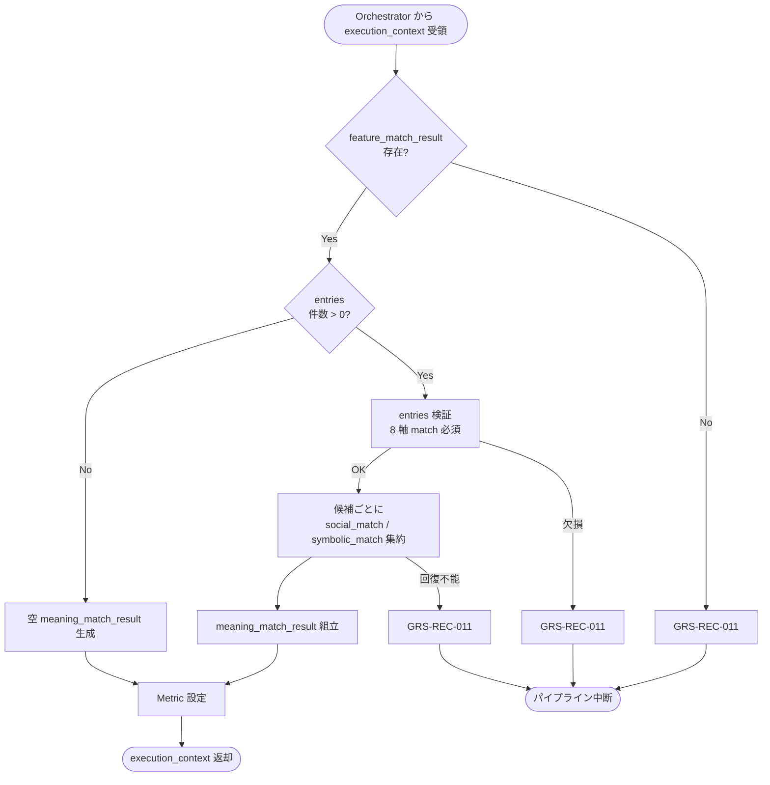

# Meaning Match Aggregator モジュール仕様書

## 1. ドキュメント情報

| 項目           | 内容                                       |
| -------------- | ------------------------------------------ |
| ドキュメントID | `MOD-RECO-015`                             |
| ドキュメント名 | Meaning Match Aggregator モジュール仕様書  |
| 対象システム   | Gift Recommendation Service（`apps/reco`） |
| MVP対象        | `○`                                        |
| 作成日         | 2026-07-02                                 |
| 更新日         | 2026-07-02                                 |

---

## 2. 概要

Meaning Match Aggregator（意味マッチ集約）は、Reco オンライン推薦パイプラインの **Matching フェーズ中間**において、`MOD-RECO-001` Recommendation Orchestrator から `execution_context` を **1 回**受け取り、`MOD-RECO-014` Feature Matcher が算出した **`feature_match_result`**（候補ごとの 8 軸 Feature Match）を入力として、候補商品ごとに **Social Match**（`social_match`）と **Symbolic Match**（`symbolic_match`）を集約し、`meaning_match_result` として `execution_context` へ返却するモジュールである。`MOD-RECO-014` 完了後、**`MOD-RECO-016` Context Scorer の直前**に Orchestrator から呼び出される。

本モジュールは **Social / Symbolic 軸への加重平均集約**に責務を限定し、Feature 単位距離・一致度の再計算（`MOD-RECO-014`）、Context Score 算出（`MOD-RECO-016`）、Ranking 減点（`avoid_risk` 等）は行わない。Social / Symbolic Match 算出式の正本は **Matching定義書** §7〜§8 を正とする。

**命名注記**: Recoモジュール一覧 §6.14 / §8.1 では出力論理名を **`social_match` / `symbolic_match`** と略記する。リソース一覧・機能×モジュール対応表では候補別集合を **`meaning_match_result`** と呼ぶ。本仕様書・`execution_context` フィールド名は **`meaning_match_result`** を正とし、各候補エントリ内に `social_match` / `symbolic_match` を格納する（§6.2.2）。

---

## 3. 目的

- `apps/reco` における Meaning Match Aggregator 実装・単体テストの前提を定義する
- Orchestrator との I/F（`execution_context` 入出力）、失敗時のパイプライン中断（`GRS-REC-011`）を後続実装可能な粒度で整理する
- `feature_match_result` から `social_match` / `symbolic_match` への集約式・Feature 軸対応・重み方針を明確化する
- Recoモジュール一覧・Matching定義書・`MOD-RECO-001` / `014` / `016` 仕様書との整合を担保する

---

## 4. モジュール基本情報

| 項目 | 内容 |
| ---- | ---- |
| モジュールID | `MOD-RECO-015` |
| モジュール名 | 意味マッチ集約 |
| 物理名 | `Meaning Match Aggregator` |
| 分類 | Matching |
| 処理種別 | `OL` |
| 配置予定 | `apps/reco/src/reco/application/meaning-match-aggregator/**` |
| 所属Epic | `MOD-RECO-015`（Epic Issue #904） |
| MVP対象 | `○` |
| 主な呼び出し元 | `MOD-RECO-001` Recommendation Orchestrator |
| 主な呼び出し先 | なし（純粋計算モジュール） |

`MOD-API-*` / `MOD-RECO-*` / `MOD-BATCH-*` 配下の Task では、該当モジュール ID の責務範囲に変更を限定する。`MOD-RECO-*` では `apps/reco/src/reco/api/**` の API-INT エンドポイント層を対象に含めない。

---

## 5. 責務

### 5.1 主責務

- `MOD-RECO-014` 完了後、Orchestrator から **1 回**呼び出され、`execution_context.feature_match_result` に含まれる候補ごとの 8 軸 `feature_match` を **Social 3 軸 / Symbolic 5 軸**へ分類し集約する
- 候補ごとに **`social_match`**（Social 系 Feature Match の加重平均）を算出する（Matching定義書 §7）
- 候補ごとに **`symbolic_match`**（Symbolic 系 Feature Match の加重平均）を算出する（Matching定義書 §8）
- 候補ごとに **`meaning_match_result`**（`social_match` / `symbolic_match`、メタデータ）を組み立て、`execution_context` へ返却し **`MOD-RECO-016`** へ引き渡す
- 入力候補の **処理順序**（`feature_match_result.entries[]` の順序）を維持する
- 成功時に **Matching フェーズ向け Metric**（§12.1）を Orchestrator / `MOD-RECO-025` 経由で依頼する
- 回復不能失敗時 **`GRS-REC-011`** を Orchestrator へ返却し、パイプライン中断を促す

### 5.2 対象外責務

- `API-INT-002` エンドポイント層
- `MOD-RECO-001` Orchestrator の実行順序制御・Phase Log 契機の物理実装
- **Feature 単位距離・一致度の算出**（`MOD-RECO-014` 責務）
- **Item Feature 参照・DB 読込**（`MOD-RECO-014` 責務。本モジュールは `feature_match_result` のみ参照）
- **Context Score 算出**（`MOD-RECO-016` 責務。`lambda_ctx` は本モジュールでは **使用しない**）
- **Ranking 減点**（`avoid_risk` / `risk_penalty` / `final_score` 等）
- **`match_reason_basis` / strong_match / weak_match 判定**（Matching定義書 §12.2〜§12.3。推薦理由生成は `MOD-RECO-023` 責務。MVP では本モジュール scope 外）
- **軸別 Feature Match の算出・`meaning_match_result` への重複格納**（軸別 match の正本は **`MOD-RECO-014`** の `feature_match_result.entries[].features[f].match`。分析・分布観測は `014` 出力または **`MOD-RECO-025` Metric Logger** / `reco_score_distribution_metric` を参照。§6.2.3）
- **`meaning_match_result` の正本 DB 永続化**（MVP では Run 内メモリ。DB 永続は別 Task）
- Phase Log `matching_completed` の **最終記録**（Matching フェーズ `014`〜`016` 完了後に Orchestrator が記録。§12）
- OpenAPI / DB schema 変更

---

## 6. 入出力

### 6.1 入力（Orchestrator → 本モジュール）

| 入力 | 型 / 構造 | 必須 | 生成元 | 用途 | 備考 |
| ---- | --------- | ---- | ------ | ---- | ---- |
| `execution_context` | パイプライン実行コンテキスト | `true` | `MOD-RECO-001` | 処理起点 | |
| `execution_context.feature_match_result` | 候補別 Feature Match 結果集合 | `true` | `MOD-RECO-014` | 集約入力 | §6.2.1 |
| `execution_context.config_versions` | Config 群 | `true` | `MOD-RECO-003` | Matching 重み（`social_feature_weights` / `symbolic_feature_weights`） | §8.3.2 |
| `execution_context.run_id` | `uuid` | `true` | `MOD-RECO-002` | ログ相関 | |

**前提**: `MOD-RECO-014` が完了済み（Orchestrator 論理順序 14 まで）。`feature_match_result.entries` に **1 件以上**あることが Orchestrator 呼び出し前提（§8.3.6）。

**空入力（防御的）**: `feature_match_result.entries` が空の場合、本モジュールは **空 `meaning_match_result` を返却し成功**とする（`GRS-REC-011` にしない）。通常は Orchestrator が **`MOD-RECO-015` を呼ばず早期 0 件終了**する（`MOD-RECO-014` §16.1 No.8）。

### 6.2 出力（本モジュール → Orchestrator / 後続）

| 出力 | 型 / 構造 | 利用先 | 用途 | 備考 |
| ---- | --------- | ------ | ---- | ---- |
| `execution_context.meaning_match_result` | 候補別 Meaning Match 結果集合 | `MOD-RECO-016` | Context Score 算出入力 | §6.2.2 |
| `meaning_match_aggregator_candidate_count` | `number` | Orchestrator / `MOD-RECO-025` | 集約完了候補数 | 0 件も正常 |
| `reco_error` | 標準化 reco エラー | Orchestrator | 失敗時 | `GRS-REC-011` |

#### 6.2.1 `feature_match_result`（入力・参照）

`MOD-RECO-014` モジュール仕様書 §6.2.2 を正とする。本モジュールは以下を **読み取りのみ**使用する。

| フィールド | 必須 | 内容 |
| ---------- | ---- | ---- |
| `entries[]` | `true` | 候補ごとの Feature Match 結果 |
| `entries[].item_id` | `true` | 候補商品 ID |
| `entries[].features[feature_code].match` | `true` | 8 軸すべての `feature_match[f]`（0.0〜1.0） |
| `entries[].features[feature_code].imputed` | `false` | 補完軸の有無（Metric 用にエコー可） |
| `entries[].model_version_id` | `false` | Matching ロジック version（結果へエコー可） |
| `total_matched` | `true` | `entries` 件数（整合検証用） |

本モジュールは `entries[].features[f].distance` / `meaning_distance` / `avoid_similarity` を **変更せず**、`feature_match_result` をそのまま `execution_context` に残す（読み取り専用）。

#### 6.2.2 `meaning_match_result`（MVP 概要）

`execution_context` フィールド名は **`meaning_match_result`**。ドメイン型は **`MeaningMatchResult`**（配置: `apps/reco/src/reco/application/meaning-match-aggregator/models.py` または `domain/**`。実装 Task で最終配置を確定）。論理上は以下を含む。

| フィールド | 必須 | 内容 |
| ---------- | ---- | ---- |
| `entries[]` | `true` | 候補ごとの Meaning Match 結果 |
| `entries[].item_id` | `true` | 候補商品 ID（入力と 1:1） |
| `entries[].social_match` | `true` | Social 系一致度（0.0〜1.0） |
| `entries[].symbolic_match` | `true` | Symbolic 系一致度（0.0〜1.0） |
| `entries[].aggregation_method` | `true` | MVP: `weighted_average` 固定 |
| `entries[].calculated_at` | `true` | 算出日時（UTC） |
| `entries[].model_version_id` | `true` | 集約に使用した Matching ロジック `model_version_id`（重み解決キー。§8.3.2） |
| `total_aggregated` | `true` | `entries` 件数 |

**軸別 match は含めない**: 候補ごとの 8 軸 `feature_match` は **`execution_context.feature_match_result`**（`MOD-RECO-014` 出力）を正本とする。本モジュールは `social_match` / `symbolic_match` のみを追加する（§6.2.3）。

#### 6.2.3 軸別 Feature Match の参照先（分析用途）

軸別 match の算出・分析は **本モジュール scope 外**である。Run 内の参照先は以下とする。

| 用途 | 参照先 | 備考 |
| ---- | ------ | ---- |
| 候補 × 軸の一致度（OL Run 内） | `execution_context.feature_match_result.entries[].features[feature_code].match` | **`MOD-RECO-014` が算出済み**。再計算・再格納しない |
| 分布・品質メトリクス（Run 単位） | `MOD-RECO-025` Metric Logger（`feature_match_distribution` 等） | ログ・Observability設計書 §11.2 |
| スコア分布の永続化（運用 / 分析） | `reco_score_distribution_metric`（batch 系） | MVP では Metric テーブル経由。専用 Reco 分析モジュールは **不要** |

Matching定義書 §14.3〜§14.4 の軸別項目は DB 論理モデルであり、MVP の Run 内メモリ正本は **`feature_match_result`** とする。

**0 件の扱い**: 入力 `entries` 0 件は **成功**（空 `meaning_match_result`）。Orchestrator は通常 **`014` 完了時点で `015` 以降を呼ばない**（`MOD-RECO-014` §16.1 No.8）。

---

## 7. 依存関係

### 7.1 依存モジュール

| 依存先 | 方向 | 用途 | 失敗時 | 備考 |
| ------ | ---- | ---- | ------ | ---- |
| `MOD-RECO-001` | 被呼び出し | Matching フェーズ契機 | — | `014` 直後・`016` 直前 |
| `MOD-RECO-014` | 間接 | `feature_match_result` | 未到達 | 入力正本 |
| `MOD-RECO-016` | 下位利用 | `meaning_match_result` | — | Context Score 入力 |
| `MOD-RECO-003` | 間接 | `config_versions` / Matching 重み | 未到達 | `social_feature_weights` / `symbolic_feature_weights`（§8.3.2） |
| `MOD-RECO-025` | 間接 | 軸別 match 分布 Metric | — | 分析用途（§6.2.3） |
| `MOD-RECO-028` / `025` / `024` | 間接 | 観測・エラー | — | Orchestrator 経由 |

**下位利用**: `MOD-RECO-016` Context Scorer が `meaning_match_result`（`social_match` / `symbolic_match`）と `lambda_ctx` を入力とする。

### 7.2 参照データ

| データ | 参照元 | 用途 | version / config | 備考 |
| ------ | ------ | ---- | ---------------- | ---- |
| `feature_match_result` | `execution_context`（`MOD-RECO-014` 出力） | 集約入力・軸別 match 正本 | Run 内メモリ | DB 参照なし |
| Matching 重み | `config_versions`（`MOD-RECO-003` 解決） | `social_feature_weights` / `symbolic_feature_weights` | `model_version_id` 紐づけ | §8.3.2。MVP 初期 seed は均等重み |

本モジュールは **DB を直接参照しない**（純粋計算）。

---

## 8. 処理仕様

### 8.1 処理フロー



**注記（Orchestrator 呼び出し）**: 下図は本モジュールが Orchestrator から呼び出された場合の内部処理を示す。`feature_match_result.entries` が空（Matching 対象 0 件）のとき、Orchestrator は通常 **本モジュールを呼ばず**、`MOD-RECO-015` 以降をスキップして早期 0 件終了する（`MOD-RECO-014` §8.3.6 / §16.1 No.8）。下図の `CHECK_E` → `EMPTY` 分岐は、万一呼び出された場合の **防御的フォールバック**である。

### 8.2 処理ステップ

| No | 処理 | 入力 | 出力 | 補足 |
| --: | ---- | ---- | ---- | ---- |
| 1 | 入力検証 | `execution_context` | — | `feature_match_result` 必須 |
| 2 | 空入力判定 | `entries[]` | — | 0 件は Step 6 へ（空 output） |
| 3 | エントリ検証 | 各 `entries[].features` | — | 8 軸 `match` 欠損時 `GRS-REC-011` |
| 4 | 重み解決 | `config_versions` / `model_version_id` | Social / Symbolic 重みマップ | §8.3.2。`model_version` 参照 |
| 5 | 候補ごと集約 | 軸別 `match` + 重み | `social_match` / `symbolic_match` | §8.3.1 |
| 6 | 結果組立 | 中間結果 | `meaning_match_result` | §6.2.2 |
| 7 | 観測値設定 | 件数 | `meaning_match_aggregator_candidate_count` | Orchestrator へ |

**候補処理順（MVP）**: `feature_match_result.entries[]` の **入力順序を維持**する（`MOD-RECO-014` 出力順＝Retrieval 類似度順）。

### 8.3 アルゴリズム / 計算仕様

Social / Symbolic Match 算出式の正本は **Matching定義書** §7〜§8。本モジュールは **集約のみ**を実装し、Context Score は **`MOD-RECO-016`** に委譲する。

#### 8.3.1 Social Match / Symbolic Match（MVP 必須）

| 項目 | 内容 |
| ---- | ---- |
| Social 対象 Feature | `formality` / `safety` / `brand_appropriateness`（Matching定義書 §7.1） |
| Symbolic 対象 Feature | `emotion` / `novelty` / `intimacy` / `symbolic_identity` / `story_richness`（§8.1） |
| 入力値 | `feature_match_result.entries[].features[f].match`（§6.2.1） |
| 集約式 | **加重平均**（Matching定義書 §7.3 / §8.3） |
| 値域 | **0.0〜1.0**（入力 `match` が 0.0〜1.0 のため） |
| aggregation_method | MVP: **`weighted_average`** 固定 |

**Social Match 算出例**（Matching定義書 §7.4 準拠）:

```text
match_formality = 0.92
match_safety = 0.85
match_brand = 0.88

social_match
= (0.333 * 0.92 + 0.333 * 0.85 + 0.333 * 0.88)
  / (0.333 + 0.333 + 0.333)
= 0.883
```

**Symbolic Match 算出例**（Matching定義書 §8.4 準拠）:

```text
symbolic_match
= (0.200 * match_emotion + 0.200 * match_novelty + 0.200 * match_intimacy
   + 0.200 * match_symbolic_identity + 0.200 * match_story_richness)
  / 1.0
```

#### 8.3.2 Feature 重み（`model_version` 参照）

重みの正本は **Matching定義書** §13.1。本モジュールは **コード内固定値ではなく**、`model_version` に紐づく `social_feature_weights` / `symbolic_feature_weights` を参照して集約する。

| 項目 | 内容 |
| ---- | ---- |
| 解決キー | `feature_match_result.entries[].model_version_id`（`MOD-RECO-014` と同一の Matching ロジック version。Run 内で一貫していること） |
| 重み取得元 | `execution_context.config_versions` に `MOD-RECO-003` が解決済みの Matching 重み（`social_feature_weights` / `symbolic_feature_weights`）。物理格納先（seed / config JSON 等）は実装 Task で確定 |
| 集約式 | §8.3.1 の加重平均。各 Feature の `w` は上記重みマップから取得 |
| 重み合計 0 | **`0.0` を返却**（Matching定義書 §15.2 `weighted_average`） |
| 重み欠損・不正 | **`GRS-REC-011`**（Run 内で重みが解決できない場合） |

**MVP 初期 seed（均等重み）**: 初期 `model_version` 設定では、Matching定義書 §7.2 / §8.2 と同等の **均等重み**を設定してよい。

| 分類 | Feature | MVP 初期重み `w` |
| ---- | ------- | -----------------: |
| Social | `formality` | 0.333 |
| Social | `safety` | 0.333 |
| Social | `brand_appropriateness` | 0.333 |
| Symbolic | `emotion` | 0.200 |
| Symbolic | `novelty` | 0.200 |
| Symbolic | `intimacy` | 0.200 |
| Symbolic | `symbolic_identity` | 0.200 |
| Symbolic | `story_richness` | 0.200 |

`meaning_match_result.entries[].model_version_id` には、集約に使用した Matching ロジック version を **必ず記録**する（再現性・分析用）。

#### 8.3.3 Feature 軸一覧（MVP 固定）

| 分類 | `feature_code` | 論理名 | 集約先 |
| ---- | -------------- | ------ | ------ |
| Social | `formality` | 儀礼性 | `social_match` |
| Social | `safety` | 安全性 | `social_match` |
| Social | `brand_appropriateness` | ブランド適切性 | `social_match` |
| Symbolic | `emotion` | 感情表現性 | `symbolic_match` |
| Symbolic | `novelty` | 特別感 | `symbolic_match` |
| Symbolic | `intimacy` | 親密性 | `symbolic_match` |
| Symbolic | `symbolic_identity` | 象徴性 | `symbolic_match` |
| Symbolic | `story_richness` | ストーリー性 | `symbolic_match` |

#### 8.3.4 入力異常・境界値

| ケース | MVP 方針 |
| ------ | -------- |
| `feature_match_result` 不在 | **`GRS-REC-011`**（Matching 不可） |
| `entries` 内の 8 軸 `match` 欠損 | **`GRS-REC-011`**（`014` 出力不整合。本モジュールでは補完しない） |
| `match` が 0.0〜1.0 外 | **clip**（0.0 / 1.0）後に集約。warn ログ + Metric（`meaning_match_value_out_of_range_count`） |
| `entries` 0 件 | **成功**（空 `meaning_match_result`）。通常は Orchestrator が本モジュールを **呼ばない** |
| 内部計算エラー | **`GRS-REC-011`** |

**補完方針**: Feature 欠損時の中立値 `0.5` 補完は **`MOD-RECO-014` で完了済み**（Matching定義書 §16.2）。本モジュールは `014` が出力した `match` を信頼し、再補完しない。

#### 8.3.5 Orchestrator Port 契約（MVP）

| 項目 | 内容 |
| ---- | ---- |
| 呼び出し | `aggregate_meaning_match(execution_context) -> execution_context`（名称は実装 Task で確定） |
| 成功 | `meaning_match_result` / `meaning_match_aggregator_candidate_count` が設定される |
| 成功（集約対象 0 件） | 空 `meaning_match_result` で **成功**（防御的。通常は Orchestrator が呼ばない） |
| 失敗 | `GRS-REC-011`。`016` 以降は呼ばれない |
| Phase Log | **`matching_completed` は Matching フェーズ（`014`〜`016`）完了後に Orchestrator が記録**（§12） |
| Wiring | Matching フェーズ（`014`〜`016`）は **未配線（スタブ）**（MOD-RECO-001 §8.4.2） |

---

## 9. データ項目マッピング

| 入力項目 | 内部項目 | 出力項目 | 変換内容 | 備考 |
| -------- | -------- | -------- | -------- | ---- |
| `feature_match_result.entries[].item_id` | 候補キー | `meaning_match_result.entries[].item_id` | 1:1 エコー | 順序維持 |
| `features.*.match`（8 軸） | `match[f]` | `social_match` / `symbolic_match` | §8.3.1 加重平均（`model_version` 重み） | 軸別は `feature_match_result` に残す |
| `entries[].model_version_id` | Matching version | `entries[].model_version_id` | 集約に使用した version を記録 | §8.3.2 |
| — | 算出 | `meaning_match_aggregator_candidate_count` | `entries` 件数 | Metric |
| — | 固定 | `entries[].aggregation_method` | `weighted_average` | MVP |

---

## 10. 状態・例外

### 10.1 状態

本モジュールは **ステートレス**（Run 内 1 回呼び出し）。

| 状態 | 意味 | 遷移条件 | 記録先 |
| ---- | ---- | -------- | ------ |
| — | モジュール内部状態なし | — | — |

### 10.2 例外

| 例外 | Error Code | 発生条件 | 呼び出し元への返却 | ログ |
| ---- | ---------- | -------- | ------------------ | ---- |
| Matching 集約失敗 | `GRS-REC-011` | `feature_match_result` 欠損・8 軸欠損・内部エラー | 500 系・中断 | Error Log + Phase failed |
| 集約対象 0 件 | — | 入力 `entries` 0 件 | **成功**（空 output）。通常は Orchestrator が **`015` を呼ばない** | `meaning_match_aggregator_candidate_count = 0` |

**リトライ**: モジュール内自動リトライ **なし**（MVP）。

Error Code の正本はエラーコード定義書。Orchestrator は `MOD-RECO-024` 経由で標準化結果を呼び出し元へ伝播する。

---

## 11. DB / 永続化

### 11.1 書き込み

| テーブル | 操作 | 備考 |
| -------- | ---- | ---- |
| 正本テーブル | **なし** | 純粋計算モジュール |
| `meaning_match_result` 永続 | **MVP なし** | Run 内メモリ + Metric サマリ |

### 11.2 読み取り

| テーブル | 操作 | 用途 |
| -------- | ---- | ---- |
| — | — | DB 参照なし |

**方針**: 入力は `execution_context.feature_match_result`（Run 内メモリ）のみ。Matching定義書 §14.3〜§14.4 の DB 論理モデルは将来永続化 Task の参考とする。

---

## 12. ログ・メトリクス

| 種別 | 内容 | タイミング | 保存先 | 備考 |
| ---- | ---- | ---------- | ------ | ---- |
| Phase Log | `matching_completed` | Matching フェーズ（`014`〜`016`）**全体成功後** | `phase_log`（`MOD-RECO-028`） | **本モジュール単独では記録しない**。Orchestrator 管轄 |
| Metric | `meaning_match_aggregator_candidate_count` 等 | 成功 | Metric Logger（`MOD-RECO-025`） | §12.1 |
| Error Log | `GRS-REC-011` | 失敗 | `error_log`（`MOD-RECO-029`） | |
| 構造化ログ | 集約サマリ（件数・duration_ms） | 成功 / 警告 | アプリログ | `trace_id` 必須。候補ごとの match 全量ダンプ禁止 |

### 12.1 メトリクス

| Metric | 内容 | 集計単位 | 用途 |
| ------ | ---- | -------- | ---- |
| `meaning_match_aggregator_candidate_count` | 集約完了候補数 | Run | 候補数推移 |
| `meaning_match_aggregator_latency_ms` | 本モジュール処理時間 | Run | 性能監視（Matching 一括 500ms 上限の内訳） |
| `social_match_distribution` | `social_match` 分布 | Run | ログ・Observability設計書 §11.2 |
| `symbolic_match_distribution` | `symbolic_match` 分布 | Run | 同上 |
| `meaning_match_value_out_of_range_count` | clip 適用件数 | Run | 入力異常監視 |

**Matching フェーズ Metric（共有）**: `matching_latency_ms` / `feature_match_distribution` 等はログ・Observability設計書 §11.2 に従い、Matching フェーズ全体（`014`〜`016`）または Metric Logger 側で集約してよい。

---

## 13. 性能・非機能

| 観点 | 方針 |
| ---- | ---- |
| レイテンシ | モジュール単体 hard timeout は設けない。Matching 一括（`014`〜`016`）**hard 500ms** 上位ガード（MOD-RECO-001 §13.2） |
| 計算量 | 候補件数 O(n) × 8 軸加重平均。n ≤ `candidate_limit`。DB 参照なし |
| タイムアウト | 上位 Orchestrator に従う |
| リトライ | なし |
| キャッシュ | Run 横断キャッシュなし（MVP） |
| 並列実行 | 同一 Run 内 1 回・同期実行 |
| 0 件早期終了 | 通常は Orchestrator が `014` 完了時に `015` 以降を呼ばない（`MOD-RECO-014` §16.1 No.8） |

---

## 14. テスト観点

| No | 観点 | 確認内容 | 種別 |
| --: | ---- | -------- | ---- |
| 1 | 正常系（Social 集約） | 均等重み加重平均と `social_match` が一致すること | unit |
| 2 | 正常系（Symbolic 集約） | 均等重み加重平均と `symbolic_match` が一致すること | unit |
| 3 | 正常系（候補複数） | 候補ごとに `entries[]` が生成され入力順が維持されること | unit |
| 4 | `model_version` 重み参照 | seed の均等重みで `social_match` / `symbolic_match` が算出されること | unit |
| 5 | 軸別 match 非重複 | `meaning_match_result` に軸別内訳がなく、`feature_match_result` が参照可能なこと | unit |
| 6 | 境界値（完全一致） | 全軸 match = 1.0 のとき `social_match` / `symbolic_match` = 1.0 | unit |
| 7 | 境界値（最大不一致） | 全軸 match = 0.0 のとき `social_match` / `symbolic_match` = 0.0 | unit |
| 8 | feature_match_result 欠損 | `GRS-REC-011` になること | unit |
| 9 | 8 軸 match 欠損 | `GRS-REC-011` になること（本モジュールで補完しない） | unit |
| 10 | 重み欠損 | `model_version` 重みが解決できない場合 `GRS-REC-011` になること | unit |
| 11 | 入力 0 件 | 成功・空 `meaning_match_result`・`GRS-REC-011` にならないこと | unit |
| 12 | 値域外 match | clip 後に集約され Metric が記録されること | unit |
| 13 | Orchestrator 連携 | `014` 後 1 回呼び出し・失敗時 `016` 未到達 | integration |
| 14 | 責務境界 | `lambda_ctx` / `context_score` / 軸別 match 再計算を行わないこと | unit |
| 15 | Metric | `meaning_match_aggregator_*` / 分布 Metric が記録されること | integration |
| 16 | ログ | `trace_id` あり・match 全量ダンプ・secret なし | unit |
| 17 | feature_match_result 不変 | 入力 `feature_match_result` が変更されないこと | unit |

---

## 15. 変更管理

### 15.1 変更履歴

| 日付 | 変更内容 | 関連 Issue / PR |
| ---- | -------- | --------------- |
| 2026-07-02 | 初版作成 | Issue #905 |
| 2026-07-02 | §8.1 Orchestrator 呼び出し注記追加 | Issue #905 |
| 2026-07-02 | §8.3.2 `model_version` 重み参照・§6.2.3 軸別 match 参照先を Human 判断で確定 | Issue #905 / Human Review |

---

## 16. 未決事項

| No | 論点 | 判断が必要な理由 | 判断者 | 期限 | 備考 |
| --: | ---- | ---------------- | ------ | ---- | ---- |
| - | なし | - | - | - | MVP 着手前論点は §16.1 へ移管済み（Human Review 2026-07-02） |

### 16.1 確定済み論点

| No | 論点 | 確定内容 |
| --: | ---- | -------- |
| 1 | 集約式 | MVP は **加重平均**（Matching定義書 §7.3 / §8.3）。Social 3 軸・Symbolic 5 軸 |
| 2 | 出力フィールド名 | **`execution_context.meaning_match_result`**（Reco一覧の論理名 `social_match` / `symbolic_match` はエントリ内フィールド） |
| 3 | 入力正本 | **`execution_context.feature_match_result`**（`MOD-RECO-014` 出力） |
| 4 | Context Score | **本モジュール scope 外**（`MOD-RECO-016` 責務。`lambda_ctx` は使用しない） |
| 5 | Feature 再計算 | **行わない**（`MOD-RECO-014` 出力を信頼） |
| 6 | Phase Log | **`matching_completed` は `014`〜`016` 完了後に Orchestrator が記録** |
| 7 | 0 件早期終了 | Matching 対象 0 件時、Orchestrator は通常 **`015` 以降を呼ばない**（`MOD-RECO-014` §16.1 No.8） |
| 8 | DB 参照 | 本モジュールは **DB を直接参照しない** |
| 9 | Feature 重み | **`model_version` 参照**（`social_feature_weights` / `symbolic_feature_weights`）。MVP 初期 seed は **均等重み**（§8.3.2） |
| 10 | 軸別 match（分析） | **`meaning_match_result` には含めない**。Run 内正本は **`feature_match_result`**（`MOD-RECO-014`）。分布は **`MOD-RECO-025`** / `reco_score_distribution_metric`（§6.2.3） |

---

## 17. 関連資料

| 種別 | パス | 用途 |
| ---- | ---- | ---- |
| Recoモジュール一覧 | `docs/05_アプリケーション設計/アプリ/reco/Recoモジュール一覧.md` | §6.14 |
| モジュール一覧 | `docs/05_アプリケーション設計/アプリ/モジュール一覧.md` | Matching 分類 |
| 機能×モジュール対応表 | `docs/05_アプリケーション設計/アプリ/機能×モジュール対応表.md` | `meaning_match_result` |
| Matching定義書 | `docs/04_ドメインモデル設計/Matching定義書.md` | Social / Symbolic 集約式 |
| Feature定義書 | `docs/04_ドメインモデル設計/Feature定義書.md` | 8 軸定義 |
| Gift Meaning Space定義書 | `docs/04_ドメインモデル設計/Gift Meaning Space定義書.md` | Social / Symbolic 分類 |
| MOD-RECO-001 | `docs/06_実装設計/reco/MOD-RECO-001_Recommendation Orchestratorモジュール仕様書.md` | 呼び出し・`GRS-REC-011` |
| MOD-RECO-014 | `docs/06_実装設計/reco/MOD-RECO-014_Feature Matcherモジュール仕様書.md` | 直前モジュール・入力正本・軸別 match 正本 |
| MOD-RECO-003 | `docs/06_実装設計/reco/MOD-RECO-003_Config Version Resolverモジュール仕様書.md` | `config_versions` / `model_version` 解決 |
| MOD-RECO-025 | Recoモジュール一覧 §6.25 | 軸別 match 分布 Metric（分析） |
| リソース一覧 | `docs/05_アプリケーション設計/アプリ/database/リソース一覧.md` | `meaning_match_result` |
| エラーコード定義書 | `docs/05_アプリケーション設計/アプリ/エラーコード定義書.md` | `GRS-REC-011` |
| ログ・Observability設計書 | `docs/05_アプリケーション設計/アプリ/ログ・Observability設計書.md` | Phase / Metric |
| Epic Definition | `prompts/definitions/epics/mod-reco-015-meaning-match-aggregator/epic.yaml` | `allowed_paths` |

---

## 18. レビュー観点

- Recoモジュール一覧 §6.14 のモジュール名・物理名・入出力と一致している
- Matching定義書 §7〜§8 の Social / Symbolic 集約式と一致している
- Orchestrator Port 契約（`execution_context` 入出力・`GRS-REC-011`）が MOD-RECO-001 と整合している
- `MOD-RECO-014` との責務境界（Feature 単位計算は `014`、集約のみ `015`）が明確である
- `MOD-RECO-016` との責務境界（Context Score / `lambda_ctx` は `016`）が明確である
- API-INT-002 エンドポイント層を責務範囲に含めていない
- secret や `.env` 実値が含まれていない

---

## 19. 備考

- 物理配置は Epic `allowed_paths` に従い `apps/reco/src/reco/application/meaning-match-aggregator/**` を第一候補とする（Epic #904 `epic_scope.allowed_paths` と整合）
- Orchestrator Wiring は Matching フェーズ（`014`〜`016`）単位で実施する（MOD-RECO-001 §8.4.2）
- Recoモジュール一覧 §6.14 の主な入力 `feature_match` は、本仕様書では **`feature_match_result`**（`MOD-RECO-014` 正本）と同義
- Recoモジュール一覧 §6.14 の主な出力 `social_match` / `symbolic_match` は、本仕様書では **`meaning_match_result.entries[]` 内フィールド**として格納する
- 軸別 Feature Match の分析は **`MOD-RECO-014` の `feature_match_result`** を参照する。`015` への重複格納や専用分析モジュールの新設は不要（§6.2.3）
- Feature 重みは **`model_version` 参照**とし、MVP 初期 seed では均等重みを設定する（§8.3.2 / §16.1 No.9）
