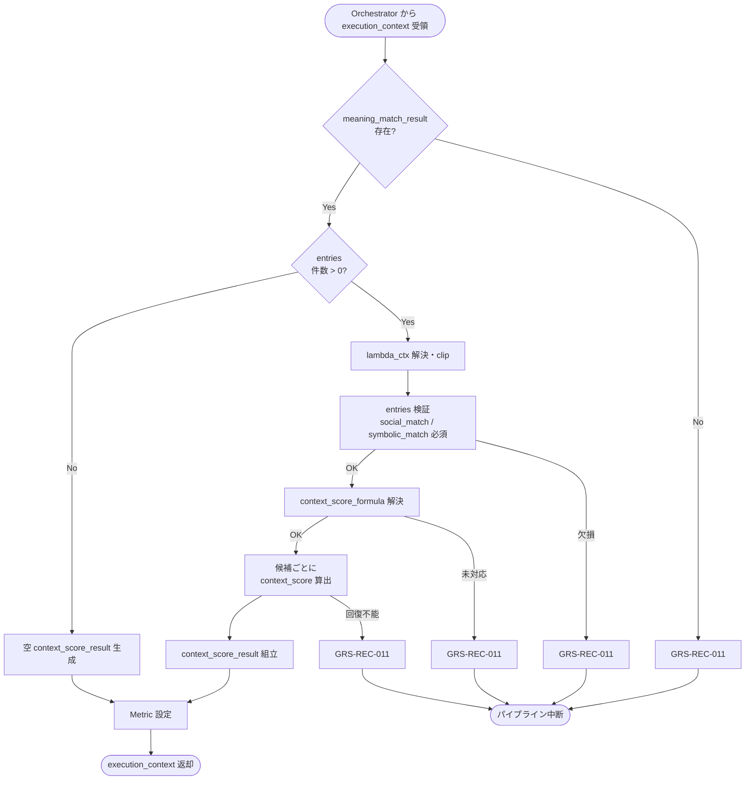

# Context Scorer モジュール仕様書

## 1. ドキュメント情報

| 項目           | 内容                                       |
| -------------- | ------------------------------------------ |
| ドキュメントID | `MOD-RECO-016`                             |
| ドキュメント名 | Context Scorer モジュール仕様書            |
| 対象システム   | Gift Recommendation Service（`apps/reco`） |
| MVP対象        | `○`                                        |
| 作成日         | 2026-07-03                                 |
| 更新日         | 2026-07-03                                 |

---

## 2. 概要

Context Scorer（文脈スコア算出）は、Reco オンライン推薦パイプラインの **Matching フェーズ末尾**において、`MOD-RECO-001` Recommendation Orchestrator から `execution_context` を **1 回**受け取り、`MOD-RECO-015` Meaning Match Aggregator が算出した **`meaning_match_result`**（候補ごとの `social_match` / `symbolic_match`）と、Run 単位の **`lambda_ctx`**（`MOD-RECO-009` User Context Builder が算出済み）を入力として、候補商品ごとに **Context Score**（`context_score`）を算出し、`context_score_result` として `execution_context` へ返却するモジュールである。`MOD-RECO-015` 完了後、**`MOD-RECO-017` Popularity Scorer の直前**（Matching フェーズ最終ステップ）に Orchestrator から呼び出される。

本モジュールは **`lambda_ctx` による Social / Symbolic 加重統合**に責務を限定し、`lambda_ctx` 算出（`MOD-RECO-009`）、Feature 単位一致度（`MOD-RECO-014`）、Social / Symbolic 集約（`MOD-RECO-015`）、Ranking 減点（`avoid_risk` / `risk_penalty` / `final_score` 等）は行わない。Context Score 算出式の正本は **Matching定義書** §9 を正とする。

**命名注記**: Recoモジュール一覧 §6.15 / §8.1 では出力論理名を **`context_score`** と略記する。機能×モジュール対応表・処理構成定義書では候補別集合を **`context_score_result`** と呼ぶ。本仕様書・`execution_context` フィールド名は **`context_score_result`** を正とし、各候補エントリ内に `context_score` を格納する（§6.2.2）。

---

## 3. 目的

- `apps/reco` における Context Scorer 実装・単体テストの前提を定義する
- Orchestrator との I/F（`execution_context` 入出力）、失敗時のパイプライン中断（`GRS-REC-011`）を後続実装可能な粒度で整理する
- `meaning_match_result` と `lambda_ctx` から `context_score` への統合式・境界値・入力異常方針を明確化する
- Recoモジュール一覧・Matching定義書・Ranking定義書・`MOD-RECO-001` / `009` / `015` / `017` 仕様書との整合を担保する

---

## 4. モジュール基本情報

| 項目 | 内容 |
| ---- | ---- |
| モジュールID | `MOD-RECO-016` |
| モジュール名 | 文脈スコア算出 |
| 物理名 | `Context Scorer` |
| 分類 | Matching |
| 処理種別 | `OL` |
| 配置予定 | `apps/reco/src/reco/application/context-scorer/**` |
| 所属Epic | `MOD-RECO-016`（Epic Issue #918） |
| MVP対象 | `○` |
| 主な呼び出し元 | `MOD-RECO-001` Recommendation Orchestrator |
| 主な呼び出し先 | なし（純粋計算モジュール） |

`MOD-API-*` / `MOD-RECO-*` / `MOD-BATCH-*` 配下の Task では、該当モジュール ID の責務範囲に変更を限定する。`MOD-RECO-*` では `apps/reco/src/reco/api/**` の API-INT エンドポイント層を対象に含めない。

---

## 5. 責務

### 5.1 主責務

- `MOD-RECO-015` 完了後、Orchestrator から **1 回**呼び出され、`execution_context.meaning_match_result` に含まれる候補ごとの `social_match` / `symbolic_match` と Run 単位の **`lambda_ctx`** を入力として **Context Score** を算出する
- 候補ごとに **`context_score_result`**（`context_score`、メタデータ）を組み立て、`execution_context` へ返却し **`MOD-RECO-017`** 以降（Ranking フェーズ）へ引き渡す
- **`lambda_ctx`** を **使用のみ**行い、Social Match と Symbolic Match の **統合重み**として Context Score に反映する（Matching定義書 §4.5 / §9）
- 入力候補の **処理順序**（`meaning_match_result.entries[]` の順序）を維持する
- 成功時に **Matching フェーズ向け Metric**（§12.1）を Orchestrator / `MOD-RECO-025` 経由で依頼する
- 回復不能失敗時 **`GRS-REC-011`** を Orchestrator へ返却し、パイプライン中断を促す

### 5.2 対象外責務

- `API-INT-002` エンドポイント層
- `MOD-RECO-001` Orchestrator の実行順序制御・Phase Log 契機の物理実装
- **`lambda_ctx`（`λ_ctx`）算出**（`MOD-RECO-009` 責務。本モジュールは **参照のみ**）
- **`user_meaning` テーブル INSERT / UPDATE**（`MOD-RECO-009` 責務）
- **Feature 単位距離・一致度の算出**（`MOD-RECO-014` 責務）
- **Social / Symbolic 集約**（`MOD-RECO-015` 責務。本モジュールは `meaning_match_result` のみ参照）
- **Ranking 減点**（`popularity_score` / `risk_penalty` / `final_score` / `rank` 等。`MOD-RECO-017`〜`020` 責務）
- **`match_reason_basis` / strong_match / weak_match 判定**（Matching定義書 §12.2〜§12.3。推薦理由生成は `MOD-RECO-023` 責務）
- **`context_score_result` の正本 DB 永続化**（MVP では Run 内メモリ。`recommendation_result_item.context_score` への反映は `MOD-RECO-021` 責務）
- Phase Log `matching_completed` の **最終記録**（Matching フェーズ `014`〜`016` 完了後に Orchestrator が記録。§12）
- OpenAPI / DB schema 変更

---

## 6. 入出力

### 6.1 入力（Orchestrator → 本モジュール）

| 入力 | 型 / 構造 | 必須 | 生成元 | 用途 | 備考 |
| ---- | --------- | ---- | ------ | ---- | ---- |
| `execution_context` | パイプライン実行コンテキスト | `true` | `MOD-RECO-001` | 処理起点 | |
| `execution_context.meaning_match_result` | 候補別 Meaning Match 結果集合 | `true` | `MOD-RECO-015` | Context Score 算出入力 | §6.2.1 |
| `execution_context.user_meaning.lambda_ctx` | `number` | `true` | `MOD-RECO-009` | Social / Symbolic 統合重み | 0.0〜1.0。§6.2.3 |
| `execution_context.config_versions` | Config 群 | `true` | `MOD-RECO-003` | `context_score_formula` 解決 | §8.3.2 |
| `execution_context.run_id` | `uuid` | `true` | `MOD-RECO-002` | ログ相関 | |

**`lambda_ctx` 参照優先順（MVP）**

| 優先 | フィールド | 備考 |
| --: | ---------- | ---- |
| 1 | `execution_context.user_meaning.lambda_ctx` | **正本**（`009` 設定・DB `user_meaning.lambda_ctx` と一致） |
| 2 | `execution_context.user_context.lambda_ctx` | `009` 出力。通常は 1 と同一 |
| 3 | 防御的フォールバック | 両方欠落時 **`0.5` 固定** + warning（Matching定義書 §16.1。通常は `009` 成功時に到達しない） |

**前提**: `MOD-RECO-015` が完了済み（Orchestrator 論理順序 15 まで）。`meaning_match_result.entries` に **1 件以上**あることが Orchestrator 呼び出し前提（§8.3.5）。

**空入力（防御的）**: `meaning_match_result.entries` が空の場合、本モジュールは **空 `context_score_result` を返却し成功**とする（`GRS-REC-011` にしない）。通常は Orchestrator が **`MOD-RECO-016` を呼ばず早期 0 件終了**する（`MOD-RECO-015` §16.1 No.7 / `MOD-RECO-014` §16.1 No.8）。

### 6.2 出力（本モジュール → Orchestrator / 後続）

| 出力 | 型 / 構造 | 利用先 | 用途 | 備考 |
| ---- | --------- | ------ | ---- | ---- |
| `execution_context.context_score_result` | 候補別 Context Score 結果集合 | `MOD-RECO-017`〜`021` | Ranking / Result 入力 | §6.2.2 |
| `context_scorer_candidate_count` | `number` | Orchestrator / `MOD-RECO-025` | 算出完了候補数 | 0 件も正常 |
| `lambda_ctx_applied` | `number` | Orchestrator / Metric | 本 Run で使用した `lambda_ctx` | Run 単位 |
| `reco_error` | 標準化 reco エラー | Orchestrator | 失敗時 | `GRS-REC-011` |

#### 6.2.1 `meaning_match_result`（入力・参照）

`MOD-RECO-015` モジュール仕様書 §6.2.2 を正とする。本モジュールは以下を **読み取りのみ**使用する。

| フィールド | 必須 | 内容 |
| ---------- | ---- | ---- |
| `entries[]` | `true` | 候補ごとの Meaning Match 結果 |
| `entries[].item_id` | `true` | 候補商品 ID |
| `entries[].social_match` | `true` | Social 系一致度（0.0〜1.0） |
| `entries[].symbolic_match` | `true` | Symbolic 系一致度（0.0〜1.0） |
| `entries[].matching_config_id` | `true` | Matching ロジック version（結果へエコー可） |
| `total_aggregated` | `true` | `entries` 件数（整合検証用） |

本モジュールは `meaning_match_result` を **変更せず**、`execution_context` に残す（読み取り専用）。

#### 6.2.2 `context_score_result`（MVP 概要）

`execution_context` フィールド名は **`context_score_result`**。ドメイン型は **`ContextScoreResult`**（配置: `apps/reco/src/reco/application/context-scorer/models.py` または `domain/**`。実装 Task で最終配置を確定）。論理上は以下を含む。

| フィールド | 必須 | 内容 |
| ---------- | ---- | ---- |
| `entries[]` | `true` | 候補ごとの Context Score 結果 |
| `entries[].item_id` | `true` | 候補商品 ID（入力と 1:1） |
| `entries[].context_score` | `true` | Context Score（0.0〜1.0） |
| `entries[].context_score_formula` | `true` | MVP: `lambda_ctx_weighted` 固定 |
| `entries[].calculated_at` | `true` | 算出日時（UTC） |
| `entries[].matching_config_id` | `true` | 入力 `meaning_match_result` からエコー |
| `lambda_ctx_applied` | `true` | 本 Run で clip 適用後に使用した `lambda_ctx` |
| `total_scored` | `true` | `entries` 件数 |

**social_match / symbolic_match の再格納**: 候補ごとの `social_match` / `symbolic_match` は **`execution_context.meaning_match_result`** を正本とする。本モジュールは `context_score` のみを追加する（§6.2.4）。

#### 6.2.3 `lambda_ctx`（入力・Run 単位）

Matching定義書 §4.5 / §9.3 および `MOD-RECO-009` モジュール仕様書 §6.2 を正とする。

| 項目 | 内容 |
| ---- | ---- |
| 意味 | Social Match と Symbolic Match の **統合重み**（贈答リスク許容度） |
| 値域 | **0.0〜1.0**（`0.0` = Social 重視、`1.0` = Symbolic 重視） |
| 算出元 | **`MOD-RECO-009`**（本モジュールでは **再算出しない**） |
| Run 内一貫性 | 全候補で **同一 `lambda_ctx`** を使用する |
| DB 正本 | `user_meaning.lambda_ctx`（`009` INSERT 済み） |

#### 6.2.4 スコア内訳の参照先（Ranking / Result 用途）

| 用途 | 参照先 | 備考 |
| ---- | ------ | ---- |
| Context Score（OL Run 内） | `execution_context.context_score_result.entries[].context_score` | 本モジュール出力 |
| Social / Symbolic Match | `execution_context.meaning_match_result.entries[]` | **`MOD-RECO-015` 正本** |
| `lambda_ctx` | `context_score_result.lambda_ctx_applied` または `execution_context.user_meaning.lambda_ctx` | Run 単位 |
| 最終 Result 永続化 | `recommendation_result_item.context_score` / `score_breakdown_json` | **`MOD-RECO-021` 責務** |

**0 件の扱い**: 入力 `entries` 0 件は **成功**（空 `context_score_result`）。Orchestrator は通常 **`015` 完了時点で `016` 以降を呼ばない**（`MOD-RECO-015` §16.1 No.7）。

---

## 7. 依存関係

### 7.1 依存モジュール

| 依存先 | 方向 | 用途 | 失敗時 | 備考 |
| ------ | ---- | ---- | ------ | ---- |
| `MOD-RECO-001` | 被呼び出し | Matching フェーズ契機 | — | `015` 直後・`017` 直前 |
| `MOD-RECO-015` | 間接 | `meaning_match_result` | 未到達 | 入力正本 |
| `MOD-RECO-009` | 間接 | `lambda_ctx` | 未到達 | **算出は `009`、本モジュールは参照のみ** |
| `MOD-RECO-003` | 間接 | `config_versions` / `context_score_formula` | 未到達 | §8.3.2 |
| `MOD-RECO-017` | 下位利用 | `context_score_result` | — | Ranking 入力 |
| `MOD-RECO-019` / `021` | 下位利用 | `context_score` | — | Final Score / Result 構築 |
| `MOD-RECO-025` | 間接 | Context Score 分布 Metric | — | §12.1 |
| `MOD-RECO-028` / `025` / `024` | 間接 | 観測・エラー | — | Orchestrator 経由 |

**下位利用**: `MOD-RECO-017` Popularity Scorer / `MOD-RECO-019` Final Score Calculator が `context_score_result` を入力とする。Ranking定義書 §4.2 では `context_score` を **最重要入力**とする。

### 7.2 参照データ

| データ | 参照元 | 用途 | version / config | 備考 |
| ------ | ------ | ---- | ---------------- | ---- |
| `meaning_match_result` | `execution_context`（`MOD-RECO-015` 出力） | 算出入力 | Run 内メモリ | DB 参照なし |
| `lambda_ctx` | `execution_context.user_meaning`（`MOD-RECO-009` 出力） | 統合重み | Run 固定 | DB 参照なし（Run 内メモリ正本） |
| `context_score_formula` | `config_versions`（`MOD-RECO-003` 解決） | 算出式識別 | `matching_config_id` 紐づけ | §8.3.2 |

本モジュールは **DB を直接参照しない**（純粋計算）。

---

## 8. 処理仕様

### 8.1 処理フロー



**注記（Orchestrator 呼び出し）**: 下図は本モジュールが Orchestrator から呼び出された場合の内部処理を示す。`meaning_match_result.entries` が空（Matching 対象 0 件）のとき、Orchestrator は通常 **本モジュールを呼ばず**、`MOD-RECO-016` 以降をスキップして早期 0 件終了する（`MOD-RECO-015` §8.1 注記 / §16.1 No.7）。下図の `CHECK_E` → `EMPTY` 分岐は、万一呼び出された場合の **防御的フォールバック**である。

### 8.2 処理ステップ

| No | 処理 | 入力 | 出力 | 補足 |
| --: | ---- | ---- | ---- | ---- |
| 1 | 入力検証 | `execution_context` | — | `meaning_match_result` 必須 |
| 2 | 空入力判定 | `entries[]` | — | 0 件は Step 7 へ（空 output） |
| 3 | `lambda_ctx` 解決 | `user_meaning` / `user_context` | `lambda_ctx_applied` | §6.2.3・§8.3.3 |
| 4 | エントリ検証 | 各 `entries[]` | — | `social_match` / `symbolic_match` 欠損時 `GRS-REC-011` |
| 5 | 算出式解決 | `config_versions` / `matching_config_id` | `context_score_formula` | §8.3.2。MVP は `lambda_ctx_weighted` のみ |
| 6 | 候補ごと算出 | `social_match` / `symbolic_match` / `lambda_ctx` | `context_score` | §8.3.1 |
| 7 | 結果組立 | 中間結果 | `context_score_result` | §6.2.2 |
| 8 | 観測値設定 | 件数 | `context_scorer_candidate_count` 等 | Orchestrator へ |

**候補処理順（MVP）**: `meaning_match_result.entries[]` の **入力順序を維持**する（`MOD-RECO-015` 出力順＝Retrieval 類似度順）。

### 8.3 アルゴリズム / 計算仕様

Context Score 算出式の正本は **Matching定義書** §9。本モジュールは **統合のみ**を実装し、Ranking 減点は **`MOD-RECO-017`〜`020`** に委譲する。

#### 8.3.1 Context Score（MVP 必須）

| 項目 | 内容 |
| ---- | ---- |
| 算出式識別子 | **`lambda_ctx_weighted`**（`matching_config.context_score_formula`） |
| 入力 | `social_match` / `symbolic_match`（候補ごと）、`lambda_ctx`（Run 単位） |
| 値域 | **0.0〜1.0**（入力が 0.0〜1.0 かつ `lambda_ctx` を clip した場合） |
| `context_score_formula` | MVP: **`lambda_ctx_weighted`** 固定 |

**MVP 採用式**（Matching定義書 §9.2 準拠）:

```text
context_score
= (1.0 - lambda_ctx) * social_match
+ lambda_ctx * symbolic_match
```

**guard_clip（MVP）**:

```text
lambda_ctx = guard_clip(lambda_ctx, 0.0, 1.0)
social_match = guard_clip(social_match, 0.0, 1.0)
symbolic_match = guard_clip(symbolic_match, 0.0, 1.0)

context_score = (1.0 - lambda_ctx) * social_match + lambda_ctx * symbolic_match
context_score = guard_clip(context_score, 0.0, 1.0)
result = round_to_scale(context_score, 6)   # recommendation_result_item.context_score 列整合（numeric(8,6)）
```

**算出例**（Matching定義書 §9.4 準拠）:

```text
social_match = 0.82
symbolic_match = 0.70
lambda_ctx = 0.40

context_score
= (1.0 - 0.40) * 0.82 + 0.40 * 0.70
= 0.60 * 0.82 + 0.40 * 0.70
= 0.492 + 0.280
= 0.772
```

#### 8.3.2 `context_score_formula`（`matching_config` 参照）

| 項目 | 内容 |
| ---- | ---- |
| 解決キー | `meaning_match_result.entries[].matching_config_id`（Run 内で一貫していること） |
| 取得元 | `execution_context.config_versions` に `MOD-RECO-003` が解決済みの Matching 設定（`context_score_formula`） |
| MVP 対応式 | **`lambda_ctx_weighted` のみ** |
| 未対応 formula | **`GRS-REC-011`**（Run 内で式が解決できない、または未サポートの場合） |
| formula 欠損 | MVP では **`lambda_ctx_weighted` を暗黙デフォルト**として使用してよい（`matching_config_テーブル定義書` seed 準拠） |

**MVP 初期 seed**:

```json
{
  "context_score_formula": "lambda_ctx_weighted"
}
```

#### 8.3.3 `lambda_ctx` 参照・clip 方針

| ケース | MVP 方針 |
| ------ | -------- |
| `user_meaning.lambda_ctx` 存在（正常） | その値を **clip 後使用**。`009` 算出値を信頼 |
| `user_context.lambda_ctx` のみ存在 | clip 後使用 + **warning**（`user_meaning` 欠落は不整合） |
| 両方欠落 | **`0.5` 固定** + warning（Matching定義書 §16.1。パイプライン継続） |
| `lambda_ctx` NaN / ±Inf | **`GRS-REC-011`**（`009` 段階で除外済みのはず。防御的に失敗） |
| `lambda_ctx` 値域外 | **clip**（0.0 / 1.0）後に使用。warn ログ + Metric |

**再算出禁止**: 本モジュールは `relationship` / `occasion` / `user_feature` 等から **`lambda_ctx` を再算出してはならない**（`MOD-RECO-009` 責務）。

#### 8.3.4 入力異常・境界値

| ケース | MVP 方針 |
| ------ | -------- |
| `meaning_match_result` 不在 | **`GRS-REC-011`**（Matching 不可） |
| `entries` 内の `social_match` / `symbolic_match` 欠損 | **`GRS-REC-011`**（`015` 出力不整合。本モジュールでは補完しない） |
| `social_match` / `symbolic_match` が 0.0〜1.0 外 | **clip** 後に算出。warn ログ + Metric（`context_score_value_out_of_range_count`） |
| `entries` 0 件 | **成功**（空 `context_score_result`）。通常は Orchestrator が本モジュールを **呼ばない** |
| 未対応 `context_score_formula` | **`GRS-REC-011`** |
| 内部計算エラー | **`GRS-REC-011`** |

**補完方針**: Feature 欠損時の中立値 `0.5` 補完は **`MOD-RECO-014` で完了済み**（Matching定義書 §16.2）。Social / Symbolic 集約は **`MOD-RECO-015` で完了済み**。本モジュールは `015` 出力を信頼し、match 値の再補完・再集約を行わない。

#### 8.3.5 Orchestrator Port 契約（MVP）

| 項目 | 内容 |
| ---- | ---- |
| 呼び出し | `score_context(execution_context) -> execution_context`（名称は実装 Task で確定） |
| 成功 | `context_score_result` / `context_scorer_candidate_count` / `lambda_ctx_applied` が設定される |
| 成功（算出対象 0 件） | 空 `context_score_result` で **成功**（防御的。通常は Orchestrator が呼ばない） |
| 失敗 | `GRS-REC-011`。`017` 以降は呼ばれない |
| Phase Log | **`matching_completed` は Matching フェーズ（`014`〜`016`）完了後に Orchestrator が記録**（§12） |
| Wiring | Matching フェーズ（`014`〜`016`）は **未配線（スタブ）**（MOD-RECO-001 §8.4.2） |

---

## 9. データ項目マッピング

| 入力項目 | 内部項目 | 出力項目 | 変換内容 | 備考 |
| -------- | -------- | -------- | -------- | ---- |
| `meaning_match_result.entries[].item_id` | 候補キー | `context_score_result.entries[].item_id` | 1:1 エコー | 順序維持 |
| `entries[].social_match` | `social_match` | — | §8.3.1 算出入力 | 正本は `meaning_match_result` |
| `entries[].symbolic_match` | `symbolic_match` | — | §8.3.1 算出入力 | 同上 |
| `user_meaning.lambda_ctx`（等） | `lambda_ctx` | `lambda_ctx_applied` | clip 適用 | Run 単位 |
| — | 算出 | `entries[].context_score` | §8.3.1 加重和 | |
| `entries[].matching_config_id` | Matching version | `entries[].matching_config_id` | エコー | 再現性 |
| — | 固定 | `entries[].context_score_formula` | `lambda_ctx_weighted` | MVP |
| — | 算出 | `context_scorer_candidate_count` | `entries` 件数 | Metric |

---

## 10. 状態・例外

### 10.1 状態

本モジュールは **ステートレス**（Run 内 1 回呼び出し）。

| 状態 | 意味 | 遷移条件 | 記録先 |
| ---- | ---- | -------- | ------ |
| — | モジュール内部状態なし | — | — |

### 10.2 例外

| 例外 | Error Code | 発生条件 | 呼び出し元への返却 | ログ |
| ---- | ---------- | -------- | ------------------ | ---- |
| Context Score 算出失敗 | `GRS-REC-011` | `meaning_match_result` 欠損・match 欠損・未対応 formula・内部エラー | 500 系・中断 | Error Log + Phase failed |
| 算出対象 0 件 | — | 入力 `entries` 0 件 | **成功**（空 output）。通常は Orchestrator が **`016` を呼ばない** | `context_scorer_candidate_count = 0` |
| `lambda_ctx` 欠落（警告） | —（継続） | `user_meaning` / `user_context` 両方欠落 | パイプライン継続（`0.5` 使用） | **warning** を Error Log |

**リトライ**: モジュール内自動リトライ **なし**（MVP）。

Error Code の正本はエラーコード定義書。Orchestrator は `MOD-RECO-024` 経由で標準化結果を呼び出し元へ伝播する。

---

## 11. DB / 永続化

### 11.1 書き込み

| テーブル | 操作 | 備考 |
| -------- | ---- | ---- |
| 正本テーブル | **なし** | 純粋計算モジュール |
| `context_score_result` 永続 | **MVP なし** | Run 内メモリ + Metric サマリ |

### 11.2 読み取り

| テーブル | 操作 | 用途 |
| -------- | ---- | ---- |
| — | — | DB 参照なし |

**方針**: 入力は `execution_context.meaning_match_result` / `user_meaning.lambda_ctx`（Run 内メモリ）のみ。`recommendation_result_item.context_score` への永続化は **`MOD-RECO-021` Recommendation Result Builder** 責務（`recommendation_result_item_テーブル定義書` §6）。

---

## 12. ログ・メトリクス

| 種別 | 内容 | タイミング | 保存先 | 備考 |
| ---- | ---- | ---------- | ------ | ---- |
| Phase Log | `matching_completed` | Matching フェーズ（`014`〜`016`）**全体成功後** | `phase_log`（`MOD-RECO-028`） | **本モジュール単独では記録しない**。Orchestrator 管轄 |
| Metric | `context_scorer_candidate_count` 等 | 成功 | Metric Logger（`MOD-RECO-025`） | §12.1 |
| Error Log | `GRS-REC-011` | 失敗 | `error_log`（`MOD-RECO-029`） | |
| 構造化ログ | 算出サマリ（件数・`lambda_ctx_applied`・duration_ms） | 成功 / 警告 | アプリログ | `trace_id` 必須。候補ごとの score 全量ダンプ禁止 |

### 12.1 メトリクス

| Metric | 内容 | 集計単位 | 用途 |
| ------ | ---- | -------- | ---- |
| `context_scorer_candidate_count` | Context Score 算出完了候補数 | Run | 候補数推移 |
| `context_scorer_latency_ms` | 本モジュール処理時間 | Run | 性能監視（Matching 一括 500ms 上限の内訳） |
| `context_score_distribution` | `context_score` 分布 | Run | ログ・Observability設計書 §11.2 |
| `context_score_value_out_of_range_count` | clip 適用件数 | Run | 入力異常監視 |
| `lambda_ctx_applied` | 使用した `lambda_ctx` | Run | 意味空間メトリクス（`lambda_ctx_distribution` と整合） |

**Matching フェーズ Metric（共有）**: `matching_latency_ms` / `social_match_distribution` / `symbolic_match_distribution` 等はログ・Observability設計書 §11.2 に従い、Matching フェーズ全体（`014`〜`016`）または Metric Logger 側で集約してよい。

---

## 13. 性能・非機能

| 観点 | 方針 |
| ---- | ---- |
| レイテンシ | モジュール単体 hard timeout は設けない。Matching 一括（`014`〜`016`）**hard 500ms** 上位ガード（MOD-RECO-001 §13.2） |
| 計算量 | 候補件数 O(n) × 定数時間加重和。n ≤ `candidate_limit`。DB 参照なし |
| タイムアウト | 上位 Orchestrator に従う |
| リトライ | なし |
| キャッシュ | Run 横断キャッシュなし（MVP） |
| 並列実行 | 同一 Run 内 1 回・同期実行 |
| 0 件早期終了 | 通常は Orchestrator が `015` 完了時に `016` 以降を呼ばない（`MOD-RECO-015` §16.1 No.7） |

---

## 14. テスト観点

| No | 観点 | 確認内容 | 種別 |
| --: | ---- | -------- | ---- |
| 1 | 正常系（基本算出） | Matching定義書 §9.4 の例と `context_score` が一致すること | unit |
| 2 | 正常系（Social 重視） | `lambda_ctx = 0.0` のとき `context_score = social_match` になること | unit |
| 3 | 正常系（Symbolic 重視） | `lambda_ctx = 1.0` のとき `context_score = symbolic_match` になること | unit |
| 4 | 正常系（バランス） | `lambda_ctx = 0.5` のとき `(social_match + symbolic_match) / 2` と一致すること | unit |
| 5 | 正常系（候補複数） | 候補ごとに `entries[]` が生成され入力順が維持されること | unit |
| 6 | `lambda_ctx` 参照 | `user_meaning.lambda_ctx` が clip 後に全候補へ適用されること | unit |
| 7 | 境界値（完全一致） | 全 match = 1.0 のとき `context_score = 1.0` | unit |
| 8 | 境界値（最大不一致） | 全 match = 0.0 のとき `context_score = 0.0` | unit |
| 9 | `meaning_match_result` 欠損 | `GRS-REC-011` になること | unit |
| 10 | match 欠損 | `social_match` / `symbolic_match` 欠損時 `GRS-REC-011` になること | unit |
| 11 | 入力 0 件 | 成功・空 `context_score_result`・`GRS-REC-011` にならないこと | unit |
| 12 | 値域外 match / lambda_ctx | clip 後に算出され Metric が記録されること | unit |
| 13 | `lambda_ctx` 両方欠落 | `0.5` 使用で成功・warning 記録されること | unit |
| 14 | `lambda_ctx` NaN / ±Inf | `GRS-REC-011` になること | unit |
| 15 | 未対応 formula | `context_score_formula` が未サポートの場合 `GRS-REC-011` になること | unit |
| 16 | Orchestrator 連携 | `015` 後 1 回呼び出し・失敗時 `017` 未到達 | integration |
| 17 | 責務境界 | `lambda_ctx` 再算出 / Social・Symbolic 再集約 / Ranking 減点を行わないこと | unit |
| 18 | Metric | `context_scorer_*` / `context_score_distribution` が記録されること | integration |
| 19 | ログ | `trace_id` あり・score 全量ダンプ・secret なし | unit |
| 20 | `meaning_match_result` 不変 | 入力 `meaning_match_result` が変更されないこと | unit |

---

## 15. 変更管理

### 15.1 変更履歴

| 日付 | 変更内容 | 関連 Issue / PR |
| ---- | -------- | --------------- |
| 2026-07-03 | 初版作成 | Issue #919 |

---

## 16. 未決事項

| No | 論点 | 判断が必要な理由 | 判断者 | 期限 | 備考 |
| --: | ---- | ---------------- | ------ | ---- | ---- |
| - | なし | - | - | - | MVP 着手前論点は §16.1 へ移管済み |

### 16.1 確定済み論点

| No | 論点 | 確定内容 |
| --: | ---- | -------- |
| 1 | 算出式 | MVP は **`lambda_ctx_weighted`**（Matching定義書 §9.2） |
| 2 | 出力フィールド名 | **`execution_context.context_score_result`**（Reco一覧の論理名 `context_score` はエントリ内フィールド） |
| 3 | 入力正本 | **`execution_context.meaning_match_result`**（`015`）+ **`execution_context.user_meaning.lambda_ctx`**（`009`） |
| 4 | `lambda_ctx` 算出 | **本モジュール scope 外**（`MOD-RECO-009` 責務。本モジュールは **参照・clip のみ**） |
| 5 | Social / Symbolic 再集約 | **行わない**（`MOD-RECO-015` 出力を信頼） |
| 6 | Phase Log | **`matching_completed` は `014`〜`016` 完了後に Orchestrator が記録** |
| 7 | 0 件早期終了 | Matching 対象 0 件時、Orchestrator は通常 **`016` 以降を呼ばない**（`MOD-RECO-015` §16.1 No.7） |
| 8 | DB 参照 | 本モジュールは **DB を直接参照しない** |
| 9 | `context_score_formula` | **`matching_config` 参照**。MVP 対応は **`lambda_ctx_weighted` のみ**（§8.3.2） |
| 10 | `lambda_ctx` 欠落時 | **防御的 `0.5` 固定** + warning（Matching定義書 §16.1。`009` 正常完了時は通常到達しない） |
| 11 | スコア精度 | **`round_to_scale(..., 6)`**（`recommendation_result_item.context_score` の `numeric(8,6)` と整合） |

---

## 17. 関連資料

| 種別 | パス | 用途 |
| ---- | ---- | ---- |
| Recoモジュール一覧 | `docs/05_アプリケーション設計/アプリ/reco/Recoモジュール一覧.md` | §6.15 |
| モジュール一覧 | `docs/05_アプリケーション設計/アプリ/モジュール一覧.md` | Matching 分類 |
| 機能×モジュール対応表 | `docs/05_アプリケーション設計/アプリ/機能×モジュール対応表.md` | `context_score` |
| Matching定義書 | `docs/04_ドメインモデル設計/Matching定義書.md` | Context Score 算出式・`lambda_ctx` |
| Ranking定義書 | `docs/04_ドメインモデル設計/Ranking定義書.md` | `context_score` 利用方針 |
| matching_config テーブル定義書 | `docs/06_実装設計/database/matching_config_テーブル定義書.md` | `context_score_formula` |
| user_meaning テーブル定義書 | `docs/06_実装設計/database/user_meaning_テーブル定義書.md` | `lambda_ctx` 保持方針 |
| recommendation_result_item テーブル定義書 | `docs/06_実装設計/database/recommendation_result_item_テーブル定義書.md` | `context_score` 永続化 |
| MOD-RECO-001 | `docs/06_実装設計/reco/MOD-RECO-001_Recommendation Orchestratorモジュール仕様書.md` | 呼び出し・`GRS-REC-011` |
| MOD-RECO-009 | `docs/06_実装設計/reco/MOD-RECO-009_User Context Builderモジュール仕様書.md` | `lambda_ctx` 算出・入力正本 |
| MOD-RECO-015 | `docs/06_実装設計/reco/MOD-RECO-015_Meaning Match Aggregatorモジュール仕様書.md` | 直前モジュール・入力正本 |
| MOD-RECO-003 | `docs/06_実装設計/reco/MOD-RECO-003_Config Version Resolverモジュール仕様書.md` | `config_versions` / `matching_config_id` 解決 |
| MOD-RECO-025 | Recoモジュール一覧 §6.25 | Context Score 分布 Metric |
| リソース一覧 | `docs/05_アプリケーション設計/アプリ/database/リソース一覧.md` | Context Score |
| エラーコード定義書 | `docs/05_アプリケーション設計/アプリ/エラーコード定義書.md` | `GRS-REC-011` |
| ログ・Observability設計書 | `docs/05_アプリケーション設計/アプリ/ログ・Observability設計書.md` | Phase / Metric |
| Epic Definition | `prompts/definitions/epics/mod-reco-016-context-scorer/epic.yaml` | `allowed_paths` |

---

## 18. レビュー観点

- Recoモジュール一覧 §6.15 のモジュール名・物理名・入出力と一致している
- Matching定義書 §9 の Context Score 算出式・`lambda_ctx` 意味と一致している
- Orchestrator Port 契約（`execution_context` 入出力・`GRS-REC-011`）が MOD-RECO-001 と整合している
- `MOD-RECO-009` との責務境界（`lambda_ctx` 算出は `009`、参照のみ `016`）が明確である
- `MOD-RECO-015` との責務境界（Social / Symbolic 集約は `015`、Context Score 統合のみ `016`）が明確である
- `MOD-RECO-017` 以降との責務境界（Ranking 減点は `017`〜）が明確である
- API-INT-002 エンドポイント層を責務範囲に含めていない
- secret や `.env` 実値が含まれていない

---

## 19. 備考

- 物理配置は Epic `allowed_paths` に従い `apps/reco/src/reco/application/context-scorer/**` を第一候補とする（Epic #918 `epic_scope.allowed_paths` と整合）
- Orchestrator Wiring は Matching フェーズ（`014`〜`016`）単位で実施する（MOD-RECO-001 §8.4.2）
- Recoモジュール一覧 §6.15 の主な入力 `social_match` / `symbolic_match` / `λ_ctx` は、本仕様書では **`meaning_match_result`** + **`user_meaning.lambda_ctx`** として参照する
- Recoモジュール一覧 §6.15 の主な出力 `context_score` は、本仕様書では **`context_score_result.entries[].context_score`** として格納する
- Ranking定義書 §4.2 では `context_score` を **最重要入力**とする。本モジュールは Matching フェーズ最終ステップとしてその入力を供給する
- `lambda_ctx` の Run 内正本は **`execution_context.user_meaning.lambda_ctx`**（`009` 設定）とし、DB `user_meaning.lambda_ctx` と一致させる（再読込は MVP では行わない）
