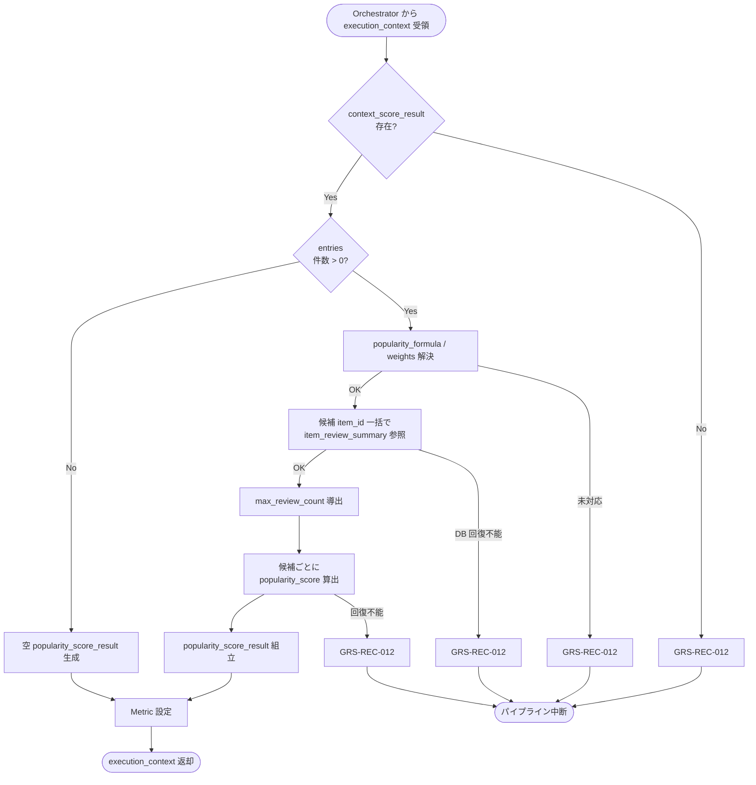

# Popularity Scorer モジュール仕様書

## 1. ドキュメント情報

| 項目           | 内容                                       |
| -------------- | ------------------------------------------ |
| ドキュメントID | `MOD-RECO-017`                             |
| ドキュメント名 | Popularity Scorer モジュール仕様書         |
| 対象システム   | Gift Recommendation Service（`apps/reco`） |
| MVP対象        | `○`                                        |
| 作成日         | 2026-07-03                                 |
| 更新日         | 2026-07-03                                 |

---

## 2. 概要

Popularity Scorer（人気補正算出）は、Reco オンライン推薦パイプラインの **Ranking フェーズ先頭**において、`MOD-RECO-001` Recommendation Orchestrator から `execution_context` を **1 回**受け取り、`MOD-RECO-016` Context Scorer が算出済みの **`context_score_result`**（候補商品 ID 集合）を起点に、候補商品ごとに **Popularity Score**（`popularity_score`）を算出し、`popularity_score_result` として `execution_context` へ返却するモジュールである。`MOD-RECO-016` 完了後、**`MOD-RECO-018` Risk Scorer の直前**（Ranking フェーズ第 1 ステップ）に Orchestrator から呼び出される。

本モジュールは **レビュー評価・レビュー件数に基づく人気補正スコアの算出**に責務を限定し、Context Score 算出（`MOD-RECO-016`）、Risk 減点（`MOD-RECO-018`）、Final Score 統合（`MOD-RECO-019`）、順位決定（`MOD-RECO-020`）、推薦理由生成（`MOD-RECO-023`）は行わない。Popularity Score 算出式の正本は **Ranking定義書** §7 を正とする。

**命名注記**: Recoモジュール一覧 §6.16 / §8.1 では出力論理名を **`popularity_score`** と略記する。機能×モジュール対応表・処理構成定義書では候補別集合を **`popularity_score_result`** と呼ぶ。本仕様書・`execution_context` フィールド名は **`popularity_score_result`** を正とし、各候補エントリ内に `popularity_score` を格納する（§6.2.2）。

---

## 3. 目的

- `apps/reco` における Popularity Scorer 実装・単体テストの前提を定義する
- Orchestrator との I/F（`execution_context` 入出力）、失敗時のパイプライン中断（`GRS-REC-012`）を後続実装可能な粒度で整理する
- レビュー情報（`item_review_summary`）から `popularity_score` への正規化式・欠損補完・境界値方針を明確化する
- Recoモジュール一覧・Ranking定義書・`item_review_summary` / `item_popularity_signal` テーブル定義書・`MOD-RECO-001` / `016` / `018` 仕様書との整合を担保する

---

## 4. モジュール基本情報

| 項目 | 内容 |
| ---- | ---- |
| モジュールID | `MOD-RECO-017` |
| モジュール名 | 人気補正算出 |
| 物理名 | `Popularity Scorer` |
| 分類 | Ranking |
| 処理種別 | `OL` |
| 配置予定 | `apps/reco/src/reco/application/popularity-scorer/**` |
| 所属Epic | `MOD-RECO-017`（Epic Issue #935） |
| MVP対象 | `○` |
| 主な呼び出し元 | `MOD-RECO-001` Recommendation Orchestrator |
| 主な呼び出し先 | Item Review Summary Repository / Popularity Signal Repository（DB アクセス層） |

`MOD-API-*` / `MOD-RECO-*` / `MOD-BATCH-*` 配下の Task では、該当モジュール ID の責務範囲に変更を限定する。`MOD-RECO-*` では `apps/reco/src/reco/api/**` の API-INT エンドポイント層を対象に含めない。

---

## 5. 責務

### 5.1 主責務

- `MOD-RECO-016` 完了後、Orchestrator から **1 回**呼び出され、`execution_context.context_score_result` に含まれる候補ごとの `item_id` を起点に **Popularity Score** を算出する
- 候補ごとに **`popularity_score_result`**（`popularity_score`、メタデータ）を組み立て、`execution_context` へ返却し **`MOD-RECO-018`** 以降（Ranking フェーズ続行）へ引き渡す
- **`item_review_summary`**（`review_average` / `review_count`）を DB から **候補一括参照**し、Run 内候補集合に対する `max_review_count` を導出して正規化に用いる（Ranking定義書 §7.2）
- 欠損時は Ranking定義書 §7.5 / §16.1 に従い **中立値で補完**し、単一候補の Popularity 欠損を **パイプライン失敗にしない**
- 成功時に **Ranking フェーズ向け Metric**（§12.1）を Orchestrator / `MOD-RECO-025` 経由で依頼する
- 回復不能失敗時 **`GRS-REC-012`** を Orchestrator へ返却し、パイプライン中断を促す

### 5.2 対象外責務

- `API-INT-002` エンドポイント層
- `MOD-RECO-001` Orchestrator の実行順序制御・Phase Log 契機の物理実装
- **Context Score 算出**（`MOD-RECO-016` 責務。本モジュールは `context_score_result` を **候補キー参照のみ**）
- **Risk 減点**（`risk_penalty`。`MOD-RECO-018` 責務）
- **Final Score 統合・重み付け**（`final_score` / `pre_rank_score`。`MOD-RECO-019` 責務。`ranking_config.ranking_weights.popularity` による **文脈別の人気重視度調整**も含む）
- **順位決定**（`rank`。`MOD-RECO-020` 責務）
- **MMR / 多様性制御**（`MOD-RECO-020` 責務）
- **`popularityBadge` 表示用表面の組立**（api / API-PUB-003 責務）
- **`popularity_score_result` の正本 DB 永続化**（MVP では Run 内メモリ。`recommendation_result_item.score_breakdown_json` への反映は `MOD-RECO-021` 責務）
- **`item_popularity_signal` の更新**（batch / BATCH-002 責務）
- **`item_review_summary` の更新**（batch / BATCH-007 責務）
- Phase Log `ranking_completed` の **最終記録**（Ranking フェーズ `017`〜`020` 完了後に Orchestrator が記録。§12）
- OpenAPI / DB schema 変更

---

## 6. 入出力

### 6.1 入力（Orchestrator → 本モジュール）

| 入力 | 型 / 構造 | 必須 | 生成元 | 用途 | 備考 |
| ---- | --------- | ---- | ------ | ---- | ---- |
| `execution_context` | パイプライン実行コンテキスト | `true` | `MOD-RECO-001` | 処理起点 | |
| `execution_context.context_score_result` | 候補別 Context Score 結果集合 | `true` | `MOD-RECO-016` | 候補キー・処理順序 | §6.2.1 |
| `execution_context.config_versions` | Config 群 | `true` | `MOD-RECO-003` | `popularity_formula` / `popularity_weights` 解決 | §8.3.2 |
| `execution_context.run_id` | `uuid` | `true` | `MOD-RECO-002` | ログ相関 | |

**前提**: `MOD-RECO-016` が完了済み（Orchestrator 論理順序 16 まで）。`context_score_result.entries` に **1 件以上**あることが Orchestrator 呼び出し前提（§8.3.5）。

**空入力（防御的）**: `context_score_result.entries` が空の場合、本モジュールは **空 `popularity_score_result` を返却し成功**とする（`GRS-REC-012` にしない）。通常は Orchestrator が **`MOD-RECO-017` を呼ばず早期 0 件終了**する（`MOD-RECO-016` §16.1 No.7 と同型）。

### 6.2 出力（本モジュール → Orchestrator / 後続）

| 出力 | 型 / 構造 | 利用先 | 用途 | 備考 |
| ---- | --------- | ------ | ---- | ---- |
| `execution_context.popularity_score_result` | 候補別 Popularity Score 結果集合 | `MOD-RECO-018`〜`021` | Ranking / Result 入力 | §6.2.2 |
| `popularity_scorer_candidate_count` | `number` | Orchestrator / `MOD-RECO-025` | 算出完了候補数 | 0 件も正常 |
| `popularity_missing_signal_count` | `number` | Orchestrator / Metric | レビュー情報欠損で中立補完した件数 | §8.3.4 |
| `reco_error` | 標準化 reco エラー | Orchestrator | 失敗時 | `GRS-REC-012` |

#### 6.2.1 `context_score_result`（入力・参照）

`MOD-RECO-016` モジュール仕様書 §6.2.2 を正とする。本モジュールは以下を **読み取りのみ**使用する。

| フィールド | 必須 | 内容 |
| ---------- | ---- | ---- |
| `entries[]` | `true` | 候補ごとの Context Score 結果 |
| `entries[].item_id` | `true` | 候補商品 ID |
| `entries[].context_score` | `true` | Context Score（本モジュールでは再計算しない） |
| `total_scored` | `true` | `entries` 件数（整合検証用） |

本モジュールは `context_score_result` を **変更せず**、`execution_context` に残す（読み取り専用）。

#### 6.2.2 `popularity_score_result`（MVP 概要）

`execution_context` フィールド名は **`popularity_score_result`**。ドメイン型は **`PopularityScoreResult`**（配置: `apps/reco/src/reco/application/popularity-scorer/models.py` または `domain/**`。実装 Task で最終配置を確定）。論理上は以下を含む。

| フィールド | 必須 | 内容 |
| ---------- | ---- | ---- |
| `entries[]` | `true` | 候補ごとの Popularity Score 結果 |
| `entries[].item_id` | `true` | 候補商品 ID（入力と 1:1） |
| `entries[].popularity_score` | `true` | Popularity Score（0.0〜1.0） |
| `entries[].popularity_formula` | `true` | MVP: `rating_review_count_weighted` 固定 |
| `entries[].rating_score` | `false` | 正規化後評価スコア（内訳・デバッグ用） |
| `entries[].review_count_score` | `false` | 正規化後件数スコア（内訳・デバッグ用） |
| `entries[].review_average_used` | `false` | 算出に使用した `review_average`（欠損補完後） |
| `entries[].review_count_used` | `false` | 算出に使用した `review_count`（欠損補完後） |
| `entries[].signal_missing` | `true` | レビュー情報が欠損し中立補完したか |
| `entries[].calculated_at` | `true` | 算出日時（UTC） |
| `entries[].ranking_config_id` | `true` | 使用した Ranking Config ID（`config_versions` からエコー） |
| `max_review_count_in_candidates` | `true` | 本 Run 候補集合内の最大レビュー件数 |
| `total_scored` | `true` | `entries` 件数 |

**`context_score` の再格納**: 候補ごとの `context_score` は **`execution_context.context_score_result`** を正本とする。本モジュールは `popularity_score` のみを追加する。

#### 6.2.3 DB 参照データ（算出入力）

MVP では以下を Popularity 算出入力とする（Ranking定義書 §4.3 / §7）。

| データ | 参照元 | 物理列 | 必須 | 備考 |
| ------ | ------ | ------ | ---- | ---- |
| Item Review Summary | `item_review_summary` | `review_average`, `review_count` | 条件付き | 行不在時は §8.3.4 で補完 |
| Item Popularity Signal | `item_popularity_signal` + `ranking_snapshot` | `rank` 等 | **MVP 算入なし** | §16.1 No.1。将来拡張 |

---

## 7. 依存関係

### 7.1 依存モジュール

| 依存先 | 方向 | 用途 | 失敗時 | 備考 |
| ------ | ---- | ---- | ------ | ---- |
| `MOD-RECO-001` | 被呼び出し | Ranking フェーズ契機 | — | `016` 直後・`018` 直前 |
| `MOD-RECO-016` | 間接 | `context_score_result` | 未到達 | 入力正本・候補順序 |
| `MOD-RECO-003` | 間接 | `config_versions` / `ranking_config_id` | 未到達 | §8.3.2 |
| `MOD-RECO-018` | 下流利用 | `popularity_score_result` | — | Ranking 続行 |
| `MOD-RECO-019` / `021` | 下流利用 | `popularity_score` | — | Final Score / Result 構築 |
| `MOD-RECO-025` | 間接 | Popularity 分布 Metric | — | §12.1 |
| `MOD-RECO-028` / `024` / `029` | 間接 | 観測・エラー | — | Orchestrator 経由 |

**下流利用**: `MOD-RECO-019` Final Score Calculator が `popularity_score_result.entries[].popularity_score` を `pre_rank_score` 算入に使用する（Ranking定義書 §9.3）。

### 7.2 参照データ

| データ | 参照元 | 用途 | version / config | 備考 |
| ------ | ------ | ---- | ---------------- | ---- |
| `context_score_result` | `execution_context`（`MOD-RECO-016` 出力） | 候補キー・順序 | Run 内メモリ | DB 参照なし |
| `item_review_summary` | DB（Repository） | レビュー評価・件数 | 最新行（item あたり 0..1） | `item_review_summary_テーブル定義書` §5.4 |
| `item_popularity_signal` | DB（IF-DB-RECO-006） | ランキング順位シグナル | 最新 Snapshot | **MVP 算入対象外**（§16.1） |
| `popularity_formula` / `popularity_weights` | `config_versions.ranking_config.parameter_json` | 算出式・重み | `ranking_config_id` 紐づけ | §8.3.2 |

---

## 8. 処理仕様

### 8.1 処理フロー



**注記（Orchestrator 呼び出し）**: `context_score_result.entries` が空（Matching 対象 0 件）のとき、Orchestrator は通常 **本モジュールを呼ばず**、`MOD-RECO-017` 以降をスキップして早期 0 件終了する（`MOD-RECO-016` §8.1 注記と同型）。下図の `CHECK_E` → `EMPTY` 分岐は防御的フォールバックである。

### 8.2 処理ステップ

| No | 処理 | 入力 | 出力 | 補足 |
| --: | ---- | ---- | ---- | ---- |
| 1 | 入力検証 | `execution_context` | — | `context_score_result` 必須 |
| 2 | 空入力判定 | `entries[]` | — | 0 件は Step 8 へ（空 output） |
| 3 | 算出式・重み解決 | `config_versions` | `popularity_formula` / weights | §8.3.2 |
| 4 | 候補 ID 抽出 | `entries[].item_id` | `item_ids[]` | 入力順序維持 |
| 5 | レビュー情報一括取得 | `item_ids[]` | `review_map` | Repository / SELECT |
| 6 | `max_review_count` 導出 | `review_map` | `max_review_count_in_candidates` | Run 内候補集合のみ |
| 7 | 候補ごと算出 | レビュー情報 / weights | `popularity_score` | §8.3.1 |
| 8 | 結果組立 | 中間結果 | `popularity_score_result` | §6.2.2 |
| 9 | 観測値設定 | 件数・欠損数 | Metric 用カウンタ | Orchestrator へ |

**候補処理順（MVP）**: `context_score_result.entries[]` の **入力順序を維持**する（`MOD-RECO-016` 出力順＝Matching パイプライン順）。

### 8.3 アルゴリズム / 計算仕様

Popularity Score 算出式の正本は **Ranking定義書** §7。本モジュールは **人気補正スコアの算出のみ**を実装し、Final Score 統合は **`MOD-RECO-019`** に委譲する。

#### 8.3.1 Popularity Score（MVP 必須）

| 項目 | 内容 |
| ---- | ---- |
| 算出式識別子 | **`rating_review_count_weighted`**（`ranking_config.parameter_json.popularity_formula`） |
| 入力 | `review_average`（`item_rating`）、`review_count`（候補ごと）、`max_review_count_in_candidates`（Run 内） |
| 値域 | **0.0〜1.0** |
| 参照 | Ranking定義書 §7.2 / §15.1 |

**MVP 採用式**（Ranking定義書 §7.2 準拠）:

```text
rating_score = item_rating / 5.0

review_count_score
= log(1 + item_review_count) / log(1 + max_review_count_in_candidates)

popularity_score
= w_rating * rating_score
+ w_review_count * review_count_score
```

**guard_clip（MVP）**:

```text
rating_score = 0.5 if item_rating is None else item_rating / 5.0
item_review_count = 0 if item_review_count is None else item_review_count

if max_review_count_in_candidates <= 0:
    review_count_score = 0.5
else:
    review_count_score = log1p(item_review_count) / log1p(max_review_count_in_candidates)

popularity_score = w_rating * rating_score + w_review_count * review_count_score
popularity_score = guard_clip(popularity_score, 0.0, 1.0)
result = round_to_scale(popularity_score, 6)
```

**算出例**（Ranking定義書 §7.2 準拠）:

```text
item_rating = 4.0
item_review_count = 120
max_review_count_in_candidates = 500
w_rating = 0.60
w_review_count = 0.40

rating_score = 4.0 / 5.0 = 0.80
review_count_score = log(121) / log(501) ≈ 0.91

popularity_score = 0.60 * 0.80 + 0.40 * 0.91 ≈ 0.844
```

#### 8.3.2 `popularity_formula` / `popularity_weights`（`ranking_config` 参照）

| 項目 | 内容 |
| ---- | ---- |
| 解決キー | `execution_context.config_versions.ranking_config_id` |
| 取得元 | `ranking_config.parameter_json`（`MOD-RECO-003` 解決済み） |
| MVP 対応式 | **`rating_review_count_weighted` のみ** |
| 未対応 formula | **`GRS-REC-012`** |
| formula 欠損 | MVP では **`rating_review_count_weighted` を暗黙デフォルト** |

**MVP 重み**（Ranking定義書 §7.3。`parameter_json.popularity_weights` 未整備時のデフォルト）:

| キー | 初期値 | 意味 |
| ---- | -----: | ---- |
| `w_rating` / `popularity_weights.rating` | `0.60` | 評価点重み |
| `w_review_count` / `popularity_weights.review_count` | `0.40` | レビュー件数重み |

**MVP 初期 seed 拡張例**（`ranking_config.parameter_json`。Ranking定義書 §13.1 準拠。seed 反映は別 Task 可）:

```json
{
  "popularity_formula": "rating_review_count_weighted",
  "popularity_weights": {
    "rating": 0.60,
    "review_count": 0.40
  }
}
```

> **注記**: 現行 `ranking_config_テーブル定義書` §6.1 の MVP seed には `popularity_weights` キーが未収載。本モジュールは **Ranking定義書 §7.3 の初期重みを暗黙デフォルト**として使用し、`parameter_json` にキーが存在する場合はそちらを優先する（§16.1 No.2）。

#### 8.3.3 DB 参照方針（`item_review_summary`）

| 項目 | 内容 |
| ---- | ---- |
| 操作 | **SELECT のみ**（候補 `item_id` IN 一括） |
| 正本 | `item_review_summary`（item あたり 0..1 行） |
| 行不在 | `review_average = None` / `review_count = 0` として §8.3.4 補完 |
| トランザクション | Run 内読み取り。本モジュールは DML しない |
| Repository | `ItemReviewSummaryRepository`（名称は実装 Task で確定） |

**Online 推薦中の更新禁止**: batch 反映済みの正本を参照する。Run 中に `item_review_summary` を更新しない（`item_review_summary_テーブル定義書` §5.4）。

#### 8.3.4 入力欠損・境界値

| ケース | MVP 方針 | パイプライン |
| ------ | -------- | ------------ |
| `context_score_result` 不在 | **`GRS-REC-012`** | 中断 |
| `entries` 0 件 | **成功**（空 output） | 継続（通常は Orchestrator が呼ばない） |
| `item_review_summary` 行不在 | `rating_score=0.5`, `review_count=0` | **継続** + `signal_missing=true` |
| `review_average` NULL | `rating_score=0.5` | **継続** |
| `review_count` 欠損 | `0` として扱う | **継続** |
| `max_review_count_in_candidates = 0` | `review_count_score=0.5` | **継続** |
| レビュー情報全体欠損（候補単位） | `popularity_score=0.5`（clip 後） | **継続**（Ranking定義書 §16.1） |
| `review_average` 値域外（0〜5 外） | clip 後に算出 + warn Metric | **継続** |
| `review_count` 負値 | **`GRS-REC-012`**（データ不整合） | 中断 |
| DB 接続 / クエリ回復不能 | **`GRS-REC-012`** | 中断 |
| 未対応 `popularity_formula` | **`GRS-REC-012`** | 中断 |
| 内部計算エラー | **`GRS-REC-012`** | 中断 |

**補完と失敗の区別**: Popularity **入力欠損**は Ranking定義書 §16.1 に従い **補完して継続**する。**インフラ障害・設定不整合・データ破損**は `GRS-REC-012` で中断する。

#### 8.3.5 Orchestrator Port 契約（MVP）

| 項目 | 内容 |
| ---- | ---- |
| 呼び出し | `score_popularity(execution_context) -> execution_context`（名称は実装 Task で確定） |
| 成功 | `popularity_score_result` / `popularity_scorer_candidate_count` が設定される |
| 成功（算出対象 0 件） | 空 `popularity_score_result` で **成功**（防御的） |
| 失敗 | `GRS-REC-012`。`018` 以降は呼ばれない |
| Phase Log | **`ranking_completed` は Ranking フェーズ（`017`〜`020`）完了後に Orchestrator が記録** |
| Wiring | Ranking フェーズ（`017`〜`020`）は **未配線（スタブ）**（MOD-RECO-001 §8.4.2） |

---

## 9. データ項目マッピング

| 入力項目 | 内部項目 | 出力項目 | 変換内容 | 備考 |
| -------- | -------- | -------- | -------- | ---- |
| `context_score_result.entries[].item_id` | 候補キー | `popularity_score_result.entries[].item_id` | 1:1 エコー | 順序維持 |
| `item_review_summary.review_average` | `item_rating` | `entries[].rating_score` | `/ 5.0`、欠損時 0.5 | DB 参照 |
| `item_review_summary.review_count` | `item_review_count` | `entries[].review_count_score` | log 正規化 | Run 内 max で除算 |
| — | `max_review_count_in_candidates` | `popularity_score_result.max_review_count_in_candidates` | 候補集合 max | Run 単位 |
| — | 算出 | `entries[].popularity_score` | §8.3.1 加重和 | |
| `config_versions.ranking_config_id` | Ranking version | `entries[].ranking_config_id` | エコー | 再現性 |
| — | 固定 | `entries[].popularity_formula` | `rating_review_count_weighted` | MVP |
| — | 欠損判定 | `entries[].signal_missing` | 行不在 / rating NULL | Metric |

---

## 10. 状態・例外

### 10.1 状態

本モジュールは **ステートレス**（Run 内 1 回呼び出し）。

| 状態 | 意味 | 遷移条件 | 記録先 |
| ---- | ---- | -------- | ------ |
| — | モジュール内部状態なし | — | — |

### 10.2 例外

| 例外 | Error Code | 発生条件 | 呼び出し元への返却 | ログ |
| ---- | ---------- | -------- | ------------------ | ---- |
| Popularity Score 算出失敗 | `GRS-REC-012` | `context_score_result` 欠損・DB 回復不能・未対応 formula・データ破損・内部エラー | 500 系・中断 | Error Log + Phase failed |
| 算出対象 0 件 | — | 入力 `entries` 0 件 | **成功**（空 output） | `popularity_scorer_candidate_count = 0` |
| Popularity 入力欠損 | —（継続） | レビュー行不在 / rating NULL | パイプライン継続（中立補完） | **warning** + Metric |

**リトライ**: モジュール内自動リトライ **なし**（MVP）。DB 一時障害のリトライ方針は実装 Task / infra 層で確定する。

Error Code の正本はエラーコード定義書。Orchestrator は `MOD-RECO-024` 経由で標準化結果を呼び出し元へ伝播する。

---

## 11. DB / 永続化

### 11.1 書き込み

| テーブル | 操作 | 備考 |
| -------- | ---- | ---- |
| 正本テーブル | **なし** | 算出結果は Run 内メモリ |

### 11.2 読み取り

| テーブル | 操作 | 用途 | 備考 |
| -------- | ---- | ---- | ---- |
| `item_review_summary` | SELECT | レビュー評価・件数 | 候補 `item_id` 一括。MVP 必須 |
| `item_popularity_signal` | SELECT（任意） | ランキング順位 | **MVP 算入対象外**（§16.1 No.1） |
| `ranking_snapshot` | SELECT（任意） | 最新 Snapshot 選択 | IF-DB-RECO-006。MVP 算入対象外 |

**方針**: `popularity_score` の Run 結果永続化は **`MOD-RECO-021` Recommendation Result Builder** が `recommendation_result_item.score_breakdown_json` 等へ反映する（`recommendation_result_item_テーブル定義書` §6）。

---

## 12. ログ・メトリクス

| 種別 | 内容 | タイミング | 保存先 | 備考 |
| ---- | ---- | ---------- | ------ | ---- |
| Phase Log | `ranking_completed` | Ranking フェーズ（`017`〜`020`）**全体成功後** | `phase_log`（`MOD-RECO-028`） | **本モジュール単独では記録しない** |
| Metric | `popularity_scorer_candidate_count` 等 | 成功 | Metric Logger（`MOD-RECO-025`） | §12.1 |
| Error Log | `GRS-REC-012` | 失敗 | `error_log`（`MOD-RECO-029`） | |
| 構造化ログ | 算出サマリ（件数・欠損数・duration_ms） | 成功 / 警告 | アプリログ | `trace_id` 必須。候補ごとの score 全量ダンプ禁止 |

### 12.1 メトリクス

| Metric | 内容 | 集計単位 | 用途 |
| ------ | ---- | -------- | ---- |
| `popularity_scorer_candidate_count` | Popularity Score 算出完了候補数 | Run | 候補数推移 |
| `popularity_scorer_latency_ms` | 本モジュール処理時間 | Run | 性能監視（Ranking 一括 1,000ms 上限の内訳） |
| `popularity_score_distribution` | `popularity_score` 分布 | Run | ログ・Observability設計書 §11.2 相当 |
| `popularity_missing_signal_count` | レビュー欠損で中立補完した件数 | Run | データ品質監視 |
| `popularity_score_value_out_of_range_count` | clip 適用件数 | Run | 入力異常監視 |

**Ranking フェーズ Metric（共有）**: `ranking_latency_ms` はログ・Observability設計書 §11.2 に従い、Ranking フェーズ全体（`017`〜`020`）または Metric Logger 側で集約してよい。

---

## 13. 性能・非機能

| 観点 | 方針 |
| ---- | ---- |
| レイテンシ | モジュール単体 hard timeout は設けない。Ranking 一括（`017`〜`020`）**hard 1,000ms** 上位ガード（MOD-RECO-001 §13.2） |
| 計算量 | 候補件数 O(n) × DB 一括参照 + 定数時間算出。n ≤ `candidate_limit` |
| DB アクセス | 候補 `item_id` **一括 SELECT**（N+1 禁止） |
| タイムアウト | 上位 Orchestrator に従う |
| リトライ | なし（MVP） |
| キャッシュ | Run 横断キャッシュなし（MVP） |
| 並列実行 | 同一 Run 内 1 回・同期実行 |

---

## 14. テスト観点

| No | 観点 | 確認内容 | 種別 |
| --: | ---- | -------- | ---- |
| 1 | 正常系（基本算出） | Ranking定義書 §15.1 の疑似コードと `popularity_score` が一致すること | unit |
| 2 | 正常系（高評価・多件数） | 高 rating / 高 review_count で score が高くなること | unit |
| 3 | 正常系（低評価・少件数） | 低 rating / 低 review_count で score が低くなること | unit |
| 4 | 正常系（候補複数） | 候補ごとに `entries[]` が生成され入力順が維持されること | unit |
| 5 | `max_review_count` | Run 内候補 max のみで正規化されること（全 catalog max ではない） | unit |
| 6 | 境界値（rating 満点） | `review_average=5.0` で `rating_score=1.0` | unit |
| 7 | 境界値（review_count=0） | `review_count_score=0`（max>0 時） | unit |
| 8 | 境界値（max_review_count=0） | `review_count_score=0.5` | unit |
| 9 | 欠損（行不在） | `popularity_score=0.5` 相当・`signal_missing=true`・**成功** | unit |
| 10 | 欠損（rating NULL） | `rating_score=0.5`・パイプライン継続 | unit |
| 11 | 入力 0 件 | 成功・空 `popularity_score_result`・`GRS-REC-012` にならないこと | unit |
| 12 | `context_score_result` 欠損 | `GRS-REC-012` になること | unit |
| 13 | 未対応 formula | `GRS-REC-012` になること | unit |
| 14 | DB 回復不能 | `GRS-REC-012` になること | integration |
| 15 | Orchestrator 連携 | `016` 後 1 回呼び出し・失敗時 `018` 未到達 | integration |
| 16 | 責務境界 | Final Score 統合 / Risk 減点 / Context Score 再算出を行わないこと | unit |
| 17 | Metric | `popularity_scorer_*` / `popularity_missing_signal_count` が記録されること | integration |
| 18 | ログ | `trace_id` あり・score 全量ダンプ・secret なし | unit |
| 19 | `context_score_result` 不変 | 入力 `context_score_result` が変更されないこと | unit |
| 20 | N+1 回避 | 候補 n 件に対し review 参照が一括であること | unit / integration |

---

## 15. 変更管理

### 15.1 変更履歴

| 日付 | 変更内容 | 関連 Issue / PR |
| ---- | -------- | --------------- |
| 2026-07-03 | 初版作成 | Issue #936 |

---

## 16. 未決事項

| No | 論点 | 判断が必要な理由 | 判断者 | 期限 | 備考 |
| --: | ---- | ---------------- | ------ | ---- | ---- |
| 1 | `item_popularity_signal.rank` の MVP 算入 | Ranking §4.3 は rank 入力を列挙するが §7.2 MVP 式は rating/count のみ。`item_popularity_signal_テーブル定義書` §5.7 も後続 Task 委譲 | Human | 実装 Task 前 | §16.1 No.1 参照 |
| 2 | `ranking_config.parameter_json` への `popularity_weights` 正式 seed 反映 | 現行 seed（`ranking_config_テーブル定義書` §6.1）にキー未収載 | Human | 実装 Task 前 | 暗黙デフォルトで着手可 |

### 16.1 確定済み論点

| No | 論点 | 確定内容 |
| --: | ---- | -------- |
| 1 | MVP 算入シグナル | **`item_review_summary.review_average` / `review_count` のみ**。`item_popularity_signal.rank` は **MVP 算入しない**（将来拡張は §16 未決 No.1） |
| 2 | 算出式 | MVP は **`rating_review_count_weighted`**（Ranking定義書 §7.2） |
| 3 | 初期重み | `w_rating=0.60` / `w_review_count=0.40`（Ranking定義書 §7.3。`parameter_json` 優先） |
| 4 | 出力フィールド名 | **`execution_context.popularity_score_result`** |
| 5 | 入力正本（候補） | **`execution_context.context_score_result`**（`016` 出力） |
| 6 | 欠損時 | **中立補完でパイプライン継続**（Ranking定義書 §7.5 / §16.1）。DB 障害のみ `GRS-REC-012` |
| 7 | Phase Log | **`ranking_completed` は `017`〜`020` 完了後に Orchestrator が記録** |
| 8 | 0 件早期終了 | Matching 対象 0 件時、Orchestrator は通常 **`017` 以降を呼ばない** |
| 9 | スコア精度 | **`round_to_scale(..., 6)`**（`recommendation_result_item` の numeric 列と整合） |
| 10 | 安全寄り文脈での人気重視 | **`popularity_score` 自体は文脈非依存**。文脈別重みは **`MOD-RECO-019` + `ranking_config.ranking_weights.popularity`**（Recoモジュール一覧 §6.16 主責務の解釈） |

---

## 17. 関連資料

| 種別 | パス | 用途 |
| ---- | ---- | ---- |
| Recoモジュール一覧 | `docs/05_アプリケーション設計/アプリ/reco/Recoモジュール一覧.md` | §6.16 |
| モジュール一覧 | `docs/05_アプリケーション設計/アプリ/モジュール一覧.md` | Ranking 分類 |
| 機能×モジュール対応表 | `docs/05_アプリケーション設計/アプリ/機能×モジュール対応表.md` | `popularity_score` |
| Ranking定義書 | `docs/04_ドメインモデル設計/Ranking定義書.md` | Popularity 算出式・欠損 |
| ranking_config テーブル定義書 | `docs/06_実装設計/database/ranking_config_テーブル定義書.md` | Ranking パラメータ |
| item_review_summary テーブル定義書 | `docs/06_実装設計/database/item_review_summary_テーブル定義書.md` | レビュー正本 |
| item_popularity_signal テーブル定義書 | `docs/06_実装設計/database/item_popularity_signal_テーブル定義書.md` | ランキング Signal（将来） |
| recommendation_result_item テーブル定義書 | `docs/06_実装設計/database/recommendation_result_item_テーブル定義書.md` | score_breakdown |
| インターフェース一覧 | `docs/05_アプリケーション設計/アプリ/インターフェース一覧.md` | IF-DB-RECO-006 |
| MOD-RECO-001 | `docs/06_実装設計/reco/MOD-RECO-001_Recommendation Orchestratorモジュール仕様書.md` | 呼び出し・`GRS-REC-012` |
| MOD-RECO-003 | `docs/06_実装設計/reco/MOD-RECO-003_Config Version Resolverモジュール仕様書.md` | `ranking_config_id` 解決 |
| MOD-RECO-016 | `docs/06_実装設計/reco/MOD-RECO-016_Context Scorerモジュール仕様書.md` | 直前モジュール・入力正本 |
| MOD-RECO-018 | Recoモジュール一覧 §6.17 | 後続 Risk Scorer |
| MOD-RECO-019 | Recoモジュール一覧 §6.18 | Final Score 利用先 |
| エラーコード定義書 | `docs/05_アプリケーション設計/アプリ/エラーコード定義書.md` | `GRS-REC-012` |
| ログ・Observability設計書 | `docs/05_アプリケーション設計/アプリ/ログ・Observability設計書.md` | Phase / Metric |
| Epic Definition | `prompts/definitions/epics/mod-reco-017-popularity-scorer/epic.yaml` | `allowed_paths` |

---

## 18. レビュー観点

- Recoモジュール一覧 §6.16 のモジュール名・物理名・入出力と一致している
- Ranking定義書 §7 の Popularity Score 算出式・欠損補完と一致している
- Orchestrator Port 契約（`execution_context` 入出力・`GRS-REC-012`）が MOD-RECO-001 と整合している
- `MOD-RECO-016` との責務境界（Context Score は `016`、Popularity は `017`）が明確である
- `MOD-RECO-018` / `019` との責務境界（Risk / Final Score は下流）が明確である
- API-INT-002 エンドポイント層を責務範囲に含めていない
- secret や `.env` 実値が含まれていない

---

## 19. 備考

- 物理配置は Epic `allowed_paths` に従い `apps/reco/src/reco/application/popularity-scorer/**` を第一候補とする（Epic #935 `epic_scope.allowed_paths` と整合）
- Orchestrator Wiring は Ranking フェーズ（`017`〜`020`）単位で実施する（MOD-RECO-001 §8.4.2）
- Recoモジュール一覧 §6.16 の主な入力 `item popularity signals` は、MVP では **`item_review_summary`（レビュー評価・件数）** として具体化する。`item_popularity_signal`（ランキング順位）は §16 未決事項
- Recoモジュール一覧 §6.16 の主な出力 `popularity_score` は、本仕様書では **`popularity_score_result.entries[].popularity_score`** として格納する
- Ranking定義書 §12.3 の優先度（`context_score > popularity_score > risk_penalty`）は **`MOD-RECO-019` の `ranking_weights`** で実現し、本モジュールは **素の `popularity_score` のみ**を供給する
