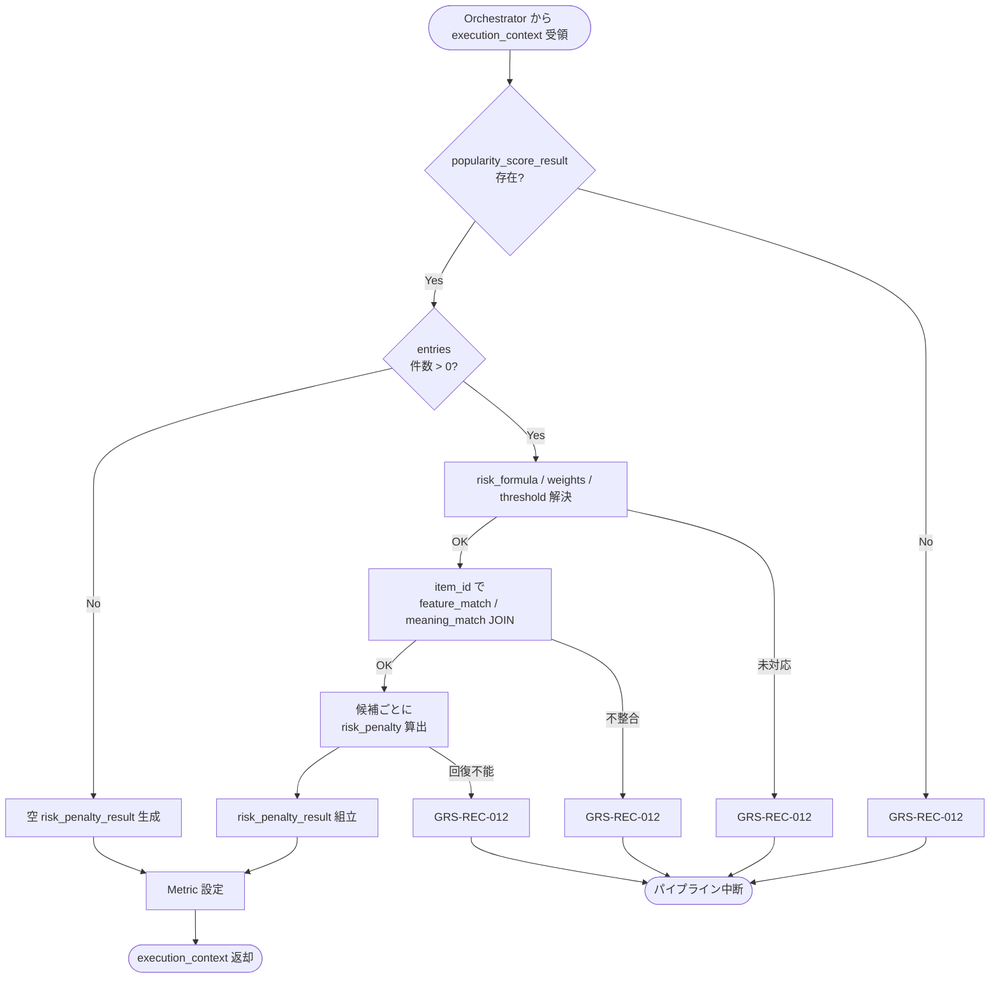

# Risk Scorer モジュール仕様書

## 1. ドキュメント情報

| 項目           | 内容                                       |
| -------------- | ------------------------------------------ |
| ドキュメントID | `MOD-RECO-018`                             |
| ドキュメント名 | Risk Scorer モジュール仕様書               |
| 対象システム   | Gift Recommendation Service（`apps/reco`） |
| MVP対象        | `○`                                        |
| 作成日         | 2026-07-03                                 |
| 更新日         | 2026-07-03                                 |

---

## 2. 概要

Risk Scorer（リスク補正算出）は、Reco オンライン推薦パイプラインの **Ranking フェーズ**において、`MOD-RECO-001` Recommendation Orchestrator から `execution_context` を **1 回**受け取り、`MOD-RECO-017` Popularity Scorer が算出済みの **`popularity_score_result`**（候補商品 ID 集合）を起点に、候補商品ごとに **Risk Penalty**（`risk_penalty`）を算出し、`risk_penalty_result` として `execution_context` へ返却するモジュールである。`MOD-RECO-017` 完了後、**`MOD-RECO-019` Final Score Calculator の直前**（Ranking フェーズ第 2 ステップ）に Orchestrator から呼び出される。

本モジュールは **贈答失敗リスク・避けたい条件近接・社会的適切性不足・データ品質不足に基づく減点値（`risk_penalty`）の算出**に責務を限定し、Popularity Score 算出（`MOD-RECO-017`）、Final Score 統合（`MOD-RECO-019`）、順位決定（`MOD-RECO-020`）、推薦理由生成（`MOD-RECO-023`）は行わない。Risk Penalty 算出式の正本は **Ranking定義書** §8 を正とする。

**命名注記**: Recoモジュール一覧 §6.17 / §8.1 では出力論理名を **`risk_penalty`** と略記する。機能×モジュール対応表・処理構成定義書では候補別集合を **`risk_penalty_result`** と呼ぶ。本仕様書・`execution_context` フィールド名は **`risk_penalty_result`** を正とし、各候補エントリ内に `risk_penalty` を格納する（§6.2.2）。

---

## 3. 目的

- `apps/reco` における Risk Scorer 実装・単体テストの前提を定義する
- Orchestrator との I/F（`execution_context` 入出力）、失敗時のパイプライン中断（`GRS-REC-012`）を後続実装可能な粒度で整理する
- Matching 出力（`avoid_similarity` / `social_match`）および Feature 信頼度から `risk_penalty` への正規化式・欠損補完・境界値方針を明確化する
- Recoモジュール一覧・Ranking定義書・`MOD-RECO-001` / `014` / `015` / `017` / `019` 仕様書との整合を担保する

---

## 4. モジュール基本情報

| 項目 | 内容 |
| ---- | ---- |
| モジュールID | `MOD-RECO-018` |
| モジュール名 | リスク補正算出 |
| 物理名 | `Risk Scorer` |
| 分類 | Ranking |
| 処理種別 | `OL` |
| 配置予定 | `apps/reco/src/reco/application/risk-scorer/**` |
| 所属Epic | `MOD-RECO-018`（Epic Issue #943） |
| MVP対象 | `○` |
| 主な呼び出し元 | `MOD-RECO-001` Recommendation Orchestrator |
| 主な呼び出し先 | なし（Run 内メモリ上の Matching 結果を参照する純粋計算モジュール） |

`MOD-API-*` / `MOD-RECO-*` / `MOD-BATCH-*` 配下の Task では、該当モジュール ID の責務範囲に変更を限定する。`MOD-RECO-*` では `apps/reco/src/reco/api/**` の API-INT エンドポイント層を対象に含めない。

---

## 5. 責務

### 5.1 主責務

- `MOD-RECO-017` 完了後、Orchestrator から **1 回**呼び出され、`execution_context.popularity_score_result` に含まれる候補ごとの `item_id` を起点に **Risk Penalty** を算出する
- 候補ごとに **`risk_penalty_result`**（`risk_penalty`、内訳メタデータ）を組み立て、`execution_context` へ返却し **`MOD-RECO-019`** 以降（Ranking フェーズ続行）へ引き渡す
- **`feature_match_result.entries[].avoid_similarity`**（`MOD-RECO-014` 出力）を **`avoid_risk`** 入力として利用する（Ranking定義書 §8.5）
- **`meaning_match_result.entries[].social_match`**（`MOD-RECO-015` 出力）から **`social_low_risk`** を算出する（Ranking定義書 §8.6）
- **`feature_match_result`** の軸別 `imputed` フラグから **`item_feature_confidence` の MVP 代理値**を導出し **`data_quality_risk`** を算出する（Ranking定義書 §8.7。§8.3.4）
- 欠損時は Ranking定義書 §8.5 / §16.1 に従い **算出可能要素のみで補完**し、単一候補の Risk 入力欠損を **パイプライン失敗にしない**
- 成功時に **Ranking フェーズ向け Metric**（§12.1）を Orchestrator / `MOD-RECO-025` 経由で依頼する
- 回復不能失敗時 **`GRS-REC-012`** を Orchestrator へ返却し、パイプライン中断を促す

### 5.2 対象外責務

- `API-INT-002` エンドポイント層
- `MOD-RECO-001` Orchestrator の実行順序制御・Phase Log 契機の物理実装
- **Popularity Score 算出**（`MOD-RECO-017` 責務。本モジュールは `popularity_score_result` を **候補キー参照のみ**）
- **Context Score 算出**（`MOD-RECO-016` 責務）
- **`avoid_similarity` の再算出**（`MOD-RECO-014` 責務。本モジュールは **読み取りのみ**）
- **Final Score 統合・重み付け**（`final_score` / `pre_rank_score`。`MOD-RECO-019` 責務。`ranking_config.ranking_weights.risk` による **文脈別のリスク重視度調整**も含む）
- **順位決定**（`rank`。`MOD-RECO-020` 責務）
- **MMR / 多様性制御**（`MOD-RECO-020` 責務）
- **Hard Filter による NG 除外**（`MOD-RECO-011` / `013` 責務。NG は Ranking 前に原則除外。Ranking定義書 §8.8）
- **`ng_near_miss_risk` / `over_symbolic_risk` の MVP 算入**（Ranking定義書 §8.2 に列挙あるが §8.3 MVP 式には含まない。§16.1 No.2）
- **`risk_penalty_result` の正本 DB 永続化**（MVP では Run 内メモリ。`recommendation_result_item.score_breakdown_json` への反映は `MOD-RECO-021` 責務）
- Phase Log `ranking_completed` の **最終記録**（Ranking フェーズ `017`〜`020` 完了後に Orchestrator が記録。§12）
- OpenAPI / DB schema 変更

---

## 6. 入出力

### 6.1 入力（Orchestrator → 本モジュール）

| 入力 | 型 / 構造 | 必須 | 生成元 | 用途 | 備考 |
| ---- | --------- | ---- | ------ | ---- | ---- |
| `execution_context` | パイプライン実行コンテキスト | `true` | `MOD-RECO-001` | 処理起点 | |
| `execution_context.popularity_score_result` | 候補別 Popularity Score 結果集合 | `true` | `MOD-RECO-017` | 候補キー・処理順序 | §6.2.1 |
| `execution_context.feature_match_result` | 候補別 Feature Match 結果集合 | `true` | `MOD-RECO-014` | `avoid_similarity` / `imputed` | §6.2.3 |
| `execution_context.meaning_match_result` | 候補別 Meaning Match 結果集合 | `true` | `MOD-RECO-015` | `social_match` | §6.2.4 |
| `execution_context.config_versions` | Config 群 | `true` | `MOD-RECO-003` | `risk_formula` / `risk_weights` / `social_threshold` 解決 | §8.3.2 |
| `execution_context.run_id` | `uuid` | `true` | `MOD-RECO-002` | ログ相関 | |

**前提**: `MOD-RECO-017` が完了済み（Orchestrator 論理順序 17 まで）。`popularity_score_result.entries` に **1 件以上**あることが Orchestrator 呼び出し前提（§8.3.5）。

**空入力（防御的）**: `popularity_score_result.entries` が空の場合、本モジュールは **空 `risk_penalty_result` を返却し成功**とする（`GRS-REC-012` にしない）。通常は Orchestrator が **`MOD-RECO-018` を呼ばず早期 0 件終了**する（`MOD-RECO-017` §16.1 No.8 と同型）。

**参照のみ（MVP 算式非算入）**: `execution_context.user_context`（`lambda_ctx` 等）は **本モジュールの MVP 算式には使用しない**。文脈別リスク重視度は **`MOD-RECO-019` + `ranking_config.ranking_weights.risk`** で調整する（§16.1 No.10）。

### 6.2 出力（本モジュール → Orchestrator / 後続）

| 出力 | 型 / 構造 | 利用先 | 用途 | 備考 |
| ---- | --------- | ------ | ---- | ---- |
| `execution_context.risk_penalty_result` | 候補別 Risk Penalty 結果集合 | `MOD-RECO-019`〜`021` | Ranking / Result 入力 | §6.2.2 |
| `risk_scorer_candidate_count` | `number` | Orchestrator / `MOD-RECO-025` | 算出完了候補数 | 0 件も正常 |
| `risk_missing_signal_count` | `number` | Orchestrator / Metric | Risk 入力欠損で中立補完した件数 | §8.3.4 |
| `reco_error` | 標準化 reco エラー | Orchestrator | 失敗時 | `GRS-REC-012` |

#### 6.2.1 `popularity_score_result`（入力・参照）

`MOD-RECO-017` モジュール仕様書 §6.2.2 を正とする。本モジュールは以下を **読み取りのみ**使用する。

| フィールド | 必須 | 内容 |
| ---------- | ---- | ---- |
| `entries[]` | `true` | 候補ごとの Popularity Score 結果 |
| `entries[].item_id` | `true` | 候補商品 ID |
| `entries[].popularity_score` | `true` | Popularity Score（本モジュールでは再計算しない） |
| `total_scored` | `true` | `entries` 件数（整合検証用） |

本モジュールは `popularity_score_result` を **変更せず**、`execution_context` に残す（読み取り専用）。

#### 6.2.2 `risk_penalty_result`（MVP 概要）

`execution_context` フィールド名は **`risk_penalty_result`**。ドメイン型は **`RiskPenaltyResult`**（配置: `apps/reco/src/reco/application/risk-scorer/models.py` または `domain/**`。実装 Task で最終配置を確定）。論理上は以下を含む。

| フィールド | 必須 | 内容 |
| ---------- | ---- | ---- |
| `entries[]` | `true` | 候補ごとの Risk Penalty 結果 |
| `entries[].item_id` | `true` | 候補商品 ID（入力と 1:1） |
| `entries[].risk_penalty` | `true` | Risk Penalty（0.0〜1.0） |
| `entries[].risk_formula` | `true` | MVP: `avoid_social_data_quality_weighted` 固定 |
| `entries[].avoid_risk` | `false` | `avoid_similarity` 由来（内訳・デバッグ用） |
| `entries[].social_low_risk` | `false` | Social 不足リスク（内訳） |
| `entries[].data_quality_risk` | `false` | データ品質リスク（内訳） |
| `entries[].avoid_similarity_used` | `false` | 算出に使用した `avoid_similarity`（省略時 0.0） |
| `entries[].social_match_used` | `false` | 算出に使用した `social_match` |
| `entries[].item_feature_confidence_used` | `false` | 算出に使用した信頼度代理値 |
| `entries[].signal_missing` | `true` | Risk 入力が欠損し中立補完したか |
| `entries[].calculated_at` | `true` | 算出日時（UTC） |
| `entries[].ranking_config_id` | `true` | 使用した Ranking Config ID（`config_versions` からエコー） |
| `total_scored` | `true` | `entries` 件数 |

**`popularity_score` の再格納**: 候補ごとの `popularity_score` は **`execution_context.popularity_score_result`** を正本とする。本モジュールは `risk_penalty` のみを追加する。

#### 6.2.3 `feature_match_result`（入力・参照）

`MOD-RECO-014` モジュール仕様書 §6.2.2 を正とする。本モジュールは以下を **読み取りのみ**使用する。

| フィールド | 必須 | 内容 |
| ---------- | ---- | ---- |
| `entries[]` | `true` | 候補ごとの Feature Match 結果 |
| `entries[].item_id` | `true` | 候補商品 ID（`popularity_score_result` と JOIN） |
| `entries[].avoid_similarity` | `false` | avoid 近接度。全零時は省略（`null`）→ `avoid_risk = 0.0` |
| `entries[].features[feature_code].imputed` | `false` | 軸別補完フラグ（`item_feature_confidence` 代理算出用） |

JOIN 失敗（`item_id` が `feature_match_result` に存在しない）の場合は **`GRS-REC-012`**（データ不整合）。

#### 6.2.4 `meaning_match_result`（入力・参照）

`MOD-RECO-015` モジュール仕様書 §6.2.2 を正とする。本モジュールは以下を **読み取りのみ**使用する。

| フィールド | 必須 | 内容 |
| ---------- | ---- | ---- |
| `entries[]` | `true` | 候補ごとの Meaning Match 結果 |
| `entries[].item_id` | `true` | 候補商品 ID |
| `entries[].social_match` | `true` | Social 系一致度（`social_low_risk` 入力） |

`social_match` 欠損時は Ranking定義書 §16.1 に従い **`social_low_risk = 0.0`** として継続し、`signal_missing = true` とする（§8.3.4）。

---

## 7. 依存関係

### 7.1 依存モジュール

| 依存先 | 方向 | 用途 | 失敗時 | 備考 |
| ------ | ---- | ---- | ------ | ---- |
| `MOD-RECO-001` | 被呼び出し | Ranking フェーズ契機 | — | `017` 直後・`019` 直前 |
| `MOD-RECO-017` | 間接 | `popularity_score_result` | 未到達 | 入力正本・候補順序 |
| `MOD-RECO-014` | 間接 | `avoid_similarity` / `imputed` | 未到達 | Matching 正本 |
| `MOD-RECO-015` | 間接 | `social_match` | 未到達 | Meaning Match 正本 |
| `MOD-RECO-003` | 間接 | `config_versions` / `ranking_config_id` | 未到達 | §8.3.2 |
| `MOD-RECO-019` / `021` | 下流利用 | `risk_penalty` | — | Final Score / Result 構築 |
| `MOD-RECO-025` | 間接 | Risk 分布 Metric | — | §12.1 |
| `MOD-RECO-028` / `024` / `029` | 間接 | 観測・エラー | — | Orchestrator 経由 |

**下流利用**: `MOD-RECO-019` Final Score Calculator が `risk_penalty_result.entries[].risk_penalty` を `pre_rank_score` 算入に使用する（Ranking定義書 §9.1）。

### 7.2 参照データ

| データ | 参照元 | 用途 | version / config | 備考 |
| ------ | ------ | ---- | ---------------- | ---- |
| `popularity_score_result` | `execution_context`（`MOD-RECO-017` 出力） | 候補キー・順序 | Run 内メモリ | DB 参照なし |
| `feature_match_result` | `execution_context`（`MOD-RECO-014` 出力） | `avoid_similarity` / 信頼度代理 | Run 内メモリ | DB 参照なし |
| `meaning_match_result` | `execution_context`（`MOD-RECO-015` 出力） | `social_match` | Run 内メモリ | DB 参照なし |
| `risk_formula` / `risk_weights` / `social_threshold` | `config_versions.ranking_config.parameter_json` | 算出式・重み・閾値 | `ranking_config_id` 紐づけ | §8.3.2 |

---

## 8. 処理仕様

### 8.1 処理フロー



**注記（Orchestrator 呼び出し）**: `popularity_score_result.entries` が空（Matching 対象 0 件）のとき、Orchestrator は通常 **本モジュールを呼ばず**、`MOD-RECO-018` 以降をスキップして早期 0 件終了する（`MOD-RECO-017` §8.1 注記と同型）。下図の `CHECK_E` → `EMPTY` 分岐は防御的フォールバックである。

### 8.2 処理ステップ

| No | 処理 | 入力 | 出力 | 補足 |
| --: | ---- | ---- | ---- | ---- |
| 1 | 入力検証 | `execution_context` | — | `popularity_score_result` / `feature_match_result` / `meaning_match_result` 必須 |
| 2 | 空入力判定 | `entries[]` | — | 0 件は Step 8 へ（空 output） |
| 3 | 算出式・重み・閾値解決 | `config_versions` | `risk_formula` / weights / threshold | §8.3.2 |
| 4 | 候補 ID 抽出 | `popularity_score_result.entries[].item_id` | `item_ids[]` | 入力順序維持 |
| 5 | Matching 結果 JOIN | `item_ids[]` + 各 result | 候補別 avoid / social / imputed | `item_id` 不一致は失敗 |
| 6 | 候補ごと信頼度代理算出 | `features[].imputed` | `item_feature_confidence` | §8.3.4 |
| 7 | 候補ごと Risk 算出 | avoid / social / confidence | `risk_penalty` | §8.3.1 |
| 8 | 結果組立 | 中間結果 | `risk_penalty_result` | §6.2.2 |
| 9 | 観測値設定 | 件数・欠損数 | Metric 用カウンタ | Orchestrator へ |

**候補処理順（MVP）**: `popularity_score_result.entries[]` の **入力順序を維持**する（`MOD-RECO-017` 出力順＝Matching パイプライン順）。

### 8.3 アルゴリズム / 計算仕様

Risk Penalty 算出式の正本は **Ranking定義書** §8 / §15.2。本モジュールは **リスク減点値の算出のみ**を実装し、Final Score 統合は **`MOD-RECO-019`** に委譲する。

#### 8.3.1 Risk Penalty（MVP 必須）

| 項目 | 内容 |
| ---- | ---- |
| 算出式識別子 | **`avoid_social_data_quality_weighted`**（`ranking_config.parameter_json.risk_formula`） |
| 入力 | `avoid_similarity`（任意）、`social_match`、`item_feature_confidence`（代理値） |
| 値域 | **0.0〜1.0** |
| 参照 | Ranking定義書 §8.3 / §15.2 |

**MVP 採用式**（Ranking定義書 §8.3 / §15.2 準拠）:

```text
avoid_risk = 0.0 if avoid_similarity is None else avoid_similarity

social_low_risk
= 0.0 if social_match >= social_threshold
else (social_threshold - social_match) / social_threshold

data_quality_risk = 1.0 - item_feature_confidence

risk_penalty
= w_avoid * avoid_risk
+ w_social * social_low_risk
+ w_data_quality * data_quality_risk
```

**guard_clip（MVP）**:

```text
avoid_risk = 0.0 if avoid_similarity is None else avoid_similarity

if social_match is None:
    social_low_risk = 0.0
    signal_missing = true
elif social_match >= social_threshold:
    social_low_risk = 0.0
else:
    social_low_risk = (social_threshold - social_match) / social_threshold

if item_feature_confidence is None:
    item_feature_confidence = 0.5
    signal_missing = true

data_quality_risk = 1.0 - item_feature_confidence

risk_penalty = w_avoid * avoid_risk + w_social * social_low_risk + w_data_quality * data_quality_risk
risk_penalty = guard_clip(risk_penalty, 0.0, 1.0)
result = round_to_scale(risk_penalty, 6)
```

**算出例**（Ranking定義書 §8.6 準拠）:

```text
avoid_similarity = 0.30
social_match = 0.45
social_threshold = 0.60
item_feature_confidence = 0.80
w_avoid = 0.50
w_social = 0.30
w_data_quality = 0.20

avoid_risk = 0.30
social_low_risk = (0.60 - 0.45) / 0.60 = 0.25
data_quality_risk = 1.0 - 0.80 = 0.20

risk_penalty = 0.50 * 0.30 + 0.30 * 0.25 + 0.20 * 0.20 = 0.245
```

#### 8.3.2 `risk_formula` / `risk_weights` / `social_threshold`（`ranking_config` 参照）

| 項目 | 内容 |
| ---- | ---- |
| 解決キー | `execution_context.config_versions.ranking_config_id` |
| 取得元 | `ranking_config.parameter_json`（`MOD-RECO-003` 解決済み） |
| MVP 対応式 | **`avoid_social_data_quality_weighted` のみ** |
| 未対応 formula | **`GRS-REC-012`** |
| formula 欠損 | MVP では **`avoid_social_data_quality_weighted` を暗黙デフォルト** |

**MVP 重み**（Ranking定義書 §8.4。`parameter_json.risk_weights` 未整備時のデフォルト）:

| キー | 初期値 | 意味 |
| ---- | -----: | ---- |
| `w_avoid` / `risk_weights.avoid` | `0.50` | avoid 近接リスク重み |
| `w_social` / `risk_weights.social` | `0.30` | Social 不足リスク重み |
| `w_data_quality` / `risk_weights.data_quality` | `0.20` | データ品質リスク重み |

**MVP 閾値**（Ranking定義書 §8.6）:

| キー | 初期値 | 意味 |
| ---- | -----: | ---- |
| `social_threshold` | `0.60` | `social_low_risk` 発生閾値 |

**MVP 初期 seed 拡張例**（`ranking_config.parameter_json`。Ranking定義書 §13.1 準拠。seed 反映は別 Task 可）:

```json
{
  "risk_formula": "avoid_social_data_quality_weighted",
  "risk_weights": {
    "avoid": 0.50,
    "social": 0.30,
    "data_quality": 0.20
  },
  "social_threshold": 0.60
}
```

> **注記**: 現行 `ranking_config_テーブル定義書` §6.1 の MVP seed には `risk_formula` / `risk_weights` / `social_threshold` キーが未収載。本モジュールは **Ranking定義書 §8.3〜§8.4 の初期値を暗黙デフォルト**として使用し、`parameter_json` にキーが存在する場合はそちらを優先する。seed 正式反映は **MOD-RECO-018 Epic 外 Task**（§16.1 No.12）。

#### 8.3.3 Run 内メモリ参照方針

| 項目 | 内容 |
| ---- | ---- |
| 操作 | **読み取りのみ**（`execution_context` 上の Matching 結果を JOIN） |
| 正本 | `feature_match_result` / `meaning_match_result` / `popularity_score_result` |
| DB アクセス | **MVP ではなし**（候補ごとの Risk 入力は Matching フェーズ出力で完結） |
| トランザクション | Run 内読み取り。本モジュールは DML しない |

#### 8.3.4 入力欠損・境界値

| ケース | MVP 方針 | パイプライン |
| ------ | -------- | ------------ |
| `popularity_score_result` 不在 | **`GRS-REC-012`** | 中断 |
| `feature_match_result` / `meaning_match_result` 不在 | **`GRS-REC-012`** | 中断 |
| `entries` 0 件 | **成功**（空 output） | 継続（通常は Orchestrator が呼ばない） |
| `item_id` JOIN 不一致 | **`GRS-REC-012`** | 中断 |
| `avoid_similarity` 省略（`null`） | `avoid_risk = 0.0` | **継続** |
| `social_match` 欠損 | `social_low_risk = 0.0` | **継続** + `signal_missing=true` |
| `item_feature_confidence` 欠損 | `0.5` で補完 | **継続** + `signal_missing=true` |
| 全 Risk 入力欠損（候補単位） | 補完後算出（例: `risk_penalty ≈ 0.10`） | **継続**（Ranking定義書 §16.1） |
| `social_match` / `avoid_similarity` 値域外 | clip 後に算出 + warn Metric | **継続** |
| 未対応 `risk_formula` | **`GRS-REC-012`** | 中断 |
| 内部計算エラー | **`GRS-REC-012`** | 中断 |

**`item_feature_confidence` の MVP 代理算出**（Ranking定義書 §8.7。`item_feature` テーブルに confidence 列がないため）:

```text
imputed_count = count(features[f].imputed == true)  # 8 軸
item_feature_confidence = (8 - imputed_count) / 8.0
```

8 軸すべて `imputed` 情報が欠損する場合は **`0.5`** を使用する（Ranking定義書 §16.1）。

**補完と失敗の区別**: Risk **入力欠損**は Ranking定義書 §16.1 に従い **補完して継続**する。**インフラ障害・設定不整合・候補 JOIN 不整合**は `GRS-REC-012` で中断する。

#### 8.3.5 Orchestrator Port 契約（MVP）

| 項目 | 内容 |
| ---- | ---- |
| 呼び出し | `score_risk(execution_context) -> execution_context`（名称は実装 Task で確定） |
| 成功 | `risk_penalty_result` / `risk_scorer_candidate_count` が設定される |
| 成功（算出対象 0 件） | 空 `risk_penalty_result` で **成功**（防御的） |
| 失敗 | `GRS-REC-012`。`019` 以降は呼ばれない |
| Phase Log | **`ranking_completed` は Ranking フェーズ（`017`〜`020`）完了後に Orchestrator が記録** |
| Wiring | Ranking フェーズ（`017`〜`020`）は **未配線（スタブ）**（MOD-RECO-001 §8.4.2） |

---

## 9. データ項目マッピング

| 入力項目 | 内部項目 | 出力項目 | 変換内容 | 備考 |
| -------- | -------- | -------- | -------- | ---- |
| `popularity_score_result.entries[].item_id` | 候補キー | `risk_penalty_result.entries[].item_id` | 1:1 エコー | 順序維持 |
| `feature_match_result.entries[].avoid_similarity` | `avoid_risk` | `entries[].avoid_risk` | 省略時 0.0 | Matching 正本 |
| `meaning_match_result.entries[].social_match` | `social_match` | `entries[].social_low_risk` | §8.3.1 閾値式 | |
| `feature_match_result.entries[].features[].imputed` | 補完軸数 | `item_feature_confidence` | §8.3.4 代理式 | |
| — | 算出 | `entries[].data_quality_risk` | `1.0 - confidence` | |
| — | 算出 | `entries[].risk_penalty` | §8.3.1 加重和 | |
| `config_versions.ranking_config_id` | Ranking version | `entries[].ranking_config_id` | エコー | 再現性 |
| — | 固定 | `entries[].risk_formula` | `avoid_social_data_quality_weighted` | MVP |
| — | 欠損判定 | `entries[].signal_missing` | avoid 省略 / social 欠損 / confidence 補完 | Metric |

---

## 10. 状態・例外

### 10.1 状態

本モジュールは **ステートレス**（Run 内 1 回呼び出し）。

| 状態 | 意味 | 遷移条件 | 記録先 |
| ---- | ---- | -------- | ------ |
| — | モジュール内部状態なし | — | — |

### 10.2 例外

| 例外 | Error Code | 発生条件 | 呼び出し元への返却 | ログ |
| ---- | ---------- | -------- | ------------------ | ---- |
| Risk Penalty 算出失敗 | `GRS-REC-012` | 入力 result 欠損・JOIN 不整合・未対応 formula・内部エラー | 500 系・中断 | Error Log + Phase failed |
| 算出対象 0 件 | — | 入力 `entries` 0 件 | **成功**（空 output） | `risk_scorer_candidate_count = 0` |
| Risk 入力欠損 | —（継続） | avoid 省略 / social 欠損 / confidence 補完 | パイプライン継続（中立補完） | **warning** + Metric |

**リトライ**: モジュール内自動リトライ **なし**（MVP）。

Error Code の正本はエラーコード定義書。Orchestrator は `MOD-RECO-024` 経由で標準化結果を呼び出し元へ伝播する。

---

## 11. DB / 永続化

### 11.1 書き込み

| テーブル | 操作 | 備考 |
| -------- | ---- | ---- |
| 正本テーブル | **なし** | 算出結果は Run 内メモリ |

### 11.2 読み取り

| テーブル | 操作 | 用途 | 備考 |
| -------- | ---- | ---- | ---- |
| — | — | — | **MVP では DB 参照なし**（Matching 結果を `execution_context` から参照） |

**方針**: `risk_penalty` の Run 結果永続化は **`MOD-RECO-021` Recommendation Result Builder** が `recommendation_result_item.score_breakdown_json` 等へ反映する（`recommendation_result_item_テーブル定義書` §6）。

---

## 12. ログ・メトリクス

| 種別 | 内容 | タイミング | 保存先 | 備考 |
| ---- | ---- | ---------- | ------ | ---- |
| Phase Log | `ranking_completed` | Ranking フェーズ（`017`〜`020`）**全体成功後** | `phase_log`（`MOD-RECO-028`） | **本モジュール単独では記録しない** |
| Metric | `risk_scorer_candidate_count` 等 | 成功 | Metric Logger（`MOD-RECO-025`） | §12.1 |
| Error Log | `GRS-REC-012` | 失敗 | `error_log`（`MOD-RECO-029`） | |
| 構造化ログ | 算出サマリ（件数・欠損数・duration_ms） | 成功 / 警告 | アプリログ | `trace_id` 必須。候補ごとの score 全量ダンプ禁止 |

### 12.1 メトリクス

| Metric | 内容 | 集計単位 | 用途 |
| ------ | ---- | -------- | ---- |
| `risk_scorer_candidate_count` | Risk Penalty 算出完了候補数 | Run | 候補数推移 |
| `risk_scorer_latency_ms` | 本モジュール処理時間 | Run | 性能監視（Ranking 一括 1,000ms 上限の内訳） |
| `risk_penalty_distribution` | `risk_penalty` 分布 | Run | ログ・Observability設計書 §11.2 相当 |
| `risk_missing_signal_count` | Risk 入力欠損で中立補完した件数 | Run | データ品質監視 |
| `risk_penalty_value_out_of_range_count` | clip 適用件数 | Run | 入力異常監視 |
| `avoid_risk_nonzero_count` | `avoid_risk > 0` の候補数 | Run | avoid 効き監視 |

**Ranking フェーズ Metric（共有）**: `ranking_latency_ms` はログ・Observability設計書 §11.2 に従い、Ranking フェーズ全体（`017`〜`020`）または Metric Logger 側で集約してよい。

---

## 13. 性能・非機能

| 観点 | 方針 |
| ---- | ---- |
| レイテンシ | モジュール単体 hard timeout は設けない。Ranking 一括（`017`〜`020`）**hard 1,000ms** 上位ガード（MOD-RECO-001 §13.2） |
| 計算量 | 候補件数 O(n) × Run 内メモリ JOIN + 定数時間算出。n ≤ `candidate_limit` |
| DB アクセス | **なし**（MVP） |
| タイムアウト | 上位 Orchestrator に従う |
| リトライ | なし（MVP） |
| キャッシュ | Run 横断キャッシュなし（MVP） |
| 並列実行 | 同一 Run 内 1 回・同期実行 |

---

## 14. テスト観点

| No | 観点 | 確認内容 | 種別 |
| --: | ---- | -------- | ---- |
| 1 | 正常系（基本算出） | Ranking定義書 §15.2 の疑似コードと `risk_penalty` が一致すること | unit |
| 2 | 正常系（avoid 高） | 高 `avoid_similarity` で `risk_penalty` が高くなること | unit |
| 3 | 正常系（social 低） | 低 `social_match` で `social_low_risk` / `risk_penalty` が高くなること | unit |
| 4 | 正常系（confidence 低） | 低 `item_feature_confidence` で `data_quality_risk` が高くなること | unit |
| 5 | 正常系（候補複数） | 候補ごとに `entries[]` が生成され入力順が維持されること | unit |
| 6 | 境界値（avoid 省略） | `avoid_similarity = null` で `avoid_risk = 0.0`・**成功** | unit |
| 7 | 境界値（social 閾値） | `social_match = 0.60` で `social_low_risk = 0.0` | unit |
| 8 | 境界値（social 閾値下） | `social_match = 0.30` で `social_low_risk = 0.50`（threshold=0.60） | unit |
| 9 | 境界値（confidence 欠損） | `item_feature_confidence` 欠損時 `0.5` 補完 | unit |
| 10 | imputed 代理 | 8 軸中 2 軸 imputed で `confidence = 0.75` となること | unit |
| 11 | 入力 0 件 | 成功・空 `risk_penalty_result`・`GRS-REC-012` にならないこと | unit |
| 12 | `popularity_score_result` 欠損 | `GRS-REC-012` になること | unit |
| 13 | JOIN 不整合 | `item_id` 不一致で `GRS-REC-012` になること | unit |
| 14 | 未対応 formula | `GRS-REC-012` になること | unit |
| 15 | Orchestrator 連携 | `017` 後 1 回呼び出し・失敗時 `019` 未到達 | integration |
| 16 | 責務境界 | Final Score 統合 / Popularity 再算出 / avoid 再算出を行わないこと | unit |
| 17 | Metric | `risk_scorer_*` / `risk_missing_signal_count` が記録されること | integration |
| 18 | ログ | `trace_id` あり・score 全量ダンプ・secret なし | unit |
| 19 | 入力 result 不変 | `popularity_score_result` / Matching 結果が変更されないこと | unit |
| 20 | clip | 算出結果が 0.0〜1.0 に clip されること | unit |

---

## 15. 変更管理

### 15.1 変更履歴

| 日付 | 変更内容 | 関連 Issue / PR |
| ---- | -------- | --------------- |
| 2026-07-03 | 初版作成 | Issue #944 |

---

## 16. 未決事項

| No | 論点 | 判断が必要な理由 | 判断者 | 期限 | 備考 |
| --: | ---- | ---------------- | ------ | ---- | ---- |
| 1 | `item_feature_confidence` の正本列追加 | batch / DB 側で信頼度を永続化する場合、代理式から置き換えが必要 | Human | 実装 Task 前 | §16.1 No.3 で MVP 代理式を暫定確定 |

### 16.1 確定済み論点

| No | 論点 | 確定内容 |
| --: | ---- | -------- |
| 1 | MVP 算入リスク要素 | **`avoid_risk` / `social_low_risk` / `data_quality_risk` のみ**（Ranking定義書 §8.3）。`ng_near_miss_risk` / `over_symbolic_risk` は **MVP 算入しない** |
| 2 | Post-MVP リスク要素 | `ng_near_miss_risk` / `over_symbolic_risk` は **別 Task** で `risk_formula` 拡張時に算入 |
| 3 | `item_feature_confidence` | **`feature_match_result.entries[].features[].imputed` から `(8 - imputed_count) / 8` を代理算出**。全軸 imputed 情報欠損時は **`0.5`**（Ranking定義書 §16.1） |
| 4 | 算出式 | MVP は **`avoid_social_data_quality_weighted`**（Ranking定義書 §8.3） |
| 5 | 初期重み | `w_avoid=0.50` / `w_social=0.30` / `w_data_quality=0.20`（Ranking定義書 §8.4。`parameter_json` 優先） |
| 6 | `social_threshold` | **`0.60`**（Ranking定義書 §8.6。`parameter_json` 優先可） |
| 7 | 出力フィールド名 | **`execution_context.risk_penalty_result`** |
| 8 | 入力正本（候補） | **`execution_context.popularity_score_result`**（`017` 出力。候補順序） |
| 9 | 欠損時 | **算出可能要素のみで補完しパイプライン継続**（Ranking定義書 §16.1）。JOIN 不整合・設定不整合のみ `GRS-REC-012` |
| 10 | 文脈別リスク強度 | **`risk_penalty` 自体は文脈非依存の素の減点値**。Recoモジュール一覧 §6.17「safety/formality 文脈で強める」は **`MOD-RECO-019` + `ranking_config.ranking_weights.risk`** で実現（`MOD-RECO-017` §16.1 No.10 と同型） |
| 11 | Phase Log | **`ranking_completed` は `017`〜`020` 完了後に Orchestrator が記録** |
| 12 | 0 件早期終了 | Matching 対象 0 件時、Orchestrator は通常 **`018` 以降を呼ばない** |
| 13 | スコア精度 | **`round_to_scale(..., 6)`**（`recommendation_result_item` の numeric 列と整合） |
| 14 | DB 参照 | **MVP では DB 参照なし**（Matching 出力の Run 内メモリ JOIN のみ） |
| 15 | `risk_weights` seed 反映 | **`ranking_config.parameter_json` への `risk_formula` / `risk_weights` / `social_threshold` 追加は MOD-RECO-018 Epic 外の docs/chore Task**（`MOD-RECO-017` §16.1 No.12 と同型）。本 Epic **実装 Task は暗黙デフォルトで着手可** |

---

## 17. 関連資料

| 種別 | パス | 用途 |
| ---- | ---- | ---- |
| Recoモジュール一覧 | `docs/05_アプリケーション設計/アプリ/reco/Recoモジュール一覧.md` | §6.17 |
| モジュール一覧 | `docs/05_アプリケーション設計/アプリ/モジュール一覧.md` | Ranking 分類 |
| 機能×モジュール対応表 | `docs/05_アプリケーション設計/アプリ/機能×モジュール対応表.md` | `risk_penalty` |
| Ranking定義書 | `docs/04_ドメインモデル設計/Ranking定義書.md` | Risk Penalty 算出式・欠損 |
| Matching定義書 | `docs/04_ドメインモデル設計/Matching定義書.md` | `avoid_similarity` |
| ranking_config テーブル定義書 | `docs/06_実装設計/database/ranking_config_テーブル定義書.md` | Ranking パラメータ |
| recommendation_result_item テーブル定義書 | `docs/06_実装設計/database/recommendation_result_item_テーブル定義書.md` | score_breakdown |
| MOD-RECO-001 | `docs/06_実装設計/reco/MOD-RECO-001_Recommendation Orchestratorモジュール仕様書.md` | 呼び出し・`GRS-REC-012` |
| MOD-RECO-003 | `docs/06_実装設計/reco/MOD-RECO-003_Config Version Resolverモジュール仕様書.md` | `ranking_config_id` 解決 |
| MOD-RECO-014 | `docs/06_実装設計/reco/MOD-RECO-014_Feature Matcherモジュール仕様書.md` | `avoid_similarity` 正本 |
| MOD-RECO-015 | `docs/06_実装設計/reco/MOD-RECO-015_Meaning Match Aggregatorモジュール仕様書.md` | `social_match` 正本 |
| MOD-RECO-017 | `docs/06_実装設計/reco/MOD-RECO-017_Popularity Scorerモジュール仕様書.md` | 直前モジュール・入力正本 |
| MOD-RECO-019 | Recoモジュール一覧 §6.18 | 後続 Final Score Calculator |
| エラーコード定義書 | `docs/05_アプリケーション設計/アプリ/エラーコード定義書.md` | `GRS-REC-012` |
| ログ・Observability設計書 | `docs/05_アプリケーション設計/アプリ/ログ・Observability設計書.md` | Phase / Metric |
| Epic Definition | `prompts/definitions/epics/mod-reco-018-risk-scorer/epic.yaml` | `allowed_paths` |

---

## 18. レビュー観点

- Recoモジュール一覧 §6.17 のモジュール名・物理名・入出力と一致している
- Ranking定義書 §8 / §15.2 の Risk Penalty 算出式・欠損補完と一致している
- Orchestrator Port 契約（`execution_context` 入出力・`GRS-REC-012`）が MOD-RECO-001 と整合している
- `MOD-RECO-014` / `015` / `017` との責務境界（avoid / social / 候補キー）が明確である
- `MOD-RECO-019` との責務境界（Final Score 統合・文脈別 w_risk は下流）が明確である
- API-INT-002 エンドポイント層を責務範囲に含めていない
- secret や `.env` 実値が含まれていない

---

## 19. 備考

- 物理配置は Epic `allowed_paths` に従い `apps/reco/src/reco/application/risk-scorer/**` を第一候補とする（Epic #943 `epic_scope.allowed_paths` と整合）
- Orchestrator Wiring は Ranking フェーズ（`017`〜`020`）単位で実施する（MOD-RECO-001 §8.4.2）
- Recoモジュール一覧 §6.17 の主な入力 `item risk signals / request context` は、MVP では **`feature_match_result.avoid_similarity` + `meaning_match_result.social_match` + imputed 代理 confidence** として具体化する
- Recoモジュール一覧 §6.17 の主な出力 `risk_penalty` は、本仕様書では **`risk_penalty_result.entries[].risk_penalty`** として格納する
- Ranking定義書 §12.3 の優先度（`context_score > popularity_score > risk_penalty`）は **`MOD-RECO-019` の `ranking_weights`** で実現し、本モジュールは **素の `risk_penalty` のみ**を供給する
- `avoid_similarity` の算出経路（Feature 系統: `006` → `014` → `018`）は MOD-RECO-010 / `013` 仕様書の注記と整合する
