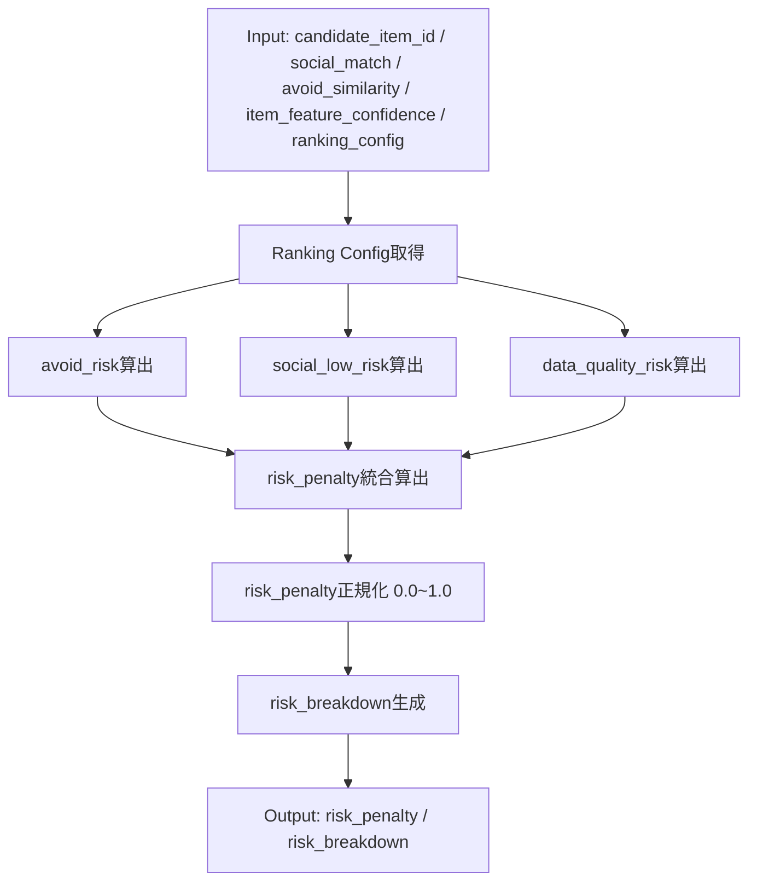

# MOD-RECO-018 Risk Scorerモジュール仕様書

## 1. ドキュメント情報

| 項目           | 内容                                                       |
| -------------- | ---------------------------------------------------------- |
| ドキュメントID | `DOC-IMPL-RECO-MOD-RECO-018`                               |
| ドキュメント名 | MOD-RECO-018 Risk Scorerモジュール仕様書                   |
| 対象システム   | Gift Recommendation Service / Reco Component               |
| MVP対象        | `○`                                                        |
| 作成日         | 2026-07-21                                                 |
| 更新日         | 2026-07-21                                                 |

---

## 2. 概要

MOD-RECO-018（Risk Scorer / リスク補正算出）は、Rankingフェーズにおいて、候補商品のリスク要因を評価し、`risk_penalty`（リスク減点スコア）を算出するモジュールである。

本モジュールは、MOD-RECO-001 Recommendation Orchestrator から `ExecutionContext` 経由で呼び出され、避けたい意味との近さ（avoid_risk）、社会的適切性の低さ（social_low_risk）、データ品質不足（data_quality_risk）を統合してリスク減点値を算出する。

---

## 3. 目的

本モジュールは、以下を目的とする。

- 候補商品の `risk_penalty` を算出し、最終スコア算出の入力を提供する
- 避けたい意味に近い商品を減点することで、ユーザーのNG条件を反映する
- 社会的適切性が低い商品を減点することで、贈答として外しやすい商品の順位を下げる
- Item Feature推定信頼度が低い商品を減点することで、データ品質リスクを順位に反映する
- Ranking Config パラメータ（`risk_formula` / `risk_weights`）に基づいて計算可能な設計にする

---

## 4. モジュール基本情報

| 項目             | 内容                                               |
| ---------------- | -------------------------------------------------- |
| モジュールID     | `MOD-RECO-018`                                     |
| モジュール名     | リスク補正算出                                     |
| 物理名           | `Risk Scorer`                                      |
| 分類             | Ranking                                            |
| 処理種別         | `OL`（Online処理）                                 |
| 配置予定         | `apps/reco/src/reco/application/risk-scorer/**`    |
| 所属Epic         | [Epic]MOD-RECO-018:Risk Scorer（Issue #1508）      |
| MVP対象          | `○`                                                |
| 主な呼び出し元   | MOD-RECO-001 Recommendation Orchestrator           |
| 主な呼び出し先   | なし（リスク減点値算出のみ）                       |

`MOD-RECO-018` では `apps/reco/src/reco/application/risk-scorer/**` 配下のモジュール本体に責務を限定する。`apps/reco/src/reco/api/**` のAPI-INTエンドポイント層は対象に含めない。エンドポイント層の変更が必要な場合は、該当する `API-INT-*` Epic配下Taskとして扱う。

---

## 5. 責務

### 5.1 主責務

- 候補商品ごとに `risk_penalty`（リスク減点値）を算出する
- 避けたい意味との近さ（`avoid_similarity`）からリスク要素を評価する
- 社会的適切性（`social_match`）の低さからリスク要素を評価する
- Item Feature推定信頼度（`item_feature_confidence`）の低さからリスク要素を評価する
- Ranking Config パラメータ（`risk_formula` / `risk_weights`）に基づいて減点値を算出する
- `risk_penalty` の範囲を `0.0〜1.0` に正規化する
- `ExecutionContext` 経由で算出結果を返却する

### 5.2 対象外責務

- `context_score` の算出（MOD-RECO-016 Context Scorer / Matching層の責務）
- `popularity_score` の算出（MOD-RECO-017 Popularity Scorer の責務）
- `final_score` の算出（MOD-RECO-019 Final Score Calculator の責務）
- NG条件による Hard Filter 除外（MOD-RECO-012 / MOD-RECO-013 Pre/Post Hard Filter の責務）
- Feature生成・正規化（MOD-RECO-007 / MOD-RECO-027 の責務）
- Semantic Concept抽出（MOD-RECO-004 / MOD-RECO-026 の責務）
- User Meaning射影（MOD-RECO-008 の責務）
- Ranking Config の Version 解決（MOD-RECO-003 Config Version Resolver の責務）
- Recommendation Run 記録（MOD-RECO-002 の責務）
- Phase Log / Error Log 記録（MOD-RECO-028 / MOD-RECO-029 の責務）

---

## 6. 入出力

### 6.1 入力

| 入力                       | 型 / 構造 | 必須  | 生成元                             | 用途                                     | 備考                                       |
| -------------------------- | --------- | ----- | ---------------------------------- | ---------------------------------------- | ------------------------------------------ |
| `candidate_item_id`        | `str`     | `yes` | Retrieval / Matching               | 候補商品ID                               | リスク減点対象商品の識別子                 |
| `avoid_similarity`         | `float`   | `no`  | MOD-RECO-016 Context Scorer        | 避けたい意味との近さ（0.0〜1.0）         | `null` の場合は `avoid_risk = 0.0` とする  |
| `social_match`             | `float`   | `yes` | MOD-RECO-015 Meaning Match Aggregator | 社会的適切性一致度（0.0〜1.0）          | `social_low_risk` 算出に利用               |
| `item_feature_confidence`  | `float`   | `no`  | Item Feature生成（Batch / Reco）   | Item Feature推定信頼度（0.0〜1.0）       | `null` の場合は `0.5` で補完               |
| `ranking_config_id`        | `uuid`    | `yes` | MOD-RECO-003 Config Version Resolver | 使用する Ranking Config バージョン       | `risk_formula` / `risk_weights` を参照     |
| `ranking_config.risk_formula` | `str` | `yes` | MOD-RECO-003 | Risk Penalty 算出式（例: `linear`） | 算出ロジック切替に使用                     |
| `ranking_config.risk_weights` | `dict` | `yes` | MOD-RECO-003 | リスク要素重み（`w_avoid`, `w_social`, `w_data_quality`） | 各リスク要素の重み係数 |

### 6.2 出力

| 出力            | 型 / 構造 | 利用先                               | 用途                             | 備考                                       |
| --------------- | --------- | ------------------------------------ | -------------------------------- | ------------------------------------------ |
| `risk_penalty`  | `float`   | MOD-RECO-019 Final Score Calculator  | リスク減点値（0.0〜1.0）         | 最終スコア算出時に減算される               |
| `risk_breakdown`| `dict`    | Recommendation Result / Reason生成   | リスク内訳（`avoid_risk`, `social_low_risk`, `data_quality_risk`） | 推薦理由・評価・分析に利用                 |

---

## 7. 依存関係

### 7.1 依存モジュール

| 依存先                             | 方向   | 用途                                     | 失敗時の扱い                       | 備考                                       |
| ---------------------------------- | ------ | ---------------------------------------- | ---------------------------------- | ------------------------------------------ |
| `MOD-RECO-001`                     | `from` | Orchestrator から呼び出される             | Orchestrator が Error Handling     | ExecutionContext 経由で入出力              |
| `MOD-RECO-003`                     | `from` | Ranking Config 解決済み値を受け取る       | Config 欠損時は現行 Config を使用  | `risk_formula` / `risk_weights` を参照     |
| `MOD-RECO-015`                     | `from` | `social_match` を受け取る                 | `social_match` 欠損時は候補除外    | Meaning Match 結果が前提条件               |
| `MOD-RECO-016`                     | `from` | `avoid_similarity`（任意）を受け取る      | `avoid_similarity` が `null` なら `avoid_risk = 0.0` | Context Scorer の出力を利用                |
| `MOD-RECO-019`                     | `to`   | 算出した `risk_penalty` を渡す            | 呼び出し側が欠損処理を行う         | Final Score 算出の入力                     |
| `MOD-RECO-028`                     | `to`   | Phase Log 記録（任意）                    | Phase Log 失敗は推薦処理を継続     | Observability目的                          |

### 7.2 参照データ

| データ                        | 参照元                   | 用途                                     | version / config             | 備考                                       |
| ----------------------------- | ------------------------ | ---------------------------------------- | ---------------------------- | ------------------------------------------ |
| `ranking_config`              | Database                 | リスク減点算出式・重みを解決             | `ranking_config_id`          | MOD-RECO-003 で解決済み                    |
| `item_feature_confidence`     | Item Feature（DB / Cache） | データ品質リスク評価                     | —                            | Feature生成時に算出された信頼度             |
| `social_match`                | ExecutionContext         | 社会的適切性評価                         | —                            | Meaning Match Aggregator の出力            |
| `avoid_similarity`            | ExecutionContext（任意） | 避けたい意味との近さ評価                 | —                            | Context Scorer の出力（任意）              |

---

## 8. 処理仕様

### 8.1 処理フロー



### 8.2 処理ステップ

| No | 処理                       | 入力                                           | 出力                                   | 補足                                       |
| --:| -------------------------- | ---------------------------------------------- | -------------------------------------- | ------------------------------------------ |
|  1 | Ranking Config取得          | `ranking_config_id`                            | `risk_formula`, `risk_weights`         | MOD-RECO-003 で解決済み値を使用            |
|  2 | avoid_risk算出              | `avoid_similarity`, `w_avoid`                  | `avoid_risk`                           | `avoid_similarity` が `null` なら `0.0`    |
|  3 | social_low_risk算出         | `social_match`, `w_social`, `social_threshold` | `social_low_risk`                      | `social_match` が閾値未満なら減点          |
|  4 | data_quality_risk算出       | `item_feature_confidence`, `w_data_quality`    | `data_quality_risk`                    | `item_feature_confidence` が低いと減点     |
|  5 | risk_penalty統合算出        | `avoid_risk`, `social_low_risk`, `data_quality_risk`, `risk_weights` | `risk_penalty` | 重み付き和を算出                           |
|  6 | risk_penalty正規化          | `risk_penalty`                                 | `risk_penalty`（0.0〜1.0）             | `max(0.0, min(1.0, risk_penalty))`         |
|  7 | risk_breakdown生成          | `avoid_risk`, `social_low_risk`, `data_quality_risk` | `risk_breakdown` | 推薦理由・評価・分析用の内訳               |
|  8 | ExecutionContext返却        | `risk_penalty`, `risk_breakdown`               | —                                      | Orchestrator へ返却                        |

### 8.3 アルゴリズム / 計算仕様

MOD-RECO-018 では、MVPとして以下の線形スコアリング方式を採用する。

**8.3.1 avoid_risk算出**

```text
avoid_risk = avoid_similarity if avoid_similarity is not None else 0.0
```

**8.3.2 social_low_risk算出**

```text
social_threshold = 0.6  # Ranking Configから取得

if social_match >= social_threshold:
    social_low_risk = 0.0
else:
    social_low_risk = (social_threshold - social_match) / social_threshold
```

**8.3.3 data_quality_risk算出**

```text
item_feature_confidence_actual = item_feature_confidence if item_feature_confidence is not None else 0.5

data_quality_risk = 1.0 - item_feature_confidence_actual
```

**8.3.4 risk_penalty統合算出**

```text
w_avoid = ranking_config.risk_weights.w_avoid  # 初期値: 0.5
w_social = ranking_config.risk_weights.w_social  # 初期値: 0.3
w_data_quality = ranking_config.risk_weights.w_data_quality  # 初期値: 0.2

risk_penalty = (
    w_avoid * avoid_risk
    + w_social * social_low_risk
    + w_data_quality * data_quality_risk
)

risk_penalty = max(0.0, min(1.0, risk_penalty))
```

| 項目                | 内容                                             |
| ------------------- | ------------------------------------------------ |
| `w_avoid`           | 避けたい意味との近さの重み（初期値: 0.5）        |
| `w_social`          | 社会的適切性の低さの重み（初期値: 0.3）          |
| `w_data_quality`    | データ品質不足の重み（初期値: 0.2）              |
| `social_threshold`  | Social Match閾値（初期値: 0.6）                  |

---

## 9. データ項目マッピング

| 入力項目                     | 内部項目                | 出力項目           | 変換内容                                     | 備考                                       |
| ---------------------------- | ----------------------- | ------------------ | -------------------------------------------- | ------------------------------------------ |
| `avoid_similarity`           | `avoid_risk`            | `risk_breakdown.avoid_risk` | そのまま使用（`null` なら `0.0`）      | —                                          |
| `social_match`               | `social_low_risk`       | `risk_breakdown.social_low_risk` | 閾値未満なら減点計算                  | `social_threshold = 0.6`                   |
| `item_feature_confidence`    | `data_quality_risk`     | `risk_breakdown.data_quality_risk` | `1.0 - confidence`（`null` なら `0.5` 補完） | —                         |
| `risk_weights`               | —                       | —                  | 重み付き和を算出                             | Ranking Config から取得                    |
| —                            | `risk_penalty`          | `risk_penalty`     | 統合算出後に正規化（0.0〜1.0）               | Final Score 算出の入力                     |

---

## 10. 状態・例外

### 10.1 状態

| 状態           | 意味                                   | 遷移条件                       | 記録先                   |
| -------------- | -------------------------------------- | ------------------------------ | ------------------------ |
| `pending`      | Risk Scorer呼び出し前                  | Orchestrator が Phase開始      | Phase Log（任意）        |
| `in_progress`  | risk_penalty算出中                     | Risk Scorer実行開始            | Phase Log（任意）        |
| `completed`    | risk_penalty算出成功                   | 正常終了                       | Phase Log（任意）        |
| `failed`       | risk_penalty算出失敗                   | 例外発生・入力不正             | Error Log                |

### 10.2 例外

| 例外                           | Error Code           | 発生条件                                       | 呼び出し元への返却               | ログ                           |
| ------------------------------ | -------------------- | ---------------------------------------------- | -------------------------------- | ------------------------------ |
| `RankingConfigNotFoundError`   | `ERR-RECO-CFG-001`   | `ranking_config_id` が見つからない             | Orchestrator へ例外通知          | Error Log記録                  |
| `SocialMatchMissingError`      | `ERR-RECO-RISK-001`  | `social_match` が欠損している                  | Orchestrator へ例外通知          | Error Log記録                  |
| `InvalidSocialMatchError`      | `ERR-RECO-RISK-002`  | `social_match` が範囲外（< 0.0 または > 1.0）  | Orchestrator へ例外通知          | Error Log記録                  |
| `InvalidRiskWeightsError`      | `ERR-RECO-RISK-003`  | `risk_weights` が不正（負値・合計>1など）      | Orchestrator へ例外通知          | Error Log記録                  |
| `RiskPenaltyCalculationError`  | `ERR-RECO-RISK-004`  | risk_penalty算出中に予期しないエラー           | Orchestrator へ例外通知          | Error Log記録                  |

---

## 11. DB / 永続化

| テーブル              | 操作     | 主な項目                               | トランザクション | 備考                                       |
| --------------------- | -------- | -------------------------------------- | ---------------- | ------------------------------------------ |
| `ranking_config`      | `SELECT` | `risk_formula`, `risk_weights`, `parameter_json` | 不要             | MOD-RECO-003 で解決済みの値を参照          |
| `item_feature`        | `SELECT` | `item_feature_confidence`              | 不要             | Data Quality Risk算出に利用（任意）        |
| なし                  | —        | —                                      | —                | Risk Scorer自体は永続化を行わない          |

本モジュールは算出処理のみを担当し、`risk_penalty` の保存は呼び出し元（Orchestrator / Recommendation Result Builder）が行う。

---

## 12. ログ・メトリクス

| 種別   | 内容                                   | 出力タイミング               | 保存先               | 備考                                       |
| ------ | -------------------------------------- | ---------------------------- | -------------------- | ------------------------------------------ |
| info   | Risk Scorer実行開始                    | Risk Scorer呼び出し時        | `application log`    | `recommendation_run_id`, `phase: risk_scorer` |
| info   | risk_penalty算出成功                   | 正常終了時                   | `application log`    | `risk_penalty`, `risk_breakdown` を記録    |
| warn   | avoid_similarity欠損                   | `avoid_similarity` が `null` | `application log`    | `avoid_risk = 0.0` として継続              |
| warn   | item_feature_confidence欠損            | `item_feature_confidence` が `null` | `application log` | `0.5` で補完して継続                       |
| error  | social_match欠損                       | `social_match` が `null`     | `error_log`          | 候補除外またはエラー通知                   |
| error  | ranking_config取得失敗                 | Config解決失敗               | `error_log`          | Orchestrator へ例外通知                    |
| error  | risk_penalty算出失敗                   | 計算中エラー                 | `error_log`          | Orchestrator へ例外通知                    |

### 12.1 メトリクス

| Metric                      | 内容                                   | 集計単位                 | 用途                                       |
| --------------------------- | -------------------------------------- | ------------------------ | ------------------------------------------ |
| `risk_penalty_distribution` | risk_penalty値の分布                   | 推薦実行単位             | リスク減点の効き方確認                     |
| `avoid_risk_distribution`   | avoid_risk値の分布                     | 推薦実行単位             | 避けたい意味との近さ分布確認               |
| `social_low_risk_distribution` | social_low_risk値の分布            | 推薦実行単位             | 社会的適切性の低さ分布確認                 |
| `data_quality_risk_distribution` | data_quality_risk値の分布        | 推薦実行単位             | データ品質リスク分布確認                   |
| `risk_scorer_latency`       | Risk Scorer処理時間                    | 推薦実行単位             | 性能監視                                   |
| `risk_scorer_error_count`   | Risk Scorer失敗件数                    | 時間単位                 | エラー率監視                               |

---

## 13. 性能・非機能

| 観点         | 方針                                                                 |
| ------------ | -------------------------------------------------------------------- |
| レイテンシ   | 候補商品単位の計算は `O(1)`。候補数100件で `<10ms` を目標とする     |
| 計算量       | `O(n)` n = 候補商品数。各商品に対して線形スコアリングを実行          |
| タイムアウト | Orchestrator全体のタイムアウト（例: 5秒）内に完了する必要がある     |
| リトライ     | Risk Scorer自体はリトライしない。失敗時は Orchestrator が判断        |
| キャッシュ   | `ranking_config` は MOD-RECO-003 でキャッシュ済み。Risk Scorer側でのキャッシュは不要 |
| 並列実行     | 候補商品ごとの計算は並列化可能（MVPでは逐次処理）                    |

---

## 14. テスト観点

| No | 観点                         | 確認内容                                                                 | 種別           |
| --:| ---------------------------- | ------------------------------------------------------------------------ | -------------- |
|  1 | 正常系: risk_penalty算出     | 入力値が正常な場合、risk_penaltyが0.0〜1.0の範囲で算出されること        | unit           |
|  2 | 正常系: avoid_risk算出       | avoid_similarityが与えられた場合、avoid_riskが正しく算出されること      | unit           |
|  3 | 正常系: social_low_risk算出  | social_matchが閾値未満の場合、social_low_riskが正しく算出されること     | unit           |
|  4 | 正常系: data_quality_risk算出| item_feature_confidenceが低い場合、data_quality_riskが正しく算出されること | unit         |
|  5 | 境界値: avoid_similarity=null| avoid_similarityがnullの場合、avoid_risk=0.0となること                   | unit           |
|  6 | 境界値: social_match閾値     | social_match=0.6の場合、social_low_risk=0.0となること                    | unit           |
|  7 | 境界値: item_feature_confidence=null | item_feature_confidenceがnullの場合、0.5で補完されること      | unit           |
|  8 | 境界値: risk_penalty=0.0     | すべてのリスク要素が0の場合、risk_penalty=0.0となること                 | unit           |
|  9 | 境界値: risk_penalty=1.0     | すべてのリスク要素が最大の場合、risk_penalty≦1.0となること              | unit           |
| 10 | 例外系: social_match欠損     | social_matchがnullの場合、SocialMatchMissingErrorが発生すること          | unit           |
| 11 | 例外系: social_match範囲外   | social_matchが範囲外（< 0.0 または > 1.0）の場合、エラーが発生すること  | unit           |
| 12 | 例外系: ranking_config欠損   | ranking_config_idが見つからない場合、RankingConfigNotFoundErrorが発生すること | unit       |
| 13 | 例外系: risk_weights不正     | risk_weightsが負値または合計>1の場合、エラーが発生すること              | unit           |
| 14 | 結合: ExecutionContext連携   | OrchestratorからExecutionContext経由で呼び出され、risk_penaltyが返却されること | integration |
| 15 | 結合: Ranking Config取得     | MOD-RECO-003で解決済みのRanking Configを正しく参照できること            | integration    |
| 16 | 性能: 候補100件処理時間      | 候補商品100件のrisk_penalty算出が10ms以内に完了すること                  | performance    |

---

## 15. 変更管理

### 15.1 変更履歴

| 日付       | 変更内容 | 関連Issue / PR |
| ---------- | -------- | -------------- |
| 2026-07-21 | 初版作成 | Issue #1510 / PR #TBD |

---

## 16. 未決事項

| No | 論点                                   | 判断が必要な理由                                     | 判断者 | 期限 | 備考                                       |
| --:| -------------------------------------- | ---------------------------------------------------- | ------ | ---- | ------------------------------------------ |
|  1 | 物理配置パス最終確定                   | `application/risk-scorer/**` か `pipeline/**` か     | Human  | 実装前 | Epic Scope（allowed_paths）と整合させる    |
|  2 | ng_near_miss_risk / over_symbolic_risk | MVP範囲外としたリスク要素を将来追加するか            | Human  | MVP後 | Ranking定義書 §8.2 では言及されているが未実装 |
|  3 | social_threshold最適値                 | 初期値0.6が適切か、運用データをもとに調整が必要か   | Human  | MVP後 | A/Bテスト・評価データをもとに判断          |

---

## 17. 関連資料

| 種別 | パス / URL                                                                 | 用途                                       |
| ---- | -------------------------------------------------------------------------- | ------------------------------------------ |
| ドメイン定義 | `docs/04_ドメインモデル設計/Ranking定義書.md`                         | Risk Penalty算出の前提                     |
| モジュール一覧 | `docs/05_アプリケーション設計/アプリ/reco/Recoモジュール一覧.md`      | MOD-RECO-018の分類・責務・処理フロー       |
| Orchestrator仕様 | `docs/06_実装設計/reco/MOD-RECO-001_Recommendation Orchestratorモジュール仕様書.md` | ExecutionContext入出力・呼び出し関係       |
| Error Code定義 | `docs/05_アプリケーション設計/アプリ/エラーコード定義書.md`           | エラーコード体系                           |
| ログ設計 | `docs/05_アプリケーション設計/アプリ/ログ・Observability設計書.md`    | ログ出力方針                               |
| Task Definition | `prompts/definitions/tasks/mod-reco-018-risk-scorer/module-spec.yaml` | 本仕様書作成のTask定義                     |

---

## 18. レビュー観点

- [ ] Recoモジュール一覧の MOD-RECO-018（リスク補正算出 / Risk Scorer / Ranking分類 / 処理種別OL / MVP対象○）と一致している
- [ ] 対象 `MOD-RECO-018` の責務範囲に収まり、API-INTエンドポイント層（`apps/reco/src/reco/api/**`）の変更を混在させていない
- [ ] 入力（`avoid_similarity`, `social_match`, `item_feature_confidence`, `ranking_config`）、出力（`risk_penalty`, `risk_breakdown`）、依存モジュール（MOD-RECO-001 / MOD-RECO-003 / MOD-RECO-015 / MOD-RECO-016 / MOD-RECO-019）、例外、ログ、テスト観点が後続実装可能な粒度である
- [ ] 処理種別（OL）と呼び出し元（MOD-RECO-001 Orchestrator）・呼び出し先（なし）の責務境界が明確である
- [ ] `risk_penalty` 算出式が Ranking定義書 §8 と整合している
- [ ] Ranking Config パラメータ（`risk_formula` / `risk_weights`）の参照方針が MOD-RECO-003 と整合している
- [ ] `avoid_similarity` / `item_feature_confidence` の欠損処理方針が明記されている
- [ ] secretや`.env`実値が含まれていない

---

## 19. 備考

- MOD-RECO-018 は Ranking分類モジュールであり、Matching結果（`social_match`）と追加リスク要素（`avoid_similarity`, `item_feature_confidence`）をもとに `risk_penalty` を算出する
- Orchestrator（MOD-RECO-001）から ExecutionContext 経由で呼び出される
- NG条件による Hard Filter 除外は本モジュールの責務ではなく、Retrieval層（MOD-RECO-012 / MOD-RECO-013）で行う
- MVP範囲外のリスク要素（`ng_near_miss_risk` / `over_symbolic_risk`）は、将来的に追加を検討する（Ranking定義書 §8.2 / §8.5 / §8.6）
- `risk_penalty` は最終スコア算出（MOD-RECO-019）で減算される形で利用される
- 物理配置パス（`application/risk-scorer/**` vs `pipeline/**`）は実装Task着手時に最終確定する
