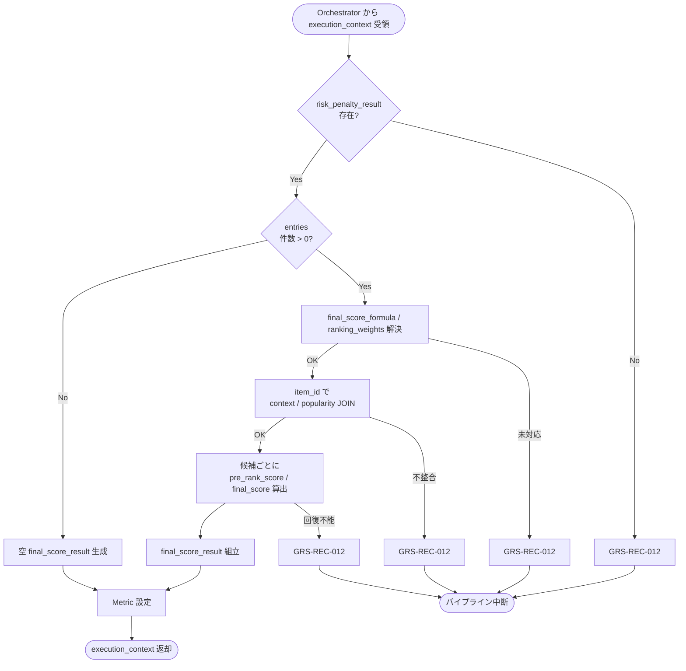

# Final Score Calculator モジュール仕様書

## 1. ドキュメント情報

| 項目           | 内容                                       |
| -------------- | ------------------------------------------ |
| ドキュメントID | `MOD-RECO-019`                             |
| ドキュメント名 | Final Score Calculator モジュール仕様書    |
| 対象システム   | Gift Recommendation Service（`apps/reco`） |
| MVP対象        | `○`                                        |
| 作成日         | 2026-07-03                                 |
| 更新日         | 2026-07-03                                 |

---

## 2. 概要

Final Score Calculator（最終スコア算出）は、Reco オンライン推薦パイプラインの **Ranking フェーズ**において、`MOD-RECO-001` Recommendation Orchestrator から `execution_context` を **1 回**受け取り、`MOD-RECO-016` Context Scorer / `MOD-RECO-017` Popularity Scorer / `MOD-RECO-018` Risk Scorer が算出済みの **`context_score_result`** / **`popularity_score_result`** / **`risk_penalty_result`** を統合し、候補商品ごとに **Pre Rank Score**（`pre_rank_score`）・**Final Score**（`final_score`）・**Score Breakdown**（`score_breakdown`）を算出し、`final_score_result` として `execution_context` へ返却するモジュールである。`MOD-RECO-018` 完了後、**`MOD-RECO-020` Final Ranker の直前**（Ranking フェーズ第 3 ステップ）に Orchestrator から呼び出される。

本モジュールは **`context_score` / `popularity_score` / `risk_penalty` の重み付け統合と `final_score` 算出**に責務を限定し、Context Score 算出（`MOD-RECO-016`）、Popularity Score 算出（`MOD-RECO-017`）、Risk Penalty 算出（`MOD-RECO-018`）、**MMR による候補選定・表示順位決定**（`MOD-RECO-020`）、Recommendation Result 永続化（`MOD-RECO-021`）、推薦理由生成（`MOD-RECO-023`）は行わない。Final Score 算出式の正本は **Ranking定義書** §6 / §9 / §15.3 を正とする。

**命名注記**: Recoモジュール一覧 §6.18 / §8.1 では出力論理名を **`final_score`** と略記する。機能×モジュール対応表・処理構成定義書では候補別集合を **`final_score_result`** と呼ぶ。本仕様書・`execution_context` フィールド名は **`final_score_result`** を正とし、各候補エントリ内に `final_score` / `pre_rank_score` / `score_breakdown` を格納する（§6.2.2）。

---

## 3. 目的

- `apps/reco` における Final Score Calculator 実装・単体テストの前提を定義する
- Orchestrator との I/F（`execution_context` 入出力）、失敗時のパイプライン中断（`GRS-REC-012`）を後続実装可能な粒度で整理する
- 3 系統スコア（context / popularity / risk）から `pre_rank_score` / `final_score` / `score_breakdown` への統合式・欠損補完・境界値方針を明確化する
- Recoモジュール一覧・Ranking定義書・`MOD-RECO-001` / `016` / `017` / `018` / `020` 仕様書との整合を担保する

---

## 4. モジュール基本情報

| 項目 | 内容 |
| ---- | ---- |
| モジュールID | `MOD-RECO-019` |
| モジュール名 | 最終スコア算出 |
| 物理名 | `Final Score Calculator` |
| 分類 | Ranking |
| 処理種別 | `OL` |
| 配置予定 | `apps/reco/src/reco/application/final-score-calculator/**` |
| 所属Epic | `MOD-RECO-019`（Epic Issue #951） |
| MVP対象 | `○` |
| 主な呼び出し元 | `MOD-RECO-001` Recommendation Orchestrator |
| 主な呼び出し先 | なし（Run 内メモリ上の Ranking 中間結果を参照する純粋計算モジュール） |

`MOD-API-*` / `MOD-RECO-*` / `MOD-BATCH-*` 配下の Task では、該当モジュール ID の責務範囲に変更を限定する。`MOD-RECO-*` では `apps/reco/src/reco/api/**` の API-INT エンドポイント層を対象に含めない。

---

## 5. 責務

### 5.1 主責務

- `MOD-RECO-018` 完了後、Orchestrator から **1 回**呼び出され、`execution_context.risk_penalty_result` に含まれる候補ごとの `item_id` を起点に **Final Score** を算出する
- 候補ごとに **`final_score_result`**（`pre_rank_score` / `diversity_penalty` / `final_score` / `score_breakdown`、内訳メタデータ）を組み立て、`execution_context` へ返却し **`MOD-RECO-020`** 以降（Ranking フェーズ続行）へ引き渡す
- **`ranking_config.ranking_weights`**（`w_context` / `w_popularity` / `w_risk`）を解決し、**文脈別の重み調整**（safety / formality 重視文脈での risk 強化等）を **Config パラメータ経由**で反映する（Ranking定義書 §6.2 / §13.1）
- **`context_score_result.entries[].context_score`** / **`popularity_score_result.entries[].popularity_score`** / **`risk_penalty_result.entries[].risk_penalty`** を **item_id で JOIN** し **`pre_rank_score`** を算出する（Ranking定義書 §6.1 / §15.3）
- **`score_breakdown`** を Ranking定義書 §14.2 形式で生成し、後続 **`MOD-RECO-021` / `023`** が説明・永続化に利用できる形で保持する
- MVP では **`diversity_penalty = 0.0`** とし **`final_score = guard_clip(pre_rank_score, 0.0, 1.0)`** とする。**MMR による反復的な多様性制御**は **`MOD-RECO-020`** に委譲する（§16.1 No.1）
- 欠損時は Ranking定義書 §16.1 に従い **算出可能要素のみで補完**し、単一候補の入力欠損を **原則パイプライン失敗にしない**（`context_score` 欠損候補は除外）
- 成功時に **Ranking フェーズ向け Metric**（§12.1）を Orchestrator / `MOD-RECO-025` 経由で依頼する
- 回復不能失敗時 **`GRS-REC-012`** を Orchestrator へ返却し、パイプライン中断を促す

### 5.2 対象外責務

- `API-INT-002` エンドポイント層
- `MOD-RECO-001` Orchestrator の実行順序制御・Phase Log 契機の物理実装
- **Context Score 算出**（`MOD-RECO-016` 責務）
- **Popularity Score 算出**（`MOD-RECO-017` 責務）
- **Risk Penalty 算出**（`MOD-RECO-018` 責務）
- **MMR 反復選定・top_k 選定・表示順位（`rank`）決定**（`MOD-RECO-020` 責務）
- **同一カテゴリ・類似商品の偏り調整の物理実装**（`MOD-RECO-020` 責務。本モジュールは `diversity_penalty` フィールドを **MVP では 0.0 固定**で保持のみ）
- **`recommendation_result_item` への DB INSERT**（`MOD-RECO-021` 責務）
- **推薦理由（Reason）生成**（`MOD-RECO-023` 責務）
- Phase Log `ranking_completed` の **最終記録**（Ranking フェーズ `017`〜`020` 完了後に Orchestrator が記録。§12）
- OpenAPI / DB schema 変更

---

## 6. 入出力

### 6.1 入力（Orchestrator → 本モジュール）

| 入力 | 型 / 構造 | 必須 | 生成元 | 用途 | 備考 |
| ---- | --------- | ---- | ------ | ---- | ---- |
| `execution_context` | パイプライン実行コンテキスト | `true` | `MOD-RECO-001` | 処理起点 | |
| `execution_context.risk_penalty_result` | 候補別 Risk Penalty 結果集合 | `true` | `MOD-RECO-018` | 候補キー・処理順序・`risk_penalty` | §6.2.1 |
| `execution_context.context_score_result` | 候補別 Context Score 結果集合 | `true` | `MOD-RECO-016` | `context_score` | §6.2.3 |
| `execution_context.popularity_score_result` | 候補別 Popularity Score 結果集合 | `true` | `MOD-RECO-017` | `popularity_score` | §6.2.4 |
| `execution_context.config_versions` | Config 群 | `true` | `MOD-RECO-003` | `ranking_weights` / `final_score_formula` 解決 | §8.3.2 |
| `execution_context.run_id` | `uuid` | `true` | `MOD-RECO-002` | ログ相関 | |

**前提**: `MOD-RECO-018` が完了済み（Orchestrator 論理順序 18 まで）。`risk_penalty_result.entries` に **1 件以上**あることが Orchestrator 呼び出し前提（§8.3.5）。

**空入力（防御的）**: `risk_penalty_result.entries` が空の場合、本モジュールは **空 `final_score_result` を返却し成功**とする（`GRS-REC-012` にしない）。通常は Orchestrator が **`MOD-RECO-019` を呼ばず早期 0 件終了**する（`MOD-RECO-018` §16.1 No.8 と同型）。

**参照のみ（MVP 算式非算入）**: `execution_context.user_context`（`lambda_ctx` 等）は **本モジュールの MVP 算式には直接使用しない**。文脈別重み調整は **`ranking_config.ranking_weights`**（Config 解決済み値）で表現する（`MOD-RECO-016` / `017` / `018` と同型）。

### 6.2 出力（本モジュール → Orchestrator / 後続）

| 出力 | 型 / 構造 | 利用先 | 用途 | 備考 |
| ---- | --------- | ------ | ---- | ---- |
| `execution_context.final_score_result` | 候補別 Final Score 結果集合 | `MOD-RECO-020`〜`021` | Ranking / Result 入力 | §6.2.2 |
| `final_score_calculator_candidate_count` | `number` | Orchestrator / `MOD-RECO-025` | 算出完了候補数 | 0 件も正常 |
| `final_score_excluded_candidate_count` | `number` | Orchestrator / Metric | `context_score` 欠損等で除外した件数 | §8.3.4 |
| `reco_error` | 標準化 reco エラー | Orchestrator | 失敗時 | `GRS-REC-012` |

#### 6.2.1 `risk_penalty_result`（入力・参照）

`MOD-RECO-018` モジュール仕様書 §6.2.2 を正とする。本モジュールは以下を **読み取りのみ**使用する。

| フィールド | 必須 | 内容 |
| ---------- | ---- | ---- |
| `entries[]` | `true` | 候補ごとの Risk Penalty 結果 |
| `entries[].item_id` | `true` | 候補商品 ID |
| `entries[].risk_penalty` | `true` | Risk Penalty（本モジュールでは再計算しない） |
| `total_scored` | `true` | `entries` 件数（整合検証用） |

本モジュールは `risk_penalty_result` を **変更せず**、`execution_context` に残す（読み取り専用）。

#### 6.2.2 `final_score_result`（MVP 概要）

`execution_context` フィールド名は **`final_score_result`**。ドメイン型は **`FinalScoreResult`**（配置: `apps/reco/src/reco/application/final-score-calculator/models.py` または `domain/**`。実装 Task で最終配置を確定）。論理上は以下を含む。

| フィールド | 必須 | 内容 |
| ---------- | ---- | ---- |
| `entries[]` | `true` | 候補ごとの Final Score 結果 |
| `entries[].item_id` | `true` | 候補商品 ID（入力と 1:1） |
| `entries[].context_score` | `true` | 統合に使用した Context Score（エコー） |
| `entries[].popularity_score` | `true` | 統合に使用した Popularity Score（エコー） |
| `entries[].risk_penalty` | `true` | 統合に使用した Risk Penalty（エコー） |
| `entries[].pre_rank_score` | `true` | Pre Rank Score（多様性制御前） |
| `entries[].diversity_penalty` | `true` | 多様性補正値。MVP は **0.0 固定** |
| `entries[].final_score` | `true` | Final Score（0.0〜1.0） |
| `entries[].score_breakdown` | `true` | スコア内訳 JSON（§8.3.3） |
| `entries[].final_score_formula` | `true` | MVP: `linear_weighted_v1` 固定 |
| `entries[].ranking_weights_used` | `true` | 使用した `w_context` / `w_popularity` / `w_risk` |
| `entries[].calculated_at` | `true` | 算出日時（UTC） |
| `entries[].ranking_config_id` | `true` | 使用した Ranking Config ID（`config_versions` からエコー） |
| `total_scored` | `true` | `entries` 件数 |

**上流スコアの再格納**: 候補ごとの `context_score` / `popularity_score` / `risk_penalty` は各 `*_result` を正本とする。本モジュールは **統合結果と内訳**を `final_score_result` に追加する（`021` の `score_breakdown_json` 生成を容易にするため、エントリ内に主要スコアをエコーする）。

#### 6.2.3 `context_score_result`（入力・参照）

`MOD-RECO-016` モジュール仕様書 §6.2.2 を正とする。本モジュールは以下を **読み取りのみ**使用する。

| フィールド | 必須 | 内容 |
| ---------- | ---- | ---- |
| `entries[]` | `true` | 候補ごとの Context Score 結果 |
| `entries[].item_id` | `true` | 候補商品 ID（`risk_penalty_result` と JOIN） |
| `entries[].context_score` | `true` | Context Score |

JOIN 失敗（`item_id` が `context_score_result` に存在しない）の場合は **`GRS-REC-012`**（データ不整合）。

`context_score` 欠損（`null`）の候補は Ranking定義書 §16.1 に従い **当該候補を除外**し、`final_score_excluded_candidate_count` を加算する（パイプライン全体は継続。残候補 0 件は §8.3.4）。

#### 6.2.4 `popularity_score_result`（入力・参照）

`MOD-RECO-017` モジュール仕様書 §6.2.2 を正とする。本モジュールは以下を **読み取りのみ**使用する。

| フィールド | 必須 | 内容 |
| ---------- | ---- | ---- |
| `entries[]` | `true` | 候補ごとの Popularity Score 結果 |
| `entries[].item_id` | `true` | 候補商品 ID |
| `entries[].popularity_score` | `true` | Popularity Score |

JOIN 失敗の場合は **`GRS-REC-012`**。`popularity_score` 欠損時は Ranking定義書 §16.1 に従い **`0.5` で補完**して継続する。

---

## 7. 依存関係

### 7.1 依存モジュール

| 依存先 | 方向 | 用途 | 失敗時 | 備考 |
| ------ | ---- | ---- | ------ | ---- |
| `MOD-RECO-001` | 被呼び出し | Ranking フェーズ契機 | — | `018` 直後・`020` 直前 |
| `MOD-RECO-016` | 間接 | `context_score_result` | 未到達 | Matching/Ranking 境界 |
| `MOD-RECO-017` | 間接 | `popularity_score_result` | 未到達 | Ranking 第 1 ステップ |
| `MOD-RECO-018` | 間接 | `risk_penalty_result` | 未到達 | 入力正本・候補順序 |
| `MOD-RECO-003` | 間接 | `config_versions` / `ranking_config_id` | 未到達 | §8.3.2 |
| `MOD-RECO-020` / `021` | 下流利用 | `final_score` / `score_breakdown` | — | Rank / Result 構築 |
| `MOD-RECO-025` | 間接 | Final Score 分布 Metric | — | §12.1 |
| `MOD-RECO-028` / `024` / `029` | 間接 | 観測・エラー | — | Orchestrator 経由 |

**下流利用**: `MOD-RECO-020` Final Ranker が `final_score_result.entries[].final_score` を順位決定の主入力とする。`MOD-RECO-021` が `score_breakdown` を `recommendation_result_item.score_breakdown_json` へ反映する（Ranking定義書 §14.3）。

### 7.2 参照データ

| データ | 参照元 | 用途 | version / config | 備考 |
| ------ | ------ | ---- | ---------------- | ---- |
| `context_score_result` | `execution_context`（`MOD-RECO-016` 出力） | `context_score` | Run 内メモリ | DB 参照なし |
| `popularity_score_result` | `execution_context`（`MOD-RECO-017` 出力） | `popularity_score` | Run 内メモリ | DB 参照なし |
| `risk_penalty_result` | `execution_context`（`MOD-RECO-018` 出力） | `risk_penalty` / 候補順序 | Run 内メモリ | DB 参照なし |
| `ranking_weights` / `final_score_formula` | `config_versions.ranking_config.parameter_json` | 重み・式識別子 | `ranking_config_id` 紐づけ | §8.3.2 |

---

## 8. 処理仕様

### 8.1 処理フロー



**注記（Orchestrator 呼び出し）**: `risk_penalty_result.entries` が空（Matching 対象 0 件）のとき、Orchestrator は通常 **本モジュールを呼ばず**、`MOD-RECO-019` 以降をスキップして早期 0 件終了する（`MOD-RECO-018` §8.1 注記と同型）。下図の `CHECK_E` → `EMPTY` 分岐は防御的フォールバックである。

### 8.2 処理ステップ

| No | 処理 | 入力 | 出力 | 補足 |
| --: | ---- | ---- | ---- | ---- |
| 1 | 入力検証 | `execution_context` | — | 3 系統 `*_result` 必須 |
| 2 | 空入力判定 | `entries[]` | — | 0 件は Step 8 へ（空 output） |
| 3 | 算出式・重み解決 | `config_versions` | `final_score_formula` / weights | §8.3.2 |
| 4 | 候補 ID 抽出 | `risk_penalty_result.entries[].item_id` | `item_ids[]` | 入力順序維持 |
| 5 | スコア JOIN | `item_ids[]` + 各 result | 候補別 3 スコア | `item_id` 不一致は失敗 |
| 6 | 候補ごと Pre Rank 算出 | context / popularity / risk / weights | `pre_rank_score` | §8.3.1 |
| 7 | 候補ごと Final Score 算出 | `pre_rank_score` | `final_score` / `diversity_penalty` | MVP: diversity=0 |
| 8 | score_breakdown 生成 | 中間結果 | `score_breakdown` | §8.3.3 |
| 9 | 結果組立 | 中間結果 | `final_score_result` | §6.2.2 |
| 10 | 観測値設定 | 件数・除外数 | Metric 用カウンタ | Orchestrator へ |

**候補処理順（MVP）**: `risk_penalty_result.entries[]` の **入力順序を維持**する（`MOD-RECO-018` 出力順＝Matching パイプライン順）。

### 8.3 アルゴリズム / 計算仕様

Final Score 算出式の正本は **Ranking定義書** §6 / §9 / §15.3。本モジュールは **3 系統スコアの重み付け統合と `final_score` 算出**を実装し、MMR / 順位決定は **`MOD-RECO-020`** に委譲する。

#### 8.3.1 Pre Rank Score / Final Score（MVP 必須）

| 項目 | 内容 |
| ---- | ---- |
| 算出式識別子 | **`linear_weighted_v1`**（`ranking_config.parameter_json.final_score_formula`） |
| 入力 | `context_score` / `popularity_score` / `risk_penalty` / `ranking_weights` |
| 値域 | **0.0〜1.0**（最終出力時 clip） |
| 参照 | Ranking定義書 §6.1 / §9.1 / §15.3 |

**MVP 採用式**（Ranking定義書 §6.1 / §15.3 準拠）:

```text
pre_rank_score
= w_context * context_score
+ w_popularity * popularity_score
- w_risk * risk_penalty

diversity_penalty = 0.0   # MVP: MOD-RECO-020 が MMR を担当（§16.1 No.1）

final_score = guard_clip(pre_rank_score - diversity_penalty, 0.0, 1.0)
result = round_to_scale(final_score, 6)
```

**guard_clip（MVP）**:

```text
if context_score is None:
    exclude candidate  # Ranking §16.1
    continue

if popularity_score is None:
    popularity_score = 0.5
    signal_missing = true

if risk_penalty is None:
    risk_penalty = 0.0
    signal_missing = true

pre_rank_score = w_context * context_score + w_popularity * popularity_score - w_risk * risk_penalty
pre_rank_score = guard_clip(pre_rank_score, 0.0, 1.0)

diversity_penalty = 0.0
final_score = guard_clip(pre_rank_score - diversity_penalty, 0.0, 1.0)
```

**算出例**（Ranking定義書 §6.2 初期重み準拠）:

```text
context_score = 0.84
popularity_score = 0.72
risk_penalty = 0.10
w_context = 0.70
w_popularity = 0.20
w_risk = 0.10

pre_rank_score = 0.70 * 0.84 + 0.20 * 0.72 - 0.10 * 0.10
               = 0.588 + 0.144 - 0.010
               = 0.722

diversity_penalty = 0.0
final_score = 0.722
```

#### 8.3.2 `final_score_formula` / `ranking_weights`（`ranking_config` 参照）

| 項目 | 内容 |
| ---- | ---- |
| 解決キー | `execution_context.config_versions.ranking_config_id` |
| 取得元 | `ranking_config.parameter_json`（`MOD-RECO-003` 解決済み） |
| MVP 対応式 | **`linear_weighted_v1` のみ** |
| 未対応 formula | **`GRS-REC-012`** |
| formula 欠損 | MVP では **`linear_weighted_v1` を暗黙デフォルト** |

**MVP 重み**（Ranking定義書 §6.2 / `ranking_config_テーブル定義書` §4.1。`parameter_json.ranking_weights` 未整備時のデフォルト）:

| キー | 初期値 | 意味 |
| ---- | -----: | ---- |
| `w_context` / `ranking_weights.context` | `0.70` | 意味一致の重み |
| `w_popularity` / `ranking_weights.popularity` | `0.20` | 人気・信頼性の重み |
| `w_risk` / `ranking_weights.risk` | `0.10` | リスク減点の重み |

**重み合計**: MVP では `w_context + w_popularity + w_risk ≈ 1.0`（許容誤差 0.001。`ranking_config` CHECK 制約と整合）。

**文脈別重み**: Recoモジュール一覧 §6.16〜§6.18 の「safety / formality 文脈で risk を強める」等は、**`ranking_config` の文脈別 Config 行**（将来）または **Run 時に解決済みの `ranking_weights`** として本モジュールに渡される。本モジュールは **`lambda_ctx` を直接参照せず**、解決済み weights を使用する（`MOD-RECO-017` / `018` §16.1 No.10 と同型）。

**MVP 初期 seed 拡張例**（`ranking_config.parameter_json`。Ranking定義書 §13.1 準拠。seed 反映は別 Task 可）:

```json
{
  "final_score_formula": "linear_weighted_v1",
  "ranking_weights": {
    "context": 0.70,
    "popularity": 0.20,
    "risk": 0.10
  }
}
```

> **注記**: 現行 `ranking_config_テーブル定義書` §6.1 の MVP seed には `final_score_formula` キーが未収載の可能性がある。本モジュールは **Ranking定義書 §6.2 の初期値を暗黙デフォルト**として使用し、`parameter_json` にキーが存在する場合はそちらを優先する。seed 正式反映は **MOD-RECO-019 Epic 外 Task**（§16.1 No.12）。

#### 8.3.3 `score_breakdown`（MVP 必須）

Ranking定義書 §14.2 形式。各候補の `entries[].score_breakdown` に格納する。

```json
{
  "context": {
    "score": 0.84,
    "weight": 0.70,
    "contribution": 0.588
  },
  "popularity": {
    "score": 0.72,
    "weight": 0.20,
    "contribution": 0.144
  },
  "risk": {
    "penalty": 0.10,
    "weight": 0.10,
    "contribution": -0.010
  },
  "diversity": {
    "penalty": 0.00
  },
  "pre_rank_score": 0.722,
  "final_score": 0.722
}
```

| フィールド | 算出 |
| ---------- | ---- |
| `context.contribution` | `w_context * context_score` |
| `popularity.contribution` | `w_popularity * popularity_score` |
| `risk.contribution` | `- w_risk * risk_penalty` |
| `diversity.penalty` | MVP: **0.0** |
| `pre_rank_score` / `final_score` | §8.3.1 と一致 |

#### 8.3.4 入力欠損・境界値

| ケース | MVP 方針 | パイプライン |
| ------ | -------- | ------------ |
| `risk_penalty_result` 不在 | **`GRS-REC-012`** | 中断 |
| `context_score_result` / `popularity_score_result` 不在 | **`GRS-REC-012`** | 中断 |
| `entries` 0 件 | **成功**（空 output） | 継続（通常は Orchestrator が呼ばない） |
| `item_id` JOIN 不一致 | **`GRS-REC-012`** | 中断 |
| `context_score` 欠損（候補単位） | **当該候補を除外** | **継続**（Ranking §16.1） |
| `popularity_score` 欠損 | **`0.5` で補完** | **継続** |
| `risk_penalty` 欠損 | **`0.0` で補完** | **継続** |
| 3 スコア値域外 | clip 後に算出 + warn Metric | **継続** |
| 除外後 `entries` 0 件 | **成功**（空 output） | 継続 |
| 未対応 `final_score_formula` | **`GRS-REC-012`** | 中断 |
| `ranking_weights` 合計が 1.0 から大きく乖離 | warn + 正規化または **`GRS-REC-012`** | 実装 Task で方針確定（§16.1 No.11） |
| 内部計算エラー | **`GRS-REC-012`** | 中断 |

**補完と失敗の区別**: popularity / risk **入力欠損**は Ranking定義書 §16.1 に従い **補完して継続**する。**context_score 欠損候補の除外**は Ranking 不可扱い。**インフラ障害・設定不整合・候補 JOIN 不整合**は `GRS-REC-012` で中断する。

#### 8.3.5 Orchestrator Port 契約（MVP）

| 項目 | 内容 |
| ---- | ---- |
| 呼び出し | `calculate_final_score(execution_context) -> execution_context`（名称は実装 Task で確定） |
| 成功 | `final_score_result` / `final_score_calculator_candidate_count` が設定される |
| 成功（算出対象 0 件） | 空 `final_score_result` で **成功**（防御的） |
| 失敗 | `GRS-REC-012`。`020` 以降は呼ばれない |
| Phase Log | **`ranking_completed` は Ranking フェーズ（`017`〜`020`）完了後に Orchestrator が記録** |
| Wiring | Ranking フェーズ（`017`〜`020`）は **未配線（スタブ）**（MOD-RECO-001 §8.4.2） |

---

## 9. データ項目マッピング

| 入力項目 | 内部項目 | 出力項目 | 変換内容 | 備考 |
| -------- | -------- | -------- | -------- | ---- |
| `risk_penalty_result.entries[].item_id` | 候補キー | `final_score_result.entries[].item_id` | 1:1 エコー | 順序維持 |
| `context_score_result.entries[].context_score` | `context_score` | `entries[].context_score` | JOIN | 欠損時除外 |
| `popularity_score_result.entries[].popularity_score` | `popularity_score` | `entries[].popularity_score` | JOIN / 欠損 0.5 | |
| `risk_penalty_result.entries[].risk_penalty` | `risk_penalty` | `entries[].risk_penalty` | JOIN / 欠損 0.0 | |
| — | 算出 | `entries[].pre_rank_score` | §8.3.1 線形加重 | |
| — | 固定（MVP） | `entries[].diversity_penalty` | `0.0` | §16.1 No.1 |
| — | 算出 | `entries[].final_score` | clip(pre_rank - diversity) | |
| — | 算出 | `entries[].score_breakdown` | §8.3.3 | |
| `config_versions.ranking_config_id` | Ranking version | `entries[].ranking_config_id` | エコー | 再現性 |
| `parameter_json.ranking_weights` | weights | `entries[].ranking_weights_used` | エコー | |
| — | 固定 | `entries[].final_score_formula` | `linear_weighted_v1` | MVP |

---

## 10. 状態・例外

### 10.1 状態

本モジュールは **ステートレス**（Run 内 1 回呼び出し）。

| 状態 | 意味 | 遷移条件 | 記録先 |
| ---- | ---- | -------- | ------ |
| — | モジュール内部状態なし | — | — |

### 10.2 例外

| 例外 | Error Code | 発生条件 | 呼び出し元への返却 | ログ |
| ---- | ---------- | -------- | ------------------ | ---- |
| Final Score 算出失敗 | `GRS-REC-012` | 入力 result 欠損・JOIN 不整合・未対応 formula・内部エラー | 500 系・中断 | Error Log + Phase failed |
| 算出対象 0 件 | — | 入力 `entries` 0 件、または全候補除外後 0 件 | **成功**（空 output） | `final_score_calculator_candidate_count = 0` |
| popularity / risk 入力欠損 | —（継続） | 中立補完 | パイプライン継続 | **warning** + Metric |
| context_score 欠損（候補単位） | —（継続） | 当該候補除外 | パイプライン継続 | **warning** + `final_score_excluded_candidate_count` |

**リトライ**: モジュール内自動リトライ **なし**（MVP）。

Error Code の正本はエラーコード定義書。Orchestrator は `MOD-RECO-024` 経由で標準化結果を呼び出し元へ伝播する。

---

## 11. DB / 永続化

### 11.1 書き込み

| テーブル | 操作 | 備考 |
| -------- | ---- | ---- |
| 正本テーブル | **なし** | 算出結果は Run 内メモリ |

### 11.2 読み取り

| テーブル | 操作 | 用途 | 備考 |
| -------- | ---- | ---- | ---- |
| — | — | — | **MVP では DB 参照なし**（入力は `016` / `017` / `018` の Run 内 result） |

**方針**: `final_score` / `score_breakdown` の Run 結果永続化は **`MOD-RECO-021` Recommendation Result Builder** が `recommendation_result_item.final_score` / `score_breakdown_json` 等へ反映する（`recommendation_result_item_テーブル定義書` §6）。

---

## 12. ログ・メトリクス

| 種別 | 内容 | タイミング | 保存先 | 備考 |
| ---- | ---- | ---------- | ------ | ---- |
| Phase Log | `ranking_completed` | Ranking フェーズ（`017`〜`020`）**全体成功後** | `phase_log`（`MOD-RECO-028`） | **本モジュール単独では記録しない** |
| Metric | `final_score_calculator_*` 等 | 成功 | Metric Logger（`MOD-RECO-025`） | §12.1 |
| Error Log | `GRS-REC-012` | 失敗 | `error_log`（`MOD-RECO-029`） | |
| 構造化ログ | 算出サマリ（件数・除外数・duration_ms） | 成功 / 警告 | アプリログ | `trace_id` 必須。候補ごとの score 全量ダンプ禁止 |

### 12.1 メトリクス

| Metric | 内容 | 集計単位 | 用途 |
| ------ | ---- | -------- | ---- |
| `final_score_calculator_candidate_count` | Final Score 算出完了候補数 | Run | 候補数推移 |
| `final_score_calculator_latency_ms` | 本モジュール処理時間 | Run | 性能監視（Ranking 一括 1,000ms 上限の内訳） |
| `final_score_distribution` | `final_score` 分布 | Run | ログ・Observability設計書 §11.2 相当 |
| `pre_rank_score_distribution` | `pre_rank_score` 分布 | Run | MMR 前傾向（`020` 連携） |
| `final_score_excluded_candidate_count` | `context_score` 欠損等で除外した件数 | Run | データ品質監視 |
| `final_score_value_out_of_range_count` | clip 適用件数 | Run | 入力異常監視 |

**Ranking フェーズ Metric（共有）**: `ranking_latency_ms` はログ・Observability設計書 §11.2 に従い、Ranking フェーズ全体（`017`〜`020`）または Metric Logger 側で集約してよい。

---

## 13. 性能・非機能

| 観点 | 方針 |
| ---- | ---- |
| レイテンシ | モジュール単体 hard timeout は設けない。Ranking 一括（`017`〜`020`）**hard 1,000ms** 上位ガード（MOD-RECO-001 §13.2） |
| 計算量 | 候補件数 O(n) × 定数時間算出。n ≤ `candidate_limit` |
| DB アクセス | **MVP なし**（Run 内メモリ JOIN のみ） |
| タイムアウト | 上位 Orchestrator に従う |
| リトライ | なし（MVP） |
| キャッシュ | Run 横断キャッシュなし（MVP） |
| 並列実行 | 同一 Run 内 1 回・同期実行 |

---

## 14. テスト観点

| No | 観点 | 確認内容 | 種別 |
| --: | ---- | -------- | ---- |
| 1 | 正常系（基本算出） | Ranking定義書 §15.3 の疑似コードと `pre_rank_score` / `final_score` が一致すること | unit |
| 2 | 正常系（context 最重視） | 高 `context_score` / 低 popularity / 低 risk で score が高くなること | unit |
| 3 | 正常系（risk 減点） | 高 `risk_penalty` で `final_score` が下がること | unit |
| 4 | 正常系（候補複数） | 候補ごとに `entries[]` が生成され入力順が維持されること | unit |
| 5 | score_breakdown | §8.3.3 の contribution が式と一致すること | unit |
| 6 | 境界値（満点） | 各スコア 1.0 / risk 0.0 で `pre_rank_score ≈ 1.0` | unit |
| 7 | 境界値（risk 最大） | `risk_penalty=1.0` で適切に減点されること | unit |
| 8 | 欠損（popularity） | `popularity_score=0.5` 補完・**成功** | unit |
| 9 | 欠損（risk） | `risk_penalty=0.0` 補完・**成功** | unit |
| 10 | 欠損（context・候補単位） | 当該候補除外・他候補は継続 | unit |
| 11 | 入力 0 件 | 成功・空 `final_score_result`・`GRS-REC-012` にならないこと | unit |
| 12 | `risk_penalty_result` 欠損 | `GRS-REC-012` になること | unit |
| 13 | JOIN 不整合 | `item_id` 不一致で `GRS-REC-012` | unit |
| 14 | 未対応 formula | `GRS-REC-012` になること | unit |
| 15 | Orchestrator 連携 | `018` 後 1 回呼び出し・失敗時 `020` 未到達 | integration |
| 16 | 責務境界 | MMR / rank 決定 / 上流スコア再算出を行わないこと | unit |
| 17 | Metric | `final_score_calculator_*` / 分布 Metric が記録されること | integration |
| 18 | ログ | `trace_id` あり・score 全量ダンプ・secret なし | unit |
| 19 | 上流 result 不変 | 入力 `context_score_result` 等が変更されないこと | unit |
| 20 | ranking_weights | Config 指定 weights が `score_breakdown` / `ranking_weights_used` に反映されること | unit |

---

## 15. 変更管理

### 15.1 変更履歴

| 日付 | 変更内容 | 関連 Issue / PR |
| ---- | -------- | --------------- |
| 2026-07-03 | 初版作成 | Issue #952 |

---

## 16. 未決事項

| No | 論点 | 判断が必要な理由 | 判断者 | 期限 | 備考 |
| --: | ---- | ---------------- | ------ | ---- | ---- |
| - | なし | - | - | - | MVP 着手前論点は §16.1 へ移管済み |

### 16.1 確定済み論点

| No | 論点 | 確定内容 |
| --: | ---- | -------- |
| 1 | MVP 多様性制御の担当 | **`diversity_penalty = 0.0` 固定**。**MMR 反復選定・`lambda_mmr` 適用は `MOD-RECO-020` Final Ranker**（MOD-RECO-001 論理順序 20「final_score / diversity」・Ranking §10 / §11.3 と整合）。本モジュールは `score_breakdown.diversity.penalty` を **0.0 で保持**し、Post-MVP で `020` が更新する拡張余地を残す |
| 2 | 算出式 | MVP は **`linear_weighted_v1`**（Ranking定義書 §6.1 / §15.3） |
| 3 | 初期重み | `w_context=0.70` / `w_popularity=0.20` / `w_risk=0.10`（Ranking定義書 §6.2。`parameter_json` 優先） |
| 4 | 出力フィールド名 | **`execution_context.final_score_result`** |
| 5 | 入力正本（候補） | **`execution_context.risk_penalty_result`**（`018` 出力。`016` / `017` は JOIN 参照） |
| 6 | 欠損時 | popularity / risk は **中立補完で継続**。`context_score` 欠損候補は **除外**（Ranking §16.1）。設定不整合・JOIN 失敗は `GRS-REC-012` |
| 7 | Phase Log | **`ranking_completed` は `017`〜`020` 完了後に Orchestrator が記録** |
| 8 | 0 件早期終了 | Matching 対象 0 件時、Orchestrator は通常 **`019` 以降を呼ばない** |
| 9 | スコア精度 | **`round_to_scale(..., 6)`**（`recommendation_result_item` の numeric 列と整合） |
| 10 | 文脈別重み | **各スコア（context / popularity / risk）は上流モジュールで文脈非依存の素の値**。文脈別 `w_*` 調整は **`ranking_config.ranking_weights`**（Config 解決済み）で本モジュールが適用（`MOD-RECO-017` §16.1 No.10 / `018` §16.1 No.10 と同型） |
| 11 | `ranking_weights` 合計乖離 | **warn + 正規化（各 weight / sum）を MVP デフォルト**。合計 0 または負値は **`GRS-REC-012`**（実装 Task で単体テスト固定） |
| 12 | `final_score_formula` / `ranking_weights` seed 反映 | **`ranking_config.parameter_json` への追加は MOD-RECO-019 Epic 外の docs/chore Task** で実施可。本 Epic **実装 Task は暗黙デフォルトで着手可** |

---

## 17. 関連資料

| 種別 | パス | 用途 |
| ---- | ---- | ---- |
| Recoモジュール一覧 | `docs/05_アプリケーション設計/アプリ/reco/Recoモジュール一覧.md` | §6.18 |
| モジュール一覧 | `docs/05_アプリケーション設計/アプリ/モジュール一覧.md` | Ranking 分類 |
| 機能×モジュール対応表 | `docs/05_アプリケーション設計/アプリ/機能×モジュール対応表.md` | `final_score` |
| Ranking定義書 | `docs/04_ドメインモデル設計/Ranking定義書.md` | Final Score 算出式・score_breakdown |
| ranking_config テーブル定義書 | `docs/06_実装設計/database/ranking_config_テーブル定義書.md` | Ranking パラメータ |
| recommendation_result_item テーブル定義書 | `docs/06_実装設計/database/recommendation_result_item_テーブル定義書.md` | score_breakdown 永続化 |
| MOD-RECO-001 | `docs/06_実装設計/reco/MOD-RECO-001_Recommendation Orchestratorモジュール仕様書.md` | 呼び出し・`GRS-REC-012` |
| MOD-RECO-003 | `docs/06_実装設計/reco/MOD-RECO-003_Config Version Resolverモジュール仕様書.md` | `ranking_config_id` 解決 |
| MOD-RECO-016 | `docs/06_実装設計/reco/MOD-RECO-016_Context Scorerモジュール仕様書.md` | `context_score` 入力 |
| MOD-RECO-017 | `docs/06_実装設計/reco/MOD-RECO-017_Popularity Scorerモジュール仕様書.md` | `popularity_score` 入力 |
| MOD-RECO-018 | `docs/06_実装設計/reco/MOD-RECO-018_Risk Scorerモジュール仕様書.md` | 直前モジュール・入力正本 |
| MOD-RECO-020 | Recoモジュール一覧 §6.19 | 後続 Final Ranker（MMR / rank） |
| エラーコード定義書 | `docs/05_アプリケーション設計/アプリ/エラーコード定義書.md` | `GRS-REC-012` |
| ログ・Observability設計書 | `docs/05_アプリケーション設計/アプリ/ログ・Observability設計書.md` | Phase / Metric |
| Epic Definition | `prompts/definitions/epics/mod-reco-019-final-score-calculator/epic.yaml` | `allowed_paths` |

---

## 18. レビュー観点

- Recoモジュール一覧 §6.18 のモジュール名・物理名・入出力と一致している
- Ranking定義書 §6 / §9 / §14.2 / §15.3 の Final Score 算出式・score_breakdown と一致している
- Orchestrator Port 契約（`execution_context` 入出力・`GRS-REC-012`）が MOD-RECO-001 と整合している
- `MOD-RECO-016` / `017` / `018` との責務境界（各スコア算出は上流、統合は本モジュール）が明確である
- `MOD-RECO-020` との責務境界（MMR / rank は下流、本モジュールはスコア算出のみ）が明確である
- API-INT-002 エンドポイント層を責務範囲に含めていない
- secret や `.env` 実値が含まれていない

---

## 19. 備考

- Ranking定義書 §12.3 の優先度（`context_score > popularity_score > risk_penalty`）は **`ranking_weights`（初期 0.70 / 0.20 / 0.10）** で実現し、本モジュールは **統合のみ**を担当する
- Recoモジュール一覧 §5.2 論理順序 18 の主な入出力（`context_score` / `popularity_score` / `risk_penalty` → `final_score`）と整合する。§6.18 の「diversity情報」は **MVP では `MOD-RECO-020` が MMR 入力として `feature_match_result` 等を参照**し、本モジュールは `diversity_penalty=0.0` を保持する（§16.1 No.1）
- 機能×モジュール対応表の `diversity` 入力は、**Post-MVP で本モジュールが per-item diversity_penalty を算入する拡張**を示唆する。MVP scope 外として `020` に委譲する
