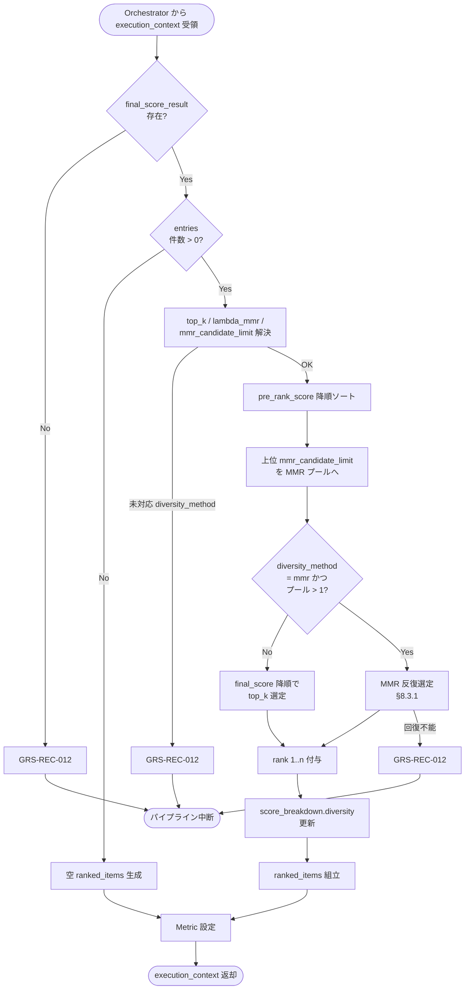

# Final Ranker モジュール仕様書

## 1. ドキュメント情報

| 項目           | 内容                                       |
| -------------- | ------------------------------------------ |
| ドキュメントID | `MOD-RECO-020`                             |
| ドキュメント名 | Final Ranker モジュール仕様書              |
| 対象システム   | Gift Recommendation Service（`apps/reco`） |
| MVP対象        | `○`                                        |
| 作成日         | 2026-07-03                                 |
| 更新日         | 2026-07-03                                 |

---

## 2. 概要

Final Ranker（最終順位生成）は、Reco オンライン推薦パイプラインの **Ranking フェーズ最終段**において、`MOD-RECO-001` Recommendation Orchestrator から `execution_context` を **1 回**受け取り、`MOD-RECO-019` Final Score Calculator が算出済みの **`final_score_result`** を主入力とし、**MMR（Maximal Marginal Relevance）** による多様性制御と **`top_k` 選定**を行ったうえで候補商品ごとに **表示順位 `rank`**（1 始まり）を付与し、`ranked_items` として `execution_context` へ返却するモジュールである。`MOD-RECO-019` 完了後、**`MOD-RECO-021` Recommendation Result Builder の直前**（Ranking フェーズ第 4・最終ステップ）に Orchestrator から呼び出される。

本モジュールは **`final_score` に基づく順位決定・MMR 反復選定・`top_k` 件の確定**に責務を限定し、Final Score 統合（`MOD-RECO-019`）、Context / Popularity / Risk 各スコア算出（`MOD-RECO-016`〜`018`）、Recommendation Result 永続化（`MOD-RECO-021`）、推薦理由生成（`MOD-RECO-023`）、`API-INT-002` エンドポイント層は行わない。MMR 算式・`top_k` 方針の正本は **Ranking定義書** §10 / §11 / §15.4 を正とする。

**命名注記**: Recoモジュール一覧 §6.19 / §8.1 では出力論理名を **`ranked_items`** と記載する。機能×モジュール対応表では **`rank` / `ranked_items`** を併記する。本仕様書・`execution_context` フィールド名は **`ranked_items`** を正とし、各エントリ内に `rank` / `final_score` / `score_breakdown`（多様性メタデータ更新後）等を格納する（§6.2.2）。Recommendation Result 永続化時の `recommendation_result_item.rank` へのマッピングは **`MOD-RECO-021`** が担当する（RecommendationResult定義書 §6.2.1）。

---

## 3. 目的

- `apps/reco` における Final Ranker 実装・単体テストの前提を定義する
- Orchestrator との I/F（`execution_context` 入出力）、失敗時のパイプライン中断（`GRS-REC-012`）を後続実装可能な粒度で整理する
- `final_score_result` から `ranked_items` への変換、MMR 反復選定、`top_k` 解決、同点時タイブレークを明確化する
- Recoモジュール一覧・Ranking定義書・`MOD-RECO-001` / `019` / `021` 仕様書との整合を担保する

---

## 4. モジュール基本情報

| 項目 | 内容 |
| ---- | ---- |
| モジュールID | `MOD-RECO-020` |
| モジュール名 | 最終順位生成 |
| 物理名 | `Final Ranker` |
| 分類 | Ranking |
| 処理種別 | `OL` |
| 配置予定 | `apps/reco/src/reco/application/final-ranker/**` |
| 所属Epic | `MOD-RECO-020`（Epic Issue #959） |
| MVP対象 | `○` |
| 主な呼び出し元 | `MOD-RECO-001` Recommendation Orchestrator |
| 主な呼び出し先 | なし（Run 内メモリ上の Ranking 中間結果を参照する純粋計算モジュール） |

`MOD-API-*` / `MOD-RECO-*` / `MOD-BATCH-*` 配下の Task では、該当モジュール ID の責務範囲に変更を限定する。`MOD-RECO-*` では `apps/reco/src/reco/api/**` の API-INT エンドポイント層を対象に含めない。

---

## 5. 責務

### 5.1 主責務

- `MOD-RECO-019` 完了後、Orchestrator から **1 回**呼び出され、`execution_context.final_score_result` に含まれる候補を **`pre_rank_score` / `final_score` 降順**で並べ、MMR 適用対象プール（`mmr_candidate_limit` 件）を抽出する
- **`ranking_config`**（`lambda_mmr` / `mmr_candidate_limit` / `diversity_method`）および **`recommendation_request.top_k`**（未指定時は `top_k_default`）を解決し、**MMR 反復選定**（Ranking定義書 §10 / §15.4）または **`diversity_method` 非 MMR 時の単純ソート**で **`top_k` 件**を選定する
- 選定された各候補に **`rank`（1 始まり・連番）** を付与し、**`ranked_items`** を組み立てて `execution_context` へ返却し **`MOD-RECO-021`** 以降（出力フェーズ）へ引き渡す
- MMR 適用時、**`feature_match_result`**（`MOD-RECO-014` 出力）の 8 軸 `match` プロファイルから **商品間類似度**を算出し、多様性制御に利用する（§8.3.2）
- 選定結果ごとに **`mmr_score`** / **`max_similarity_to_selected`** / **`diversity_penalty`**（相対値）を算出し、`ranked_items.entries[].score_breakdown.diversity` を **本モジュール出力として更新**する（`MOD-RECO-019` が保持した `diversity_penalty=0.0` の後段反映。§16.1 No.1）
- 欠損時は Ranking定義書 §16.1 に従い **単一候補の入力欠損を原則パイプライン失敗にしない**（`feature_match` 欠損候補は MMR 類似度 0.0 扱いで継続等。§8.3.5）
- 成功時に **Ranking フェーズ向け Metric**（§12.1）を Orchestrator / `MOD-RECO-025` 経由で依頼する
- 回復不能失敗時 **`GRS-REC-012`** を Orchestrator へ返却し、パイプライン中断を促す

### 5.2 対象外責務

- `API-INT-002` エンドポイント層
- `MOD-RECO-001` Orchestrator の実行順序制御・Phase Log 契機の物理実装
- **Context / Popularity / Risk / Final Score の算出**（`MOD-RECO-016`〜`019` 責務）
- **`final_score_result` の生成・変更**（`MOD-RECO-019` 正本。本モジュールは **読み取り専用**）
- **`recommendation_result` / `recommendation_result_item` への DB INSERT**（`MOD-RECO-021` 責務）
- **Result Snapshot 生成**（`MOD-RECO-022` 責務）
- **推薦理由（Reason）生成**（`MOD-RECO-023` 責務）
- Phase Log `ranking_completed` の **最終記録**（Ranking フェーズ `017`〜`020` 完了後に Orchestrator が記録。§12）
- OpenAPI / DB schema 変更

---

## 6. 入出力

### 6.1 入力（Orchestrator → 本モジュール）

| 入力 | 型 / 構造 | 必須 | 生成元 | 用途 | 備考 |
| ---- | --------- | ---- | ------ | ---- | ---- |
| `execution_context` | パイプライン実行コンテキスト | `true` | `MOD-RECO-001` | 処理起点 | |
| `execution_context.final_score_result` | 候補別 Final Score 結果集合 | `true` | `MOD-RECO-019` | 順位決定の主入力 | §6.2.1 |
| `execution_context.feature_match_result` | 候補別 Feature Match 結果集合 | `true` | `MOD-RECO-014` | MMR 商品間類似度 | §6.2.3 |
| `execution_context.recommendation_request` | 推薦入力条件 | `true` | `API-INT-002` 経由 | `top_k` 解決 | §8.3.3 |
| `execution_context.config_versions` | Config 群 | `true` | `MOD-RECO-003` | MMR / top_k パラメータ解決 | §8.3.4 |
| `execution_context.run_id` | `uuid` | `true` | `MOD-RECO-002` | ログ相関 | |

**前提**: `MOD-RECO-019` が完了済み（Orchestrator 論理順序 19 まで）。`final_score_result.entries` に **1 件以上**あることが Orchestrator 呼び出し前提（§8.3.5）。

**空入力（防御的）**: `final_score_result.entries` が空の場合、本モジュールは **空 `ranked_items` を返却し成功**とする（`GRS-REC-012` にしない）。通常は Orchestrator が **`MOD-RECO-020` を呼ばず早期 0 件終了**する（`MOD-RECO-019` §6.1 注記と同型）。

**参照のみ**: `execution_context.context_score_result` / `popularity_score_result` / `risk_penalty_result` は **本モジュールの MVP 算式には直接使用しない**（`final_score_result` にエコー済みの値を利用）。

### 6.2 出力（本モジュール → Orchestrator / 後続）

| 出力 | 型 / 構造 | 利用先 | 用途 | 備考 |
| ---- | --------- | ------ | ---- | ---- |
| `execution_context.ranked_items` | 順位付き候補集合 | `MOD-RECO-021`〜`023` | Result / Snapshot / Reason 入力 | §6.2.2 |
| `final_ranker_selected_count` | `number` | Orchestrator / `MOD-RECO-025` | 選定完了件数（`top_k` 以下） | 0 件も正常 |
| `final_ranker_mmr_applied` | `boolean` | Orchestrator / Metric | MMR 適用有無 | §8.3.1 |
| `reco_error` | 標準化 reco エラー | Orchestrator | 失敗時 | `GRS-REC-012` |

#### 6.2.1 `final_score_result`（入力・参照）

`MOD-RECO-019` モジュール仕様書 §6.2.2 を正とする。本モジュールは以下を **読み取りのみ**使用する。

| フィールド | 必須 | 内容 |
| ---------- | ---- | ---- |
| `entries[]` | `true` | 候補ごとの Final Score 結果 |
| `entries[].item_id` | `true` | 候補商品 ID |
| `entries[].pre_rank_score` | `true` | MMR 関連性項の主入力（`final_score` と MVP では同値） |
| `entries[].final_score` | `true` | ソート・タイブレーク補助 |
| `entries[].score_breakdown` | `true` | 多様性セクション更新のベース |
| `entries[].diversity_penalty` | `true` | MVP 入力は **0.0 固定**（`019` 出力） |
| `total_scored` | `true` | `entries` 件数（整合検証用） |

本モジュールは `final_score_result` を **変更せず**、`execution_context` に残す（読み取り専用）。

#### 6.2.2 `ranked_items`（MVP 概要）

`execution_context` フィールド名は **`ranked_items`**。ドメイン型は **`RankedItems`**（配置: `apps/reco/src/reco/application/final-ranker/models.py` または `domain/**`。実装 Task で最終配置を確定）。論理上は以下を含む。

| フィールド | 必須 | 内容 |
| ---------- | ---- | ---- |
| `entries[]` | `true` | **選定された**候補のみ（最大 `top_k` 件） |
| `entries[].item_id` | `true` | 候補商品 ID |
| `entries[].rank` | `true` | 表示順位（**1 始まり**・連番） |
| `entries[].final_score` | `true` | `final_score_result` からエコー |
| `entries[].pre_rank_score` | `true` | `final_score_result` からエコー |
| `entries[].mmr_score` | `false` | MMR 適用時の選定スコア。非 MMR 時は省略可 |
| `entries[].max_similarity_to_selected` | `false` | 既選定集合との最大類似度。先頭選定時は `0.0` |
| `entries[].diversity_penalty` | `true` | 多様性制御による相対減点（§8.3.3） |
| `entries[].score_breakdown` | `true` | `019` 出力をベースに **`diversity` セクション更新**（§8.3.3） |
| `entries[].is_displayed` | `true` | MVP では選定済み候補はすべて `true` |
| `entries[].ranking_config_id` | `true` | 使用した Ranking Config ID（`config_versions` からエコー） |
| `entries[].diversity_method` | `true` | 使用した多様性制御方式（MVP: `mmr`） |
| `entries[].selected_at` | `true` | 選定日時（UTC） |
| `total_selected` | `true` | `entries` 件数（≤ `top_k`） |
| `top_k_used` | `true` | 実際に適用した `top_k` |
| `mmr_candidate_pool_size` | `true` | MMR プールに投入した候補数（≤ `mmr_candidate_limit`） |
| `mmr_applied` | `true` | MMR を適用したか |
| `lambda_mmr_used` | `false` | MMR 適用時のパラメータエコー |

**出力件数**: `entries[]` は **選定された `top_k` 件のみ**を含む（未選定候補は含めない）。`total_selected < top_k` は候補不足時のみ許容する。

#### 6.2.3 `feature_match_result`（入力・参照）

`MOD-RECO-014` モジュール仕様書 §6.2.2 を正とする。本モジュールは MMR 類似度算出のため以下を **読み取りのみ**使用する。

| フィールド | 必須 | 内容 |
| ---------- | ---- | ---- |
| `entries[]` | `true` | 候補ごとの Feature Match 結果 |
| `entries[].item_id` | `true` | 候補商品 ID（`final_score_result` と JOIN） |
| `entries[].features[feature_code].match` | `true` | 8 軸 match 値（0.0〜1.0） |

JOIN 失敗（`item_id` が `feature_match_result` に存在しない）の場合は **当該候補の商品間類似度を `0.0` として MMR を継続**し、`final_ranker_feature_match_missing_count` を加算する（§8.3.5）。**全候補 JOIN 失敗**かつ MMR 必須の場合は **`GRS-REC-012`** とするかは §16.1 No.6 で確定（MVP デフォルト: **類似度 0.0 で継続**）。

本モジュールは `feature_match_result` を **変更しない**（読み取り専用）。

---

## 7. 依存関係

### 7.1 依存モジュール

| 依存先 | 方向 | 用途 | 失敗時 | 備考 |
| ------ | ---- | ---- | ------ | ---- |
| `MOD-RECO-001` | 被呼び出し | Ranking フェーズ最終契機 | — | `019` 直後・`021` 直前 |
| `MOD-RECO-019` | 間接 | `final_score_result` | 未到達 | 入力正本 |
| `MOD-RECO-014` | 間接 | `feature_match_result` | 未到達 | MMR 類似度 |
| `MOD-RECO-003` | 間接 | `config_versions` / `ranking_config_id` | 未到達 | §8.3.4 |
| `MOD-RECO-021` / `022` / `023` | 下流利用 | `ranked_items` | — | 出力フェーズ |
| `MOD-RECO-025` | 間接 | Ranking / MMR Metric | — | §12.1 |
| `MOD-RECO-028` / `024` / `029` | 間接 | 観測・エラー | — | Orchestrator 経由 |

**下流利用**: `MOD-RECO-021` Recommendation Result Builder が `ranked_items.entries[].rank` / `final_score` / `score_breakdown` を `recommendation_result_item` へ反映する（RecommendationResult定義書 §6.2）。

### 7.2 参照データ

| データ | 参照元 | 用途 | version / config | 備考 |
| ------ | ------ | ---- | ---------------- | ---- |
| `final_score_result` | `execution_context`（`MOD-RECO-019` 出力） | 順位決定主入力 | Run 内メモリ | DB 参照なし |
| `feature_match_result` | `execution_context`（`MOD-RECO-014` 出力） | MMR 類似度 | Run 内メモリ | DB 参照なし |
| `lambda_mmr` / `mmr_candidate_limit` / `diversity_method` / `top_k_default` | `config_versions.ranking_config.parameter_json` | MMR / 表示件数 | `ranking_config_id` 紐づけ | §8.3.4 |
| `top_k` | `recommendation_request` | 表示件数 | Request 単位 | RecommendationRequest定義書 §6 |

---

## 8. 処理仕様

### 8.1 処理フロー



**注記（Orchestrator 呼び出し）**: `final_score_result.entries` が空（Final Score 算出対象 0 件）のとき、Orchestrator は通常 **本モジュールを呼ばず**、`MOD-RECO-020` 以降をスキップして早期 0 件終了する（`MOD-RECO-019` §8.1 注記と同型）。下図の `CHECK_E` → `EMPTY` 分岐は防御的フォールバックである。

### 8.2 処理ステップ

| No | 処理 | 入力 | 出力 | 補足 |
| --: | ---- | ---- | ---- | ---- |
| 1 | 入力検証 | `execution_context` | — | `final_score_result` / `feature_match_result` / `recommendation_request` 必須 |
| 2 | 空入力判定 | `entries[]` | — | 0 件は Step 10 へ（空 output） |
| 3 | パラメータ解決 | `config_versions` + `recommendation_request` | `top_k` / MMR パラメータ | §8.3.3 / §8.3.4 |
| 4 | 候補ソート | `final_score_result.entries[]` | 降順リスト | `pre_rank_score` 主キー |
| 5 | MMR プール抽出 | 降順リスト | プール（≤ `mmr_candidate_limit`） | Ranking §10.5 |
| 6 | 選定 | プール + 類似度 | 選定集合（≤ `top_k`） | MMR または単純ソート |
| 7 | rank 付与 | 選定集合 | `rank` 1..n | 連番・1 始まり |
| 8 | diversity メタ更新 | MMR 中間結果 | `diversity_penalty` / `score_breakdown` | §8.3.3 |
| 9 | 結果組立 | 中間結果 | `ranked_items` | §6.2.2 |
| 10 | 観測値設定 | 件数・MMR フラグ | Metric 用カウンタ | Orchestrator へ |

**候補処理順（MVP）**: 選定後の `ranked_items.entries[]` は **`rank` 昇順**で格納する（`021` の順序走査を容易にする）。

### 8.3 アルゴリズム / 計算仕様

MMR / `top_k` 選定の正本は **Ranking定義書** §10 / §11 / §15.4。本モジュールは **順位決定と多様性制御の物理実装**を担当し、スコア統合は **`MOD-RECO-019`** に委譲する。

#### 8.3.1 MMR 反復選定（MVP 必須）

| 項目 | 内容 |
| ---- | ---- |
| 方式識別子 | **`mmr`**（`ranking_config.parameter_json.diversity_method`） |
| 関連性項 | `pre_rank_score`（`final_score_result.entries[].pre_rank_score`） |
| 類似度 | §8.3.2 の `item_similarity` |
| バランス | `lambda_mmr`（初期値 **0.75**。Ranking §10.3） |
| プールサイズ | `mmr_candidate_limit`（初期値 **50**。Ranking §10.5） |
| 選定件数 | `top_k`（§8.3.3） |
| 参照 | Ranking定義書 §10.2 / §15.4 |

**MVP 採用式**（Ranking定義書 §10.2 / §15.4 準拠）:

```text
# 初回選定（selected が空）
max_similarity = 0.0

# 2 件目以降
max_similarity = max(
    item_similarity(candidate, s)
    for s in selected
)

mmr_score = lambda_mmr * pre_rank_score(candidate)
          - (1.0 - lambda_mmr) * max_similarity
```

**反復手順**:

```text
selected = []
remaining = mmr_pool  # pre_rank_score 降順・最大 mmr_candidate_limit 件

while remaining and len(selected) < top_k:
    best = argmax_{c in remaining} mmr_score(c, selected)
    append best to selected
    remove best from remaining

assign rank i+1 to selected[i]
```

**同点時タイブレーク（MVP・決定性）**:

1. `mmr_score` 降順
2. `pre_rank_score` 降順
3. `final_score` 降順
4. `item_id` 昇順（辞書順）

**非 MMR フォールバック**: `diversity_method != "mmr"`、またはプール件数 ≤ 1、または `top_k = 1` の場合は **`pre_rank_score`（同点時 `final_score`）降順**で `top_k` 件を選定し、`mmr_applied = false` とする。

#### 8.3.2 商品間類似度（MVP）

Ranking定義書 §10.4 の Item Feature 類似度を、Run 内で利用可能な **`feature_match_result`** で近似する。

| 項目 | 内容 |
| ---- | ---- |
| 入力ベクトル | 候補 `a` / `b` の `features[feature_code].match`（8 軸） |
| 算出式 | `item_similarity(a, b) = 1.0 - average(abs(match_a[f] - match_b[f]))` |
| 値域 | **0.0〜1.0**（clip） |
| 欠損軸 | 当該軸を平均から **除外**。全軸欠損時は **`0.0`** |

**Post-MVP 拡張**: `item_feature` 正規化値を `execution_context` に保持し、Ranking §15.4 の `item_features` 直接比較へ移行可能（§16.1 No.7）。

#### 8.3.3 `diversity_penalty` / `score_breakdown.diversity` 更新

MMR 選定後、各 `ranked_items.entries[]` について以下を設定する（Ranking §10.6）。

```text
diversity_penalty = (1.0 - lambda_mmr) * max_similarity_to_selected
                  # 先頭選定（max_similarity=0.0）では 0.0
```

`score_breakdown` は `final_score_result` のコピーをベースに **`diversity` セクションのみ更新**する。

```json
{
  "diversity": {
    "penalty": 0.08,
    "max_similarity_to_selected": 0.32,
    "mmr_score": 0.61,
    "method": "mmr",
    "lambda_mmr": 0.75
  }
}
```

| フィールド | 算出 |
| ---------- | ---- |
| `diversity.penalty` | §上記 `diversity_penalty` |
| `diversity.max_similarity_to_selected` | MMR 計算時の `max_similarity` |
| `diversity.mmr_score` | 選定時 `mmr_score`（非 MMR 時は省略可） |
| `diversity.method` | `diversity_method` エコー |
| `diversity.lambda_mmr` | 使用 `lambda_mmr` エコー |

**注記**: `final_score_result.entries[].diversity_penalty` は **変更しない**（`019` 正本）。`ranked_items` 側で多様性メタデータを保持する。

#### 8.3.4 Ranking Config パラメータ（`ranking_config` 参照）

| 項目 | 内容 |
| ---- | ---- |
| 解決キー | `execution_context.config_versions.ranking_config_id` |
| 取得元 | `ranking_config.parameter_json`（`MOD-RECO-003` 解決済み） |
| MVP 対応 `diversity_method` | **`mmr` のみ**（他値は **`GRS-REC-012`**） |
| 欠損時デフォルト | 下表（`ranking_config_テーブル定義書` §4.1 / Ranking §10 / §11） |

| キー | MVP デフォルト | 意味 |
| ---- | -------------: | ---- |
| `lambda_mmr` | `0.75` | 関連性・多様性バランス |
| `mmr_candidate_limit` | `50` | MMR 適用対象の上位件数 |
| `top_k_default` | `10` | Request 未指定時の表示件数 |
| `diversity_method` | `mmr` | 多様性制御方式 |

#### 8.3.5 入力欠損・境界値

| ケース | MVP 方針 | パイプライン |
| ------ | -------- | ------------ |
| `final_score_result` 不在 | **`GRS-REC-012`** | 中断 |
| `feature_match_result` 不在 | **`GRS-REC-012`** | 中断 |
| `recommendation_request` 不在 | **`GRS-REC-012`** | 中断 |
| `entries` 0 件 | **成功**（空 output） | 継続（通常は Orchestrator が呼ばない） |
| `top_k` 欠損 | `top_k_default`（10）を使用 | **継続**（Ranking §16.1） |
| `top_k` 範囲外（< 1 または > 50） | **clip**（1〜50）+ warn Metric | **継続**（RecommendationRequest定義書 §6） |
| 候補数 < `top_k` | **候補数ぶん**選定・rank 付与 | **継続** |
| `item_id` が `feature_match_result` に不在 | 類似度 **0.0** 扱い + warn | **継続** |
| 未対応 `diversity_method` | **`GRS-REC-012`** | 中断 |
| `lambda_mmr` 範囲外 | clip（0.0〜1.0）+ warn | **継続** |
| `mmr_candidate_limit` ≤ 0 | **`GRS-REC-012`** | 中断 |
| 内部計算エラー | **`GRS-REC-012`** | 中断 |

#### 8.3.6 Orchestrator Port 契約（MVP）

| 項目 | 内容 |
| ---- | ---- |
| 呼び出し | `rank_candidates(execution_context) -> execution_context`（名称は実装 Task で確定） |
| 成功 | `ranked_items` / `final_ranker_selected_count` / `final_ranker_mmr_applied` が設定される |
| 成功（選定対象 0 件） | 空 `ranked_items` で **成功**（防御的） |
| 失敗 | `GRS-REC-012`。`021` 以降は呼ばれない |
| Phase Log | **`ranking_completed` は Ranking フェーズ（`017`〜`020`）完了後に Orchestrator が記録** |
| Wiring | Ranking フェーズ（`017`〜`020`）は **未配線（スタブ）**（MOD-RECO-001 §8.4.2） |

---

## 9. データ項目マッピング

| 入力項目 | 内部項目 | 出力項目 | 変換内容 | 備考 |
| -------- | -------- | -------- | -------- | ---- |
| `final_score_result.entries[].item_id` | 候補キー | `ranked_items.entries[].item_id` | 選定候補のみ 1:1 | 未選定は出力しない |
| `final_score_result.entries[].pre_rank_score` | 関連性 | MMR 関連性項 | 読み取り | |
| `final_score_result.entries[].final_score` | スコア | `entries[].final_score` | エコー | |
| `final_score_result.entries[].score_breakdown` | 内訳ベース | `entries[].score_breakdown` | `diversity` 更新 | §8.3.3 |
| `feature_match_result.entries[].features` | match ベクトル | — | `item_similarity` 算出 | §8.3.2 |
| — | MMR 反復 | `entries[].rank` | 1..n 連番 | |
| — | MMR 中間 | `entries[].mmr_score` | §8.3.1 | 非 MMR 時省略可 |
| — | MMR 中間 | `entries[].max_similarity_to_selected` | §8.3.1 | |
| — | 算出 | `entries[].diversity_penalty` | §8.3.3 | |
| `recommendation_request.top_k` | 表示件数 | `top_k_used` | 解決・clip | §8.3.4 |
| `parameter_json.*` | MMR 設定 | `mmr_applied` / `lambda_mmr_used` | エコー | |
| `config_versions.ranking_config_id` | Ranking version | `entries[].ranking_config_id` | エコー | 再現性 |

---

## 10. 状態・例外

### 10.1 状態

本モジュールは **ステートレス**（Run 内 1 回呼び出し）。

| 状態 | 意味 | 遷移条件 | 記録先 |
| ---- | ---- | -------- | ------ |
| — | モジュール内部状態なし | — | — |

### 10.2 例外

| 例外 | Error Code | 発生条件 | 呼び出し元への返却 | ログ |
| ---- | ---------- | -------- | ------------------ | ---- |
| 最終順位生成失敗 | `GRS-REC-012` | 入力 result 欠損・未対応 `diversity_method`・設定不整合・内部エラー | 500 系・中断 | Error Log + Phase failed |
| 選定対象 0 件 | — | 入力 `entries` 0 件 | **成功**（空 output） | `final_ranker_selected_count = 0` |
| `feature_match` 単独欠損 | —（継続） | 類似度 0.0 扱い | パイプライン継続 | **warning** + Metric |
| `top_k` clip 適用 | —（継続） | 範囲外 `top_k` | パイプライン継続 | **warning** + Metric |

**リトライ**: モジュール内自動リトライ **なし**（MVP）。

Error Code の正本はエラーコード定義書。Orchestrator は `MOD-RECO-024` 経由で標準化結果を呼び出し元へ伝播する。

---

## 11. DB / 永続化

### 11.1 書き込み

| テーブル | 操作 | 備考 |
| -------- | ---- | ---- |
| 正本テーブル | **なし** | 順位結果は Run 内メモリ |

### 11.2 読み取り

| テーブル | 操作 | 用途 | 備考 |
| -------- | ---- | ---- | ---- |
| — | — | — | **MVP では DB 参照なし**（入力は `019` / `014` の Run 内 result と Config 解決済み値） |

**方針**: `rank` / 多様性メタデータの Run 結果永続化は **`MOD-RECO-021` Recommendation Result Builder** が `recommendation_result_item.rank` / `score_breakdown_json` 等へ反映する（`recommendation_result_item_テーブル定義書` §6）。

---

## 12. ログ・メトリクス

| 種別 | 内容 | タイミング | 保存先 | 備考 |
| ---- | ---- | ---------- | ------ | ---- |
| Phase Log | `ranking_completed` | Ranking フェーズ（`017`〜`020`）**全体成功後** | `phase_log`（`MOD-RECO-028`） | **本モジュール単独では記録しない** |
| Metric | `final_ranker_*` 等 | 成功 | Metric Logger（`MOD-RECO-025`） | §12.1 |
| Error Log | `GRS-REC-012` | 失敗 | `error_log`（`MOD-RECO-029`） | |
| 構造化ログ | 選定サマリ（件数・`top_k`・MMR 有無・duration_ms） | 成功 / 警告 | アプリログ | `trace_id` 必須。候補ごとの rank 全量ダンプは **debug 時のみ** |

### 12.1 メトリクス

| Metric | 内容 | 集計単位 | 用途 |
| ------ | ---- | -------- | ---- |
| `final_ranker_selected_count` | 最終選定件数 | Run | 表示件数推移 |
| `final_ranker_latency_ms` | 本モジュール処理時間 | Run | 性能監視（Ranking 一括 1,000ms 上限の内訳） |
| `final_ranker_mmr_applied` | MMR 適用有無（0/1） | Run | 多様性制御の適用確認 |
| `mmr_rank_shift_count` | MMR 適用前后で rank が変わった候補数 | Run | 多様性影響（ログ・Observability設計書 §11.2 相当） |
| `final_ranker_feature_match_missing_count` | `feature_match` JOIN 欠損件数 | Run | データ品質監視 |
| `top_k_clipped` | `top_k` clip 適用有無（0/1） | Run | Request 検証 |

**Ranking フェーズ Metric（共有）**: `ranking_latency_ms` はログ・Observability設計書 §11.2 に従い、Ranking フェーズ全体（`017`〜`020`）または Metric Logger 側で集約してよい。

---

## 13. 性能・非機能

| 観点 | 方針 |
| ---- | ---- |
| レイテンシ | モジュール単体 hard timeout は設けない。Ranking 一括（`017`〜`020`）**hard 1,000ms** 上位ガード（MOD-RECO-001 §13.2） |
| 計算量 | MMR: O(`mmr_candidate_limit` × `top_k` × 8 軸)。`mmr_candidate_limit` ≤ 50、`top_k` ≤ 50 を前提 |
| DB アクセス | **MVP なし**（Run 内メモリ参照のみ） |
| タイムアウト | 上位 Orchestrator に従う |
| リトライ | なし（MVP） |
| キャッシュ | Run 横断キャッシュなし（MVP） |
| 並列実行 | 同一 Run 内 1 回・同期実行 |
| 決定性 | 同点タイブレークを §8.3.1 で固定し、同一入力で同一 `rank` を保証する |

---

## 14. テスト観点

| No | 観点 | 確認内容 | 種別 |
| --: | ---- | -------- | ---- |
| 1 | 正常系（MMR 基本） | Ranking定義書 §15.4 の疑似コードと選定順・`mmr_score` が一致すること | unit |
| 2 | 正常系（rank 連番） | 選定 `n` 件に `rank` 1..n が付与されること | unit |
| 3 | 正常系（top_k） | 候補 > `top_k` のとき出力が `top_k` 件であること | unit |
| 4 | 多様性効果 | 類似候補が連続しにくいこと（同一 match プロファイルの重複抑制） | unit |
| 5 | 非 MMR フォールバック | `diversity_method != mmr` で `pre_rank_score` 降順選定になること | unit |
| 6 | top_k 解決 | Request `top_k` 優先・未指定時 `top_k_default` 使用 | unit |
| 7 | score_breakdown 更新 | `diversity` セクションに `mmr_score` / `max_similarity` が入ること | unit |
| 8 | 境界値（候補 1 件） | `rank=1`・MMR スキップまたは単純選定で成功 | unit |
| 9 | 境界値（候補 < top_k） | `total_selected = 候補数` で成功 | unit |
| 10 | 境界値（top_k clip） | `top_k=0` または `>50` で clip + 継続 | unit |
| 11 | 入力 0 件 | 成功・空 `ranked_items`・`GRS-REC-012` にならないこと | unit |
| 12 | `final_score_result` 欠損 | `GRS-REC-012` になること | unit |
| 13 | `feature_match_result` 欠損 | `GRS-REC-012` になること | unit |
| 14 | 未対応 diversity_method | `GRS-REC-012` になること | unit |
| 15 | 同点タイブレーク | 同一 `mmr_score` 時に `item_id` 順で決定的であること | unit |
| 16 | Orchestrator 連携 | `019` 後 1 回呼び出し・失敗時 `021` 未到達 | integration |
| 17 | 責務境界 | Final Score 再算出 / `final_score_result` 変更 / DB INSERT を行わないこと | unit |
| 18 | 上流 result 不変 | 入力 `final_score_result` / `feature_match_result` が変更されないこと | unit |
| 19 | Metric | `final_ranker_*` / `mmr_rank_shift_count` が記録されること | integration |
| 20 | ログ | `trace_id` あり・secret なし | unit |

---

## 15. 変更管理

### 15.1 変更履歴

| 日付 | 変更内容 | 関連 Issue / PR |
| ---- | -------- | --------------- |
| 2026-07-03 | 初版作成 | Issue #960 |

---

## 16. 未決事項

| No | 論点 | 判断が必要な理由 | 判断者 | 期限 | 備考 |
| --: | ---- | ---------------- | ------ | ---- | ---- |
| - | なし | - | - | - | MVP 着手前論点は §16.1 へ移管済み |

### 16.1 確定済み論点

| No | 論点 | 確定内容 |
| --: | ---- | -------- |
| 1 | MVP 多様性制御の担当 | **MMR 反復選定・`lambda_mmr` 適用は本モジュール**（`MOD-RECO-019` は `diversity_penalty=0.0` 固定。§16.1 No.1 相互整合） |
| 2 | 出力フィールド名 | **`execution_context.ranked_items`** |
| 3 | 入力正本（スコア） | **`execution_context.final_score_result`**（`019` 出力） |
| 4 | MMR 類似度（MVP） | **`feature_match_result` の 8 軸 `match` プロファイル差分**から `item_similarity` を近似（§8.3.2）。Ranking §10.4 の Item Feature 直接比較は Post-MVP |
| 5 | `top_k` 解決 | **`recommendation_request.top_k` 優先**。未指定時 **`ranking_config.top_k_default`（10）**（RecommendationRequest定義書 / Ranking §11.2） |
| 6 | `feature_match` 単独 JOIN 欠損 | **類似度 0.0 で継続** + warn Metric（パイプライン中断にしない） |
| 7 | Item Feature 直接類似度 | Post-MVP で `execution_context` に `item_feature` ベクトルを保持し Ranking §15.4 へ移行可能。**MOD-RECO-020 Epic 外 Task** |
| 8 | Phase Log | **`ranking_completed` は `017`〜`020` 完了後に Orchestrator が記録** |
| 9 | 0 件早期終了 | Final Score 対象 0 件時、Orchestrator は通常 **`020` 以降を呼ばない** |
| 10 | `rank` 起点 | **1 始まり・連番**（RecommendationResult定義書 §6.2.1 と整合） |
| 11 | 出力候補範囲 | **`ranked_items` は選定済み `top_k` 件のみ**（全候補の順位表ではない） |
| 12 | `diversity_method` 未対応値 | **`GRS-REC-012`**（MVP は `mmr` のみ） |

---

## 17. 関連資料

| 種別 | パス | 用途 |
| ---- | ---- | ---- |
| Recoモジュール一覧 | `docs/05_アプリケーション設計/アプリ/reco/Recoモジュール一覧.md` | §6.19 |
| モジュール一覧 | `docs/05_アプリケーション設計/アプリ/モジュール一覧.md` | Ranking 分類 |
| 機能×モジュール対応表 | `docs/05_アプリケーション設計/アプリ/機能×モジュール対応表.md` | `rank` / `ranked_items` |
| Ranking定義書 | `docs/04_ドメインモデル設計/Ranking定義書.md` | MMR / top_k / 多様性 |
| ranking_config テーブル定義書 | `docs/06_実装設計/database/ranking_config_テーブル定義書.md` | MMR / top_k パラメータ |
| RecommendationResult定義書 | `docs/04_ドメインモデル設計/RecommendationResult定義書.md` | `rank` / `top_k` |
| RecommendationRequest定義書 | `docs/04_ドメインモデル設計/RecommendationRequest定義書.md` | `top_k` |
| MOD-RECO-001 | `docs/06_実装設計/reco/MOD-RECO-001_Recommendation Orchestratorモジュール仕様書.md` | 呼び出し・`GRS-REC-012` |
| MOD-RECO-003 | `docs/06_実装設計/reco/MOD-RECO-003_Config Version Resolverモジュール仕様書.md` | `ranking_config_id` 解決 |
| MOD-RECO-014 | `docs/06_実装設計/reco/MOD-RECO-014_Feature Matcherモジュール仕様書.md` | `feature_match_result` |
| MOD-RECO-019 | `docs/06_実装設計/reco/MOD-RECO-019_Final Score Calculatorモジュール仕様書.md` | 直前モジュール・スコア入力 |
| MOD-RECO-021 | Recoモジュール一覧 §6.20 | 後続 Result Builder |
| エラーコード定義書 | `docs/05_アプリケーション設計/アプリ/エラーコード定義書.md` | `GRS-REC-012` |
| ログ・Observability設計書 | `docs/05_アプリケーション設計/アプリ/ログ・Observability設計書.md` | Phase / Metric |
| Epic Definition | `prompts/definitions/epics/mod-reco-020-final-ranker/epic.yaml` | `allowed_paths` |

---

## 18. レビュー観点

- Recoモジュール一覧 §6.19 のモジュール名・物理名・入出力と一致している
- Ranking定義書 §10 / §11 / §15.4 の MMR / `top_k` 方針と一致している
- Orchestrator Port 契約（`execution_context` 入出力・`GRS-REC-012`）が MOD-RECO-001 と整合している
- `MOD-RECO-019` との責務境界（スコア算出は上流、順位決定・MMR は本モジュール）が明確である
- `MOD-RECO-021` との I/F（`ranked_items` → `recommendation_result_item.rank`）が後続実装可能な粒度である
- API-INT-002 エンドポイント層を責務範囲に含めていない
- secret や `.env` 実値が含まれていない

---

## 19. 備考

- Recoモジュール一覧 §5.2 論理順序 19 の主な入出力（`final_score` / diversity情報 → `ranked_items`）と整合する。「diversity情報」は **本モジュールが `feature_match_result` を参照して MMR を実施**することを指す（`MOD-RECO-019` §19 と相互参照）
- Ranking定義書 §11.3 の選定方針（pre_rank_score 算出 → 上位 N 件 MMR → top_k 返却）の **ステップ 4〜5** を本モジュールが物理実装する
- 機能×モジュール対応表の出力 `rank` は **`ranked_items.entries[].rank`** として具体化する
- `MOD-RECO-019` が保持する `score_breakdown.diversity.penalty = 0.0` は Run 内監査用の中間状態であり、**ユーザー向け説明の多様性内訳は `ranked_items` 側を正**とする（Post-MVP で `019` への逆反映は行わない）
