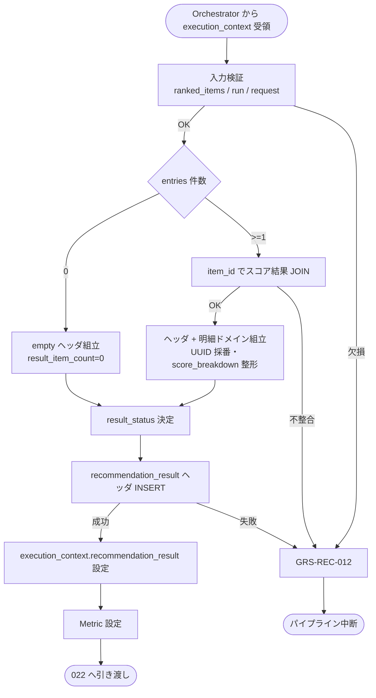

# Recommendation Result Builder モジュール仕様書

## 1. ドキュメント情報

| 項目           | 内容                                       |
| -------------- | ------------------------------------------ |
| ドキュメントID | `MOD-RECO-021`                             |
| ドキュメント名 | Recommendation Result Builder モジュール仕様書 |
| 対象システム   | Gift Recommendation Service（`apps/reco`） |
| MVP対象        | `○`                                        |
| 作成日         | 2026-07-04                                 |
| 更新日         | 2026-07-04（§16 未決 3 件を推奨案で確定）  |

---

## 2. 概要

Recommendation Result Builder（Recommendation Result生成）は、Reco オンライン推薦パイプラインの **出力フェーズ第 1 ステップ**において、`MOD-RECO-001` Recommendation Orchestrator から `execution_context` を **1 回**受け取り、`MOD-RECO-020` Final Ranker が算出済みの **`ranked_items`** を主入力とし、Run 内の各種スコア結果（`context_score_result` 等）を JOIN して **`recommendation_result` ヘッダ**および **`recommendation_result_item` 明細（スコア・順位・内訳）** を組み立て、`recommendation_result` テーブルへ **ヘッダ INSERT** を行い、`execution_context` へ返却するモジュールである。`MOD-RECO-020` 完了後、**`MOD-RECO-022` Result Snapshot Builder の直前**に Orchestrator から呼び出される。

本モジュールは **Result ヘッダ生成・明細ドメイン構築・スコア／順位／内訳の DB 向け整形・ヘッダ永続化**に責務を限定し、表示用 Snapshot の **Item DB 参照・コピー**（`MOD-RECO-022`）、推薦理由生成（`MOD-RECO-023`）、Run 終端状態更新（`MOD-RECO-002`）、Public / Internal API レスポンス変換（`apps/api` / `API-INT-002` エンドポイント層）は行わない。Recommendation Result のドメイン定義の正本は **RecommendationResult定義書**、DB 物理列の正本は **`recommendation_result_テーブル定義書`** / **`recommendation_result_item_テーブル定義書`** を正とする。

**命名注記**: Recoモジュール一覧 §6.20 / §8.1 では出力論理名を **`recommendation_result` / `recommendation_result_item`** と記載する。本仕様書・`execution_context` フィールド名は **`recommendation_result`**（ヘッダ + 明細集合を含むドメインオブジェクト）を正とし、DB 物理テーブル名と対応づける（§6.2.2）。

**責務境界（Snapshot）**: Recoモジュール一覧 §6.20 は「item snapshot を保持する」と記載するが、**表示時点 Snapshot の Item DB 参照・コピー**は **`MOD-RECO-022`** が担当する（§6.20 / §6.21 分割）。本モジュールは明細ドメイン上に **Snapshot 列のプレースホルダ構造**を保持し、**NOT NULL の Snapshot 物理列を伴う `recommendation_result_item` 行 INSERT** は **`MOD-RECO-022` 完了後**に同一 Run トランザクションで実行する（§8.3.6・§11.1）。

---

## 3. 目的

- `apps/reco` における Recommendation Result Builder 実装・単体テストの前提を定義する
- Orchestrator との I/F（`execution_context` 入出力）、失敗時のパイプライン中断（`GRS-REC-012`）を後続実装可能な粒度で整理する
- `ranked_items` から `recommendation_result` / `recommendation_result_item` へのマッピング、version 情報引き継ぎ、`result_status` 決定を明確化する
- Recoモジュール一覧・RecommendationResult定義書・`MOD-RECO-001` / `020` / `022` 仕様書との整合を担保する

---

## 4. モジュール基本情報

| 項目 | 内容 |
| ---- | ---- |
| モジュールID | `MOD-RECO-021` |
| モジュール名 | Recommendation Result生成 |
| 物理名 | `Recommendation Result Builder` |
| 分類 | 出力処理 |
| 処理種別 | `OL` |
| 配置予定 | `apps/reco/src/reco/application/recommendation-result-builder/**` |
| 所属Epic | `MOD-RECO-021`（Epic Issue #976） |
| MVP対象 | `○` |
| 主な呼び出し元 | `MOD-RECO-001` Recommendation Orchestrator |
| 主な呼び出し先 | `RecommendationResultRepository`（`infrastructure/db/`）、`recommendation_run` 参照（version コピー用・読取のみ） |

`MOD-API-*` / `MOD-RECO-*` / `MOD-BATCH-*` 配下の Task では、該当モジュール ID の責務範囲に変更を限定する。`MOD-RECO-*` では `apps/reco/src/reco/api/**` の API-INT エンドポイント層を対象に含めない。

---

## 5. 責務

### 5.1 主責務

- `MOD-RECO-020` 完了後、Orchestrator から **1 回**呼び出され、`execution_context.ranked_items` を主入力として **Recommendation Result ヘッダ**（`recommendation_result`）を組み立てる
- 選定済み各候補（`ranked_items.entries[]`）を **`recommendation_result_item` 明細ドメイン**へ 1:1 マッピングし、`rank` / `final_score` / `context_score` / `score_breakdown_json` 等を **DB 保存可能な形**に整形する
- `execution_context` 内の `context_score_result` / `meaning_match_result` / `popularity_score_result` / `risk_penalty_result` を **`item_id` で JOIN** し、スコア内訳 JSON を構築する（§8.3.3）
- `recommendation_request` / `recommendation_run` / `config_versions` から **version スナップショット**・`request_mode`・`trace_id`・`top_k` 等を引き継ぎ、Result ヘッダへ設定する（`recommendation_result_テーブル定義書` §5.7・§12）
- 件数に応じて **`result_status`** を決定する（`generated` / `empty`。§8.3.4）
- **`recommendation_result` ヘッダ行を DB INSERT** する（Run 単位 1 回・`uq_result_per_run`）
- 組み立て済み **`execution_context.recommendation_result`**（ヘッダ + 明細ドメイン）を返却し、**`MOD-RECO-022`** / **`MOD-RECO-023`** へ引き渡す
- 成功時に **Result Build 向け Metric**（§12.1）を Orchestrator / `MOD-RECO-025` 経由で依頼する
- 回復不能失敗時 **`GRS-REC-012`** を Orchestrator へ返却し、パイプライン中断を促す

### 5.2 対象外責務

- `API-INT-002` エンドポイント層（HTTP 受付、reco 側防御的 Validation、OpenAPI スキーマ整合）
- `MOD-RECO-001` Orchestrator の実行順序制御・Phase Log 契機の物理実装
- **Ranking 計算**（`MOD-RECO-016`〜`020` 責務）
- **`ranked_items` の生成・変更**（`MOD-RECO-020` 正本。本モジュールは **読み取り専用**）
- **Item 正本（`item` / `item_image` / `item_review_summary`）からの Snapshot 取得・コピー**（`MOD-RECO-022` 責務）
- **`recommendation_result_item` 行の DB INSERT**（Snapshot 必須列のため **`MOD-RECO-022` 完了後**。§11.1）
- **推薦理由（Reason）生成・紐づけ**（`MOD-RECO-023` 責務）
- **`recommendation_run.run_status` の終端更新**（`MOD-RECO-002` 責務。Orchestrator が出力フェーズ完了後に依頼）
- Public API（`API-PUB-002`）向けレスポンス形式への変換（`apps/api` 側責務）
- Phase Log `result_generated` の **物理記録**（Orchestrator / `MOD-RECO-028` 経由。§12）
- OpenAPI / DB schema / DDL の変更

---

## 6. 入出力

### 6.1 入力（Orchestrator → 本モジュール）

| 入力 | 型 / 構造 | 必須 | 生成元 | 用途 | 備考 |
| ---- | --------- | ---- | ------ | ---- | ---- |
| `execution_context` | パイプライン実行コンテキスト | `true` | `MOD-RECO-001` | 処理起点 | |
| `execution_context.ranked_items` | 順位付き候補集合 | `true` | `MOD-RECO-020` | Result 構築の主入力 | §6.2.1 |
| `execution_context.context_score_result` | 候補別 Context Score | `true`¹ | `MOD-RECO-016` | `context_score` / 内訳 | §6.2.3 |
| `execution_context.meaning_match_result` | 候補別意味マッチ | `true`¹ | `MOD-RECO-015` | `social_match` / `symbolic_match` | §6.2.3 |
| `execution_context.popularity_score_result` | 候補別 Popularity Score | `false`¹ | `MOD-RECO-017` | 内訳 JSON | 欠損時は内訳省略可 |
| `execution_context.risk_penalty_result` | 候補別 Risk Penalty | `false`¹ | `MOD-RECO-018` | 内訳 JSON | 同上 |
| `execution_context.recommendation_request` | 推薦入力条件 | `true` | `API-INT-002` 経由 | `top_k` / `request_mode` / IDs | |
| `execution_context.recommendation_run` | Run 正本（メモリまたは DB 読取） | `true` | `MOD-RECO-002` | version 4 列コピー | §8.3.2 |
| `execution_context.config_versions` | Config 群 | `true` | `MOD-RECO-003` | 再現性メタ | |
| `execution_context.run_id` | `uuid` | `true` | `MOD-RECO-002` | ログ・FK | |
| `execution_context.retrieval_candidate_count` | `number` | `false` | `MOD-RECO-012` 等 | `candidate_count` | 未設定時 NULL 可 |

¹ **`ranked_items.entries` が 1 件以上**のとき必須。0 件時は JOIN 不要（§8.3.5）。

**前提**: `MOD-RECO-020` が完了済み（Orchestrator 論理順序 20 まで）。

**空入力（防御的）**: `ranked_items.entries` が空の場合、本モジュールは **`result_status = empty` のヘッダのみ**を生成し **成功**とする（`GRS-REC-012` にしない）。`recommendation_result_item` 行は 0 件（`recommendation_result_item_テーブル定義書` §5.2）。

### 6.2 出力（本モジュール → Orchestrator / 後続）

| 出力 | 型 / 構造 | 利用先 | 用途 | 備考 |
| ---- | --------- | ------ | ---- | ---- |
| `execution_context.recommendation_result` | Recommendation Result ドメイン | `MOD-RECO-022` / `023` / Orchestrator | Result 正本（Run 内） | §6.2.2 |
| `recommendation_result_id` | `uuid` | 下流全体 | ヘッダ PK | DB INSERT 後確定 |
| `result_builder_item_count` | `number` | Orchestrator / `MOD-RECO-025` | 構築明細件数 | 0 件も正常 |
| `result_builder_header_persisted` | `boolean` | Orchestrator | ヘッダ INSERT 完了フラグ | `true` |
| `reco_error` | 標準化 reco エラー | Orchestrator | 失敗時 | `GRS-REC-012` |

#### 6.2.1 `ranked_items`（入力・参照）

`MOD-RECO-020` モジュール仕様書 §6.2.2 を正とする。本モジュールは以下を **読み取りのみ**使用する。

| フィールド | 必須 | 内容 |
| ---------- | ---- | ---- |
| `entries[]` | `true` | 選定済み候補（最大 `top_k` 件） |
| `entries[].item_id` | `true` | 候補商品 ID |
| `entries[].rank` | `true` | 表示順位（1 始まり） |
| `entries[].final_score` | `true` | 最終スコア |
| `entries[].score_breakdown` | `true` | 多様性含む内訳（`020` 更新済み） |
| `entries[].diversity_penalty` | `true` | 多様性減点 |
| `entries[].is_displayed` | `true` | MVP では `true` |
| `entries[].is_fallback` | `false` | Fallback 候補フラグ（未設定時 `false`） |
| `top_k_used` | `true` | 実適用 `top_k` |
| `total_selected` | `true` | `entries` 件数 |

本モジュールは `ranked_items` を **変更しない**（読み取り専用）。

#### 6.2.2 `recommendation_result`（MVP 概要）

`execution_context` フィールド名は **`recommendation_result`**。ドメイン型は **`RecommendationResult`**（配置: `apps/reco/src/reco/application/recommendation-result-builder/models.py` または `domain/**`。実装 Task で最終配置を確定）。論理上は以下を含む。

**ヘッダ（`recommendation_result` テーブル対応）**

| フィールド | 必須 | 内容 |
| ---------- | ---- | ---- |
| `recommendation_result_id` | `true` | 新規 UUID（本モジュールで採番） |
| `recommendation_request_id` | `true` | Request ID（エコー） |
| `recommendation_run_id` | `true` | Run ID（エコー） |
| `request_mode` | `true` | `ui` / `evaluation` / `batch` |
| `trace_id` | `true` | Request 由来スナップショット |
| `result_status` | `true` | `generated` / `empty`（DB 正本。§8.3.4） |
| `top_k` | `true` | `ranked_items.top_k_used` |
| `result_item_count` | `true` | `entries` 件数 |
| `candidate_count` | `false` | Retrieval 候補数 |
| `fallback_used` | `false` | Run 内 Fallback 利用有無（未判定時 `false`） |
| `semantic_config_version_id` | `true` | Run からコピー |
| `model_version_id` | `true` | Run からコピー |
| `matching_config_id` | `true` | Run からコピー |
| `ranking_config_id` | `true` | Run からコピー |
| `reason_template_version_id` | `false` | MVP では **`NULL` 固定**（§16.1 No.13） |
| `generated_at` | `true` | ヘッダ生成日時（UTC） |
| `display_message` / `caution_message` | `false` | 0 件時等の補足 |
| `result_payload` / `debug_payload` | `false` | API 補助 JSON（evaluation / debug 時） |

**明細（`items[]` → `recommendation_result_item` テーブル対応）**

| フィールド | 必須 | 内容 |
| ---------- | ---- | ---- |
| `items[]` | `true` | Result Item 明細（0 件可） |
| `items[].recommendation_result_item_id` | `true` | 新規 UUID（本モジュールで採番） |
| `items[].recommendation_result_id` | `true` | 親ヘッダ ID |
| `items[].item_id` | `true` | 商品 ID |
| `items[].rank` | `true` | `ranked_items.entries[].rank` |
| `items[].final_score` | `true` | エコー |
| `items[].context_score` | `true` | `context_score_result` JOIN |
| `items[].score_breakdown_json` | `false` | 統合内訳 JSON（§8.3.3） |
| `items[].is_displayed` | `true` | 通常 `true` |
| `items[].is_fallback` | `true` | 通常 `false` |
| `items[].snapshot` | `false` | Snapshot ドメイン（**`022` が充填**。§5.2） |

**永続化状態（MVP）**

| 対象 | MVP 永続化タイミング | 担当 |
| ---- | -------------------- | ---- |
| `recommendation_result` ヘッダ | **本モジュール成功時** | `MOD-RECO-021` |
| `recommendation_result_item` 明細 | **`MOD-RECO-022` 完了後**（Snapshot 付き INSERT） | `MOD-RECO-022` |

#### 6.2.3 スコア結果 JOIN（入力・参照）

| ソース | 使用フィールド | 出力先 |
| ------ | -------------- | ------ |
| `context_score_result.entries[]` | `context_score` | `items[].context_score` / `score_breakdown_json.context_score` |
| `meaning_match_result.entries[]` | `social_match` / `symbolic_match` | `score_breakdown_json` 内 |
| `popularity_score_result.entries[]` | `popularity_score` | `score_breakdown_json` 内 |
| `risk_penalty_result.entries[]` | `risk_penalty` | `score_breakdown_json` 内 |
| `ranked_items.entries[].score_breakdown` | `diversity` 等 | `score_breakdown_json` ベース |

**JOIN 失敗**（`ranked_items` に存在する `item_id` が `context_score_result` にない）: **`GRS-REC-012`**（データ不整合）。

---

## 7. 依存関係

### 7.1 依存モジュール

| 依存先 | 方向 | 用途 | 失敗時 | 備考 |
| ------ | ---- | ---- | ------ | ---- |
| `MOD-RECO-001` | 被呼び出し | 出力フェーズ第 1 契機 | — | `020` 直後・`022` 直前 |
| `MOD-RECO-020` | 間接 | `ranked_items` | 未到達 | 入力正本 |
| `MOD-RECO-016` / `015` / `017` / `018` | 間接 | スコア内訳 JOIN | 未到達 | Run 内メモリ |
| `MOD-RECO-002` | 間接 | `recommendation_run` / `run_id` | 未到達 | version コピー |
| `MOD-RECO-003` | 間接 | `config_versions` | 未到達 | メタデータ |
| `MOD-RECO-022` / `023` | 下流利用 | `recommendation_result` | — | Snapshot / Reason |
| `MOD-RECO-025` | 間接 | Result Build Metric | — | §12.1 |
| `MOD-RECO-028` / `024` / `029` | 間接 | 観測・エラー | — | Orchestrator 経由 |

**下流利用**: `MOD-RECO-022` Result Snapshot Builder が `recommendation_result.items[]` に Snapshot を付与し Item 行を INSERT する。`MOD-RECO-023` Reason Generator が明細・内訳を入力とする。

### 7.2 参照データ

| データ | 参照元 | 用途 | version / config | 備考 |
| ------ | ------ | ---- | ---------------- | ---- |
| `ranked_items` | `execution_context`（`MOD-RECO-020` 出力） | 順位・スコア主入力 | Run 内メモリ | 読取専用 |
| `context_score_result` 等 | `execution_context` | 内訳 JOIN | Run 内メモリ | 読取専用 |
| `recommendation_run` | DB または `execution_context` | version 4 列 | Run 正本 | 読取のみ |
| `recommendation_request` | `execution_context` | mode / trace / top_k | Request 正本 | 読取のみ |

---

## 8. 処理仕様

### 8.1 処理フロー



### 8.2 処理ステップ

| No | 処理 | 入力 | 出力 | 補足 |
| --: | ---- | ---- | ---- | ---- |
| 1 | 入力検証 | `execution_context` | — | `ranked_items` / `run_id` / `request` 必須 |
| 2 | 件数判定 | `ranked_items.entries` | 分岐 | 0 件は empty 分岐 |
| 3 | スコア JOIN | `ranked_items` + 各 `*_result` | 明細スコア | §6.2.3 |
| 4 | ヘッダ組立 | request / run / config | ヘッダフィールド | version 4 列コピー |
| 5 | 明細組立 | JOIN 結果 | `items[]` | Snapshot は未充填 |
| 6 | `result_status` 決定 | 件数 | `generated` / `empty` | §8.3.4 |
| 7 | UUID 採番 | — | result / item IDs | |
| 8 | ヘッダ DB INSERT | ヘッダ | `recommendation_result_id` | `uq_result_per_run` |
| 9 | コンテキスト返却 | ドメイン全体 | `execution_context` | Item INSERT は `022` |
| 10 | Metric 設定 | 件数・latency | `result_builder_*` | §12.1 |

**処理順序の正本**: Recoモジュール一覧 §5.2 論理順序 20（`MOD-RECO-021`）。物理呼び出しは **`020` 直後・`022` 直前**（`MOD-RECO-001` §8.2）。

### 8.3 アルゴリズム / 計算仕様

本モジュールは **新規スコア算出を行わない**。Ranking 結果の **構造化・永続化準備**のみを担当する。

#### 8.3.1 Result 構築方針

| 項目 | 内容 |
| ---- | ---- |
| 入力正本 | `ranked_items`（順位・`final_score`・`score_breakdown`） |
| スコアエコー | `final_score` / `rank` は `ranked_items` から **変更せず**コピー |
| `context_score` | `context_score_result` から JOIN。欠損時は **`GRS-REC-012`** |
| 内訳 JSON | `ranked_items.entries[].score_breakdown` をベースに、JOIN 結果で補完（Ranking定義書 §14.2 / RecommendationResult定義書 §6.2.4） |
| 候補順 | `ranked_items.entries[]` の **rank 昇順**を維持 |

#### 8.3.2 Version / メタデータ引き継ぎ

`recommendation_result_テーブル定義書` §12 手順 3〜4 に従う。

| ソース | 引き継ぎ先 |
| ------ | ---------- |
| `recommendation_request.mode` | `request_mode` |
| `recommendation_request.trace_id` | `trace_id` |
| `recommendation_run.semantic_config_version_id` 等 4 列 | 同名 4 列 |
| `ranked_items.top_k_used` | `top_k` |
| `retrieval_candidate_count`（任意） | `candidate_count` |

#### 8.3.3 `score_breakdown_json` 構築（MVP）

RecommendationResult定義書 §6.2.4 の構造を基本とする。

```json
{
  "context_score": {
    "value": 0.82,
    "social_match": 0.86,
    "symbolic_match": 0.76
  },
  "popularity_score": { "value": 0.64 },
  "risk_penalty": { "value": 0.08 },
  "diversity": {
    "penalty": 0.05,
    "max_similarity_to_selected": 0.42,
    "method": "mmr"
  },
  "final_score": {
    "value": 0.78,
    "formula_version": "ranking_config_v001"
  }
}
```

`formula_version` は `ranking_config_id` または `config_versions` から導出する（実装 Task で確定）。

#### 8.3.4 `result_status` 決定

DB 正本は **`generated` / `empty` / `failed`**（`recommendation_result_テーブル定義書` §5.6）。本モジュールが設定するのは以下。

| 条件 | `result_status` | `result_item_count` |
| ---- | ----------------- | ------------------- |
| `entries` ≥ 1 | `generated` | `entries` 件数 |
| `entries` = 0 | `empty` | `0` |

`failed` は本モジュールが例外返却した場合の **DB 未到達**を指す（Run は `MOD-RECO-002` が `failed` へ遷移）。

**API 層マッピング**: `generated` → Public `completed` / `partial`（件数で判別）は **`apps/api` 責務**（Result 定義書 §5.6・テーブル定義書 §5.6）。

#### 8.3.5 空入力・防御的挙動

| 条件 | 扱い |
| ---- | ---- |
| `ranked_items.entries` 0 件 | **成功**。empty ヘッダ INSERT。`GRS-REC-012` にしない |
| `ranked_items` 自体が未設定 | **`GRS-REC-012`** |
| `recommendation_run` 不在 | **`GRS-REC-012`** |
| ヘッダ INSERT 失敗（一意制約違反等） | **`GRS-REC-012`** |

0 件結果の HTTP / `GRS-REC-001` 表現は **Orchestrator / `apps/api`** が最終化する（`MOD-RECO-001` §8.2・エラーコード定義書）。

#### 8.3.6 Orchestrator Port 契約（MVP）

| 項目 | 内容 |
| ---- | ---- |
| 呼び出し回数 | Run あたり **1 回**（`020` 成功後） |
| 成功 | `recommendation_result` / `recommendation_result_id` / `result_builder_header_persisted=true` |
| 成功（0 件） | empty ヘッダ・明細 0 件・**`022` / `023` は Orchestrator が呼ばない**（§16.1 No.12） |
| 失敗 | `GRS-REC-012`。`022` / `023` は呼ばれない |
| Reason 失敗時 | 本モジュール成功後は **`023` 失敗でも Result 返却継続**（`MOD-RECO-001` §10.3） |
| Phase Log | **`result_generated` は本モジュール成功後に Orchestrator が記録依頼**（§12） |
| Wiring | 出力フェーズ（`021`〜`023`）は **未配線（スタブ）**（`MOD-RECO-001` §8.4.2） |

#### 8.3.7 `MOD-RECO-022` との永続化分担

| ステップ | モジュール | 内容 |
| -------- | ---------- | ---- |
| 1 | `MOD-RECO-021` | ヘッダ INSERT + 明細ドメイン（Snapshot 未充填） |
| 2 | `MOD-RECO-022` | Item DB 読取 → Snapshot 充填 → **`recommendation_result_item` INSERT** |
| 3 | `MOD-RECO-023` | Reason 生成（Item 永続化済み前提） |

Orchestrator は **2 完了までを同一 DB トランザクション**でまとめることを推奨する（`recommendation_result_テーブル定義書` §12 手順 5）。トランザクション境界の物理実装は **実装 Task / Orchestrator Wiring Task** で確定する。

---

## 9. データ項目マッピング

| 入力項目 | 内部項目 | 出力項目 | 変換内容 | 備考 |
| -------- | -------- | -------- | -------- | ---- |
| `ranked_items.entries[].item_id` | 候補キー | `items[].item_id` | 1:1 エコー | |
| `entries[].rank` | 順位 | `items[].rank` | エコー | 1 始まり |
| `entries[].final_score` | スコア | `items[].final_score` | エコー | |
| `context_score_result` JOIN | `context_score` | `items[].context_score` | 欠損時エラー | |
| `entries[].score_breakdown` + JOIN | 内訳 | `items[].score_breakdown_json` | JSON 統合 | §8.3.3 |
| `recommendation_request.*` | — | ヘッダ request 系 | スナップショット | |
| `recommendation_run` version 4 列 | — | ヘッダ version 列 | コピー | §8.3.2 |
| — | 採番 | `recommendation_result_id` | UUID v4 | |
| — | 採番 | `items[].recommendation_result_item_id` | UUID v4 | `022` INSERT 時使用 |
| `ranked_items.total_selected` | 件数 | `result_item_count` | そのまま | |

---

## 10. 状態・例外

### 10.1 状態

本モジュールは **ステートレス**（Run 内 1 回呼び出し）。生成する Result ヘッダの DB 状態は以下。

| 状態 | 意味 | 遷移条件 | 記録先 |
| ---- | ---- | -------- | ------ |
| — | モジュール内部状態なし | — | — |
| `generated` | 明細 1 件以上の Result | ヘッダ INSERT 成功 | `recommendation_result` |
| `empty` | 明細 0 件の Result | 0 件でもヘッダ INSERT 成功 | 同上 |

**不変性**: Result ヘッダは MVP では **INSERT 後 UPDATE しない**（テーブル定義書 §12）。

### 10.2 例外

| 例外 | Error Code | 発生条件 | 呼び出し元への返却 | ログ |
| ---- | ---------- | -------- | ------------------ | ---- |
| Result 構築失敗 | `GRS-REC-012` | 入力欠損・JOIN 不整合・内部エラー | 500 系・中断 | Error Log + Phase failed |
| Result ヘッダ保存失敗 | `GRS-REC-012` | DB INSERT 失敗・`uq_result_per_run` 違反 | 500 系・中断 | Error Log |
| 選定対象 0 件 | — | `entries` 0 件 | **成功**（empty） | `result_builder_item_count = 0` |
| `score_breakdown` 一部欠損 | —（継続） | `popularity` / `risk` 欠損 | パイプライン継続 | **warning** + 内訳省略 |

**リトライ**: モジュール内自動リトライ **なし**（MVP）。

Error Code の正本はエラーコード定義書。Orchestrator は `MOD-RECO-024` 経由で標準化結果を呼び出し元へ伝播する。

**RecommendationResult定義書 §13.1 との対応**: `RESULT_BUILD_ERROR` / `RESULT_SAVE_ERROR` は本モジュール失敗時に **`GRS-REC-012`** へ集約される。`RESULT_ITEM_EMPTY` は **empty 正常系**（エラーではない）。

---

## 11. DB / 永続化

### 11.1 書き込み

| テーブル | 操作 | 主な項目 | トランザクション | 備考 |
| -------- | ---- | -------- | ---------------- | ---- |
| `recommendation_result` | **INSERT** | ヘッダ全列（初回） | Run 単位 1 回。`022` と **同一トランザクション推奨** | 本モジュール責務 |
| `recommendation_result_item` | **INSERT** | 明細 + Snapshot | 同上 | **`MOD-RECO-022` 責務**（§8.3.7） |

### 11.2 読み取り

| テーブル | 操作 | 用途 | 備考 |
| -------- | ---- | ---- | ---- |
| `recommendation_run` | SELECT | version 4 列コピー | `run_id` キー |
| `item` 系 | — | **参照しない** | Snapshot は `022` |

**方針**: `rank` / `final_score` / `context_score` / `score_breakdown_json` の Run 結果永続化は、**明細 INSERT 時**に `recommendation_result_item` へ反映する（`recommendation_result_item_テーブル定義書` §6）。ヘッダの `result_item_count` は **021 ヘッダ INSERT 時に確定**し、`022` は同一トランザクション内で **同件数の Item INSERT 完了を検証**する（ヘッダ UPDATE は行わない。§16.1 No.14）。

---

## 12. ログ・メトリクス

| 種別 | 内容 | タイミング | 保存先 | 備考 |
| ---- | ---- | ---------- | ------ | ---- |
| Phase Log | `result_generated` | 本モジュール **成功後** | `phase_log`（`MOD-RECO-028`） | Orchestrator が記録依頼 |
| Metric | `result_builder_*` 等 | 成功 | Metric Logger（`MOD-RECO-025`） | §12.1 |
| Error Log | `GRS-REC-012` | 失敗 | `error_log`（`MOD-RECO-029`） | |
| 構造化ログ | 構築サマリ（件数・`result_status`・duration_ms） | 成功 / 警告 | アプリログ | `trace_id` 必須。明細全量ダンプは **debug 時のみ** |

### 12.1 メトリクス

| Metric | 内容 | 集計単位 | 用途 |
| ------ | ---- | -------- | ---- |
| `result_builder_item_count` | 構築明細件数 | Run | Result 件数推移 |
| `result_builder_latency_ms` | 本モジュール処理時間 | Run | 性能監視 |
| `result_build_success` | ヘッダ INSERT 成功（0/1） | Run | Result 生成成功率 |
| `zero_result_header_count` | empty ヘッダ生成（0/1） | Run | 0 件率監視 |
| `score_breakdown_partial_count` | 内訳一部欠損で継続した件数 | Run | データ品質 |

**共有 Metric**: RecommendationResult定義書 §14.1 の `result_build_success_rate` / `result_item_count` / `zero_result_rate` は、Orchestrator または Metric Logger 側で上記から集約してよい。

---

## 13. 性能・非機能

| 観点 | 方針 |
| ---- | ---- |
| レイテンシ | モジュール単体 hard timeout は設けない。出力フェーズ（`021`〜`023`）は Orchestrator 上位ガードに従う |
| 計算量 | O(`top_k`)。`top_k` ≤ 50 を前提 |
| DB アクセス | ヘッダ INSERT 1 回 + Run 読取（実装によりメモリキャッシュ可） |
| タイムアウト | 上位 Orchestrator に従う |
| リトライ | なし（MVP） |
| キャッシュ | Run 横断キャッシュなし（MVP） |
| 並列実行 | 同一 Run 内 1 回・同期実行 |
| 冪等性 | 同一 `recommendation_run_id` への二重ヘッダ INSERT は DB 制約で拒否 → `GRS-REC-012` |

---

## 14. テスト観点

| No | 観点 | 確認内容 | 種別 |
| --: | ---- | -------- | ---- |
| 1 | 正常系（明細あり） | `ranked_items` からヘッダ + 明細ドメインが構築されヘッダ INSERT されること | unit |
| 2 | 正常系（rank / score エコー） | `rank` / `final_score` が `ranked_items` と一致すること | unit |
| 3 | context_score JOIN | `context_score_result` から正しく JOIN されること | unit |
| 4 | score_breakdown 統合 | `020` の diversity 内訳が JSON に含まれること | unit |
| 5 | version 引き継ぎ | Run 4 列・`request_mode`・`trace_id` がヘッダへコピーされること | unit |
| 6 | 境界値（1 件） | `result_status=generated`・`result_item_count=1` | unit |
| 7 | 境界値（0 件） | `result_status=empty`・明細 0・**成功**・`GRS-REC-012` にならないこと | unit |
| 8 | 入力 0 件（防御的） | 空 `ranked_items` で empty ヘッダが返ること | unit |
| 9 | `ranked_items` 欠損 | `GRS-REC-012` になること | unit |
| 10 | context_score JOIN 失敗 | `GRS-REC-012` になること | unit |
| 11 | ヘッダ INSERT 失敗 | `GRS-REC-012` になること | unit |
| 12 | 二重 INSERT | 同一 Run で 2 回目が拒否されること | integration |
| 13 | Orchestrator 連携 | `020` 後 1 回呼び出し・失敗時 `022` 未到達 | integration |
| 14 | 責務境界 | Snapshot 取得 / Item 明細 INSERT / Reason 生成を行わないこと | unit |
| 15 | 上流 result 不変 | `ranked_items` / 各 `*_score_result` が変更されないこと | unit |
| 16 | Metric | `result_builder_*` が記録されること | integration |
| 17 | ログ | `trace_id` あり・secret なし | unit |
| 18 | 022 引き渡し | `items[].recommendation_result_item_id` が採番済みで `022` が利用できること | unit |

---

## 15. 変更管理

### 15.1 変更履歴

| 日付 | 変更内容 | 関連 Issue / PR |
| ---- | -------- | --------------- |
| 2026-07-04 | 初版作成 | Issue #977 |
| 2026-07-04 | §16 未決 3 件を推奨案で確定 | Issue #977 |

---

## 16. 未決事項

| No | 論点 | 判断が必要な理由 | 判断者 | 期限 | 備考 |
| --: | ---- | ---------------- | ------ | ---- | ---- |
| - | なし | - | - | - | - |

### 16.1 確定済み論点

| No | 論点 | 確定内容 |
| --: | ---- | -------- |
| 1 | 入力正本 | **`execution_context.ranked_items`**（`020` 出力） |
| 2 | 出力フィールド名 | **`execution_context.recommendation_result`** |
| 3 | ヘッダ永続化 | **`recommendation_result` INSERT は本モジュール** |
| 4 | 明細永続化 | **`recommendation_result_item` INSERT は `MOD-RECO-022`**（Snapshot 必須列のため） |
| 5 | Snapshot 取得 | **Item DB 参照は `MOD-RECO-022` 専用** |
| 6 | 0 件 Result | **`result_status=empty`・ヘッダのみ・成功**（`GRS-REC-012` にしない） |
| 7 | JOIN 不整合 | **`context_score` 欠損は `GRS-REC-012`** |
| 8 | 失敗 Error Code | 回復不能失敗は **`GRS-REC-012`**（`MOD-RECO-001` §10.2 と整合） |
| 9 | Reason 失敗後 | **`021`/`022` 成功後は `023` 失敗でも Result 返却継続**（`MOD-RECO-001` §10.3） |
| 10 | Phase Log | **`result_generated` は本モジュール成功後に Orchestrator が記録** |
| 11 | API 変換 | Public / Internal レスポンス変換は **`apps/api` / API-INT 層**（本モジュール外） |
| 12 | 0 件時の `022` / `023` 呼び出し | **`result_item_count = 0` のとき Orchestrator は `MOD-RECO-022` / `023` を呼ばない**（Snapshot・Reason 対象なし）。`021` 成功のみで出力フェーズ完了扱いとする |
| 13 | `reason_template_version_id` | **021 ヘッダ INSERT 時は `NULL` 固定**（MVP 非採用）。Reason テンプレート版は **`recommendation_reason` 側の `template_name` + `template_version`** で記録（`reason_template_テーブル定義書` §5.3 方式 B）。Result ヘッダ UPDATE は MVP で行わない |
| 14 | `result_item_count` 確定 | **021 ヘッダ INSERT 時に `ranked_items.total_selected` を設定して確定**。`022` は同一 DB トランザクション内で **同件数の Item INSERT を完了**し、commit 前に件数一致を検証する（不一致時はロールバック → `GRS-REC-012`）。ヘッダ UPDATE は行わない |
| 15 | `rank` 起点 | **1 始まり**（`ranked_items` からエコー） |

---

## 17. 関連資料

| 種別 | パス | 用途 |
| ---- | ---- | ---- |
| Recoモジュール一覧 | `docs/05_アプリケーション設計/アプリ/reco/Recoモジュール一覧.md` | §6.20 |
| モジュール一覧 | `docs/05_アプリケーション設計/アプリ/モジュール一覧.md` | 出力処理分類 |
| 機能×モジュール対応表 | `docs/05_アプリケーション設計/アプリ/機能×モジュール対応表.md` | Result 生成機能 |
| RecommendationResult定義書 | `docs/04_ドメインモデル設計/RecommendationResult定義書.md` | ドメイン正本 |
| recommendation_result テーブル定義書 | `docs/06_実装設計/database/recommendation_result_テーブル定義書.md` | ヘッダ DDL |
| recommendation_result_item テーブル定義書 | `docs/06_実装設計/database/recommendation_result_item_テーブル定義書.md` | 明細 DDL |
| reason_template テーブル定義書 | `docs/06_実装設計/database/reason_template_テーブル定義書.md` | Reason テンプレート版記録（§16.1 No.13） |
| MOD-RECO-001 | `docs/06_実装設計/reco/MOD-RECO-001_Recommendation Orchestratorモジュール仕様書.md` | 呼び出し・`GRS-REC-012`・§10.3 |
| MOD-RECO-002 | `docs/06_実装設計/reco/MOD-RECO-002_Recommendation Run Recorderモジュール仕様書.md` | Run / version 正本 |
| MOD-RECO-020 | `docs/06_実装設計/reco/MOD-RECO-020_Final Rankerモジュール仕様書.md` | 直前モジュール・`ranked_items` |
| MOD-RECO-022 | Recoモジュール一覧 §6.21 | 後続 Snapshot Builder |
| エラーコード定義書 | `docs/05_アプリケーション設計/アプリ/エラーコード定義書.md` | `GRS-REC-012` |
| ログ・Observability設計書 | `docs/05_アプリケーション設計/アプリ/ログ・Observability設計書.md` | `result_generated` |
| Epic Definition | `prompts/definitions/epics/mod-reco-021-recommendation-result-builder/epic.yaml` | `allowed_paths` |

---

## 18. レビュー観点

- Recoモジュール一覧 §6.20 のモジュール名・物理名・入出力と一致している
- RecommendationResult定義書・Result 系テーブル定義書とのマッピングが後続実装可能な粒度である
- Orchestrator Port 契約（`execution_context` 入出力・`GRS-REC-012`）が MOD-RECO-001 と整合している
- `MOD-RECO-020` との責務境界（`ranked_items` 読取専用）が明確である
- `MOD-RECO-022` との責務境界（Snapshot / 明細 INSERT）が明確である
- API-INT-002 エンドポイント層を責務範囲に含めていない
- secret や `.env` 実値が含まれていない

---

## 19. 備考

- Recoモジュール一覧 §5.2 論理順序 20 の主な入出力（`ranked_items` / `score_breakdown` → `recommendation_result`）と整合する
- RecommendationResult定義書 §8.2 の Result Build 手順のうち、**Top K 選定**は `MOD-RECO-020` 完了済みとみなし、本モジュールは **Result Item Build（スコア付き）・Result Summary・ヘッダ保存**を担当する。**Item Snapshot Attach** の Item DB 参照は `MOD-RECO-022` へ委譲する
- 機能×モジュール対応表の出力 `recommendation_result` / `result_item` は、本仕様書では **`execution_context.recommendation_result`（ヘッダ + `items[]`）** として具体化する
- `MOD-RECO-001` §10.3 の Reason 部分成功方針において、本モジュール（および `022`）の成功が **Result 返却継続の前提**となる
