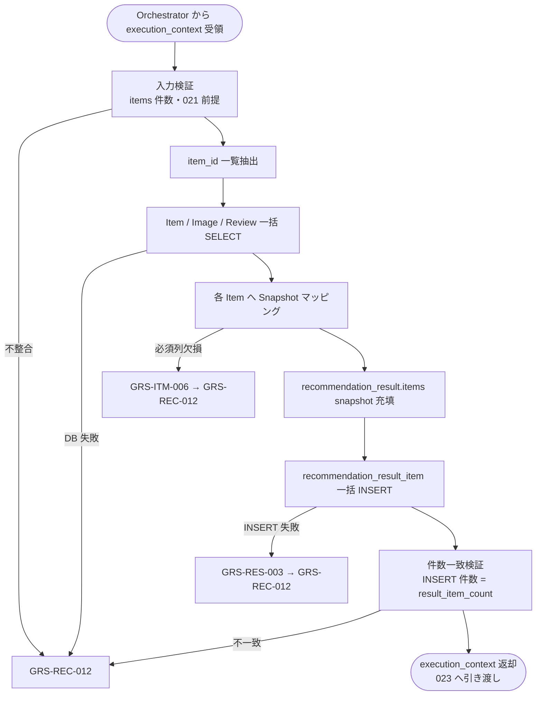

# Result Snapshot Builder モジュール仕様書

## 1. ドキュメント情報

| 項目           | 内容                                       |
| -------------- | ------------------------------------------ |
| ドキュメントID | `MOD-RECO-022`                             |
| ドキュメント名 | Result Snapshot Builder モジュール仕様書   |
| 対象システム   | Gift Recommendation Service（`apps/reco`） |
| MVP対象        | `○`                                        |
| 作成日         | 2026-07-04                                 |
| 更新日         | 2026-07-04                                 |

---

## 2. 概要

Result Snapshot Builder（Result Snapshot生成）は、Reco オンライン推薦パイプラインの **出力フェーズ第 2 ステップ**において、`MOD-RECO-001` Recommendation Orchestrator から `execution_context` を **1 回**受け取り、`MOD-RECO-021` Recommendation Result Builder が組み立て済みの **`recommendation_result.items[]`**（Snapshot 未充填）を主入力とし、Item 正本（`item` / `item_image` / `item_review_summary`）から **表示時点の商品情報を読み取り Snapshot 列へコピー**し、スコア・順位列とともに **`recommendation_result_item` テーブルへ INSERT** して、`execution_context` へ返却するモジュールである。`MOD-RECO-021` 完了後、**`MOD-RECO-023` Reason Generator の直前**に Orchestrator から呼び出される。

本モジュールは **Item DB 参照・Snapshot 充填・Result Item 明細永続化**に責務を限定し、Result ヘッダ生成（`MOD-RECO-021`）、Ranking 計算（`MOD-RECO-016`〜`020`）、推薦理由生成（`MOD-RECO-023`）、Run 終端状態更新（`MOD-RECO-002`）、Public / Internal API レスポンス変換（`apps/api` / `API-INT-002` エンドポイント層）は行わない。Snapshot 物理列の正本は **`recommendation_result_item_テーブル定義書`**、ドメイン上の Item Snapshot 項目は **RecommendationResult定義書** §6.2.2 を正とする。

**責務境界（021 / 022 分割）**: Recoモジュール一覧 §6.20 は「item snapshot を保持する」と記載するが、**Item 正本からの Snapshot 取得・コピーおよび `recommendation_result_item` INSERT** は本モジュールが担当する（§6.20 / §6.21 分割）。`MOD-RECO-021` は明細ドメイン上に **Snapshot 列のプレースホルダ構造**と採番済み `recommendation_result_item_id` を保持し、**NOT NULL の Snapshot 物理列を伴う明細 INSERT** は本モジュール完了後に同一 Run トランザクションで実行する（`MOD-RECO-021` モジュール仕様書 §8.3.7・§11.1）。

**MVP 物理列注記**: `genre_name_snapshot` は RecommendationResult定義書 §6.2.2 に論理項目があるが、論理ER §7.3 および `recommendation_result_item_テーブル定義書` §5.3 により **MVP 物理列は採用しない**。`item_catchcopy_snapshot` は DB 物理列として採用する（API `itemCatchcopy` 対応）。

---

## 3. 目的

- `apps/reco` における Result Snapshot Builder 実装・単体テストの前提を定義する
- Orchestrator との I/F（`execution_context` 入出力）、失敗時のパイプライン中断（`GRS-REC-012`）を後続実装可能な粒度で整理する
- Item 正本から Snapshot 列へのマッピング、必須 / 任意列の欠損扱い、`recommendation_result_item` INSERT 手順を明確化する
- Recoモジュール一覧・RecommendationResult定義書・`MOD-RECO-001` / `021` / `023` 仕様書との整合を担保する

---

## 4. モジュール基本情報

| 項目 | 内容 |
| ---- | ---- |
| モジュールID | `MOD-RECO-022` |
| モジュール名 | Result Snapshot生成 |
| 物理名 | `Result Snapshot Builder` |
| 分類 | 出力処理 |
| 処理種別 | `OL` |
| 配置予定 | `apps/reco/src/reco/application/result-snapshot-builder/**` |
| 所属Epic | `MOD-RECO-022`（Epic Issue #984） |
| MVP対象 | `○` |
| 主な呼び出し元 | `MOD-RECO-001` Recommendation Orchestrator |
| 主な呼び出し先 | `ItemSnapshotReadRepository`（`infrastructure/db/`）、`RecommendationResultItemRepository`（`infrastructure/db/`） |

`MOD-API-*` / `MOD-RECO-*` / `MOD-BATCH-*` 配下の Task では、該当モジュール ID の責務範囲に変更を限定する。`MOD-RECO-*` では `apps/reco/src/reco/api/**` の API-INT エンドポイント層を対象に含めない。

---

## 5. 責務

### 5.1 主責務

- `MOD-RECO-021` 完了後、Orchestrator から **1 回**呼び出され、`execution_context.recommendation_result.items[]` を主入力として **各 Result Item の Snapshot を充填**する
- `item` / `item_image`（`is_primary=true`）/ `item_review_summary` から **表示時点の商品情報を読み取り**、Snapshot ドメインおよび DB 物理列へコピーする（`recommendation_result_item_テーブル定義書` §5.3）
- `021` が採番済みの `recommendation_result_item_id` およびスコア・順位列（`rank` / `final_score` / `context_score` / `score_breakdown_json` 等）を **変更せず**、Snapshot 列を付与したうえで **`recommendation_result_item` 行を DB INSERT** する
- 同一 Run トランザクション内で **`result_item_count` 件と同数の Item INSERT 完了**を保証する（`MOD-RECO-021` §16.1 No.14）
- 充填済み **`execution_context.recommendation_result`** を返却し、**`MOD-RECO-023`** へ引き渡す
- 成功時に **Snapshot Build 向け Metric**（§12.1）を Orchestrator / `MOD-RECO-025` 経由で依頼する
- 回復不能失敗時 **`GRS-REC-012`** を Orchestrator へ返却し、パイプライン中断を促す

### 5.2 対象外責務

- `API-INT-002` エンドポイント層（HTTP 受付、reco 側防御的 Validation、OpenAPI スキーマ整合）
- `MOD-RECO-001` Orchestrator の実行順序制御・Phase Log 契機の物理実装
- **Recommendation Result ヘッダ生成・ヘッダ INSERT**（`MOD-RECO-021` 責務）
- **`ranked_items` の生成・変更**（`MOD-RECO-020` 正本。本モジュールは **読み取りしない**）
- **スコア計算・score_breakdown の再構築**（`MOD-RECO-014`〜`021` 責務。本モジュールは `021` 出力を **エコー**）
- **推薦理由（Reason）生成・紐づけ**（`MOD-RECO-023` 責務）
- **`recommendation_run.run_status` の終端更新**（`MOD-RECO-002` 責務）
- Public API（`API-PUB-002`）向けレスポンス形式への変換（`apps/api` 側責務）
- Phase Log `result_generated` の **物理記録**（`021` 成功後に Orchestrator が記録依頼。本モジュールは直接記録しない）
- Item 正本（`item` / `item_image` 等）の **UPDATE**（Batch 責務）
- Snapshot 列の **INSERT 後 UPDATE**（MVP 禁止。`recommendation_result_item_テーブル定義書` §12）
- OpenAPI / DB schema / DDL の変更

---

## 6. 入出力

### 6.1 入力（Orchestrator → 本モジュール）

| 入力 | 型 / 構造 | 必須 | 生成元 | 用途 | 備考 |
| ---- | --------- | ---- | ------ | ---- | ---- |
| `execution_context` | パイプライン実行コンテキスト | `true` | `MOD-RECO-001` | 処理起点 | |
| `execution_context.recommendation_result` | Recommendation Result ドメイン | `true` | `MOD-RECO-021` | Snapshot 充填・INSERT の主入力 | §6.2.1 |
| `execution_context.recommendation_result.items[]` | Result Item 明細 | `true`¹ | `MOD-RECO-021` | 1 件あたり 1 Snapshot | ¹は下記 |
| `execution_context.run_id` | `uuid` | `true` | `MOD-RECO-002` | ログ・FK | |
| `execution_context.trace_id` | `string` | `true` | Request 由来 | 構造化ログ | |

¹ **`recommendation_result.result_item_count` ≥ 1** のとき必須。`result_item_count = 0` のとき Orchestrator は **本モジュールを呼ばない**（`MOD-RECO-021` §16.1 No.12）。

**前提**: `MOD-RECO-021` が完了済み（ヘッダ INSERT 済み・`result_builder_header_persisted=true`）。`items[].recommendation_result_item_id` が採番済みであること。

**防御的入力**: `result_item_count ≥ 1` なのに `items[]` が空、または件数不一致の場合は **`GRS-REC-012`**（データ不整合）。

### 6.2 出力（本モジュール → Orchestrator / 後続）

| 出力 | 型 / 構造 | 利用先 | 用途 | 備考 |
| ---- | --------- | ------ | ---- | ---- |
| `execution_context.recommendation_result` | Recommendation Result ドメイン | `MOD-RECO-023` / Orchestrator | Snapshot 充填済み Result | §6.2.2 |
| `snapshot_builder_item_count` | `number` | Orchestrator / `MOD-RECO-025` | INSERT 明細件数 | `result_item_count` と一致 |
| `snapshot_builder_items_persisted` | `boolean` | Orchestrator | Item INSERT 完了フラグ | `true` |
| `reco_error` | 標準化 reco エラー | Orchestrator | 失敗時 | `GRS-REC-012` |

#### 6.2.1 `recommendation_result.items[]`（入力・参照）

`MOD-RECO-021` モジュール仕様書 §6.2.2 を正とする。本モジュールは以下を **読み取り**、Snapshot 充填後 **同一オブジェクトへ書き戻す**（スコア・順位列は変更しない）。

| フィールド | 必須 | 本モジュールでの扱い |
| ---------- | ---- | -------------------- |
| `recommendation_result_item_id` | `true` | INSERT 時 PK として使用（変更しない） |
| `recommendation_result_id` | `true` | FK（エコー） |
| `item_id` | `true` | Item DB 読取キー |
| `rank` | `true` | DB INSERT 時エコー |
| `final_score` | `true` | 同上 |
| `context_score` | `true` | 同上 |
| `score_breakdown_json` | `false` | 同上 |
| `is_displayed` / `is_fallback` | `true` | 同上 |
| `snapshot` | `false`（入力時） | **本モジュールが充填** |

#### 6.2.2 Item Snapshot（出力・ドメイン）

RecommendationResult定義書 §6.2.2 および `recommendation_result_item_テーブル定義書` §5.3 を正とする。

| フィールド（ドメイン / DB） | 必須 | 元データ | 備考 |
| ----------------------------- | ---- | -------- | ---- |
| `item_name_snapshot` | `true` | `item.item_name` | NOT NULL |
| `item_price_snapshot` | `true` | `item.price` | JPY 整数・0 以上 |
| `item_url_snapshot` | `true` | `item.item_url` | NOT NULL |
| `item_image_url_snapshot` | `false` | `item_image.image_url`（`is_primary=true`） | 無い場合 `NULL` |
| `item_catchcopy_snapshot` | `false` | `item.catchcopy` | API `itemCatchcopy` |
| `shop_name_snapshot` | `false` | reco 解決値（`item.shop_code` 等） | §8.3.3 |
| `review_average_snapshot` | `false` | `item_review_summary.review_average` | 行不存在時 `NULL` |
| `review_count_snapshot` | `false` | `item_review_summary.review_count` | 同上 |

**MVP 不採用**: `genre_name_snapshot`（物理列なし。§2 注記）。

**永続化状態（MVP）**

| 対象 | MVP 永続化タイミング | 担当 |
| ---- | -------------------- | ---- |
| `recommendation_result` ヘッダ | `MOD-RECO-021` 成功時 | `MOD-RECO-021` |
| `recommendation_result_item` 明細 | **本モジュール成功時**（Snapshot 付き INSERT） | **本モジュール** |

---

## 7. 依存関係

### 7.1 依存モジュール

| 依存先 | 方向 | 用途 | 失敗時の扱い | 備考 |
| ------ | ---- | ---- | ------------ | ---- |
| `MOD-RECO-001` | 呼び出し元 | `execution_context` 受領 | — | Orchestrator |
| `MOD-RECO-021` | 上流 | `recommendation_result` 入力 | 未到達（`021` 失敗時） | ヘッダ INSERT 済み前提 |
| `MOD-RECO-023` | 下流利用 | Snapshot 充填済み Result | — | Reason 生成入力 |
| `MOD-RECO-024` | 間接 | エラー標準化 | Orchestrator 経由 | |
| `MOD-RECO-025` | 間接（任意） | Metric 記録 | 記録失敗は Result に影響させない | |
| `MOD-RECO-029` | 間接 | Error Log | `024` 経由 | |

**下流利用**: `MOD-RECO-023` Reason Generator が Snapshot 付き明細・商品表示情報を入力とする。`apps/api` は DB から Snapshot 列を読み取り Public レスポンスへマッピングする（本モジュール外）。

### 7.2 参照データ

| データ | 参照元 | 用途 | version / config | 備考 |
| ------ | ------ | ---- | ---------------- | ---- |
| `item` | DB | 商品名・価格・URL・catchcopy・shop_code | 現行正本 | `item_id` IN 句一括読取推奨 |
| `item_image` | DB | 主画像 URL | — | `is_primary=true` 1 行 / item |
| `item_review_summary` | DB | レビュー平均・件数 | — | LEFT JOIN 可 |
| `recommendation_result` ヘッダ | DB（`021` INSERT 済み） | FK 整合確認 | — | 読取のみ（UPDATE しない） |

Snapshot 元（`item_image` / `item_review_summary`）への **物理 FK は張らない**。INSERT 時に値をコピーするのみ（`recommendation_result_item_テーブル定義書` §9）。

---

## 8. 処理仕様

### 8.1 処理フロー

### 8.2 処理ステップ

| No | 処理 | 入力 | 出力 | 補足 |
| --: | ---- | ---- | ---- | ---- |
| 1 | 入力検証 | `recommendation_result` | 検証結果 | `items.length` = `result_item_count` ≥ 1 |
| 2 | Item ID 抽出 | `items[].item_id` | `item_id[]` | 重複はそのまま（同一 item 二重推薦は Ranking 側で排除済み前提） |
| 3 | Item 正本読取 | `item_id[]` | `item` 行集合 | 一括 SELECT 推奨 |
| 4 | 画像読取 | `item_id[]` | 主画像 URL マップ | `is_primary=true`。複数行時は §16.1 No.3 |
| 5 | レビュー読取 | `item_id[]` | review サマリマップ | LEFT JOIN。不存在は `NULL` |
| 6 | Snapshot 組み立て | 上記 + `items[]` | 充填済み `snapshot` | §8.3.2 |
| 7 | 必須列検証 | Snapshot | 検証結果 | NOT NULL 3 列欠損時は失敗 |
| 8 | ドメイン書き戻し | Snapshot | `items[].snapshot` | スコア列は不変 |
| 9 | DB INSERT | 明細全列 | 永続化行 | `RecommendationResultItemRepository` |
| 10 | 件数検証 | INSERT 件数 | 完了フラグ | `snapshot_builder_items_persisted=true` |

### 8.3 アルゴリズム / 計算仕様

本モジュールは **スコア計算を行わない**。表示時点の Item 正本値を **コピー**する。

#### 8.3.1 Snapshot 不変性

| 項目 | 方針 |
| ---- | ---- |
| コピー方式 | INSERT 時に値を **スナップショットとして固定** |
| 後続更新 | Item 正本が Batch で更新されても **Snapshot 列は上書きしない** |
| 再実行 | 同一 Run での二重 INSERT は DB 制約で拒否 → `GRS-REC-012` |

#### 8.3.2 Snapshot マッピング（Item 正本 → Snapshot 列）

| Snapshot 列 | 取得元 | 変換 | 欠損時 |
| ----------- | ------ | ---- | ------ |
| `item_name_snapshot` | `item.item_name` | そのまま | **`GRS-ITM-006`** |
| `item_price_snapshot` | `item.price` | 整数 JPY | NULL / 負値 → **`GRS-ITM-006`** |
| `item_url_snapshot` | `item.item_url` | そのまま | 空 → **`GRS-ITM-006`** |
| `item_image_url_snapshot` | `item_image.image_url` | 主画像 | **`NULL` 許容** |
| `item_catchcopy_snapshot` | `item.catchcopy` | そのまま | `NULL` 許容 |
| `shop_name_snapshot` | reco 解決 | §8.3.3 | `NULL` 許容 |
| `review_average_snapshot` | `item_review_summary` | 0.00〜5.00 | `NULL` 許容 |
| `review_count_snapshot` | `item_review_summary` | 0 以上整数 | `NULL` 許容 |

**Item 行不存在**（`ranked_items` に含まれる `item_id` が `item` に無い）: **`GRS-ITM-006`** → Orchestrator へ **`GRS-REC-012`**。

**MVP 部分失敗方針**: RecommendationResult定義書 §13.2 は「一部 Item の Snapshot 失敗時に除外または最小情報で返却」とあるが、`MOD-RECO-021` がヘッダ `result_item_count` を **021 時点で確定**しヘッダ UPDATE を行わないため、MVP では **全 Item の必須 Snapshot が揃わない場合は Run 全体を失敗**とする（§16.1 No.4）。任意列のみ `NULL` で継続する。

#### 8.3.3 `shop_name_snapshot` 解決

| 項目 | 内容 |
| ---- | ---- |
| 正本方針 | `item` テーブルは `shop_code` のみ保持（`shopName` 列なし） |
| MVP 解決 | `shop_code` を表示名としてコピーする、または外部ショップマスタ JOIN で表示名を解決する |
| 失敗時 | `shop_name_snapshot = NULL` で継続（任意列） |

具体のマスタ参照有無は **実装 Task** で確定する（§16.1 No.2）。

#### 8.3.4 `MOD-RECO-021` / `023` との永続化分担

| ステップ | モジュール | 内容 |
| -------- | ---------- | ---- |
| 1 | `MOD-RECO-021` | ヘッダ INSERT + 明細ドメイン（Snapshot 未充填） |
| 2 | **本モジュール** | Item DB 読取 → Snapshot 充填 → **`recommendation_result_item` INSERT** |
| 3 | `MOD-RECO-023` | Reason 生成（Item 永続化済み前提） |

Orchestrator は **1〜2 を同一 DB トランザクション**でまとめることを推奨する（`recommendation_result_item_テーブル定義書` §12 手順 4）。トランザクション境界の物理実装は **実装 Task / Orchestrator Wiring Task** で確定する。

#### 8.3.5 Orchestrator 連携契約

| 項目 | 内容 |
| ---- | ---- |
| 呼び出し回数 | Run あたり **1 回**（`021` 成功かつ `result_item_count ≥ 1`） |
| 呼び出しスキップ | `result_item_count = 0` のとき Orchestrator は **呼ばない** |
| 成功 | `snapshot_builder_items_persisted=true`・件数一致 |
| 失敗 | `GRS-REC-012`。`023` は呼ばれない |
| Reason 失敗時 | 本モジュール成功後は **`023` 失敗でも Result 返却継続**（`MOD-RECO-001` §10.3） |
| Wiring | 出力フェーズ（`021`〜`023`）は **未配線（スタブ）**（`MOD-RECO-001` §8.4.2） |

---

## 9. データ項目マッピング

| 入力項目 | 内部項目 | 出力項目 | 変換内容 | 備考 |
| -------- | -------- | -------- | -------- | ---- |
| `items[].item_id` | DB 読取キー | `item_id`（INSERT） | エコー | FK |
| `item.item_name` | 正本 | `item_name_snapshot` | コピー | NOT NULL |
| `item.price` | 正本 | `item_price_snapshot` | コピー | NOT NULL |
| `item.item_url` | 正本 | `item_url_snapshot` | コピー | NOT NULL |
| `item.catchcopy` | 正本 | `item_catchcopy_snapshot` | コピー | nullable |
| `item_image.image_url` | 主画像 | `item_image_url_snapshot` | コピー | nullable |
| `item_review_summary.*` | 正本 | `review_*_snapshot` | コピー | nullable |
| `item.shop_code` 等 | 解決入力 | `shop_name_snapshot` | §8.3.3 | nullable |
| `items[].rank` 等 | スコア列 | DB 同名列 | エコー | 本モジュールは変更しない |
| `items[].recommendation_result_item_id` | PK | INSERT PK | エコー | `021` 採番済み |
| — | 件数 | `snapshot_builder_item_count` | `result_item_count` と一致 | Metric 用 |

---

## 10. 状態・例外

### 10.1 状態

本モジュールは **ステートレス**（Run 内 1 回呼び出し）。永続化後の Snapshot 列は **不変**（UPDATE 禁止）。

| 状態 | 意味 | 遷移条件 | 記録先 |
| ---- | ---- | -------- | ------ |
| — | モジュール内部状態なし | — | — |
| Snapshot 固定 | 表示時点商品情報の固定 | Item INSERT 成功 | `recommendation_result_item` |

### 10.2 例外

| 例外 | Error Code | 発生条件 | 呼び出し元への返却 | ログ |
| ---- | ---------- | -------- | ------------------ | ---- |
| Snapshot 生成失敗（総合） | `GRS-RES-004` | Item 読取・マッピングの回復不能失敗 | `GRS-REC-012`・中断 | Error Log |
| Item 情報不足 | `GRS-ITM-006` | `item` 不存在・必須列 NULL / 空 | 同上（`024` で `GRS-REC-012` へ集約） | Error Log + `item_id` |
| Result Item 保存失敗 | `GRS-RES-003` | DB INSERT 失敗・制約違反 | 同上 | Error Log |
| 入力不整合 | `GRS-REC-012` | `items` 件数不一致・`021` 未完了 | 同上 | Error Log |
| 件数検証失敗 | `GRS-REC-012` | INSERT 件数 ≠ `result_item_count` | 同上 | Error Log |
| 任意 Snapshot 欠損 | —（継続） | 画像・レビュー・shop 名なし | パイプライン継続 | **info** ログ可 |

**リトライ**: モジュール内自動リトライ **なし**（MVP）。

Error Code の正本はエラーコード定義書。Orchestrator は `MOD-RECO-024` 経由で標準化結果を呼び出し元へ伝播する。`MOD-RECO-001` §10.2 では本モジュール失敗は **`GRS-REC-012`**（Ranking / Result 構築失敗）に分類する。

**RecommendationResult定義書 §13.1 との対応**: `ITEM_SNAPSHOT_ERROR` は **`GRS-ITM-006` / `GRS-RES-004`** にマッピングする。`RESULT_SAVE_ERROR` の Item 側は **`GRS-RES-003`**。

---

## 11. DB / 永続化

### 11.1 書き込み

| テーブル | 操作 | 主な項目 | トランザクション | 備考 |
| -------- | ---- | -------- | ---------------- | ---- |
| `recommendation_result_item` | **INSERT** | 明細全列（Snapshot + スコア） | `021` ヘッダ INSERT と **同一トランザクション推奨** | 本モジュール責務 |
| `recommendation_result` | — | — | — | **UPDATE しない**（`result_item_count` は `021` で確定） |

INSERT 手順は `recommendation_result_item_テーブル定義書` §12（手順 2〜4）に従う。`recommendation_result_id` は `021` 採番済みヘッダ ID を使用する。

### 11.2 読み取り

| テーブル | 操作 | 用途 | 備考 |
| -------- | ---- | ---- | ---- |
| `item` | SELECT | Snapshot 必須列 | `item_id` 一括 |
| `item_image` | SELECT | 主画像 URL | `is_primary=true` |
| `item_review_summary` | SELECT | レビュー Snapshot | LEFT JOIN |
| `recommendation_result` | SELECT（任意） | FK 存在確認 | 実装により `021` 出力のみで足りる場合は省略可 |

**方針**: Snapshot 列は **INSERT 後 UPDATE しない**（`recommendation_result_item_テーブル定義書` §12・§13）。

---

## 12. ログ・メトリクス

| 種別 | 内容 | タイミング | 保存先 | 備考 |
| ---- | ---- | ---------- | ------ | ---- |
| 構造化ログ | Snapshot 構築サマリ（件数・duration_ms・nullable 件数） | 成功 / 警告 | アプリログ | `trace_id` 必須。商品名全文ダンプは **debug 時のみ** |
| Metric | `snapshot_builder_*` 等 | 成功 | Metric Logger（`MOD-RECO-025`） | §12.1 |
| Error Log | `GRS-RES-004` / `GRS-ITM-006` / `GRS-RES-003` | 失敗 | `error_log`（`MOD-RECO-029`） | `item_id` は可。secret 不可 |
| Phase Log | — | — | — | **`result_generated` は `021` 成功後に Orchestrator が記録**（本モジュールは直接記録しない） |

### 12.1 メトリクス

| Metric | 内容 | 集計単位 | 用途 |
| ------ | ---- | -------- | ---- |
| `snapshot_builder_item_count` | INSERT 明細件数 | Run | Result Item 件数推移 |
| `snapshot_builder_latency_ms` | 本モジュール処理時間 | Run | 性能監視 |
| `snapshot_build_success` | Item INSERT 成功（0/1） | Run | Snapshot 生成成功率 |
| `snapshot_null_image_count` | 主画像 NULL で継続した件数 | Run | データ品質 |
| `snapshot_null_review_count` | レビュー Snapshot NULL 件数 | Run | 同上 |

**共有 Metric**: RecommendationResult定義書 §14.1 の `result_build_success_rate` / `result_item_count` は、Orchestrator または Metric Logger 側で `021` / `022` Metric から集約してよい。

---

## 13. 性能・非機能

| 観点 | 方針 |
| ---- | ---- |
| レイテンシ | モジュール単体 hard timeout は設けない。出力フェーズ（`021`〜`023`）は Orchestrator 上位ガード（**500ms** hard、`MOD-RECO-001` §13）に従う |
| 計算量 | O(`top_k`)。DB は `item_id` 一括読取で **O(1)〜O(3) クエリ**を目標 |
| DB アクセス | `item` / `item_image` / `item_review_summary` 読取 + `recommendation_result_item` INSERT（`top_k` 行） |
| `top_k` 前提 | `top_k` ≤ 50（`MOD-RECO-021` と同値） |
| タイムアウト | 上位 Orchestrator に従う |
| リトライ | なし（MVP） |
| キャッシュ | Run 横断キャッシュなし（MVP） |
| 並列実行 | 同一 Run 内 1 回・同期実行 |
| 冪等性 | 同一 Run への二重 Item INSERT は DB 制約で拒否 → `GRS-REC-012` |

---

## 14. テスト観点

| No | 観点 | 確認内容 | 種別 |
| --: | ---- | -------- | ---- |
| 1 | 正常系（全 Item） | 必須 Snapshot 3 列が充填され INSERT されること | unit |
| 2 | 画像あり | `is_primary=true` の URL が `item_image_url_snapshot` にコピーされること | unit |
| 3 | 画像なし | `item_image_url_snapshot=NULL` で成功すること | unit |
| 4 | レビューあり / なし | `review_*_snapshot` のコピーまたは NULL | unit |
| 5 | catchcopy | `item_catchcopy_snapshot` のコピーまたは NULL | unit |
| 6 | スコア列不変 | `rank` / `final_score` / `context_score` / `score_breakdown_json` が `021` 出力と一致すること | unit |
| 7 | PK エコー | `recommendation_result_item_id` が `021` 採番値のまま INSERT されること | unit |
| 8 | 件数一致 | INSERT 件数 = `result_item_count` | unit / integration |
| 9 | Item 不存在 | `GRS-ITM-006` → `GRS-REC-012` になること | unit |
| 10 | 必須列欠損 | `item_name` / `price` / `item_url` 欠損で失敗すること | unit |
| 11 | INSERT 失敗 | `GRS-RES-003` になること | unit |
| 12 | 入力件数不整合 | `items` と `result_item_count` 不一致で `GRS-REC-012` | unit |
| 13 | 二重 INSERT | 同一 Run で 2 回目が拒否されること | integration |
| 14 | Orchestrator 連携 | `021` 後 1 回呼び出し・失敗時 `023` 未到達 | integration |
| 15 | 0 件スキップ | `result_item_count=0` で Orchestrator が本モジュールを呼ばないこと | integration |
| 16 | 責務境界 | ヘッダ INSERT / Ranking / Reason 生成を行わないこと | unit |
| 17 | Snapshot 不変 | INSERT 後に Snapshot 列 UPDATE しないこと（Repository 契約） | unit |
| 18 | Metric | `snapshot_builder_*` が記録されること | integration |
| 19 | ログ | `trace_id` あり・secret なし | unit |
| 20 | トランザクション | `021` ヘッダと同一トランザクションでロールバックされること（Wiring 後） | integration |

---

## 15. 変更管理

### 15.1 変更履歴

| 日付 | 変更内容 | 関連 Issue / PR |
| ---- | -------- | --------------- |
| 2026-07-04 | 初版作成 | Issue #985 |

---

## 16. 未決事項

| No | 論点 | 判断が必要な理由 | 判断者 | 期限 | 備考 |
| --: | ---- | ---------------- | ------ | ---- | ---- |
| - | なし | - | - | - | - |

### 16.1 確定済み論点

| No | 論点 | 確定内容 |
| --: | ---- | -------- |
| 1 | 入力正本 | **`execution_context.recommendation_result`**（`021` 出力） |
| 2 | `shop_name_snapshot` 解決 | **任意列**。解決不能時 `NULL`。表示名マスタ JOIN の要否は **実装 Task** で確定（§8.3.3） |
| 3 | 主画像複数行 | **`is_primary=true` を優先**。複数ある場合は `sort_order` 最小（`item_image_テーブル定義書` §8.3 に従う。実装 Task で最終規則確定） |
| 4 | 部分 Snapshot 失敗 | **MVP は全 Item 必須成功**。1 件でも必須列欠損なら Run 失敗（`021` の `result_item_count` 固定方針と整合） |
| 5 | 明細永続化 | **`recommendation_result_item` INSERT は本モジュール** |
| 6 | 0 件時の呼び出し | **`result_item_count = 0` のとき Orchestrator は呼ばない** |
| 7 | 失敗 Error Code | 回復不能失敗は Orchestrator へ **`GRS-REC-012`**（`MOD-RECO-001` §10.2） |
| 8 | `genre_name_snapshot` | **MVP 物理列なし**（`recommendation_result_item_テーブル定義書` §17.1 No.2） |
| 9 | Reason 失敗後 | **`021`/`022` 成功後は `023` 失敗でも Result 返却継続** |
| 10 | トランザクション | **`021` ヘッダ INSERT と本モジュール Item INSERT は同一トランザクション推奨** |
| 11 | Phase Log | **`result_generated` は `021` 成功後に Orchestrator が記録**（本モジュールは直接記録しない） |
| 12 | API 変換 | Public / Internal レスポンス変換は **`apps/api` / API-INT 層**（本モジュール外） |

---

## 17. 関連資料

| 種別 | パス | 用途 |
| ---- | ---- | ---- |
| Recoモジュール一覧 | `docs/05_アプリケーション設計/アプリ/reco/Recoモジュール一覧.md` | §6.21 |
| モジュール一覧 | `docs/05_アプリケーション設計/アプリ/モジュール一覧.md` | 出力処理分類 |
| 機能×モジュール対応表 | `docs/05_アプリケーション設計/アプリ/機能×モジュール対応表.md` | Result Snapshot 生成 |
| RecommendationResult定義書 | `docs/04_ドメインモデル設計/RecommendationResult定義書.md` | §6.2.2 / §8.2 / §13 |
| Orchestrator 仕様書 | `docs/06_実装設計/reco/MOD-RECO-001_Recommendation Orchestratorモジュール仕様書.md` | 出力フェーズ・失敗時 |
| Result Builder 仕様書 | `docs/06_実装設計/reco/MOD-RECO-021_Recommendation Result Builderモジュール仕様書.md` | 021/022 分担 |
| recommendation_result_item 定義 | `docs/06_実装設計/database/recommendation_result_item_テーブル定義書.md` | Snapshot 列正本 |
| item / item_image / item_review_summary 定義 | `docs/06_実装設計/database/item_*.md` | 読取元 |
| エラーコード定義書 | `docs/05_アプリケーション設計/アプリ/エラーコード定義書.md` | `GRS-RES-004` 等 |
| ログ・Observability設計書 | `docs/05_アプリケーション設計/アプリ/ログ・Observability設計書.md` | Snapshot 方針 |
| 外部商品データ連携設計書 | `docs/05_アプリケーション設計/アプリ/外部商品データ連携設計書.md` | §11.5 |

---

## 18. レビュー観点

- Recoモジュール一覧 §6.21 のモジュール名・物理名・分類と一致している
- `MOD-RECO-021` との責務境界（ヘッダ INSERT / Snapshot / 明細 INSERT）が明確である
- `MOD-RECO-001` の出力フェーズ順序（`021` → `022` → `023`）および失敗時 `GRS-REC-012` と整合している
- 対象 `MOD-RECO-022` の責務範囲に収まり、API-INT エンドポイント層の変更を混在させていない
- `recommendation_result_item_テーブル定義書` の Snapshot 列・NOT NULL 制約と一致している
- 入力、出力、依存データ、例外、ログ、テスト観点が後続実装可能な粒度である
- secret や `.env` 実値が含まれていない

---

## 19. 備考

- RecommendationResult定義書 §8.2 の **Item Snapshot Attach** ステップは本モジュールが担当する（Top K / Result Item Build / ヘッダ保存の前段は `020` / `021`）
- ログ・Observability設計書の Snapshot 方針（後続更新に影響されない結果固定）に従い、UI は Snapshot 列を表示正本として利用する
- 実装配置は `prompts/definitions/tasks/mod-reco-022-result-snapshot-builder/implementation.yaml` と一致させる
