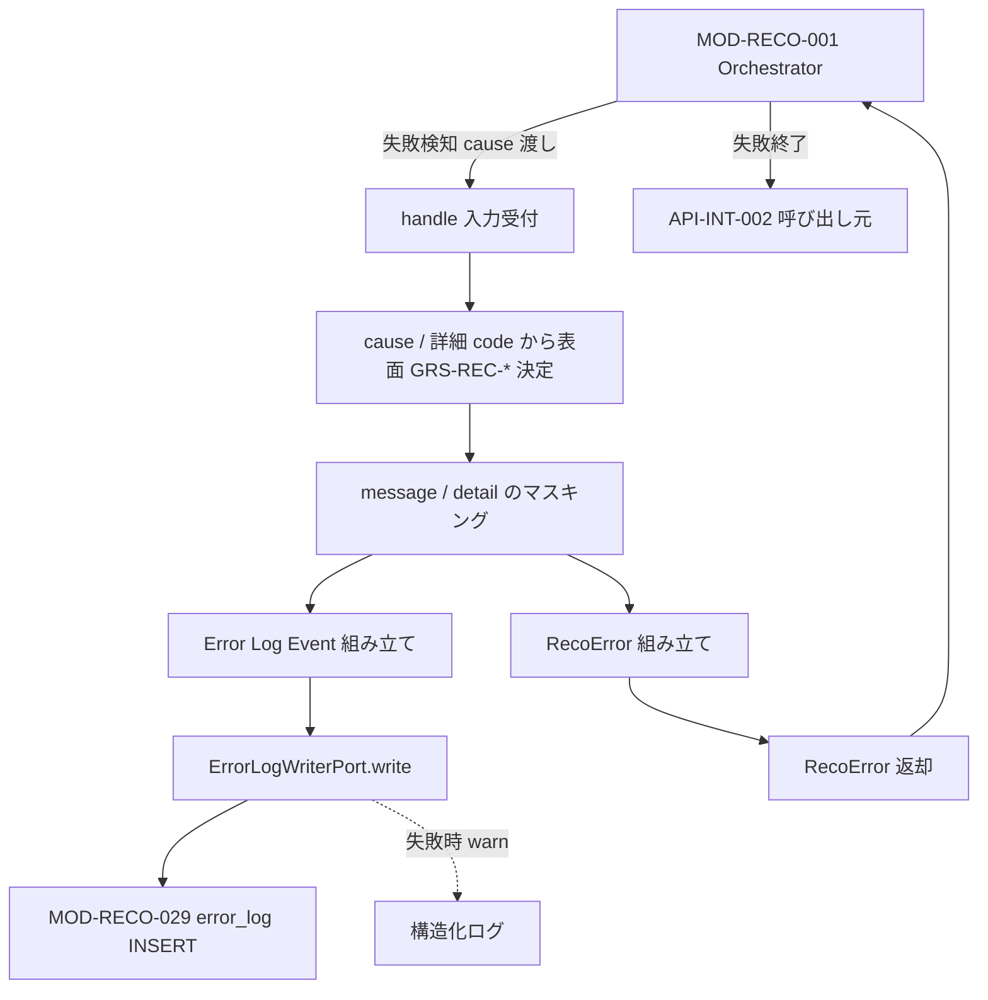

# Reco Error Handler モジュール仕様書

## 1. ドキュメント情報

| 項目           | 内容                                       |
| -------------- | ------------------------------------------ |
| ドキュメントID | `MOD-RECO-024`                             |
| ドキュメント名 | Reco Error Handler モジュール仕様書        |
| 対象システム   | Gift Recommendation Service（`apps/reco`） |
| MVP対象        | `○`                                        |
| 作成日         | 2026-07-06                                 |
| 更新日         | 2026-07-06（§16 設計方針確定・本リリース向け I/F 整理） |

---

## 2. 概要

Reco Error Handler（Reco Error処理）は、`MOD-RECO-001` Recommendation Orchestrator から **パイプライン失敗時に直接呼び出され**、reco 内部で発生した例外・失敗コンテキストを **推薦ドメイン向けの標準エラー（`GRS-REC-*`）** へ変換し、**Error Log 記録依頼**（`MOD-RECO-029` Error Log Writer へ委譲）および **呼び出し元（api / batch）へ返却する `RecoError`** を生成するモジュールである。

本モジュールは **エラー標準化・ログ接続・メッセージ粒度制御** に責務を限定し、推薦計算ロジック、Run / Phase Log の物理書き込み、Public / Internal API レスポンス形式への変換は行わない。Error Code の正本は **エラーコード定義書**、`error_log` 物理項目の正本は **`error_log_テーブル定義書`** を正とする。

**現行実装（移行期）**: `MOD-RECO-001` §8.4.2 に従い、`build_default_stub_ports()` では `StubErrorHandler` が配線され、表面 code 映射は Orchestrator `constants.py` の `MODULE_ERROR_CODES` に残存している。本仕様書は **本リリース向けの目標仕様** を定義する。Orchestrator 側の委譲・配線変更は **MOD-RECO-001 Epic（#260）配下 Wiring Task** で実施する（§16.1）。

---

## 3. 目的

- `apps/reco` における Reco Error Handler 実装・単体テストの前提を定義する
- Orchestrator との Port 契約（`ErrorHandlerPort` / `ExecutionContext` 入出力、`MOD-RECO-001` §8.4 / §14）を後続実装可能な粒度で整理する
- 詳細 Error Code（`GRS-CFG-*` / `GRS-LLM-*` / `GRS-DB-*` 等）から表面 `GRS-REC-*` への変換方針を明確化する
- `MOD-RECO-029` への Error Log 委譲、`MOD-RECO-028` Phase Log との責務境界を整理する
- Recoモジュール一覧 §6.23.4・エラーコード定義書・ログ・Observability設計書との整合を担保する

---

## 4. モジュール基本情報

| 項目 | 内容 |
| ---- | ---- |
| モジュールID | `MOD-RECO-024` |
| モジュール名 | Reco Error処理 |
| 物理名 | `Reco Error Handler` |
| 分類 | ログ・観測 |
| 処理種別 | `OL` |
| 配置予定 | `apps/reco/src/reco/application/reco-error-handler/**` |
| 所属Epic | `MOD-RECO-024`（Epic Issue #1013） |
| MVP対象 | `○` |
| 主な呼び出し元 | `MOD-RECO-001` Recommendation Orchestrator（各フェーズ失敗時・タイムアウト時） |
| 主な呼び出し先 | `MOD-RECO-029` Error Log Writer（`ErrorLogWriterPort` 経由で永続化委譲）、`execution_context`（`RecoError` 返却） |

`MOD-API-*` / `MOD-RECO-*` / `MOD-BATCH-*` 配下の Task では、該当モジュール ID の責務範囲に変更を限定する。`MOD-RECO-*` では `apps/reco/src/reco/api/**` の API-INT エンドポイント層を対象に含めない。エンドポイント層の変更が必要な場合は、該当する `API-INT-*` Epic 配下 Task として扱う。

---

## 5. 責務

### 5.1 主責務

- Orchestrator から渡された **失敗コンテキスト**（発生モジュール ID、例外 `cause`、内部メッセージ、フェーズ名、`ExecutionContext`）を受け取り、**表面 `GRS-REC-*` コード**へ標準化した `RecoError` を返却する
- **表面 `GRS-REC-*` 映射表（`MODULE_SURFACE_ERROR_CODES`）の正本**を本モジュールが保持する（Orchestrator `constants.py` から移管。§16.1）
- 下位モジュールが生成した **詳細 Error Code**（例: `GRS-CFG-*`, `GRS-LLM-*`, `GRS-DB-*`）を、エラーコード定義書および `MOD-RECO-001` §10.2 に従い **対応する `GRS-REC-*` へ集約**する（§8.3）
- **`RecoDomainError` Protocol**（§8.3.4）を持つ例外から `error_code` を **優先採用**する（例: `MOD-RECO-012` の `PreHardFilterError` → `GRS-REC-008`）
- **`ErrorLogWriterPort` を直接呼び出し**、`error_log` 永続化を委譲する（029 失敗時は warn のみ。返却は継続。§16.1）
- Error Log 行に必要な **owner（`owner_type` / `owner_id`）**、`trace_id`、`request_id`、`service=reco`、`severity`、`retryable`、`error_detail_json`（**マスキング済み**）を整える
- 呼び出し元（api）へ返却する **ユーザー向けメッセージ粒度**を制御する（内部詳細・secret・stack trace を Public 表面へ漏らさない方針の reco 側責務）
- **`GRS-REC-001`（推薦候補 0 件）** のような **ビジネス上の空結果** と **パイプライン異常終了** を区別し、後者のみ本モジュールの標準化対象とする（§10.1）
- Phase Log 連携向けに、失敗フェーズ名・表面 Error Code を Orchestrator / `MOD-RECO-028` が参照できる形で返却する（Phase Log 物理書込み自体は `028` 責務）

### 5.2 対象外責務

- `API-INT-002` エンドポイント層（HTTP 受付、reco 側防御的 Validation、HTTP status / Public error body への最終変換）
- `MOD-RECO-001` Orchestrator の **パイプライン実行順序制御**・下位モジュール呼び出し・Reason fallback 注入（§10.3）
- 下位 `MOD-RECO-002`〜`023` の **ドメイン計算**および各モジュール固有の **詳細 Error Code 生成**（本モジュールは受け取り・集約・返却）
- **`error_log` / `phase_log` テーブルへの物理 INSERT**（`MOD-RECO-029` / `MOD-RECO-028` 責務）
- **`recommendation_run.run_status` の終端更新**（`MOD-RECO-002` 責務。Orchestrator が失敗検知後に `failed` 遷移を依頼）
- **`MOD-RECO-025` Metric Logger** へのメトリクス記録
- Public API（`API-PUB-002`）向けレスポンス形式・`retryable` の **HTTP 表現**（`apps/api` / `MOD-API-*` 責務）
- OpenAPI / Orval / generated の変更
- DB schema / DDL の変更

---

## 6. 入出力

### 6.1 入力

| 入力 | 型 / 構造 | 必須 | 生成元 | 用途 | 備考 |
| ---- | --------- | ---- | ------ | ---- | ---- |
| `execution_context` | `ExecutionContext` | `true` | `MOD-RECO-001` | 失敗時の Run / Request / trace 情報 | `trace_id`, `run_id`, `recommendation_request` 等 |
| `module_id` | `string` | `true` | Orchestrator（失敗検知元） | 発生モジュール特定 | 例: `MOD-RECO-012` |
| `message` | `string` | `true` | Orchestrator / 例外 | 内部向け概要 | Public 非公開。マスキング対象 |
| `phase_name` | `string` | `false` | Orchestrator / 下位 Port | 失敗フェーズ名 | ログ・Observability設計書 §10.3 準拠 |
| `cause` | `Exception` | `false` | 下位モジュール | 詳細 code・分類の **第一情報源** | `RecoDomainError` 優先（§8.3.4） |
| `error_code` | `string` | `false` | Orchestrator（移行期のみ） | 詳細または表面 Error Code | **目標**: Orchestrator は code を決定せず `cause` のみ渡す（§16.1） |

**Port 契約（目標）**: `ErrorHandlerPort.handle()`。Port 拡張（`cause` 追加・`error_code` 任意化）は **MOD-RECO-001 Epic 配下 Wiring Task** で `ports.py` を更新する（§16.2）。

```python
def handle(
    self,
    context: ExecutionContext,
    *,
    module_id: str,
    message: str,
    phase_name: str | None = None,
    cause: BaseException | None = None,
    error_code: str | None = None,  # 移行期の後方互換。新規経路では未使用
) -> RecoError: ...
```

**移行期（現行 Stub / Orchestrator）**: `cause` 未対応の Port シグネチャのまま、`error_code` を Orchestrator が渡す。024 本実装は **両方を受理** し、Wiring 完了後は `cause` 優先に移行する。

### 6.2 出力

| 出力 | 型 / 構造 | 利用先 | 用途 | 備考 |
| ---- | --------- | ------ | ---- | ---- |
| `reco_error` | `RecoError` | Orchestrator → `API-INT-002` 呼び出し元 | 標準化 reco エラー返却 | 表面 `GRS-REC-*` を含む |
| `ErrorLogWriterPort.write(...)` 呼び出し | `ErrorLogWriteRequest`（実装 Task で型定義） | `MOD-RECO-029` | **本番の Error Log 永続化経路** | 失敗時 warn のみ（§16.1） |
| `execution_context.error_log_events` | `list[ErrorLogEvent]`（任意） | 単体テスト | テスト観察用シーム | 本番必須ではない（§16.1） |

**`RecoError` 構造（現行 Stub 準拠）**:

| フィールド | 型 | 用途 |
| ---------- | -- | ---- |
| `error_code` | `string` | 表面 `GRS-REC-*` |
| `message` | `string` | 内部向け概要（api 層でユーザー向けへ変換） |
| `module_id` | `string \| null` | 発生モジュール ID |
| `phase_name` | `string \| null` | 失敗フェーズ名 |

---

## 7. 依存関係

### 7.1 依存モジュール

| 依存先 | 方向 | 用途 | 失敗時の扱い | 備考 |
| ------ | ---- | ---- | ------------ | ---- |
| `MOD-RECO-001` Recommendation Orchestrator | 被呼び出し | 失敗検知・`handle()` 呼び出し | — | 唯一の直接呼び出し元（OL） |
| `MOD-RECO-029` Error Log Writer | 呼び出し（委譲） | `ErrorLogWriterPort.write()` で `error_log` 永続化 | **記録失敗は推薦結果返却をブロックしない**（warn ログ） | 029 未実装時は Port Stub / no-op（§16.2） |
| `MOD-RECO-028` Phase Log Writer | 間接連携 | 失敗フェーズ要約 | Phase Log 書込み失敗は推薦中断に影響させない | Orchestrator が `028` を直接呼ぶ。本モジュールは `phase_name` / 表面 code を供給 |
| `MOD-RECO-002` Recommendation Run Recorder | 間接連携 | `owner_id`（`recommendation_run_id`） | Run 未作成時は `owner_type=recommendation_request` 等へ fallback | §9 参照 |

### 7.2 参照データ

| データ | 参照元 | 用途 | version / config | 備考 |
| ------ | ------ | ---- | ---------------- | ---- |
| エラーコード定義 | エラーコード定義書 | `GRS-*` の HTTP / retryable / ユーザー向けメッセージ | 正本 docs | 本モジュールは参照のみ |
| `error_log` 項目定義 | `error_log_テーブル定義書` | Error Log 依頼項目 | MVP schema 固定 | DDL 変更は別 Task |
| Phase 名一覧 | ログ・Observability設計書 §10.3 | `phase_name` 整合 | — | 未知 phase はそのまま記録可 |

---

## 8. 処理仕様

### 8.1 処理フロー



### 8.2 処理ステップ

| No | 処理 | 入力 | 出力 | 補足 |
| --: | ---- | ---- | ---- | ---- |
| 1 | 入力検証 | `module_id`, `message`, `context` | — | 必須欠落時は `GRS-REC-999` |
| 2 | 詳細 code 解決 | `cause`, `error_code`（移行期） | 詳細 / 表面候補 | §8.3.4 `RecoDomainError` 優先 |
| 3 | 表面 code 決定 | 詳細 code, `module_id`, `phase_name` | 表面 `GRS-REC-*` | §8.3.1〜§8.3.2（本モジュール正本） |
| 4 | retryable / severity 解決 | 表面 code | メタデータ | エラーコード定義書の列を参照 |
| 5 | メッセージマスキング | `message`, `cause` | 安全な内部メッセージ | secret / Authorization / stack 除外（§12） |
| 6 | `RecoError` 生成 | 上記 | `reco_error` | Orchestrator へ返却 |
| 7 | Error Log Event 生成 | `context`, 表面 code, 詳細 code | `ErrorLogWriteRequest` | §9 マッピング |
| 8 | 029 委譲 | event | — | `ErrorLogWriterPort.write()`。失敗時 warn |
| 9 | テストシーム（任意） | event | `error_log_events` | unit test 観察用のみ |

### 8.3 アルゴリズム / 計算仕様

本モジュールは **Error Code 標準化ルール** の **正本** を保持する。参照 docs はエラーコード定義書および `MOD-RECO-001` §10.2。

**責務分界（本リリース）**

| コンポーネント | エラー設計上の責務 |
| -------------- | ---------------- |
| 下位 `MOD-RECO-*` | **詳細 code** を `RecoDomainError`（§8.3.4）として例外に載せる |
| Orchestrator | **失敗検知のみ**。`error_code` を決定しない（Wiring 後。§16.2） |
| 本モジュール（024） | **表面 `GRS-REC-*` 決定**、マスキング、Error Log 委譲 |
| `MOD-RECO-029` | `error_log` 物理 INSERT |
| `apps/api` / `MOD-API-013` | Public HTTP / ユーザー向けメッセージ |

#### 8.3.1 表面コード（`GRS-REC-*`）の決定

| 優先 | 条件 | 表面 code |
| --: | ---- | --------- |
| 1 | `cause` が `RecoDomainError` かつ `error_code` が `GRS-REC-*` | **`cause.error_code` を採用**（上書きしない） |
| 2 | `cause` / 入力が `GRS-CFG-*` | `GRS-REC-003` |
| 3 | `cause` / 入力が `GRS-LLM-*` かつ User Meaning フェーズ（`004`〜`010`） | モジュール別（§8.3.2） |
| 4 | `cause` / 入力が `GRS-DB-*` | 発生モジュールに応じた `GRS-REC-002`〜`012`（§8.3.2） |
| 5 | `cause` / 入力が `GRS-EXT-*` / `GRS-RAW-*`（Retrieval 文脈） | `GRS-REC-009` |
| 6 | 詳細 code なし・素の `Exception` | `MODULE_SURFACE_ERROR_CODES[module_id]`（§8.3.2） |
| 7 | 上記に該当しない | `GRS-REC-999` |

#### 8.3.2 発生モジュール → 表面 code（本モジュール正本）

`MODULE_SURFACE_ERROR_CODES`（実装名。旧 Orchestrator `MODULE_ERROR_CODES` から **本モジュールへ移管**。§16.1）:

| 発生モジュール | 表面 `GRS-REC-*` | 備考 |
| -------------- | ---------------- | ---- |
| `MOD-RECO-002` | `GRS-REC-002` | Run 記録失敗 |
| `MOD-RECO-003` | `GRS-REC-003` | Config 解決失敗（`GRS-CFG-*` 詳細を集約） |
| `MOD-RECO-004` | `GRS-REC-004` | Semantic 抽出失敗 |
| `MOD-RECO-005`〜`009`（`008` 除く） | `GRS-REC-005` | User Feature 系失敗 |
| `MOD-RECO-008` | `GRS-REC-006` | User Meaning 射影失敗 |
| `MOD-RECO-010` | `GRS-REC-007` | Query Embedding 失敗 |
| `MOD-RECO-012`（`pre_hard_filter`） | `GRS-REC-008` | `PreHardFilterError` が第一情報源（§8.3.4） |
| `MOD-RECO-012`（`retrieval`） | `GRS-REC-009` | `RetrievalError` が第一情報源（§8.3.4） |
| `MOD-RECO-013` | `GRS-REC-010` | Post Hard Filter 失敗 |
| `MOD-RECO-014`〜`016` | `GRS-REC-011` | Matching 失敗 |
| `MOD-RECO-017`〜`022` | `GRS-REC-012` | Ranking / Result 構築失敗 |
| `MOD-RECO-023` | `GRS-REC-013` | Reason 致命失敗（Item 単位 fallback は対象外） |
| パイプライン timeout | `GRS-REC-101` | Orchestrator ウォッチドッグ |
| Run 状態不整合 | `GRS-REC-201` | `MOD-RECO-002` 連携 |
| 想定外 | `GRS-REC-999` | — |

**`MOD-RECO-012` の 008 / 009 区別**: Orchestrator がサブフェーズを自動判別するのではなく、**下位モジュールが `PreHardFilterError` / `RetrievalError` で正しい surface code を載せ、024 が採用する**（§16.1）。Orchestrator は `cause` をそのまま 024 へ渡す。

#### 8.3.3 ユーザー向けメッセージ

表面 `GRS-REC-*` に対応する **ユーザー向けメッセージ** の正本はエラーコード定義書。本モジュールは `RecoError.message` に **内部向け概要** を保持し、Public 変換は `apps/api` 側で行う。

| 項目 | 内容 |
| ---- | ---- |
| Public 返却 | api 層が `error.code` + ユーザー向けメッセージを組み立て |
| reco 側禁止 | secret、内部 path、完全 stack、生の外部 API レスポンス |

#### 8.3.4 `RecoDomainError` Protocol（Human 決定・§16.1）

reco 下位モジュールが送出する構造化例外の **共通 Protocol**。配置正本は `apps/reco/src/reco/domain/errors.py`（Epic #1013 `allowed_paths` 内）。

| 属性 | 型 | 必須 | 用途 |
| ---- | -- | ---- | ---- |
| `error_code` | `string` | `true` | 詳細 code または surface code（`GRS-*`） |
| `detail_error_code` | `string` | `false` | 詳細 code（`error_code` が surface の場合に併記） |
| `phase_name` | `string` | `false` | 失敗フェーズ名 |

**既存実装例**: `MOD-RECO-012` の `PreHardFilterError`（`GRS-REC-008`）、`RetrievalError`（`GRS-REC-009`）。他モジュールは **新規・改修時に順次** Protocol へ寄せる（全モジュール一括統一は本 Epic scope 外）。

**024 の解決順**: `cause.error_code`（Protocol 準拠）→ 詳細 domain 集約（§8.3.1）→ `MODULE_SURFACE_ERROR_CODES` fallback → `GRS-REC-999`。

---

## 9. データ項目マッピング

| 入力項目 | 内部項目 | 出力項目 | 変換内容 | 備考 |
| -------- | -------- | -------- | -------- | ---- |
| `context.trace_id` | — | `error_log_event.trace_id` | そのまま | Phase Log と同一値推奨 |
| `context.recommendation_request.recommendation_request_id` | — | `error_log_event.request_id` | 文字列化 | nullable |
| `context.run_id` | — | `error_log_event.owner_id` | UUID | `owner_type=recommendation_run` |
| `context.run_id` 未設定 | `recommendation_request_id` | `owner_id` | fallback | `owner_type=recommendation_request` |
| `error_code`（入力・詳細） | `detail_error_code` | `error_log_event.error_code` | **表面** `GRS-REC-*` を記録 | 詳細 code は `error_detail_json.detail_error_code` |
| `module_id` | — | `error_detail_json.source_module_id` | 付加 | 調査用 |
| `phase_name` | — | `error_detail_json.phase_name` | 付加 | `phase_log` と突合 |
| `message`（マスキング後） | — | `error_log_event.error_message` | 内部概要 | — |
| — | — | `error_log_event.service` | 固定 `reco` | — |
| 表面 code | — | `reco_error.error_code` | §8.3 | api へ伝播 |

---

## 10. 状態・例外

### 10.1 状態

本モジュールは **ステートレス**（失敗イベント単位の変換）とする。

| 状態 | 意味 | 遷移条件 | 記録先 |
| ---- | ---- | -------- | ------ |
| — | なし | — | — |

**`GRS-REC-001`（推薦候補 0 件）**: HTTP 200 のビジネス空結果であり、本モジュールの **致命失敗ハンドラ** 経路では扱わない。0 件検知・表面化は Orchestrator / 下位モジュール / api 層の協調で行う（`MOD-RECO-001` §8.2 **`0件結果`**、`MOD-RECO-024` と api で最終化）。

### 10.2 例外

| 例外 | Error Code | 発生条件 | 呼び出し元への返却 | ログ |
| ---- | ---------- | -------- | ------------------ | ---- |
| 標準化入力不正 | `GRS-REC-999` | 必須入力欠落、未知形式 | 500 系 | Error Log（critical） |
| 下位モジュール失敗 | `GRS-REC-002`〜`013` | §8.3.2 | 500 系（`001` は 200） | Error Log + Phase failed |
| Config 詳細失敗 | `GRS-CFG-*` → `GRS-REC-003` | `MOD-RECO-003` 連携 | 500 系 | 詳細 code を `error_detail_json` に保持 |
| Reco タイムアウト | `GRS-REC-101` | パイプライン hard timeout | 504 系 | Error Log |
| Run 状態不整合 | `GRS-REC-201` | Run 更新競合 | 409 系 | Error Log |
| 想定外 | `GRS-REC-999` | 分類不能 | 500 系 | Error Log（critical） |
| Error Handler 内部失敗 | `GRS-REC-999` | 本モジュール内例外 | 500 系 | 構造化ログ（critical）。**二次 Error Log ループ回避** |

Error Code の正本はエラーコード定義書。Orchestrator は本モジュールが返す `RecoError` を呼び出し元へ伝播する（`MOD-RECO-001` §10.2）。

---

## 11. DB / 永続化

本モジュールは DB へ **直接書き込まない**。永続化は `MOD-RECO-029` に委譲する。

| テーブル | 操作 | 主な項目 | トランザクション | 備考 |
| -------- | ---- | -------- | ---------------- | ---- |
| `error_log` | INSERT（委譲） | `error_code`, `owner_type`, `owner_id`, `trace_id`, `error_detail_json` | `MOD-RECO-029` が管理 | IF-DB-RECO-009 |

---

## 12. ログ・メトリクス

| 種別 | 内容 | 出力タイミング | 保存先 | 備考 |
| ---- | ---- | -------------- | ------ | ---- |
| Error Log 永続化 | 失敗詳細（マスキング済み） | `handle()` 内 | `error_log`（`MOD-RECO-029`） | **`ErrorLogWriterPort.write()` が本番経路** |
| Error Log テストシーム | 同上 event のコピー | `handle()` 内（任意） | `execution_context.error_log_events` | unit test 観察用 |
| 構造化ログ | 標準化結果サマリ（表面 code, module_id, phase） | `handle()` 完了時 | アプリログ | secret 不含 |
| 構造化ログ | 本モジュール内部失敗 | 例外時 | アプリログ | critical |

**マスキング方針（正本: `error_log_テーブル定義書` §5.6）**: API キー、Authorization Header、Cookie、Session token、secret 付き URL、過大 Raw レスポンス、不要 PII を `error_message` / `error_detail_json` から除外する。

### 12.1 メトリクス

| Metric | 内容 | 集計単位 | 用途 |
| ------ | ---- | -------- | ---- |
| `reco_error_count` | 表面 `GRS-REC-*` 別件数 | Run | 障害率監視 |
| `reco_error_by_module` | 発生モジュール別件数 | Run | ボトルネック特定 |

メトリクス永続化は `MOD-RECO-025` Metric Logger に委譲可能（MVP 対象 `△`）。

---

## 13. 性能・非機能

| 観点 | 方針 |
| ---- | ---- |
| レイテンシ | 失敗経路のみ。純粋な in-memory 変換 + event 組み立て（sub-ms 目標） |
| 計算量 | O(1)。マッピング表参照 |
| タイムアウト | 本モジュール単体 timeout は設けない |
| リトライ | **行わない**（失敗処理の冪等性: 同一 Run 失敗で複数 event が積まれないよう Orchestrator が 1 回呼び出しに抑える） |
| キャッシュ | なし |
| 並列実行 | 同一 `execution_context` への並行 `handle()` は呼び出し元が禁止 |

---

## 14. テスト観点

| No | 観点 | 確認内容 | 種別 |
| --: | ---- | -------- | ---- |
| 1 | Port 契約 | 目標 `ErrorHandlerPort.handle()`（`cause` 付き）の入出力が §6 と一致すること | unit |
| 2 | Domain error 優先 | `PreHardFilterError`（008）/ `RetrievalError`（009）が上書きされないこと | unit |
| 3 | CFG 集約 | 入力 `GRS-CFG-002` が `GRS-REC-003` に集約されること | unit |
| 4 | LLM 集約 | User Meaning フェーズの `GRS-LLM-103` が適切な `GRS-REC-*` になること | unit |
| 5 | fallback 映射 | 素の `Exception` で `MODULE_SURFACE_ERROR_CODES` が適用されること | unit |
| 6 | 029 Port 委譲 | `ErrorLogWriterPort.write()` が呼ばれ、029 失敗時も `RecoError` が返ること | unit |
| 7 | Error Log 項目 | 表面 code が `error_log.error_code`、詳細が `error_detail_json` であること | unit |
| 8 | マスキング | message / detail に secret 相当文字列が含まれないこと | unit |
| 9 | 999 fallback | 分類不能入力で `GRS-REC-999` になること | unit |
| 10 | Orchestrator 連携 | Wiring 後、失敗時に 024→029 が接続されること（`MOD-RECO-001` §14 No.9） | integration |
| 11 | REC-001 除外 | 候補 0 件正常系で本ハンドラが致命経路を起動しないこと | unit |
| 12 | 内部失敗 | Handler 内例外時に二次ループせず `GRS-REC-999` を返すこと | unit |

---

## 15. 変更管理

### 15.1 変更履歴

| 日付 | 変更内容 | 関連Issue / PR |
| ---- | -------- | -------------- |
| 2026-07-06 | 初版作成 | Issue #1014 |
| 2026-07-06 | §16 設計方針確定（本リリース向けエラー委譲・029 Port 直呼び・`RecoDomainError`） | Issue #1014 Human 判断 |

---

## 16. 設計方針（確定）

Human Review（Issue #1014）にて、以下を **本リリース向けの確定方針** とする。

### 16.1 確定事項

| No | 論点 | 確定方針 |
| --: | ---- | -------- |
| 1 | 表面 code 映射（旧 `MODULE_ERROR_CODES`） | **`MOD-RECO-024` が正本**（`MODULE_SURFACE_ERROR_CODES`）。Orchestrator `constants.py` から移管し、Wiring 後に削除 |
| 2 | Error Log 永続化経路 | **`ErrorLogWriterPort.write()` を 024 から直接呼ぶ**。029 失敗は warn のみ。`execution_context.error_log_events` は **テストシーム**（本番必須ではない） |
| 3 | `GRS-REC-008` / `009` 区別 | **Orchestrator 自動区別は行わない**。下位 `MOD-RECO-012` の `PreHardFilterError` / `RetrievalError`（`RecoDomainError`）を 024 が優先採用 |
| 4 | `RecoDomainError` Protocol | **`apps/reco/src/reco/domain/errors.py` に定義**。`error_code` / 任意 `detail_error_code` / `phase_name`。既存モジュールは改修時に順次寄せる |
| 5 | Error Log の code 列 | **`error_log.error_code` = 表面 `GRS-REC-*`**。詳細 code（`GRS-CFG-*` 等）は `error_detail_json.detail_error_code` |
| 6 | Orchestrator の責務 | **失敗検知 + `cause` を 024 へ渡すのみ**。Wiring 後は surface code を決定しない |

### 16.2 後続 Task（横断修正の実施タイミング）

| 順序 | Task | Epic | 内容 |
| --: | ---- | ---- | ---- |
| 1 | MOD-RECO-024 implementation | #1013 | `reco-error-handler/**`、`MODULE_SURFACE_ERROR_CODES`、`RecoDomainError`、029 Port 呼び出し（Stub 可） |
| 2 | MOD-RECO-029 implementation | #1013 | `error-log-writer/**`、024→029 本接続 |
| 3 | MOD-RECO-001 Wiring（**新規 Issue 推奨**） | #260 | `ports.py` 拡張、`orchestrator.py` 委譲、`constants.py` から mapping 削除、`stubs.py` 本実装差し替え、テスト更新 |
| 4 | MOD-RECO-024 unit-test | #1013 | §14 網羅テスト + Orchestrator integration（Wiring 後） |

**パイプライン挙動が本番方針に切り替わるのは順序 3（Orchestrator Wiring）完了後** である。順序 1〜2 では 024 単体・029 連携を unit / 明示 DI で検証する。

### 16.3 未決事項

| No | 論点 | 判断が必要な理由 | 判断者 | 期限 | 備考 |
| --: | ---- | ---------------- | ------ | ---- | ---- |
| - | なし | - | - | - | §16.1 で確定済み |

---

## 17. 関連資料

| 種別 | パス / URL | 用途 |
| ---- | ---------- | ---- |
| Recoモジュール一覧 | `docs/05_アプリケーション設計/アプリ/reco/Recoモジュール一覧.md` | §6.23.4 モジュール定義 |
| モジュール一覧 | `docs/05_アプリケーション設計/アプリ/モジュール一覧.md` | 横断モジュール定義 |
| エラーコード定義書 | `docs/05_アプリケーション設計/アプリ/エラーコード定義書.md` | `GRS-*` 正本 |
| ログ・Observability設計書 | `docs/05_アプリケーション設計/アプリ/ログ・Observability設計書.md` | Error Log / Phase 設計 |
| Orchestrator 仕様書 | `docs/06_実装設計/reco/MOD-RECO-001_Recommendation Orchestratorモジュール仕様書.md` | §8.4 Port・§14 テスト |
| error_log テーブル定義書 | `docs/06_実装設計/database/error_log_テーブル定義書.md` | Error Log 物理項目 |
| Port 定義（コード・移行期） | `apps/reco/src/reco/application/recommendation-orchestrator/ports.py` | 現行 `ErrorHandlerPort`（Wiring Task で拡張） |
| Stub 参照実装 | `apps/reco/src/reco/application/recommendation-orchestrator/stubs.py` | `StubErrorHandler`（移行期） |
| Domain error Protocol（予定） | `apps/reco/src/reco/domain/errors.py` | `RecoDomainError`（§8.3.4） |
| 012 構造化例外（参考） | `apps/reco/src/reco/application/candidate-retriever/errors.py` | `PreHardFilterError` / `RetrievalError` |

---

## 18. レビュー観点

- Recoモジュール一覧 §6.23.4 のモジュール名・物理名・分類・処理種別・MVP対象と一致している
- `MOD-RECO-001` §8.4（`ErrorHandlerPort` / Stub 配線）および §14 No.9（Error Log 接続）との Port・委譲関係が明確である
- API-INT-002 エンドポイント層を責務範囲に含めていない
- 詳細 Error Code から表面 `GRS-REC-*` への変換方針が後続実装可能な粒度である
- §16 設計方針（本リリース向け）が確定しており、Orchestrator / 029 との後続 Task 分担（§16.2）が明確である
- secret や `.env` 実値が含まれていない

---

## 19. 備考

- Epic 配線方針: `MOD-RECO-001` §8.4.2 では `024` は **Stub**。本リリース方針確定後は **024 実装 → 029 実装 → MOD-RECO-001 Wiring** の順で本番経路へ移行（§16.2）
- 推奨着手順（Epic bootstrap）: **024 → 029 → 028**（Issue #1011 参照）。Orchestrator Wiring は 024 実装マージ後に **MOD-RECO-001 Epic で Issue 化**
- Reason 部分成功（`MOD-RECO-023` Item 単位 fallback）では **`GRS-REC-013` を発行しない**（`MOD-RECO-001` §10.3）
- `MOD-RECO-001` 仕様書 §8.4 / §10.2 の更新は **Orchestrator Wiring Task 完了時** に実施（本 Task scope 外）
