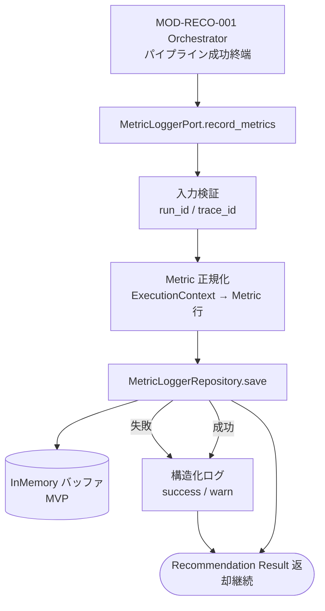

# Metric Logger モジュール仕様書

## 1. ドキュメント情報

| 項目           | 内容                                       |
| -------------- | ------------------------------------------ |
| ドキュメントID | `MOD-RECO-025`                             |
| ドキュメント名 | Metric Logger モジュール仕様書             |
| 対象システム   | Gift Recommendation Service（`apps/reco`） |
| MVP対象        | `○`                                        |
| 作成日         | 2026-07-07                                 |
| 更新日         | 2026-07-09（Postgres composition 完了反映）      |

---

## 2. 概要

Metric Logger（Metric記録）は、**推薦 Run 成功終端における件数・処理時間・品質サマリ Metric** の永続化を担う reco 内部モジュールである。本リリースでは **`MOD-RECO-001` Recommendation Orchestrator から `MetricLoggerPort.record_metrics()` 経由で直接呼び出し**される。

Orchestrator はパイプライン全体の計測起点・終点および下位モジュールが `ExecutionContext` に書き込んだカウント / レイテンシを集約する。本モジュールは **Metric の正規化・Repository 経由の永続化・Run 内観察用バッファ** を担当する。`phase_log` / `error_log` への物理書き込みは **`MOD-RECO-028` / `MOD-RECO-029`** 責務であり、本モジュールの対象外とする。

**現行実装（Orchestrator 配線）**: Epic #1061（PR #1066 develop merge 済み）により、`build_default_stub_ports()` では `_build_default_orchestrator_metric_logger()` が配線され、`build_default_metric_logger()` 本実装（InMemory Repository）が接続されている。`StubMetricLogger` クラスは composition test 互換の参照として `stubs.py` に残存する。

**本番 composition（Postgres）**: Epic #1076（PR #1088 develop merge 済み）により、`build_production_ports()` / `CompositionMode.PRODUCTION` では `PostgresMetricLogRepository`（Tier 1）が `composition/observability.py` 経由で配線される。MVP デフォルト（`build_default_stub_ports()`）は InMemory のまま。

---

## 3. 目的

- `apps/reco` における Metric Logger 実装・単体テストの前提を定義する
- `MOD-RECO-001` との Port 契約（`MetricLoggerPort` / `ExecutionContext`）を後続実装可能な粒度で整理する
- ログ・Observability設計書 §11.2 / §11.3 / §12 および Recoモジュール一覧 §6.23.5 / §10.2 との整合を担保する
- **MVP InMemory 永続化** と **段階3 Composition（Postgres Metric Repository）** の責務境界を明確化する
- 記録失敗時の **non-blocking** 方針（`MOD-RECO-028` / `MOD-RECO-029` 同型）を明記する

---

## 4. モジュール基本情報

| 項目 | 内容 |
| ---- | ---- |
| モジュールID | `MOD-RECO-025` |
| モジュール名 | Metric記録 |
| 物理名 | `Metric Logger` |
| 分類 | ログ・観測 |
| 処理種別 | `共通` |
| 配置予定 | `apps/reco/src/reco/application/metric-logger/**` |
| 所属Epic | `MOD-RECO-025`（Epic Issue #1053） |
| MVP対象 | `○`（Human 判断。Epic #1053） |
| 主な呼び出し元 | **`MOD-RECO-001` Recommendation Orchestrator**（`MetricLoggerPort.record_metrics()`。パイプライン **成功終端** のみ） |
| 主な呼び出し先 | `MetricLoggerRepository`（MVP: InMemory。段階3: `metric_log` / `reco_score_distribution_metric` 等） |

`MOD-API-*` / `MOD-RECO-*` / `MOD-BATCH-*` 配下の Task では、該当モジュール ID の責務範囲に変更を限定する。`MOD-RECO-*` では `apps/reco/src/reco/api/**` の API-INT エンドポイント層を対象に含めない。

---

## 5. 責務

### 5.1 主責務

- `MetricLoggerPort.record_metrics(context)` を受け取り、Run 単位 Metric を **Repository 経由で永続化** する
- `ExecutionContext` 上のレイテンシ・候補件数・品質カウント（§9）を **Observability 正本に沿った Metric 名** に正規化する
- **`recommendation_run_id`（`context.run_id`）** および **`trace_id`** を owner / 相関キーとして付与する
- MVP では **InMemory Repository** を正とし、unit test / Orchestrator smoke で DB なし再現可能にする
- 永続化失敗時は **例外を Orchestrator へ伝播しない**（warn 構造化ログのみ。推薦結果返却を継続）
- 観察用に Run 内バッファ（Stub 互換: 実装側 `recorded` リスト、または `ExecutionContext` 拡張）へ append する（unit test 観察用）
- `MetricLoggerPort` Protocol を実装し、Orchestrator から DI 可能な公開 I/F を提供する

### 5.2 対象外責務

- `API-INT-002` エンドポイント層（HTTP 受付、reco 側防御的 Validation）
- **`MOD-RECO-001` Orchestrator のパイプライン実行順序制御・計測起点管理**
- **`phase_log` / `error_log` への物理 INSERT / UPDATE**（`MOD-RECO-028` / `MOD-RECO-029` 責務）
- **`recommendation_run.run_status` の終端更新**（`MOD-RECO-002` / Orchestrator 責務）
- パイプライン **失敗経路** での Metric 記録（MVP では成功終端のみ。失敗時 Run 集計は後続 Task）
- Observability §12 の **分布統計量（mean / stddev / 分位点）の Run 内算出詳細**（MVP InMemory では対象外。段階3 Composition で `reco_score_distribution_metric` へ委譲）
- Batch Run / Evaluation Run 向け Metric 記録（**reco Online 成功経路に限定**。batch / api 側 Metric Writer は別 Epic）
- サービス横断の Run 外集計（`recommendation_run_count` 等の日次集計。monitoring / batch 責務）
- Public API（`API-PUB-002`）向けレスポンス形式・HTTP status 変換
- OpenAPI / Orval / generated の変更
- DB schema / DDL の変更（Composition Task へ委譲）

---

## 6. 入出力

### 6.1 入力

| 入力 | 型 / 構造 | 必須 | 生成元 | 用途 | 備考 |
| ---- | --------- | ---- | ------ | ---- | ---- |
| `context` | `ExecutionContext` | `true` | `MOD-RECO-001` | Run 計測値・相関キーの取得 | 型正本は `recommendation-orchestrator/execution_context.py` |

**Port 契約**: `MetricLoggerPort.record_metrics(context) -> None`

```python
class MetricLoggerPort(Protocol):
    module_id: str

    def record_metrics(self, context: ExecutionContext) -> None: ...
```

| `ExecutionContext` 参照フィールド（代表） | 用途 |
| ----------------------------------------- | ---- |
| `trace_id` | Metric 相関 |
| `run_id`（`recommendation_run.run_id`） | owner キー |
| `recommendation_latency_ms`（property） | Run 全体レイテンシ |
| `pre_filter_candidate_count` / `retrieval_candidate_count` / `post_filter_candidate_count` | 候補数ファネル（§11.3） |
| `final_ranker_selected_count` / `result_builder_item_count` | 最終件数 |
| `recommendation_result` | `final_result_count` 導出 |
| `reason_fallback_count` / `reason_generator_fallback_count` | Reason fallback 監視 |
| 各 `*_latency_ms` | フェーズ / モジュール別レイテンシ（MVP 拡張対象） |

**呼び出し契機**（`MOD-RECO-001` 実装）:

- `RecommendationOrchestrator` がパイプライン成功、`recommendation_run` を `SUCCEEDED` に更新した **直後**
- `response_built` Phase Log 記録の **直前**
- `metric_logger is None` の場合は **スキップ**（Port 未注入）

### 6.2 出力

| 出力 | 型 / 構造 | 利用先 | 用途 | 備考 |
| ---- | --------- | ------ | ---- | ---- |
| Metric 永続化行 | Repository 依存（MVP: `dict` / dataclass 相当） | InMemory / 将来 DB | Run 単位観測 | §9 マッピング |
| Run 内観察バッファ | `list[dict[str, object]]` | unit test / Stub 互換 | 記録内容の検証 | `StubMetricLogger.recorded` 互換 |
| 構造化ログ | warn / info | アプリログ | 永続化成功 / 失敗 | secret 不含 |

**主出力の論理名**: Recoモジュール一覧 §6.23.5 の `metric_log`（MVP では InMemory。物理 `metric_log` テーブル DDL は未整備・Composition Task へ）

---

## 7. 依存関係

### 7.1 依存モジュール

| 依存先 | 方向 | 用途 | 失敗時の扱い | 備考 |
| ------ | ---- | ---- | ------------ | ---- |
| `MOD-RECO-001` Recommendation Orchestrator | 被呼び出し | `record_metrics()` 契機・`ExecutionContext` 供給 | — | Epic #1061 Wiring 完了 |
| `MetricLoggerRepository` | 呼び出し | Metric 永続化 | catch し warn。推薦継続 | Protocol + InMemory（MVP） |
| `MOD-RECO-002` Recommendation Run Recorder | 間接 | `context.run_id` 確定 | `run_id` NULL 時は warn + スキップまたは部分記録 | §8.3 |

### 7.2 参照データ

| データ | 参照元 | 用途 | version / config | 備考 |
| ------ | ------ | ---- | ---------------- | ---- |
| `ExecutionContext` 型 | `recommendation-orchestrator/execution_context.py` | 入力正本 | Orchestrator 実装に追随 | generated ではない |
| Observability Metric 名 | ログ・Observability設計書 §11.2 | 項目名整合 | — | MVP 部分集合 |
| 分布 Metric 設計 | 同上 §12 | 将来拡張 | — | MVP 対象外 |
| `reco_score_distribution_metric` | DB テーブル定義書 | 段階3 永続化参考 | — | MVP InMemory では未使用 |

**025→001 結合**: 025 は `recommendation-orchestrator` から **Port・ExecutionContext のみ import** する。Orchestrator 本体 / `stubs.py` の Wiring 差し替えは Epic #1061（PR #1066 develop merge 済み）で **完了**。

---

## 8. 処理仕様

### 8.1 処理フロー



### 8.2 処理ステップ

| No | 処理 | 入力 | 出力 | 補足 |
| --: | ---- | ---- | ---- | ---- |
| 1 | Port 呼び出し受付 | `ExecutionContext` | — | Orchestrator 成功経路のみ |
| 2 | 相関キー検証 | `context.run_id`, `context.trace_id` | 検証結果 | `run_id` 欠落時は warn + 記録スキップ（§8.3） |
| 3 | Metric 組み立て | `ExecutionContext` 各フィールド | Run 単位 Metric  dict / record | §9・§16.2 MVP 範囲 |
| 4 | Repository 永続化 | Metric record | 保存結果 | InMemory append（MVP） |
| 5 | 観察バッファ更新 | Metric record | `recorded` 等 | Stub 互換 |
| 6 | 構造化ログ | 成功 / 失敗 | アプリログ | 失敗でも例外非伝播 |

### 8.3 `run_id` 未確定時の扱い

| 観点 | 方針 |
| ---- | ---- |
| 発生条件 | Orchestrator 成功経路では通常 `context.recommendation_run` が `SUCCEEDED` 更新済みのため **`run_id` は非 NULL が期待** |
| MVP 方針 | `run_id` が NULL の場合は **DB/InMemory 永続化をスキップ**し warn ログのみ |
| 部分記録 | trace_id のみの in-memory 観察は **許可しない**（テスト混乱防止） |
| 失敗時 | スキップも推薦中断に影響させない |

### 8.4 分布 Metric / 下位モジュール Metric の扱い

| 区分 | MVP InMemory | 段階3 Composition |
| ---- | ------------ | ----------------- |
| Run 集約（レイテンシ・候補件数・0件・fallback） | **記録する**（§16.2） | `metric_log` 相当へ INSERT |
| モジュール別 `*_latency_ms` | **主要フェーズのみ**（§16.2 Tier 1b） | 同上 |
| §12 分布（`final_score_distribution` 等） | **記録しない** | Repository 存在（#1076）だが Orchestrator 非接続 |
| 下位モジュールからの個別 Metric 依頼 | **行わない**（Orchestrator 集約のみ） | 必要に応じて拡張 Task |

### 8.5 永続化・リトライ方針

| 観点 | 方針 |
| ---- | ---- |
| 操作 | MVP: InMemory **append**（1 Run = 1 レコードまたは 1 イベント束） |
| 冪等性 | 同一 Run への **再 `record_metrics()` は MVP では想定しない**（Orchestrator 1 回のみ） |
| トランザクション | Run 全体トランザクションには **参加しない** |
| リトライ | 本モジュールでは **行わない** |

---

## 9. データ項目マッピング

### 9.1 `ExecutionContext` → MVP Metric 行（Tier 1）

| 入力 / コンテキスト | Metric 名 | 変換 | 備考 |
| ------------------- | --------- | ---- | ---- |
| `context.run_id` | `recommendation_run_id` | そのまま | NOT NULL 必須 |
| `context.trace_id` | `trace_id` | そのまま | 相関 |
| `context.recommendation_latency_ms` | `recommendation_latency_ms` | int | Run 全体 |
| `context.pre_filter_candidate_count` | `pre_filter_candidate_count` | int / null | §11.3 ファネル |
| `context.retrieval_candidate_count` | `retrieval_candidate_count` | int / null | 同上 |
| `context.post_filter_candidate_count` | `post_filter_candidate_count` | int / null | 同上 |
| `context.recommendation_result.item_count` または `result_builder_item_count` | `final_result_count` | int | 0 件も正常 |
| 導出: `final_result_count == 0` | `recommendation_empty` | bool | 0 件 Run フラグ |
| `context.reason_fallback_count` | `reason_fallback_count` | int | Stub 互換 |
| — | `recorded_at` | UTC now | 本モジュールが設定 |
| — | `metric_source` | `'MOD-RECO-025'` 固定 | モジュール識別 |

### 9.2 MVP 拡張（Tier 1b: 主要フェーズレイテンシ）

| 入力 | Metric 名 | 備考 |
| ---- | --------- | ---- |
| `pre_hard_filter_latency_ms` + `retrieval_latency_ms` | `retrieval_phase_latency_ms`（導出）または個別キー | implementation Task で確定 |
| `feature_matcher_latency_ms` 等 Matching 系 | `matching_latency_ms`（導出） | `MOD-RECO-014`〜`016` 共有 Metric |
| `final_ranker_latency_ms` 等 Ranking 系 | `ranking_latency_ms`（導出） | `MOD-RECO-017`〜`020` 共有 Metric |
| `reason_generation_latency_ms` | `reason_generation_latency_ms` | 任意 |

> Tier 1b は Stub 最小集合（§19）を超えるが、Observability §11.2 / Orchestrator §12.1 と整合する **推奨 MVP 拡張** とする。implementation Task で Tier 1 のみ先出しし Tier 1b は follow-up してもよい（§16.3）。

### 9.3 MVP 対象外（Tier 2: 分布・集計）

ログ・Observability設計書 §11.2 / §12 に列挙される以下は **MVP InMemory では記録しない**。

| Metric（例） |  defer 先 |
| ------------ | --------- |
| `user_feature_distribution` / `user_social_distribution` / `user_symbolic_distribution` | 段階3 / batch 集計 |
| `lambda_ctx_distribution` | 同上 |
| `social_match_distribution` / `symbolic_match_distribution` / `feature_match_distribution` | `reco_score_distribution_metric` 等 |
| `final_score_distribution` | `reco_score_distribution_metric`（テーブル定義書）。Repository は #1076 で存在するが Orchestrator 非接続 |
| `recommendation_run_count` / `recommendation_success_count`（サービス横断） | monitoring / 日次 batch |

### 9.4 Stub 互換（現行 `StubMetricLogger`）

| Stub キー | MVP 正規 Metric 名 | 備考 |
| --------- | ------------------ | ---- |
| `recommendation_latency_ms` | 同一 | |
| `reason_fallback_count` | 同一 | |
| `final_result_count` | 同一 | |
| `trace_id` / `run_id` | 同一 | 相関 |

---

## 10. 状態・例外

### 10.1 状態

本モジュールは **Run スコープで実質ステートレス**（1 成功終端 = 1 回 `record_metrics()`）とする。InMemory Repository のみ Run 横断リストを保持する。

| 内部状態 | 意味 | 遷移条件 |
| -------- | ---- | -------- |
| `idle` | 未呼び出し | Orchestrator 成功終端で `record` |
| `recorded` | 永続化完了 | 正常終了 |
| `skipped` | 検証失敗等で未記録 | warn ログ |

### 10.2 例外

| 状況 | 発生条件 | Orchestrator への返却 | ログ |
| ---- | -------- | --------------------- | ---- |
| 入力検証失敗 | `run_id` NULL | **例外なし** | warn |
| Repository 失敗 | InMemory / 将来 DB エラー | **例外なし** | warn |
| 想定外内部失敗 | 本モジュール内バグ | **例外なし**（MVP 方針） | warn + stack マスキング |

**重要**: 025 永続化失敗は **推薦結果返却をブロックしない**（`MOD-RECO-001` §7.1、`MOD-RECO-028` §10.2 / `MOD-RECO-029` §10.2 同型）。Orchestrator 側に catch 層がないため **本モジュール内で完結**させる。

---

## 11. DB / 永続化

| テーブル / ストア | 操作 | 主な項目 | トランザクション | 備考 |
| ----------------- | ---- | -------- | ---------------- | ---- |
| InMemory Repository | append | §9.1 Metric 行 | なし | **MVP 正本** |
| `metric_log`（将来） | INSERT | §9.1 + 拡張列 | 独立 commit | DDL 未整備・Composition Task |
| `reco_score_distribution_metric` | INSERT / UPSERT | 分布統計量 | 独立 commit | **MVP 対象外**（§9.3） |

**Repository 方針**: `PhaseLogRepository` / `ErrorLogRepository`（028 / 029）と同型の **Protocol + InMemory 実装 + 本番 PostgreSQL 実装（段階3）** を用意する。InMemory は unit test / Orchestrator smoke で使用する。

**Composition Task 委譲境界**:

- Postgres `MetricLoggerRepository` 実装（Tier 1）は Epic #1076 で **完了**（develop merge, PR #1088）。配線正本: `composition/observability.py`
- Tier 2 分布 Metric（`reco_score_distribution_metric`）は Repository 存在のみ。Orchestrator からの記録は MVP 対象外（§9.3）
- MVP デフォルト Wiring（InMemory）は Epic #1061 **完了**（develop merge, PR #1066）

---

## 12. ログ・メトリクス

| 種別 | 内容 | 出力タイミング | 保存先 | 備考 |
| ---- | ---- | -------------- | ------ | ---- |
| 構造化ログ | 記録成功（`run_id`, 主要 Metric サマリ） | `record_metrics()` 成功時 | アプリログ | secret 不含 |
| 構造化ログ | 記録スキップ / 失敗 | 検証失敗・Repository 失敗時 | アプリログ | warn |
| Metric 本体 | Run 単位 Metric | 成功時 | InMemory（MVP） | 本モジュールの主出力 |

### 12.1 本モジュールが記録する Metric（MVP 正本）

§16.2 を正とする。Orchestrator §12.1 および Observability §11.2 の **部分集合**。

| Metric | 内容 | 集計単位 | MVP |
| ------ | ---- | -------- | --- |
| `recommendation_latency_ms` | 推薦全体処理時間 | Run | ○ |
| `pre_filter_candidate_count` | Pre Hard Filter 後候補数 | Run | ○ |
| `retrieval_candidate_count` | Retrieval 候補数 | Run | ○ |
| `post_filter_candidate_count` | Post Hard Filter 後候補数 | Run | ○ |
| `final_result_count` | 最終推薦件数 | Run | ○ |
| `recommendation_empty` | 0 件 Result フラグ | Run | ○ |
| `reason_fallback_count` | Reason 汎用文注入件数 | Run | ○ |

---

## 13. 性能・非機能

| 観点 | 方針 |
| ---- | ---- |
| レイテンシ | 成功終端 1 回のみ。**ms 台**（InMemory append）。パイプライン SLO（soft 2,000ms）内に収める |
| 計算量 | O(1) / Run（固定数フィールドの読み取り） |
| タイムアウト | 本モジュール単体 timeout は設けない（将来 DB driver 設定に従う） |
| リトライ | **行わない** |
| キャッシュ | なし（Run 内バッファのみ） |
| 並列実行 | 同一 `ExecutionContext` への並行 `record_metrics()` は呼び出し元（Orchestrator）が禁止 |

---

## 14. テスト観点

| No | 観点 | 確認内容 | 種別 |
| --: | ---- | -------- | ---- |
| 1 | Port 契約 | `MetricLoggerPort.record_metrics()` が `ExecutionContext` を受理すること | unit |
| 2 | Tier 1 マッピング | §9.1 の Metric が期待どおり永続化されること | unit |
| 3 | 0 件 Run | `final_result_count=0` / `recommendation_empty=true` が記録されること | unit |
| 4 | trace / run | `trace_id` / `recommendation_run_id` が一致すること | unit |
| 5 | run_id 欠落 | `run_id` NULL でスキップ + warn、例外非伝播すること | unit |
| 6 | 失敗非伝播 | Repository 失敗時も例外が Orchestrator へ伝播しないこと | unit |
| 7 | Stub 互換 | `StubMetricLogger.recorded` と同等キーが取得できること | unit |
| 8 | InMemory Repository | DB なしで pytest 再現可能であること | unit |
| 9 | Tier 2 非混入 | 分布 Metric が MVP 実装に含まれないこと | unit |
| 10 | Orchestrator 連携 | Wiring 後、成功 Run で Metric が記録されること（`MOD-RECO-001` §14） | integration（Wiring 後） |
| 11 | 失敗 Run | パイプライン失敗時に `record_metrics()` が呼ばれないこと | unit / integration |

---

## 15. 変更管理

### 15.1 変更履歴

| 日付 | 変更内容 | 関連Issue / PR |
| ---- | -------- | -------------- |
| 2026-07-07 | 初版作成 | Issue #1054 |
| 2026-07-08 | §2 移行期記述・§16.1 / §16.3 / §19 を Orchestrator 本実装配線完了（#1061）へ追随 | Issue #1067 |
| 2026-07-09 | §2 / §9 / §16 の Postgres composition 完了反映（#1076 merge、Tier 1 配線・Tier 2 非接続） | Issue #1089 |

---

## 16. 設計方針（Human Review 確定）

Epic #1053 Human 判断および Task #1054 作業に基づく。

### 16.1 確定事項

| No | 論点 | 確定方針 |
| --: | ---- | -------- |
| 1 | MVP 対象 | **MOD-RECO-025 は MVP 必須（○）** として実装する（Epic #1053 Human 判断） |
| 2 | 呼び出し経路 | **Orchestrator 成功終端から `MetricLoggerPort.record_metrics()` 直呼び**が正本。024 / 028 / 029 経由ではない |
| 3 | 失敗時の影響 | **025 記録失敗は推薦返却をブロックしない**。本モジュール内で catch し warn のみ（028 / 029 同型） |
| 4 | MVP 永続化 | **MVP デフォルトは InMemory Repository を正**とする。**本番 composition**（`build_production_ports()`）では Postgres Tier 1 Metric が Epic #1076 で配線済み。Tier 2 分布は Orchestrator 非接続 |
| 5 | Orchestrator Wiring | Epic #1061 で **完了**（develop merge, PR #1066）。`StubMetricLogger` → 本実装差し替え済み |
| 6 | 入力型の正本 | **`ExecutionContext` は Orchestrator `execution_context.py`**。025 は import のみ |
| 7 | Recoモジュール一覧 MVP 表記 | 一覧 §6.23.5 を **`○` に更新**（Epic #1053 Human 判断。Task #1067） |

### 16.2 MVP Metric 最小集合（Human 判断）

Observability §11.2 / §12、Recoモジュール一覧 §10.2（「初期は処理時間・候補件数・0件発生のみでもよい」）、Orchestrator §12.1 を踏まえ、**MVP InMemory で記録する最小集合**を以下とする。

**方針**: **Orchestrator 集約（`ExecutionContext` 読み取り）のみ**。下位モジュールからの個別 Metric コールバックは MVP では設けない。§12 分布 Metric は段階3へ defer。

| Tier | Metric | MVP 記録 | 根拠 |
| ---- | ------ | -------- | ---- |
| 1（必須） | `recommendation_latency_ms` | ○ | Observability §11.2 / Orchestrator §12.1 |
| 1 | `pre_filter_candidate_count` | ○ | §11.3 ファネル |
| 1 | `retrieval_candidate_count` | ○ | §11.3 |
| 1 | `post_filter_candidate_count` | ○ | §11.3 |
| 1 | `final_result_count` | ○ | §11.2 / §11.3 終端 |
| 1 | `recommendation_empty` | ○ | §11.2 `recommendation_empty_count` の Run 内表現 |
| 1 | `reason_fallback_count` | ○ | Orchestrator §12.1 / Stub 互換 |
| 1b（推奨拡張） | `matching_latency_ms` / `ranking_latency_ms` 等 | △（implementation 判断可） | §11.2 `phase_duration_ms` 相当 |
| 2（対象外） | `*_distribution`（§12 全般） | × | `reco_score_distribution_metric` / Composition |
| 2 | サービス横断集計（`recommendation_run_count` 等） | × | monitoring / batch |

### 16.3 後続 Task（横断修正の実施タイミング）

| 順序 | Task | Epic | 内容 |
| --: | ---- | ---- | ---- |
| 1 | MOD-RECO-025 module-spec | #1053 | 本仕様書（当 Task） |
| 2 | MOD-RECO-025 implementation | #1053 | `metric-logger/**`、`MetricLoggerRepository`（InMemory） |
| 3 | MOD-RECO-025 unit-test | #1053 | §14 網羅テスト |
| 4 | MOD-RECO-001 Wiring（Metric） | #1061 | **完了**（develop merge, PR #1066）。`StubMetricLogger` → 本実装 DI |
| 5 | Composition（Metric DB） | #1076 | **完了**（develop merge, PR #1088）。Postgres Tier 1 Repository / `build_production_ports` 配線 |

---

## 17. 関連資料

| 種別 | パス / URL | 用途 |
| ---- | ---------- | ---- |
| Recoモジュール一覧 | `docs/05_アプリケーション設計/アプリ/reco/Recoモジュール一覧.md` | §6.23.5 / §10.2 |
| ログ・Observability設計書 | `docs/05_アプリケーション設計/アプリ/ログ・Observability設計書.md` | §11.2 / §11.3 / §12 |
| Orchestrator 仕様書 | `docs/06_実装設計/reco/MOD-RECO-001_Recommendation Orchestratorモジュール仕様書.md` | MetricLoggerPort / §12.1 / §8.4.2 |
| Phase Log Writer 仕様書 | `docs/06_実装設計/reco/MOD-RECO-028_Phase Log Writerモジュール仕様書.md` | non-blocking / Repository パターン参考 |
| Error Log Writer 仕様書 | `docs/06_実装設計/reco/MOD-RECO-029_Error Log Writerモジュール仕様書.md` | non-blocking 方針参考 |
| reco_score_distribution_metric 定義書 | `docs/06_実装設計/database/reco_score_distribution_metric_テーブル定義書.md` | 段階3 DB 参考 |
| MetricLoggerPort | `apps/reco/src/reco/application/recommendation-orchestrator/ports.py` | Port 契約 |
| StubMetricLogger | `apps/reco/src/reco/application/recommendation-orchestrator/stubs.py` | Stub 参照（composition test 互換。明示 DI 用に残存） |
| Orchestrator 呼び出し | `apps/reco/src/reco/application/recommendation-orchestrator/orchestrator.py` | 成功終端契機 |
| ExecutionContext | `apps/reco/src/reco/application/recommendation-orchestrator/execution_context.py` | 入力フィールド正本 |

---

## 18. レビュー観点

- Recoモジュール一覧 §6.23.5 のモジュール名・物理名・分類・処理種別と一致している
- ログ・Observability設計書 §11.2 / §11.3 / §12 との整合（MVP 部分集合が §16.2 で明示されている）
- `MetricLoggerPort` / `StubMetricLogger` / Orchestrator 成功終端呼び出しとの I/F 整合
- 記録失敗時 non-blocking 方針が 028 / 029 と同型である
- InMemory MVP / DB Composition / Wiring Epic の境界が明確である
- API-INT-002 エンドポイント層を責務範囲に含めていない
- epic_scope（#1053）内に収まっている（Orchestrator 本体変更なし）
- secret や `.env` 実値が含まれていない

---

## 19. 備考

- `StubMetricLogger`（`stubs.py`）は Tier 1 の部分集合のみ記録する参照実装として残存する。`build_default_stub_ports()` では本実装 `build_default_metric_logger()` が配線済み（Epic #1061）。
- `metric_log` 物理テーブル DDL は未整備。InMemory のキー設計は §9.1 を正とし、DDL 確定時にマイグレーション Task で列を追加する。
- Recoモジュール一覧 §6.23.5 の MVP 表記は Task #1067 で **`○` に更新済み**（Epic #1053 Human 判断）。
