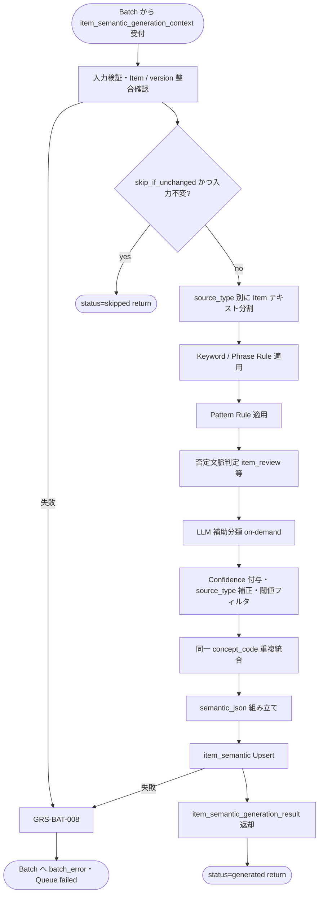

# Item Semantic Generator モジュール仕様書

## 1. ドキュメント情報

| 項目           | 内容                                                     |
| -------------- | -------------------------------------------------------- |
| ドキュメントID | `MOD-RECO-026`                                           |
| ドキュメント名 | Item Semantic Generator モジュール仕様書                 |
| 対象システム   | Gift Recommendation Service（`apps/reco` / `apps/batch`） |
| MVP対象        | `○`                                                      |
| 作成日         | 2026-07-09                                               |
| 更新日         | 2026-07-09（§16.1 Human 決定反映）                       |

---

## 2. 概要

Item Semantic Generator（Item Semantic 抽出）は、**Batch（BATCH-010）** において商品情報（商品名・説明・ジャンル・属性・タグ等）から **Semantic Concept** を抽出し、`item_semantic` テーブルへ Upsert する Reco ドメインモジュールである。実行タイミングは batch だが、Semantic 抽出ロジックは Reco ドメインに近いため **`apps/reco` に実装**し、`apps/batch` から呼び出す構成とする（Recoモジュール一覧 §6.24.1）。

本モジュールは **Item 側 Semantic Concept 抽出** に責務を限定し、Item Feature 生成（`MOD-RECO-027`）・Feature 正規化・Item Embedding 生成・Online 推薦パイプライン実行は行わない。`MOD-RECO-001` Recommendation Orchestrator からの **直接呼び出しはない**（事前生成データを DB 経由で間接参照する）。

---

## 3. 目的

- `apps/reco` における Item Semantic Generator 実装・単体テストの前提を定義する
- Batch（BATCH-010）との I/F（生成コンテキスト入出力）、失敗時の Queue / Batch エラー伝播（`GRS-BAT-008`）を後続実装可能な粒度で整理する
- Recoモジュール一覧・Semantic Concept / Semanticルール定義書・`item_semantic` テーブル定義書・`MOD-RECO-003` Batch 解決コンテキストとの整合を担保する
- `MOD-RECO-001` との関係（Online 推薦では直接呼び出さないこと、事前生成データ参照）を明確化する

---

## 4. モジュール基本情報

| 項目 | 内容 |
| ---- | ---- |
| モジュールID | `MOD-RECO-026` |
| モジュール名 | Item Semantic 抽出 |
| 物理名 | `Item Semantic Generator` |
| 分類 | 商品意味推定支援 |
| 処理種別 | `BT` |
| 配置予定 | `apps/reco/src/reco/application/item-semantic-generator/**` |
| 所属Epic | `MOD-RECO-026`（Epic Issue #1092） |
| MVP対象 | `○` |
| 主な呼び出し元 | BATCH-010（`apps/batch`）、`item_generation_queue` 消化処理 |
| 主な呼び出し先 | Semantic Rule Repository / Semantic Concept Repository / External AI API Client（LLM 補助）、`item_semantic` Repository、`MOD-RECO-003` Config Version Resolver（batch 経由） |

`MOD-API-*` / `MOD-RECO-*` / `MOD-BATCH-*` 配下の Task では、該当モジュール ID の責務範囲に変更を限定する。`MOD-RECO-*` では `apps/reco/src/reco/api/**` の API-INT エンドポイント層を対象に含めない。エンドポイント層の変更が必要な場合は、該当する `API-INT-*` Epic 配下 Task として扱う。

---

## 5. 責務

### 5.1 主責務

- 対象 `item_id` の商品テキスト・メタデータから **Semantic Concept** を抽出する（Semanticルール定義書 §18.2 / §12）
- **source_type**（`item_name` / `item_caption` / `item_description` / `item_genre` / `item_tag` / `item_review` / `item_brand`）ごとに入力を分割し、Rule / LLM を適用する
- 抽出時点の **`semantic_config_version_id`**（`MOD-RECO-003` 解決結果）に紐づく `semantic_rule` / `semantic_concept` を参照する
- 抽出結果に **`concept_code` / `confidence` / `evidence_texts` / `extraction_method` / `source_type` / `input_intent`** を付与する（`item_semantic` §5.3、Semanticルール定義書 §4.1）
- Item 側の `input_intent` は原則 **`neutral`** とする（Semanticルール定義書 §7.1、`item_semantic_テーブル定義書` §5.3）
- **否定文脈**（レビュー等）を判定し、肯定 Concept の誤抽出を抑制する（Semanticルール定義書 §12.7）
- **source_type による confidence 補正**を適用する（Semanticルール定義書 §9.3）
- 同一 `concept_code` の重複を **confidence 最大値で統合**する（Semanticルール定義書 §14.2）
- **`confidence >= 0.60`** を通常採用ラインとする（Semanticルール定義書 §9.4）
- 構造化結果を **`semantic_json`** として組み立て、`item_semantic` テーブルへ **Upsert** する（`item_id` + `semantic_config_version_id` 冪等キー）
- 入力不変かつ既存行ありの場合、Batch 側 skip 方針に従い **生成スキップ**を返却してよい（`item_semantic_テーブル定義書` §5.5、バッチ設計方針書 §14.1）
- 抽出失敗時に **`GRS-BAT-008`** 相当のエラーを Batch 呼び出し元へ返却し、当該 Queue 行を `failed` へ遷移させる

### 5.2 対象外責務

- `API-INT-002` エンドポイント層（HTTP 受付、reco 側防御的 Validation、OpenAPI スキーマ整合）
- `MOD-RECO-001` Recommendation Orchestrator の **実行順序制御**・Online 推薦パイプラインからの **直接呼び出し**
- `item_generation_queue` の **登録**（BATCH-009 / Item Generation Queue Registrar 責務）
- `MOD-RECO-003` Config Version Resolver の **解決ロジック本体**（本モジュールは解決済み version を入力として受け取る。未解決時は Batch 側が `003` を先に呼ぶ）
- **User Semantic 抽出**（`MOD-RECO-004`、処理種別 `OL`）
- **Item Feature 生成**・**Feature 正規化**・**Item Embedding 生成**（`MOD-RECO-027` / `MOD-BATCH-034` / `MOD-BATCH-036`、BATCH-011〜015）
- **feature_input_hash** / **embedding_input_hash** の算出（BATCH-011 / BATCH-014 責務）
- **Hard Filter** 実行・候補分離（User 入力向け。Item 側は Semantic Concept 抽出のみ）
- **Matching / Ranking / Retrieval** 計算
- Batch workflow 定義・GitHub Actions 設定（`apps/batch` / CI Task 責務）
- Phase Log / Error Log の **物理書き込み契機管理**（**Batch Logger**（`apps/batch`）/ Batch Error Handler 経由。本モジュールは結果・エラーを返却。`MOD-RECO-028` は OL 専用のため **使用しない**）
- Public API 向けレスポンス形式への変換（`apps/api` 責務）
- OpenAPI / Orval / generated の変更
- DB schema / DDL の変更

---

## 6. 入出力

### 6.1 入力

| 入力 | 型 / 構造 | 必須 | 生成元 | 用途 | 備考 |
| ---- | --------- | ---- | ------ | ---- | ---- |
| `item_semantic_generation_context` | Batch 生成コンテキスト | `true` | BATCH-010 呼び出し元 | 抽出の起点 | 実装 Task で型定義。Orchestrator の `execution_context` とは別型 |
| `context.trace_id` | `string` | `true` | Batch Run | ログ相関 | secret 不含 |
| `context.batch_run_id` | `uuid` | `true` | Batch Run | phase_log owner 参照 | `owner_type = batch_run` |
| `context.item_generation_queue_id` | `uuid` | `true` | Queue 行 | エラー owner / trace | `item_generation_queue_テーブル定義書` |
| `context.item_id` | `uuid` | `true` | Queue 行 / `item` | 対象商品 | FK 検証対象 |
| `context.semantic_config_version_id` | `uuid` | `true` | `MOD-RECO-003` 解決結果 | Rule / Concept 参照 version | Batch 開始時に固定 |
| `context.item_name` | `string` | `false` | `item` | Semantic 抽出 | source_type=`item_name` |
| `context.item_caption` | `string` | `false` | `item`（catchcopy 等） | Semantic 抽出 | source_type=`item_caption` |
| `context.item_description` | `string` | `false` | `item` | Semantic 抽出（主ソース） | source_type=`item_description` |
| `context.genre_name` | `string` | `false` | `external_genre` 等 | 補助文脈 | source_type=`item_genre` |
| `context.attributes` | `string[]` | `false` | `item` 属性 | 補助 Concept 候補 | source_type=`item_attribute`（内部正規化可） |
| `context.tags` | `string[]` | `false` | `item` タグ | 補助 Concept 候補 | source_type=`item_tag` |
| `context.review_texts` | `string[]` | `false` | レビュー集約 | 補助抽出 | source_type=`item_review`。MVP は Feature 入力に含めないが Semantic 補助可 |
| `context.brand_name` | `string` | `false` | `item` | 補助文脈 | source_type=`item_brand` |
| `context.skip_if_unchanged` | `boolean` | `false` | Batch 方針 | 入力不変時 skip | デフォルト `true`（BATCH-010） |

**入力テキスト全欠損**: 商品名・説明・ジャンル・属性・タグ・レビューがすべて空でも **失敗にしない**。`concepts: []` の `semantic_json` を Upsert してよい（`item_semantic_テーブル定義書` §5.3）。

**Config 解決**: `semantic_config_version_id` 未設定の場合、Batch 呼び出し元が `MOD-RECO-003` に `BatchResolveContext`（`generation_type = semantic`）を渡して解決してから本モジュールを呼ぶ（`MOD-RECO-003` §6.2）。

### 6.2 出力

| 出力 | 型 / 構造 | 利用先 | 用途 | 備考 |
| ---- | --------- | ------ | ---- | ---- |
| `item_semantic_generation_result` | ドメインオブジェクト | Batch 呼び出し元 | 生成結果の正本（当該 Item 処理内メモリ） | 実装 Task で型定義 |
| `item_semantic_generation_result.semantic_json` | JSON オブジェクト | `item_semantic.semantic_json` | Concept 配列の正本 | §5.3 スキーマ |
| `item_semantic_generation_result.semantic_json.concepts[]` | Concept 配列 | BATCH-011 以降、reco OL（SELECT） | 各 Concept の code / confidence 等 | Public 非公開 |
| `item_semantic_generation_result.item_semantic_id` | `uuid` | ログ・下位 Batch | 永続化行 ID | Upsert 成功後 |
| `item_semantic_generation_result.status` | `generated` \| `skipped` \| `failed` | Batch / Queue 更新 | 当該 Item の処理結果 | skip は Queue `skipped` 可 |
| `item_semantic_generation_result.skip_reason` | `string` | Batch Logger | skip 監査 | 入力不変等 |
| `batch_error` | 標準化 batch / reco エラー | Batch Error Handler | 抽出失敗時 | 表面 `GRS-BAT-008`。内部 `GRS-LLM-*` / `GRS-CFG-*` |

**`semantic_json` と DB の関係**: メモリ上の `semantic_json` は `item_semantic.semantic_json` と **同内容**とする。Public API には公開しない（`item_semantic_テーブル定義書` §5.3）。

---

## 7. 依存関係

### 7.1 依存モジュール

| 依存先 | 方向 | 用途 | 失敗時の扱い | 備考 |
| ------ | ---- | ---- | ------------ | ---- |
| BATCH-010 呼び出し元（`apps/batch`） | 被呼び出し | Queue 行単位の Semantic 生成契機 | — | Reco ライブラリとして呼び出し |
| `MOD-RECO-003` Config Version Resolver | 間接依存（Batch 側が先に呼ぶ） | `semantic_config_version_id` の前提 | `003` 失敗時は本モジュール未到達 | `BatchResolveContext` |
| External AI API Client | 呼び出し | LLM 補助分類 | `GRS-LLM-*` → `GRS-BAT-008` | server 側のみ。機能×モジュール対応表 |
| Batch Error Handler | 間接連携 | 例外の標準化 | Queue `failed` | `apps/batch` 側 |
| Batch Logger（`apps/batch`） | 間接連携 | BATCH-010 Run 単位の `phase_log` 記録 | 記録失敗は当該 Item 結果に影響させない方針 | `owner_type = batch_run`。`MOD-RECO-028`（OL Orchestrator 専用）は **経由しない** |

**下位利用モジュール（本モジュール出力の利用先）**

| モジュール / Batch | 利用する出力 |
| ------------------ | ------------ |
| BATCH-011 Feature 入力 hash 算出 | `item_semantic` SELECT（`semantic_json`） |
| BATCH-012 Item Feature 生成（`MOD-RECO-027`） | `item_semantic` |
| reco OL（`MOD-RECO-012` / `013` / `014` 等） | `item_semantic` SELECT（事前生成データ） |
| `MOD-RECO-001` Orchestrator | **直接利用なし**（DB 上の `item_feature` / `item_embedding` を間接参照） |

### 7.2 参照データ

| データ | 参照元 | 用途 | version / config | 備考 |
| ------ | ------ | ---- | ---------------- | ---- |
| `semantic_config_version` | DB | 解決済み version の検証 | `context.semantic_config_version_id` | 読み取りのみ |
| `semantic_concept` | DB | 有効 Concept カタログ | 当該 `semantic_config_version_id` | `is_active = true` のみ出力 |
| `semantic_rule` | DB | keyword / phrase / pattern ルール | 同上 | Item 向け Rule |
| `item` | DB | 商品マスタ存在確認 | — | INSERT / Upsert 前に SELECT 検証 |
| `item_semantic` | DB | skip 判定・Upsert 先 | `item_id` + `semantic_config_version_id` | UNIQUE キー |
| `item_generation_queue` | DB | 処理対象確認 | Queue 行 | 本モジュールは status 更新を **返却**し Batch 側が DML |

---

## 8. 処理仕様

### 8.1 処理フロー



### 8.2 処理ステップ

| No | 処理 | 入力 | 出力 | 補足 |
| --: | ---- | ---- | ---- | ---- |
| 1 | 入力検証 | `item_semantic_generation_context` | — | `item_id` / `semantic_config_version_id` / `trace_id` 必須 |
| 2 | Item 整合確認 | `item_id` | — | Item 存在、`semantic_config_version_id` が DB 上 valid |
| 3 | skip 判定 | 現行入力 vs 既存 `item_semantic` | `skipped` または継続 | 入力 hash / 正規化比較は実装 Task で確定。方針は §8.3.6 |
| 4 | source_type 分割 | Item 各フィールド | 正規化テキスト集合 | Semanticルール定義書 §3.2 |
| 5 | Rule ベース抽出 | テキスト + `semantic_rule` | Concept 候補 | keyword → phrase → pattern 順 |
| 6 | 否定文脈判定 | `item_review` 等 | 候補の polarity 調整 | §8.3.3。肯定 Concept 誤抽出抑制 |
| 7 | LLM 補助分類（on-demand） | §8.3.4 条件を満たす場合のみ | 追加 Concept 候補 | **1 Item あたり最大 1 回** |
| 8 | Confidence 付与・補正 | 候補 Concept | 採用 Concept 集合 | source_type 補正 + `>= 0.60`（§8.3.2） |
| 9 | 重複統合 | 採用 Concept | 統合後 Concept 集合 | 同一 `concept_code` は confidence 最大 |
| 10 | JSON 組み立て | 統合 Concept | `semantic_json` | `item_semantic` §5.3 スキーマ |
| 11 | 永続化 | `item_id` + version + JSON | `item_semantic` 行 | Upsert（UNIQUE キー） |
| 12 | 結果返却 | 永続化結果 | `item_semantic_generation_result` | Batch が Queue status を更新 |

**Batch 呼び出し順序（正本: バッチ処理一覧 BATCH-009〜011）**

```text
BATCH-009: Queue 登録
    ↓
BATCH-010: Config 解決（MOD-RECO-003）→ Item Semantic Generator（本モジュール）→ item_semantic Upsert
    ↓
BATCH-011: feature_input_hash 算出（item_semantic 参照）
```

### 8.3 アルゴリズム / 計算仕様

Semanticルール定義書 §18.2（Item 情報抽出フロー）および §12（Item 情報向け Semantic ルール）に従う。

| 項目 | 内容 |
| ---- | ---- |
| Rule 優先順 | keyword / phrase / pattern ルールを先に適用し、不足分を **LLM on-demand** で補完（§8.3.4） |
| MVP 実装方式 | `semantic_rule`（DB）+ seed 投入 + **LLM 補助（条件付き）**。`extraction_method` デフォルトは `hybrid` |
| Concept 有効性 | 当該 `semantic_config_version_id` かつ `semantic_concept.is_active = true` のみ出力 |
| 否定文脈 | レビュー等で「安っぽい」等の否定表現から肯定 Concept をそのまま抽出しない（§12.7） |
| 0 件 Concept | 閾値以上 0 件でも成功。`concepts: []` で Upsert |
| User 入力との差分 | `preferred` / `avoid` / `ng_condition` / Hard Filter 分離は **User 側（MOD-RECO-004）** のみ。Item 側は `input_intent = neutral` が原則 |

#### 8.3.1 source_type ごとの扱い

| source_type | 入力フィールド | 抽出方針 | 備考 |
| ----------- | -------------- | -------- | ---- |
| `item_name` | `item_name` | 明示キーワードがある場合のみ | 短文。§12.1 |
| `item_caption` | `item_caption` | 有用だが confidence 控えめ | 販促表現含む。§12.2 |
| `item_description` | `item_description` | **主要ソース** | §12.3 |
| `item_genre` | `genre_name` | 補助的 | 粒度粗。§12.4 |
| `item_tag` | `tags[]` | 有用だがノイズ注意 | §12.5 |
| `item_review` | `review_texts[]` | 否定文脈に注意 | §12.6 / §12.7 |
| `item_brand` | `brand_name` | 補助的 | §3.2 |
| `item_price` | — | **原則対象外** | Hard Filter / 表示用。Semantic 対象外 |

#### 8.3.2 Confidence 閾値

| confidence | 扱い |
| ---------- | ---- |
| `>= 0.80` | 高信頼採用 |
| `0.60〜0.79` | 通常採用 |
| `< 0.60` | 原則除外（監査ログに残してよい） |

正本: Semanticルール定義書 §9.4。source_type 補正（§9.3）適用後に判定する。

**source_type 補正（抜粋）**

| source_type | confidence 補正 | 理由 |
| ----------- | --------------- | ---- |
| `item_description` | `0.00`（基準） | 主要ソース |
| `item_caption` | `0.00`（基準、ただし上限控えめ運用可） | 販促含む |
| `item_name` | `-0.05` | 短文で曖昧 |
| `item_review` | 文脈依存 | 否定時は採用抑制 |

#### 8.3.3 否定文脈（item_review）

| 入力例 | 扱い |
| ------ | ---- |
| 「高級感があってよかった」 | `prestigious_quality` 等を asserted で抽出可 |
| 「思ったより安っぽい」 | 肯定 Concept としては **抽出しない** |
| 「無難すぎる」 | `not_too_safe` 等の tone Concept を検討。過剰抽出に注意 |

正本: Semanticルール定義書 §12.7。`assertion_polarity` は `asserted` / `negated` / `uncertain` を付与する。

#### 8.3.4 LLM 呼び出し境界（MVP 方針）

Semanticルール定義書 §6.2 / §13.1 に従い、MVP では **Rule-first + LLM-on-demand** とする。LLM は必須ではなく、**1 Item（1 Queue 行）あたり最大 1 回**にまとめる。

**LLM を呼び出す条件（いずれか）**

1. `item_description` / `item_caption` が非空で、Rule 抽出後に `confidence >= 0.60` の Concept が **0 件**
2. Rule ヒットはあるが最大 confidence が **`0.40〜0.59`**（弱採用帯）で、説明文が長文・曖昧
3. `item_name` のみで Rule 未ヒットかつ商品名が自然文に近い

**LLM を呼び出さない条件**

- keyword / phrase で採用 Concept が十分（例: 2 件以上、または max confidence `>= 0.80`）
- 入力が tags / genre のみで Rule 完結
- 全テキスト空（`concepts: []` で成功）

**実装制約**

- 複数 source_type の曖昧分は **1 プロンプトに統合**（Semanticルール定義書 §13.2 形式）
- LLM 失敗時は **`GRS-LLM-*`** を返し、Batch 側で **`GRS-BAT-008`** として Queue `failed`（本モジュール内リトライなし。§10.2）
- LLM 出力は Concept 候補 + confidence + evidence_text に限定（Feature 値は出力しない）

#### 8.3.5 Batch Port 契約（概要）

| 方向 | 契約 |
| ---- | ---- |
| 呼び出し | `generate_item_semantic(context) -> ItemSemanticGenerationResult`（メソッド名は実装 Task で確定） |
| 成功 | `status = generated` または `skipped`。`semantic_json` / `item_semantic_id` が設定される |
| 失敗 | 例外または `batch_error`（表面 `GRS-BAT-008`）。当該 Queue 行は **failed**（Batch 側が更新） |
| Phase Log | **Batch Logger** が BATCH-010 Run 単位で `item_semantic_generated`（`batch_run_phase_name`）を `phase_log` へ記録（`owner_type = batch_run` / `owner_id = batch_run_id`）。`MOD-RECO-028` Phase Log Writer（OL 専用）は **使用しない**（§16.1 No.4） |
| 配置 | reco 側は **application 層 Port + 実装**。batch 側は DI で reco モジュールを注入 |

#### 8.3.6 skip 判定（入力不変）

| 観点 | 方針 |
| ---- | ---- |
| トリガ | `skip_if_unchanged = true` かつ同一 `item_id` + `semantic_config_version_id` の既存行あり |
| 比較対象 | **`semantic_input_hash`**（BATCH-010 専用。§16.1 No.2）。入力: `item_id`, `item_name`, `item_caption`, `item_description`, `genre_name`, `attributes[]`, `tags[]`, `semantic_config_version_id`（正規化後 hash）。`item_review` は hash 対象外 |
| 結果 | 不変なら `status = skipped`。Queue は `skipped` 可（`item_semantic_テーブル定義書` §5.5） |
| 再生成 | 入力変更・version 変更・既存行なし・failed 再実行時は生成する |

正本: バッチ設計方針書 §14.1 / §17.3。`semantic_input_hash` は `feature_input_hash`（BATCH-011）と **別算出・別保持**（§16.1 No.2）。

#### 8.3.7 MOD-RECO-001（Orchestrator）との関係

| 観点 | 方針 |
| ---- | ---- |
| 直接呼び出し | **なし**（MOD-RECO-001 §19、`Recoモジュール一覧` §6.24.1） |
| Online 推薦 | Orchestrator / Retrieval / Matching は **事前生成済み** `item_feature` / `item_embedding` を参照。`item_semantic` は batch 更新・reco **SELECT のみ** |
| 失敗影響 | Batch 失敗は当該 Item の意味データ欠落。Online Run 自体は中断しない（候補不足・品質低下として扱う） |
| ExecutionContext | Orchestrator の `execution_context` Port 契約は **適用外**。Batch 専用の `item_semantic_generation_context` を使用 |

---

## 9. データ項目マッピング

| 入力項目 | 内部項目 | 出力項目 | 変換内容 | 備考 |
| -------- | -------- | -------- | -------- | ---- |
| `item_name` | `inputs[].source_type=item_name` | `concepts[].source_type=item_name` | Rule / LLM 抽出 | confidence 補正 -0.05 |
| `item_caption` | `inputs[].source_type=item_caption` | `concepts[]` | 同上 | 販促文注意 |
| `item_description` | `inputs[].source_type=item_description` | `concepts[]` | 同上 | 主ソース |
| `genre_name` | `inputs[].source_type=item_genre` | `concepts[]` | 補助抽出 | |
| `tags[]` | `inputs[].source_type=item_tag` | `concepts[]` | 同上 | |
| `review_texts[]` | `inputs[].source_type=item_review` | `concepts[]` | 否定文脈判定後抽出 | |
| `semantic_config_version_id` | `version_id` | `item_semantic.semantic_config_version_id` | 列で保持（JSON 外） | Upsert キー一部 |
| `item_id` | `target_id` | `item_semantic.item_id` | FK | Upsert キー一部 |
| 統合 Concept 集合 | `semantic_json` | `item_semantic.semantic_json` | 同内容 | メモリ ↔ DB |
| — | `item_semantic_id` | `result.item_semantic_id` | Upsert 後 UUID | |

**`semantic_json` スキーマ正本**: `item_semantic_テーブル定義書` §5.3。

---

## 10. 状態・例外

### 10.1 状態

本モジュールは Queue 行（Item）単位の **1 回生成・Upsert** 処理とする。モジュール内部に長寿命状態は持たない。

| 状態（結果） | 意味 | 遷移条件 | 記録先 |
| ------------ | ---- | -------- | ------ |
| `generated` | Semantic 生成成功 | Upsert 成功 | `item_semantic` / Queue `completed`（Batch 側） |
| `skipped` | 入力不変等で生成省略 | skip 判定 true | Queue `skipped`（Batch 側） |
| `failed` | 回復不能エラー | §10.2 | Queue `failed` / `error_log` |

`item_generation_queue.queue_status` の DML は **Batch 呼び出し元**が本モジュールの返却結果に基づき実行する。

### 10.2 例外

| 例外 | Error Code | 発生条件 | 呼び出し元への返却 | ログ |
| ---- | ---------- | -------- | ------------------ | ---- |
| Item Semantic 生成失敗 | `GRS-BAT-008` | Rule / LLM / DB Upsert 等の回復不能エラー | Batch 失敗。Queue `failed` | Error Log + Phase failed |
| Config 不整合 | `GRS-BAT-008`（内部 `GRS-CFG-*`） | `semantic_config_version_id` 未存在・無効 | 同上 | 同上 |
| Item 不整合 | `GRS-BAT-008` | `item_id` 未存在 | 同上 | 同上 |
| LLM / 外部 API 失敗 | `GRS-BAT-008`（内部 `GRS-LLM-100`〜`104`） | External AI API Client タイムアウト・5xx 等 | 同上 | secret マスキング |
| 入力検証失敗 | `GRS-BAT-008` | 必須 context 欠落 | 同上 | 同上 |
| 0 件 Concept | —（成功） | 閾値以上 Concept 0 件 | `generated`。Queue 完了 | concept_count=0 |

Error Code の正本はエラーコード定義書。Batch 側 Error Handler が表面コードを `batch_run_log` / 呼び出し元へ伝播する。

**リトライ**: 本モジュール内の自動リトライは MVP では **行わない**。LLM 失敗は即 `GRS-BAT-008`。Batch の `retry-failed` workflow で Queue 再実行する（バッチ処理一覧 BATCH-010）。

**Orchestrator との対比**: Online 推薦の Semantic 失敗（`GRS-REC-004`）はパイプライン中断。本モジュール（BT）の失敗は **Item 単位**で Queue / Batch ログに記録し、他 Item の BATCH-010 処理は継続してよい（部分失敗は `GRS-BAT-002` 候補。Batch 全体方針は Batch Task 参照）。

---

## 11. DB / 永続化

| テーブル | 操作 | 主な項目 | トランザクション | 備考 |
| -------- | ---- | -------- | ---------------- | ---- |
| `item_semantic` | UPSERT | `item_id`, `semantic_config_version_id`, `semantic_json`, `generated_at` | Item 単位。Batch トランザクション境界は実装 Task で確定 | UNIQUE `(item_id, semantic_config_version_id)` |
| `semantic_rule` | SELECT | ルール定義 | 読み取りのみ | |
| `semantic_concept` | SELECT | Concept カタログ | 読み取りのみ | |
| `item` | SELECT | Item 存在 | 読み取りのみ | Upsert 前検証 |

**永続化ポリシー**

| 観点 | 方針 |
| ---- | ---- |
| 保存単位 | **1 商品 × 1 意味定義 version あたり 1 行**（UNIQUE キー） |
| Upsert | 同一 version 内再生成は **上書き** |
| 履歴 | 異なる `semantic_config_version_id` は **別行として保持** |
| reco OL | **SELECT のみ**（INSERT / UPDATE / DELETE 禁止） |
| api | 直接 DML **禁止**（MVP） |

正本: `item_semantic_テーブル定義書` §5.2 / §7 / §12。

---

## 12. ログ・メトリクス

| 種別 | 内容 | 出力タイミング | 保存先 | 備考 |
| ---- | ---- | -------------- | ------ | ---- |
| Phase Log 依頼 | BATCH-010 Run フェーズ（`started` / `succeeded` / `failed`） | BATCH-010 開始 / 完了 / 失敗 | `phase_log`（**Batch Logger** 経由） | `owner_type = batch_run`。Item 単位の成否は Queue / 構造化ログで追跡（`phase_log` 行は Run 単位） |
| 構造化ログ | Item 単位抽出サマリ（concept_count, rule_hit_count, llm_used, duration_ms, item_id, status） | Item 処理完了時 | アプリログ | `trace_id` 必須。入力全文・API キーは出力しない |
| Error Log 依頼 | `GRS-BAT-008` / `GRS-LLM-*` 詳細 | 失敗時 | `error_log` | Batch Error Handler 経由 |
| Batch Run Log | 処理件数・失敗件数 | Batch 完了時 | `batch_run_log` | Batch 側集計 |

### 12.1 メトリクス

| Metric | 内容 | 集計単位 | 用途 |
| ------ | ---- | -------- | ---- |
| `item_semantic_generation_latency_ms` | Item Semantic 生成処理時間 | Item / Batch Run | ボトルネック分析 |
| `item_semantic_concept_count` | 採用 Concept 件数 | Item | 品質・空抽出監視 |
| `item_semantic_llm_call_count` | LLM 呼び出し回数 | Item / Batch Run | コスト監視 |
| `item_semantic_rule_hit_count` | Rule ヒット件数 | Item | Rule カバレッジ |
| `item_semantic_skipped_count` | skip 件数 | Batch Run | 再生成抑制効果 |

---

## 13. 性能・非機能

### 13.1 方針概要

| 観点 | 方針 |
| ---- | ---- |
| レイテンシ | Batch 処理のため Online SLO（4,000ms）の対象外。Item 単位の処理時間目標は PoC / Batch 性能 Task で確定 |
| 計算量 | 入力テキスト長 × Rule 数 + LLM **最大 1 回 / Item**（on-demand 時のみ） |
| タイムアウト | External AI API Client の timeout に従う。超過時 `GRS-LLM-101` → `GRS-BAT-008` |
| リトライ | モジュール内自動リトライ **なし**（§10.2） |
| キャッシュ | 同一 Batch Run 内で `semantic_rule` / `semantic_concept` のメモリキャッシュ可 |
| 並列実行 | 同一 `item_id` + `semantic_config_version_id` の **二重 processing 禁止**（バッチ設計方針書 §18.1）。Batch 側 concurrency で制御 |
| レート制限 | External AI API Rate Limiter（Batch 共通）に従う |

### 13.2 タイムアウト（MVP）

| 種別 | 対象 | MVP 値 | 超過時の扱い |
| ---- | ---- | ------ | ------------ |
| hard | 本モジュール単体 | **なし**（§16.1 No.1） | — |
| 依存 | External AI API Client | Client 設定に従う | `GRS-LLM-101` → `GRS-BAT-008` |

**PoC 連携**: Item 単位 soft / hard の **数値**は PoC（`docs/90_PoC/性能フィジビリティ/`）実測後に §13.2 へ追記する。MVP 初版は **モジュール単体 hard なし**（§16.1 No.1）。

---

## 14. テスト観点

| No | 観点 | 確認内容 | 種別 |
| --: | ---- | -------- | ---- |
| 1 | 正常系（item_description） | 商品説明から Concept が抽出されること | unit |
| 2 | 正常系（item_name） | 商品名から明示キーワード Concept が抽出されること | unit |
| 3 | 正常系（genre / tag） | ジャンル・タグから補助 Concept が抽出されること | unit |
| 4 | 境界値（入力全空） | 全テキスト空でも `concepts: []` で Upsert 成功すること | unit |
| 5 | 境界値（0 件 Concept） | 閾値未満のみの場合 `concepts: []` となること | unit |
| 6 | 境界値（confidence 閾値） | `0.59` 除外、`0.60` 採用されること | unit |
| 7 | 重複統合 | 同一 `concept_code` が confidence 最大で 1 件に統合されること | unit |
| 8 | 否定レビュー | 否定レビューから肯定 Concept が誤抽出されないこと | unit |
| 9 | source_type 補正 | `item_name` で confidence 補正が適用されること | unit |
| 10 | input_intent | Item 側 Concept が原則 `neutral` であること | unit |
| 11 | version 整合 | 出力 `semantic_config_version_id` が入力 / DB 行と一致すること | unit |
| 12 | skip | 入力不変かつ既存行ありで `status=skipped` となること | unit |
| 13 | 例外系（Item 不整合） | 存在しない `item_id` で `GRS-BAT-008` となること | unit |
| 14 | 例外系（LLM 失敗） | External AI API 失敗で `GRS-BAT-008` となり Upsert されないこと | unit / integration |
| 15 | DB 永続化 | Upsert 後 `semantic_json` が §5.3 スキーマを満たすこと | integration |
| 16 | Batch 連携 | BATCH-010 が成功後に BATCH-011 が `item_semantic` を参照できること | integration |
| 17 | ログ | `trace_id` が構造化ログに含まれ、入力全文・secret が含まれないこと | unit |
| 18 | LLM on-demand（スキップ） | Rule で十分な Concept が取れた場合に LLM が呼ばれないこと | unit |
| 19 | LLM on-demand（呼び出し） | 説明文ありかつ Rule 0 件時に LLM が 1 回だけ呼ばれること | unit |
| 20 | Orchestrator 非連携 | 本モジュールが `MOD-RECO-001` から import / 直接呼び出しされないこと | architecture |
| 21 | Upsert 冪等 | 同一 `item_id` + version で再実行時に行が 1 件に保たれること | integration |

---

## 15. 変更管理

### 15.1 変更履歴

| 日付 | 変更内容 | 関連Issue / PR |
| ---- | -------- | -------------- |
| 2026-07-09 | 初版作成 | Issue #1093 |
| 2026-07-09 | Phase Log 経路（Batch Logger / 028 非使用）整理、§16.2 推奨案追加 | Issue #1093 |
| 2026-07-09 | §16.1 Human 決定反映（timeout / semantic_input_hash / item_review / phase_log） | Issue #1093 |

---

## 16. 未決事項

| No | 論点 | 判断が必要な理由 | 判断者 | 期限 | 備考 |
| --: | ---- | ---------------- | ------ | ---- | ---- |
| 1 | 本モジュール単体 soft / hard timeout **数値** | PoC / Batch 実測前のため数値未確定 | Human | PoC 完了後 | §13.2。方針（MVP hard なし）は §16.1 No.1 で確定済み |

### 16.1 確定済み論点（Issue #1093 Human 判断）

| No | 論点 | 確定内容 |
| --: | ---- | -------- |
| 1 | 本モジュール単体 timeout（MVP 方針） | **MVP 初版はモジュール単体 hard を設けない**。LLM 呼び出し時は External AI API Client の timeout に従い、超過時 `GRS-LLM-101` → `GRS-BAT-008`。Batch workflow 全体の上限は Batch CI / 運用 Task で別管理。§13.2 |
| 2 | Semantic 入力 skip 用 hash | **`semantic_input_hash` を BATCH-010 専用で新設**し、`feature_input_hash`（BATCH-011）とは **別算出・別保持**。入力: `item_id`, `item_name`, `item_caption`, `item_description`, `genre_name`, `attributes[]`, `tags[]`, `semantic_config_version_id`。`item_review` は hash 対象外。§8.3.6 |
| 3 | `item_review` を Semantic 入力に含めるか | **MVP は含めてよい（任意入力）**。`review_texts` 非空時のみ Rule / LLM 補助。`source_type = item_review` + §9.3 補正 + §12.7 否定文脈を必須。Feature 入力（BATCH-011）と skip hash からは除外 |
| 4 | Phase Log の `phase_name` と Writer 経路 | **`batch_run_phase_name` に `item_semantic_generated` を追加**。Writer は **`apps/batch` Batch Logger**（`MOD-RECO-028` は **使用しない**）。記録粒度は BATCH-010 Run 単位。Item 単位成否は Queue + 構造化ログ |

---

## 17. 関連資料

| 種別 | パス / URL | 用途 |
| ---- | ---------- | ---- |
| Recoモジュール一覧 | `docs/05_アプリケーション設計/アプリ/reco/Recoモジュール一覧.md` | モジュール定義・§6.24.1 |
| モジュール一覧 | `docs/05_アプリケーション設計/アプリ/モジュール一覧.md` | 全体配置 |
| 機能×モジュール対応表 | `docs/05_アプリケーション設計/アプリ/機能×モジュール対応表.md` | BATCH-010 入出力 |
| バッチ処理一覧 | `docs/05_アプリケーション設計/アプリ/batch/バッチ処理一覧.md` | BATCH-010 定義 |
| バッチ設計方針書 | `docs/05_アプリケーション設計/アプリ/batch/バッチ設計方針書.md` | §13.2 Item Semantic 生成 |
| Semantic Concept定義書 | `docs/04_ドメインモデル設計/SemanticConcept定義書.md` | Concept 定義 |
| Semanticルール定義書 | `docs/04_ドメインモデル設計/Semanticルール定義書.md` | §18.2 Item 抽出フロー |
| item_semantic テーブル定義書 | `docs/06_実装設計/database/item_semantic_テーブル定義書.md` | 永続化・JSON スキーマ |
| semantic_rule テーブル定義書 | `docs/06_実装設計/database/semantic_rule_テーブル定義書.md` | Rule 参照 |
| エラーコード定義書 | `docs/05_アプリケーション設計/アプリ/エラーコード定義書.md` | `GRS-BAT-008` / `GRS-LLM-*` |
| ログ・Observability設計書 | `docs/05_アプリケーション設計/アプリ/ログ・Observability設計書.md` | Phase / Batch Log |
| MOD-RECO-001 仕様書 | `docs/06_実装設計/reco/MOD-RECO-001_Recommendation Orchestratorモジュール仕様書.md` | 非直接呼び出し・§19 |
| MOD-RECO-003 仕様書 | `docs/06_実装設計/reco/MOD-RECO-003_Config Version Resolverモジュール仕様書.md` | BatchResolveContext |
| MOD-RECO-004 仕様書 | `docs/06_実装設計/reco/MOD-RECO-004_User Semantic Extractorモジュール仕様書.md` | User 側対称モジュール（OL） |
| MOD-RECO-028 仕様書 | `docs/06_実装設計/reco/MOD-RECO-028_Phase Log Writerモジュール仕様書.md` | OL 専用 Phase Log Writer（BT では **使用しない** 境界の正本） |
| phase_log テーブル定義書 | `docs/06_実装設計/database/phase_log_テーブル定義書.md` | `batch_run_phase_name` enum |
| module-spec テンプレート | `prompts/templates/docs/module-spec.md` | 章構成 |
| Epic Definition | `prompts/definitions/epics/mod-reco-026-item-semantic-generator/epic.yaml` | allowed_paths |

---

## 18. レビュー観点

- Recoモジュール一覧 §6.24.1 のモジュール名・物理名・分類・処理種別・MVP 対象と一致している
- モジュール一覧の `MOD-RECO-026` 行と整合している
- `MOD-RECO-001` から **直接呼び出されない**こと、Online 推薦は事前生成データ参照であることが明確である
- Batch（BATCH-010）との I/F（`item_semantic_generation_context` 入出力・`GRS-BAT-008` 失敗時 Queue failed）が明確である
- `apps/reco/src/reco/api/**`（API-INT エンドポイント層）の変更を本仕様書の実装範囲に含めていない
- `item_semantic_テーブル定義書` §5.3 の JSON スキーマと整合している
- Item Feature 生成（`MOD-RECO-027`）・Feature hash（BATCH-011）の責務が混入していない
- User Semantic 抽出（`MOD-RECO-004`）の Hard Filter / preferred-avoid 責務が混入していない
- LLM on-demand 境界（§8.3.4）と Item 単位 LLM 上限（1 回）が明記されている
- Phase Log は **Batch Logger** + `owner_type = batch_run` + `item_semantic_generated` で記録し、`MOD-RECO-028`（OL 専用）を BT 経路に混在させていない（§16.1 No.4）
- secret や `.env` 実値が含まれていない

---

## 19. 備考

- 本仕様書は `MOD-RECO-026` の **Item Semantic Concept 抽出** 責務に限定する
- 実装は `apps/reco`、起動は `apps/batch`（BATCH-010）が担う。API-INT エンドポイント層は `[Epic]API-INT-002` 配下とする
- User 側の対称モジュールは `MOD-RECO-004` User Semantic Extractor（処理種別 `OL`）である。抽出フローは Semanticルール定義書 §18.1 / §18.2 を参照
- Orchestrator Port 契約（`execution_context`）は Online 推薦用であり、本 BT モジュールには **別コンテキスト**を適用する（§8.3.7）
- `phase_log` テーブルは OL / BT 共通だが、BT の物理 INSERT は **Batch Logger**（`apps/batch`）が担い、`MOD-RECO-028` Phase Log Writer（Orchestrator 直呼び・OL 専用）とは経路を分ける（§16.1 No.4）
- `batch_run_phase_name` への `item_semantic_generated` 追加は Batch / enum Task で実施（§16.1 No.4）。本 Epic scope 外
