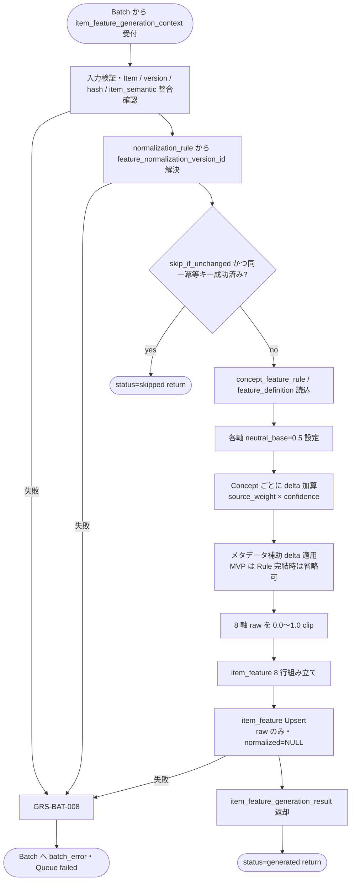

# Item Feature Generator モジュール仕様書

## 1. ドキュメント情報

| 項目           | 内容                                                     |
| -------------- | -------------------------------------------------------- |
| ドキュメントID | `MOD-RECO-027`                                           |
| ドキュメント名 | Item Feature Generator モジュール仕様書                  |
| 対象システム   | Gift Recommendation Service（`apps/reco` / `apps/batch`） |
| MVP対象        | `○`                                                      |
| 作成日         | 2026-07-09                                               |
| 更新日         | 2026-07-09                                               |

---

## 2. 概要

Item Feature Generator（Item Feature 生成）は、**Batch（BATCH-012）** において `item_semantic` および商品メタデータから MVP **8 次元 Feature の raw 値**（`raw_feature_value`）を生成し、`item_feature` テーブルへ Upsert する Reco ドメインモジュールである。実行タイミングは batch だが、Feature 生成ロジックは Reco ドメインに近いため **`apps/reco` に実装**し、`apps/batch` から呼び出す構成とする（Recoモジュール一覧 §6.24.2）。

本モジュールは **Item 側 Feature raw 生成・永続化** に責務を限定し、Feature 入力 hash 算出（BATCH-011）・Feature 正規化（BATCH-013 / `MOD-BATCH-034`）・Item Meaning 射影・Item Embedding 生成・Online 推薦パイプライン実行は行わない。`MOD-RECO-001` Recommendation Orchestrator からの **直接呼び出しはない**（事前生成データを DB 経由で間接参照する）。

---

## 3. 目的

- `apps/reco` における Item Feature Generator 実装・単体テストの前提を定義する
- Batch（BATCH-012）との I/F（生成コンテキスト入出力）、失敗時の Queue / Batch エラー伝播（`GRS-BAT-008`）を後続実装可能な粒度で整理する
- Recoモジュール一覧・Feature定義書・Featureルール定義書・`item_feature` テーブル定義書・`MOD-RECO-003` Batch 解決コンテキストとの整合を担保する
- `MOD-RECO-001` との関係（Online 推薦では直接呼び出さないこと、事前生成 `item_feature` 参照、欠落時影響）を明確化する

---

## 4. モジュール基本情報

| 項目 | 内容 |
| ---- | ---- |
| モジュールID | `MOD-RECO-027` |
| モジュール名 | Item Feature 生成 |
| 物理名 | `Item Feature Generator` |
| 分類 | 商品意味推定支援 |
| 処理種別 | `BT` |
| 配置予定 | `apps/reco/src/reco/application/item-feature-generator/**` |
| 所属Epic | `MOD-RECO-027`（Epic Issue #1104） |
| MVP対象 | `○` |
| 主な呼び出し元 | BATCH-012（`apps/batch`）、`item_generation_queue` 消化処理（`generation_type = feature`） |
| 主な呼び出し先 | Feature Rule Repository（`concept_feature_rule` 等）/ `item_semantic` Repository / `item_feature` Repository、`MOD-RECO-003` Config Version Resolver（batch 経由） |

`MOD-API-*` / `MOD-RECO-*` / `MOD-BATCH-*` 配下の Task では、該当モジュール ID の責務範囲に変更を限定する。`MOD-RECO-*` では `apps/reco/src/reco/api/**` の API-INT エンドポイント層を対象に含めない。エンドポイント層の変更が必要な場合は、該当する `API-INT-*` Epic 配下 Task として扱う。

---

## 5. 責務

### 5.1 主責務

- 対象 `item_id` の **`item_semantic.semantic_json.concepts[]`** および商品メタデータを、Featureルール定義書 §13（Item Feature Rule）に従い **8 軸 `item_feature_raw`** へ変換する
- 生成時点の **`semantic_config_version_id`**（`MOD-RECO-003` 解決結果）に紐づく **`concept_feature_rule`** / **`feature_definition`** を参照する
- MVP 統合式の起点 **`neutral_base = 0.5`** を各軸に適用し、Concept 由来 Delta を **`Σ(concept_feature_delta × source_weight × confidence)`** で加算する（Featureルール定義書 §13.3）
- **`source_type`**（`item_name` / `item_caption` / `item_description` / `item_genre` / `item_tag` / `item_brand` 等）に応じた **source_weight** を Featureルール定義書 §13.2 に従い適用する
- **`feature_input_hash`**（BATCH-011 算出結果）を行に記録し、冪等キー（`item_id` + `semantic_config_version_id` + `feature_code` + `feature_input_hash` + `feature_normalization_version_id`）を満たす **8 行 Upsert** を行う
- **`feature_normalization_version_id`** を `normalization_rule` binding から解決し、行へ記録する（正規化本体は BATCH-013 だが、冪等キー構成要素として BATCH-012 時点で確定・記録する。`item_feature_テーブル定義書` §5.3 / §12.1）
- 算出した raw 値を **`0.0〜1.0` に clip** したうえで `item_feature.raw_feature_value` へ保存する（`item_feature_テーブル定義書` §10 `chk_item_feature_raw_range`）
- **`normalized_feature_value` は MVP では NULL のまま** とし、更新は BATCH-013（`MOD-BATCH-034` Feature Normalizer）責務とする
- 入力不変かつ同一冪等キーで成功済み行がある場合、Batch 側 skip 方針に従い **生成スキップ**を返却してよい（バッチ処理一覧 §6.2）
- 生成失敗時に **`GRS-BAT-008`** 相当のエラーを Batch 呼び出し元へ返却し、当該 Queue 行を `failed` へ遷移させる

### 5.2 対象外責務

- `API-INT-002` エンドポイント層（HTTP 受付、reco 側防御的 Validation、OpenAPI スキーマ整合）
- `MOD-RECO-001` Recommendation Orchestrator の **実行順序制御**・Online 推薦パイプラインからの **直接呼び出し**
- `item_generation_queue` の **登録**（BATCH-009 / Item Generation Queue Registrar 責務）
- **`feature_input_hash` / `feature_input_payload` の算出**（BATCH-011 / Feature Input Hash Calculator 責務）
- **`MOD-RECO-026` Item Semantic Generator** の Semantic Concept 抽出ロジック（本モジュールは **`item_semantic` を入力として消費**するのみ）
- **`MOD-RECO-003` Config Version Resolver** の **解決ロジック本体**（本モジュールは解決済み version を入力として受け取る。未解決時は Batch 側が `003` を先に呼ぶ）
- **Feature 正規化**（sigmoid / z-score 等、`MOD-BATCH-034` Feature Normalizer、BATCH-013 責務）
- **Item Meaning 射影**・**Item Embedding 生成**（BATCH-013 以降 / `MOD-BATCH-036` 責務）
- **User Feature 生成**（`MOD-RECO-007`、処理種別 `OL`）
- **Matching / Ranking / Retrieval** 計算
- Batch workflow 定義・GitHub Actions 設定（`apps/batch` / CI Task 責務）
- Phase Log / Error Log の **物理書き込み契機管理**（**Batch Logger**（`apps/batch`）/ Batch Error Handler 経由。本モジュールは結果・エラーを返却。`MOD-RECO-028` は OL 専用のため **使用しない**）
- Public API 向けレスポンス形式への変換（`apps/api` 責務）
- OpenAPI / Orval / generated の変更
- DB schema / DDL の変更

---

## 6. 入出力

### 6.1 入力

| 入力 | 型 / 構造 | 必須 | 生成元 | 用途 | 備考 |
| ---- | --------- | ---- | ------ | ---- | ---- |
| `item_feature_generation_context` | Batch 生成コンテキスト | `true` | BATCH-012 呼び出し元 | 生成の起点 | 実装 Task で型定義。Orchestrator の `execution_context` とは別型 |
| `context.trace_id` | `string` | `true` | Batch Run | ログ相関 | secret 不含 |
| `context.batch_run_id` | `uuid` | `true` | Batch Run | phase_log owner 参照 | `owner_type = batch_run` |
| `context.item_generation_queue_id` | `uuid` | `true` | Queue 行 | エラー owner / trace | `item_generation_queue_テーブル定義書` |
| `context.item_id` | `uuid` | `true` | Queue 行 / `item` | 対象商品 | FK 検証対象 |
| `context.semantic_config_version_id` | `uuid` | `true` | `MOD-RECO-003` 解決結果 | Rule / Concept / Feature 参照 version | Batch 開始時に固定 |
| `context.feature_input_hash` | `varchar(64)` | `true` | BATCH-011 | 冪等キー・skip 判定 | hex 64 文字。BATCH-011 正本 |
| `context.item_semantic` | `item_semantic` 行または同等 DTO | `true` | BATCH-010 / DB | Concept 入力正本 | `semantic_json.concepts[]` 必須（空配列可） |
| `context.item_name` | `string` | `false` | `item` | メタデータ補助 | source_type=`item_name` |
| `context.item_caption` | `string` | `false` | `item` | メタデータ補助 | source_type=`item_caption` |
| `context.genre_name` | `string` | `false` | `external_genre` 等 | 補助文脈 | source_type=`item_genre` |
| `context.attributes` | `string[]` | `false` | `item` 属性 | 補助 | source_type=`item_tag` 相当 |
| `context.tags` | `string[]` | `false` | `item` タグ | 補助 | source_type=`item_tag` |
| `context.brand_name` | `string` | `false` | `item` | 補助 | source_type=`item_brand` |
| `context.skip_if_unchanged` | `boolean` | `false` | Batch 方針 | 入力 hash 不変時 skip | デフォルト `true`（BATCH-012） |

**`item_semantic` 欠落**: BATCH-010 未完了・行不存在の場合は **失敗**（`GRS-BAT-008`）。空 Concept（`concepts: []`）は **成功** とし、全軸 `neutral_base = 0.5` の raw を生成してよい。

**Config 解決**: `semantic_config_version_id` 未設定の場合、Batch 呼び出し元が `MOD-RECO-003` に `BatchResolveContext`（`generation_type = feature`）を渡して解決してから本モジュールを呼ぶ（`MOD-RECO-003` §6.2 / §8.3.8）。

**`feature_input_hash`**: 本モジュールは **検証のみ**（形式・BATCH-011 との一致）。再算出は行わない。

### 6.2 出力

| 出力 | 型 / 構造 | 利用先 | 用途 | 備考 |
| ---- | --------- | ------ | ---- | ---- |
| `item_feature_generation_result` | ドメインオブジェクト | Batch 呼び出し元 | 生成結果の正本（当該 Item 処理内メモリ） | 実装 Task で型定義 |
| `item_feature_generation_result.features` | `Record<feature_code, number>` | ログ・BATCH-013 前提 | 8 軸 raw 値（clip 後） | DB `raw_feature_value` と一致 |
| `item_feature_generation_result.feature_codes` | `feature_code[]` | 監査 | MVP 固定 8 軸 | Feature定義書 §3.2 |
| `item_feature_generation_result.feature_input_hash` | `varchar(64)` | `item_feature` 行 | 冪等キー要素 | 入力 echo |
| `item_feature_generation_result.feature_normalization_version_id` | `uuid` | `item_feature` 行 | 正規化 binding | BATCH-013 入力前提 |
| `item_feature_generation_result.item_feature_ids` | `uuid[]` | ログ | Upsert 後 8 行 ID | |
| `item_feature_generation_result.status` | `generated` \| `skipped` \| `failed` | Batch / Queue 更新 | 当該 Item の処理結果 | skip は Queue `skipped` 可 |
| `item_feature_generation_result.skip_reason` | `string` | Batch Logger | skip 監査 | hash 不変等 |
| `batch_error` | 標準化 batch / reco エラー | Batch Error Handler | 生成失敗時 | 表面 `GRS-BAT-008`。内部 `GRS-CFG-*` |

**永続化と正規化の分離**: 本モジュールは **`raw_feature_value` のみ** を Upsert する。`normalized_feature_value` の更新は **BATCH-013** が行う（`item_feature_テーブル定義書` §12）。

**MVP 8 軸 `feature_code` 正本**: `formality`, `safety`, `brand_appropriateness`, `emotion`, `novelty`, `intimacy`, `symbolic_identity`, `story_richness`（Feature定義書 / enum定義書 §6.16）。

---

## 7. 依存関係

### 7.1 依存モジュール

| 依存先 | 方向 | 用途 | 失敗時の扱い | 備考 |
| ------ | ---- | ---- | ------------ | ---- |
| BATCH-012 呼び出し元（`apps/batch`） | 被呼び出し | Queue 行単位の Feature raw 生成契機 | — | Reco ライブラリとして呼び出し |
| BATCH-011（間接前提） | 間接依存 | `feature_input_hash` の前提 | hash 欠落時は本モジュール未到達 | 本モジュールは hash を再算出しない |
| `MOD-RECO-003` Config Version Resolver | 間接依存（Batch 側が先に呼ぶ） | `semantic_config_version_id` / normalization binding | `003` 失敗時は本モジュール未到達 | `BatchResolveContext.generation_type = feature` |
| `MOD-RECO-026` Item Semantic Generator | 間接依存（BATCH-010） | `item_semantic` 入力 | Semantic 未生成時 `GRS-BAT-008` | 直接呼び出しなし |
| Batch Error Handler | 間接連携 | 例外の標準化 | Queue `failed` | `apps/batch` 側 |
| Batch Logger（`apps/batch`） | 間接連携 | BATCH-012 Run 単位の `phase_log` 記録 | 記録失敗は当該 Item 結果に影響させない方針 | `owner_type = batch_run`。`MOD-RECO-028` は **経由しない** |

**下位利用モジュール（本モジュール出力の利用先）**

| モジュール / Batch | 利用する出力 |
| ------------------ | ------------ |
| BATCH-013 Feature 正規化（`MOD-BATCH-034` Feature Normalizer） | `item_feature.raw_feature_value`（同一冪等キー行） |
| BATCH-016 分布メトリクス集計 | `item_feature` SELECT |
| reco OL（`MOD-RECO-014` Feature Matcher 等） | `item_feature.normalized_feature_value`（BATCH-013 完了後。本モジュール単体では NULL） |
| `MOD-RECO-001` Orchestrator | **直接利用なし**（DB 上の正規化済み `item_feature` を間接参照） |

### 7.2 参照データ

| データ | 参照元 | 用途 | version / config | 備考 |
| ------ | ------ | ---- | ---------------- | ---- |
| `item_semantic` | DB | Concept 入力 | `item_id` + `semantic_config_version_id` | BATCH-010 成果物 |
| `concept_feature_rule` | DB | Concept → Feature delta | 当該 `semantic_config_version_id` | `is_active = true` のみ |
| `feature_definition` | DB | 8 軸存在検証 | 同上 | `MOD-RECO-003` で早期検証済みが前提 |
| `normalization_rule` | DB | `feature_normalization_version_id` 解決 | 同上 | 読み取りのみ。正規化計算は BATCH-013 |
| `feature_normalization_version` | DB | 冪等キー要素の記録 | binding 経由 | 読み取りのみ |
| `item` | DB | 商品マスタ存在確認 | — | Upsert 前 SELECT 検証 |
| `item_feature` | DB | skip 判定・Upsert 先 | 冪等キー 5 列 | UNIQUE `uq_item_feature_idempotent` |
| `item_generation_queue` | DB | 処理対象確認 | Queue 行 | status 更新は Batch 側 DML |

---

## 8. 処理仕様

### 8.1 処理フロー



### 8.2 処理ステップ

| No | 処理 | 入力 | 出力 | 補足 |
| --: | ---- | ---- | ---- | ---- |
| 1 | 入力検証 | `item_feature_generation_context` | — | `item_id` / `semantic_config_version_id` / `feature_input_hash` / `trace_id` 必須 |
| 2 | Item / Semantic 整合確認 | `item_id`, `item_semantic` | — | Item 存在、`item_semantic` が同一 version で存在 |
| 3 | normalization binding 解決 | `semantic_config_version_id` | `feature_normalization_version_id` | `normalization_rule.is_active = true` |
| 4 | skip 判定 | 冪等キー 5 列 + `feature_input_hash` | `skipped` または継続 | バッチ処理一覧 §6.2 |
| 5 | Rule 読込 | version | `concept_feature_rule` 集合 | 稀疏 seed 可（Featureルール定義書 §20.1） |
| 6 | 軸ごと raw 初期化 | — | `raw[axis] = 0.5` | §8.3.1 |
| 7 | Concept Delta 加算 | `semantic_json.concepts[]` | 更新後 raw | §8.3.2 |
| 8 | raw clip | 算出 raw | clip 後 raw | §8.3.3 |
| 9 | 8 行組み立て | clip 後 raw × 8 軸 | Upsert DTO | `normalized_feature_value = NULL` |
| 10 | 永続化 | 冪等キー + raw | `item_feature` 8 行 | Upsert |
| 11 | 結果返却 | 永続化結果 | `item_feature_generation_result` | Batch が Queue status を更新 |

**Batch 呼び出し順序（正本: バッチ処理一覧 BATCH-009〜013）**

```text
BATCH-009: Queue 登録
    ↓
BATCH-010: Item Semantic Generator（MOD-RECO-026）→ item_semantic
    ↓
BATCH-011: feature_input_hash 算出
    ↓
BATCH-012: Config 解決（MOD-RECO-003）→ Item Feature Generator（本モジュール）→ item_feature（raw）
    ↓
BATCH-013: Feature Normalizer（MOD-BATCH-034）→ item_feature（normalized 更新）
```

### 8.3 アルゴリズム / 計算仕様

Featureルール定義書 §13（Item Feature Rule）および §18.2（Item Feature 生成フロー）に従う。MVP は **ルールベース**（LLM 不使用。Recoモジュール一覧 §10.2）。

| 項目 | 内容 |
| ---- | ---- |
| 生成方式 | `concept_feature_rule` + `item_semantic` Concept 集合。共通 Feature Engine の Item パス（バッチ設計方針書 §13.4） |
| 起点 | **`neutral_base = 0.5`**（全 8 軸。Featureルール定義書 §13.3 / §13.4） |
| Concept 0 件 | 全軸 raw = 0.5（clip 後も 0.5）で **成功** |
| Rule version | 当該 `semantic_config_version_id` かつ `concept_feature_rule.is_active = true` のみ |
| 正規化 | **本モジュールでは行わない**（BATCH-013 へ委譲） |
| User との対称性 | User Feature（`MOD-RECO-007`）は OL・sigmoid まで実施。Item は BT で raw / normalized を **ステップ分割** |

#### 8.3.1 Item Feature raw 統合式（MVP）

Featureルール定義書 §13.3 を正とする。

```text
item_feature_raw[axis]
  = neutral_base
  + Σ_over_matching_concepts(
      apply_polarity(concept_feature_delta[axis], polarity)
      × source_weight(concept.source_type)
      × concept.confidence
    )
  + optional_metadata_delta[axis]   // MVP では Rule 側で吸収できれば 0
```

| パラメータ | 供給元 | 備考 |
| ---------- | ------ | ---- |
| `neutral_base` | 固定 `0.5` | Concept 未抽出商品を中立扱い（§13.4） |
| `concept_feature_delta` | `concept_feature_rule` | `feature_delta` × `polarity` |
| `source_weight` | Featureルール定義書 §13.2 | `item_description=1.00` 等 |
| `confidence` | `item_semantic.semantic_json.concepts[]` | Semantic 抽出結果 |

**8 軸ループ**: MVP 固定 8 `feature_code` すべてについて上式を適用する。Rule ヒットなし軸は `neutral_base` のまま。

#### 8.3.2 source_weight（抜粋）

| source_type | weight（初期値） | 備考 |
| ----------- | ---------------: | ---- |
| `item_description` | 1.00 | 主要ソース |
| `item_caption` | 0.90 | 販促含む |
| `item_name` | 0.80 | 短文 |
| `item_brand` | 0.80 | brand_appropriateness 寄与 |
| `item_tag` | 0.70 | ノイズ注意 |
| `item_genre` | 0.60 | 補助 |
| `item_review` | 0.50 | MVP は Feature 入力 hash 対象外（バッチ設計方針書 §13.3） |
| `item_price` | — | **Feature 対象外** |

#### 8.3.3 raw clip（DB 整合）

| 観点 | 方針 |
| ---- | ---- |
| 目的 | `item_feature.chk_item_feature_raw_range`（0.0〜1.0）整合 |
| 算式 | `raw_clipped = min(1.0, max(0.0, item_feature_raw))` |
| NaN / ±Inf | **`GRS-BAT-008` で失敗**（黙示的フォールバック禁止） |
| 正規化前 clip | raw への clip は **DB 制約整合のため**。sigmoid 正規化は BATCH-013 が実施 |

#### 8.3.4 skip 判定（feature_input_hash 不変）

| 観点 | 方針 |
| ---- | ---- |
| トリガ | `skip_if_unchanged = true` かつ同一 `item_id` + `semantic_config_version_id` + `feature_input_hash` + `feature_normalization_version_id` で **8 軸すべて** raw 行が存在 |
| 成功済み定義 | 8 行存在かつ `raw_feature_value IS NOT NULL`（`normalized` は BATCH-013 未実行でも skip 可。バッチ処理一覧 §6.2 は raw 成功を前提） |
| 結果 | 不変なら `status = skipped`。Queue は `skipped` 可 |
| 再生成 | hash 変更・version 変更・行欠落・failed 再実行時は生成する |

正本: バッチ処理一覧 §6.2、バッチ設計方針書 §13.3 / §17.3。

#### 8.3.5 Batch Port 契約（概要）

| 方向 | 契約 |
| ---- | ---- |
| 呼び出し | `generate_item_features(context) -> ItemFeatureGenerationResult`（メソッド名は実装 Task で確定） |
| 成功 | `status = generated` または `skipped`。8 軸 raw / `item_feature_ids` / hash / normalization version が設定される |
| 失敗 | 例外または `batch_error`（表面 `GRS-BAT-008`）。当該 Queue 行は **failed**（Batch 側が更新） |
| Phase Log | **Batch Logger** が BATCH-012 Run 単位で `item_feature_generated`（`batch_run_phase_name`）を `phase_log` へ記録（`owner_type = batch_run` / `owner_id = batch_run_id`）。`MOD-RECO-028` Phase Log Writer（OL 専用）は **使用しない** |
| 配置 | reco 側は **application 層 Port + 実装**。batch 側は DI で reco モジュールを注入 |

#### 8.3.6 MOD-RECO-001（Orchestrator）との関係

| 観点 | 方針 |
| ---- | ---- |
| 直接呼び出し | **なし**（MOD-RECO-001 §7 / §19、`Recoモジュール一覧` §6.24.2） |
| Online 推薦 | Orchestrator / `MOD-RECO-014` Feature Matcher は **事前生成済み** `item_feature.normalized_feature_value` を参照（BATCH-013 完了後） |
| 欠落時 | 当該 Item の Feature 不足は Matching 時 **`GRS-ITM-004` Item Feature Missing** 等として扱う（Online Run 全体は必ずしも中断しない。候補除外・品質低下） |
| Batch 失敗影響 | 当該 Item の意味データ欠落。他 Item の BATCH-012 は継続してよい（部分失敗） |
| ExecutionContext | Orchestrator の `execution_context` Port 契約は **適用外**。Batch 専用の `item_feature_generation_context` を使用 |

---

## 9. データ項目マッピング

| 入力項目 | 内部項目 | 出力項目 | 変換内容 | 備考 |
| -------- | -------- | -------- | -------- | ---- |
| `item_semantic.semantic_json.concepts[]` | `concepts[]` | — | Delta 加算入力 | `concept_code` / `confidence` / `source_type` |
| `concept_feature_rule.feature_delta` | `delta[axis]` | — | polarity 適用後加算 | 稀疏 Rule 可 |
| `neutral_base` | `0.5` | `raw_feature_value`（Concept 0 件時） | 固定 | §8.3.1 |
| 統合 + clip 結果 | `raw_clipped[axis]` | `item_feature.raw_feature_value` | 8 行 | |
| `feature_input_hash` | hash | `item_feature.feature_input_hash` | echo | BATCH-011 正本 |
| `semantic_config_version_id` | version | `item_feature.semantic_config_version_id` | echo | Upsert キー要素 |
| `item_id` | target | `item_feature.item_id` | FK | Upsert キー要素 |
| normalization binding | `norm_version_id` | `item_feature.feature_normalization_version_id` | 解決結果 | 冪等キー要素 |
| — | `item_feature_id` | `result.item_feature_ids[]` | Upsert 後 UUID | 8 件 |
| — | — | `item_feature.normalized_feature_value` | **NULL のまま** | BATCH-013 が更新 |

**永続化正本**: `item_feature_テーブル定義書` §5 / §6 / §12。

---

## 10. 状態・例外

### 10.1 状態

本モジュールは Queue 行（Item）単位の **1 回生成・Upsert** 処理とする。モジュール内部に長寿命状態は持たない。

| 状態（結果） | 意味 | 遷移条件 | 記録先 |
| ------------ | ---- | -------- | ------ |
| `generated` | Feature raw 生成成功 | 8 行 Upsert 成功 | `item_feature` / Queue `completed`（Batch 側） |
| `skipped` | 入力 hash 不変等で生成省略 | skip 判定 true | Queue `skipped`（Batch 側） |
| `failed` | 回復不能エラー | §10.2 | Queue `failed` / `error_log` |

`item_generation_queue.queue_status` の DML は **Batch 呼び出し元**が本モジュールの返却結果に基づき実行する。

### 10.2 例外

| 例外 | Error Code | 発生条件 | 呼び出し元への返却 | ログ |
| ---- | ---------- | -------- | ------------------ | ---- |
| Item Feature 生成失敗 | `GRS-BAT-008` | Rule 適用 / DB Upsert 等の回復不能エラー | Batch 失敗。Queue `failed` | Error Log + Phase failed |
| Config 不整合 | `GRS-BAT-008`（内部 `GRS-CFG-*`） | version 未存在・`normalization_rule` 欠落・`GRS-CFG-006` 相当 | 同上 | 同上 |
| Item / Semantic 不整合 | `GRS-BAT-008` | `item_id` 未存在、`item_semantic` 欠落（version 不一致含む） | 同上 | 同上 |
| hash 不整合 | `GRS-BAT-008` | `feature_input_hash` 形式不正・BATCH-011 結果と不一致 | 同上 | 同上 |
| 入力検証失敗 | `GRS-BAT-008` | 必須 context 欠落 | 同上 | 同上 |
| Concept 0 件 | —（成功） | `concepts: []` | `generated`（全軸 0.5） | concept_count=0 |
| raw 異常値 | `GRS-BAT-008` | NaN / ±Inf | 同上 | 同上 |

Error Code の正本はエラーコード定義書。Batch 側 Error Handler が表面コードを `batch_run_log` / 呼び出し元へ伝播する。

**リトライ**: 本モジュール内の自動リトライは MVP では **行わない**。Batch の `retry-failed` workflow で Queue 再実行する（バッチ処理一覧 BATCH-012）。

**Orchestrator との対比**: Online User Feature 失敗（`GRS-REC-005`）はパイプライン中断。本モジュール（BT）の失敗は **Item 単位**で Queue / Batch ログに記録し、他 Item の BATCH-012 処理は継続してよい。

---

## 11. DB / 永続化

| テーブル | 操作 | 主な項目 | トランザクション | 備考 |
| -------- | ---- | -------- | ---------------- | ---- |
| `item_feature` | UPSERT（8 行） | `item_id`, `semantic_config_version_id`, `feature_code`, `feature_input_hash`, `feature_normalization_version_id`, `raw_feature_value`, `generated_at` | Item 単位。Batch トランザクション境界は実装 Task で確定 | UNIQUE `uq_item_feature_idempotent` |
| `concept_feature_rule` | SELECT | delta / polarity | 読み取りのみ | |
| `feature_definition` | SELECT | 8 軸検証 | 読み取りのみ | |
| `normalization_rule` | SELECT | binding | 読み取りのみ | |
| `item_semantic` | SELECT | `semantic_json` | 読み取りのみ | BATCH-010 成果物 |
| `item` | SELECT | Item 存在 | 読み取りのみ | Upsert 前検証 |

**永続化ポリシー**

| 観点 | 方針 |
| ---- | ---- |
| 保存単位 | **1 商品 × 1 意味 version × 1 feature_code × 1 冪等キー組 あたり 1 行**（8 行 / Item / 冪等キー組） |
| Upsert | 同一冪等キー内再生成は **上書き** |
| 履歴 | hash または normalization version 変更は **別行 INSERT** |
| reco OL | **SELECT のみ**（INSERT / UPDATE / DELETE 禁止） |
| api | 直接 DML **禁止**（MVP） |
| normalized 列 | BATCH-012 時点 **NULL**。BATCH-013 が UPDATE |

正本: `item_feature_テーブル定義書` §5.1 / §7 / §12。

---

## 12. ログ・メトリクス

| 種別 | 内容 | 出力タイミング | 保存先 | 備考 |
| ---- | ---- | -------------- | ------ | ---- |
| Phase Log 依頼 | BATCH-012 Run フェーズ（`started` / `succeeded` / `failed`） | BATCH-012 開始 / 完了 / 失敗 | `phase_log`（**Batch Logger** 経由） | `batch_run_phase_name = item_feature_generated`。`owner_type = batch_run` |
| 構造化ログ | Item 単位生成サマリ（concept_count, rule_hit_count, raw_clip_count, duration_ms, item_id, status） | Item 処理完了時 | アプリログ | `trace_id` 必須。入力全文・API キーは出力しない |
| Error Log 依頼 | `GRS-BAT-008` / `GRS-CFG-*` 詳細 | 失敗時 | `error_log` | Batch Error Handler 経由 |
| Batch Run Log | 処理件数・失敗件数 | Batch 完了時 | `batch_run_log` | Batch 側集計 |

### 12.1 メトリクス

| Metric | 内容 | 集計単位 | 用途 |
| ------ | ---- | -------- | ---- |
| `item_feature_generation_latency_ms` | Item Feature raw 生成処理時間 | Item / Batch Run | ボトルネック分析 |
| `item_feature_concept_count` | 入力 Concept 件数 | Item | 品質・空入力監視 |
| `item_feature_rule_hit_count` | 適用 Rule ヒット件数 | Item | Rule カバレッジ |
| `item_feature_raw_clip_applied_count` | raw clip 発動軸数 | Item | 統合式・Rule 強度監視 |
| `item_feature_skipped_count` | skip 件数 | Batch Run | 再生成抑制効果 |

---

## 13. 性能・非機能

### 13.1 方針概要

| 観点 | 方針 |
| ---- | ---- |
| レイテンシ | Batch 処理のため Online SLO（4,000ms）の対象外。Item 単位の処理時間目標は PoC / Batch 性能 Task で確定 |
| 計算量 | Concept 数 × Rule 数（8 軸）。MVP は LLM 不使用 |
| タイムアウト | 本モジュール単体 hard timeout は MVP 初版 **設けない**（§16） |
| リトライ | モジュール内自動リトライ **なし**（§10.2） |
| キャッシュ | 同一 Batch Run 内で `concept_feature_rule` / `feature_definition` のメモリキャッシュ可 |
| 並列実行 | 同一 `item_id` + `semantic_config_version_id` + `feature_input_hash` の **二重 processing 禁止**（バッチ設計方針書 §18.1）。Batch 側 concurrency で制御 |

### 13.2 タイムアウト（MVP）

| 種別 | 対象 | MVP 値 | 超過時の扱い |
| ---- | ---- | ------ | ------------ |
| hard | 本モジュール単体 | **なし** | — |
| 依存 | DB / Rule 読込 | インフラ / Client 設定に従う | `GRS-BAT-008` |

**PoC 連携**: Item 単位 soft / hard の **数値**は PoC 実測後に §13.2 へ追記する。

---

## 14. テスト観点

| No | 観点 | 確認内容 | 種別 |
| --: | ---- | -------- | ---- |
| 1 | 正常系（Concept あり） | `item_semantic` から 8 軸 raw が生成されること | unit |
| 2 | 正常系（Concept 0 件） | 全軸 raw = 0.5 で Upsert 成功すること | unit |
| 3 | 統合式 | `neutral_base + delta × weight × confidence` が Featureルール定義書 §13.3 と一致すること | unit |
| 4 | source_weight | `item_description` と `item_name` で weight 差が反映されること | unit |
| 5 | polarity | `concept_feature_rule.polarity` が加算方向に反映されること | unit |
| 6 | raw clip | 算出 raw > 1.0 / < 0.0 が clip され DB CHECK を満たすこと | unit |
| 7 | 境界値（NaN） | NaN raw で `GRS-BAT-008` となること | unit |
| 8 | 8 軸完全性 | 8 `feature_code` すべて行が生成されること | unit |
| 9 | 冪等キー | `feature_input_hash` / `feature_normalization_version_id` が行に記録されること | unit |
| 10 | normalized 未設定 | Upsert 後 `normalized_feature_value IS NULL` であること | unit / integration |
| 11 | skip | 同一冪等キー成功済みで `status=skipped` となること | unit |
| 12 | 例外系（item_semantic 欠落） | Semantic 未生成で `GRS-BAT-008` となること | unit |
| 13 | 例外系（normalization_rule 欠落） | binding 欠落で `GRS-BAT-008` となること | unit |
| 14 | DB 永続化 | Upsert 後 8 行が `uq_item_feature_idempotent` を満たすこと | integration |
| 15 | Batch 連携 | BATCH-012 成功後に BATCH-013 が raw を参照できること | integration |
| 16 | ログ | `trace_id` が構造化ログに含まれ、secret が含まれないこと | unit |
| 17 | Orchestrator 非連携 | 本モジュールが `MOD-RECO-001` から import / 直接呼び出しされないこと | architecture |
| 18 | hash 再算出なし | 本モジュールが `feature_input_hash` を再算出しないこと | architecture |
| 19 | 正規化非実施 | sigmoid 正規化が本モジュールに含まれないこと | architecture |
| 20 | Upsert 冪等 | 同一冪等キー再実行時に 8 行が上書きされ件数が増えないこと | integration |

---

## 15. 変更管理

### 15.1 変更履歴

| 日付 | 変更内容 | 関連Issue / PR |
| ---- | -------- | -------------- |
| 2026-07-09 | 初版作成 | Issue #1105 |

---

## 16. 未決事項

| No | 論点 | 判断が必要な理由 | 判断者 | 期限 | 備考 |
| --: | ---- | ---------------- | ------ | ---- | ---- |
| 1 | 本モジュール単体 soft / hard timeout **数値** | PoC / Batch 実測前のため数値未確定 | Human | PoC 完了後 | §13.2。方針（MVP hard なし）は §13.1 で記載 |
| 2 | メタデータ直接 Delta（`Item Metadata Feature Delta`）の MVP 適用範囲 | Featureルール定義書 §4.2 と §13.3 の詳細差分。Concept 経由で足りるか | Human | 実装 Task 前 | 実装 Task で Rule seed と合わせて確定 |
| 3 | 共通 Feature Engine の packages 配置と reco からの DI 境界 | バッチ設計方針書 §4.4 の packages 化タイミング | Human | 実装 Epic | 本仕様書は Item パス責務のみ定義 |

---

## 17. 関連資料

| 種別 | パス / URL | 用途 |
| ---- | ---------- | ---- |
| Recoモジュール一覧 | `docs/05_アプリケーション設計/アプリ/reco/Recoモジュール一覧.md` | モジュール定義・§6.24.2 |
| モジュール一覧 | `docs/05_アプリケーション設計/アプリ/モジュール一覧.md` | 全体配置 |
| 機能×モジュール対応表 | `docs/05_アプリケーション設計/アプリ/機能×モジュール対応表.md` | BATCH-012 入出力 |
| バッチ処理一覧 | `docs/05_アプリケーション設計/アプリ/batch/バッチ処理一覧.md` | BATCH-011〜013 定義 |
| バッチ設計方針書 | `docs/05_アプリケーション設計/アプリ/batch/バッチ設計方針書.md` | §13.3 feature_input_hash / §13.4 Item Feature |
| Feature定義書 | `docs/04_ドメインモデル設計/Feature定義書.md` | 8 軸・raw / normalized |
| Featureルール定義書 | `docs/04_ドメインモデル設計/Featureルール定義書.md` | §13 Item Feature Rule / §18.2 |
| item_feature テーブル定義書 | `docs/06_実装設計/database/item_feature_テーブル定義書.md` | 永続化・冪等キー |
| concept_feature_rule テーブル定義書 | `docs/06_実装設計/database/concept_feature_rule_テーブル定義書.md` | Rule 参照 |
| item_semantic テーブル定義書 | `docs/06_実装設計/database/item_semantic_テーブル定義書.md` | 入力 Semantic |
| エラーコード定義書 | `docs/05_アプリケーション設計/アプリ/エラーコード定義書.md` | `GRS-BAT-008` / `GRS-ITM-004` |
| ログ・Observability設計書 | `docs/05_アプリケーション設計/アプリ/ログ・Observability設計書.md` | `item_feature_generated` Phase |
| MOD-RECO-001 仕様書 | `docs/06_実装設計/reco/MOD-RECO-001_Recommendation Orchestratorモジュール仕様書.md` | 非直接呼び出し |
| MOD-RECO-003 仕様書 | `docs/06_実装設計/reco/MOD-RECO-003_Config Version Resolverモジュール仕様書.md` | BatchResolveContext |
| MOD-RECO-026 仕様書 | `docs/06_実装設計/reco/MOD-RECO-026_Item Semantic Generatorモジュール仕様書.md` | 上流 Batch モジュール |
| MOD-RECO-007 仕様書 | `docs/06_実装設計/reco/MOD-RECO-007_User Feature Generatorモジュール仕様書.md` | User 側 Feature 生成（OL） |
| MOD-RECO-028 仕様書 | `docs/06_実装設計/reco/MOD-RECO-028_Phase Log Writerモジュール仕様書.md` | OL 専用（BT では不使用） |
| module-spec テンプレート | `prompts/templates/docs/module-spec.md` | 章構成 |
| Epic Definition | `prompts/definitions/epics/mod-reco-027-item-feature-generator/epic.yaml` | allowed_paths |

---

## 18. レビュー観点

- Recoモジュール一覧 §6.24.2 のモジュール名・物理名・分類・処理種別・MVP 対象と一致している
- モジュール一覧の `MOD-RECO-027` 行と整合している
- `MOD-RECO-001` から **直接呼び出されない**こと、Online 推薦は事前生成 `item_feature` 参照であることが明確である
- Batch（BATCH-012）との I/F（`item_feature_generation_context` 入出力・`GRS-BAT-008` 失敗時 Queue failed）が明確である
- `apps/reco/src/reco/api/**`（API-INT エンドポイント層）の変更を本仕様書の実装範囲に含めていない
- `item_feature_テーブル定義書` の冪等キー・raw / normalized 分離と整合している
- Feature 入力 hash 算出（BATCH-011）・Feature 正規化（BATCH-013 / `MOD-BATCH-034`）の責務が混入していない
- Item Semantic 抽出（`MOD-RECO-026`）の責務が混入していない
- MVP は **ルールベース**（LLM 不使用）であることが明記されている
- Phase Log は **Batch Logger** + `owner_type = batch_run` + `item_feature_generated` で記録し、`MOD-RECO-028`（OL 専用）を BT 経路に混在させていない
- secret や `.env` 実値が含まれていない

---

## 19. 備考

- 本仕様書は `MOD-RECO-027` の **Item Feature raw 生成** 責務に限定する
- 実装は `apps/reco`、起動は `apps/batch`（BATCH-012）が担う。API-INT エンドポイント層は `[Epic]API-INT-002` 配下とする
- 上流は `MOD-RECO-026`（BATCH-010）+ BATCH-011、下流は `MOD-BATCH-034`（BATCH-013）である
- Orchestrator Port 契約（`execution_context`）は Online 推薦用であり、本 BT モジュールには **別コンテキスト**を適用する（§8.3.6）
- `phase_log` テーブルは OL / BT 共通だが、BT の物理 INSERT は **Batch Logger**（`apps/batch`）が担い、`MOD-RECO-028` Phase Log Writer（Orchestrator 直呼び・OL 専用）とは経路を分ける
- User 側の対称モジュールは `MOD-RECO-007` User Feature Generator（処理種別 `OL`、統合 + sigmoid まで実施）である
