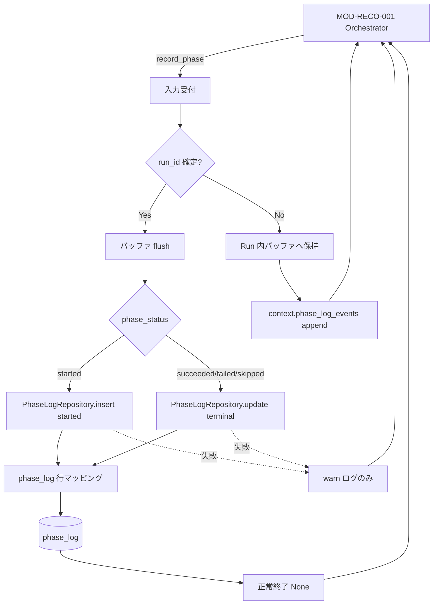

# Phase Log Writer モジュール仕様書

## 1. ドキュメント情報

| 項目           | 内容                                       |
| -------------- | ------------------------------------------ |
| ドキュメントID | `MOD-RECO-028`                             |
| ドキュメント名 | Phase Log Writer モジュール仕様書          |
| 対象システム   | Gift Recommendation Service（`apps/reco`） |
| MVP対象        | `○`                                        |
| 作成日         | 2026-07-06                                 |
| 更新日         | 2026-07-06（初版・001 Port 契約整理）      |

---

## 2. 概要

Phase Log Writer（Phase Log記録）は、**`phase_log` テーブルへの物理 INSERT / UPDATE** を担う reco 内部モジュールである。本リリースでは **`MOD-RECO-001` Recommendation Orchestrator から `PhaseLogWriterPort.record_phase()` 経由で直接呼び出し**される。

Orchestrator は各処理フェーズの **開始・終了・失敗契機** を管理し、本モジュールは **永続化・項目マッピング・`started`→終端 UPDATE** を担当する。`error_log` への物理書き込みは **`MOD-RECO-029` Error Log Writer**（`MOD-RECO-024` 経由）責務であり、本モジュールの対象外とする。

**現行実装（移行期）**: Orchestrator 配線（`MOD-RECO-001` §8.4.2）では `StubPhaseLogWriter` がデフォルト DI され、`phase_log` への物理書き込みは未実行である。本仕様書は **本リリース向けの目標仕様** を定義する。本実装差し替えは **028 実装 Task** および **MOD-RECO-001 Epic（#260）配下 Wiring Task** で段階的に行う（§16.2）。

---

## 3. 目的

- `apps/reco` における Phase Log Writer 実装・単体テストの前提を定義する
- `MOD-RECO-001` との Port 契約（`PhaseLogWriterPort` / `ExecutionContext`）を後続実装可能な粒度で整理する
- `record_phase()` 呼び出し → `phase_log` 行への **INSERT（`started`）/ UPDATE（終端）** 方針を明確化する
- Recoモジュール一覧 §6.23.2・ログ・Observability設計書 §10・`phase_log_テーブル定義書` との整合を担保する

---

## 4. モジュール基本情報

| 項目 | 内容 |
| ---- | ---- |
| モジュールID | `MOD-RECO-028` |
| モジュール名 | Phase Log記録 |
| 物理名 | `Phase Log Writer` |
| 分類 | ログ・観測 |
| 処理種別 | `共通` |
| 配置予定 | `apps/reco/src/reco/application/phase-log-writer/**` |
| 所属Epic | `MOD-RECO-028`（Epic Issue #1035） |
| MVP対象 | `○` |
| 主な呼び出し元 | **`MOD-RECO-001` Recommendation Orchestrator**（`PhaseLogWriterPort.record_phase()`） |
| 主な呼び出し先 | `PhaseLogRepository`（`infrastructure/db` 経由の `phase_log` INSERT / UPDATE） |

`MOD-API-*` / `MOD-RECO-*` / `MOD-BATCH-*` 配下の Task では、該当モジュール ID の責務範囲に変更を限定する。`MOD-RECO-*` では `apps/reco/src/reco/api/**` の API-INT エンドポイント層を対象に含めない。

---

## 5. 責務

### 5.1 主責務

- `PhaseLogWriterPort.record_phase()` を受け取り、`phase_log` テーブルへ **フェーズ単位の行を追記・更新** する（追記型 Log。終端後の履歴改変は禁止）
- `phase_log_テーブル定義書` §6 / §12 に従い、`phase_status = started` 時は **INSERT**、終端（`succeeded` / `failed` / `skipped`）時は **同一 `phase_log_id` への UPDATE** を行う
- `owner_type = recommendation_run`、`owner_id = recommendation_run_id` で Online 推薦 Run を owner とする（§5.2）
- `trace_id` を `ExecutionContext` から引き継ぎ、Observability 横断検索と整合させる
- `duration_ms` / `error_code` / `detail_json`（マスキング済み）を終端 UPDATE 時に設定する
- **`recommendation_run_id` 未確定時**（`request_received` 等）はイベントを **Run 内バッファ** に保持し、`context.run_id` 確定後に flush する（§8.4）
- 永続化失敗時は **例外を Orchestrator へ伝播しない**（warn 構造化ログのみ。推薦結果返却を継続。`MOD-RECO-001` §7.1 / §16.1 No.1）
- 観察用に `context.phase_log_events` へ in-memory イベントを append する（Stub 互換。unit test 観察用）
- `PhaseLogWriterPort` Protocol を実装し、Orchestrator から DI 可能な公開 I/F を提供する

### 5.2 対象外責務

- `API-INT-002` エンドポイント層（HTTP 受付、reco 側防御的 Validation）
- **`MOD-RECO-001` Orchestrator のパイプライン実行順序制御・フェーズ契機管理**
- **`error_log` への物理 INSERT**（`MOD-RECO-029` / `MOD-RECO-024` 責務）
- **`recommendation_run.run_status` の終端更新**（`MOD-RECO-002` / Orchestrator 責務）
- Error Code の表面 `GRS-REC-*` 決定・メッセージマスキング（`MOD-RECO-024` 責務。本モジュールは Orchestrator から渡された `error_code` を **要約として保存**）
- Metric 分布統計の永続化（`MOD-RECO-025` Metric Logger 責務）
- Batch Run / Evaluation Run 向け `phase_log` 記録（**reco Online 経路に限定**。batch / api 側 Writer は別 Epic）
- Public API（`API-PUB-002`）向けレスポンス形式・HTTP status 変換
- OpenAPI / Orval / generated の変更
- DB schema / DDL の変更（別 Task）

---

## 6. 入出力

### 6.1 入力

| 入力 | 型 / 構造 | 必須 | 生成元 | 用途 | 備考 |
| ---- | --------- | ---- | ------ | ---- | ---- |
| `context` | `ExecutionContext` | `true` | `MOD-RECO-001` | owner / trace / 補足情報の取得 | 型正本は `recommendation-orchestrator/execution_context.py` |
| `phase_name` | `str` | `true` | Orchestrator | `phase_log.phase_name` | §8.5 enum 整合 |
| `phase_status` | `PhaseStatus` | `true` | Orchestrator | `phase_log.phase_status` | `started` / `succeeded` / `failed`（コード enum。DB は `skipped` も可） |
| `module_id` | `str \| None` | `false` | Orchestrator | `detail_json.source_module_id` 等 | 発生モジュール ID |
| `error_code` | `str \| None` | `false` | Orchestrator | `phase_log.error_code` | フェーズ失敗要約（`GRS-REC-*` 等） |
| `duration_ms` | `int \| None` | `false` | Orchestrator | `phase_log.duration_ms` | 終端時に設定 |

**Port 契約**: `PhaseLogWriterPort.record_phase(...) -> None`

```python
def record_phase(
    self,
    context: ExecutionContext,
    *,
    phase_name: str,
    phase_status: PhaseStatus,
    module_id: str | None = None,
    error_code: str | None = None,
    duration_ms: int | None = None,
) -> None: ...
```

| `ExecutionContext` 参照フィールド | 用途 |
| --------------------------------- | ---- |
| `trace_id` | `phase_log.trace_id` |
| `run_id`（`recommendation_run.run_id`） | `phase_log.owner_id`（確定後） |
| `recommendation_request.request_id` | バッファ flush 前の相関（ログのみ） |
| 各種 `*_candidate_count` / `*_latency_ms` | 終端 `detail_json` の安全なサマリ（任意） |

### 6.2 出力

| 出力 | 型 / 構造 | 利用先 | 用途 | 備考 |
| ---- | --------- | ------ | ---- | ---- |
| — | — | — | 正常時は戻り値なし | `record_phase()` は `None` |
| DB 行 | `phase_log` 1 行（開始 INSERT + 終端 UPDATE） | 運用・調査 | フェーズ履歴 | IF-DB-RECO-009 / IF-OBS-001 |
| in-memory event | `dict` | `context.phase_log_events` | テスト・Stub 互換 | Stub と同型キー（§9） |
| 構造化ログ | warn / info | アプリログ | 永続化失敗・enum 外 phase | secret 不含 |

---

## 7. 依存関係

### 7.1 依存モジュール

| 依存先 | 方向 | 用途 | 失敗時の扱い | 備考 |
| ------ | ---- | ---- | ------------ | ---- |
| `MOD-RECO-001` Recommendation Orchestrator | 被呼び出し | `PhaseLogWriterPort.record_phase()` | **本モジュール内で catch**。warn のみ | **本番の唯一の直接呼び出し元**（Online reco） |
| `MOD-RECO-002` Recommendation Run Recorder | 間接 | `owner_id`（`recommendation_run_id`）の供給 | `run_id` 未確定時はバッファ（§8.4） | Run INSERT 後に flush |
| `PhaseLogRepository` | 呼び出し | `phase_log` INSERT / UPDATE | catch して warn。Orchestrator へ例外非伝播 | infrastructure 層 |
| PostgreSQL `phase_log` | 永続化 | 行保存 | Repository 例外を内部処理 | IF-DB-RECO-009 |

**`MOD-RECO-024` / `029` との関係**: 失敗フェーズの **詳細** は `error_log`（029 経由）へ。本モジュールは **フェーズ成否と要約 `error_code`** のみを `phase_log` へ記録する（`phase_log_テーブル定義書` §5.6）。024 は Phase Log を **直接呼ばない**（`MOD-RECO-024` §7.1）。

### 7.2 参照データ

| データ | 参照元 | 用途 | version / config | 備考 |
| ------ | ------ | ---- | ---------------- | ---- |
| `phase_log` 項目定義 | `phase_log_テーブル定義書` | INSERT / UPDATE 列・CHECK 制約 | MVP schema 固定 | DDL 変更は別 Task |
| `recommendation_run_phase_name` | enum定義書 §6.18 / `recommendation_run_phase_name.yaml` | `phase_name` 妥当性 | 14 値（§8.5） | DB CHECK 正本 |
| `phase_status` | enum定義書 §6.4 | 状態遷移 | 4 値 | `started`→終端 1 回 UPDATE |
| Phase 一覧 | ログ・Observability設計書 §10.3 | 記録対象フェーズの意味 | — | enum 外名称は §16.1 No.2 |

---

## 8. 処理仕様

### 8.1 処理フロー



### 8.2 処理ステップ

| No | 処理 | 入力 | 出力 | 補足 |
| --: | ---- | ---- | ---- | ---- |
| 1 | in-memory 記録 | 全引数 | `context.phase_log_events` 1 件 | Stub 互換。常に実施 |
| 2 | owner 解決 | `context.run_id` | `owner_type`, `owner_id` | 未確定時は step 3 へ |
| 3 | バッファ / flush | イベント列 | — | `run_id` 確定時に step 4 以降を一括実行 |
| 4 | phase_name 検証 | `phase_name`, `owner_type` | 正規化後名称 | enum 外は §8.5 |
| 5 | started INSERT | `phase_status=started` | `phase_log_id`（内部保持） | Run 内 `(phase_name)` → id マップ |
| 6 | 終端 UPDATE | `succeeded` / `failed` / `skipped` | — | 対応する `started` 行を UPDATE。未対応時は warn |
| 7 | detail 組み立て | `context`, `module_id` | `detail_json` | §5.5 マスキング。終端時 |
| 8 | 構造化ログ | 成功 / 失敗 | アプリログ | 永続化失敗は warn のみ |

### 8.3 Port / 型の配置

| 要素 | 配置 | 備考 |
| ---- | ---- | ---- |
| `PhaseLogWriterPort` Protocol | `recommendation-orchestrator/ports.py` | Orchestrator が Port 定義を保持（現行コード正本） |
| `PhaseStatus` enum | `recommendation-orchestrator/ports.py` | MVP: `started` / `succeeded` / `failed` |
| `ExecutionContext` | `recommendation-orchestrator/execution_context.py` | 入力コンテキスト正本 |
| `PhaseLogWriter` 実装 | `phase-log-writer/**` | 本モジュール |
| `PhaseLogRepository` Protocol | `phase-log-writer/ports.py` または `infrastructure/db/repositories/` | `RecommendationRunRepository` と同型 |

**028→001 結合**: 028 は `recommendation-orchestrator` から **Port・ExecutionContext・PhaseStatus のみ import** する。Orchestrator 本体の変更は Epic #1035 `forbidden_paths` により **Wiring Task（#260）** scope とする。

### 8.4 `run_id` 未確定時の flush 方針

| 観点 | 方針 |
| ---- | ---- |
| 発生タイミング | `request_received`（パイプライン開始）および `config_resolved` が **`MOD-RECO-002` Run INSERT より前** に記録されうる（`MOD-RECO-001` §8.2） |
| MVP 方針 | **`context.run_id` が NULL の間は DB 書き込みを保留**し、Run 内バッファに保持する |
| flush 契機 | 初回 `record_phase()` で `context.run_id` が非 NULL になった呼び出し時に、**時系列順で flush** |
| owner | flush 時は `owner_type=recommendation_run`、`owner_id=context.run_id` |
| 失敗時 | flush 失敗も推薦中断に影響させない（warn のみ） |

### 8.5 `phase_name` と DB enum の整合

`phase_log` の DB CHECK（`owner_type=recommendation_run`）は **`recommendation_run_phase_name` 14 値** のみ許可する（`phase_log_テーブル定義書` §11.2）。

Orchestrator / 下位モジュール定数には **enum 外の内部名称**（例: `run_recorded`, `feature_matched`, `ranked`）が存在する。MVP 方針は §16.1 No.2 を正とする。

**Observability 正本（14 値）**:

| `phase_name` | 内容 |
| ------------ | ---- |
| `request_received` | 推薦依頼受付 |
| `config_resolved` | Config / Version 解決 |
| `semantic_extracted` | Semantic 抽出 |
| `user_feature_generated` | User Feature 生成 |
| `user_meaning_projected` | User Meaning 射影 |
| `query_embedding_generated` | Query Embedding 生成 |
| `pre_hard_filter_completed` | Pre Hard Filter 完了 |
| `retrieval_completed` | 候補商品抽出完了 |
| `post_hard_filter_completed` | Post Hard Filter 完了 |
| `matching_completed` | Matching 完了 |
| `ranking_completed` | Ranking 完了 |
| `result_generated` | Recommendation Result 生成完了 |
| `reason_generated` | Reason 生成完了 |
| `response_built` | Response 生成完了 |

> `reco_quality_metric_recorded` は Observability §10.3 に列挙されるが **MVP DB CHECK 対象外**（Metric テーブルで記録。`phase_log_テーブル定義書` §5.7）。

### 8.6 INSERT / UPDATE 方針

| 観点 | 方針 |
| ---- | ---- |
| 操作 | **`started` = INSERT**、**終端 = UPDATE**（同一 `phase_log_id`） |
| 冪等性 | 終端 UPDATE は `WHERE phase_status = 'started'` 条件付き（`phase_log_テーブル定義書` §12.1） |
| トランザクション | Run 全体トランザクションには **参加しない**（Log 追記は独立 commit を基本） |
| 再実行 | 同一 Run 内で同一 `phase_name` の再記録は **新規 INSERT**（§12.3） |
| Retention | 90 日（Batch 系 Log 統一。`phase_log_テーブル定義書` §13） |
| リトライ | 本モジュールでは **行わない** |

---

## 9. データ項目マッピング

### 9.1 `record_phase()` → `phase_log`（Online / `owner_type=recommendation_run`）

| 入力 / コンテキスト | `phase_log` 列 | 変換 | 備考 |
| ------------------- | -------------- | ---- | ---- |
| — | `phase_log_id` | DB `gen_random_uuid()` | INSERT 時生成。Run 内で保持 |
| `context.trace_id` | `trace_id` | そのまま | nullable 可 |
| — | `owner_type` | `'recommendation_run'` 固定 | reco Online 経路 |
| `context.run_id` | `owner_id` | UUID | flush 後。NOT NULL |
| `phase_name`（正規化後） | `phase_name` | enum 検証後 | §8.5 |
| `phase_status` | `phase_status` | そのまま | 終端時 UPDATE |
| INSERT 時刻 | `started_at` | UTC now | `started` 時 |
| 終端時刻 | `completed_at` | UTC now | 終端 UPDATE 時 |
| `duration_ms` | `duration_ms` | そのまま | Orchestrator 計測値を優先 |
| `error_code` | `error_code` | そのまま | 失敗要約。詳細は error_log |
| 組み立て JSON | `detail_json` | マスキング済み object | §5.5。`module_id` 等 |
| — | `created_at` / `updated_at` | DB `now()` | UPDATE 時 `updated_at` 更新 |

### 9.2 in-memory event（`context.phase_log_events`）

Stub 互換のキー構成（テスト観察用）:

| キー | 内容 |
| ---- | ---- |
| `phase_name` | 呼び出し引数 |
| `phase_status` | `PhaseStatus.value` |
| `module_id` | 任意 |
| `error_code` | 任意 |
| `duration_ms` | 任意 |
| `trace_id` | `context.trace_id` |
| `run_id` | `context.run_id`（未確定時 `null`） |

---

## 10. 状態・例外

### 10.1 状態

本モジュールは **Run スコープのステート**（`(phase_name → phase_log_id)` マップ、未 flush バッファ）を保持する。Run 終了後は破棄する。

| 内部状態 | 意味 | 遷移条件 |
| -------- | ---- | -------- |
| `buffered` | `run_id` 未確定で DB 未書込 | `run_id` 確定で flush |
| `started_open` | INSERT 済み・終端待ち | 終端 `record_phase` で UPDATE |
| `terminal` | 終端 UPDATE 完了 | 同一 `phase_log_id` への再 UPDATE 禁止 |

### 10.2 例外

| 状況 | 発生条件 | Orchestrator への返却 | ログ |
| ---- | -------- | --------------------- | ---- |
| enum 外 `phase_name` | DB CHECK 非適合名称 | **例外なし**（in-memory のみ） | warn |
| `run_id` 未確定のまま Run 異常終了 | flush 前にパイプライン終了 | **例外なし** | warn（未 flush 件数） |
| 終端 without started | 対応 INSERT なし | **例外なし** | warn |
| DB INSERT / UPDATE 失敗 | 接続失敗・制約違反 | **例外なし** | warn |
| 入力不正（空 `phase_name` 等） | 必須欠落 | **例外なし** | warn |

**重要**: 028 永続化失敗は **推薦結果返却をブロックしない**（`MOD-RECO-001` §7.1 / §16.1 No.1）。029 とは異なり、Orchestrator 側に catch 層がないため **本モジュール内で完結**させる。

---

## 11. DB / 永続化

| テーブル | 操作 | 主な項目 | トランザクション | 備考 |
| -------- | ---- | -------- | ---------------- | ---- |
| `phase_log` | INSERT / UPDATE | §9.1 マッピング全列 | 独立 commit（基本） | IF-DB-RECO-009 |

**Repository 方針**: `RecommendationRunRepository` / `ErrorLogRepository`（029）と同型の Protocol + InMemory 実装 + 本番 PostgreSQL 実装を用意する。InMemory は unit test / Orchestrator 連携 smoke で使用する。

---

## 12. ログ・メトリクス

| 種別 | 内容 | 出力タイミング | 保存先 | 備考 |
| ---- | ---- | -------------- | ------ | ---- |
| 構造化ログ | INSERT / UPDATE 成功（`phase_log_id`, `phase_name`, `phase_status`） | 永続化成功時 | アプリログ | secret 不含 |
| 構造化ログ | 永続化スキップ（enum 外 phase / 未 flush） | 該当時 | アプリログ | warn |
| 構造化ログ | DB 失敗（例外型、phase 概要） | 失敗時 | アプリログ | stack はマスキング |
| Phase Log 本体 | フェーズ履歴 | 成功時 | `phase_log` | 本モジュールの主出力 |

### 12.1 メトリクス

| Metric | 内容 | 集計単位 | 用途 |
| ------ | ---- | -------- | ---- |
| `phase_log_insert_count` | INSERT 成功件数 | Run | 記録成功率 |
| `phase_log_update_count` | 終端 UPDATE 成功件数 | Run | フェーズ完走率 |
| `phase_log_persist_failure_count` | 永続化失敗件数 | Run | DB 健全性 |

メトリクス永続化は `MOD-RECO-025` Metric Logger に委譲可能（MVP 対象 `△`）。

---

## 13. 性能・非機能

| 観点 | 方針 |
| ---- | ---- |
| レイテンシ | 全フェーズで INSERT / UPDATE が発生しうる。**1 操作 ms 台**を目標。パイプライン SLO 内に収める |
| 計算量 | O(1) / フェーズ（Run 内マップ参照） |
| タイムアウト | 本モジュール単体 timeout は設けない（DB driver 設定に従う） |
| リトライ | **行わない** |
| キャッシュ | Run スコープの `(phase_name → phase_log_id)` のみ |
| 並列実行 | 同一 `ExecutionContext` への並行 `record_phase()` は呼び出し元（Orchestrator）が禁止 |

---

## 14. テスト観点

| No | 観点 | 確認内容 | 種別 |
| --: | ---- | -------- | ---- |
| 1 | Port 契約 | `PhaseLogWriterPort.record_phase()` が §6 引数を受理すること | unit |
| 2 | started INSERT | `phase_status=started` で 1 行 INSERT され `phase_log_id` が保持されること | unit |
| 3 | 終端 UPDATE | `succeeded` / `failed` で同一行が終端 UPDATE されること | unit |
| 4 | trace / owner | `trace_id` / `owner_id` が `ExecutionContext` と一致すること | unit |
| 5 | run_id バッファ | `run_id` 未確定イベントが flush 後に DB 反映されること | unit |
| 6 | enum 検証 | 14 値の `phase_name` が INSERT / UPDATE されること | unit |
| 7 | enum 外 | enum 外 `phase_name` が in-memory のみで warn となること | unit |
| 8 | 失敗非伝播 | Repository 失敗時も例外が Orchestrator へ伝播しないこと | unit |
| 9 | detail マスキング | `detail_json` に secret / prompt 全文が含まれないこと | unit |
| 10 | InMemory Repository | DB なしで pytest 再現可能であること | unit |
| 11 | Stub 互換 | `context.phase_log_events` が Stub と同型で蓄積されること | unit |
| 12 | Orchestrator 連携 | Wiring 後、正常 Run で主要 phase が `phase_log` に記録されること（`MOD-RECO-001` §14 No.8） | integration |
| 13 | 失敗フェーズ | 下位失敗時に `failed` + `error_code` が記録されること | integration |
| 14 | trace 伝播 | `trace_id` が全 phase 行に設定されること（§14 No.12） | unit / integration |

---

## 15. 変更管理

### 15.1 変更履歴

| 日付 | 変更内容 | 関連Issue / PR |
| ---- | -------- | -------------- |
| 2026-07-06 | 初版作成 | Issue #1036 |

---

## 16. 設計方針（確定 / 未決）

### 16.1 確定事項

| No | 論点 | 確定方針 |
| --: | ---- | -------- |
| 1 | 呼び出し経路 | **Orchestrator から `PhaseLogWriterPort.record_phase()` 直呼び**が正本。024 / 029 経由ではない |
| 2 | 失敗時の影響 | **028 永続化失敗は推薦返却をブロックしない**。本モジュール内で catch し warn のみ |
| 3 | 永続化パターン | **`started` INSERT + 終端 UPDATE**（`phase_log_テーブル定義書` §12） |
| 4 | Port / Context 正本 | **`PhaseLogWriterPort` / `ExecutionContext` は Orchestrator 配下**（028 は import のみ） |
| 5 | `run_id` 未確定 | **バッファ + flush**（§8.4）。`owner_id` NOT NULL 制約を満たす |
| 6 | error_log 境界 | 詳細障害は **029**。`phase_log.error_code` は **フェーズ失敗要約** のみ（§5.6） |
| 7 | Orchestrator Wiring | 028 実装 Task で `PhaseLogWriter` 本体を作成。**Stub 差し替えは MOD-RECO-001 Wiring Task**（#260） |

### 16.2 未決事項（Human Review 推奨）

| No | 論点 | 判断が必要な理由 | 推奨案 | 備考 |
| --: | ---- | ---------------- | ------ | ---- |
| 1 | enum 外 `phase_name` の扱い | Orchestrator / 下位定数（`run_recorded`, `feature_matched` 等）が DB 14 値と不一致 | **MVP: enum 外は DB スキップ + in-memory + warn**。正規化は **#260 Orchestrator 整合 Task** で段階対応 | §8.5 |
| 2 | 集約 phase の記録粒度 | Observability は `matching_completed` 等の **フェーズ集約名**、現行 Orchestrator は **モジュール単位名** を多数記録 | Human が集約タイミング（Orchestrator vs 028 内マッピング）を選択 | `MOD-RECO-014` 等は単独記録しない方針 |
| 3 | `detail_json` 自動抽出範囲 | 候補件数等を 028 が `ExecutionContext` から自動付与するか | **MVP: `module_id` + 安全な count フィールドのみ**。拡張は Metric Logger と整合後 | §5.5 |
| 4 | `skipped` サポート | DB enum に存在するが `PhaseStatus` に未収録 | **028 Repository は `skipped` UPDATE を許容**。Orchestrator 拡張は別 Task | enum定義書 §6.4 |

### 16.3 後続 Task（横断修正の実施タイミング）

| 順序 | Task | Epic | 内容 |
| --: | ---- | ---- | ---- |
| 1 | MOD-RECO-028 module-spec | #1035 | 本仕様書（当 Task） |
| 2 | MOD-RECO-028 implementation | #1035 | `phase-log-writer/**`、`PhaseLogRepository` |
| 3 | MOD-RECO-001 Wiring（既存 / 追補） | #260 | `StubPhaseLogWriter` → 本実装差し替え、§14 integration |
| 4 | MOD-RECO-028 unit-test | #1035 | §14 網羅テスト |
| 5 | Orchestrator phase_name 整合（**新規 Issue 推奨**） | #260 | enum 14 値への呼び出し統一（§16.2 No.1 / No.2） |

---

## 17. 関連資料

| 種別 | パス / URL | 用途 |
| ---- | ---------- | ---- |
| Recoモジュール一覧 | `docs/05_アプリケーション設計/アプリ/reco/Recoモジュール一覧.md` | §6.23.2 モジュール定義 |
| ログ・Observability設計書 | `docs/05_アプリケーション設計/アプリ/ログ・Observability設計書.md` | §10 Phase Log 設計 |
| phase_log テーブル定義書 | `docs/06_実装設計/database/phase_log_テーブル定義書.md` | 物理 DDL 正本 |
| エラーコード定義書 | `docs/05_アプリケーション設計/アプリ/エラーコード定義書.md` | `error_code` 要約境界 |
| Orchestrator 仕様書 | `docs/06_実装設計/reco/MOD-RECO-001_Recommendation Orchestratorモジュール仕様書.md` | §8.4 / §12 / §14 |
| Reco Error Handler 仕様書 | `docs/06_実装設計/reco/MOD-RECO-024_Reco Error Handlerモジュール仕様書.md` | 024 / 028 責務境界 |
| Error Log Writer 仕様書 | `docs/06_実装設計/reco/MOD-RECO-029_Error Log Writerモジュール仕様書.md` | 029 との対比 |
| Run Recorder 仕様書 | `docs/06_実装設計/reco/MOD-RECO-002_Recommendation Run Recorderモジュール仕様書.md` | owner / flush 前提 |
| Port / Context 型 | `apps/reco/src/reco/application/recommendation-orchestrator/ports.py`, `execution_context.py` | 実装参照 |
| Stub 参考 | `apps/reco/src/reco/application/recommendation-orchestrator/stubs.py` | `StubPhaseLogWriter` |
| Repository 参考 | `apps/reco/src/reco/infrastructure/db/repositories/recommendation_run_repository.py` | パターン参考 |

---

## 18. レビュー観点

- Recoモジュール一覧 §6.23.2 のモジュール名・物理名・分類・処理種別・MVP対象と一致している
- `MOD-RECO-001` §8.4 / §14（Port 直呼び・Phase Log 契機・失敗非ブロック）と矛盾しない
- `phase_log_テーブル定義書` §12 INSERT / UPDATE パターンが後続実装可能な粒度である
- `MOD-RECO-029` / `MOD-RECO-024` との責務境界（phase vs error）が明確である
- API-INT-002 エンドポイント層を責務範囲に含めていない
- epic_scope（#1035）内に収まっている（Orchestrator 本体変更なし）
- secret や `.env` 実値が含まれていない

---

## 19. 備考

- 推奨着手順（bootstrap #1011）: **024 → 029 → 028**。029 完了を 028 の必須依存とはしない（独立 Epic）
- `MOD-RECO-001` §8.4.2 の `StubPhaseLogWriter` 差し替えは **Wiring Task（#260）** scope
- batch / api からの `phase_log` 記録は **別モジュール / app** 責務。本モジュールは **reco Online 推薦経路（Orchestrator 直呼び）** に限定する
- Run INSERT と Phase Log の **同一 DB トランザクションは MVP では必須としない**（`MOD-RECO-002` §11）
