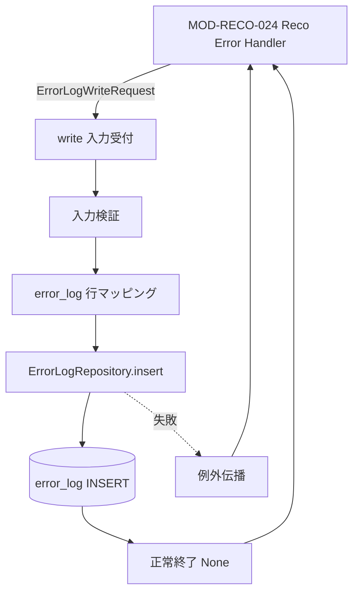

# Error Log Writer モジュール仕様書

## 1. ドキュメント情報

| 項目           | 内容                                       |
| -------------- | ------------------------------------------ |
| ドキュメントID | `MOD-RECO-029`                             |
| ドキュメント名 | Error Log Writer モジュール仕様書          |
| 対象システム   | Gift Recommendation Service（`apps/reco`） |
| MVP対象        | `○`                                        |
| 作成日         | 2026-07-06                                 |
| 更新日         | 2026-07-09（Postgres composition 完了反映）  |

---

## 2. 概要

Error Log Writer（Error Log記録）は、**`error_log` テーブルへの物理 INSERT** を担う reco 内部モジュールである。本リリースでは **`MOD-RECO-024` Reco Error Handler から `ErrorLogWriterPort.write()` 経由で間接呼び出し**されるのが原則経路であり、Orchestrator からの直接呼び出しは行わない。

本モジュールは **永続化・項目マッピング・INSERT 失敗の例外伝播** に責務を限定し、Error Code の標準化（`GRS-REC-*` への集約）、メッセージマスキング、Public / Internal API レスポンス形式への変換は **`MOD-RECO-024` 責務**とする。`error_log` 物理項目の正本は **`error_log_テーブル定義書`**、Error Code の正本は **エラーコード定義書** を正とする。

**現行実装（Orchestrator 配線）**: Epic #1029（PR #1034 develop merge 済み）により、`024` 経由で `build_default_error_log_writer()`（InMemory）が Orchestrator composition に DI されている。Orchestrator から 029 への直接呼び出しは行わない（§7.1）。

**本番 composition（Postgres）**: Epic #1076（PR #1088 develop merge 済み）により、`build_production_ports()` では `024` 経由で `ErrorLogWriter(repository=PostgresErrorLogRepository(...))` が `composition/observability.py` 経由で配線される。MVP デフォルトは InMemory のまま。

---

## 3. 目的

- `apps/reco` における Error Log Writer 実装・単体テストの前提を定義する
- `MOD-RECO-024` との Port 契約（`ErrorLogWriterPort` / `ErrorLogWriteRequest`）を後続実装可能な粒度で整理する
- `ErrorLogWriteRequest` → `error_log` 行への **1:1 マッピング** と INSERT 方針を明確化する
- Recoモジュール一覧 §6.23.3・ログ・Observability設計書 §9・`error_log_テーブル定義書` との整合を担保する

---

## 4. モジュール基本情報

| 項目 | 内容 |
| ---- | ---- |
| モジュールID | `MOD-RECO-029` |
| モジュール名 | Error Log記録 |
| 物理名 | `Error Log Writer` |
| 分類 | ログ・観測 |
| 処理種別 | `共通` |
| 配置予定 | `apps/reco/src/reco/application/error-log-writer/**` |
| 所属Epic | `MOD-RECO-029`（Epic Issue #1018） |
| MVP対象 | `○` |
| 主な呼び出し元 | **`MOD-RECO-024` Reco Error Handler**（`ErrorLogWriterPort.write()`） |
| 主な呼び出し先 | `ErrorLogRepository`（`infrastructure/db` 経由の `error_log` INSERT） |

`MOD-API-*` / `MOD-RECO-*` / `MOD-BATCH-*` 配下の Task では、該当モジュール ID の責務範囲に変更を限定する。`MOD-RECO-*` では `apps/reco/src/reco/api/**` の API-INT エンドポイント層を対象に含めない。

---

## 5. 責務

### 5.1 主責務

- `ErrorLogWriteRequest` を受け取り、`error_log` テーブルへ **1 行 INSERT** する（追記型 Log。UPDATE しない）
- `error_log_テーブル定義書` §6 の必須列（`owner_type`, `owner_id`, `service`, `error_code`, `error_message`, `severity`, `retryable`, `error_detail_json`, `occurred_at` 等）を満たす行を生成する
- **`error_log.error_code` には 024 が決定した表面 `GRS-REC-*` をそのまま保存**する（詳細 code は `error_detail_json.detail_error_code` に保持。`MOD-RECO-024` §16.1 No.5）
- `trace_id` / `request_id` を 024 から受け取った値を保存し、Phase Log / Observability 横断検索と整合させる
- `occurred_at` を **本モジュールが INSERT 時点の UTC タイムスタンプ** として設定する（024 側では決定しない）
- `error_log_id` / `created_at` は DB デフォルト（UUID / `now()`）に委譲する
- INSERT 失敗時は **例外を呼び出し元（024）へ伝播**する（024 が warn ログのみ出力し推薦返却を継続。`MOD-RECO-024` §16.1 No.2）
- `ErrorLogWriterPort` Protocol を実装し、024 から DI 可能な公開 I/F を提供する

### 5.2 対象外責務

- `API-INT-002` エンドポイント層（HTTP 受付、reco 側防御的 Validation）
- **`GRS-REC-*` 表面 code の決定**、詳細 code 集約、メッセージマスキング（`MOD-RECO-024` 責務）
- `MOD-RECO-001` Orchestrator のパイプライン実行順序制御・失敗検知
- **`phase_log` への物理 INSERT**（`MOD-RECO-028` Phase Log Writer 責務）
- **`recommendation_run.run_status` の終端更新**（`MOD-RECO-002` / Orchestrator 責務）
- Validation エラーの個別行記録（原則 warn 集計のみ。`error_log_テーブル定義書` §5.1）
- Public API（`API-PUB-002`）向けレスポンス形式・HTTP status 変換
- OpenAPI / Orval / generated の変更
- DB schema / DDL の変更（別 Task）

---

## 6. 入出力

### 6.1 入力

| 入力 | 型 / 構造 | 必須 | 生成元 | 用途 | 備考 |
| ---- | --------- | ---- | ------ | ---- | ---- |
| `request` | `ErrorLogWriteRequest` | `true` | `MOD-RECO-024` | INSERT 元データ | 型定義正本は 024 `models.py`（§8.1） |

**Port 契約**: `ErrorLogWriterPort.write(request: ErrorLogWriteRequest) -> None`

```python
def write(self, request: ErrorLogWriteRequest) -> None: ...
```

| `ErrorLogWriteRequest` フィールド | 型 | 必須 | 用途 |
| --------------------------------- | -- | ---- | ---- |
| `trace_id` | `str` | `true` | 横断追跡 ID |
| `owner_type` | `str` | `true` | polymorphic owner 種別 |
| `owner_id` | `str \| None` | `false` | owner 参照 ID |
| `service` | `str` | `true` | 記録主体（reco 経路では `reco` 固定） |
| `error_code` | `str` | `true` | **表面** `GRS-REC-*` |
| `error_message` | `str` | `true` | マスキング済み内部概要 |
| `severity` | `str` | `true` | `warn` / `error` / `critical` |
| `retryable` | `bool` | `true` | 再試行可否 |
| `request_id` | `str \| None` | `false` | Public API リクエスト ID |
| `error_detail_json` | `dict[str, object]` | `true` | 詳細 context（`detail_error_code`, `phase_name`, `source_module_id` 等） |

### 6.2 出力

| 出力 | 型 / 構造 | 利用先 | 用途 | 備考 |
| ---- | --------- | ------ | ---- | ---- |
| — | — | — | 正常時は戻り値なし | `write()` は `None` |
| DB 行 | `error_log` 1 行 | 運用・調査 | 障害追跡 | INSERT 成功時 |
| 例外 | `Exception` | `MOD-RECO-024` | INSERT 失敗通知 | 024 が catch して warn のみ |

---

## 7. 依存関係

### 7.1 依存モジュール

| 依存先 | 方向 | 用途 | 失敗時の扱い | 備考 |
| ------ | ---- | ---- | ------------ | ---- |
| `MOD-RECO-024` Reco Error Handler | 被呼び出し | `ErrorLogWriterPort.write()` | 例外を 024 へ返す | **本番の唯一の直接呼び出し元** |
| `ErrorLogRepository` | 呼び出し | `error_log` INSERT | 例外伝播 | infrastructure 層 |
| PostgreSQL `error_log` | 永続化 | 行保存 | DB 例外を Repository 経由で返却 | IF-DB-RECO-009 |

**Orchestrator との関係**: Epic #1029 により `MOD-RECO-001` §8.4.2 で **024 経由 DI 配線が完了**している。**本リリース方針では Orchestrator → 024 → 029** の間接経路が正本である。Orchestrator から 029 への直接 `write()` は **Wiring Task scope 外**（本 Epic forbidden_paths に Orchestrator 含む）。

### 7.2 参照データ

| データ | 参照元 | 用途 | version / config | 備考 |
| ------ | ------ | ---- | ---------------- | ---- |
| `error_log` 項目定義 | `error_log_テーブル定義書` | INSERT 列・CHECK 制約 | MVP schema 固定 | DDL 変更は別 Task |
| owner_type enum | `error_log_テーブル定義書` §11.1 | `owner_type` 妥当性 | — | 未知値は INSERT 前に検証し例外 |
| エラーコード形式 | エラーコード定義書 | `error_code` 形式 CHECK | `GRS-*` | 024 が surface code を保証 |

---

## 8. 処理仕様

### 8.1 処理フロー



### 8.2 処理ステップ

| No | 処理 | 入力 | 出力 | 補足 |
| --: | ---- | ---- | ---- | ---- |
| 1 | 入力検証 | `ErrorLogWriteRequest` | — | 必須欠落・形式不正時は例外 |
| 2 | owner 検証 | `owner_type`, `owner_id` | — | §11.1 enum。`system` 時 `owner_id` nullable |
| 3 | error_code 形式検証 | `error_code` | — | `GRS-*` 形式（DB CHECK 前提） |
| 4 | 行組み立て | request + `occurred_at` | `ErrorLogRow`（実装 Task で型定義） | `error_detail_json` は shallow copy |
| 5 | Repository INSERT | row | `error_log_id`（内部） | 1 行追記 |
| 6 | 構造化ログ（任意） | 成功 / 失敗 | アプリログ | secret 不含 |

### 8.3 Port / 型の配置

| 要素 | 配置 | 備考 |
| ---- | ---- | ---- |
| `ErrorLogWriterPort` Protocol | `reco-error-handler/ports.py` | 024 が Port 定義を保持 |
| `ErrorLogWriteRequest` dataclass | `reco-error-handler/models.py` | 024 が event 組み立て正本 |
| `ErrorLogWriter` 実装 | `error-log-writer/**` | 本モジュール |
| `ErrorLogRepository` Protocol | `error-log-writer/ports.py` または `infrastructure/db/repositories/` | 既存 Repository パターンに準拠 |

**024→029 結合**: 029 は `reco-error-handler` から **型・Protocol のみ import** する。`reco-error-handler/**` 本体の変更は Epic #1013 scope。共有 DTO の `domain/**` 移管は **将来 refactor Task** とし、本 Epic では 024 定義型を参照する。

### 8.4 INSERT 方針

| 観点 | 方針 |
| ---- | ---- |
| 操作 | **INSERT のみ**（同一事象の UPDATE 禁止） |
| 冪等性 | 同一 Run 失敗で複数行が積まれる可能性は **024 / Orchestrator が 1 回 handle に抑える** |
| トランザクション | Run 全体トランザクションには **参加しない**（Log 追記は独立 commit を基本） |
| Retention | 90 日（Batch 系 Log 統一。`error_log_テーブル定義書` §13） |
| 再実行 | INSERT 失敗の retry は **本モジュールでは行わない**（024 側も retry しない） |

---

## 9. データ項目マッピング

| `ErrorLogWriteRequest` | `error_log` 列 | 変換 | 備考 |
| ---------------------- | -------------- | ---- | ---- |
| — | `error_log_id` | DB `gen_random_uuid()` | サロゲート PK |
| `trace_id` | `trace_id` | そのまま | nullable 可 |
| `request_id` | `request_id` | そのまま | nullable 可 |
| `owner_type` | `owner_type` | そのまま | §11.1 enum 検証 |
| `owner_id` | `owner_id` | UUID 文字列 → UUID | nullable 可 |
| `service` | `service` | そのまま | reco 経路では `reco` |
| `error_code` | `error_code` | そのまま | **表面 `GRS-REC-*`** |
| `error_message` | `error_message` | そのまま | 024 がマスキング済み |
| `severity` | `severity` | そのまま | `warn` / `error` / `critical` |
| `retryable` | `retryable` | そのまま | boolean |
| `error_detail_json` | `error_detail_json` | JSON 化 | `detail_error_code`, `phase_name`, `source_module_id` 等 |
| — | `occurred_at` | **INSERT 時 UTC now** | 本モジュールが設定 |
| — | `created_at` | DB `now()` | 行作成日時 |

---

## 10. 状態・例外

### 10.1 状態

本モジュールは **ステートレス**（1 request = 1 INSERT）とする。

### 10.2 例外

| 例外 | Error Code（ログ用） | 発生条件 | 呼び出し元（024）への返却 | 024 の扱い |
| ---- | -------------------- | -------- | ------------------------- | ---------- |
| 入力検証失敗 | — | 必須フィールド欠落、`owner_type` 未知 | `ValueError` 等 | warn のみ。`RecoError` 返却は継続 |
| DB INSERT 失敗 | `GRS-DB-*`（内部） | 接続失敗・制約違反 | Repository 例外 | warn のみ |
| 想定外内部失敗 | — | 本モジュール内バグ | 例外 | warn のみ |

**重要**: 029 失敗は **推薦結果返却をブロックしない**（`MOD-RECO-024` §16.1 No.2）。024 が `_delegate_error_log` で例外を catch する。

---

## 11. DB / 永続化

| テーブル | 操作 | 主な項目 | トランザクション | 備考 |
| -------- | ---- | -------- | ---------------- | ---- |
| `error_log` | INSERT | §9 マッピング全列 | 独立 commit（基本） | IF-DB-RECO-009 |

**Repository 方針**: `RecommendationRunRepository`（`infrastructure/db/repositories/`）と同型の Protocol + InMemory 実装 + 本番 PostgreSQL 実装を用意する。InMemory は unit test / 024 連携 smoke で使用する。

**本番 composition 経路**: `apps/reco/src/reco/composition/observability.py` → `RecoErrorHandler(error_log_writer=ErrorLogWriter(repository=PostgresErrorLogRepository(...)))`。

---

## 12. ログ・メトリクス

| 種別 | 内容 | 出力タイミング | 保存先 | 備考 |
| ---- | ---- | -------------- | ------ | ---- |
| 構造化ログ | INSERT 成功（`error_log_id`, `error_code`, `owner_type`） | `write()` 成功時 | アプリログ | secret 不含 |
| 構造化ログ | INSERT 失敗（例外型、owner 概要） | `write()` 失敗時 | アプリログ | stack はマスキング |
| Error Log 本体 | エラー事象 | `write()` 成功時 | `error_log` | 本モジュールの主出力 |

### 12.1 メトリクス

| Metric | 内容 | 集計単位 | 用途 |
| ------ | ---- | -------- | ---- |
| `error_log_insert_count` | INSERT 成功件数 | Run | 記録成功率 |
| `error_log_insert_failure_count` | INSERT 失敗件数 | Run | DB 健全性 |

メトリクス永続化は `MOD-RECO-025` Metric Logger に委譲可能（MVP 対象 `△`）。

---

## 13. 性能・非機能

| 観点 | 方針 |
| ---- | ---- |
| レイテンシ | 失敗経路のみ。DB INSERT 1 回（ms オーダー） |
| タイムアウト | 本モジュール単体 timeout は設けない（DB driver 設定に従う） |
| リトライ | **行わない** |
| 並列実行 | 同一 request への並行 `write()` は呼び出し元が禁止 |

---

## 14. テスト観点

| No | 観点 | 確認内容 | 種別 |
| --: | ---- | -------- | ---- |
| 1 | Port 契約 | `ErrorLogWriterPort.write()` が `ErrorLogWriteRequest` を受理すること | unit |
| 2 | マッピング | §9 の全列が期待どおり INSERT されること | unit |
| 3 | 表面 code | `error_code` が 024 から渡された `GRS-REC-*` のまま保存されること | unit |
| 4 | detail JSON | `error_detail_json.detail_error_code` が保持されること | unit |
| 5 | occurred_at | INSERT 時に `occurred_at` が設定されること | unit |
| 6 | owner 検証 | 未知 `owner_type` で例外となること | unit |
| 7 | INSERT 失敗 | Repository 失敗時に例外が 024 へ伝播すること | unit |
| 8 | InMemory Repository | DB なしで pytest 再現可能であること | unit |
| 9 | 024 連携 | 024 `handle()` 経由で `write()` が呼ばれ DB に 1 行追加されること | unit（明示 DI） |
| 10 | Orchestrator 連携 | Wiring 後、失敗時に 024→029→`error_log` が接続されること | integration（Wiring 後） |

---

## 15. 変更管理

### 15.1 変更履歴

| 日付 | 変更内容 | 関連Issue / PR |
| ---- | -------- | -------------- |
| 2026-07-06 | 初版作成 | Issue #1019 |
| 2026-07-07 | §2 / §7.1 / §16 / §19 を Orchestrator 本実装配線完了（#1029）へ追随 | Issue #1049 |
| 2026-07-09 | §2 / §11 に Postgres composition 経路を追記（#1076 merge） | Issue #1089 |

---

## 16. 設計方針（確定）

`MOD-RECO-024` モジュール仕様書 §16.1（Human 決定）と整合する。

### 16.1 確定事項

| No | 論点 | 確定方針 |
| --: | ---- | -------- |
| 1 | 呼び出し経路 | **024 から `ErrorLogWriterPort.write()` 直呼び**が本番正本。Orchestrator 直接呼び出しは行わない |
| 2 | 失敗時の影響 | **029 INSERT 失敗は推薦返却をブロックしない**。例外は 024 が catch し warn のみ |
| 3 | `error_log.error_code` | **表面 `GRS-REC-*`**（024 が決定）。詳細 code は `error_detail_json.detail_error_code` |
| 4 | 入力型の正本 | **`ErrorLogWriteRequest` は 024 `models.py`**。029 は import のみ（Epic forbidden_paths により 024 本体は変更しない） |
| 5 | `occurred_at` | **029 が INSERT 時に設定**（024 は event 組み立てのみ） |
| 6 | Orchestrator Wiring | Epic #1029 で **完了**（develop merge, PR #1034）。024 経由 029 DI 配線済み |

### 16.2 後続 Task（横断修正の実施タイミング）

| 順序 | Task | Epic | 内容 |
| --: | ---- | ---- | ---- |
| 1 | MOD-RECO-029 module-spec | #1018 | 本仕様書（当 Task） |
| 2 | MOD-RECO-029 implementation | #1018 | `error-log-writer/**`、`ErrorLogRepository`、024 DI 接続 |
| 3 | MOD-RECO-001 Wiring（ログ・エラー） | #1029 | **完了**（develop merge, PR #1034）。024 経由 029 DI 配線 |
| 4 | MOD-RECO-029 unit-test | #1018 | §14 網羅テスト |
| 5 | MOD-RECO-024 unit-test | #1013 | §14 網羅 + 024→029 連携（029 実装後） |
| 6 | Composition（Postgres） | #1076 | **完了**（develop merge, PR #1088）。`build_production_ports` 経由 Postgres 配線 |

---

## 17. 関連資料

| 種別 | パス / URL | 用途 |
| ---- | ---------- | ---- |
| Recoモジュール一覧 | `docs/05_アプリケーション設計/アプリ/reco/Recoモジュール一覧.md` | §6.23.3 モジュール定義 |
| ログ・Observability設計書 | `docs/05_アプリケーション設計/アプリ/ログ・Observability設計書.md` | §9 Error Log 設計 |
| エラーコード定義書 | `docs/05_アプリケーション設計/アプリ/エラーコード定義書.md` | `GRS-*` 正本 |
| error_log テーブル定義書 | `docs/06_実装設計/database/error_log_テーブル定義書.md` | 物理 DDL 正本 |
| Reco Error Handler 仕様書 | `docs/06_実装設計/reco/MOD-RECO-024_Reco Error Handlerモジュール仕様書.md` | 024→029 Port・§16 設計方針 |
| Orchestrator 仕様書 | `docs/06_実装設計/reco/MOD-RECO-001_Recommendation Orchestratorモジュール仕様書.md` | §8.4 / §14 |
| 024 Port / Request 型 | `apps/reco/src/reco/application/reco-error-handler/ports.py`, `models.py` | 実装参照 |
| Repository 参考 | `apps/reco/src/reco/infrastructure/db/repositories/recommendation_run_repository.py` | パターン参考 |

---

## 18. レビュー観点

- Recoモジュール一覧 §6.23.3 のモジュール名・物理名・分類・処理種別・MVP対象と一致している
- `MOD-RECO-024` §16.1（024→029 Port 直呼び・code 列・失敗時 warn）と矛盾しない
- `error_log_テーブル定義書` §6 カラムマッピングが後続実装可能な粒度である
- API-INT-002 エンドポイント層を責務範囲に含めていない
- epic_scope（#1018）内に収まっている（Orchestrator / 024 本体変更なし）
- secret や `.env` 実値が含まれていない

---

## 19. 備考

- 推奨着手順（bootstrap #1011）: **024 → 029 → 028**。024 実装（#1016 / PR #1017）マージ済みを前提に 029 に着手する
- Epic #1029 により `MOD-RECO-001` §8.4.2 の 024 経由 029 DI 配線は **完了**（develop merge 済み）
- batch 系からの `error_log` INSERT は **別モジュール / app** 責務。本モジュールは **reco Online 推薦経路（024 委譲）** に限定する
