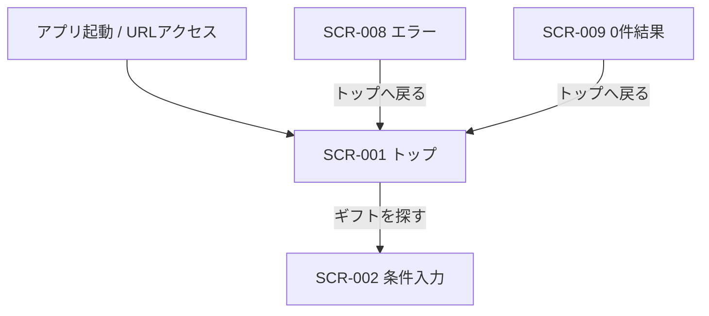

# トップ画面 画面仕様書

## 1. ドキュメント情報

| 項目     | 内容                   |
| -------- | ---------------------- |
| 画面ID   | `SCR-001`              |
| 画面名   | トップ画面             |
| 画面種別 | `通常画面`             |
| MVP対象  | `○`                    |
| 作成日   | 2026-07-15             |
| 更新日   | 2026-07-15             |

---

## 2. 概要

サービス入口となるトップ画面である。サービスの価値（意味でのギフト推薦）を伝え、レコメンド条件入力画面（SCR-002 `/recommendations`）へ誘導する。本画面では API 呼び出しを行わず、静的表示とクライアント遷移のみとする。

---

## 3. 目的

- ユーザーにサービスの概要と制約（外部 EC で購入）を伝えること
- 主導線「ギフトを探す」で SCR-002 へ迷いなく遷移できること
- レーン1e（条件入力〜結果確認 E2E）の入口として `/` を機能させること

---

## 4. 対象ユーザー

| ユーザー種別 | 内容                                           |
| ------------ | ---------------------------------------------- |
| 主利用者     | ギフトを探したい一般ユーザー（MVP は非認証） |
| 補助利用者   | なし（MVP）                                    |
| 管理者       | なし（本画面は管理機能を持たない）             |

---

## 5. 画面表示条件

| 項目            | 内容                                                                 |
| --------------- | -------------------------------------------------------------------- |
| 表示URL / Route | `/`（確定。画面一覧 §4.1・画面遷移図 §10 と一致）                  |
| 遷移元          | アプリ起動 / URL 直接アクセス、SCR-008 / SCR-009 からの「トップへ戻る」 |
| 遷移先          | SCR-002（レコメンド条件入力。主 CTA）                                |
| 認証要否        | `false`（MVP 非認証）                                                |
| 権限条件        | なし                                                                 |
| 初期表示条件    | ルート `/` 到達時。追加のマスタ取得や Loading は不要（MVP）          |

---

## 6. 画面遷移



### 6.1 遷移一覧

|  No | 操作         | 遷移先                      | 条件                         | 備考                         |
| --: | ------------ | --------------------------- | ---------------------------- | ---------------------------- |
|   1 | ギフトを探す | SCR-002 `/recommendations`  | 常時（リンク有効）           | MVP 主導線。画面遷移図 §6.1  |
|   2 | （外部流入） | 本画面 `/`                  | URL / 他画面のトップへ戻る   | 履歴導線は MVP 対象外        |

補足:

- 初回 MVP では、トップからレコメンド履歴画面（SCR-010）への導線は表示しない（画面遷移図 §6.1）
- CTA ラベルはユーザー向け文言「ギフトを探す」とする（画面一覧の操作名「レコメンド開始」と同義の主導線）

---

## 7. 画面レイアウト

### 7.1 レイアウト概要

単一カラムのランディング構成。サービス名を最上位の見出しとし、キャッチコピー・説明・主 CTA・注意書きを縦に配置する。カード UI は用いない。

### 7.2 ワイヤーフレーム簡易図

```text
┌──────────────────────────────────────────┐
│ Gift Recommendation Service              │
│ （サービス名 / H1）                        │
│                                           │
│ 意味で選ぶ、贈る相手に届くギフト推薦       │
│ （キャッチコピー）                         │
│                                           │
│ 贈答相手・用途・好み・避けたい条件から…   │
│ （サービス説明）                           │
│                                           │
│          [ ギフトを探す ]                 │
│                                           │
│ 購入・決済は外部のショッピングサイトで…   │
│ （注意書き・小さめ）                       │
└──────────────────────────────────────────┘
```

### 7.3 画面領域

| 領域   | 内容                             | 表示条件 |
| ------ | -------------------------------- | -------- |
| Header | なし（ページ内 H1 で代替）       | -        |
| Main   | サービス名〜CTA・注意書き        | 常時     |
| Footer | なし                             | -        |

---

## 8. 表示項目

|  No | 項目名               | 物理名 / key        | 型     | 表示形式 | 必須 | 表示条件 | 備考 |
| --: | -------------------- | ------------------- | ------ | -------- | ---- | -------- | ---- |
|   1 | サービス名           | `pageServiceName`   | string | H1       | -    | 常時     | 画面一覧 ○。実装定数例: `Gift Recommendation Service` |
|   2 | キャッチコピー       | `pageCatchcopy`     | string | テキスト | -    | 常時     | 画面一覧 ○。意味で選べることを伝える |
|   3 | サービス説明         | `pageDescription`   | string | テキスト | -    | 常時     | 画面一覧 ○。相手・用途・好み等の説明 |
|   4 | レコメンド開始ボタン | `ctaRecommendStart` | action | Link/Button | - | 常時     | ラベル「ギフトを探す」。href=`/recommendations` |
|   5 | 注意書き（外部EC）   | `noticeExternalEc`  | string | テキスト | -    | MVP では表示する | 画面一覧 △。購入・決済は外部 EC。本 Epic では表示する方針 |

文言の正本は実装側 `apps/web/src/features/home/constants.ts` と本仕様を突合し、変更時は両方を更新する。

---

## 9. 入力項目

なし（本画面にフォーム入力はない）。

---

## 10. 操作仕様

|  No | 操作         | トリガー              | 処理内容                                      | 成功時                         | 失敗時 | 備考 |
| --: | ------------ | --------------------- | --------------------------------------------- | ------------------------------ | ------ | ---- |
|   1 | ギフトを探す | CTA クリック / キーボード操作 | クライアント遷移（`Link` 等）で `/recommendations` へ | SCR-002 が表示される           | なし（クライアント遷移） | API 呼び出しなし |

---

## 11. 状態別表示仕様

### 11.1 初期表示

サービス名・キャッチ・説明・CTA・注意書きを一度に表示する。追加のスケルトンやスプラッシュは不要。

### 11.2 Loading状態

なし（MVP。マスタ事前取得を本画面では行わない）。

### 11.3 Empty状態

なし（静的コンテンツのみ）。

### 11.4 Error状態

なし（本画面起因の API エラーはない）。ページ未到達（ルーティング失敗）は SCR-014 等の別扱い。

### 11.5 Success状態

特になし。常時「初期表示」と同一。

---

## 12. バリデーション仕様

なし。

---

## 13. エラー表示仕様

| エラー種別    | 発生条件 | 表示内容 | ユーザー操作 | 備考 |
| ------------- | -------- | -------- | ------------ | ---- |
| API通信エラー | 該当なし | -        | -            | API 未使用 |
| 認証エラー    | 該当なし | -        | -            | 非認証 |
| 権限エラー    | 該当なし | -        | -            | - |
| 入力エラー    | 該当なし | -        | -            | 入力なし |
| 想定外エラー  | 該当なし | -        | -            | - |

---

## 14. API連携仕様

### 14.1 利用API一覧

なし（画面一覧「主なAPI: なし、またはマスタ事前取得API」。本 MVP ではマスタ事前取得は SCR-002 側で実施するため、SCR-001 では API を呼ばない）。

### 14.2 Request

なし。

### 14.3 Response

なし。

### 14.4 画面項目とのマッピング

なし。

---

## 15. データ取得・更新タイミング

| タイミング     | 処理     | 対象API / 処理 | 備考 |
| -------------- | -------- | -------------- | ---- |
| 初期表示時     | 静的描画 | なし           | - |
| ユーザー操作時 | クライアント遷移 | なし        | CTA |
| 再表示時       | 静的描画 | なし           | - |

---

## 16. 非機能・UX観点

| 観点             | 方針 |
| ---------------- | ---- |
| レスポンシブ対応 | 単一カラムで狭幅でも可読・タップ可能にする |
| アクセシビリティ | CTA はフォーカス可視化可能なリンクとする。サービス名はページ内の主見出し（H1） |
| パフォーマンス   | 静的描画。追加の重量リソースは置かない |
| SEO              | MVP では特別対応なし（タイトル等は後続で調整可） |
| 多言語対応       | 日本語固定（MVP） |
| ブラウザ対応     | プロジェクト標準のモダンブラウザ |

---

## 17. セキュリティ観点

| 観点           | 方針 |
| -------------- | ---- |
| 認証           | 不要（MVP） |
| 認可           | 不要 |
| 個人情報表示   | なし |
| secret表示防止 | クライアントに secret を埋め込まない |
| XSS対策        | 固定文言。ユーザー入力を本画面で扱わない |
| CSRF対策       | 状態変更 API なし（遷移のみ） |

---

## 18. ログ・計測

| 種別         | 内容 | 出力タイミング | 備考 |
| ------------ | ---- | -------------- | ---- |
| 画面表示ログ | MVP では必須としない | - | 後続で page view を検討可 |
| 操作ログ     | MVP では必須としない | CTA クリック | 後続検討 |
| エラーログ   | 該当なし | - | - |
| メトリクス   | MVP では必須としない | - | - |

---

## 19. MVP対象範囲

### 19.1 MVP対象

- `/` での SCR-001 表示
- サービス名 / キャッチコピー / サービス説明 / 主 CTA
- 外部 EC 注意書きの表示
- CTA → `/recommendations`（SCR-002）遷移

### 19.2 MVP対象外

- レコメンド履歴（SCR-010）への導線
- 認証・ユーザー識別
- 本画面でのマスタ API 事前取得
- 大規模なブランドデザイン刷新・動画・ヒーロー画像の必須化
- 多言語

---

## 20. テスト観点

|  No | 観点         | 確認内容                                               | 種別      |
| --: | ------------ | ------------------------------------------------------ | --------- |
|   1 | 初期表示     | サービス名・キャッチ・説明・CTA・注意書きが表示される | component / manual |
|   2 | Loading状態  | 該当なし                                               | -         |
|   3 | Empty状態    | 該当なし                                               | -         |
|   4 | Error状態    | 該当なし                                               | -         |
|   5 | API連携      | 該当なし                                               | -         |
|   6 | CTA 遷移     | 「ギフトを探す」が `/recommendations` を指す           | component / manual |
|   7 | レスポンシブ | 狭幅でも CTA が操作可能                                | manual    |

---

## 21. レビュー観点

- 画面一覧 §4.1・画面遷移図と矛盾していないか
- CTA 遷移先が `/recommendations` で固定されているか
- 履歴導線を MVP で出していないか
- API / secret を本画面に持ち込んでいないか
- 先行実装（#1256 / PR #1257）との差分が §24 に整理されているか

---

## 22. 未決事項

|  No | 論点 | 判断が必要な理由 | 判断者 | 期限 | 備考 |
| --: | ---- | ---------------- | ------ | ---- | ---- |
|   1 | サービス正式名称・キャッチのブランド確定 | 現在は仮称・暫定文言でよいが、マーケ確定時に差し替えが必要 | Human | 後続 | 実装定数と本仕様を同時更新 |

---

## 23. 関連資料

| 種別       | パス / URL | 用途 |
| ---------- | ---------- | ---- |
| 画面一覧   | `docs/05_アプリケーション設計/アプリ/web/画面一覧.md` §4.1 | 画面ID・表示・操作の正本 |
| 画面遷移図 | `docs/05_アプリケーション設計/アプリ/web/画面遷移図.md` | SCR-001 → SCR-002 遷移 |
| SCR-002 仕様 | `docs/06_実装設計/web/SCR-002_レコメンド条件入力画面画面仕様書.md` | 遷移先 URL・CTA 文言の整合 |
| テンプレート | `prompts/templates/docs/screen-spec.md` | 本章構成の根拠 |
| 先行実装 | Issue #1256 / PR #1257 | 突合対象（案B） |
| 親 Epic | Issue #1255 | 作業計画 |

---

## 24. 備考

### 24.1 実装との関係（案B）

本仕様書は実装 Task（#1256 / PR #1257）より後に作成した。突合結果は次のとおり。

| 項目 | 仕様（本ドキュメント） | 先行実装（PR #1257） | 整合 |
| ---- | ---------------------- | -------------------- | ---- |
| Route | `/` | `apps/web/src/app/page.tsx` → `HomePage` | ○ |
| CTA ラベル | ギフトを探す | `CTA_LABEL` | ○ |
| CTA 遷移先 | `/recommendations` | `RECOMMENDATIONS_HREF` | ○ |
| サービス名等 | §8 | `constants.ts` | ○（文言は同一系） |
| 外部 EC 注意書き | MVP で表示 | `NOTICE_EXTERNAL_EC` 表示 | ○ |
| API | なし | 呼び出しなし | ○ |

仕様と実装に差分が出た場合は、**画面一覧を上位正本としつつ本仕様を更新し、実装 PR で追随**する。

### 24.2 実装配置方針

| 区分 | パス |
| ---- | ---- |
| ページエントリ | `apps/web/src/app/page.tsx` |
| 画面 feature | `apps/web/src/features/home/**` |
| component テスト | `apps/web/tests/component/home/**` |
