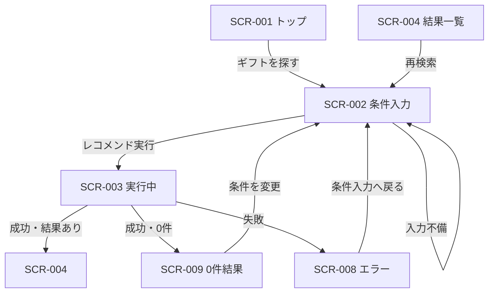

# レコメンド条件入力画面 画面仕様書

## 1. ドキュメント情報

| 項目     | 内容                   |
| -------- | ---------------------- |
| 画面ID   | `SCR-002`              |
| 画面名   | レコメンド条件入力画面 |
| 画面種別 | `通常画面`             |
| MVP対象  | `○`                    |
| 作成日   | 2026-07-12             |
| 更新日   | 2026-07-12             |

---

## 2. 概要

贈答相手（Relationship）、用途（Occasion）、予算、好み・避けたい条件・NG条件を入力し、Recommendation Request を組み立ててレコメンド実行（API-PUB-002）を呼び出す MVP 中核入力画面である。初期表示時にマスタ API（API-PUB-005〜008）を並列取得し、選択肢と実行前提を整える。

---

## 3. 目的

- ユーザーが贈答条件を迷いなく入力できること
- 入力内容を API-PUB-002 Request（camelCase）に正しくマッピングできること
- 入力不備を画面内で解消し、実行後は SCR-003（実行中）経由で結果・0件・エラーへ遷移すること

---

## 4. 対象ユーザー

| ユーザー種別 | 内容                                           |
| ------------ | ---------------------------------------------- |
| 主利用者     | ギフトを探したい一般ユーザー（MVP は非認証） |
| 補助利用者   | なし（MVP）                                    |
| 管理者       | なし（本画面は管理機能を持たない）             |

---

## 5. 画面表示条件

| 項目            | 内容                                                                 |
| --------------- | -------------------------------------------------------------------- |
| 表示URL / Route | `/recommendations`（確定。画面一覧 §4.2・画面遷移図 §10 と一致） |
| 遷移元          | SCR-001（ギフトを探す）、SCR-004（再検索）、SCR-008（条件入力へ戻る）、SCR-009（条件変更） |
| 遷移先          | SCR-003（レコメンド実行中）。結果・0件・エラーは SCR-003 経由        |
| 認証要否        | `false`（MVP 非認証）                                                |
| 権限条件        | なし                                                                 |
| 初期表示条件    | ルート到達時。マスタ取得完了後にフォームを操作可能にする             |

---

## 6. 画面遷移



### 6.1 遷移一覧

|  No | 操作               | 遷移先              | 条件                         | 備考                         |
| --: | ------------------ | ------------------- | ---------------------------- | ---------------------------- |
|   1 | ギフトを探す       | SCR-002             | SCR-001 から                 | 入力開始                     |
|   2 | 再検索 / 条件変更  | SCR-002             | SCR-004 / SCR-008 / SCR-009  | 入力復元は §6.2               |
|   3 | レコメンド実行     | SCR-003             | クライアントバリデーション通過 | API-PUB-002 呼び出し開始     |
|   4 | 入力不備のまま実行 | 自画面（インライン） | 必須不足・予算矛盾等         | SCR-008 へは遷移しない（MVP） |

### 6.2 再検索時の入力値復元

SCR-004 / SCR-008 / SCR-009 から本画面へ戻るとき、前回入力を次の分担で復元する。

| 保存先 | 対象項目 | 例 |
| ------ | -------- | --- |
| クエリパラメータ（`?key=value`） | 短い条件 | `relationshipCode` / `occasionCode` / `budgetMin` / `budgetMax` / `topK` |
| sessionStorage | 長い自由記述 | `preferredText` / `nonPreferredText` / `ngText` |

補足:

- ルート path は `/recommendations` のままとし、条件は **パスパラメータではなくクエリパラメータ** で渡す
- レコメンド実行時（または結果画面到達時）にクエリ・sessionStorage へ書き込み、戻り時に読み取ってフォームへ反映する
- sessionStorage に値がない場合、当該テキスト欄は空のままとする（クエリ側の短い条件のみ復元してよい）
- クエリキー名・sessionStorage キー名の最終物理名は実装時に本表の論理名と対応づけて固定する

---

## 7. 画面レイアウト

### 7.1 レイアウト概要

単一カラムのフォーム画面。上部に画面タイトルと補助説明、中央に FormSection 単位の入力群、下部に主 CTA（レコメンド実行）を配置する。カード UI は用いない（既存デザインルールに従う）。

### 7.2 ワイヤーフレーム簡易図

```text
┌──────────────────────────────────────────┐
│ Header / Page title: ギフトの条件を入力   │
├──────────────────────────────────────────┤
│ [Alert: マスタ取得失敗時]                 │
│                                           │
│ ■ 贈る相手・用途                          │
│   Relationship [Select ▼]                 │
│   Occasion     [Select ▼]                 │
│                                           │
│ ■ 予算                                    │
│   下限 [Number] 〜 上限 [Number] 円       │
│                                           │
│ ■ 好み・避けたいこと・NG                  │
│   好み     [TextArea]                     │
│   避けたい [TextArea]                     │
│   NG条件   [TextArea]                     │
│                                           │
│          [ レコメンドを実行 ]             │
└──────────────────────────────────────────┘
```

### 7.3 画面領域

| 領域   | 内容                                   | 表示条件           |
| ------ | -------------------------------------- | ------------------ |
| Header | 画面タイトル・短い説明                 | 常時               |
| Main   | フォーム・インラインエラー・Alert      | 常時               |
| Footer | なし（CTA は Main 下部）               | -                  |

---

## 8. 表示項目

|  No | 項目名               | 物理名 / key              | 型       | 表示形式     | 必須 | 表示条件           | 備考                          |
| --: | -------------------- | ------------------------- | -------- | ------------ | ---- | ------------------ | ----------------------------- |
|   1 | 画面タイトル         | `pageTitle`               | string   | テキスト     | -    | 常時               | 「ギフトの条件を入力」等      |
|   2 | 補助説明             | `pageDescription`         | string   | テキスト     | -    | 常時               | MVP △ でも可                  |
|   3 | Relationship選択肢   | `relationshipOptions`     | list     | Select       | -    | マスタ取得成功時   | API-PUB-005                   |
|   4 | Occasion選択肢       | `occasionOptions`         | list     | Select       | -    | マスタ取得成功時   | API-PUB-006                   |
|   5 | マスタ取得エラー     | `mastersErrorAlert`       | alert    | Alert        | -    | マスタ取得失敗時   | 再試行導線を含む              |
|   6 | フィールドエラー     | `fieldErrors.*`           | string   | InlineError  | -    | 該当フィールド不正時 | FormField 直下                |
|   7 | 実行ボタン           | `submitButton`            | action   | Button       | -    | 常時               | Loading 中は disabled         |

Semantic Config / Feature Rule（API-PUB-007 / 008）は初期取得対象とするが、画面上には表示・入力しない（取得のみ。検証ツール等での response 参照は可。§22）。

---

## 9. 入力項目

|  No | 項目名         | 物理名 / key（UI） | 型     | 入力形式   | 必須 | 初期値 | 入力制約                                      | 備考 |
| --: | -------------- | ------------------ | ------ | ---------- | ---- | ------ | --------------------------------------------- | ---- |
|   1 | 贈る相手       | `relationshipCode` | string | Select     | ○    | 未選択 | マスタ code のいずれか                        | 表示名は label |
|   2 | 用途           | `occasionCode`     | string | Select     | ○    | 未選択 | マスタ code のいずれか                        | 同上 |
|   3 | 予算下限       | `budgetMin`        | number | NumberInput| △    | 空     | 整数・0以上。入力時は `budgetMax` 以下        | JPY |
|   4 | 予算上限       | `budgetMax`        | number | NumberInput| ○    | 空     | 整数・0以上                                   | UI 必須（確定）。API 契約上は任意だが画面では必須 |
|   5 | 好み           | `preferredText`    | string | TextArea   | △    | 空     | 最大 500 文字                                 | API: `preferredCondition.preferredText` |
|   6 | 避けたい条件   | `nonPreferredText` | string | TextArea   | △    | 空     | 最大 500 文字                                 | API: `nonPreferredCondition.nonPreferredText` |
|   7 | NG条件         | `ngText`           | string | TextArea   | △    | 空     | 最大 300 文字                                 | 画面一覧の `ng_conditions` に対応。Hard Filter |
|   8 | 表示件数       | `topK`             | number | hidden/固定| △    | 10     | 1〜50。MVP は UI 非表示でも可                 | 画面一覧 `result_count`。API: `execution.topK` |

`freeText`（自由記述）は API 契約上任意。MVP 初期画面では非表示（確定）。必要になった場合は別途 Human 判断で追加する（§22）。

---

## 10. 操作仕様

|  No | 操作             | トリガー           | 処理内容                                                                 | 成功時                         | 失敗時                                   | 備考 |
| --: | ---------------- | ------------------ | ------------------------------------------------------------------------ | ------------------------------ | ---------------------------------------- | ---- |
|   1 | Relationship選択 | Select 変更        | `relationshipCode` / label を保持                                        | 選択肢反映                     | -                                        | |
|   2 | Occasion選択     | Select 変更        | `occasionCode` / label を保持                                            | 選択肢反映                     | -                                        | |
|   3 | 予算入力         | blur / change      | 数値正規化・範囲チェック                                                 | エラー解除                     | InlineError 表示                         | |
|   4 | テキスト入力     | blur / change      | 文字数チェック                                                           | エラー解除                     | InlineError 表示                         | |
|   5 | レコメンド実行   | 主 CTA クリック    | クライアント検証 → API-PUB-002 呼び出し開始 → SCR-003 へ                 | SCR-003 表示                   | 検証失敗時は自画面。API失敗は SCR-008    | 実行中は二重送信防止 |
|   6 | マスタ再取得     | Alert 内再試行     | API-PUB-005〜008 を再並列 GET                                            | 選択肢更新                     | Alert 継続                               | |

---

## 11. 状態別表示仕様

### 11.1 初期表示

- マスタ取得中は Select を disabled + スケルトンまたは短い Loading 表示
- 取得成功後、未選択の Select と空の予算・テキスト欄を表示
- CTA は有効（押下時に検証）

### 11.2 Loading状態

| 種別 | 表示 | 操作 |
| ---- | ---- | ---- |
| マスタ初期取得 | Select disabled / ローディング | CTA は無効推奨 |
| レコメンド実行 | SCR-003 へ遷移（本画面は離脱） | 本画面では二重送信しない |

### 11.3 Empty状態

マスタ有効件数が 0 件の場合（API は HTTP 200 + 空配列）: Select に「選択肢がありません」相当を表示し、CTA は無効。Alert で運用問い合わせを促す（GRS-CFG 系と区別）。

### 11.4 Error状態

| 種別 | 表示場所 | 内容 |
| ---- | -------- | ---- |
| 入力エラー | フィールド直下 | §12 |
| マスタ取得失敗 | 画面上部 Alert | 「選択項目の取得に失敗しました。」+ 再試行。必要なら `traceId` 表示 |
| 実行 API 失敗 | SCR-008 | 本画面では保持しない（戻ってきた場合はフォーム再表示） |

### 11.5 Success状態

レコメンド実行の成功は SCR-003 → SCR-004 / SCR-009 で扱う。本画面に成功トーストは不要（MVP）。

---

## 12. バリデーション仕様

|  No | 対象項目                     | バリデーション内容                         | エラーメッセージ（例）                     | 表示タイミング   |
| --: | ---------------------------- | ------------------------------------------ | ------------------------------------------ | ---------------- |
|   1 | Relationship                 | 未選択                                     | 贈る相手を選択してください。               | 実行時 / blur    |
|   2 | Occasion                     | 未選択                                     | 用途を選択してください。                   | 実行時 / blur    |
|   3 | budgetMax                    | 未入力                                     | 予算の上限を入力してください。             | 実行時 / blur    |
|   4 | budgetMin / budgetMax        | 数値以外・負数                             | 予算は0以上の数値で入力してください。      | blur / 実行時    |
|   5 | budgetMin / budgetMax        | Min > Max                                  | 予算の下限と上限を確認してください。       | blur / 実行時    |
|   6 | preferredText 等             | 最大文字数超過                             | 入力文字数を短くしてください。             | blur / 実行時    |
|   7 | relationshipCode / occasionCode | マスタに存在しない（改ざん等）           | 選択項目を確認してください。               | 実行時（API側でも検証） |

クライアント検証を通過しても、API 側で `GRS-VAL-*` / `GRS-REQ-*` が返り得る。その場合は SCR-008 またはレスポンスに応じたエラー表示へ委譲する。

---

## 13. エラー表示仕様

| エラー種別     | 発生条件                         | 表示内容                                                                 | ユーザー操作           | 備考 |
| -------------- | -------------------------------- | ------------------------------------------------------------------------ | ---------------------- | ---- |
| 入力エラー     | §12                              | InlineError                                                              | 該当項目を修正         | SCR-008 へは遷移しない |
| マスタ通信エラー | PUB-005〜008 失敗              | Alert「選択項目の取得に失敗しました。」+ 再試行。`traceId` があれば併記 | 再試行                 | GRS-CFG / GRS-DB 等 |
| API通信エラー  | PUB-002 失敗（実行後）           | SCR-008                                                                  | 条件入力へ戻る         | `error.traceId` を紐づけ表示推奨 |
| 認証エラー     | MVP では想定しない               | -                                                                        | -                      | 後続で Authorization 追加時に再定義 |
| 権限エラー     | MVP では想定しない               | -                                                                        | -                      | 同上 |
| 想定外エラー   | 上記以外                         | SCR-008 の汎用メッセージ                                                 | 再試行 / 条件変更      | 内部詳細は出さない |

エラーレスポンスの標準形（エラーコード定義書）:

- 表示してよい: `code` / ユーザー向け `message` / validation `details.field` / `retryable` / `traceId`
- 表示しない: stack / SQL / 外部生レスポンス / secret

---

## 14. API連携仕様

### 14.1 利用API一覧

|  No | API名                 | Method | Endpoint                              | 利用タイミング | 用途 |
| --: | --------------------- | ------ | ------------------------------------- | -------------- | ---- |
|   1 | API-PUB-005 Relationshipマスタ取得 | `GET`  | `/api/v1/masters/relationships` | 初期表示（並列） | Select 選択肢 |
|   2 | API-PUB-006 Occasionマスタ取得     | `GET`  | `/api/v1/masters/occasions`     | 初期表示（並列） | Select 選択肢 |
|   3 | API-PUB-007 Semantic設定取得       | `GET`  | `/api/v1/masters/semantic-configs` | 初期表示（並列） | 設定スナップショット（取得のみ・UI 非表示） |
|   4 | API-PUB-008 Featureルール取得      | `GET`  | `/api/v1/masters/feature-rules` | 初期表示（並列） | Feature Rule（取得のみ・UI 非表示） |
|   5 | API-PUB-002 レコメンド実行         | `POST` | `/api/v1/recommendations`       | 実行ボタン       | Recommendation Run |

### 14.2 Request（API-PUB-002）

API-PUB-002 契約仕様書 §6.4 / §6.5 に準拠。画面から送信する例:

```json
{
  "relationship": {
    "relationshipCode": "boss",
    "relationshipLabel": "上司"
  },
  "occasion": {
    "occasionCode": "thanks",
    "occasionLabel": "お礼"
  },
  "budget": {
    "budgetMin": 3000,
    "budgetMax": 5000,
    "currency": "JPY",
    "taxIncluded": true
  },
  "preferredCondition": {
    "preferredText": "上品で、感謝が伝わるもの"
  },
  "nonPreferredCondition": {
    "nonPreferredText": "カジュアルすぎるものは避けたい"
  },
  "ngCondition": {
    "ngText": "アルコールはNG"
  },
  "execution": {
    "mode": "ui",
    "topK": 10,
    "candidateLimit": 50,
    "includeReason": true,
    "includeDebugInfo": false
  }
}
```

`execution.mode` は UI から常に `ui` 固定。`includeDebugInfo` は Public MVP で `false` 固定。

### 14.3 Response

- 成功（結果あり / 0件含む）: SCR-003 経由で SCR-004 または SCR-009。0件は異常系ではなく正常系（API一覧方針）
- 失敗: エラーボディの `error.code` / `message` / `traceId` を SCR-008 で表示

マスタ GET の Response 詳細は各契約仕様書を正本とする（本画面仕様では code / 表示名 / 並び順を Select に使うことのみ規定）。

### 14.4 画面項目とのマッピング

| 画面項目（UI）     | API項目（PUB-002）                          | 変換内容                         | 備考 |
| ------------------ | ------------------------------------------- | -------------------------------- | ---- |
| relationshipCode   | `relationship.relationshipCode`             | そのまま                         | 必須 |
| relationship label | `relationship.relationshipLabel`            | Select 表示名を任意送信          | 最大50 |
| occasionCode       | `occasion.occasionCode`                     | そのまま                         | 必須 |
| occasion label     | `occasion.occasionLabel`                    | Select 表示名を任意送信          | 最大50 |
| budgetMin          | `budget.budgetMin`                          | 空ならフィールド省略可           | 整数 |
| budgetMax          | `budget.budgetMax`                          | UI必須（確定）。送信時は整数     | API 契約上は任意 |
| preferredText      | `preferredCondition.preferredText`          | 空ならオブジェクト省略可         | 最大500 |
| nonPreferredText   | `nonPreferredCondition.nonPreferredText`    | 空なら省略可                     | 最大500 |
| ngText             | `ngCondition.ngText`                        | 空なら省略可。画面一覧名 `ng_conditions` | 最大300 |
| topK               | `execution.topK`                            | デフォルト10                     | 画面一覧 `result_count` |
| （固定）           | `execution.mode`                            | 常に `ui`                        | |
| （固定）           | `budget.currency` / `taxIncluded`           | `JPY` / `true` 想定              | MVP |

---

## 15. データ取得・更新タイミング

| タイミング     | 処理                         | 対象API / 処理              | 備考 |
| -------------- | ---------------------------- | --------------------------- | ---- |
| 初期表示時     | マスタ並列取得               | PUB-005〜008                | 失敗時 Alert |
| ユーザー操作時 | ローカル state 更新・検証    | なし                        | |
| レコメンド実行 | Request 組み立て・POST       | PUB-002                     | 直後に SCR-003 |
| 再表示時       | マスタ再取得またはキャッシュ | PUB-005〜008                | 入力復元は §6.2 |

画面状態は DB に保存しない（Observability / 画面一覧方針）。

---

## 16. 非機能・UX観点

| 観点             | 方針 |
| ---------------- | ---- |
| レスポンシブ対応 | モバイル優先の単一カラム。主要入力が折り返しで崩れないこと |
| アクセシビリティ | FormField の label 関連付け、必須マーク、エラーの `aria` 連携 |
| パフォーマンス   | マスタ4本は並列。不要な再取得を避ける |
| SEO              | 対象外（アプリ画面） |
| 多言語対応       | MVP 対象外（日本語固定） |
| ブラウザ対応     | 現行 web-foundation の対象ブラウザに従う |

---

## 17. セキュリティ観点

| 観点           | 方針 |
| -------------- | ---- |
| 認証           | MVP 非認証。後続で Authorization 追加時に再定義 |
| 認可           | なし（MVP） |
| 個人情報表示   | 入力値をログに生出しない。画面に secret を置かない |
| secret表示防止 | API key / token を client に埋め込まない。`NEXT_PUBLIC_` に secret を置かない |
| XSS対策        | ユーザー入力はエスケープして表示。dangerouslySetHTML 禁止 |
| CSRF対策       | MVP の cookie セッション前提でない。後続認証導入時に再検討 |

---

## 18. ログ・計測

| 種別         | 内容 | 出力タイミング | 備考 |
| ------------ | ---- | -------------- | ---- |
| 画面表示ログ | page view（任意） | 初期表示完了時 | PII を含めない |
| 操作ログ     | 実行ボタン押下（任意） | CTA クリック時 | 入力本文は送らない |
| エラーログ   | API 失敗時に `traceId` を画面エラーと紐づけ | エラー受信時 | 詳細はサーバ側ログ |
| メトリクス   | 実行開始数・マスタ失敗数（任意） | イベント時 | MVP 最小 |

ユーザー向けに表示してよい追跡情報は主にエラー時の `traceId`（問い合わせ用）。常時ヘッダー表示は不要。

---

## 19. MVP対象範囲

### 19.1 MVP対象

- Relationship / Occasion / 予算（上限必須）/ 好み / 避けたい / NG の入力
- マスタ取得（PUB-005 / 006 を選択肢に利用。007 / 008 は取得のみ・UI 非表示）
- クライアント検証とレコメンド実行（PUB-002）
- SCR-003 経由の結果・0件・エラー遷移
- 再検索時の入力復元（§6.2）
- エラー時の安全なメッセージと `traceId` 紐づけ

### 19.2 MVP対象外

- 認証・履歴・管理画面との連携
- `freeText` 入力 UI（MVP 初期は非表示確定）
- `topK` のユーザー変更 UI（固定 10 で可）
- Semantic / Feature Rule の画面表示・編集 UI（取得のみ）
- 決済・購入（外部 EC は結果画面以降）

---

## 20. テスト観点

|  No | 観点           | 確認内容                                           | 種別        |
| --: | -------------- | -------------------------------------------------- | ----------- |
|   1 | 初期表示       | マスタ取得後に Select が埋まる                     | manual      |
|   2 | Loading状態    | マスタ取得中に操作不能であること                   | manual      |
|   3 | Empty状態      | マスタ0件時に CTA 無効とメッセージ                 | manual      |
|   4 | Error状態      | 必須不足・予算矛盾で InlineError                   | manual      |
|   5 | API連携        | PUB-002 Request マッピングが契約どおり             | integration |
|   6 | レスポンシブ   | 主要ブレークポイントで入力可能                     | manual      |
|   7 | 遷移           | 実行後 SCR-003 へ進むこと                          | manual      |

---

## 21. レビュー観点

- 画面一覧 SCR-002 の画面ID・画面名・MVP対象・入力項目と矛盾していないか
- Recommendation Request / API-PUB-002 契約のフィールド名・必須・文字数と整合しているか
- 命名揺れ（`ng_conditions` ↔ `ngText`、`result_count` ↔ `topK`）がマッピング表で解消されているか
- エラー表示がエラーコード定義書・Observability 方針（traceId / 内部詳細非表示）と矛盾していないか
- OpenAPI / 実装コード変更を本仕様書に含めていないか

---

## 22. 決定事項

|  No | 論点 | 決定内容 | 判断者 | 決定日 | 備考 |
| --: | ---- | -------- | ------ | ------ | ---- |
|   1 | 表示 URL | `/recommendations` に確定 | Human | 2026-07-12 | 画面一覧・画面遷移図 §10 を本 Issue で整合 |
|   2 | 再検索時の入力値復元 | 短い条件はクエリパラメータ、長い自由記述は sessionStorage | Human | 2026-07-12 | 詳細は §6.2。パスパラメータは用いない |
|   3 | API-PUB-007 / 008 の見せ方 | 取得のみ・UI 非表示 | Human | 2026-07-12 | Network / 検証ツールでの response（`configName` / `versionLabel` 等）参照は可 |
|   4 | `freeText` 入力欄 | MVP 初期は非表示 | Human | 2026-07-12 | 追加要否は将来 Human 判断 |
|   5 | `budgetMax` 必須 | UI 必須を維持（API 契約上の任意より厳しくてよい） | Human | 2026-07-12 | 画面一覧と整合 |

---

## 23. 関連資料

| 種別 | パス / URL | 用途 |
| ---- | ---------- | ---- |
| 画面一覧 | `docs/05_アプリケーション設計/アプリ/web/画面一覧.md` | SCR-002 行の正本 |
| 画面遷移図 | `docs/05_アプリケーション設計/アプリ/web/画面遷移図.md` | 遷移関係 |
| Recommendation Request定義書 | `docs/04_ドメインモデル設計/RecommendationRequest定義書.md` | ドメイン入力正本 |
| API一覧 | `docs/05_アプリケーション設計/アプリ/api/API一覧.md` | API-PUB-002 / 005〜008 |
| API-PUB-002 契約仕様書 | `docs/06_実装設計/api/API-PUB-002_レコメンド実行API契約仕様書.md` | Request / Error |
| API-PUB-005〜008 契約仕様書 | `docs/06_実装設計/api/` 配下 | マスタ Response |
| 機能×モジュール対応表 | `docs/05_アプリケーション設計/アプリ/機能×モジュール対応表.md` | SCR-002 対応 |
| エラーコード定義書 | `docs/05_アプリケーション設計/アプリ/エラーコード定義書.md` | GRS-* |
| ログ・Observability設計書 | `docs/05_アプリケーション設計/アプリ/ログ・Observability設計書.md` | traceId 方針 |
| 画面仕様テンプレート | `prompts/templates/docs/screen-spec.md` | 章構成 |

---

## 24. 備考

- 本画面の実装は PUB-005〜008 マスタ API 実装完了後に着手する（実装フェーズ並列計画・Human 判断）
- 本 Task は docs のみ。OpenAPI / generated / `apps/web` 実装は scope 外
- 画面一覧の表示名と API camelCase の対応は §14.4 を正とする
- secret・`.env` 実値・実トークンは本ドキュメントに含めない
